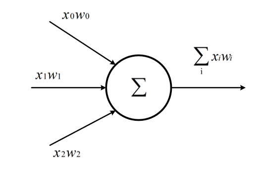
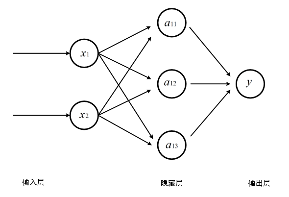
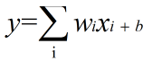

### 一、神经网络基本概念
##### 人工智能发展史

人工智能发展定义：
####三个层面
####第一个层面，人们对人工智能的期待可以分为：
1.智能地把某件特定的事情做好，在某个领域增强人类的智慧，这种方式又叫做智能增强。
2.像人类一样能认知，思考，判断：模拟人类的智能。
####第二个层面，从技术的特点来看。
如果一个程序解决任务（T）的效能（用P表示）随着经验（E）得到了提高，那么，这个程序就能从经验（E）中学到了关于任务（T）的知识，并让衡量值（P）得到提高。^{[2]} 
[2]
 

选择一个模型结构（例如逻辑回归，决策树等），这就是上面说的程序。
用训练数据（输入和输出）输入模型。这就是上面的经验（E）。
通过不断执行任务（T）并衡量结果（P），让P
不断提高，直到达到一个满意的值。
####第三个层面，从应用的角度来看，我们看到狭义人工智能在各个领域都取得了很大的成果
翻译领域（微软的中英翻译超过人类）
阅读理解（SQuAD 比赛）
下围棋（2016）德州扑克（2019）麻将（2019）#一、反向传播
反向传播定义：我们使用神经网络时，我们输入某个向量x，然后网络产生一个输出y，这个输入向量通过每一层隐含层，直到输出层。这个方向的流动叫做正向传播。然后，代价通过反向算法返回到网络中，调整权重并计算梯度
####范式演化的四个阶段
- 经验
- 理论
- 计算仿真
- 数据探索
#### 神经网络的概述
##### 神经元基本定义
##### 1.神经元
它是神经网络的基本单位。它获得一定数量的输入和一个偏置值。当信号值到达时会乘以一个权值。如果神经元有4个输入，那么就有4个权值，权重可以在训练时调整。
##### 2、连接
将一个神经元连接到另一层或同一层的另一个神经元。连接伴随着与之相关联的权值。训练的目标是更新此权值以减少损失（即错误）。
##### 3、偏移
它是神经元的额外输入，它始终为1，并具有自己的连接权重。这确保即使所有的输入都为空（全部为0），神经元也会激活。
##### 4、传递函数
激活函数用于将非线性引入神经网络。我们可以把它看作格式化输出结果，将结果变成我们可以使用的一种符号或者数字。
##### 5、输入层 
神经网络中的第一层。它需要输入信号（值）并将它们传递到下一层。它不对输入信号（值）做任何操作，并且没有关联的权重和偏置值。
##### 官方定义
神经网络是一种运算模型，由大量的节点（或称神经元）之间相互联接构成。每个节点代表一种特定的输出函数，称为激励函数（activation function）。每两个节点间的连接都代表一个对于通过该连接信号的加权值，称之为权重，这相当于人工神经网络的记忆。网络的输出则依网络的连接方式，权重值和激励函数的不同而不同。而网络自身通常都是对自然界某种算法或者函数的逼近，也可能是对一种逻辑策略的表达。
##### 神经网络的训练
神经元是构成神经网络的最小单位，神经元的结构如下

一个神经元可以有多个输入和一个输出，每个神经元的输入既可以是其他神经元的输出，也可以是整个神经网络的输入。

上图的简单神经元的所有输出即是所有神经元的输入加权和，不同输入的权重就是神经元参数，神经网络的优化过程就是优化神经元参数取值的过程。
三层连接全神经网络

##### 线性模型
如果模型的输出为输入的加权和，输出y和输入xi满足如下关系，则这个模型就是线性模型

wi,b∈R是模型的参数，当输入只有一个的时候x和y就形成了一个二维坐标系的一条直线。
当有n输入时，就是一个n+1维空间的平面。

在现实世界中，绝大部分问题是无法线性分割的。如果我们不运用激活函数的话，则输出信号将仅仅是一个简单的线性函数。
我们需要激活函数帮助我们理解和学习其他复杂类型的数据。
##### 反向传播算法
反向传播算法实现了一个迭代的过程，每次迭代开始的时候，先取一部分训练数据，通过前向传播算法
得到神经网络的预测结果。因为训练数据都有正确的答案，所以可以计算出预测结果和正确答案之间的差距。
基于这个差距，反向传播算法会相应的更新神经网络参数的取值，使得和真实答案更加接近。

##### 一、反向传播
反向传播定义：我们使用神经网络时，我们输入某个向量x，然后网络产生一个输出y，这个输入向量通过每一层隐含层，直到输出层。这个方向的流动叫做正向传播。然后，代价通过反向算法返回到网络中，调整权重并计算梯度
#####1、线性反向传播
#####2、非线性反向传播
#####二、梯度下降
基本定义：梯度下降是迭代法的一种,可以用于求解最小二乘问题(线性和非线性都可以)。在求解机器学习算法的模型参数，即无约束优化问题时，梯度下降（Gradient Descent）是最常采用的方法之一。在机器学习中，基于基本的梯度下降法发展了两种梯度下降方法，分别为随机梯度下降法和批量梯度下降法。
梯度下降的目的：梯度下降的目的就是使得x值向极值点逼近。
#####三、损失函数
基本定义：如果我们把神经网络的参数调整到完全满足独立样本的输出误差为 00，通常会令其它样本的误差变得更大，这样作为误差之和的损失函数值，就会变得更大。所以，我们通常会在根据某个样本的误差调整权重后，计算一下整体样本的损失函数值，来判定网络是不是已经训练到了可接受的状态。
损失函数的作用：损失函数的作用，就是计算神经网络每次迭代的前向计算结果与真实值的差距，从而指导下一步的训练向正确的方向进行。
使用步骤：
1.用随机值初始化前向计算公式的参数；
2.代入样本，计算输出的预测值；
3.用损失函数计算预测值和标签值（真实值）的误差；
4.根据损失函数的导数，沿梯度最小方向将误差回传，修正前向计 算公式中的各个权重值；
5.进入第2步重复, 直到损失函数值达到一个满意的值就停止迭代。
####均方差损失函数
基本定义：该函数就是最直观的一个损失函数了，计算预测值和真实值之间的欧式距离。预测值和真实值越接近，两者的均方差就越小。

####交叉熵损失函数
基本定义：交叉熵（Cross Entropy）是Shannon信息论中一个重要概念，主要用于度量两个概率分布间的差异性信息。
####为什么不能使用均方差做为分类问题的损失函数？
1、回归问题通常用均方差损失函数，可以保证损失函数是个凸函数，即可以得到最优解。而分类问题如果用均方差的话，损失函数的表现不是凸函数，就很难得到最优解。而交叉熵函数可以保证区间内单调。

2、分类问题的最后一层网络，需要分类函数，Sigmoid或者Softmax，如果再接均方差函数的话，其求导结果复杂，运算量比较大。用交叉熵函数的话，可以得到比较简单的计算结果，一个简单的减法就可以得到反向误差。

####相对熵
相对熵又称KL散度，如果我们对于同一个随机变量 $x$ 有两个单独的概率分布 $P(x)$ 和 $Q(x)$，我们可以使用 KL 散度（Kullback-Leibler (KL) divergence）来衡量这两个分布的差异，这个相当于信息论范畴的均方差。

KL散度的计算公式：

$$D_{KL}(p||q)=\sum_{j=1}^n p(x_j) \ln{p(x_j) \over q(x_j)} \tag{4}$$

$n$ 为事件的所有可能性。$D$ 的值越小，表示 $q$ 分布和 $p$ 分布越接近。

####交叉熵
把上述公式变形：

$$
\begin{aligned}  
D_{KL}(p||q)&=\sum_{j=1}^n p(x_j) \ln{p(x_j)} - \sum_{j=1}^n p(x_j) \ln q(x_j) \\\\
&=- H(p(x)) + H(p,q) 
\end{aligned}
\tag{5}
$$

等式的前一部分恰巧就是 $p$ 的熵，等式的后一部分，就是交叉熵：

$$H(p,q) =- \sum_{j=1}^n p(x_j) \ln q(x_j) \tag{6}$$

##总结：在这次的学习中，我深入的了解到人工智能的发展，知道了神经网络的算法学习，在不断的学习过程中，我知道了人工智能的发展历程，带我进入了一个新的AL人工智能世界。通过这次课的学习，我学习到了神经网络的基本概念，掌握到了神经网络的基础知识。在这次课上我明白了神经网络的基本工作原理，并通过基本的数学导数公式，明白了反向传播与梯度下降的过程。在后面的学习中，我弄清楚了线性反向传播与非线性反向传播的区别，进一步加深了我对神经网络这门课的认识。 神经网络这门课需要具备较强的数学与逻辑思维能力，前面的知识是一些基础的概念，我会认真复习巩固的，为后面更深入的学习打下坚实的基础。通过老师的详细讲解以及网上的教学视频的结合，我神经网络这个词有了深入的理解，我明白了"神经网络"就是模拟人的神经网络进行思维与学习，它具备深入学习的能力，是一种模拟人脑的神经网络以期能够实现类人工智能的机器学习技术，同时它是深度学习的基础。我会在老师的讲解中，认真学习这门课，并掌握这一门强大的机器学习方法，同时也更好地理解深度学习技术。
##线性回归与线性分类
对于线性回归模型，有如下一些概念需要了解：

- 通常假定随机误差 $\varepsilon$ 的均值为 $0$，方差为$σ^2$（$σ^2>0$，$σ^2$ 与 $X$ 的值无关）
- 若进一步假定随机误差遵从正态分布，就叫做正态线性模型
- 一般地，若有 $k$ 个自变量和 $1$ 个因变量（即公式1中的 $Y$），则因变量的值分为两部分：一部分由自变量影响，即表示为它的函数，函数形式已知且含有未知参数；另一部分由其他的未考虑因素和随机性影响，即随机误差
- 当函数为参数未知的线性函数时，称为线性回归分析模型
- 当函数为参数未知的非线性函数时，称为非线性回归分析模型
- 当自变量个数大于 $1$ 时称为多元回归
- 当因变量个数大于 $1$ 时称为多重回归

我们通过对数据的观察，可以大致认为它符合线性回归模型的条件，于是列出了公式1，不考虑随机误差的话，我们的任务就是找到合适的 $a,b$，这就是线性回归的任务。

图4-2 线性回归和非线性回归的区别

如图4-2所示，左侧为线性模型，可以看到直线穿过了一组三角形所形成的区域的中心线，并不要求这条直线穿过每一个三角形。右侧为非线性模型，一条曲线穿过了一组矩形所形成的区域的中心线。在本章中，我们先学习如何解决左侧的线性回归问题。

我们接下来会用几种方法来解决这个问题：

1. 最小二乘法；
2. 梯度下降法；
3. 简单的神经网络法；
4. 更通用的神经网络算法。
回归任务中常用的手段：
$$
J = \frac{1}{2m}\sum_{i=1}^m(z_i-y_i)^2 = \frac{1}{2m}\sum_{i=1}^m(y_i-wx_i-b)^2 \tag{3}
$$

神经网络做线性拟合的原理，即：

1. 初始化权重值
2. 根据权重值放出一个解
3. 根据均方差函数求误差
4. 误差反向传播给线性计算部分以调整权重值
5. 是否满足终止条件？不满足的话跳回2

##### 单样本随机梯度下降
特点
  
  - 训练样本：每次使用一个样本数据进行一次训练，更新一次梯度，重复以上过程。
  - 优点：训练开始时损失值下降很快，随机性大，找到最优解的可能性大。
  - 缺点：受单个样本的影响最大，损失函数值波动大，到后期徘徊不前，在最优解附近震荡。不能并行计算。
#####小批量样本梯度下降
特点

  - 训练样本：选择一小部分样本进行训练，更新一次梯度，然后再选取另外一小部分样本进行训练，再更新一次梯度。
  - 优点：不受单样本噪声影响，训练速度较快。
  - 缺点：batch size的数值选择很关键，会影响训练结果。
#####全批量样本梯度下降 
特点

  - 训练样本：每次使用全部数据集进行一次训练，更新一次梯度，重复以上过程。
  - 优点：受单个样本的影响最小，一次计算全体样本速度快，损失函数值没有波动，到达最优点平稳。方便并行计算。
  - 缺点：数据量较大时不能实现（内存限制），训练过程变慢。初始值不同，可能导致获得局部最优解，并非全局最优解。

#####回归问题可以分为线性回归和逻辑回归，逻辑回归又叫分类器，分类器又分为线性分类器和非线性分类器。然后线性分类器和非线性分类器又分为二分类问题和多分类问题。

####逻辑回归的优点
- 把线性回归的成功经验引入到分类问题中，相当于对“分界线”的预测进行建模，而“分界线”在二维空间上是一条直线，这就不需要考虑具体样本的分布（比如在二维空间上的坐标位置），避免了假设分布不准确所带来的问题；
- 不仅预测出类别（0/1），而且得到了近似的概率值（比如0.31或0.86），这对许多需要利用概率辅助决策的任务很有用；
- 对率函数是任意阶可导的凸函数，有很好的数学性，许多数值优化算法都可以直接用于求取最优解。

####二分类代数的原理
代数方式：通过一个分类函数计算所有样本点在经过线性变换后的概率值，使得正例样本的概率大于0.5，而负例样本的概率小于0.5。
####二分类函数的几何原理
几何方式：让所有正例样本处于直线的一侧，所有负例样本处于直线的另一侧，直线尽可能处于两类样本的中间。

####线性多分类与非线性多分类的区别
区别在于不同类别的样本点之间是否可以用一条直线来互相分割。对神经网络来说，线性多分类可以使用单层结构来解决，而分线性多分类需要使用双层结构。
####多分类问题的解法
1.一对一方式
2.一对多方式
3.多对多方式

####通过神经网络精确地找到这两条分界线
- 从视觉上判断是线性可分的，所以我们使用单层神经网络即可
- 输入特征有两个，分别为经度、纬度
- 最后输出的是三个分类，分别是魏蜀吴，所以输出层有三个神经元
##总结：
##本次课我学习了线性回归在神经网络中的应用，通过学习单变量线性回归的问题，我又了解到了几种将要研究问题转换为线性回归问题的方：① 最小二乘法② 梯度下降法③ 简单的神经网络法④ 更通用的神经网络算法。从这些方法的基本原理和python实现方面，我基本明白了这些方法的实现过程。另外一节课，老师讲解了梯度下降的三种形式，即最小二乘法、梯度下降法、神经网络法。其中，神将网络法是我们重点需要掌握的，神经网络法使用一个崭新的编程模型，即以神经元为中心的代码结构设计，它对我们学习神经网络是很有用的。数据归一化是深度学习的必要步骤之一，将普通问题的数值归一是解决神经网络问题的重要之处，这样便于我们更好的研究问题。
##在这一次课的学习中，我弄清楚了神经网络中的线性分类问题，神经网络的一个重要功能就是分类，现实世界中的分类任务复杂多样，但万变不离其宗，我们都可以用同一种模式的神经网络来处理。这足以可见分类问题在神经网络中的重要作用，本次课老师主要讲解了线性二分类的原理，实现，训练过程，推理过程等等，在线性多分类问题中主要讲解了一对一、一对多、多对多的问题，以及多分类函数softmax的作用。总的来说，本次课来说主要为我们讲解了神经网络中的一个重要问题---分类。解决了分类问题，可以说解决了一个大问题，这也是为什么分类在神经网络中非常重要。
##通过这次课的学习，我对神经网络仿佛更感兴趣了，神经网络的研究是当今的热点，这是一门前沿的技术，虽然有时候我对其中的一些知识并不是很懂，但通过一些网络资料，我渐渐明白了，很多的数学知识是比较抽象的，要理解还是需要一定的数学基础，所以我觉得有一个好的数学功底是非常重要的。但是我会不断加强自己的数学基础，为学好这门课做好铺垫。
#####非线性回归
#####激活函数的基本作用

图8-1是神经网络中的一个神经元，假设该神经元有三个输入，分别为$x_1,x_2,x_3$，那么：

$$z=x_1 w_1 + x_2 w_2 + x_3 w_3 +b \tag{1}$$
$$a = \sigma(z) \tag{2}$$

图8-1 激活函数在神经元中的位置

激活函数也就是 $a=\sigma(z)$ 这一步了，他有什么作用呢？

1. 给神经网络增加非线性因素，这个问题在第1章神经网络基本工作原理中已经讲过了；
2. 把公式1的计算结果压缩到 $[0,1]$ 之间，便于后面的计算。

激活函数的基本性质：

+ 非线性：线性的激活函数和没有激活函数一样；
+ 可导性：做误差反向传播和梯度下降，必须要保证激活函数的可导性；
+ 单调性：单一的输入会得到单一的输出，较大值的输入得到较大值的输出。
单层的神经网络的参数与功能

|网络|输入|输出|激活函数|分类函数|功能|
|---|---|---|---|---|---|
|单层|单变量|单输出|无|无|线性回归|
|单层|多变量|单输出|无|无|线性回归|
|单层|多变量|单输出|无|二分类函数|二分类|
|单层|多变量|多输出|无|多分类函数|多分类|

从上表可以看到，我们一直没有使用激活函数，而只使用了分类函数。对于多层神经网络也是如此，在最后一层只会用到分类函数来完成二分类或多分类任务，如果是拟合任务，则不需要分类函数。

简言之：

1. 神经网络最后一层不需要激活函数
2. 激活函数只用于连接前后两层神经网络
#####注：1. 神经网络最后一层不需要激活函数           2. 激活函数只用于连接前后两层神经网络

#####Logistic函数
#### 公式

$$Sigmoid(z) = \frac{1}{1 + e^{-z}} \rightarrow a \tag{1}$$

#### 导数

$$Sigmoid'(z) = a(1 - a) \tag{2}$$

注意，如果是矩阵运算的话，需要在公式2中使用$\odot$符号表示按元素的矩阵相乘：$a\odot (1-a)$，后面不再强调。

推导过程如下：

令：$u=1,v=1+e^{-z}$ 则：

$$
\begin{aligned}
Sigmoid'(z)&= (\frac{u}{v})'=\frac{u'v-v'u}{v^2} \\\\
&=\frac{0-(1+e^{-z})'}{(1+e^{-z})^2}=\frac{e^{-z}}{(1+e^{-z})^2} \\\\
&=\frac{1+e^{-z}-1}{(1+e^{-z})^2}=\frac{1}{1+e^{-z}}-(\frac{1}{1+e^{-z}})^2 \\\\
&=a-a^2=a(1-a)
\end{aligned}
$$

#### 值域

- 输入值域：$(-\infty, \infty)$
- 输出值域：$(0,1)$
- 导数值域：$(0,0.25]$

#### 函数图像

图8-3 Sigmoid函数图像

#### 优点

从函数图像来看，Sigmoid函数的作用是将输入压缩到 $(0,1)$ 这个区间范围内，这种输出在0~1之间的函数可以用来模拟一些概率分布的情况。它还是一个连续函数，导数简单易求。  

从数学上来看，Sigmoid函数对中央区的信号增益较大，对两侧区的信号增益小，在信号的特征空间映射上，有很好的效果。 

从神经科学上来看，中央区酷似神经元的兴奋态，两侧区酷似神经元的抑制态，因而在神经网络学习方面，可以将重点特征推向中央区，
将非重点特征推向两侧区。

#### Tanh函数
#### 公式  
$$Tanh(z) = \frac{e^{z} - e^{-z}}{e^{z} + e^{-z}} = (\frac{2}{1 + e^{-2z}}-1) \rightarrow a \tag{3}$$
即
$$Tanh(z) = 2 \cdot Sigmoid(2z) - 1 \tag{4}$$

#### 导数公式

$$Tanh'(z) = (1 + a)(1 - a)$$

利用基本导数公式23，令：$u={e^{z}-e^{-z}}，v=e^{z}+e^{-z}$ 则有：

$$
\begin{aligned}
Tanh'(z)&=\frac{u'v-v'u}{v^2} \\\\
&=\frac{(e^{z}-e^{-z})'(e^{z}+e^{-z})-(e^{z}+e^{-z})'(e^{z}-e^{-z})}{(e^{z}+e^{-z})^2} \\\\
&=\frac{(e^{z}+e^{-z})(e^{z}+e^{-z})-(e^{z}-e^{-z})(e^{z}-e^ {-z})}{(e^{z}+e^{-z})^2} \\\\
&=\frac{(e^{z}+e^{-z})^2-(e^{z}-e^{-z})^2}{(e^{z}+e^{-z})^2} \\\\
&=1-(\frac{(e^{z}-e^{-z}}{e^{z}+e^{-z}})^2=1-a^2
\end{aligned}
$$

#### 值域

- 输入值域：$(-\infty,\infty)$
- 输出值域：$(-1,1)$
- 导数值域：$(0,1)$

#### 函数图像

图8-4是双曲正切的函数图像。

图8-4 双曲正切函数图像

#### 优点

具有Sigmoid的所有优点。

无论从理论公式还是函数图像，这个函数都是一个和Sigmoid非常相像的激活函数，他们的性质也确实如此。但是比起Sigmoid，Tanh减少了一个缺点，就是他本身是零均值的，也就是说，在传递过程中，输入数据的均值并不会发生改变，这就使他在很多应用中能表现出比Sigmoid优异一些的效果。

#### 缺点

exp指数计算代价大。梯度消失问题仍然存在。

####ReLU函数 

Rectified Linear Unit，修正线性单元，线性整流函数，斜坡函数。

#### 公式

$$ReLU(z) = max(0,z) = \begin{cases} 
  z, & z \geq 0 \\\\ 
  0, & z < 0 
\end{cases}$$

#### 导数

$$ReLU'(z) = \begin{cases} 1 & z \geq 0 \\\\ 0 & z < 0 \end{cases}$$

#### 值域

- 输入值域：$(-\infty, \infty)$
- 输出值域：$(0,\infty)$
- 导数值域：$\\{0,1\\}$

图8-6 线性整流函数ReLU

优点

- 反向导数恒等于1，更加有效率的反向传播梯度值，收敛速度快；
- 避免梯度消失问题；
- 计算简单，速度快；
- 活跃度的分散性使得神经网络的整体计算成本下降。

#### 缺点

无界。

梯度很大的时候可能导致的神经元“死”掉。

### 8.2.2 Leaky ReLU函数

LReLU，带泄露的线性整流函数。

#### 公式

$$LReLU(z) = \begin{cases} z & z \geq 0 \\\\ \alpha \cdot z & z < 0 \end{cases}$$

#### 导数

$$LReLU'(z) = \begin{cases} 1 & z \geq 0 \\\\ \alpha & z < 0 \end{cases}$$

#### 值域

输入值域：$(-\infty, \infty)$

输出值域：$(-\infty,\infty)$

导数值域：$\\{\alpha,1\\}$
#### 优点

继承了ReLU函数的优点。

Leaky ReLU同样有收敛快速和运算复杂度低的优点，而且由于给了$z<0$时一个比较小的梯度$\alpha$,使得$z<0$时依旧可以进行梯度传递和更新，可以在一定程度上避免神经元“死”掉的问题。
### 8.2.3 Softplus函数

#### 公式

$$Softplus(z) = \ln (1 + e^z)$$

#### 导数

$$Softplus'(z) = \frac{e^z}{1 + e^z}$$

#### 

输入值域：$(-\infty, \infty)$

输出值域：$(0,\infty)$

导数值域：$(0,1)$

### 8.2.4 ELU函数

#### 公式

$$ELU(z) = \begin{cases} z & z \geq 0 \\ \alpha (e^z-1) & z < 0 \end{cases}$$

#### 导数

$$ELU'(z) = \begin{cases} 1 & z \geq 0 \\ \alpha e^z & z < 0 \end{cases}$$

#### 值域

输入值域：$(-\infty, \infty)$

输出值域：$(-\alpha,\infty)$

导数值域：$(0,1]$

#### 平均绝对误差

MAE（Mean Abolute Error）。

$$MAE=\frac{1}{m} \sum_{i=1}^m \lvert a_i-y_i \rvert \tag{1}$$

对异常值不如均方差敏感，类似中位数。

#### 绝对平均值率误差

MAPE（Mean Absolute Percentage Error）。

$$MAPE=\frac{100}{m} \sum^m_{i=1} \left\lvert {a_i - y_i \over y_i} \right\rvert \tag{2}$$

#### 和方差

SSE（Sum Squared Error）。

$$SSE=\sum_{i=1}^m (a_i-y_i)^2 \tag{3}$$

得出的值与样本数量有关系，假设有1000个测试样本，得到的值是120；如果只有100个测试样本，得到的值可能是11，我们不能说11就比120要好。

#### 均方差

MSE（Mean Squared Error）。

$$MSE = \frac{1}{m} \sum_{i=1}^m (a_i-y_i)^2 \tag{4}$$

就是实际值减去预测值的平方再求期望，没错，就是线性回归的代价函数。由于MSE计算的是误差的平方，所以它对异常值是非常敏感的，因为一旦出现异常值，MSE指标会变得非常大。MSE越小，证明误差越小。

#### 均方根误差

RMSE（Root Mean Squard Error）。

$$RMSE = \sqrt{\frac{1}{m} \sum_{i=1}^m (a_i-y_i)^2} \tag{5}$$

是均方差开根号的结果，其实质是一样的，只不过对结果有更好的解释。

####R-Squared。

$$R^2=1-\frac{\sum (a_i - y_i)^2}{\sum(\bar y_i-y_i)^2}=1-\frac{MSE(a,y)}{Var(y)} \tag{6}$$

### 9.4.1 万能近似定理

万能近似定理(universal approximation theorem) $^{[1]}$，是深度学习最根本的理论依据。它证明了在给定网络具有足够多的隐藏单元的条件下，配备一个线性输出层和一个带有任何“挤压”性质的激活函数（如Sigmoid激活函数）的隐藏层的前馈神经网络，能够以任何想要的误差量近似任何从一个有限维度的空间映射到另一个有限维度空间的Borel可测的函数。

前馈网络的导数也可以以任意好地程度近似函数的导数。

万能近似定理其实说明了理论上神经网络可以近似任何函数。但实践上我们不能保证学习算法一定能学习到目标函数。即使网络可以表示这个函数，学习也可能因为两个不同的原因而失败：

1. 用于训练的优化算法可能找不到用于期望函数的参数值；
2. 训练算法可能由于过拟合而选择了错误的函数。
### 9.6.2 神经网络的非线性拟合工作原理
我们以正弦曲线的例子来讲解神经网络非线性回归的工作过程和原理。
表9-14
|单层多项式回归|双层神经网络|
|---|---|
|||

比较一下表9-14中的两张图，左侧为单特征多项式拟合的示意图，右侧为双层神经网络的示意图。

左图中，通过人为的方式，给Z的输入增加了$x^2和x^3$项。

右图中，通过线性变换的方式，把x变成了两部分：$z_{11}/a_{11}，z_{12}/a_{12}$，然后再通过一次线性变换把两者组合成为Z，这种方式和多项式回归非常类似：

1. 隐层把x拆成不同的特征，根据问题复杂度决定神经元数量，神经元的数量相当于特征值的数量；
2. 隐层通过激活函数做一次非线性变换；
3. 输出层使用多变量线性回归，把隐层的输出当作输入特征值，再做一次线性变换，得出拟合结果。

 第一步 把X拆成两个线性序列z1和z2
 第二步 计算z1的激活函数值a1
 第三步 计算z2的激活函数值a2
 第四步 计算Z值

 ### 9.6.3 比较多项式回归和双层神经网络解法

表9-20列出了多项式回归和神经网络的比较结果，可以看到神经网络处于绝对的优势地位。

表9-20 多项式回归和神经网络的比较

||多项式回归|双层神经网络|
|---|---|---|
|特征提取方式|特征值的高次方|线性变换拆分|
|特征值数量级|高几倍的数量级|数量级与原特征值相同|
|训练效率|低，需要迭代次数多|高，比前者少好几个数量级|
## 9.7 超参数优化的初步认识

超参数优化（Hyperparameter Optimization）主要存在两方面的困难：

1. 超参数优化是一个组合优化问题，无法像一般参数那样通过梯度下降方法来优化，也没有一种通用有效的优化方法。
2. 评估一组超参数配置（Configuration）的时间代价非常高，从而导致一些优化方法（比如演化算法）在超参数优化中难以应用。

##总结：这次课老师主要为我们讲解了两层神经网络的学习，在两层神经网络之间，必须有激活函数连接，从而加入非线性因素，提高神经网络的能力。所以，我们先从激活函数学起，一类是挤压型的激活函数，常用于简单网络的学习；另一类是半线性的激活函数，常用于深度网络的学习。然后，我们又学习了生活中非线性问题的解决方法--非线性回归，另外用一些回归方法去拟合一些曲线。非线性问题在工程实践中比较常见，所以这次课我学到了用线性回归的方法去解决这个问题，这就体现出了神经网络的作用，它能为我们解决一些常见的难题。
##非线性分类
####非线性二分类实现
#####定义神经网络结构

首先定义可以完成非线性二分类的神经网络结构图，如图10-6所示。

对于一般的用于二分类的双层神经网络可以是图10-7的样子。

图10-7 通用的二分类神经网络结构图

输入特征值可以有很多，隐层单元也可以有很多，输出单元只有一个，且后面要接Logistic分类函数和二分类交叉熵损失函数。
#####实现逻辑异或门
我们覆盖了父类中的三个方法：

- `init()` 初始化方法：因为父类的初始化方法要求有两个参数，代表train/test数据文件
- `ReadData()`方法：父类方法是直接读取数据文件，此处直接在内存中生成样本数据，并且直接令训练集等于原始数据集（不需要归一化），令测试集等于训练集
- `GenerateValidationSet()`方法，由于只有4个样本，所以直接令验证集等于训练集

因为`NeuralNet2`中的代码要求数据集比较全，有训练集、验证集、测试集，为了已有代码能顺利跑通，我们把验证集、测试集都设置成与训练集一致，对于解决这个异或问题没有什么影响。
#####两层网络神经的可视化
##### 可视化分类结果
##### 显示原始数据
1. 首先是从Level_XorGateClassifier中导入所有内容，省去了我们重新写数据准备部分的代码的麻烦
2. 获得所有分类为1的训练样本，用红色叉子显示在画板上
3. 获得所有分类为0的训练样本，用蓝色圆点显示在画板上

##### 显示推理的中间结果
1. 先用测试样本做一次推理；
2. Z1是第一层神经网络线性变换的结果，由于Z1是一个4行两列的数组，我们以Z1的第1列作为x1，以Z1的第2列作为x2，画出4个点来；
3. A1是Z1经过激活函数后的结果，同Z1一样作为4个点画出来；
4. Z2是第二层神经网络线性变换的结果，A2是Z2的Logistic Function的运算结果，以Z2为x1，A2为x2，画出4个点来，并叠加Logistic函数图像，看是否吻合。
##### 非线性多分类实现
设计出能完成非线性多分类的网络结构，如图11-2所示。

根据网络结构，可以绘制前向计算图，如图11-3所示。

根据前向计算图，可以绘制出反向传播的路径如图11-4。

训练过程如图11-5所示。

分类结果如图11-6所示。

##### 11.3.2 如何解决样本不平衡问题
#### 1.平衡数据集
- 考虑对大类下的样本（超过1万、十万甚至更多）进行欠采样，即删除部分样本；
- 考虑对小类下的样本（不足1万甚至更少）进行过采样，即添加部分样本的副本；
- 考虑尝试随机采样与非随机采样两种采样方法；
- 考虑对各类别尝试不同的采样比例，比一定是1:1，有时候1:1反而不好，因为与现实情况相差甚远；
- 考虑同时使用过采样（over-sampling）与欠采样（under-sampling）。
#### 2.尝试其它评价指标 
#### 3.尝试产生人工数据样本 
#### 4.尝试一个新的角度理解问题
#### 5.修改现有算法
#### 6.集成学习
1. 首先使用原始数据集训练第一个学习器L1；
2. 然后使用50%在L1学习正确和50%学习错误的那些样本训练得到学习器L2，即从L1中学习错误的样本集与学习正确的样本集中，循环一边采样一个；
3. 接着，使用L1与L2不一致的那些样本去训练得到学习器L3；
4. 最后，使用投票方式作为最后输出。 
####三层神经网络的实现
为了完成MNIST分类，我们需要设计一个三层神经网络结构，如图：

#####梯度学习算法

1. 初始化神经网络的所有矩阵参数（可以使用随机初始化或其它非0的初始化方法）
2. 把所有层的$W,B$都转化成向量，按顺序存放在$\theta$中
3. 随机设置$X$值，最好是归一化之后的值，在[0,1]之间
4. 做一次前向计算，再紧接着做一次反向计算，得到各参数的梯度$d\theta_{real}$
5. 把得到的梯度$d\theta_{real}$变化成向量形式，其尺寸应该和第2步中的$\theta$相同，且一一对应（$W$对应$dW$, $B$对应$dB$）
6. 对2中的$\theta$向量中的每一个值，做一次双边逼近，得到$d\theta_{approx}$
7. 比较$d\theta_{real}$和$d\theta_{approx}$的值，通过计算两个向量之间的欧式距离：
   
$$diff = \frac{\parallel d\theta_{real} - d\theta_{approx}\parallel_2}{\parallel d\theta_{approx}\parallel_2 + \parallel d\theta_{real}\parallel_2}$$
### 12.2.5 注意事项

1. 首先，不要使用梯度检验去训练，即不要使用梯度检验方法去计算梯度，因为这样做太慢了，在训练过程中，我们还是使用backprop去计算参数梯度，而使用梯度检验去调试，去检验backprop的过程是否准确。

2. 其次，如果我们在使用梯度检验过程中发现backprop过程出现了问题，就需要对所有的参数进行计算，以判断造成计算偏差的来源在哪里，它可能是在求解$B$出现问题，也可能是在求解某一层的$W$出现问题，梯度检验可以帮助我们确定发生问题的范围，以帮助我们调试。

3. 别忘了正则化。如果我们添加了二范数正则化，在使用backprop计算参数梯度时，不要忘记梯度的形式已经发生了变化，要记得加上正则化部分，同理，在进行梯度检验时，也要记得目标函数$J$的形式已经发生了变化。

4. 注意，如果我们使用了drop-out正则化，梯度检验就不可用了。为什么呢？因为我们知道drop-out是按照一定的保留概率随机保留一些节点，因为它的随机性，目标函数$J$的形式变得非常不明确，这时我们便无法再用梯度检验去检验backprop。如果非要使用drop-out且又想检验backprop，我们可以先将保留概率设为1，即保留全部节点，然后用梯度检验来检验backprop过程，如果没有问题，我们再改变保留概率的值来应用drop-out。

5. 最后，介绍一种特别少见的情况。在刚开始初始化W和b时，W和b的值都还很小，这时backprop过程没有问题，但随着迭代过程的进行，$W$和$B$的值变得越来越大时，backprop过程可能会出现问题，且可能梯度差距越来越大。要避免这种情况，我们需要多进行几次梯度检验，比如在刚开始初始化权重时进行一次检验，在迭代一段时间之后，再使用梯度检验去验证backprop过程。
#####论文方法
1. 首先我们设置一个非常小的初始学习率，比如`1e-5`；
2. 然后在每个`batch`之后都更新网络，计算损失函数值，同时增加学习率；
3. 最后我们可以描绘出学习率的变化曲线和loss的变化曲线，从中就能够发现最好的学习率。
##总结：这次课老师主要为我们讲解了两层神经网络的学习，在两层神经网络之间，必须有激活函数连接，从而加入非线性因素，提高神经网络的能力。所以，我们先从激活函数学起，一类是挤压型的激活函数，常用于简单网络的学习；另一类是半线性的激活函数，常用于深度网络的学习。然后，我们又学习了生活中非线性问题的解决方法--非线性回归，另外用一些回归方法去拟合一些曲线。非线性问题在工程实践中比较常见，所以这次课我学到了用线性回归的方法去解决这个问题，这就体现出了神经网络的作用，它能为我们解决一些常见的难题。
##深度神经网络
#####回归任务模型搭建
这个模型很简单，一个双层的神经网络，第一层后面接一个Sigmoid激活函数，第二层直接输出拟合数据，如图14-2所示。

##### 网络优化

随着网络的加深，训练变得越来越困难，时间越来越长，原因可能是：

- 参数多
- 数据量大
- 梯度消失
- 损失函数坡度平缓

为了解决上面这些问题，科学家们在深入研究网络表现的前提下，发现在下面这些方向上经过一些努力，可以给深度网络的训练带来或多或少的改善：

- 权重矩阵初始化
- 批量归一化
- 梯度下降优化算法
- 自适应学习率算法
#### 种初始化方法的应用场景

|ID|网络深度|初始化方法|激活函数|说明|
|---|---|---|---|---|
|1|单层|零初始化|无|可以|
|2|双层|零初始化|Sigmoid|错误，不能进行正确的反向传播|
|3|双层|随机初始化|Sigmoid|可以|
|4|多层|随机初始化|Sigmoid|激活值分布成凹形，不利于反向传播|
|5|多层|Xavier初始化|Tanh|正确|
|6|多层|Xavier初始化|ReLU|激活值分布偏向0，不利于反向传播|
|7|多层|MSRA初始化|ReLU|正确|
#####数据处理过程
1. 数据在训练过程中，在网络的某一层会发生Internal Covariate Shift，导致数据处于激活函数的饱和区；
2. 经过均值为0、方差为1的变换后，位移到了0点附近。但是只做到这一步的话，会带来两个问题：
   
   a. 在[-1,1]这个区域，Sigmoid激活函数是近似线性的，造成激活函数失去非线性的作用；
   
   b. 在二分类问题中我们学习过，神经网络把正类样本点推向了右侧，把负类样本点推向了左侧，如果再把它们强行向中间集中的话，那么前面学习到的成果就会被破坏；

3. 经过$\gamma,\beta$的线性变换后，把数据区域拉宽，则激活函数的输出既有线性的部分，也有非线性的部分，这就解决了问题a；而且由于$\gamma,\beta$也是通过网络进行学习的，所以以前学到的成果也会保持，这就解决了问题b。
各个参数的含义和数据形状 

|符号|数据类型|数据形状|
|:---------:|:-----------:|:---------:|
|$X$| 输入数据矩阵 | [m, n] |
|$x_i$|输入数据第i个样本| [1, n] |
|$N$| 经过归一化的数据矩阵 | [m, n] |
|$n_i$| 经过归一化的单样本 | [1, n] |
|$\mu_B$| 批数据均值 | [1, n] |
|$\sigma^2_B$| 批数据方差 | [1, n] |
|$m$|批样本数量| [1] |
|$\gamma$|线性变换参数| [1, n] |
|$\beta$|线性变换参数| [1, n] |
|$Z$|线性变换后的矩阵| [1, n] |
|$z_i$|线性变换后的单样本| [1, n] |
|$\delta$| 反向传入的误差 | [m, n] |
批量归一化的优点

1. 可以选择比较大的初始学习率，让你的训练速度提高。
   
    以前还需要慢慢调整学习率，甚至在网络训练到一定程度时，还需要想着学习率进一步调小的比例选择多少比较合适，现在我们可以采用初始很大的学习率，因为这个算法收敛很快。当然这个算法即使你选择了较小的学习率，也比以前的收敛速度快，因为它具有快速训练收敛的特性；

2. 减少对初始化的依赖
   
    一个不太幸运的初始化，可能会造成网络训练实际很长，甚至不收敛。

3. 减少对正则的依赖
   
   在第16章中，我们将会学习正则化知识，以增强网络的泛化能力。采用BN算法后，我们会逐步减少对正则的依赖，比如令人头疼的dropout、L2正则项参数的选择问题，或者可以选择更小的L2正则约束参数了，因为BN具有提高网络泛化能力的特性；
##总结：本次课我学习到了深度神经网络的基础知识。首先，我学会了如何搭建深度神经网络框架，它有详细的步骤，在老师的讲解中，我逐渐明白了搭建的基本原理。另外，我又在老师的讲解中，做了回归任务功能测试，更进一步加深了我对深度神经网络的理解。在学习型中，我也学习到了著名的反向传播四大公式，它对我们理解神经网络有很大帮助。理论讲完后，我做完了二分类任务和多分类任务的案例运行，并进行了分析。为了给深度网络的训练带来改善，我又学习到了一些网络优化的方法，它对训练会带来很大的好处。
##卷积神经网络
####卷积神经网络的层级结构
层级结构：

1. 原始的输入是一张图片，可以是彩色的，也可以是灰度的或黑白的。这里假设是只有一个通道的图片，目的是识别0~9的手写体数字；
2. 第一层卷积，我们使用了4个卷积核，得到了4张feature map；激活函数层没有单独画出来，这里我们紧接着卷积操作使用了Relu激活函数；
3. 第二层是池化，使用了Max Pooling方式，把图片的高宽各缩小一倍，但仍然是4个feature map；
4. 第三层卷积，我们使用了4x6个卷积核，其中4对应着输入通道，6对应着输出通道，从而得到了6张feature map，当然也使用了Relu激活函数；
5. 第四层再次做一次池化，现在得到的图片尺寸只是原始尺寸的四分之一左右；
6. 第五层把第四层的6个图片展平成一维，成为一个fully connected层；
7. 第六层再接一个小一些的fully connected层；
8. 最后接一个softmax函数，判别10个分类。

所以，在一个典型的卷积神经网络中，会至少包含以下几个层：

- 卷积层
- 激活函数层
- 池化层
- 全连接分类层
卷积核的作用

|序号|名称|说明|
|---|---|---|
|1|锐化|如果一个像素点比周围像素点亮，则此算子会令其更亮|
|2|检测竖边|检测出了十字线中的竖线，由于是左侧和右侧分别检查一次，所以得到两条颜色不一样的竖线|
|3|周边|把周边增强，把同色的区域变弱，形成大色块|
|4|Sobel-Y|纵向亮度差分可以检测出横边，与横边检测不同的是，它可以使得两条横线具有相同的颜色，具有分割线的效果|
|5|Identity|中心为1四周为0的过滤器，卷积后与原图相同|
|6|横边检测|检测出了十字线中的横线，由于是上侧和下侧分别检查一次，所以得到两条颜色不一样的横线|
|7|模糊|通过把周围的点做平均值计算而“杀富济贫”造成模糊效果|
|8|Sobel-X|横向亮度差分可以检测出竖边，与竖边检测不同的是，它可以使得两条竖线具有相同的颜色，具有分割线的效果|
|9|浮雕|形成大理石浮雕般的效果|

- 平移不变性
  对于原始图A，平移后得到图B，对于同一个卷积核来说，都会得到相同的特征，这就是卷积核的权值共享。但是特征处于不同的位置，由于距离差距较大，即使经过多层池化后，也不能处于近似的位置。此时，后续的全连接层会通过权重值的调整，把这两个相同的特征看作同一类的分类标准之一。如果是小距离的平移，通过池化层就可以处理了。
- 旋转不变性
  对于原始图A，有小角度的旋转得到C，卷积层在A图上得到特征a，在C图上得到特征c，可以想象a与c的位置间的距离不是很远，在经过两层池化以后，基本可以重合。所以卷积网络对于小角度旋转是可以容忍的，但是对于较大的旋转，需要使用数据增强来增加训练样本。一个极端的例子是当6旋转90度时，谁也不能确定它到底是6还是9。
- 尺度不变性
  对于原始图A和缩小的图D，人类可以毫不费力地辨别出它们是同一个东西。池化在这里是不是有帮助呢？没有！因为神经网络对A做池化的同时，也会用相同的方法对D做池化，这样池化的次数一致，最终D还是比A小。如果我们有多个卷积视野，相当于从两米远的地方看图A，从一米远的地方看图D，那么A和D就可以很相近似了。这就是Inception的想法，用不同尺寸的卷积核去同时寻找同一张图片上的特征。
#### 卷积的数学定义
#### 连续定义
$$h(x)=(f*g)(x) = \int_{-\infty}^{\infty} f(t)g(x-t)dt \tag{1}$$
卷积与傅里叶变换有着密切的关系。利用这点性质，即两函数的傅里叶变换的乘积等于它们卷积后的傅里叶变换，能使傅里叶分析中许多问题的处理得到简化。
#### 离散定义
$$h(x) = (f*g)(x) = \sum^{\infty}_{t=-\infty} f(t)g(x-t) \tag{2}$$
####常用池化方法
池化 pooling，又称为下采样，downstream sampling or sub-sampling。
池化方法分为两种，一种是最大值池化 Max Pooling，一种是平均值池化 Mean/Average Pooling。如图

- 最大值池化，是取当前池化视野中所有元素的最大值，输出到下一层特征图中。
- 平均值池化，是取当前池化视野中所有元素的平均值，输出到下一层特征图中。
其目的是：
- 扩大视野：就如同先从近处看一张图片，然后离远一些再看同一张图片，有些细节就会被忽略
- 降维：在保留图片局部特征的前提下，使得图片更小，更易于计算
- 平移不变性，轻微扰动不会影响输出：比如上图中最大值池化的4，即使向右偏一个像素，其输出值仍为4
- 维持同尺寸图片，便于后端处理：假设输入的图片不是一样大小的，就需要用池化来转换成同尺寸图片
一般我们都使用最大值池化。
#### 循环神经网络概述
从前馈神经网络到循环神经网络的演化
1. 最左侧的是前馈神经网络的概括图，即，根据一个静态的输入数据x，经过隐层h的计算，最终得到结果a。这里的h是全连接神经网络或者卷积神经网络，a是回归或分类的结果。
2. 当遇到序列数据的问题后（假设时间步数为3），可以建立三个前馈神经网络来分别处理t=1、t=2、t=3的数据，即x1、x2、x3
3. 但是两个时间步之间是有联系的，于是在隐层h1、h2、h3之间建立了一条连接线，实际上是一个矩阵W
4. 根据序列数据的特性，可以扩充时间步的数量，在每个相邻的时间步之间都会有联系
####一对多的结构

####多对一结构

####多对多（输入输出等量）
这种结构要求输入的数据时间步的数量和输出的数据的时间步的数量相同。

#### 多对多（输入输出不等量）

这是循环神经网络最重要的一个变种，又叫做编码解码（Encoder-Decoder）模型，或者序列到序列（seqence to seqence）模型。

####GRU
GRU 的基本概念

LSTM 存在很多变体，其中门控循环单元（Gated Recurrent Unit, GRU）是最常见的一种，也是目前比较流行的一种。GRU是由 [Cho](https://arxiv.org/pdf/1406.1078v3.pdf) 等人在2014年提出的，它对LSTM做了一些简化：

1. GRU将LSTM原来的三个门简化成为两个：重置门 $r_t$（Reset Gate）和更新门 $z_t$ (Update Gate)。
2. GRU不保留单元状态 $c_t$，只保留隐藏状态 $h_t$作为单元输出，这样就和传统RNN的结构保持一致。
3. 重置门直接作用于前一时刻的隐藏状态 $h_{t-1}$。
##心得体会：
本次学习的卷积神经网络在神经网络技术中有着重要意义，这个技术的应用将使神经网络技术在AI里起到更多更全面的应用。卷积神经网络是深度学习中的一个里程碑式的技术，有了这个技术，才会让计算机有能力理解图片和视频信息，才会有计算机视觉的众多应用。这部分内容将会为我们逐步介绍卷积的前向计算、卷积的反向传播、池化的前向计算与反向传播，然后用代码实现一个卷积网络并训练一些实际数据。这次的学习可以说是让我游览了神经网络在各个领域的地位与应用，同样认识到卷积神经网络的技术也是建立在之前学习的基础上，若前面学习的内容没有熟练掌握的话学习起来也是很吃力的。本次学习就是对循环神经网络RNN的学习，通过mooc、案例及资料进行了更深层次的了解。这次的学习也是这门课程的最后学习，当然学习是还没有停下的，不一定是继续深入，也可以将当下所学习的内容进行练习再练习，能够熟练的掌握应用它还是有着一定难度的，而也只有熟练的应用了才能去探索，去创新学习，让自身更加的充实。
神经网络是让机器人更加接近于人类的不要条件，让机器人能够像我们一样去感知这个世界，从而可以帮助人类去探索人类所不能达到的世界并反馈给予我们。神经网络它的知识量所庞大是我们不知道的，但它的完成让人类的收益也是非常庞大的，所有今后的学习还不至于这一点，还需加油努力。