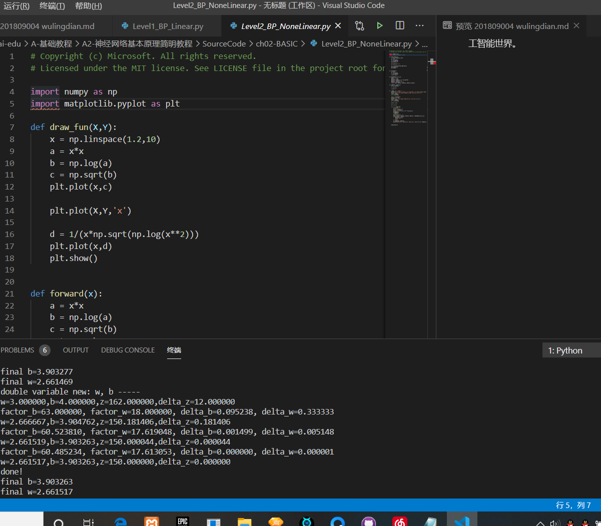
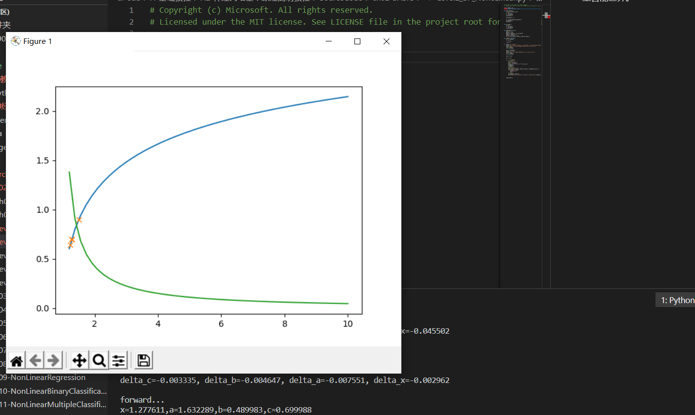
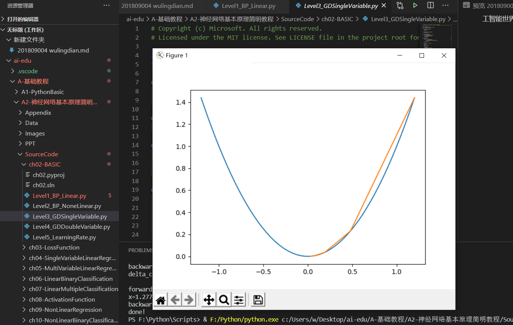
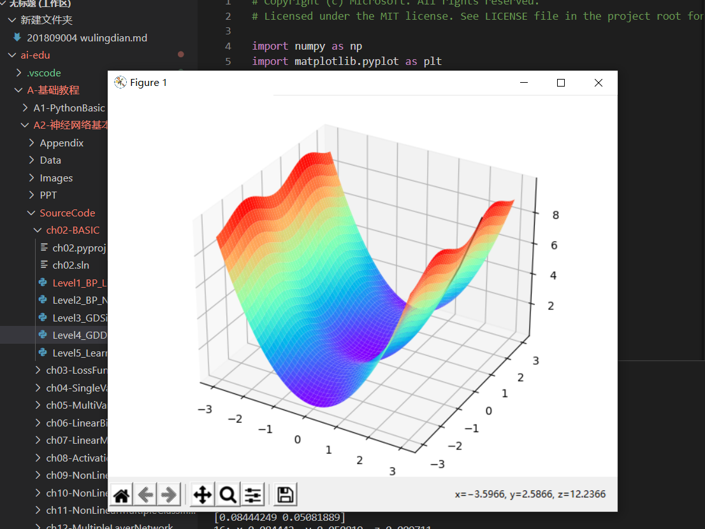
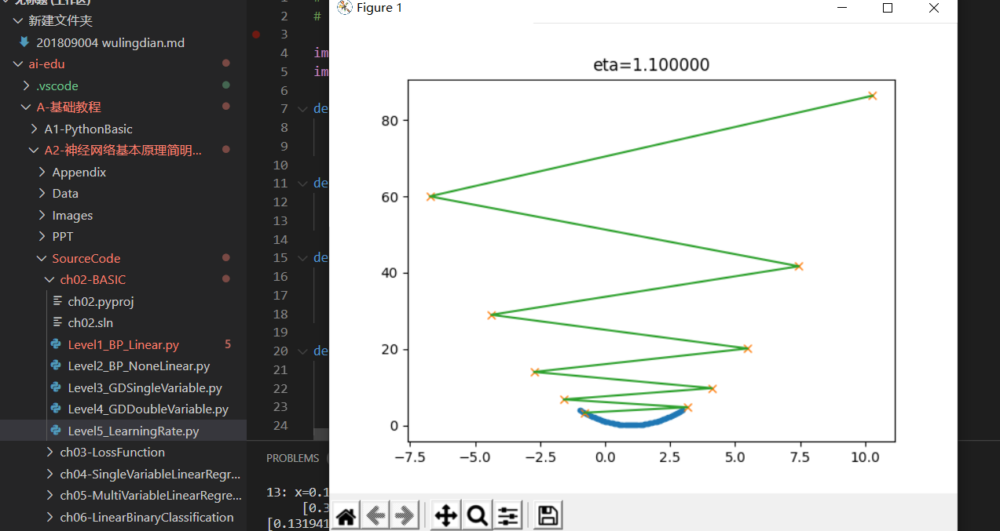

# 第一章笔记
*** 
## 简介

      在计算机科学中，人工智能（AI）有时被称为机器智能，是由机器展示的智能，与人类和动物展示的自然智能形成对比。通俗地说，“人工智能”一词用来描述模仿人类与其他人类思维相关联的“认知”功能的机器，如“学习”和“解决问题”。
      人工智能可以分为三种不同类型的系统：分析型、人类启发型和人性化人工智能。分析型人工智能只有与认知智能一致的特征；生成对世界的认知表示，并利用基于过去经验的学习来为未来的决策提供信息。人类启发的人工智能包含认知和情商的元素；除了认知因素之外，还要理解人类情感，并在决策中考虑它们。人性化人工智能显示了所有类型能力（即认知、情感和社会智能）的特征，能够自我意识，并在与他人的互动中自我意识。在二十一世纪，随着计算机能力、大量数据和理论理解的同步发展，人工智能技术经历了一次复兴；人工智能技术已经成为技术产业的重要组成部分，有助于解决计算机科学、软件工程和运筹学中许多具有挑战性的问题。
## 历史

      人工智能研究领域诞生于1956年达特茅斯学院（Dartmouth College）的一个研讨会上。与会者艾伦·纽厄尔（Attendees Allen Newell（CMU））、希尔伯特·西蒙（Herbert Simon （CMU））、约翰·麦卡锡（John McCarthy （MIT））、马文·明斯基（Marvin Minsky （MIT））和阿瑟·塞缪尔（Arthur Samuel （IBM））成为人工智能研究的创始人和领导者。他们和他们的学生制作了被媒体描述为“惊人（astonishing）”的程序：计算机正在学习跳棋策略（约1954年）（据报道，到1959年，计算机的水平已经超过了人类的平均水平），解决代数中的字问题，证明逻辑定理（Logic Theorist，第一次运行约1956年）和说英语。到20世纪60年代中期，美国的研究得到了国防部的大量资助，世界各地都建立了实验室。人工智能的创始人对未来持乐观态度：希尔伯特·西蒙预测，“机器将能够在20年内完成人类能够完成的任何工作”。马文·明斯基同意了，写道，“一代人之内……创造“人工智能”的问题将得到实质性解决”
## 定义

      计算机科学将人工智能研究定义  为对“智能代理”的研究：任何感知其环境并采取最优行动使其有机会成功实现目标的设备。 一个更详细的定义将人工智能描述为“一个可以正确解释外部数据，从这些数据中学习，并利用这些学习通过灵活的适应提升实现特定目标和任务的能力的系统。
      机器学习（Machine learning）是人工智能研究领域自创立以来的一个基本概念，是对通过经验进行自动改进的计算机算法的研究。
     
机器学习的各种方法是如何从经验中学习呢？我们可以大致地分为下面三种类型：
1. 监督学习（Supervised Learning）

    通过标注的数据来学习，例如，程序通过学习标注了正确答案的手写数字的图像数据，它就能认识其他的手写数字。

2. 无监督学习（Unsupervised Learning）

    通过没有标注的数据来学习。这种算法可以发现数据中自然形成的共同特性（聚类），可以用来发现不同数据之间的联系，例如，买了商品A的顾客往往也购买了商品B。

3. 强化学习（Reinforcement Learning）

    我们可以让程序选择和它的环境互动（例如玩一个游戏），环境给程序的反馈是一些“奖励”（例如游戏中获得高分），程序要学习到一个模型，能在这种环境中得到高的分数，不仅是当前局面要得到高分，而且最终的结果也要是高分才行。
### 范式演化的四个阶段

#### 第一阶段：经验

      人类最早的科学研究，主要以记录和描述自然现象为特征，不妨称之为称为“经验归纳”（第一范式）。人们看到自然现象，凭着自己的体验总结一些规律，并把规律推广到其他领域。这些规律通常是定性的，不是定量的。有时看似符合直觉，其实原理是错误的；有时在某个局部有效，但是推广到其他领域则不能适用；有些论断来自权威，导致错误总结也流传了很多年无人挑战。例如，我们看到日月星辰都围绕我们转，地心说很自然就产生了； 我们在生活中观察不同质量的物体运动的情况，也凭直觉推断“物体的下落速度和重量成正比”。人们对于不同的观点，也没有严谨地定义试验来证明
#### 第二阶段：理论

这一阶段，科学家们开始明确定义，速度是什么，质量是什么，化学元素是什么（不再是五行和燃素）……也开始构建各种模型，在模型中尽量撇除次要和无关因素，例如我们在中学的物理实验中，要假设“斜面足够光滑，无摩擦力”，“空气阻力可以忽略不计”，等等。在这个理论演算（Theoretical）阶段，以伽利略为代表的科学家，开启了现代科学之门。他在比萨斜塔做的试验（图1-9）推翻了两千多年来大家想当然的“定律”。


图1-9 伽利略在比萨斜塔做试验

在理论演算阶段，不但要定性，而且要定量，要通过数学公式严格的推导得到结论。我们现在知道真空中自由落体下落的公式：

$$h = \frac{1}{2}gt^{2}$$

$h$ 是下落的高度，$g$ 是重力加速度，$t$ 是运动时间。

这个公式里没有物体的质量，所以我们可以说，在真空中，自由落体下落的速度的确和物体的质量无关。

#### 第三阶段：计算仿真

从二十世纪中期开始，利用电子计算机对科学实验进行模拟仿真的模式得到迅速普及，人们可以对复杂现象通过模拟仿真，推演更复杂的现象，典型案例如模拟核试验、天气预报等。

#### 第四阶段：数据探索

在这个阶段，科学家收集数据，分析数据，探索新的规律。在深度学习的浪潮中出现的许多结果就是基于海量数据学习得来的。有些数据并不是从现实世界中收集而来，而是由计算机程序自己生成。
## 1.3 神经网络的基本工作原理简介
#### 激活函数 activation

求和之后，神经细胞已经处于兴奋状态了，已经决定要向下一个神经元传递信号了，但是要传递多强烈的信号，要由激活函数来确定：

$$A=\sigma{(Z)}$$

如果激活函数是一个阶跃信号的话，会像继电器开合一样咔咔的开启和闭合，在生物体中是不可能有这种装置的，而是一个渐渐变化的过程。所以一般激活函数都是有一个渐变的过程，也就是说是个曲线，如图1-14所示。


图1-14 激活函数图像

至此，一个神经元的工作过程就在电光火石般的一瞬间结束了。

#### 小结

- 一个神经元可以有多个输入。
- 一个神经元只能有一个输出，这个输出可以同时输入给多个神经元。
- 一个神经元的 $w$ 的数量和输入的数量一致。
- 一个神经元只有一个 $b$。
- $w$ 和 $b$ 有人为的初始值，在训练过程中被不断修改。
- $A$ 可以等于 $Z$，即激活函数不是必须有的。
- 一层神经网络中的所有神经元的激活函数必须一致。
### 1.3.3 神经网络中的矩阵运算

图1-17是一个两层的神经网络，包含隐藏层和输出层，输入层不算做一层。


图1-17 神经网络中的各种符号约定

$$
z1_1 = x_1 \cdot w1_{1,1}+ x_2 \cdot w1_{2,1}+b1_1
$$
$$
z1_2 = x_1 \cdot w1_{1,2}+ x_2 \cdot w1_{2,2}+b1_2
$$
$$
z1_3 = x_1 \cdot w1_{1,3}+ x_2 \cdot w1_{2,3}+b1_3
$$

变成矩阵运算：

$$
z1_1=
\begin{pmatrix}
x_1 & x_2
\end{pmatrix}
\begin{pmatrix}
w1_{1,1} \\\\
w1_{2,1}
\end{pmatrix}
+b1_1
$$

$$
z1_2=
\begin{pmatrix}
x_1 & x_2
\end{pmatrix}
\begin{pmatrix}
w1_{1,2} \\\\
w1_{2,2}
\end{pmatrix}
+b1_2
$$

$$
z1_3=
\begin{pmatrix}
x_1 & x_2
\end{pmatrix}
\begin{pmatrix}
w1_{1,3} \\\\
w1_{2,3}
\end{pmatrix}
+b1_3
$$

再变成大矩阵：

$$
Z1 =
\begin{pmatrix}
x_1 & x_2 
\end{pmatrix}
\begin{pmatrix}
w1_{1,1}&w1_{1,2}&w1_{1,3} \\\\
w1_{2,1}&w1_{2,2}&w1_{2,3} \\\\
\end{pmatrix}
+\begin{pmatrix}
b1_1 & b1_2 & b1_3
\end{pmatrix}
$$

最后变成矩阵符号：

$$Z1 = X \cdot W1 + B1$$

然后是激活函数运算：

$$A1=a(Z1)$$

同理可得：

$$Z2 = A1 \cdot W2 + B2$$

注意：损失函数不是前向计算的一部分。

### 1.3.4 神经网络的主要功能

#### 回归（Regression）或者叫做拟合（Fitting）

单层的神经网络能够模拟一条二维平面上的直线，从而可以完成线性分割任务。而理论证明，两层神经网络可以无限逼近任意连续函数。图1-18所示就是一个两层神经网络拟合复杂曲线的实例。


图1-18 回归/拟合示意图

所谓回归或者拟合，其实就是给出x值输出y值的过程，并且让y值与样本数据形成的曲线的距离尽量小，可以理解为是对样本数据的一种骨架式的抽象。

以图1-18为例，蓝色的点是样本点，从中可以大致地看出一个轮廓或骨架，而红色的点所连成的线就是神经网络的学习结果，它可以“穿过”样本点群形成中心线，尽量让所有的样本点到中心线的距离的和最近。

#### 分类（Classification）

如图1-19，二维平面中有两类点，红色的和蓝色的，用一条直线肯定不能把两者分开了。


图1-19 分类示意图

我们使用一个两层的神经网络可以得到一个非常近似的结果，使得分类误差在满意的范围之内。图1-19中那条淡蓝色的曲线，本来并不存在，是通过神经网络训练出来的分界线，可以比较完美地把两类样本分开，所以分类可以理解为是对两类或多类样本数据的边界的抽象。

图1-18和图1-19的曲线形态实际上是一个真实的函数在 $[0,1]$ 区间内的形状，其原型是：

$$y=0.4x^2 + 0.3x\sin(15x) + 0.01\cos(50x)-0.3$$

这么复杂的函数，一个两层的神经网络是如何做到的呢？其实从输入层到隐藏层的矩阵计算，就是对输入数据进行了空间变换，使其可以被线性可分，然后在输出层画出一个分界线。而训练的过程，就是确定那个空间变换矩阵的过程。因此，多层神经网络的本质就是对复杂函数的拟合。我们可以在后面的试验中来学习如何拟合上述的复杂函数的。

神经网络的训练结果，是一大堆的权重组成的数组（近似解），并不能得到上面那种精确的数学表达式（数学解析解）。
# 神经网络中的三个基本概念

## 2.0 通俗地理解三大概念

这三大概念是：反向传播，梯度下降，损失函数。

神经网络训练的最基本的思想就是：先“猜”一个结果，称为预测结果 $a$，看看这个预测结果和事先标记好的训练集中的真实结果 $y$ 之间的差距，然后调整策略，再试一次，这一次就不是“猜”了，而是有依据地向正确的方向靠近。如此反复多次，一直到预测结果和真实结果之间相差无几，亦即 $|a-y|\rightarrow 0$，就结束训练。

在神经网络训练中，我们把“猜”叫做初始化，可以随机，也可以根据以前的经验给定初始值。即使是“猜”，也是有技术含量的。
### 总结

简单总结一下反向传播与梯度下降的基本工作原理：

1. 初始化；
2. 正向计算；
3. 损失函数为我们提供了计算损失的方法；
4. 梯度下降是在损失函数基础上向着损失最小的点靠近而指引了网络权重调整的方向；
5. 反向传播把损失值反向传给神经网络的每一层，让每一层都根据损失值反向调整权重；
6. Go to 2，直到精度足够好（比如损失函数值小于 $0.001$）。
## 2.1 线性反向传播
## 2.1.2 反向传播求解 $w$

#### 求 $w$ 的偏导

目前 $z=162$，如果想让 $z$ 变小一些，比如目标是 $z=150$，$w$ 应该如何变化呢？为了简化问题，先只考虑改变 $w$ 的值，而令 $b$ 值固定为 $4$。

如果想解决这个问题，最笨的办法是可以在输入端一点一点的试，把 $w$ 变成 $3.5$ 试试，再变成 $3$ 试试......直到满意为止。现在我们将要学习一个更好的解决办法：反向传播。

从 $z$ 开始一层一层向回看，图中各节点关于变量 $w$ 的偏导计算结果如下：

因为 $$z = x \cdot y$$，其中 $$x = 2w + 3b, y = 2b + 1$$

所以：

$$\frac{\partial{z}}{\partial{w}}=\frac{\partial{z}}{\partial{x}} \cdot \frac{\partial{x}}{\partial{w}}=y \cdot 2=18 \tag{4}$$

其中：

$$\frac{\partial{z}}{\partial{x}}=\frac{\partial{}}{\partial{x}}(x \cdot y)=y=9$$

$$\frac{\partial{x}}{\partial{w}}=\frac{\partial{}}{\partial{w}}(2w+3b)=2$$


图2-6 对 $w$ 的偏导求解过程

图2-6其实就是链式法则的具体表现，$z$ 的误差通过中间的 $x$ 传递到 $w$。如果不是用链式法则，而是直接用 $z$ 的表达式计算对 $w$ 的偏导数，会怎么样呢？我们来试验一下。

根据公式1、2、3，我们有：

$$z=x \cdot y=(2w+3b)(2b+1)=4wb+2w+6b^2+3b \tag{5}$$

对上式求 $w$ 的偏导：

$$
\frac{\partial z}{\partial w}=4b+2=4 \cdot 4 + 2=18 \tag{6}
$$
## 梯度下降

### 从自然现象中理解梯度下降
在自然界中，梯度下降的最好例子，就是泉水下山的过程：

1. 水受重力影响，会在当前位置，沿着最陡峭的方向流动，有时会形成瀑布（梯度下降）；
2. 水流下山的路径不是唯一的，在同一个地点，有可能有多个位置具有同样的陡峭程度，而造成了分流（可以得到多个解）；
3. 遇到坑洼地区，有可能形成湖泊，而终止下山过程（不能得到全局最优解，而是局部最优解）。

### 梯度下降的数学理解

梯度下降的数学公式：

$$\theta_{n+1} = \theta_{n} - \eta \cdot \nabla J(\theta) \tag{1}$$

其中：

- $\theta_{n+1}$：下一个值；
- $\theta_n$：当前值；
- $-$：减号，梯度的反向；
- $\eta$：学习率或步长，控制每一步走的距离，不要太快以免错过了最佳景点，不要太慢以免时间太长；
- $\nabla$：梯度，函数当前位置的最快上升点；
- $J(\theta)$：函数。

#### 梯度下降的三要素

1. 当前点；
2. 方向；
3. 步长。

#### 为什么说是“梯度下降”？

“梯度下降”包含了两层含义：

1. 梯度：函数当前位置的最快上升点；
2. 下降：与导数相反的方向，用数学语言描述就是那个减号。

亦即与上升相反的方向运动，就是下降。


图2-9 梯度下降的步骤

图2-9解释了在函数极值点的两侧做梯度下降的计算过程，梯度下降的目的就是使得x值向极值点逼近。

### 
单变量函数的梯度下降

假设一个单变量函数：

$$J(x) = x ^2$$

找到该函数的最小值，于是计算其微分：

$$J'(x) = 2x$$

假设初始位置为：

$$x_0=1.2$$

假设学习率：

$$\eta = 0.3$$

根据公式(1)，迭代公式：

$$x_{n+1} = x_{n} - \eta \cdot \nabla J(x)= x_{n} - \eta \cdot 2x$$

假设终止条件为 $J(x)<0.01$，迭代过程是：
```
x=0.480000, y=0.230400
x=0.192000, y=0.036864
x=0.076800, y=0.005898
x=0.030720, y=0.000944
```

上面的过程如图2-10所示。


图2-10 使用梯度下降法迭代的过程

### 双变量的梯度下降

假设一个双变量函数：

$$J(x,y) = x^2 + \sin^2(y)$$

找到该函数的最小值，于是计算其微分：

$${\partial{J(x,y)} \over \partial{x}} = 2x$$
$${\partial{J(x,y)} \over \partial{y}} = 2 \sin y \cos y$$

假设初始位置为：

$$(x_0,y_0)=(3,1)$$

假设学习率：

$$\eta = 0.1$$

根据公式(1)，迭代过程是的计算公式：
$$(x_{n+1},y_{n+1}) = (x_n,y_n) - \eta \cdot \nabla J(x,y)$$
$$ = (x_n,y_n) - \eta \cdot (2x,2 \cdot \sin y \cdot \cos y) \tag{1}$$

根据公式(1)，假设终止条件为 $J(x,y)<0.01$，迭代过程如表2-3所示。

表2-3 双变量梯度下降的迭代过程

|迭代次数|x|y|J(x,y)|
|---|---|---|---|
|1|3|1|9.708073|
|2|2.4|0.909070|6.382415|
|...|...|...|...|
|15|0.105553|0.063481|0.015166|
|16|0.084442|0.050819|0.009711|

迭代16次后，$J(x,y)$ 的值为 $0.009711$，满足小于 $0.01$ 的条件，停止迭代。

上面的过程如表2-4所示，由于是双变量，所以需要用三维图来解释。请注意看两张图中间那条隐隐的黑色线，表示梯度下降的过程，从红色的高地一直沿着坡度向下走，直到蓝色的洼地。

表2-4 在三维空间内的梯度下降过程

|观察角度1|观察角度2|
|--|--|
|||

### 学习率η的选择


表2-5 不同学习率对迭代情况的影响

|学习率|迭代路线图|说明|
|---|---|---|
|1.0||学习率太大，迭代的情况很糟糕，在一条水平线上跳来跳去，永远也不能下降。|
|0.8||学习率大，会有这种左右跳跃的情况发生，这不利于神经网络的训练。|
|0.4||学习率合适，损失值会从单侧下降，4步以后基本接近了理想值。|
|0.1||学习率较小，损失值会从单侧下降，但下降速度非常慢，10步了还没有到达理想状态。
# 损失函数

## 损失函数概论

### 概念
在本书中，使用“损失函数”和“Loss Function”这两个词汇，具体的损失函数符号用 $J$ 来表示，误差值用 $loss$ 表示。

“损失”就是所有样本的“误差”的总和，亦即（$m$ 为样本数）：

$$损失 = \sum^m_{i=1}误差_i$$

$$J = \sum_{i=1}^m loss_i$$

我们通常会在根据某个样本的误差调整权重后，计算一下整体样本的损失函数值，来判定网络是不是已经训练到了可接受的状态。

#### 损失函数的作用

损失函数的作用，就是计算神经网络每次迭代的前向计算结果与真实值的差距，从而指导下一步的训练向正确的方向进行。

使用损失函数的具体步骤：

1. 用随机值初始化前向计算公式的参数；
2. 代入样本，计算输出的预测值；
3. 用损失函数计算预测值和标签值（真实值）的误差；
4. 根据损失函数的导数，沿梯度最小方向将误差回传，修正前向计算公式中的各个权重值；
5. 进入第2步重复, 直到损失函数值达到一个满意的值就停止迭代。

### 机器学习常用损失函数

符号规则：$a$ 是预测值，$y$ 是样本标签值，$loss$ 是损失函数值。

- Gold Standard Loss，又称0-1误差
$$
loss=\begin{cases}
0 & a=y \\\\
1 & a \ne y 
\end{cases}
$$

- 绝对值损失函数

$$
loss = |y-a|
$$

- Hinge Loss，铰链/折页损失函数或最大边界损失函数，主要用于SVM（支持向量机）中

$$
loss=\max(0,1-y \cdot a) \qquad y=\pm 1
$$

- Log Loss，对数损失函数，又叫交叉熵损失函数(cross entropy error)

$$
loss = -[y \cdot \ln (a) + (1-y) \cdot \ln (1-a)]  \qquad y \in \\{ 0,1 \\} 
$$

- Squared Loss，均方差损失函数
$$
loss=(a-y)^2
$$

- Exponential Loss，指数损失函数
$$
loss = e^{-(y \cdot a)}
$$


### 损失函数图像理解

#### 用二维函数图像理解单变量对损失函数的影响


图3-1 单变量的损失函数图

图3-1中，纵坐标是损失函数值，横坐标是变量。不断地改变变量的值，会造成损失函数值的上升或下降。而梯度下降算法会让我们沿着损失函数值下降的方向前进。

1. 假设我们的初始位置在 $A$ 点，$x=x_0$，损失函数值（纵坐标）较大，回传给网络做训练；
2. 经过一次迭代后，我们移动到了 $B$ 点，$x=x_1$，损失函数值也相应减小，再次回传重新训练；
3. 以此节奏不断向损失函数的最低点靠近，经历了 $x_2,x_3,x_4,x_5$；
4. 直到损失值达到可接受的程度，比如 $x_5$ 的位置，就停止训练。

#### 用等高线图理解双变量对损失函数影响


### 神经网络中常用的损失函数

- 均方差函数，主要用于回归

- 交叉熵函数，主要用于分类

二者都是非负函数，极值在底部，用梯度下降法可以求解。
## 均方差函数

MSE - Mean Square Error。

计算预测值和真实值之间的欧式距离。预测值和真实值越接近，两者的均方差就越小。

均方差函数常用于线性回归(linear regression)，即函数拟合(function fitting)。公式如下：

$$
loss = {1 \over 2}(z-y)^2 \tag{单样本}
$$

$$
J=\frac{1}{2m} \sum_{i=1}^m (z_i-y_i)^2 \tag{多样本}
$$

### 工作原理

要想得到预测值 $a$ 与真实值 $y$ 的差距，最朴素的想法就是用 $Error=a_i-y_i$。

对于单个样本来说，这样做没问题，但是多个样本累计时，$a_i-y_i$ 可能有正有负，误差求和时就会导致相互抵消，从而失去价值。所以有了绝对值差的想法，即 $Error=|a_i-y_i|$ 。那为什么还要引入均方差损失函数呢？两种损失函数的比较如表3-1所示。

表3-1 绝对值损失函数与均方差损失函数的比较

|样本标签值|样本预测值|绝对值损失函数|均方差损失函数|
|------|------|------|------|
|$[1,1,1]$|$[1,2,3]$|$(1-1)+(2-1)+(3-1)=3$|$(1-1)^2+(2-1)^2+(3-1)^2=5$|
|$[1,1,1]$|$[1,3,3]$|$(1-1)+(3-1)+(3-1)=4$|$(1-1)^2+(3-1)^2+(3-1)^2=8$|
|||$4/3=1.33$|$8/5=1.6$|

可以看到5比3已经大了很多，8比4大了一倍，而8比5也放大了某个样本的局部损失对全局带来的影响，用术语说，就是“对某些偏离大的样本比较敏感”，从而引起监督训练过程的足够重视，以便回传误差。


图3-4 损失函数值与直线位置的关系

由于均方差的损失函数值都是正值，如何判断是向上移动还是向下移动呢？

在实际的训练过程中，是没有必要计算损失函数值的，因为损失函数值会体现在反向传播的过程中。我们来看看均方差函数的导数：

$$
\frac{\partial{J}}{\partial{a_i}} = a_i-y_i
$$

虽然 $(a_i-y_i)^2$ 永远是正数，但是 $a_i-y_i$ 却可以是正数（直线在点下方时）或者负数（直线在点上方时），这个正数或者负数被反向传播回到前面的计算过程中，就会引导训练过程朝正确的方向尝试。


我们假设该拟合直线的方程是 $y=2x+3$，当我们固定 $w=2$，把 $b$ 值从 $2$ 到 $4$ 变化时，损失函数值的变化如图3-5所示。


图3-5 固定 $w$ 时，$b$ 变化时损失函数值的变化

我们假设该拟合直线的方程是 $y=2x+3$，当我们固定 $b=3$，把 $w$ 值从 $1$ 到 $3$ 变化时，损失函数值的变化如图3-6所示。


图3-6 固定 $b$ 时，$w$ 变化时损失函数值的变化

### 3.1.3 损失函数的可视化

#### 损失函数值的3D示意图

横坐标为 $w$，纵坐标为 $b$，针对每一个$(w,b)$的组合计算出一个损失函数值，用三维图的高度来表示这个损失函数值。下图中的底部并非一个平面，而是一个有些下凹的曲面，只不过曲率较小，如图3-7。


图3-7 $w$ 和 $b$ 同时变化时的损失值形成的曲面

#### 损失函数值的2D示意图

在平面地图中，我们经常会看到用等高线的方式来表示海拔高度值，下图就是上图在平面上的投影，即损失函数值的等高线图，如图3-8所示。


图3-8 损失函数的等高线图

如果还不能理解的话，我们用最笨的方法来画一张图，代码如下：

```Python
    s = 200
    W = np.linspace(w-2,w+2,s)
    B = np.linspace(b-2,b+2,s)
    LOSS = np.zeros((s,s))
    for i in range(len(W)):
        for j in range(len(B)):
            z = W[i] * x + B[j]
            loss = CostFunction(x,y,z,m)
            LOSS[i,j] = round(loss, 2)
```

上述代码针对每个 $(w,b)$ 组合计算出了一个损失值，保留小数点后2位，放在`LOSS`矩阵中，如下所示：

```
[[4.69 4.63 4.57 ... 0.72 0.74 0.76]
 [4.66 4.6  4.54 ... 0.73 0.75 0.77]
 [4.62 4.56 4.5  ... 0.73 0.75 0.77]
 ...
 [0.7  0.68 0.66 ... 4.57 4.63 4.69]
 [0.69 0.67 0.65 ... 4.6  4.66 4.72]
 [0.68 0.66 0.64 ... 4.63 4.69 4.75]]
```

然后遍历矩阵中的损失函数值，在具有相同值的位置上绘制相同颜色的点，比如，把所有值为0.72的点绘制成红色，把所有值为0.75的点绘制成蓝色......，这样就可以得到图3-9。


## 交叉熵损失函数

交叉熵（Cross Entropy）是Shannon信息论中一个重要概念，主要用于度量两个概率分布间的差异性信息。在信息论中，交叉熵是表示两个概率分布 $p,q$ 的差异，其中 $p$ 表示真实分布，$q$ 表示预测分布，那么 $H(p,q)$ 就称为交叉熵：

$$H(p,q)=\sum_i p_i \cdot \ln {1 \over q_i} = - \sum_i p_i \ln q_i \tag{1}$$

交叉熵可在神经网络中作为损失函数，$p$ 表示真实标记的分布，$q$ 则为训练后的模型的预测标记分布，交叉熵损失函数可以衡量 $p$ 与 $q$ 的相似性。

**交叉熵函数常用于逻辑回归(logistic regression)，也就是分类(classification)。**

### 交叉熵的由来

#### 信息量

信息论中，信息量的表示方式：

$$I(x_j) = -\ln (p(x_j)) \tag{2}$$

$x_j$：表示一个事件

$p(x_j)$：表示 $x_j$ 发生的概率

$I(x_j)$：信息量，$x_j$ 越不可能发生时，它一旦发生后的信息量就越大

假设对于学习神经网络原理课程，我们有三种可能的情况发生，如表3-2所示。

表3-2 三种事件的概论和信息量

|事件编号|事件|概率 $p$|信息量 $I$|
|---|---|---|---|
|$x_1$|优秀|$p=0.7$|$I=-\ln(0.7)=0.36$|
|$x_2$|及格|$p=0.2$|$I=-\ln(0.2)=1.61$|
|$x_3$|不及格|$p=0.1$|$I=-\ln(0.1)=2.30$|

WoW，某某同学不及格！好大的信息量！相比较来说，“优秀”事件的信息量反而小了很多。

#### 熵

$$H(p) = - \sum_j^n p(x_j) \ln (p(x_j)) \tag{3}$$

则上面的问题的熵是：

$$
\begin{aligned}  
H(p)&=-[p(x_1) \ln p(x_1) + p(x_2) \ln p(x_2) + p(x_3) \ln p(x_3)] \\\\
&=0.7 \times 0.36 + 0.2 \times 1.61 + 0.1 \times 2.30 \\\\
&=0.804
\end{aligned}
$$

#### 相对熵(KL散度)

相对熵又称KL散度，如果我们对于同一个随机变量 $x$ 有两个单独的概率分布 $P(x)$ 和 $Q(x)$，我们可以使用 KL 散度（Kullback-Leibler (KL) divergence）来衡量这两个分布的差异，这个相当于信息论范畴的均方差。

KL散度的计算公式：

$$D_{KL}(p||q)=\sum_{j=1}^n p(x_j) \ln{p(x_j) \over q(x_j)} \tag{4}$$

$n$ 为事件的所有可能性。$D$ 的值越小，表示 $q$ 分布和 $p$ 分布越接近。

#### 交叉熵

把上述公式变形：

$$
\begin{aligned}  
D_{KL}(p||q)&=\sum_{j=1}^n p(x_j) \ln{p(x_j)} - \sum_{j=1}^n p(x_j) \ln q(x_j) \\\\
&=- H(p(x)) + H(p,q) 
\end{aligned}
\tag{5}
$$

等式的前一部分恰巧就是 $p$ 的熵，等式的后一部分，就是交叉熵：

$$H(p,q) =- \sum_{j=1}^n p(x_j) \ln q(x_j) \tag{6}$$

在机器学习中，我们需要评估标签值 $y$ 和预测值 $a$ 之间的差距，使用KL散度刚刚好，即 $D_{KL}(y||a)$，由于KL散度中的前一部分 $H(y)$ 不变，故在优化过程中，只需要关注交叉熵就可以了。所以一般在机器学习中直接用交叉熵做损失函数来评估模型。

$$loss =- \sum_{j=1}^n y_j \ln a_j \tag{7}$$

公式7是单个样本的情况，$n$ 并不是样本个数，而是分类个数。所以，对于批量样本的交叉熵计算公式是：

$$J =- \sum_{i=1}^m \sum_{j=1}^n y_{ij} \ln a_{ij} \tag{8}$$

$m$ 是样本数，$n$ 是分类数。

有一类特殊问题，就是事件只有两种情况发生的可能，比如“学会了”和“没学会”，称为 $0/1$ 分类或二分类。对于这类问题，由于$n=2，y_1=1-y_2，a_1=1-a_2$，所以交叉熵可以简化为：

$$loss =-[y \ln a + (1-y) \ln (1-a)] \tag{9}$$

二分类对于批量样本的交叉熵计算公式是：

$$J= - \sum_{i=1}^m [y_i \ln a_i + (1-y_i) \ln (1-a_i)] \tag{10}$$

### 3.2.2 二分类问题交叉熵


横坐标是预测输出，纵坐标是损失函数值。$y=1$ 意味着当前样本标签值是1，当预测输出越接近1时，损失函数值越小，训练结果越准确。当预测输出越接近0时，损失函数值越大，训练结果越糟糕。

当 $y=0$ 时，即标签值是0，是个反例，加号前面的项为0：

$$loss = -\ln (1-a) \tag{12}$$

此时，损失函数值如图3-10。


### 3.2.3 多分类问题交叉熵

当标签值不是非0即1的情况时，就是多分类了。假设期末考试有三种情况：

1. 优秀，标签值OneHot编码为 $[1,0,0]$；
2. 及格，标签值OneHot编码为 $[0,1,0]$；
3. 不及格，标签值OneHot编码为 $[0,0,1]$。

预测值越接近真实标签值（0.6 vs 0.3），交叉熵损失函数值越小，反向传播的力度越小。

### 3.2.4 为什么不能使用均方差做为分类问题的损失函数？

1. 回归问题通常用均方差损失函数，可以保证损失函数是个凸函数，即可以得到最优解。而分类问题如果用均方差的话，损失函数的表现不是凸函数，就很难得到最优解。而交叉熵函数可以保证区间内单调。

2. 分类问题的最后一层网络，需要分类函数，Sigmoid或者Softmax，如果再接均方差函数的话，其求导结果复杂，运算量比较大。用交叉熵函数的话，可以得到比较简单的计算结果，一个简单的减法就可以得到反向误差。

## 商务数据分析：
数据挖掘与分析心得体会 
  正如柏拉图所说：需要是发明之母。随着信息时代的步伐不断迈进，大量数据日积月累。我们迫切需要一种工具来满足从数据中发现知识的需求！而数据挖掘便应运而生了。正如书中所说：数据挖掘已经并且将继续在我们从数据时代大步跨入信息时代的历程中做出贡献。
  1、数据挖掘 
  数据挖掘应当更正确的命名为：“从数据中挖掘知识”，不过后者显得过长了些。而“挖掘”一词确是生动形象的！人们把数据挖掘视为“数据中的知识发现（KDD）”的同义词，而另一些人只是把数据挖掘视为知识发现过程的一个基本步骤！ 
  由此而产生数据挖掘的定义：从大量数据中挖掘有趣模式和知识的过程！数据源包括数据库、数据仓库、Web、其他信息存储库或动态地流入系统的数据。作为知识发现过程，它通常包括数据清理、数据集成、数据变换、模式发现、模式评估和知识表示六个步骤。

  数据挖掘处理数据之多，挖掘模式之有趣，使用技术之大量，应用范围之广泛都将会是前所未有的；而数据挖掘任务之重也一直并存。这些问题将继续激励数据挖掘的进一步
  ### 学习心得：
  通过老师的讲解，我对人工智能有了一些简单的感性认识，我知道了人工智能从诞生，发展到今天经历一个漫长的过程，许多人为此做出了不懈的努力。我觉得这门课真的是一门富有挑战性的科学，而从事这项工作的人不仅要懂得计算机知识，还必须懂得心理学和哲学。

  人工智能在很多领域得到了发展，在我们的日常生活和学习中发挥了重要的作用。如：机器翻译，机器翻译是利用计算机把一种自然语言转变成另一种自然语言的过程，用以完成这一过程的软件系统叫做机器翻译系统。利用这些机器翻译系统我们可以很方便的完成一些语言翻译工作。目前，国内的机器翻译软件有很多，富有代表性意义的当属“金山词霸”，它可以迅速的查询英文单词和词组句子翻译，重要的是它还可以提供发音功能，为用户提供了极大的方便。
  通过这堂课，我明白了人工智能发展的历史和所处的地位，它始终处于计算机发展的最前沿。我相信人工智能在不久的将来将会得到更深一步的实现，会创造出一个全新的人工智能世界。
 
  
   
    
     