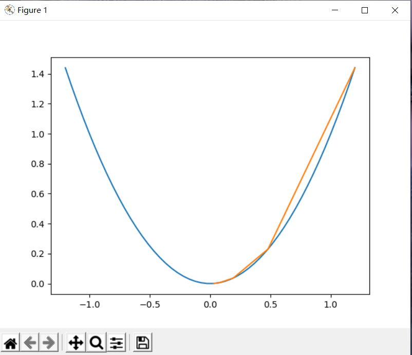
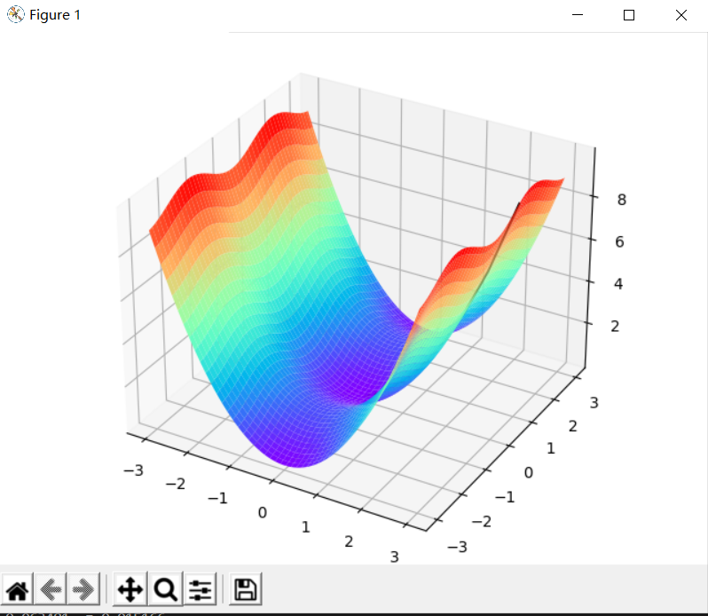
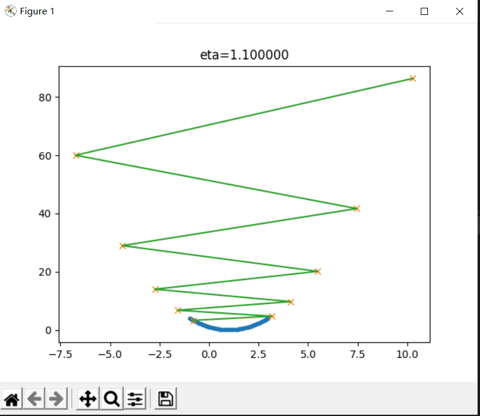
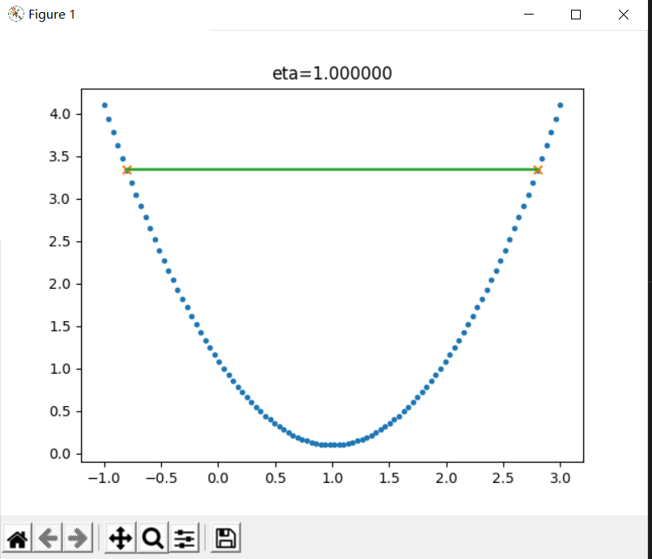
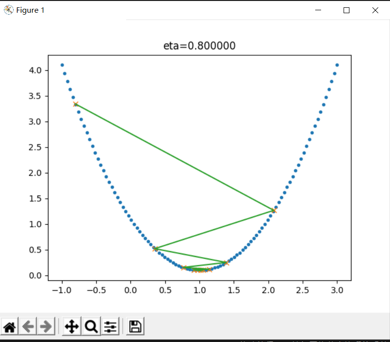
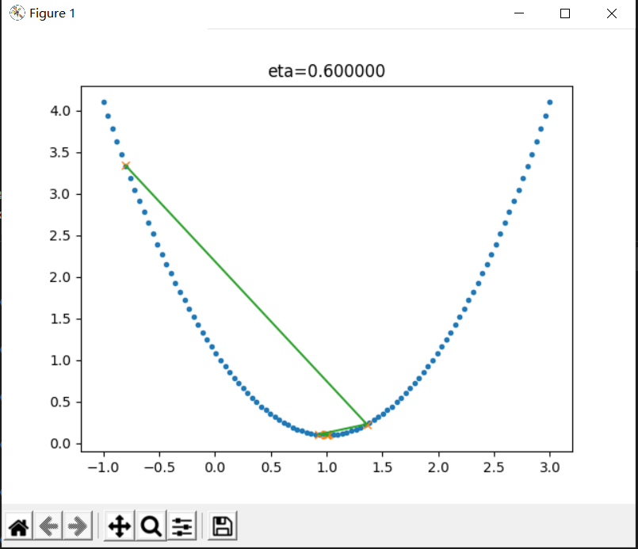
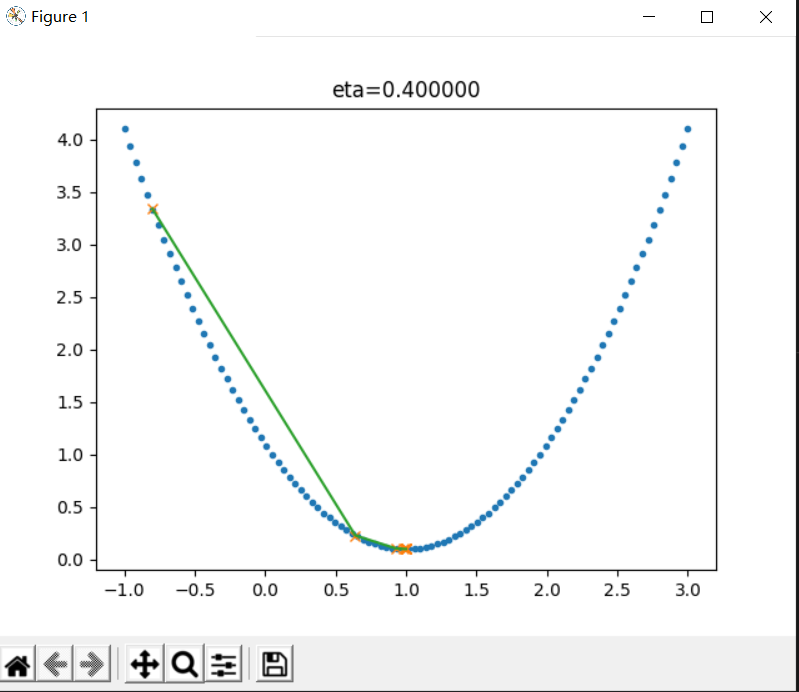
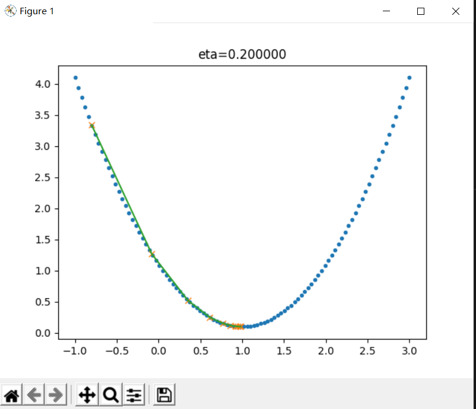
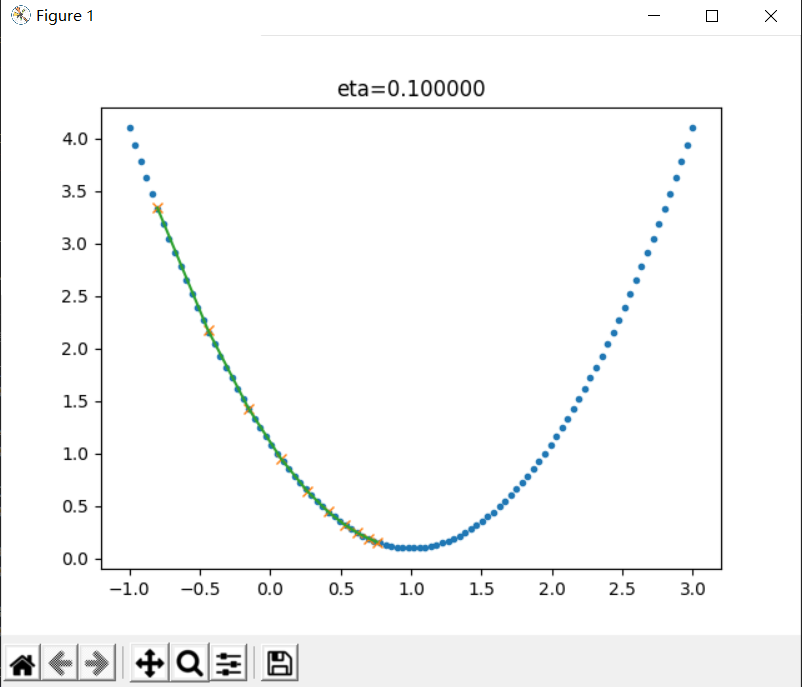

第一次作业

人们口中的人工智能其实是一个非常庞杂的概念，从人们对人工智能的期待，技术，和应用角度，都有很多不同的概念。我们详细分析如下：
在计算机科学中，人工智能（AI）有时被称为机器智能，是由机器展示的智能，与人类和动物展示的自然智能形成对比。通俗地说，“人工智能”一词用来描述模仿人类与其他人类思维相关联的“认知”功能的机器，如“学习”和“解决问题”。

随着机器变得越来越有能力，被认为需要“智能”的任务通常会从人工智能的定义中删除，这种现象被称为人工智能效应。特斯勒定理（Tesler's Theorem）中的一句妙语说：“人工智能是尚未完成的事情。”例如，光学字符识别经常被排除在人工智能之外，已经成为一种常规技术。现代机器能力通常被归类为人工智能，包括成功理解人类语言， 在战略游戏系统（如象棋和围棋）中处于最高水平的竞争， 自主操作汽车、内容传递网络中的智能路由以及军事模拟。

人工智能可以分为三种不同类型的系统：分析型、人类启发型和人性化人工智能。分析型人工智能只有与认知智能一致的特征；生成对世界的认知表示，并利用基于过去经验的学习来为未来的决策提供信息。人类启发的人工智能包含认知和情商的元素；除了认知因素之外，还要理解人类情感，并在决策中考虑它们。人性化人工智能显示了所有类型能力（即认知、情感和社会智能）的特征，能够自我意识，并在与他人的互动中自我意识。

人工智能研究的传统问题（或目标）包括推理、知识表示、规划、学习、自然语言处理、感知以及移动和操纵对象的能力。 一般智力是该领域的长期目标之一。 方法包括统计方法、计算智能和传统的符号人工智能。人工智能中使用了许多工具，包括搜索和数学优化、人工神经网络以及基于统计、概率和经济学的方法。人工智能领域借鉴了计算机科学、信息工程、数学、心理学、语言学、哲学和许多其他领域。
**从技术的特点来看**。

要实现某种狭义的人工智能，我们很自然地想到，如果我们能让运行程序的电脑来学习并自动掌握某些规律，那该多好啊，这就是“机器学习”。机器学习在几十年的发展历史中，产生了很多技术，这些技术都有下面的共性：

> 如果一个程序解决任务（T）的效能（用P表示）随着经验（E）得到了提高，那么，这个程序就能从经验（E）中学到了关于任务（T）的知识，并让衡量值（P）得到提高。$^{}$

1. 选择一个模型结构（例如逻辑回归，决策树等），这就是上面说的程序。
2. 用训练数据（输入和输出）输入模型。这就是上面的经验（E）。
3. 通过不断执行任务（T）并衡量结果（P），让P
不断提高，直到达到一个满意的值。

那么，机器学习的各种方法是如何从经验中学习呢？我们可以大致地分为下面三种类型：

1. 监督学习（Supervised Learning）

    通过标注的数据来学习，例如，程序通过学习标注了正确答案的手写数字的图像数据，它就能认识其他的手写数字。

2. 无监督学习（Unsupervised Learning）

    通过没有标注的数据来学习。这种算法可以发现数据中自然形成的共同特性（聚类），可以用来发现不同数据之间的联系，例如，买了商品A的顾客往往也购买了商品B。

3. 强化学习（Reinforcement Learning）

    我们可以让程序选择和它的环境互动（例如玩一个游戏），环境给程序的反馈是一些“奖励”（例如游戏中获得高分），程序要学习到一个模型，能在这种环境中得到高的分数，不仅是当前局面要得到高分，而且最终的结果也要是高分才行。

综合来看，如果我们把机器学习当作一个小孩，那么，教育小孩的方式就有根据正确答案指导学习（监督学习）；根据小孩实践的过程给予各种鼓励（强化学习）；还有自由探索世界，让小孩自己总结规律（无监督学习）。

机器学习领域出现了各种模型，其中，神经网络模型是一个重要的方法，它的原型在1943就出现了，在生物神经网络中，每个神经元与其他神经元相连，当它兴奋时，就会像相邻的神经元发送化学物质，从而改变这些神经元内的电位；如果某神经元的电位超过了一个阈值，那么它就会被激活（兴奋），向其他神经元发送化学物质。把许多这样的神经元按照一定的层次结构连接起来，我们就构建了一个神经网络$^{[3]}$。图1-4是M-P神经元模型的示意图。


### 1.2.1 范式演化的四个阶段

#### 第一阶段：经验

从几千年前到几百年前，人们描述自然现象，归纳总结一些规律。

人类最早的科学研究，主要以记录和描述自然现象为特征，不妨称之为称为“经验归纳”（第一范式）。

### 第二阶段：理论

这一阶段，科学家们开始明确定义，速度是什么，质量是什么，化学元素是什么（不再是五行和燃素）……也开始构建各种模型，在模型中尽量撇除次要和无关因素，例如我们在中学的物理实验中，要假设“斜面足够光滑，无摩擦力”，“空气阻力可以忽略不计”，等等。在这个理论演算（Theoretical）阶段，以伽利略为代表的科学家，开启了现代科学之门。他在比萨斜塔做的试验（图1-9）推翻了两千多年来大家想当然的“定律”。


图1-9 伽利略在比萨斜塔做试验

在理论演算阶段，不但要定性，而且要定量，要通过数学公式严格的推导得到结论。我们现在知道真空中自由落体下落的公式：

$$h = \frac{1}{2}gt^{2}$$

$h$ 是下落的高度，$g$ 是重力加速度，$t$ 是运动时间。

这个公式里没有物体的质量，所以我们可以说，在真空中，自由落体下落的速度的确和物体的质量无关。

#### 第三阶段：计算仿真

从二十世纪中期开始，利用电子计算机对科学实验进行模拟仿真的模式得到迅速普及，人们可以对复杂现象通过模拟仿真，推演更复杂的现象，典型案例如模拟核试验、天气预报等。这样计算机仿真越来越多地取代实验，逐渐成为科研的常规方法。科学家先定义问题，确认假设，再利用数据进行分析和验证。

#### 第四阶段：数据探索

最后我们到了“数据探索”（Data Exploration）阶段。在这个阶段，科学家收集数据，分析数据，探索新的规律。在深度学习的浪潮中出现的许多结果就是基于海量数据学习得来的。有些数据并不是从现实世界中收集而来，而是由计算机程序自己生成，例如，在AlphaGo算法训练的过程中，它和自己对弈了数百万局，这个数量大大超过了所有记录下来的职业选手棋谱的数量。

### 1.2.2 范式各阶段的应用

作为一个小例子，我们可以看看各个阶段的方法论如何解一个我们姑且称为“智能之门”$^{[6]}$的问题：

顾客参加一个抽奖活动，三个关闭的门后面只有一个有奖品，顾客选择一个门之后，主持人会打开一个没有奖品的门，并给顾客一次改变选择的机会。此时，改选另外一个门会得到更大的获奖几率么？如图1-10所示。


图1-10 智能之门

### 1.3 神经网络的基本工作原理简介

### 1.3.1 神经元细胞的数学模型

神经网络由基本的神经元组成，图1-13就是一个神经元的数学/计算模型，便于我们用程序来实现。


图1-13 神经元计算模型

#### 输入 input

$(x_1,x_2,x_3)$ 是外界输入信号，一般是一个训练数据样本的多个属性，比如，我们要预测一套房子的价格，那么在房屋价格数据样本中，$x_1$ 可能代表了面积，$x_2$ 可能代表地理位置，$x_3$ 可能代表朝向。另外一个例子是，$(x_1,x_2,x_3)$ 分别代表了(红,绿,蓝)三种颜色，而此神经元用于识别输入的信号是暖色还是冷色。

#### 权重 weights

$(w_1,w_2,w_3)$ 是每个输入信号的权重值，以上面的 $(x_1,x_2,x_3)$ 的例子来说，$x_1$ 的权重可能是 $0.92$，$x_2$ 的权重可能是 $0.2$，$x_3$ 的权重可能是 $0.03$。当然权重值相加之后可以不是 $1$。

#### 偏移 bias

还有个 $b$ 是怎么来的？一般的书或者博客上会告诉你那是因为 $y=wx+b$，$b$ 是偏移值，使得直线能够沿 $Y$ 轴上下移动。这是用结果来解释原因，并非 $b$ 存在的真实原因。从生物学上解释，在脑神经细胞中，一定是输入信号的电平/电流大于某个临界值时，神经元细胞才会处于兴奋状态，这个 $b$ 实际就是那个临界值。亦即当：

$$w_1 \cdot x_1 + w_2 \cdot x_2 + w_3 \cdot x_3 \geq t$$

时，该神经元细胞才会兴奋。我们把t挪到等式左侧来，变成$(-t)$，然后把它写成 $b$，变成了：

$$w_1 \cdot x_1 + w_2 \cdot x_2 + w_3 \cdot x_3 + b \geq 0$$

于是 $b$ 诞生了！

#### 求和计算 sum

$$
\begin{aligned}
Z &= w_1 \cdot x_1 + w_2 \cdot x_2 + w_3 \cdot x_3 + b \\\\
&= \sum_{i=1}^m(w_i \cdot x_i) + b
\end{aligned}
$$

在上面的例子中 $m=3$。我们把$w_i \cdot x_i$变成矩阵运算的话，就变成了：

$$Z = W \cdot X + b$$

#### 激活函数 activation

求和之后，神经细胞已经处于兴奋状态了，已经决定要向下一个神经元传递信号了，但是要传递多强烈的信号，要由激活函数来确定：

$$A=\sigma{(Z)}$$

如果激活函数是一个阶跃信号的话，会像继电器开合一样咔咔的开启和闭合，在生物体中是不可能有这种装置的，而是一个渐渐变化的过程。所以一般激活函数都是有一个渐变的过程，也就是说是个曲线，如图1-14所示。


图1-14 激活函数图像

至此，一个神经元的工作过程就在电光火石般的一瞬间结束了。

#### 小结

- 一个神经元可以有多个输入。
- 一个神经元只能有一个输出，这个输出可以同时输入给多个神经元。
- 一个神经元的 $w$ 的数量和输入的数量一致。
- 一个神经元只有一个 $b$。
- $w$ 和 $b$ 有人为的初始值，在训练过程中被不断修改。
- $A$ 可以等于 $Z$，即激活函数不是必须有的。
- 一层神经网络中的所有神经元的激活函数必须一致。

### 1.3.2 神经网络的训练过程

#### 单层神经网络模型

这是一个单层的神经网络，有 $m$ 个输入 (这里 $m=3$)，有 $n$ 个输出 (这里 $n=2$)。在神经网络中，$b$ 到每个神经元的权值来表示实际的偏移值，亦即 $(b_1,b_2)$，这样便于矩阵运算。也有些人把 $b$ 写成 $x_0$，其实是同一个效果，即把偏移值看做是神经元的一个输入。

- $(x_1,x_2,x_3)$ 是一个样本数据的三个特征值
- $(w_{11},w_{21},w_{31})$ 是 $(x_1,x_2,x_3)$ 到 $n1$ 的权重
- $(w_{12},w_{22},w_{32})$ 是 $(x_1,x_2,x_3)$ 到 $n2$ 的权重
- $b_1$ 是 $n1$ 的偏移
- $b_2$ 是 $n2$ 的偏移


前提条件

 1. 首先是我们已经有了训练数据；
 2. 我们已经根据数据的规模、领域，建立了神经网络的基本结构，比如有几层，每一层有几个神经元；
 3. 定义好损失函数来合理地计算误差。

 ### 1.3.3 神经网络中的矩阵运算

图1-17是一个两层的神经网络，包含隐藏层和输出层，输入层不算做一层。


图1-17 神经网络中的各种符号约定

### 1.3.4 神经网络的主要功能

#### 回归（Regression）或者叫做拟合（Fitting）

单层的神经网络能够模拟一条二维平面上的直线，从而可以完成线性分割任务。而理论证明，两层神经网络可以无限逼近任意连续函数。图1-18所示就是一个两层神经网络拟合复杂曲线的实例。


图1-18 回归/拟合示意图

所谓回归或者拟合，其实就是给出x值输出y值的过程，并且让y值与样本数据形成的曲线的距离尽量小，可以理解为是对样本数据的一种骨架式的抽象。

以图1-18为例，蓝色的点是样本点，从中可以大致地看出一个轮廓或骨架，而红色的点所连成的线就是神经网络的学习结果，它可以“穿过”样本点群形成中心线，尽量让所有的样本点到中心线的距离的和最近。

#### 分类（Classification）

如图1-19，二维平面中有两类点，红色的和蓝色的，用一条直线肯定不能把两者分开了。


图1-19 分类示意图

### 第2章 神经网络中的三个基本概念

## 2.0 通俗地理解三大概念

这三大概念是：反向传播，梯度下降，损失函数。
2.0.5 总结

简单总结一下反向传播与梯度下降的基本工作原理：

1. 初始化；
2. 正向计算；
3. 损失函数为我们提供了计算损失的方法；
4. 梯度下降是在损失函数基础上向着损失最小的点靠近而指引了网络权重调整的方向；
5. 反向传播把损失值反向传给神经网络的每一层，让每一层都根据损失值反向调整权重；
6. Go to 2，直到精度足够好（比如损失函数值小于 $0.001$）。

### 2.1 线性反向传播

反向传播（英语：Backpropagation，缩写为BP）是“误差反向传播”的简称，是一种与最优化方法（如梯度下降法）结合使用的，用来训练人工神经网络的常见方法。该方法对网络中所有权重计算损失函数的梯度。这个梯度会反馈给最优化方法，用来更新权值以最小化损失函数。

反向传播要求有对每个输入值想得到的已知输出，来计算损失函数梯度。因此，它通常被认为是一种监督式学习方法，虽然它也用在一些无监督网络（如自动编码器）中。它是多层前馈网络的Delta规则的推广，可以用链式法则对每层迭代计算梯度。反向传播要求人工神经元（或“节点”）的激励函数可微。


### 2.1.1 正向计算的实例

假设有一个函数：

$$z = x \cdot y \tag{1}$$

其中:

$$x = 2w + 3b \tag{2}$$

$$y = 2b + 1 \tag{3}$$

计算图如图2-4。


图2-4 简单线性计算的计算图

注意这里 $x,y,z$ 不是变量，只是中间计算结果；$w,b$ 才是变量。因为在后面要学习的神经网络中，要最终求解的目标是 $w$ 和 $b$ 的值，所以在这里先预热一下。

当 $w = 3, b = 4$ 时，会得到图2-5的结果。


图2-5 计算结果

最终的 $z$ 值，受到了前面很多因素的影响：变量 $w$，变量 $b$，计算式 $x$，计算式 $y$。

### 2.3.2 梯度下降的数学理解

梯度下降的数学公式：

$$\theta_{n+1} = \theta_{n} - \eta \cdot \nabla J(\theta) \tag{1}$$

其中：

- $\theta_{n+1}$：下一个值；
- $\theta_n$：当前值；
- $-$：减号，梯度的反向；
- $\eta$：学习率或步长，控制每一步走的距离，不要太快以免错过了最佳景点，不要太慢以免时间太长；
- $\nabla$：梯度，函数当前位置的最快上升点；
- $J(\theta)$：函数。

#### 梯度下降的三要素

1. 当前点；
2. 方向；
3. 步长。

#### 为什么说是“梯度下降”？

“梯度下降”包含了两层含义：

1. 梯度：函数当前位置的最快上升点；
2. 下降：与导数相反的方向，用数学语言描述就是那个减号。

亦即与上升相反的方向运动，就是下降。


图2-9 梯度下降的步骤

图2-9解释了在函数极值点的两侧做梯度下降的计算过程，梯度下降的目的就是使得x值向极值点逼近。

### 2.3.4 双变量的梯度下降

假设一个双变量函数：

$$J(x,y) = x^2 + \sin^2(y)$$

我们的目的是找到该函数的最小值，于是计算其微分：

$${\partial{J(x,y)} \over \partial{x}} = 2x$$
$${\partial{J(x,y)} \over \partial{y}} = 2 \sin y \cos y$$

假设初始位置为：

$$(x_0,y_0)=(3,1)$$

假设学习率：

$$\eta = 0.1$$

根据公式(1)，迭代过程是的计算公式：
$$(x_{n+1},y_{n+1}) = (x_n,y_n) - \eta \cdot \nabla J(x,y)$$
$$ = (x_n,y_n) - \eta \cdot (2x,2 \cdot \sin y \cdot \cos y) \tag{1}$$

根据公式(1)，假设终止条件为 $J(x,y)<0.01$，迭代过程如表2-3所示。

表2-3 双变量梯度下降的迭代过程

|迭代次数|x|y|J(x,y)|
|---|---|---|---|
|1|3|1|9.708073|
|2|2.4|0.909070|6.382415|
|...|...|...|...|
|15|0.105553|0.063481|0.015166|
|16|0.084442|0.050819|0.009711|

迭代16次后，$J(x,y)$ 的值为 $0.009711$，满足小于 $0.01$ 的条件，停止迭代。

上面的过程如表2-4所示，由于是双变量，所以需要用三维图来解释。请注意看两张图中间那条隐隐的黑色线，表示梯度下降的过程，从红色的高地一直沿着坡度向下走，直到蓝色的洼地。

表2-4 在三维空间内的梯度下降过程

|观察角度1|观察角度2|
|--|--|
|||

表2-5 不同学习率对迭代情况的影响

|学习率|迭代路线图|说明|
|---|---|---|
|1.0||学习率太大，迭代的情况很糟糕，在一条水平线上跳来跳去，永远也不能下降。|
|0.8||学习率大，会有这种左右跳跃的情况发生，这不利于神经网络的训练。|
|0.4||学习率合适，损失值会从单侧下降，4步以后基本接近了理想值。|
|0.1||学习率较小，损失值会从单侧下降，但下降速度非常慢，10步了还没有到达理想状态。|

### 第3章 损失函数

## 3.0 损失函数概论

### 3.0.1 概念

损失函数（loss function）或代价函数（cost function）是将随机事件或其有关随机变量的取值映射为非负实数以表示该随机事件的“风险”或“损失”的函数。在应用中，损失函数通常作为学习准则与优化问题相联系，即通过最小化损失函数求解和评估模型。例如在统计学和机器学习中被用于模型的参数估计（parameteric estimation），在宏观经济学中被用于风险管理（risk mangement）和决策，在控制理论中被应用于最优控制理论（optimal control theory）


“损失”就是所有样本的“误差”的总和，亦即（$m$ 为样本数）：

$$损失 = \sum^m_{i=1}误差_i$$

$$J = \sum_{i=1}^m loss_i$$

损失函数的作用

损失函数的作用，就是计算神经网络每次迭代的前向计算结果与真实值的差距，从而指导下一步的训练向正确的方向进行。

如何使用损失函数呢？具体步骤：

1. 用随机值初始化前向计算公式的参数；
2. 代入样本，计算输出的预测值；
3. 用损失函数计算预测值和标签值（真实值）的误差；
4. 根据损失函数的导数，沿梯度最小方向将误差回传，修正前向计算公式中的各个权重值；
5. 进入第2步重复, 直到损失函数值达到一个满意的值就停止迭代。

### 3.0.2 机器学习常用损失函数

符号规则：$a$ 是预测值，$y$ 是样本标签值，$loss$ 是损失函数值。

- Gold Standard Loss，又称0-1误差
$$
loss=\begin{cases}
0 & a=y \\\\
1 & a \ne y 
\end{cases}
$$

- 绝对值损失函数

$$
loss = |y-a|
$$

- Hinge Loss，铰链/折页损失函数或最大边界损失函数，主要用于SVM（支持向量机）中

$$
loss=\max(0,1-y \cdot a) \qquad y=\pm 1
$$

- Log Loss，对数损失函数，又叫交叉熵损失函数(cross entropy error)

$$
loss = -[y \cdot \ln (a) + (1-y) \cdot \ln (1-a)]  \qquad y \in \\{ 0,1 \\} 
$$

- Squared Loss，均方差损失函数
$$
loss=(a-y)^2
$$

- Exponential Loss，指数损失函数
$$
loss = e^{-(y \cdot a)}
$$


### 3.0.3 损失函数图像理解

#### 用二维函数图像理解单变量对损失函数的影响


图3-1 单变量的损失函数图

图3-1中，纵坐标是损失函数值，横坐标是变量。不断地改变变量的值，会造成损失函数值的上升或下降。而梯度下降算法会让我们沿着损失函数值下降的方向前进。

1. 假设我们的初始位置在 $A$ 点，$x=x_0$，损失函数值（纵坐标）较大，回传给网络做训练；
2. 经过一次迭代后，我们移动到了 $B$ 点，$x=x_1$，损失函数值也相应减小，再次回传重新训练；
3. 以此节奏不断向损失函数的最低点靠近，经历了 $x_2,x_3,x_4,x_5$；
4. 直到损失值达到可接受的程度，比如 $x_5$ 的位置，就停止训练。

#### 用等高线图理解双变量对损失函数影响


### 3.0.4 神经网络中常用的损失函数

- 均方差函数，主要用于回归

- 交叉熵函数，主要用于分类

二者都是非负函数，极值在底部，用梯度下降法可以求解。

### 3.1 均方差函数
该函数就是最直观的一个损失函数了，计算预测值和真实值之间的欧式距离。预测值和真实值越接近，两者的均方差就越小。

均方差函数常用于线性回归(linear regression)，即函数拟合(function fitting)。公式如下：

$$
loss = {1 \over 2}(z-y)^2 \tag{单样本}
$$

$$
J=\frac{1}{2m} \sum_{i=1}^m (z_i-y_i)^2 \tag{多样本}
$$

表3-1 绝对值损失函数与均方差损失函数的比较

|样本标签值|样本预测值|绝对值损失函数|均方差损失函数|
|------|------|------|------|
|$[1,1,1]$|$[1,2,3]$|$(1-1)+(2-1)+(3-1)=3$|$(1-1)^2+(2-1)^2+(3-1)^2=5$|
|$[1,1,1]$|$[1,3,3]$|$(1-1)+(3-1)+(3-1)=4$|$(1-1)^2+(3-1)^2+(3-1)^2=8$|
|||$4/3=1.33$|$8/5=1.6$|

可以看到5比3已经大了很多，8比4大了一倍，而8比5也放大了某个样本的局部损失对全局带来的影响，用术语说，就是“对某些偏离大的样本比较敏感”，从而引起监督训练过程的足够重视，以便回传误差。

### 3.1.2 实际案例

假设有一组数据如图3-3，我们想找到一条拟合的直线。


图3-3 平面上的样本数据

图3-4中，前三张显示了一个逐渐找到最佳拟合直线的过程。

- 第一张，用均方差函数计算得到 $Loss=0.53$；
- 第二张，直线向上平移一些，误差计算 $Loss=0.16$，比图一的误差小很多；
- 第三张，又向上平移了一些，误差计算 $Loss=0.048$，此后还可以继续尝试平移（改变 $b$ 值）或者变换角度（改变 $w$ 值），得到更小的损失函数值；
- 第四张，偏离了最佳位置，误差值 $Loss=0.18$，这种情况，算法会让尝试方向反向向下。


图3-4 损失函数值与直线位置的关系

### 损失函数值的2D示意图

在平面地图中，我们经常会看到用等高线的方式来表示海拔高度值，下图就是上图在平面上的投影，即损失函数值的等高线图，如图3-8所示。


图3-8 损失函数的等高线图

如果还不能理解的话，我们用最笨的方法来画一张图，代码如下：

```Python
    s = 200
    W = np.linspace(w-2,w+2,s)
    B = np.linspace(b-2,b+2,s)
    LOSS = np.zeros((s,s))
    for i in range(len(W)):
        for j in range(len(B)):
            z = W[i] * x + B[j]
            loss = CostFunction(x,y,z,m)
            LOSS[i,j] = round(loss, 2)
```

上述代码针对每个 $(w,b)$ 组合计算出了一个损失值，保留小数点后2位，放在`LOSS`矩阵中，如下所示：

```
[[4.69 4.63 4.57 ... 0.72 0.74 0.76]
 [4.66 4.6  4.54 ... 0.73 0.75 0.77]
 [4.62 4.56 4.5  ... 0.73 0.75 0.77]
 ...
 [0.7  0.68 0.66 ... 4.57 4.63 4.69]
 [0.69 0.67 0.65 ... 4.6  4.66 4.72]
 [0.68 0.66 0.64 ... 4.63 4.69 4.75]]
```

然后遍历矩阵中的损失函数值，在具有相同值的位置上绘制相同颜色的点，比如，把所有值为0.72的点绘制成红色，把所有值为0.75的点绘制成蓝色......，这样就可以得到图3-9。


### 3.2 交叉熵损失函数

交叉熵（Cross Entropy）是Shannon信息论中一个重要概念，主要用于度量两个概率分布间的差异性信息。在信息论中，交叉熵是表示两个概率分布 $p,q$ 的差异，其中 $p$ 表示真实分布，$q$ 表示预测分布，那么 $H(p,q)$ 就称为交叉熵：

$$H(p,q)=\sum_i p_i \cdot \ln {1 \over q_i} = - \sum_i p_i \ln q_i \tag{1}$$

交叉熵可在神经网络中作为损失函数，$p$ 表示真实标记的分布，$q$ 则为训练后的模型的预测标记分布，交叉熵损失函数可以衡量 $p$ 与 $q$ 的相似性。

**交叉熵函数常用于逻辑回归(logistic regression)，也就是分类(classification)。**

### 3.2.1 交叉熵的由来

#### 信息量

信息论中，信息量的表示方式：

$$I(x_j) = -\ln (p(x_j)) \tag{2}$$

$x_j$：表示一个事件

$p(x_j)$：表示 $x_j$ 发生的概率

$I(x_j)$：信息量，$x_j$ 越不可能发生时，它一旦发生后的信息量就越大

### 3.2.2 二分类问题交叉熵

把公式10分解开两种情况，当 $y=1$ 时，即标签值是 $1$，是个正例，加号后面的项为 $0$：

$$loss = -\ln(a) \tag{11}$$

横坐标是预测输出，纵坐标是损失函数值。$y=1$ 意味着当前样本标签值是1，当预测输出越接近1时，损失函数值越小，训练结果越准确。当预测输出越接近0时，损失函数值越大，训练结果越糟糕。

当 $y=0$ 时，即标签值是0，是个反例，加号前面的项为0：

$$loss = -\ln (1-a) \tag{12}$$

此时，损失函数值如图3-10。


图3-10 二分类交叉熵损失函数图

### 3.2.4 为什么不能使用均方差做为分类问题的损失函数？

1. 回归问题通常用均方差损失函数，可以保证损失函数是个凸函数，即可以得到最优解。而分类问题如果用均方差的话，损失函数的表现不是凸函数，就很难得到最优解。而交叉熵函数可以保证区间内单调。

2. 分类问题的最后一层网络，需要分类函数，Sigmoid或者Softmax，如果再接均方差函数的话，其求导结果复杂，运算量比较大。用交叉熵函数的话，可以得到比较简单的计算结果，一个简单的减法就可以得到反向误差。

### 代码运行

Level1_BP_Linear
运行结果：
final b=3.903263
final w=2.661517










