# The First-Time Work


Neil 201809023 Form IAE

## 1st AI-EDU Part

### 1.1 对人工智能的定义

现在的人们把人工智能分成了几个层面：


#### 第一个层面 人们的期待

-智能的把某件特定的事情做好，在某个领域增强人类的智慧，这种方式又叫做智能增强。

-像人类一样能认知、思考、判断：模拟人类的智能。

#### 第二个层面 技术特点
机器学习的各种方法是如何从经验中学习的方法我们可以大致地分为下面三种类型：

1. 监督学习（Supervised Learning）

    通过标注的数据来学习，例如，程序通过学习标注了正确答案的手写数字的图像数据，它就能认识其他的手写数字。

2. 无监督学习（Unsupervised Learning）

    通过没有标注的数据来学习。这种算法可以发现数据中自然形成的共同特性（聚类），可以用来发现不同数据之间的联系，例如，买了商品A的顾客往往也购买了商品B。

3. 强化学习（Reinforcement Learning）

    我们可以让程序选择和它的环境互动（例如玩一个游戏），环境给程序的反馈是一些“奖励”（例如游戏中获得高分），程序要学习到一个模型，能在这种环境中得到高的分数，不仅是当前局面要得到高分，而且最终的结果也要是高分才行。

#### 第三个层面 应用的角度
我们也看到了AI取得了达到或超过人类最高水平的成绩：

- 翻译领域（微软的中英翻译超过人类）
- 阅读理解（SQuAD 比赛）
- 下围棋（2016）德州扑克（2019）麻将（2019）

另一种，是AI技术和各种其他技术结合，解决政府，企业，个人用户的需求。在政府方面，把所有计算，数据，云端和物联网终端的设备联系起来，搭建一个能支持智能决定的系统，现代社会的城市管理，金融，医疗，物流和交通管理等等都运行在这样的系统上。专家称之为智能基础建设。

### 范式的演化的不同阶段

#### 第一阶段：经验

从几千年前到几百年前，人们描述自然现象，归纳总结一些规律。

#### 第二阶段：理论

这一阶段，科学家们开始明确定义，速度是什么，质量是什么，化学元素是什么（不再是五行和燃素）……也开始构建各种模型，在模型中尽量撇除次要和无关因素，例如我们在中学的物理实验中，要假设“斜面足够光滑，无摩擦力”，“空气阻力可以忽略不计”，等等。在这个理论演算（Theoretical）阶段，以伽利略为代表的科学家，开启了现代科学之门。他在比萨斜塔做的试验（图1-9）推翻了两千多年来大家想当然的“定律”。

#### 第三阶段：计算仿真

从二十世纪中期开始，利用电子计算机对科学实验进行模拟仿真的模式得到迅速普及，人们可以对复杂现象通过模拟仿真，推演更复杂的现象，典型案例如模拟核试验、天气预报等。这样计算机仿真越来越多地取代实验，逐渐成为科研的常规方法。科学家先定义问题，确认假设，再利用数据进行分析和验证。

#### 第四阶段：数据探索

最后我们到了“数据探索”（Data Exploration）阶段。在这个阶段，科学家收集数据，分析数据，探索新的规律。在深度学习的浪潮中出现的许多结果就是基于海量数据学习得来的。有些数据并不是从现实世界中收集而来，而是由计算机程序自己生成，例如，在AlphaGo算法训练的过程中，它和自己对弈了数百万局，这个数量大大超过了所有记录下来的职业选手棋谱的数量。

### 神经网络的基本工作原理

神经网络由基本的神经元组成，图1-13就是一个神经元的数学/计算模型，便于我们用程序来实现。


图1-13 神经元计算模型

#### 输入 input

$(x_1,x_2,x_3)$ 是外界输入信号，一般是一个训练数据样本的多个属性，比如，我们要预测一套房子的价格，那么在房屋价格数据样本中，$x_1$ 可能代表了面积，$x_2$ 可能代表地理位置，$x_3$ 可能代表朝向。另外一个例子是，$(x_1,x_2,x_3)$ 分别代表了(红,绿,蓝)三种颜色，而此神经元用于识别输入的信号是暖色还是冷色。

#### 权重 weights

$(w_1,w_2,w_3)$ 是每个输入信号的权重值，以上面的 $(x_1,x_2,x_3)$ 的例子来说，$x_1$ 的权重可能是 $0.92$，$x_2$ 的权重可能是 $0.2$，$x_3$ 的权重可能是 $0.03$。当然权重值相加之后可以不是 $1$。

#### 偏移 bias

还有个 $b$ 是怎么来的？一般的书或者博客上会告诉你那是因为 $y=wx+b$，$b$ 是偏移值，使得直线能够沿 $Y$ 轴上下移动。这是用结果来解释原因，并非 $b$ 存在的真实原因。从生物学上解释，在脑神经细胞中，一定是输入信号的电平/电流大于某个临界值时，神经元细胞才会处于兴奋状态，这个 $b$ 实际就是那个临界值。亦即当：

$$w_1 \cdot x_1 + w_2 \cdot x_2 + w_3 \cdot x_3 \geq t$$

时，该神经元细胞才会兴奋。我们把t挪到等式左侧来，变成$(-t)$，然后把它写成 $b$，变成了：

$$w_1 \cdot x_1 + w_2 \cdot x_2 + w_3 \cdot x_3 + b \geq 0$$

于是 $b$ 诞生了！

#### 求和计算 sum

$$
\begin{aligned}
Z &= w_1 \cdot x_1 + w_2 \cdot x_2 + w_3 \cdot x_3 + b \\\\
&= \sum_{i=1}^m(w_i \cdot x_i) + b
\end{aligned}
$$

在上面的例子中 $m=3$。我们把$w_i \cdot x_i$变成矩阵运算的话，就变成了：

$$Z = W \cdot X + b$$

#### 激活函数 activation

求和之后，神经细胞已经处于兴奋状态了，已经决定要向下一个神经元传递信号了，但是要传递多强烈的信号，要由激活函数来确定：

$$A=\sigma{(Z)}$$

如果激活函数是一个阶跃信号的话，会像继电器开合一样咔咔的开启和闭合，在生物体中是不可能有这种装置的，而是一个渐渐变化的过程。所以一般激活函数都是有一个渐变的过程，也就是说是个曲线，如图1-14所示。


图1-14 激活函数图像

至此，一个神经元的工作过程就在电光火石般的一瞬间结束了。

#### 小结

- 一个神经元可以有多个输入。
- 一个神经元只能有一个输出，这个输出可以同时输入给多个神经元。
- 一个神经元的 $w$ 的数量和输入的数量一致。
- 一个神经元只有一个 $b$。
- $w$ 和 $b$ 有人为的初始值，在训练过程中被不断修改。
- $A$ 可以等于 $Z$，即激活函数不是必须有的。
- 一层神经网络中的所有神经元的激活函数必须一致。

#### 神经网络的训练过程

从真正的“零”开始学习神经网络时，我没有看到过任何一个流程图来讲述训练过程，大神们写书或者博客时都忽略了这一点，图1-16是一个简单的流程图。


图1-16 神经网络训练流程图

#### 前提条件

 1. 首先是我们已经有了训练数据；
 2. 我们已经根据数据的规模、领域，建立了神经网络的基本结构，比如有几层，每一层有几个神经元；
 3. 定义好损失函数来合理地计算误差。

#### 步骤

假设我们有表1-1所示的训练数据样本。

表1-1 训练样本示例

|Id|$x_1$|$x_2$|$x_3$|$Y$|
|---|---|---|---|---|
|1|0.5|1.4|2.7|3|
|2|0.4|1.3|2.5|5|
|3|0.1|1.5|2.3|9|
|4|0.5|1.7|2.9|1|

其中，$x_1,x_2,x_3$ 是每一个样本数据的三个特征值，$Y$ 是样本的真实结果值：

1. 随机初始化权重矩阵，可以根据正态分布等来初始化。这一步可以叫做“猜”，但不是瞎猜；
2. 拿一个或一批数据作为输入，带入权重矩阵中计算，再通过激活函数传入下一层，最终得到预测值。在本例中，我们先用Id-1的数据输入到矩阵中，得到一个 $A$ 值，假设 $A=5$；
3. 拿到Id-1样本的真实值 $Y=3$；
4. 计算损失，假设用均方差函数 $Loss = (A-Y)^2=(5-3)^2=4$；
5. 根据一些神奇的数学公式（反向微分），把 $Loss=4$ 这个值用大喇叭喊话，告诉在前面计算的步骤中，影响 $A=5$ 这个值的每一个权重矩阵，然后对这些权重矩阵中的值做一个微小的修改（当然是向着好的方向修改，这一点可以用数学家的名誉来保证）；
6. 用Id-2样本作为输入再次训练（Go to 2）；
7. 这样不断地迭代下去，直到以下一个或几个条件满足就停止训练：损失函数值非常小；准确度满足了要求；迭代到了指定的次数。

训练完成后，我们会把这个神经网络中的结构和权重矩阵的值导出来，形成一个计算图（就是矩阵运算加上激活函数）模型，然后嵌入到任何可以识别/调用这个模型的应用程序中，根据输入的值进行运算，输出预测值。

### 1.3.3 神经网络中的矩阵运算

图1-17是一个两层的神经网络，包含隐藏层和输出层，输入层不算做一层。


图1-17 神经网络中的各种符号约定

$$
z1_1 = x_1 \cdot w1_{1,1}+ x_2 \cdot w1_{2,1}+b1_1
$$
$$
z1_2 = x_1 \cdot w1_{1,2}+ x_2 \cdot w1_{2,2}+b1_2
$$
$$
z1_3 = x_1 \cdot w1_{1,3}+ x_2 \cdot w1_{2,3}+b1_3
$$

变成矩阵运算：

$$
z1_1=
\begin{pmatrix}
x_1 & x_2
\end{pmatrix}
\begin{pmatrix}
w1_{1,1} \\\\
w1_{2,1}
\end{pmatrix}
+b1_1
$$

$$
z1_2=
\begin{pmatrix}
x_1 & x_2
\end{pmatrix}
\begin{pmatrix}
w1_{1,2} \\\\
w1_{2,2}
\end{pmatrix}
+b1_2
$$

$$
z1_3=
\begin{pmatrix}
x_1 & x_2
\end{pmatrix}
\begin{pmatrix}
w1_{1,3} \\\\
w1_{2,3}
\end{pmatrix}
+b1_3
$$

再变成大矩阵：

$$
Z1 =
\begin{pmatrix}
x_1 & x_2 
\end{pmatrix}
\begin{pmatrix}
w1_{1,1}&w1_{1,2}&w1_{1,3} \\\\
w1_{2,1}&w1_{2,2}&w1_{2,3} \\\\
\end{pmatrix}
+\begin{pmatrix}
b1_1 & b1_2 & b1_3
\end{pmatrix}
$$

最后变成矩阵符号：

$$Z1 = X \cdot W1 + B1$$

然后是激活函数运算：

$$A1=a(Z1)$$

同理可得：

$$Z2 = A1 \cdot W2 + B2$$

注意：损失函数不是前向计算的一部分。


### 神经网络中的三个基本概念

#### 反向传播

##### 正向过程

1. 第1个人，输入层，随机输入第一个 $x$ 值，$x$ 的取值范围 $(1,10]$，假设第一个数是 $2$；
2. 第2个人，第一层网络计算，接收第1个人传入 $x$ 的值，计算：$a=x^2$；
3. 第3个人，第二层网络计算，接收第2个人传入 $a$ 的值，计算：$b=\ln (a)$；
4. 第4个人，第三层网络计算，接收第3个人传入 $b$ 的值，计算：$c=\sqrt{b}$；
5. 第5个人，输出层，接收第4个人传入 $c$ 的值

##### 反向过程

6. 第5个人，计算 $y$ 与 $c$ 的差值：$\Delta c = c - y$，传回给第4个人
7. 第4个人，接收第5个人传回$\Delta c$，计算 $\Delta b = \Delta c \cdot 2\sqrt{b}$
8. 第3个人，接收第4个人传回$\Delta b$，计算 $\Delta a = \Delta b \cdot a$
9. 第2个人，接收第3个人传回$\Delta a$，计算 $\Delta x = \frac{\Delta}{2x}$
10. 第1个人，接收第2个人传回$\Delta x$，更新 $x \leftarrow x - \Delta x$，回到第1步

##### 求 $w$ 的偏导

目前 $z=162$，如果想让 $z$ 变小一些，比如目标是 $z=150$，$w$ 应该如何变化呢？为了简化问题，先只考虑改变 $w$ 的值，而令 $b$ 值固定为 $4$。

如果想解决这个问题，最笨的办法是可以在输入端一点一点的试，把 $w$ 变成 $3.5$ 试试，再变成 $3$ 试试......直到满意为止。现在我们将要学习一个更好的解决办法：反向传播。

从 $z$ 开始一层一层向回看，图中各节点关于变量 $w$ 的偏导计算结果如下：

因为 $$z = x \cdot y$$，其中 $$x = 2w + 3b, y = 2b + 1$$

所以：

$$\frac{\partial{z}}{\partial{w}}=\frac{\partial{z}}{\partial{x}} \cdot \frac{\partial{x}}{\partial{w}}=y \cdot 2=18 \tag{4}$$

其中：

$$\frac{\partial{z}}{\partial{x}}=\frac{\partial{}}{\partial{x}}(x \cdot y)=y=9$$

$$\frac{\partial{x}}{\partial{w}}=\frac{\partial{}}{\partial{w}}(2w+3b)=2$$


图2-6 对 $w$ 的偏导求解过程

图2-6其实就是链式法则的具体表现，$z$ 的误差通过中间的 $x$ 传递到 $w$。如果不是用链式法则，而是直接用 $z$ 的表达式计算对 $w$ 的偏导数，会怎么样呢？我们来试验一下。

根据公式1、2、3，我们有：

$$z=x \cdot y=(2w+3b)(2b+1)=4wb+2w+6b^2+3b \tag{5}$$

对上式求 $w$ 的偏导：

$$
\frac{\partial z}{\partial w}=4b+2=4 \cdot 4 + 2=18 \tag{6}
$$

公式4和公式6的结果完全一致！所以，请大家相信链式法则的科学性。

##### 求 $w$ 的具体变化值

公式4和公式6的含义是：当 $w$ 变化一点点时，$z$ 会产生 $w$ 的变化值18倍的变化。记住我们的目标是让 $z=150$，目前在初始状态时是 $z=162$，所以，问题转化为：当需要 $z$ 从 $162$ 变到 $150$ 时，$w$ 需要变化多少？

既然：

$$
\Delta z = 18 \cdot \Delta w
$$

则：

$$
\Delta w = {\Delta z \over 18}=\frac{162-150}{18}= 0.6667
$$

所以：

$$w = w - 0.6667=2.3333$$
$$x=2w+3b=16.6667$$
$$z=x \cdot y=16.6667 \times 9=150.0003$$

我们一下子就成功地让 $z$ 值变成了 $150.0003$，与 $150$ 的目标非常地接近，这就是偏导数的威力所在。


#### 梯度下降

用自然界的例子理解梯度下降：

1. 水受重力影响，会在当前位置，沿着最陡峭的方向流动，有时
   会形成瀑布（梯度下降）；
2. 水流下山的路径不是唯一的，在同一个地点，有可能有多个位
   置具有同样的陡峭程度，而造成了分流（可以得到多个解）；
3. 遇到坑洼地区，有可能形成湖泊，而终止下山过程（不能得到
   全局最优解，而是局部最优解）。

梯度下降的三要素：
> 1、当前点；

> 2、方向；

> 3、步长； 

梯度下降包含两层含义：
> 1、梯度：函数当前位置的最快上升点；

> 2、下降：与导数相反的方向，用数学语言描述就是那个减号；

### 2.3.3 单变量函数的梯度下降

假设一个单变量函数：

$$J(x) = x ^2$$

我们的目的是找到该函数的最小值，于是计算其微分：

$$J'(x) = 2x$$

假设初始位置为：

$$x_0=1.2$$

假设学习率：

$$\eta = 0.3$$

根据公式(1)，迭代公式：

$$x_{n+1} = x_{n} - \eta \cdot \nabla J(x)= x_{n} - \eta \cdot 2x$$

假设终止条件为 $J(x)<0.01$，迭代过程是：
```
x=0.480000, y=0.230400
x=0.192000, y=0.036864
x=0.076800, y=0.005898
x=0.030720, y=0.000944
```

上面的过程如图2-10所示。


图2-10 使用梯度下降法迭代的过程

### 2.3.4 双变量的梯度下降

假设一个双变量函数：

$$J(x,y) = x^2 + \sin^2(y)$$

我们的目的是找到该函数的最小值，于是计算其微分：

$${\partial{J(x,y)} \over \partial{x}} = 2x$$
$${\partial{J(x,y)} \over \partial{y}} = 2 \sin y \cos y$$

假设初始位置为：

$$(x_0,y_0)=(3,1)$$

假设学习率：

$$\eta = 0.1$$

根据公式(1)，迭代过程是的计算公式：
$$(x_{n+1},y_{n+1}) = (x_n,y_n) - \eta \cdot \nabla J(x,y)$$
$$ = (x_n,y_n) - \eta \cdot (2x,2 \cdot \sin y \cdot \cos y) \tag{1}$$

根据公式(1)，假设终止条件为 $J(x,y)<0.01$，迭代过程如表2-3所示。

表2-3 双变量梯度下降的迭代过程

|迭代次数|x|y|J(x,y)|
|---|---|---|---|
|1|3|1|9.708073|
|2|2.4|0.909070|6.382415|
|...|...|...|...|
|15|0.105553|0.063481|0.015166|
|16|0.084442|0.050819|0.009711|

迭代16次后，$J(x,y)$ 的值为 $0.009711$，满足小于 $0.01$ 的条件，停止迭代。

上面的过程如表2-4所示，由于是双变量，所以需要用三维图来解释。请注意看两张图中间那条隐隐的黑色线，表示梯度下降的过程，从红色的高地一直沿着坡度向下走，直到蓝色的洼地。

表2-4 在三维空间内的梯度下降过程

|观察角度1|观察角度2|
|--|--|
|||

### 2.3.5 学习率η的选择

在公式表达时，学习率被表示为$\eta$。在代码里，我们把学习率定义为`learning_rate`，或者`eta`。针对上面的例子，试验不同的学习率对迭代情况的影响，如表2-5所示。

表2-5 不同学习率对迭代情况的影响

|学习率|迭代路线图|说明|
|---|---|---|
|1.0||学习率太大，迭代的情况很糟糕，在一条水平线上跳来跳去，永远也不能下降。|
|0.8||学习率大，会有这种左右跳跃的情况发生，这不利于神经网络的训练。|
|0.4||学习率合适，损失值会从单侧下降，4步以后基本接近了理想值。|
|0.1||学习率较小，损失值会从单侧下降，但下降速度非常慢，10步了还没有到达理想状态。

#### 损失函数

> 损失函数的概念：在各种材料中经常看到的中英文词汇有：误差，偏差，Error，Cost，Loss，损失，代价......意思都差不多，在本书中，使用“损失函数”和“Loss Function”这两个词汇，具体的损失函数符号用 $J$ 来表示，误差值用 $loss$ 表示。
> “损失”就是所有样本的“误差”的总和，亦即（$m$ 为样本数）：
> $$损失 = \sum^m_{i=1}误差_i$$
> $$J = \sum_{i=1}^m loss_i$$

>损失函数的作用：损失函数的作用，就是计算神经网络每次迭代的前向计算结果与真实值的差距，从而指导下一步的训练向正确的方向进行。

使用损失函数的步骤：

> 1. 用随机值初始化前向计算公式的参数；

> 2. 代入样本，计算输出的预测值；

> 3. 用损失函数计算预测值和标签值（真实值）的误差；

> 4. 根据损失函数的导数，沿梯度最小方向将误差回传，修正前向计算公式中的各个权重值；

> 5. 进入第2步重复, 直到损失函数值达到一个满意的值就停止迭代。

##### 均方差函数

该函数就是最直观的一个损失函数了，计算预测值和真实值之间的欧式距离。预测值和真实值越接近，两者的均方差就越小。

均方差函数常用于线性回归(linear regression)，即函数拟合(function fitting)。公式如下：

$$
loss = {1 \over 2}(z-y)^2 \tag{单样本}
$$

$$
J=\frac{1}{2m} \sum_{i=1}^m (z_i-y_i)^2 \tag{多样本}
$$

均方差函数的工作原理：

要想得到预测值 $a$ 与真实值 $y$ 的差距，最朴素的想法就是用 $Error=a_i-y_i$。

对于单个样本来说，这样做没问题，但是多个样本累计时，$a_i-y_i$ 可能有正有负，误差求和时就会导致相互抵消，从而失去价值。所以有了绝对值差的想法，即 $Error=|a_i-y_i|$ 。这看上去很简单，并且也很理想，那为什么还要引入均方差损失函数呢？两种损失函数的比较如表3-1所示。

表3-1 绝对值损失函数与均方差损失函数的比较

|样本标签值|样本预测值|绝对值损失函数|均方差损失函数|
|------|------|------|------|
|$[1,1,1]$|$[1,2,3]$|$(1-1)+(2-1)+(3-1)=3$|$(1-1)^2+(2-1)^2+(3-1)^2=5$|
|$[1,1,1]$|$[1,3,3]$|$(1-1)+(3-1)+(3-1)=4$|$(1-1)^2+(3-1)^2+(3-1)^2=8$|
|||$4/3=1.33$|$8/5=1.6$|

可以看到5比3已经大了很多，8比4大了一倍，而8比5也放大了某个样本的局部损失对全局带来的影响，用术语说，就是“对某些偏离大的样本比较敏感”，从而引起监督训练过程的足够重视，以便回传误差。

##### 交叉熵损失函数

交叉熵（Cross Entropy）是Shannon信息论中一个重要概念，主要用于度量两个概率分布间的差异性信息。在信息论中，交叉熵是表示两个概率分布 $p,q$ 的差异，其中 $p$ 表示真实分布，$q$ 表示预测分布，那么 $H(p,q)$ 就称为交叉熵：

$$H(p,q)=\sum_i p_i \cdot \ln {1 \over q_i} = - \sum_i p_i \ln q_i \tag{1}$$

交叉熵可在神经网络中作为损失函数，$p$ 表示真实标记的分布，$q$ 则为训练后的模型的预测标记分布，交叉熵损失函数可以衡量 $p$ 与 $q$ 的相似性。

**交叉熵函数常用于逻辑回归(logistic regression)，也就是分类(classification)。**

###### 信息量

信息论中，信息量的表示方式：

$$I(x_j) = -\ln (p(x_j)) \tag{2}$$

$x_j$：表示一个事件

$p(x_j)$：表示 $x_j$ 发生的概率

$I(x_j)$：信息量，$x_j$ 越不可能发生时，它一旦发生后的信息量就越大

假设对于学习神经网络原理课程，我们有三种可能的情况发生，如表3-2所示。

表3-2 三种事件的概论和信息量

|事件编号|事件|概率 $p$|信息量 $I$|
|---|---|---|---|
|$x_1$|优秀|$p=0.7$|$I=-\ln(0.7)=0.36$|
|$x_2$|及格|$p=0.2$|$I=-\ln(0.2)=1.61$|
|$x_3$|不及格|$p=0.1$|$I=-\ln(0.1)=2.30$|

## Code Part

### Level1_BP_Linear.py

> 代码运行截图
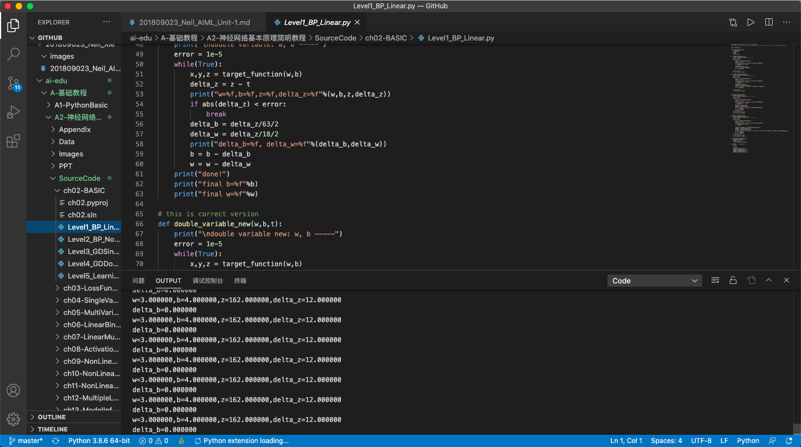

### Level2_BP_NoneLinear>py

> 代码运行截图
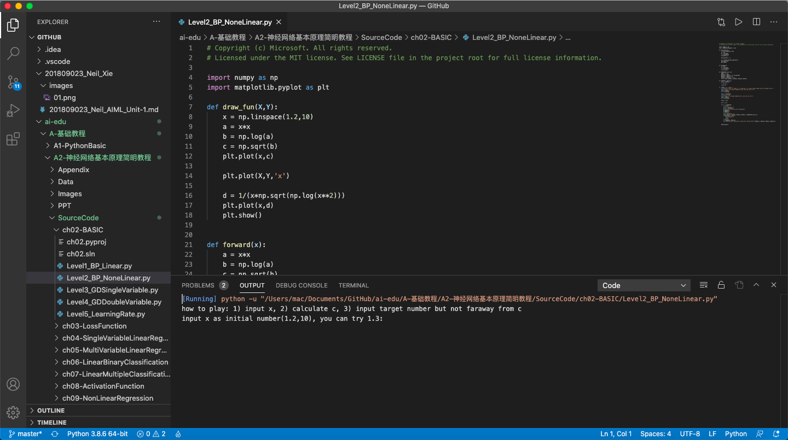
> 代码运行截图
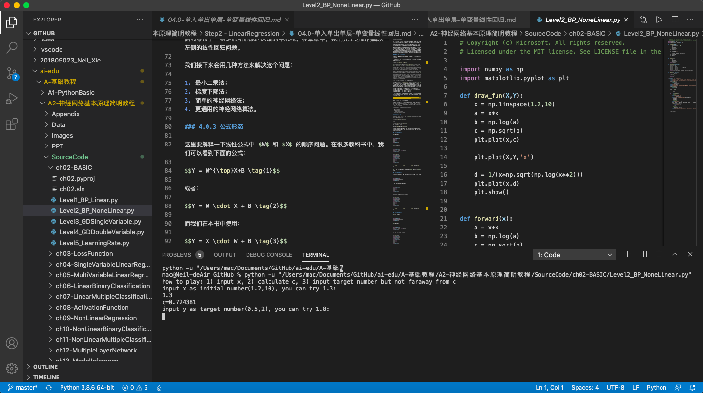
> 代码运行截图


### Level3_GDSingleVariable.py

> 代码运行截图
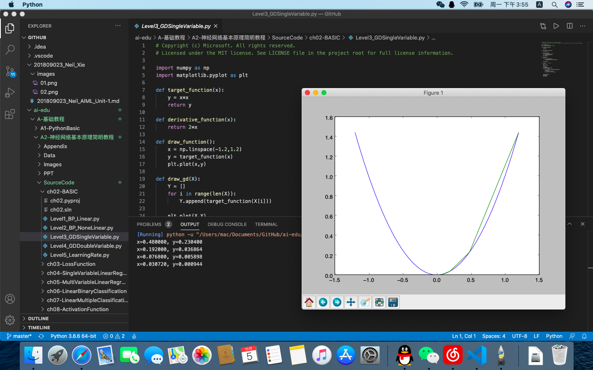

### Level4_GDDoubleVariable.py

> 代码运行截图
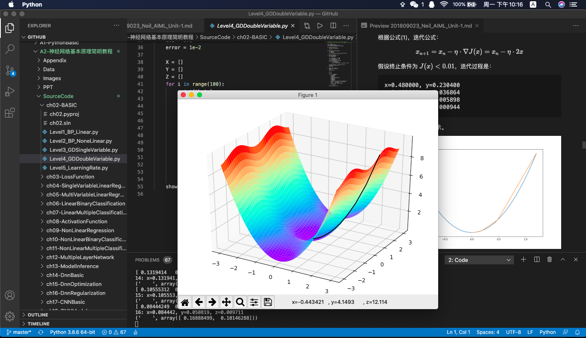


### Level5_LearningRate.py

> 代码运行截图
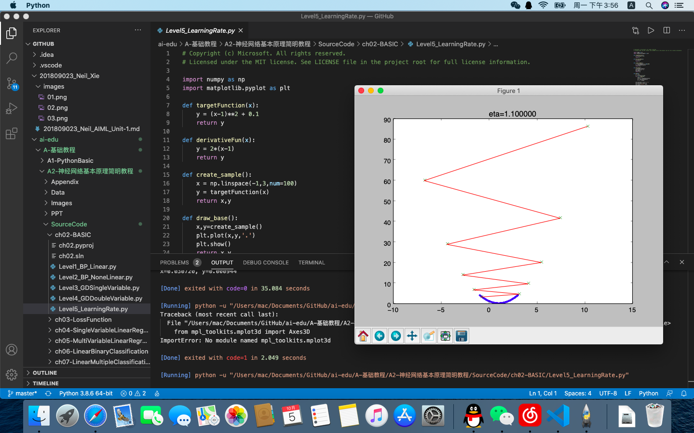

> 代码运行截图
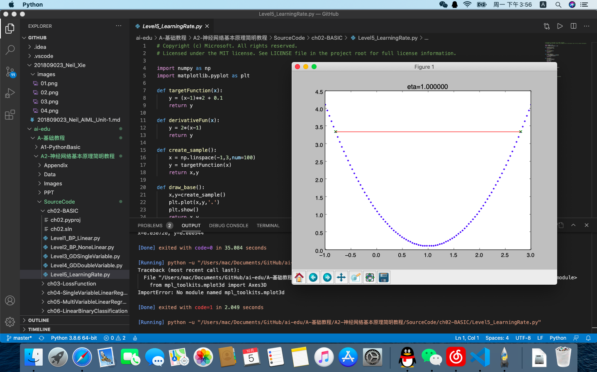

> 代码运行截图


> 代码运行截图
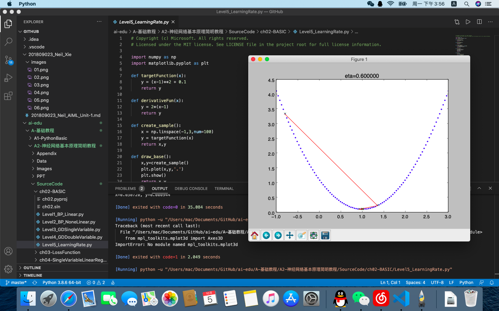

> 代码运行截图
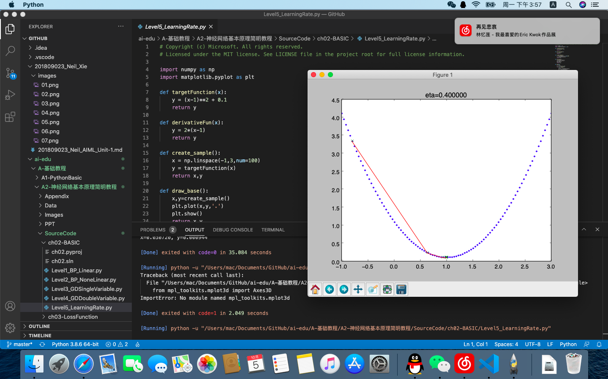

> 代码运行截图
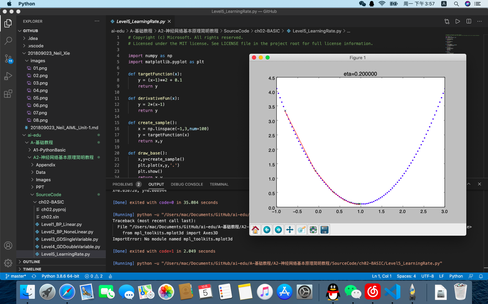

> 代码运行截图
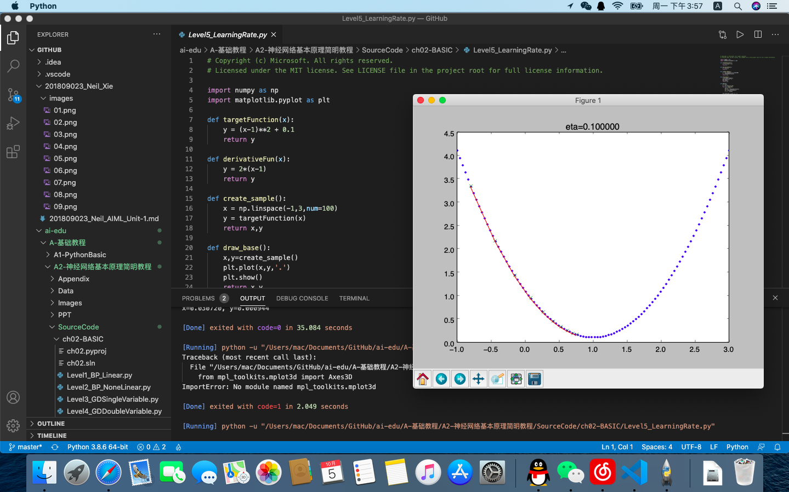


### 学习心得
> Pyhton是一门很重要的语言，恰当的使用numpy以及其他功能是必须的。

