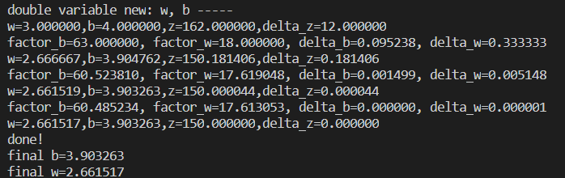

# 初识人工智能概论
九步学习法：基本概念、线性回归、线性分类、非线性回归、非线性分类、模型的推理与部署、深度神经网络、卷积神经网络、循环神经网络
# 第一章 概述
### 人工智能发展简史
- 中文房间问题
  
  图1-1 简单的程序流程图
- 重大发展
  
  图1-2人工智能发展史

### 人工智能的定义

#### 第一个层面，人们对人工智能的**期待**可以分为：

- 智能地把某件特定的事情做好，在某个领域增强人类的智慧，这种方式又叫做智能增强。
- 像人类一样能认知，思考，判断：模拟人类的智能。
#### 第二个层面，**从技术的特点来看**

人工智能发展技术共性：
1. 选择一个模型结构（例如逻辑回归，决策树等），这就是我们所说的程序。
2. 用训练数据（输入和输出）输入模型。这就是上面的经验（E）。
3. 通过不断执行任务（T）并衡量结果（P），让P
不断提高，直到达到一个满意的值。

三种学习类型：监督学习、无监督学习、强化学习。

#### 第三个层面，**从应用的角度来看**，我们看到狭义人工智能在各个领域都取得了很大的成果。
一种是标杆式的任务：ImageNet、翻译领域、阅读理解、围棋、麻将等。

另一种，是AI技术和各种其他技术结合。

我认为这样子的结合才是人工智能真正的价值所在。

## 范式的演化
### 四个阶段：经验、理论、计算仿真、数据探索
###  范式各阶段的应用

实例-“智慧之门”
#### 理论指导
我们先用概率来解决这个问题
---

设 $A$ 为第一次选到了中奖门的概率，$B$ 为改变选择后选到了中奖门的概率，$C$ 为未改变选择后选到了中奖门的概率。

$\displaystyle P(A)=\frac{1}{3}$ （初始选择就是获奖门的获奖概率是$\displaystyle \frac{1}{3}$）

$\displaystyle P(A')=\frac{2}{3}$ （当选中一个门之后， 其它两个门的获奖概率是$\displaystyle \frac{2}{3}$）

$P(B|A)=0$ （用户先选择了一个门，奖品在这个门后，用户后来改变选择，他的获奖概率是 $0$）

$P(C|A)=1$（用户选择了一个门，奖品在门后，后来他不改变选择，他的获奖概率是 $1$）

$P(B|A')=1$，$P(C|A')=0$（类似地， 用户首次选择的门后面没有奖品，他改变选择后，获奖概率是 $1$， 不改变选择，那么获奖概率是 $0$）

$\displaystyle P(B)=P(B|A) \times P(A) + P(B|A') \times P(A')=\frac{2}{3}$（所以，改变选择后中奖的概率，等于$\displaystyle \frac{2}{3}$）

$\displaystyle P(C)=P(C|A') \times P(A') + P(C|A) \times P(A)=\frac{1}{3}$（不改变选择而中奖的概率，等于$\displaystyle \frac{1}{3}$，和 $A$ 一样）

结论：$P(B)>P(C)$

---

#### 数据模拟
‘python’程序实例


我们看到，当我们随机模拟一百万轮换门（switching）和不换门（not switching）的情况后，我们得到了这样的结果：

- 换门：最后得奖的概率是 $0.666572$（约$\displaystyle \frac{2}{3}$）
- 不换门：最后得奖的概率是 $0.334115$（约$\displaystyle \frac{1}{3}$）
  
接下来就是更重要的数据探索，当人类探索客观世界的时候，大部分情况下，我们是不了解新环境的运行规则的。这个时候，我们可以观察自己的行动和客观世界的反馈，判断得失，再总结出规律。这种学习方法，叫强化学习。

#### 内容小结
我觉得范式的演化是从准备好的数据里查找挑选就像查字典一样到根据经验数据与不同环境的交互，这也是人工智能的发展历程。

## 神经网络的基本工作原理
### 神经元细胞的数学模型


图2-1 神经元计算模型

#### 输入 input
$(x_1,x_2,x_3)$ 是外界输入信号
#### 权重 weights
$(w_1,w_2,w_3)$ 是每个输入信号的权重值
#### 偏移 bias
#### 求和计算 sum

$$
\begin{aligned}
Z &= w_1 \cdot x_1 + w_2 \cdot x_2 + w_3 \cdot x_3 + b \\\\
&= \sum_{i=1}^m(w_i \cdot x_i) + b
\end{aligned}
$$
#### 激活函数 activation

求和之后，神经细胞已经处于兴奋状态了，已经决定要向下一个神经元传递信号了，但是要传递多强烈的信号，要由激活函数来确定：

$$A=\sigma{(Z)}$$

如果激活函数是一个阶跃信号的话，会像继电器开合一样咔咔的开启和闭合，在生物体中是不可能有这种装置的，而是一个渐渐变化的过程。所以一般激活函数都是有一个渐变的过程，也就是说是个曲线，如图1-14所示。


图1-2 激活函数图像

至此，一个神经元的工作过程就在电光火石般的一瞬间结束了。

#### 小结

- 一个神经元可以有多个输入。
- 一个神经元只能有一个输出，这个输出可以同时输入给多个神经元。
- 一个神经元的 $w$ 的数量和输入的数量一致。
- 一个神经元只有一个 $b$。
- $w$ 和 $b$ 有人为的初始值，在训练过程中被不断修改。
- $A$ 可以等于 $Z$，即激活函数不是必须有的。
- 一层神经网络中的所有神经元的激活函数必须一致。
  
#### 激活函数的作用
激活函数就是连接一个有一个简单的线性关系，让复杂的问题简化成简单的问题从而连接起来解决这个复杂的问题。来完成神经网络回归和拟合这两个功能。

# 第二章 神经网络中的三个基本概念
这三大概念是：反向传播，梯度下降，损失函数。

首先我们通过三个实例形象的了解了这三大概念。
## “猜数” “射箭” “黑盒子”
###  总结

通过分析三个实例我们可以简单总结一下反向传播与梯度下降的基本工作原理：

1. 初始化；
2. 正向计算；
3. 损失函数为我们提供了计算损失的方法；
4. 梯度下降是在损失函数基础上向着损失最小的点靠近而指引了网络权重调整的方向；
5. 反向传播把损失值反向传给神经网络的每一层，让每一层都根据损失值反向调整权重；
6. Go to 2，直到精度足够好（比如损失函数值小于 $0.001$）。

## 线性反向传播
#### 用Python代码实现以上双变量的反向传播
##### code
```
import numpy as np

def target_function(w,b):
    x = 2*w+3*b
    y=2*b+1
    z=x*y
    return x,y,z

def single_variable(w,b,t):
    print("\nsingle variable: b ----- ")
    error = 1e-5
    while(True):
        x,y,z = target_function(w,b)
        delta_z = z - t
        print("w=%f,b=%f,z=%f,delta_z=%f"%(w,b,z,delta_z))
        if abs(delta_z) < error:
            break
        delta_b = delta_z /63
        print("delta_b=%f"%delta_b)
        b = b - delta_b

    print("done!")
    print("final b=%f"%b)

def single_variable_new(w,b,t):
    print("\nsingle variable new: b ----- ")
    error = 1e-5
    while(True):
        x,y,z = target_function(w,b)
        delta_z = z - t
        print("w=%f,b=%f,z=%f,delta_z=%f"%(w,b,z,delta_z))
        if abs(delta_z) < error:
            break
        factor_b = 2*x+3*y
        delta_b = delta_z/factor_b
        print("factor_b=%f, delta_b=%f"%(factor_b, delta_b))
        b = b - delta_b

    print("done!")
    print("final b=%f"%b)


# this version has a bug
def double_variable(w,b,t):
    print("\ndouble variable: w, b -----")
    error = 1e-5
    while(True):
        x,y,z = target_function(w,b)
        delta_z = z - t
        print("w=%f,b=%f,z=%f,delta_z=%f"%(w,b,z,delta_z))
        if abs(delta_z) < error:
            break
        delta_b = delta_z/63/2
        delta_w = delta_z/18/2
        print("delta_b=%f, delta_w=%f"%(delta_b,delta_w))
        b = b - delta_b
        w = w - delta_w
    print("done!")
    print("final b=%f"%b)
    print("final w=%f"%w)

# this is correct version
def double_variable_new(w,b,t):
    print("\ndouble variable new: w, b -----")
    error = 1e-5
    while(True):
        x,y,z = target_function(w,b)
        delta_z = z - t
        print("w=%f,b=%f,z=%f,delta_z=%f"%(w,b,z,delta_z))
        if abs(delta_z) < error:
            break

        factor_b, factor_w = calculate_wb_factor(x,y)
        delta_b = delta_z/factor_b/2
        delta_w = delta_z/factor_w/2
        print("factor_b=%f, factor_w=%f, delta_b=%f, delta_w=%f"%(factor_b, factor_w, delta_b,delta_w))
        b = b - delta_b
        w = w - delta_w
    print("done!")
    print("final b=%f"%b)
    print("final w=%f"%w)

def calculate_wb_factor(x,y):
    factor_b = 2*x+3*y
    factor_w = 2*y
    return factor_b, factor_w

if __name__ == '__main__':
    w = 3
    b = 4
    t = 150
    single_variable(w,b,t)
    single_variable_new(w,b,t)
    double_variable(w,b,t)
    double_variable_new(w,b,t)

```
> 运行结果


## 非线性反向传播

非线性可以解决更加复杂的问题
#### code
```
import numpy as np
import matplotlib.pyplot as plt

def draw_fun(X,Y):
    x = np.linspace(1.2,10)
    a = x*x
    b = np.log(a)
    c = np.sqrt(b)
    plt.plot(x,c)

    plt.plot(X,Y,'x')

    d = 1/(x*np.sqrt(np.log(x**2)))
    plt.plot(x,d)
    plt.show()


def forward(x):
    a = x*x
    b = np.log(a)
    c = np.sqrt(b)
    return a,b,c

def backward(x,a,b,c,y):
    loss = c - y
    delta_c = loss
    delta_b = delta_c * 2 * np.sqrt(b)
    delta_a = delta_b * a
    delta_x = delta_a / 2 / x
    return loss, delta_x, delta_a, delta_b, delta_c

def update(x, delta_x):
    x = x - delta_x
    if x < 1:
        x = 1.1
    return x

if __name__ == '__main__':
    print("how to play: 1) input x, 2) calculate c, 3) input target number but not faraway from c")
    print("input x as initial number(1.2,10), you can try 1.3:")
    line = input()
    x = float(line)
    
    a,b,c = forward(x)
    print("c=%f" %c)
    print("input y as target number(0.5,2), you can try 1.8:")
    line = input()
    y = float(line)

    error = 1e-3

    X,Y = [],[]

    for i in range(20):
        # forward
        print("forward...")
        a,b,c = forward(x)
        print("x=%f,a=%f,b=%f,c=%f" %(x,a,b,c))
        X.append(x)
        Y.append(c)
        # backward
        print("backward...")
        loss, delta_x, delta_a, delta_b, delta_c = backward(x,a,b,c,y)
        if abs(loss) < error:
            print("done!")
            break
        # update x
        x = update(x, delta_x)
        print("delta_c=%f, delta_b=%f, delta_a=%f, delta_x=%f\n" %(delta_c, delta_b, delta_a, delta_x))

    
    draw_fun(X,Y)

```
>输入数据
```
how to play: 1) input x, 2) calculate c, 3) input target number but not faraway from c
input x as initial number(1.2,10), you can try 1.3:
1.3
c=0.724381
input y as target number(0.5,2), you can try 1.8:
1.8
forward...
x=1.300000,a=1.690000,b=0.524729,c=0.724381
backward...
delta_c=-1.075619, delta_b=-1.558316, delta_a=-2.633554, delta_x=-1.012906

forward...
x=2.312906,a=5.349532,b=1.677009,c=1.294994
backward...
delta_c=-0.505006, delta_b=-1.307960, delta_a=-6.996972, delta_x=-1.512594

forward...
x=3.825499,a=14.634444,b=2.683378,c=1.638102
backward...
delta_c=-0.161898, delta_b=-0.530411, delta_a=-7.762271, delta_x=-1.014544

forward...
x=4.840043,a=23.426014,b=3.153847,c=1.775907
backward...
delta_c=-0.024093, delta_b=-0.085572, delta_a=-2.004621, delta_x=-0.207087

forward...
x=5.047130,a=25.473520,b=3.237639,c=1.799344
backward...
done!
```
>运行结果


## 梯度下降
#### 梯度下降的三要素

1. 当前点；
2. 方向；
3. 步长。

#### 为什么说是“梯度下降”？

“梯度下降”包含了两层含义：

1. 梯度：函数当前位置的最快上升点；
2. 下降：与导数相反的方向，用数学语言描述就是那个减号。

亦即与上升相反的方向运动，就是下降。
### 单变量函数的梯度下降
code
```
import numpy as np
import matplotlib.pyplot as plt

def target_function(x):
    y = x*x
    return y

def derivative_function(x):
    return 2*x

def draw_function():
    x = np.linspace(-1.2,1.2)
    y = target_function(x)
    plt.plot(x,y)

def draw_gd(X):
    Y = []
    for i in range(len(X)):
        Y.append(target_function(X[i]))
    
    plt.plot(X,Y)

if __name__ == '__main__':
    x = 1.2
    eta = 0.3
    error = 1e-3
    X = []
    X.append(x)
    y = target_function(x)
    while y > error:
        x = x - eta * derivative_function(x)
        X.append(x)
        y = target_function(x)
        print("x=%f, y=%f" %(x,y))


    draw_function()
    draw_gd(X)
    plt.show()

```
>运行结果
 ```
x=0.480000, y=0.230400
x=0.192000, y=0.036864
x=0.076800, y=0.005898
x=0.030720, y=0.000944
```


### 双变量梯度函数的下降
code 
```
import numpy as np
import matplotlib.pyplot as plt
from mpl_toolkits.mplot3d import Axes3D

def target_function(x,y):
    J = x**2 + np.sin(y)**2
    return J

def derivative_function(theta):
    x = theta[0]
    y = theta[1]
    return np.array([2*x,2*np.sin(y)*np.cos(y)])

def show_3d_surface(x, y, z):
    fig = plt.figure()
    ax = Axes3D(fig)
 
    u = np.linspace(-3, 3, 100)
    v = np.linspace(-3, 3, 100)
    X, Y = np.meshgrid(u, v)
    R = np.zeros((len(u), len(v)))
    for i in range(len(u)):
        for j in range(len(v)):
            R[i, j] = X[i, j]**2 + np.sin(Y[i, j])**2

    ax.plot_surface(X, Y, R, cmap='rainbow')
    plt.plot(x,y,z,c='black')
    plt.show()

if __name__ == '__main__':
    theta = np.array([3,1])
    eta = 0.1
    error = 1e-2

    X = []
    Y = []
    Z = []
    for i in range(100):
        print(theta)
        x=theta[0]
        y=theta[1]
        z=target_function(x,y)
        X.append(x)
        Y.append(y)
        Z.append(z)
        print("%d: x=%f, y=%f, z=%f" %(i,x,y,z))
        d_theta = derivative_function(theta)
        print("    ",d_theta)
        theta = theta - eta * d_theta
        if z < error:
            break
    show_3d_surface(X,Y,Z)
```
>运行结果
```[3 1]
0: x=3.000000, y=1.000000, z=9.708073
     [6.         0.90929743]
[2.4        0.90907026]
1: x=2.400000, y=0.909070, z=6.382415
     [4.8        0.96956606]
[1.92       0.81211365]
2: x=1.920000, y=0.812114, z=4.213103
     [3.84      0.9985729]
[1.536      0.71225636]
3: x=1.536000, y=0.712256, z=2.786415
     [3.072      0.98931962]
[1.2288    0.6133244]
4: x=1.228800, y=0.613324, z=1.841252
     [2.4576     0.94136341]
[0.98304    0.51918806]
5: x=0.983040, y=0.519188, z=1.212558
     [1.96608    0.86158105]
[0.786432   0.43302995]
6: x=0.786432, y=0.433030, z=0.794559
     [1.572864   0.76178233]
[0.6291456  0.35685172]
7: x=0.629146, y=0.356852, z=0.517853
     [1.2582912  0.65463784]
[0.50331648 0.29138794]
8: x=0.503316, y=0.291388, z=0.335858
     [1.00663296 0.55034373]
[0.40265318 0.23635356]
9: x=0.402653, y=0.236354, z=0.216960
     [0.80530637 0.45529821]
[0.32212255 0.19082374]
10: x=0.322123, y=0.190824, z=0.139737
     [0.64424509 0.37244992]
[0.25769804 0.15357875]
11: x=0.257698, y=0.153579, z=0.089810
     [0.51539608 0.3023504 ]
[0.20615843 0.12334371]
12: x=0.206158, y=0.123344, z=0.057638
     [0.41231686 0.24419301]
[0.16492674 0.09892441]
13: x=0.164927, y=0.098924, z=0.036955
     [0.32985349 0.19656057]
[0.1319414  0.07926835]
14: x=0.131941, y=0.079268, z=0.023679
     [0.26388279 0.15787343]
[0.10555312 0.06348101]
15: x=0.105553, y=0.063481, z=0.015166
     [0.21110623 0.1266212 ]
[0.08444249 0.05081889]
16: x=0.084442, y=0.050819, z=0.009711
     [0.16888499 0.10146288]
```


### 学习率η的选择

在公式表达时，学习率被表示为$\eta$。在代码里，我们把学习率定义为`learning_rate`，或者`eta`。针对上面的例子，试验不同的学习率对迭代情况的影响，如表2-5所示。

表2-2 不同学习率对迭代情况的影响

|学习率|迭代路线图|说明|
|---|---|---|
|1.0||学习率太大，迭代的情况很糟糕，在一条水平线上跳来跳去，永远也不能下降。|
|0.8||学习率大，会有这种左右跳跃的情况发生，这不利于神经网络的训练。|
|0.4||学习率合适，损失值会从单侧下降，4步以后基本接近了理想值。|
|0.1||学习率较小，损失值会从单侧下降，但下降速度非常慢，10步了还没有到达理想状态。|

# 第三章 损失函数
## 神经网络中常用的损失函数

- 均方差函数，主要用于回归

- 交叉熵函数，主要用于分类

二者都是非负函数，极值在底部，用梯度下降法可以求解。
### 均方差函数 
该函数就是最直观的一个损失函数了，计算预测值和真实值之间的欧式距离。预测值和真实值越接近，两者的均方差就越小。

均方差函数常用于线性回归(linear regression)，即函数拟合(function fitting)。公式如下：

$$
loss = {1 \over 2}(z-y)^2 \tag{单样本}
$$

$$
J=\frac{1}{2m} \sum_{i=1}^m (z_i-y_i)^2 \tag{多样本}
$$

## 3.2 交叉熵损失函数

交叉熵（Cross Entropy）是Shannon信息论中一个重要概念，主要用于度量两个概率分布间的差异性信息。在信息论中，交叉熵是表示两个概率分布 $p,q$ 的差异，其中 $p$ 表示真实分布，$q$ 表示预测分布，那么 $H(p,q)$ 就称为交叉熵：

$$H(p,q)=\sum_i p_i \cdot \ln {1 \over q_i} = - \sum_i p_i \ln q_i \tag{1}$$

交叉熵可在神经网络中作为损失函数，$p$ 表示真实标记的分布，$q$ 则为训练后的模型的预测标记分布，交叉熵损失函数可以衡量 $p$ 与 $q$ 的相似性。

**交叉熵函数常用于逻辑回归(logistic regression)，也就是分类(classification)。**

# 总结
在这一部分的学习过程中，了解了神经网络是基于什么基础之上建立的。更深刻的感悟是要加强对于数学这么学科的学习，很多的迭代计算都是先通过数学理论计算得出来的，再使用python语言实现，用形象直观的图来展现各种函数的性质的作用。人工智能就是基于这些函数上的各种神经网络的深层次交互，除此之外还与环境交互来实现我们想象的“人工智能”。