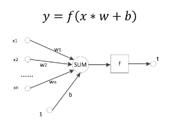
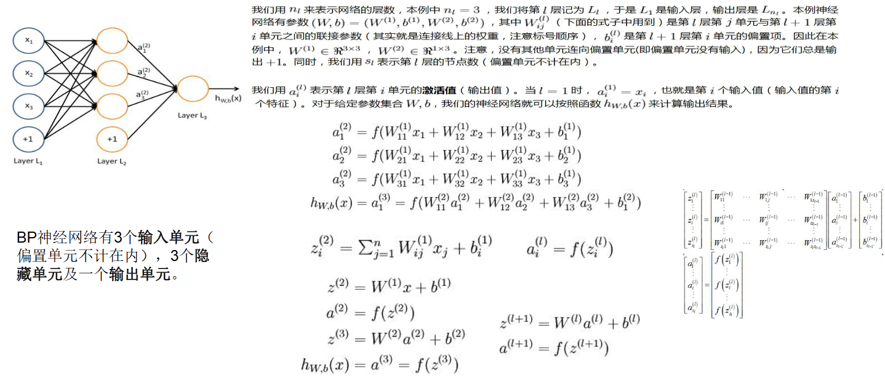
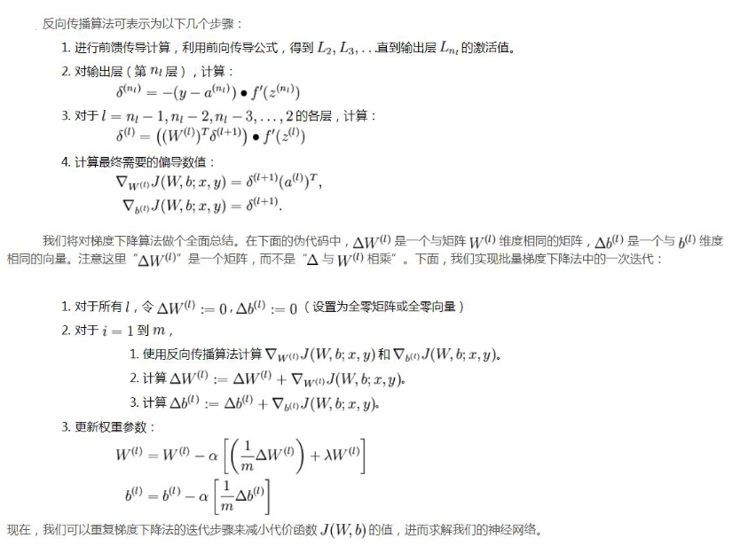
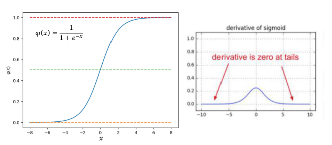
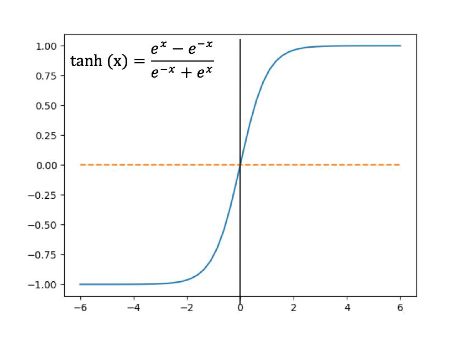
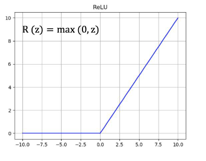
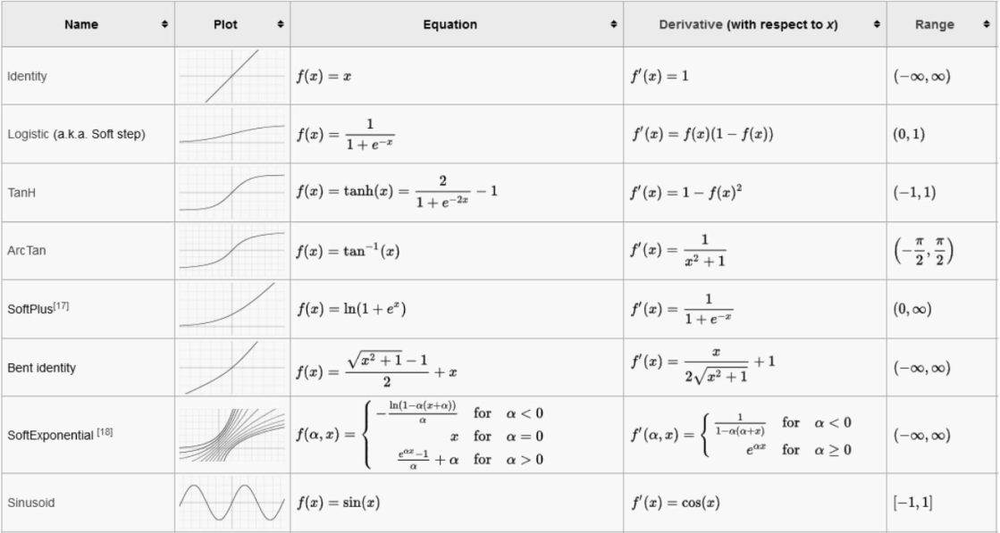

# 一、神经网络基础

## **1.1神经网络简介**

章节介绍：

1.人工神经网络（Artificial Newral Network,即ANN）是由简单神经元经过连接形成网状结构，通过调节各连接的权重值改变连接的强度，进而实现感知判断

2.反向传播（Back Propagation,即BP）算法的提出进一步推动了神经网络的发展(**BP神经网络实质上就是一个多元函数的优化模型**)
    

>## 一、神经网络介绍

- 传统神经网络结构简单

- 神经网络的训练目的:学习到一个模型，实现输出一个期望的目标值（**学习方式：在外界输入样本的刺激下不断改变网络的连接权值**）

- 传统神经网络分为：前馈型神经网络、反馈型神经网络、自组织神经网络（**具有不同的学习训练算法：监督型学习算法&非监督型学习算法**）

- 感知器/感应机：结构最简单的前馈神经网络，**主要用于求解分类问题** 

神经元的作用：对输入空间进行直线划分，单层感知机无法解决最简单的***非线性可分问题*** -->**异或问题（XOR）**单层感知机无法通过一条线进行分割

==>感知机可以顺利求解与（AND）和或（OR）问题

## **1.2BP神经网络**

>前馈神经网络（Feed Forward Newral Network）（因为采用BP算法也可称为BP神经网络）

- 一种单向多层的网络结构（**即信息是从输入层开始，逐层向一个方向传递，一直到输出层结束**）
- “前馈”：输入信号的传播方向为前向（**此过程中并不调整各层的权值参数**）

  反传播时：将误差逐层向后传递->使用权值参数对特征的记忆（**通过反向传播BP算法来计算各层网络中神经元之间边的权重**）
  ==>**BP算法具有非线性映射能力**（理论上逼近任意连续函，从而实现对模型的学习）

>BP神经网络（**一种前馈神经网络，其参数权重值是由反向传播学习算法进行调整的**）
- BP神经网络模型拓扑结构：输入层、隐层、输出层（**利用激活函数来实现从输入到输出的任意非线性映射，从而模拟各层神经元之间的交互**）

==>激活函数（**必须满足处处可导**）

eg: Sigmoid函数连续可微，求导合适，单调递增，输出值为0-1之间的连续量（**适合作为神经网络的激活函数**）

>BP神经网络的训练

>反向传播总结

**BP神经网络训练过程基本步骤：**

- 初始化网络权值和神经元的阈值，一般通过随机的方式进行初始化
- 前向传播：计算隐层神经元和输出层神经元的输出
- 后向传播：根据目标函数公式修正权值wij

上述过程反复迭代，通过损失函数和成本函数对前向传播结果进行判定，并通过后向传播过程对权重参数进行修正，起到监督学习的作用，一直到满足终止条件为止

BP神经网络的核心思想是**由后层误差推导前层误差，一层一层的反传，最终获得各层的误差估计，从而得到参数的权重值**。由于权值参数的运算量过大，一般采用梯度下降法来实现

所谓梯度下降就是**让参数向着梯度的反方向前进一段距离，不断重复，直到梯度接近零时停止**。此时，所有的参数恰好达到使损失函数取得最低值的状态，为了避免局部最优，可以采用随机化梯度下降

>训练方法神经网络

- 批量梯度下降法
- 随机梯度下降法
- Mini-batch梯度下降法

>激活函数

激活函数的**性质**：
- 非线性
- 可微性
- 单调性
- f(x)≈x
- 输出值范围
- 计算简单
- 归一化

常用激活函数：
- Sigmoid函数

Sigmoid函数的**优点**在**子输出范围有限，数据在传递的过程中不容易发散，并且其输出范围为(0,1)，可以在输出层表示概率值**，如下图所示。Sigmoid函数的导数是非零的，很容易计算

Sigmoid函数的主要缺点是**梯度下降非常明显，且两头过子平坦，容易出现梯度消失的情况，输出的值域不对称，并非像tanh函数那样值域是-1到1**

-双曲正切函数（tanh）

双曲正切函数将数据映射到[-1,1]，解决了Sigmoid函数**输出值域不对称问题**。另外，**它是完全可微分和反对称的，对称中心在原点。**然而它的输出值域两头依旧过于平坦，梯度消失问题仍然存在。

- ReLU函数

ReLU函数是目前神经网络里常用的激活函数，**由于ReLU函数是线性特点使其收敛速度比sigmoid、Tanh更快，而且没有梯度饱和的情况出现。**计算更加高效，相比于sigmoid、Tanh函数，只需要一个阈值就可以得到激活值，不需要对输入归一化来防止达到饱和

>如何选择激活函数？

- 通常使用ReLU函数，并注意设置好学习率
- 如果存在死亡神经元的问题，就尝试Leaky ReLU或Maxout函数
- 尽量避免使用sigmoid函数
tahn函数大部分情况下效果不如ReLU和Maxout函数

