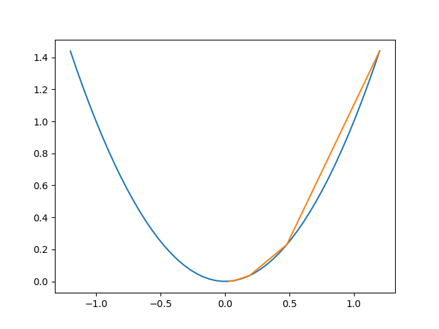
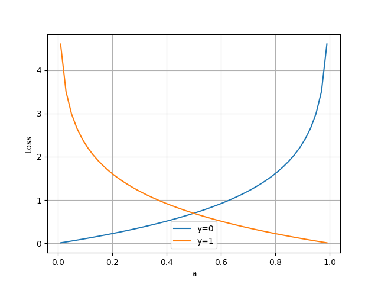

# **1.1人工智能的定义**

>## 人们对人工智能的期待
- **智能地把某件特定的事情做好，在某个领域增强人类的智慧，这种方式又叫做智能增强**
- **像人类一样能认知，思考，判断：模拟人类的智能**
  
>## 技术特点
- 如果一个程序解决任务（T）的效能（用P表示）随着经验（E）得到了提高，那么，这个程序就能从经验（E）中学到了关于任务（T）的知识，并让衡量值（P）得到提高。

1. 选择一个模型结构（例如逻辑回归，决策树等），这就是上面说的程序。
2. 用训练数据（输入和输出）输入模型。这就是上面的经验（E）。
3. 通过不断执行任务（T）并衡量结果（P），让P
不断提高，直到达到一个满意的值。

- **机器学习方法类型**
1. <font color=#FF000 >**监督学习**</font>（Supervised Learning）
2. <font color=#FF000 >**无监督学习**</font>（Unsupervised Learning）
3. <font color=#FF000 >**强化学习**</font>（Reinforcement Learning）

- **神经元模型**

在生物神经网络中，每个神经元与其他神经元相连，当它兴奋时，就会像相邻的神经元发送化学物质，从而改变这些神经元内的电位；如果某神经元的电位超过了一个阈值，那么它就会被激活（兴奋），向其他神经元发送化学物质。把许多这样的神经元按照一定的层次结构连接起来，我们就构建了一个神经网络


>## 应用角度：<font color=#000FF >**狭义人工智能在各个领域都取得了很大的成果。**</font>

- 弱人工智能领域中机器学习部分的内容：

- 模型的生成与应用

- 软件开发流程与AI模型开发流程的协作


# **1.2范式的演化**

>## 范式演化的四个阶段
- 第一阶段：经验
- 第二阶段：理论
- 第三阶段：计算仿真
- 第四阶段：数据探索

>## 范式各阶段的应用
- 经验归纳
- 理论推导
- 数据模拟
- 数据探索


# **1.3神经网络的基本工作原理**

>## 神经元细胞的数学模型

神经网络由<font color=#FF000 >**基本的神经元**</font>组成，下图就是一个神经元的数学/计算模型，便于我们用程序来实现。


- <font color=#000FF >**输入 input**</font>

$(x_1,x_2,x_3)$ 是外界输入信号，一般是一个训练数据样本的多个属性

- <font color=#000FF >**权重 weights**</font>

$(w_1,w_2,w_3)$ 是每个输入信号的权重值

- <font color=#000FF >**偏移 bias**</font>
  
从生物学上解释，在脑神经细胞中，一定是输入信号的电平/电流大于某个临界值时，神经元细胞才会处于兴奋状态，这个 $b$ 实际就是那个临界值。

- <font color=#000FF >**求和计算 sum**</font>

- <font color=#000FF >**激活函数 activation**</font>

求和之后，神经细胞已经处于兴奋状态了，已经决定要向下一个神经元传递信号了，但是要传递多强烈的信号，要由激活函数来确定：

$$A=\sigma{(Z)}$$

如果激活函数是一个阶跃信号的话，会像继电器开合一样咔咔的开启和闭合，在生物体中是不可能有这种装置的，而是一个渐渐变化的过程。所以一般激活函数都是有一个渐变的过程，也就是说是个曲线，如下图所示。


至此，一个神经元的工作过程就在电光火石般的一瞬间结束了。

## 小结:

- 一个神经元可以有多个输入。
- 一个神经元只能有一个输出，这个输出可以同时输入给多个神经元。
- 一个神经元的 $w$ 的数量和输入的数量一致。
- 一个神经元只有一个 $b$。
- $w$ 和 $b$ 有人为的初始值，在训练过程中被不断修改。
- $A$ 可以等于 $Z$，即激活函数不是必须有的。
- 一层神经网络中的所有神经元的激活函数必须一致。

>## 神经网络的训练过程
- 单层神经网络模型

这是一个单层的神经网络，有 $m$ 个输入 (这里 $m=3$)，有 $n$ 个输出 (这里 $n=2$)。在神经网络中，$b$ 到每个神经元的权值来表示实际的偏移值，亦即 $(b_1,b_2)$，这样便于矩阵运算。也有些人把 $b$ 写成 $x_0$，其实是同一个效果，即把偏移值看做是神经元的一个输入。

- $(x_1,x_2,x_3)$ 是一个样本数据的三个特征值
- $(w_{11},w_{21},w_{31})$ 是 $(x_1,x_2,x_3)$ 到 $n1$ 的权重
- $(w_{12},w_{22},w_{32})$ 是 $(x_1,x_2,x_3)$ 到 $n2$ 的权重
- $b_1$ 是 $n1$ 的偏移
- $b_2$ 是 $n2$ 的偏移


- 训练流程


- 前提条件

 1. 首先是我们已经有了训练数据；
 2. 我们已经根据数据的规模、领域，建立了神经网络的基本结构，比如有几层，每一层有几个神经元；
 3. 定义好损失函数来合理地计算误差。

- 步骤
1. 随机初始化权重矩阵，可以根据正态分布等来初始化。
2. 拿一个或一批数据作为输入，带入权重矩阵中计算，再通过激活函数传入下一层，最终得到预测值。
3. 拿到Id-1样本的真实值 ；
4. 计算损失，假设用均方差函数;
5. 根据一些神奇的数学公式（反向微分），把 $Loss=4$ 这个值用大喇叭喊话，告诉在前面计算的步骤中，影响 $A=5$ 这个值的每一个权重矩阵，然后对这些权重矩阵中的值做一个微小的修改；
6. 用Id-2样本作为输入再次训练（Go to 2）；
7. 这样不断地迭代下去，直到以下一个或几个条件满足就停止训练：损失函数值非常小；准确度满足了要求；迭代到了指定的次数。

>## 神经网络中的矩阵运算

下是一个两层的神经网络，包含隐藏层和输出层，输入层不算做一层。


$$
z1_1 = x_1 \cdot w1_{1,1}+ x_2 \cdot w1_{2,1}+b1_1
$$
$$
z1_2 = x_1 \cdot w1_{1,2}+ x_2 \cdot w1_{2,2}+b1_2
$$
$$
z1_3 = x_1 \cdot w1_{1,3}+ x_2 \cdot w1_{2,3}+b1_3
$$

变成矩阵运算：

$$
z1_1=
\begin{pmatrix}
x_1 & x_2
\end{pmatrix}
\begin{pmatrix}
w1_{1,1} \\\\
w1_{2,1}
\end{pmatrix}
+b1_1
$$

$$
z1_2=
\begin{pmatrix}
x_1 & x_2
\end{pmatrix}
\begin{pmatrix}
w1_{1,2} \\\\
w1_{2,2}
\end{pmatrix}
+b1_2
$$

$$
z1_3=
\begin{pmatrix}
x_1 & x_2
\end{pmatrix}
\begin{pmatrix}
w1_{1,3} \\\\
w1_{2,3}
\end{pmatrix}
+b1_3
$$

再变成大矩阵：

$$
Z1 =
\begin{pmatrix}
x_1 & x_2 
\end{pmatrix}
\begin{pmatrix}
w1_{1,1}&w1_{1,2}&w1_{1,3} \\\\
w1_{2,1}&w1_{2,2}&w1_{2,3} \\\\
\end{pmatrix}
+\begin{pmatrix}
b1_1 & b1_2 & b1_3
\end{pmatrix}
$$

最后变成矩阵符号：

$$Z1 = X \cdot W1 + B1$$

然后是激活函数运算：

$$A1=a(Z1)$$

同理可得：

$$Z2 = A1 \cdot W2 + B2$$

注意：损失函数不是前向计算的一部分。

>## 神经网络的主要功能
- 回归（Regression）或者叫做拟合（Fitting）

单层的神经网络能够模拟一条二维平面上的直线，从而可以完成线性分割任务。而理论证明，两层神经网络可以无限逼近任意连续函数。下图所示就是一个两层神经网络拟合复杂曲线的实例。


- 分类（Classification）

如下图，二维平面中有两类点，红色的和蓝色的，用一条直线肯定不能把两者分开了。


>## 为什么需要激活函数
- 激活函数的作用

如果我们不运用激活函数的话，则输出信号将仅仅是一个简单的线性函数。线性函数一个一级多项式。线性方程是很容易解决的，但是它们的复杂性有限，并且从数据中学习复杂函数映射的能力更小。一个没有激活函数的神经网络将只不过是一个线性回归模型罢了，不能解决现实世界中的大多数非线性问题。

没有激活函数，我们的神经网络将无法学习和模拟其他复杂类型的数据，例如图像、视频、音频、语音等。这就是为什么我们要使用人工神经网络技术，诸如深度学习，来理解一些复杂的事情，一些相互之间具有很多隐藏层的非线性问题。


# **2.0反向传播与梯度下降**

>反向传播与梯度下降的基本工作原理：

1. 初始化；
2. 正向计算；
3. 损失函数为我们提供了计算损失的方法；
4. 梯度下降是在损失函数基础上向着损失最小的点靠近而指引了网络权重调整的方向；
5. 反向传播把损失值反向传给神经网络的每一层，让每一层都根据损失值反向调整权重；
6. Go to 2，直到精度足够好（比如损失函数值小于 $0.001$）。

# **2.1 线性反向传播**

>反向传播求解 $b$

-求 $b$ 的偏导

这次我们令 $w$ 的值固定为 $3$，变化 $b$ 的值，目标还是让 $z=150$。同上一小节一样，先求 $b$ 的偏导数。

注意，在上一小节中，求 $w$ 的导数只经过了一条路：从 $z$ 到 $x$ 到 $w$。但是求 $b$ 的导数时要经过两条路，如图2-7所示：

1. 从 $z$ 到 $x$ 到 $b$；
2. 从 $z$ 到 $y$ 到 $b$。


从复合导数公式来看，这两者应该是相加的关系，所以有：

$$\frac{\partial{z}}{\partial{b}}=\frac{\partial{z}}{\partial{x}} \cdot \frac{\partial{x}}{\partial{b}}+\frac{\partial{z}}{\partial{y}}\cdot\frac{\partial{y}}{\partial{b}}=y \cdot 3+x \cdot 2=63 \tag{7}$$

其中：

$$\frac{\partial{z}}{\partial{x}}=\frac{\partial{}}{\partial{x}}(x \cdot y)=y=9$$
$$\frac{\partial{z}}{\partial{y}}=\frac{\partial{}}{\partial{y}}(x \cdot y)=x=18$$
$$\frac{\partial{x}}{\partial{b}}=\frac{\partial{}}{\partial{b}}(2w+3b)=3$$
$$\frac{\partial{y}}{\partial{b}}=\frac{\partial{}}{\partial{b}}(2b+1)=2$$

验证一下链式求导的正确性。把公式5再拿过来：

$$z=x \cdot y=(2w+3b)(2b+1)=4wb+2w+6b^2+3b \tag{5}$$

对上式求b的偏导：

$$
\frac{\partial z}{\partial b}=4w+12b+3=12+48+3=63 \tag{8}
$$

结果和公式7的链式法则一样。

-  求 $b$ 的具体变化值

公式7和公式8的含义是：当 $b$ 变化一点点时，$z$ 会发生 $b$ 的变化值 $63$ 倍的变化。记住我们的目标是让 $z=150$，目前在初始状态时是 $162$，所以，问题转化为：当我们需要 $z$ 从 $162$ 变到 $150$ 时，$b$ 需要变化多少？

既然：

$$\Delta z = 63 \cdot \Delta b$$

则：

$$
\Delta b = \frac{\Delta z}{63}=\frac{162-150}{63}=0.1905
$$

所以：
$$
b=b-0.1905=3.8095
$$
$$x=2w+3b=17.4285$$
$$y=2b+1=8.619$$
$$z=x \cdot y=17.4285 \times 8.619=150.2162$$

- 代码测试

```Python
import numpy as np

def target_function(w,b):
    x = 2*w+3*b
    y=2*b+1
    z=x*y
    return x,y,z

def single_variable(w,b,t):
    print("\nsingle variable: b ----- ")
    error = 1e-5
    while(True):
        x,y,z = target_function(w,b)
        delta_z = z - t
        print("w=%f,b=%f,z=%f,delta_z=%f"%(w,b,z,delta_z))
        if abs(delta_z) < error:
            break
        delta_b = delta_z /63
        print("delta_b=%f"%delta_b)
        b = b - delta_b

    print("done!")
    print("final b=%f"%b)

if __name__ == '__main__':
    w = 3
    b = 4
    t = 150
    single_variable(w,b,t)
    single_variable_new(w,b,t)
    double_variable(w,b,t)
    double_variable_new(w,b,t)
```

# ** 2.2 非线性反向传播**


>## 正向过程

1. 第1个人，输入层，随机输入第一个 $x$ 值，$x$ 的取值范围 $(1,10]$，假设第一个数是 $2$；
2. 第2个人，第一层网络计算，接收第1个人传入 $x$ 的值，计算：$a=x^2$；
3. 第3个人，第二层网络计算，接收第2个人传入 $a$ 的值，计算：$b=\ln (a)$；
4. 第4个人，第三层网络计算，接收第3个人传入 $b$ 的值，计算：$c=\sqrt{b}$；
5. 第5个人，输出层，接收第4个人传入 $c$ 的值

>## 反向过程

6. 第5个人，计算 $y$ 与 $c$ 的差值：$\Delta c = c - y$，传回给第4个人
7. 第4个人，接收第5个人传回$\Delta c$，计算 $\Delta b = \Delta c \cdot 2\sqrt{b}$
8. 第3个人，接收第4个人传回$\Delta b$，计算 $\Delta a = \Delta b \cdot a$
9. 第2个人，接收第3个人传回$\Delta a$，计算 $\Delta x = \frac{\Delta}{2x}$
10. 第1个人，接收第2个人传回$\Delta x$，更新 $x \leftarrow x - \Delta x$，回到第1步

- 代码测试
```Python
import numpy as np
import matplotlib.pyplot as plt

def draw_fun(X,Y):
    x = np.linspace(1.2,10)
    a = x*x
    b = np.log(a)
    c = np.sqrt(b)
    plt.plot(x,c)

    plt.plot(X,Y,'x')

    d = 1/(x*np.sqrt(np.log(x**2)))
    plt.plot(x,d)
    plt.show()


def forward(x):
    a = x*x
    b = np.log(a)
    c = np.sqrt(b)
    return a,b,c

def backward(x,a,b,c,y):
    loss = c - y
    delta_c = loss
    delta_b = delta_c * 2 * np.sqrt(b)
    delta_a = delta_b * a
    delta_x = delta_a / 2 / x
    return loss, delta_x, delta_a, delta_b, delta_c

def update(x, delta_x):
    x = x - delta_x
    if x < 1:
        x = 1.1
    return x

if __name__ == '__main__':
    print("how to play: 1) input x, 2) calculate c, 3) input target number but not faraway from c")
    print("input x as initial number(1.2,10), you can try 1.3:")
    line = input()
    x = float(line)
    
    a,b,c = forward(x)
    print("c=%f" %c)
    print("input y as target number(0.5,2), you can try 1.8:")
    line = input()
    y = float(line)

    error = 1e-3

    X,Y = [],[]

    for i in range(20):
        # forward
        print("forward...")
        a,b,c = forward(x)
        print("x=%f,a=%f,b=%f,c=%f" %(x,a,b,c))
        X.append(x)
        Y.append(c)
        # backward
        print("backward...")
        loss, delta_x, delta_a, delta_b, delta_c = backward(x,a,b,c,y)
        if abs(loss) < error:
            print("done!")
            break
        # update x
        x = update(x, delta_x)
        print("delta_c=%f, delta_b=%f, delta_a=%f, delta_x=%f\n" %(delta_c, delta_b, delta_a, delta_x))

    
    draw_fun(X,Y)
```
- 运行结果


# ** 2.3 梯度下降**

>梯度下降的数学公式：

$$\theta_{n+1} = \theta_{n} - \eta \cdot \nabla J(\theta) \tag{1}$$

其中：

- $\theta_{n+1}$：下一个值；
- $\theta_n$：当前值；
- $-$：减号，梯度的反向；
- $\eta$：学习率或步长，控制每一步走的距离，不要太快以免错过了最佳景点，不要太慢以免时间太长；
- $\nabla$：梯度，函数当前位置的最快上升点；
- $J(\theta)$：函数。

>梯度下降的三要素

1. 当前点；
2. 方向；
3. 步长。

>“梯度下降”包含了两层含义：

1. 梯度：函数当前位置的最快上升点；
2. 下降：与导数相反的方向，用数学语言描述就是那个减号。

亦即与上升相反的方向运动，就是下降。


上图解释了在函数极值点的两侧做梯度下降的计算过程，梯度下降的目的就是使得x值向极值点逼近。

>单变量函数的梯度下降

假设一个单变量函数：

$$J(x) = x ^2$$

我们的目的是找到该函数的最小值，于是计算其微分：

$$J'(x) = 2x$$

假设初始位置为：

$$x_0=1.2$$

假设学习率：

$$\eta = 0.3$$

根据公式(1)，迭代公式：

$$x_{n+1} = x_{n} - \eta \cdot \nabla J(x)= x_{n} - \eta \cdot 2x$$

假设终止条件为 $J(x)<0.01$，迭代过程是：
```
x=0.480000, y=0.230400
x=0.192000, y=0.036864
x=0.076800, y=0.005898
x=0.030720, y=0.000944
```

上面的过程如下图所示。


>代码测试

```Python
import numpy as np
import matplotlib.pyplot as plt

def target_function(x):
    y = x*x
    return y

def derivative_function(x):
    return 2*x

def draw_function():
    x = np.linspace(-1.2,1.2)
    y = target_function(x)
    plt.plot(x,y)

def draw_gd(X):
    Y = []
    for i in range(len(X)):
        Y.append(target_function(X[i]))
    
    plt.plot(X,Y)

if __name__ == '__main__':
    x = 1.2
    eta = 0.3
    error = 1e-3
    X = []
    X.append(x)
    y = target_function(x)
    while y > error:
        x = x - eta * derivative_function(x)
        X.append(x)
        y = target_function(x)
        print("x=%f, y=%f" %(x,y))


    draw_function()
    draw_gd(X)
    plt.show()
```

> 运行结果



# 3.0 损失函数概论

>损失函数的作用:<font color=#FF000 >**计算神经网络每次迭代的前向计算结果与真实值的差距，从而指导下一步的训练向正确的方向进行**</font>。

>使用损失函数的具体步骤：

1. 用随机值初始化前向计算公式的参数；
2. 代入样本，计算输出的预测值；
3. 用损失函数计算预测值和标签值（真实值）的误差；
4. 根据损失函数的导数，沿梯度最小方向将误差回传，修正前向计算公式中的各个权重值；
5. 进入第2步重复, 直到损失函数值达到一个满意的值就停止迭代。

>神经网络中常用的损失函数

- 均方差函数，主要用于回归

- 交叉熵函数，主要用于分类

二者都是非负函数，极值在底部，用梯度下降法可以求解。


# 3.1 均方差函数

```Python
    s = 200
    W = np.linspace(w-2,w+2,s)
    B = np.linspace(b-2,b+2,s)
    LOSS = np.zeros((s,s))
    for i in range(len(W)):
        for j in range(len(B)):
            z = W[i] * x + B[j]
            loss = CostFunction(x,y,z,m)
            LOSS[i,j] = round(loss, 2)
```

上述代码针对每个 $(w,b)$ 组合计算出了一个损失值，保留小数点后2位，放在`LOSS`矩阵中，如下所示：

```
[[4.69 4.63 4.57 ... 0.72 0.74 0.76]
 [4.66 4.6  4.54 ... 0.73 0.75 0.77]
 [4.62 4.56 4.5  ... 0.73 0.75 0.77]
 ...
 [0.7  0.68 0.66 ... 4.57 4.63 4.69]
 [0.69 0.67 0.65 ... 4.6  4.66 4.72]
 [0.68 0.66 0.64 ... 4.63 4.69 4.75]]
```

然后遍历矩阵中的损失函数值，在具有相同值的位置上绘制相同颜色的点，比如，把所有值为0.72的点绘制成红色，把所有值为0.75的点绘制成蓝色......，这样就可以得到下图。


# 3.2 交叉熵损失函数

>交叉熵:

交叉熵（Cross Entropy）是Shannon信息论中一个重要概念，主要用于度量两个概率分布间的差异性信息。在信息论中，交叉熵是表示两个概率分布 $p,q$ 的差异，其中 $p$ 表示真实分布，$q$ 表示预测分布，那么 $H(p,q)$ 就称为交叉熵：

$$H(p,q)=\sum_i p_i \cdot \ln {1 \over q_i} = - \sum_i p_i \ln q_i \tag{1}$$

交叉熵可在神经网络中作为损失函数，$p$ 表示真实标记的分布，$q$ 则为训练后的模型的预测标记分布，交叉熵损失函数可以衡量 $p$ 与 $q$ 的相似性。

**交叉熵函数常用于逻辑回归(logistic regression)，也就是分类(classification)。**

>相对熵(KL散度)

相对熵又称KL散度，如果我们对于同一个随机变量 $x$ 有两个单独的概率分布 $P(x)$ 和 $Q(x)$，我们可以使用 KL 散度（Kullback-Leibler (KL) divergence）来衡量这两个分布的差异，这个相当于信息论范畴的均方差。

KL散度的计算公式：

$$D_{KL}(p||q)=\sum_{j=1}^n p(x_j) \ln{p(x_j) \over q(x_j)} \tag{4}$$

$n$ 为事件的所有可能性。$D$ 的值越小，表示 $q$ 分布和 $p$ 分布越接近。


>代码测试

```Python
import numpy as np
import matplotlib.pyplot as plt

def target_function2(a,y):
    p1 = y * np.log(a)
    p2 = (1-y) * np.log(1-a)
    y = -p1 - p2
    return y

if __name__ == '__main__':
    err = 1e-2  # avoid invalid math caculation
    a = np.linspace(0+err,1-err)
    y = 0
    z1 = target_function2(a,y)
    y = 1
    z2 = target_function2(a,y)
    p1, = plt.plot(a,z1)
    p2, = plt.plot(a,z2)
    plt.grid()
    plt.legend([p1,p2],["y=0","y=1"])
    plt.xlabel("a")
    plt.ylabel("Loss")
    plt.show()
```

> 运行结果
