# 第一次作业 #
智能181 郭小凡 201809027
### 后文符号约定：
|符号|含义|
|---|---|
|$x$|训练用样本值|
|$x_1$|第一个样本或样本的第一个特征值，在上下文中会有说明|
|$x_{12},x_{1,2}$|第1个样本的第2个特征值|
|$X$|训练用多样本矩阵|
|$y$|训练用样本标签值|
|$y_1$|第一个样本的标签值|
|$Y$|训练用多样本标签矩阵|
|$z$|线性运算的结果值|
|$Z$|线性运算的结果矩阵|
|$Z1$|第一层网络的线性运算结果矩阵|
|$\sigma$|激活函数|
|$a$|激活函数结果值|
|$A$|激活函数结果矩阵|
|$A1$|第一层网络的激活函数结果矩阵|
|$w$|权重参数值|
|$w_{12},w_{1,2}$|权重参数矩阵中的第1行第2列的权重值|
|$w1_{12},w1_{1,2}$|第一层网络的权重参数矩阵中的第1行第2列的权重值|
|$W$|权重参数矩阵|
|$W1$|第一层网络的权重参数矩阵|
|$b$|偏移参数值|
|$b_1$|偏移参数矩阵中的第1个偏移值|
|$b2_1$|第二层网络的偏移参数矩阵中的第1个偏移值|
|$B$|偏移参数矩阵（向量）|
|$B1$|第一层网络的偏移参数矩阵（向量）|
|$X^T$|X的转置矩阵|
|$X^{-1}$|X的逆矩阵|
|$loss,loss(w,b)$|单样本误差函数|
|$J, J(w,b)$|多样本损失函数|

## 1.1 人工智能的定义 ##
人工智能是一个非常庞杂的概念———从人们的期待、技术、应用等角度，人工智能都有不同的定义。

### 第一层面：人们对人工智能的期待 ###
- **可以智能地把某件特定的事情做好，在某个领域增强人类的智慧，即“智能增强”。** 如搜索引擎、自动语言翻译等，也称作“弱人工智能”，或“狭义人工智能”
- **像人类一样能认知，思考，判断，即“模拟人类的智能”。** 也称作“通用人工智能”（Artificial General Intelligence，AGI），或“强人工智能”。这类人工智能暂时未能取得实际应用。

### 第二层面：技术特点 ###
机器学习可以大致分为三种类型：
1. 监督学习（Supervised Learning）
    通过标注的数据来学习。

2. 无监督学习（Unsupervised Learning）
    通过没有标注的数据来学习。这种算法可以发现数据中自然形成的共同特性（聚类），可以用来发现不同数据之间的联系。
3. 强化学习（Reinforcement Learning）
    我们可以让程序选择和它的环境互动，环境给程序的反馈，程序从反馈中学习到新的模型。

#### 神经网络模型 ####
在生物神经网络中，每个神经元与其他神经元相连，当它兴奋时，就会像相邻的神经元发送化学物质，从而改变这些神经元内的电位；如果某神经元的电位超过了一个阈值，那么它就会激活（兴奋），向其他神经元发送化学物质。把许多这样的神经元按照一定的层次结构连接起来，我们就构建了一个神经网络，如图所示：


                        图1.1 M-P神经元模型

### 第三层面：应用角度 ###
1. 标杆式任务。
2. AI技术和其他技术结合，解决实际需求。
狭义人工智能已在各个领域取得很大成果。

## 1.2 范式的演化 ##
### 范式演化的四个阶段 ###
1. **第一阶段——经验总结**：描述自然现象，归纳总结规律。
2. **第二阶段——理论推导**：定量定性计算，构建各种模型。
3. **第三阶段——计算仿真**：实验模拟仿真，推演复杂现象。
4. **第四阶段——数据探索**：收集分析数据，探索全兴规律。


## 1.3 神经网络基本工作原理 ##
神经网络由基本的神经元组成。

### 神经元细胞的数学模型 ###


            图1.3.1 神经元计算模型
1. **输入 input**【多个】：$(x_1,x_2,x_3)$ 是外界输入信号，一般是一个训练数据样本的多个属性。
2. **输出 output**【一个】：输出可同时输入给多个神经元。
3. **权重 weights**【数量与输入量一致】：$(w_1,w_2,w_3)$ 是每个输入信号的权重值。
4. **偏移 bias**【一个】：使得直线能够沿 $Y$ 轴上下移动。
5. **求和计算 sum**：
$$
\begin{aligned}
Z &= w_1 \cdot x_1 + w_2 \cdot x_2 + w_3 \cdot x_3 + b = \sum_{i=1}^m(w_i \cdot x_i) + b
\end{aligned}
$$
5. **激活函数 activation**【非必须存在】：$$A=\sigma{(Z)}$$
  若激活函数是一个阶跃信号的话，信号传输口会不断开启、闭合。但在生物体中信号的变化一定是一个渐渐变化的过程。所以一般激活函数都有一个渐变的过程，即**激活函数是曲线**。

### 神经网络训练过程 ###
#### 单层神经网络模型 ####


              图1.3.2 单层神经网络模型
由图易得，单层神经网络中有 $m$ 个输入 (示例模型中 $m=3$)，有 $n$ 个输出 (示例模型中 $n=2$)。在神经网络中，$b$ 到每个神经元的权值表示实际的偏移值，即 $(b_1,b_2)$。

- $(x_1,x_2,x_3)$ 是一个样本数据的三个特征值
- $(w_{11},w_{21},w_{31})$ 是 $(x_1,x_2,x_3)$ 到 $n1$ 的权重
- $(w_{12},w_{22},w_{32})$ 是 $(x_1,x_2,x_3)$ 到 $n2$ 的权重
- $b_1$ 是 $n1$ 的偏移
- $b_2$ 是 $n2$ 的偏移   

#### 训练流程图 ####


                  图1.3.3 神经网络训练流程图    
##### 训练条件 #####
1. 已拥有一定的训练数据；
2. 已根据数据的规模、领域，建立神经网络的基本结构；
3. 定义损失函数，以便合理计算误差。

#### 神经网络中的矩阵运算 ####


                    图1.3.4 双层神经网络示例
由图易得：
$$z1_1 = x_1 \cdot w1_{1,1}+ x_2 \cdot w1_{2,1}+b1_1$$
$$z1_2 = x_1 \cdot w1_{1,2}+ x_2 \cdot w1_{2,2}+b1_2$$
$$z1_3 = x_1 \cdot w1_{1,3}+ x_2 \cdot w1_{2,3}+b1_3$$
矩阵写为：
$$
z1_1=
\begin{pmatrix}
x_1 & x_2
\end{pmatrix}
\begin{pmatrix}
w1_{1,1} \\\\
w1_{2,1}
\end{pmatrix}
+b1_1
$$

$$
z1_2=
\begin{pmatrix}
x_1 & x_2
\end{pmatrix}
\begin{pmatrix}
w1_{1,2} \\\\
w1_{2,2}
\end{pmatrix}
+b1_2
$$

$$
z1_3=
\begin{pmatrix}
x_1 & x_2
\end{pmatrix}
\begin{pmatrix}
w1_{1,3} \\\\
w1_{2,3}
\end{pmatrix}
+b1_3
$$
可转化为：

$$
Z1 =
\begin{pmatrix}
x_1 & x_2 
\end{pmatrix}
\begin{pmatrix}
w1_{1,1}&w1_{1,2}&w1_{1,3} \\\\
w1_{2,1}&w1_{2,2}&w1_{2,3} \\\\
\end{pmatrix}
+\begin{pmatrix}
b1_1 & b1_2 & b1_3
\end{pmatrix}
$$
即：
$$Z1 = X \cdot W1 + B1$$
激活函数：
$$A1=a(Z1)$$
同理可得：$$Z2 = A1 \cdot W2 + B2$$
**注：** 损失函数不是前向计算的一部分。

#### 神经网络主要功能 ####
1. **回归（Regression）** 或称 **拟合（Fitting）**
  单层的神经网络能够模拟一条二维平面上的直线，从而可以完成线性分割任务。理论证明，两层神经网络可以无限逼近任意连续函数。
2. **分类（Classification）**
   对两类或多类样本数据的边界的抽象。

**神经网络的训练结果，是一大堆的权重组成的数组（近似解）**

## 2.0 神经网络中重要基本概念 ##
### 反向传播与梯度下降的基本工作原理： ###
1. 初始化；
2. 正向计算；
3. 损失函数提供计算损失的方法；
4. 梯度下降是在损失函数基础上向着损失最小的点靠近，指引网络权重调整的方向；
5. 反向传播把损失值反向传给神经网络的每一层，让每一层都根据损失值反向调整权重；
6. Go to 2，直到精度满足要求。

### 2.1 线性反向传播 ###
**正向计算**
最终的 z 值受到许多因素的影响：变量 $w$ ，变量 $b$，计算式 $x$，计算式 $y$。

**代码测试结果**
```
PS C:\Users\DELL\Desktop\apprendre\人工智能\ai-edu\A-基础教程\A2-神经网络基本原理简明教程\SourceCode\ch02-BASIC> & C:/Users/DELL/AppData/Local/Programs/Python/Python38-32/python.exe c:/Users/DELL/Desktop/apprendre/人工智能/ai-edu/A-基础教程/A2-神经网络基本原理简明教程/SourceCode/ch02-BASIC/Level1_BP_Linear.py

single variable: b ----- 
w=3.000000,b=4.000000,z=162.000000,delta_z=12.000000
delta_b=0.190476
w=3.000000,b=3.809524,z=150.217687,delta_z=0.217687
delta_b=0.003455
w=3.000000,b=3.806068,z=150.007970,delta_z=0.007970
delta_b=0.000127
w=3.000000,b=3.805942,z=150.000294,delta_z=0.000294
delta_b=0.000005
w=3.000000,b=3.805937,z=150.000011,delta_z=0.000011
delta_b=0.000000
w=3.000000,b=3.805937,z=150.000000,delta_z=0.000000
done!
final b=3.805937

single variable new: b -----
w=3.000000,b=4.000000,z=162.000000,delta_z=12.000000
factor_b=63.000000, delta_b=0.190476
w=3.000000,b=3.809524,z=150.217687,delta_z=0.217687
factor_b=60.714286, delta_b=0.003585
w=3.000000,b=3.805938,z=150.000077,delta_z=0.000077
factor_b=60.671261, delta_b=0.000001
w=3.000000,b=3.805937,z=150.000000,delta_z=0.000000
done!
final b=3.805937

double variable: w, b -----
w=3.000000,b=4.000000,z=162.000000,delta_z=12.000000
delta_b=0.095238, delta_w=0.333333
w=2.666667,b=3.904762,z=150.181406,delta_z=0.181406
delta_b=0.001440, delta_w=0.005039
w=2.661628,b=3.903322,z=150.005526,delta_z=0.005526
delta_b=0.000044, delta_w=0.000154
w=2.661474,b=3.903278,z=150.000170,delta_z=0.000170
delta_b=0.000001, delta_w=0.000005
w=2.661469,b=3.903277,z=150.000005,delta_z=0.000005
done!
final b=3.903277
final w=2.661469

double variable new: w, b -----
w=3.000000,b=4.000000,z=162.000000,delta_z=12.000000
factor_b=63.000000, factor_w=18.000000, delta_b=0.095238, delta_w=0.333333
w=2.666667,b=3.904762,z=150.181406,delta_z=0.181406
factor_b=60.523810, factor_w=17.619048, delta_b=0.001499, delta_w=0.005148
w=2.661519,b=3.903263,z=150.000044,delta_z=0.000044
factor_b=60.485234, factor_w=17.613053, delta_b=0.000000, delta_w=0.000001
w=2.661517,b=3.903263,z=150.000000,delta_z=0.000000
done!
final b=3.903263
final w=2.661517
PS C:\Users\DELL\Desktop\apprendre\人工智能\ai-edu\A-基础教程\A2-神经网络基本原理简明教程\SourceCode\ch02-BASIC>
```

### 2.2 非线性反向传播 ###


               图2.2.1 非线性的反向传播
其中$1<x<=10,0<y<2.15$。

**正向过程**
1. 输入层，随机输入第一个 $x$ 值，$x$ 的取值范围 $(1,10]$；
2. 第一层网络计算，接收传入的 $x$ 值，计算：$a=x^2$；
3. 第二层网络计算，接收传入的 $a$ 值，计算：$b=\ln (a)$；
4. 第三层网络计算，接收传入的 $b$ 值，计算：$c=\sqrt{b}$；
5. 输出层，接收传入的 $c$ 的值。

**反向过程**
1. 计算 $y$ 与 $c$ 的差值：$\Delta c = c - y$，前传；
2. 接收传回的 $\Delta c$，计算 $\Delta b = \Delta c \cdot 2\sqrt{b}$；
3. 接收传回的 $\Delta b$，计算 $\Delta a = \Delta b \cdot a$；
4. 接收传回的 $\Delta a$，计算 $\Delta x = \frac{\Delta}{2x}$；
5. 接收传回的 $\Delta x$，更新 $x \leftarrow x - \Delta x$；
6. 回到第1步。

#### 正向与反向的迭代计算公式 ####

|方向|公式|
|---|---|
|正向|$x=x-\Delta x$|
|正向|$a=x^2$|
|正向|$b=\ln(a)$|
|正向|$c=\sqrt{b}$|
||标签值y|
|反向|$\Delta c = c - y$|
|反向|$\Delta b = \Delta c \cdot 2\sqrt{b}$|
|反向|$\Delta a = \Delta b \cdot a$|
|反向|$\Delta x = \Delta a / 2x$|

**代码测试**
**运行终端**
```

C:\Users\DELL>python c:/Users/DELL/Desktop/apprendre/人工智能/ai-edu/A-基础教程/A2-神经网络基本原理简明教程/SourceCode/ch02-BASIC/Level2_BP_NoneLinear.py
how to play: 1) input x, 2) calculate c, 3) input target number but not faraway from c
input x as initial number(1.2,10), you can try 1.3:
1.3
c=0.724381
input y as target number(0.5,2), you can try 1.8:
1.8
forward...
x=1.300000,a=1.690000,b=0.524729,c=0.724381
backward...
delta_c=-1.075619, delta_b=-1.558316, delta_a=-2.633554, delta_x=-1.012906

forward...
x=2.312906,a=5.349532,b=1.677009,c=1.294994
backward...
delta_c=-0.505006, delta_b=-1.307960, delta_a=-6.996972, delta_x=-1.512594

forward...
x=3.825499,a=14.634444,b=2.683378,c=1.638102
backward...
delta_c=-0.161898, delta_b=-0.530411, delta_a=-7.762271, delta_x=-1.014544

forward...
x=4.840043,a=23.426014,b=3.153847,c=1.775907
backward...
delta_c=-0.024093, delta_b=-0.085572, delta_a=-2.004621, delta_x=-0.207087

forward...
x=5.047130,a=25.473520,b=3.237639,c=1.799344
backward...
done!
```
**运行结果图像**
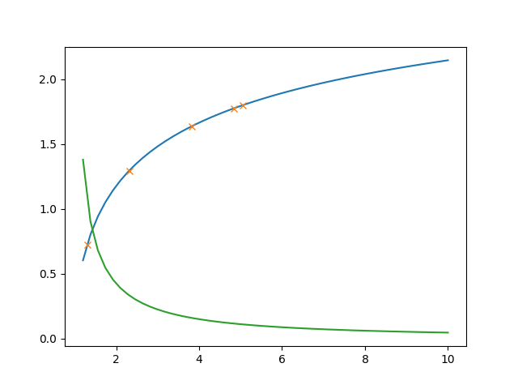

### 2.3 梯度下降 ###
梯度下降的数学公式：

$$\theta_{n+1} = \theta_{n} - \eta \cdot \nabla J(\theta) $$

其中：
1. $\theta_{n+1}$：下一个值；
2. $\theta_n$：当前值；
3. $-$：减号，梯度的反向；
4. $\eta$：学习率/步长；
5. $\nabla$：梯度，函数当前位置的最快上升点；
6. $J(\theta)$：函数。

#### 梯度下降的三要素 ####

1. 当前点；
2. 方向；
3. 步长。

**梯度**：函数当前位置的最快上升点；
**下降**：与导数相反的方向，用数学语言描述就是那个减号。
**梯度下降的目的就是使得x值向极值点逼近。**

                表2.3.1 在三维空间内的梯度下降过程

|观察角度1|观察角度2|
|--|--|
|||

#### 学习率η的选择 ####
在公式表达时，学习率被表示为$\eta$。

                 表2.3.2 不同学习率对迭代情况的影响

|学习率|迭代路线图|说明|
|---|---|---|
|1.0||学习率太大，迭代的情况很糟糕，在一条水平线上跳来跳去，永远也不能下降。|
|0.8||学习率大，会有这种左右跳跃的情况发生，这不利于神经网络的训练。|
|0.4||学习率合适，损失值会从单侧下降，4步以后基本接近了理想值。|
|0.1||学习率较小，损失值会从单侧下降，但下降速度非常慢，10步了还没有到达理想状态。|

**代码测试**
**1. GDSingleVariable**
**运行终端**
```
PS C:\Users\DELL\Desktop\apprendre\人工智能\ai-edu\A-基础教程\A2-神经网络基本原理简明教程\SourceCode\ch02-BASIC> & C:/Users/DELL/AppData/Local/Programs/Python/Python38-32/python.exe c:/Users/DELL/Desktop/apprendre/人工智能/ai-edu/A-基础教程/A2-神经网络基本原理简明教程/SourceCode/ch02-BASIC/Level3_GDSingleVariable.py
x=0.480000, y=0.230400
x=0.192000, y=0.036864
x=0.076800, y=0.005898
x=0.030720, y=0.000944
```
**运行结果图像**


**2. GDDoubleVariable**
**运行终端**
```
PS C:\Users\DELL\Desktop\apprendre\人工智能\ai-edu\A-基础教程\A2-神经网络基本原理简明教程\SourceCode2-BASIC> & C:/Users/DELL/AppData/Local/Programs/Python/Python38-32/python.exe c:/Users/DELL/Desktop/endre/人工智能/ai-edu/A-基础教程/A2-神经网络基本原理简明教程/SourceCode/ch02-BASIC/Level4_GDDoubleVale.py
[3 1]
0: x=3.000000, y=1.000000, z=9.708073
     [6.         0.90929743]
[2.4        0.90907026]
1: x=2.400000, y=0.909070, z=6.382415
     [4.8        0.96956606]
[1.92       0.81211365]
2: x=1.920000, y=0.812114, z=4.213103
     [3.84      0.9985729]
[1.536      0.71225636]
3: x=1.536000, y=0.712256, z=2.786415
     [3.072      0.98931962]
[1.2288    0.6133244]
4: x=1.228800, y=0.613324, z=1.841252
     [2.4576     0.94136341]
[0.98304    0.51918806]
5: x=0.983040, y=0.519188, z=1.212558
     [1.96608    0.86158105]
[0.786432   0.43302995]
6: x=0.786432, y=0.433030, z=0.794559
     [1.572864   0.76178233]
[0.6291456  0.35685172]
7: x=0.629146, y=0.356852, z=0.517853
     [1.2582912  0.65463784]
[0.50331648 0.29138794]
8: x=0.503316, y=0.291388, z=0.335858
     [1.00663296 0.55034373]
[0.40265318 0.23635356]
9: x=0.402653, y=0.236354, z=0.216960
     [0.80530637 0.45529821]
[0.32212255 0.19082374]
10: x=0.322123, y=0.190824, z=0.139737
     [0.64424509 0.37244992]
[0.25769804 0.15357875]
11: x=0.257698, y=0.153579, z=0.089810
     [0.51539608 0.3023504 ]
[0.20615843 0.12334371]
12: x=0.206158, y=0.123344, z=0.057638
     [0.41231686 0.24419301]
[0.16492674 0.09892441]
13: x=0.164927, y=0.098924, z=0.036955
     [0.32985349 0.19656057]
[0.1319414  0.07926835]
14: x=0.131941, y=0.079268, z=0.023679
15: x=0.105553, y=0.063481, z=0.015166
     [0.21110623 0.1266212 ]
     [0.16888499 0.10146288]
PS C:\Users\DELL\Desktop\apprendre\人工智能\ai-edu\A-基础教程\A2-神经网络基本原理简明教程\SourceCodeurceCode\ch02-BASIC> & C:/Users/DELL/AppData/Local/Programs/Python/Python38-32/python.exe c:Desktop/ode/ch02-BASIC/Level5_LearningRate.py                                                       arningRa
PS C:\Users\DELL\Desktop\apprendre\人工智能\ai-edu\A-基础教程\A2-神经网络基本原理简明教程\SourceCode\ch02-BASIC> & C:/Users/DELL/AppData/Local/Programs/Python/Python38-32/python.exe c:urceCode/Users/DELL/Desktop/apprendre/人工智能/ai-edu/A-基础教程/A2-神经网络基本原理简明教程/SourceCDesktop/ode/ch02-BASIC/Level5_LearningRate.py                                                       arningRa
PS C:\Users\DELL\Desktop\apprendre\人工智能\ai-edu\A-基础教程\A2-神经网络基本原理简明教程\SourceCod> & C:/Users/DELL/AppData/Local/Programs/Python/Python38-32/python.exe c:/Users/DELL/urceCodeDesktop/apprendre/人工智能/ai-edu/A-基础教程/A2-神经网络基本原理简明教程/SourceCode/ch02-BASIC/Level4_GDDoubleVariable.py
[3 1]
0: x=3.000000, y=1.000000, z=9.708073
     [6.         0.90929743]
[2.4        0.90907026]
1: x=2.400000, y=0.909070, z=6.382415
     [4.8        0.96956606]
[1.92       0.81211365]
2: x=1.920000, y=0.812114, z=4.213103
     [3.84      0.9985729]
[1.536      0.71225636]
3: x=1.536000, y=0.712256, z=2.786415
     [3.072      0.98931962]
[1.2288    0.6133244]
4: x=1.228800, y=0.613324, z=1.841252
     [2.4576     0.94136341]
[0.98304    0.51918806]
5: x=0.983040, y=0.519188, z=1.212558
     [1.96608    0.86158105]
[0.786432   0.43302995]
6: x=0.786432, y=0.433030, z=0.794559
     [1.572864   0.76178233]
[0.6291456  0.35685172]
7: x=0.629146, y=0.356852, z=0.517853
     [1.2582912  0.65463784]
[0.50331648 0.29138794]
8: x=0.503316, y=0.291388, z=0.335858
     [1.00663296 0.55034373]
[0.40265318 0.23635356]
9: x=0.402653, y=0.236354, z=0.216960
     [0.80530637 0.45529821]
[0.32212255 0.19082374]
10: x=0.322123, y=0.190824, z=0.139737
     [0.64424509 0.37244992]
[0.25769804 0.15357875]
11: x=0.257698, y=0.153579, z=0.089810
     [0.51539608 0.3023504 ]
[0.20615843 0.12334371]
12: x=0.206158, y=0.123344, z=0.057638
     [0.41231686 0.24419301]
[0.16492674 0.09892441]
13: x=0.164927, y=0.098924, z=0.036955
     [0.32985349 0.19656057]
[0.1319414  0.07926835]
PS C:\Users\DELL\Desktop\apprendre\人工智能\ai-edu\A-基础教程\A2-神经网络基本原理简明教程\SourceCode\ch02-BASIC> & C:/Users/DELL/AppData/Local/Programs/Python/Python38-32/python.exe c:/Users/DELL/Desktop/apprendre/人工智能/ai-edu/A-基础教程/A2-神经网络基本原理简明教程/SourceCode/ch02-BASIC/Level4_GDDoubleVariable.py
[3 1]
0: x=3.000000, y=1.000000, z=9.708073
     [6.         0.90929743]
[2.4        0.90907026]
1: x=2.400000, y=0.909070, z=6.382415
     [4.8        0.96956606]
[1.92       0.81211365]
2: x=1.920000, y=0.812114, z=4.213103
     [3.84      0.9985729]
[1.536      0.71225636]
3: x=1.536000, y=0.712256, z=2.786415
     [3.072      0.98931962]
[1.2288    0.6133244]
4: x=1.228800, y=0.613324, z=1.841252
     [2.4576     0.94136341]
[0.98304    0.51918806]
5: x=0.983040, y=0.519188, z=1.212558
     [1.96608    0.86158105]
[0.786432   0.43302995]
6: x=0.786432, y=0.433030, z=0.794559
     [1.572864   0.76178233]
[0.6291456  0.35685172]
7: x=0.629146, y=0.356852, z=0.517853
     [1.2582912  0.65463784]
[0.50331648 0.29138794]
8: x=0.503316, y=0.291388, z=0.335858
     [1.00663296 0.55034373]
[0.40265318 0.23635356]
9: x=0.402653, y=0.236354, z=0.216960
     [0.80530637 0.45529821]
[0.32212255 0.19082374]
10: x=0.322123, y=0.190824, z=0.139737
     [0.64424509 0.37244992]
[0.25769804 0.15357875]
11: x=0.257698, y=0.153579, z=0.089810
     [0.51539608 0.3023504 ]
[0.20615843 0.12334371]
12: x=0.206158, y=0.123344, z=0.057638
     [0.41231686 0.24419301]
[0.16492674 0.09892441]
13: x=0.164927, y=0.098924, z=0.036955
     [0.32985349 0.19656057]
[0.1319414  0.07926835]
14: x=0.131941, y=0.079268, z=0.023679
     [0.26388279 0.15787343]
[0.10555312 0.06348101]
15: x=0.105553, y=0.063481, z=0.015166
     [0.21110623 0.1266212 ]
[0.08444249 0.05081889]
16: x=0.084442, y=0.050819, z=0.009711
     [0.16888499 0.10146288]
PS C:\Users\DELL\Desktop\apprendre\人工智能\ai-edu\A-基础教程\A2-神经网络基本原理简明教程\SourceCode\ch02-BASIC>
```
**运行结果图像**
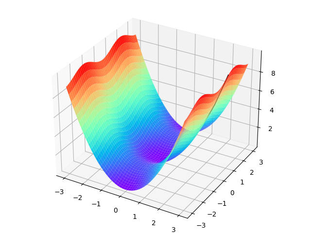

**3. LearningRate**
**运行终端**
```
PS C:\Users\DELL\Desktop\apprendre\人工智能\ai-edu\A-基础教程\A2-神经网络基本原理简明教程\SourceCode\ch02-BASIC> & C:/Users/DELL/AppData/Local/Programs/Python/Python38-32/python.exe c:/Users/DELL/Desktop/apprendre/人工智能/ai-edu/A-基础教程/A2-神经网络基本原理简明教程/SourceCode/ch02-BASIC/Level5_LearningRate.py
```
**运行结果图像**
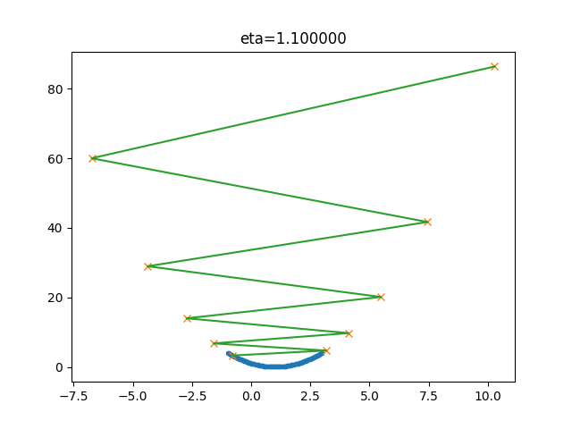
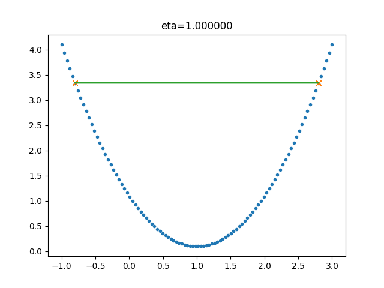
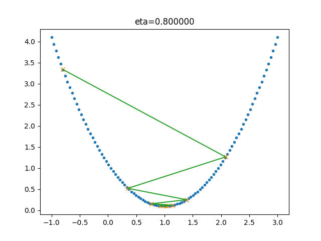
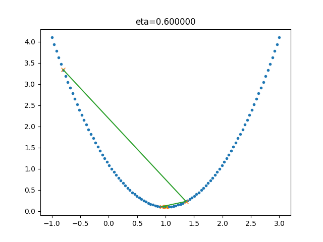
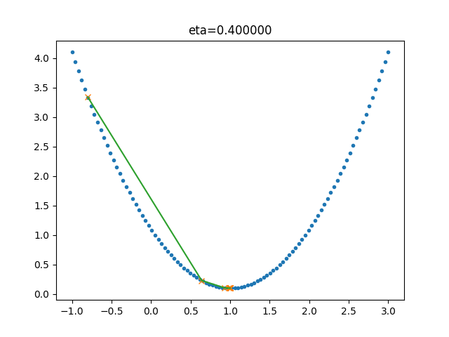
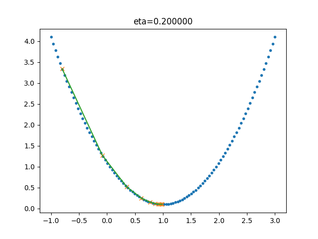
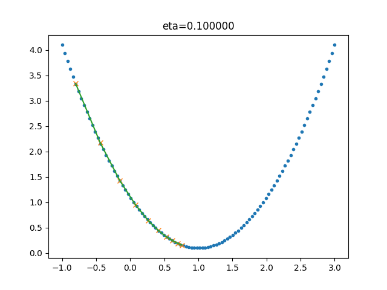
 
## 3.0 损失函数 ##
**“损失”就是所有样本的“误差”的总和**，亦即（$m$ 为样本数）：

$$损失 = \sum^m_{i=1}误差_i$$

$$J = \sum_{i=1}^m loss_i$$
其中：
1.  $J$ ：具体的损失函数。
2.  $loss$ ：误差值。

### 损失函数的作用 ###
计算神经网络每次迭代的前向计算结果与真实值的差距，从而指导下一步的训练向正确的方向进行。
#### 损失函数使用方法 ####

1. 用随机值初始化前向计算公式的参数；
2. 代入样本，计算输出的预测值；
3. 用损失函数计算预测值和标签值（真实值）的误差；
4. 根据损失函数的导数，沿梯度最小方向将误差回传，修正前向计算公式中的各个权重值；
5. 进入第2步重复, 直到损失函数值达到一个满意的值就停止迭代。

### 机器学习常用损失函数 ###

1. Gold Standard Loss $/$ 0-1误差
$$
loss=\begin{cases}
0 & a=y \\\\
1 & a \ne y 
\end{cases}
$$

2. 绝对值损失函数

$$
loss = |y-a|
$$

3.  Hinge Loss，铰链/折页损失函数 $/$ 最大边界损失函数

$$
loss=\max(0,1-y \cdot a) \qquad y=\pm 1
$$

4. Log Loss，对数损失函数 $/$ 交叉熵损失函数(cross entropy error)【主要用于分类】

$$
loss = -[y \cdot \ln (a) + (1-y) \cdot \ln (1-a)]  \qquad y \in { (0,1) } 
$$

5. Squared Loss，均方差损失函数【主要用于回归】
$$
loss=(a-y)^2
$$

6. Exponential Loss，指数损失函数
$$
loss = e^{-(y \cdot a)}
$$

### 损失函数和图像理解 ###
#### 二维函数图像理解单变量对损失函数的影响


           图3.0.1 单变量的损失函数图
其中：
1. 纵坐标：损失函数值
2. 横坐标：变量。
3. 不断地改变变量的值，会造成损失函数值的上升或下降。
4. 梯度下降算法会让函数图像沿着损失函数值下降的方向前进。

**训练过程** 
1. 假设我们的初始位置在 $A$ 点，$x=x_0$，损失函数值（纵坐标）较大，回传给网络做训练；
2. 经过一次迭代后，我们移动到了 $B$ 点，$x=x_1$，损失函数值也相应减小，再次回传重新训练；
3. 以此节奏不断向损失函数的最低点靠近，经历了 $x_2,x_3,x_4,x_5$；
4. 直到损失值达到可接受的程度，比如 $x_5$ 的位置，就停止训练。

#### 用等高线图理解双变量对损失函数影响


           图3.0.2 双变量的损失函数图
其中：
1. 横坐标是变量 $w$.
2. 纵坐标是变量 $b$。
3. 两个变量的组合形成的损失函数值，在图中对应处于等高线上的唯一的一个坐标点。$w,b$ 所有不同值的组合会形成一个损失函数值的矩阵，我们把矩阵中具有相同（相近）损失函数值的点连接起来，可以形成一个不规则椭圆，其圆心位置，是损失值为 $0$ 的位置，也是我们要逼近的目标。
 
### 3.1 均方差损失函数MSE ###
均方差函数计算预测值和真实值之间的欧式距离。预测值和真实值越接近，两者的均方差就越小。
公式如下：

$$
loss = {1 \over 2}(z-y)^2 \tag{单样本}
$$

$$
J=\frac{1}{2m} \sum_{i=1}^m (z_i-y_i)^2 \tag{多样本}
$$
MSE 函数常用于线性回归(linear regression)，即函数拟合(function fitting)。

#### 损失函数的可视化 ####
**损失函数值的2D示意图**


     
            图3.3.1 损失函数的等高线图

**损失函数值的3D示意图**


            图3.1.2  w和b同时变化时的损失值形成的曲面

#### 不使用均方差做为分类问题损失函数的原因 ####

1. 回归问题通常用均方差损失函数，可以保证损失函数是个凸函数，即可以得到最优解。而分类问题如果用均方差的话，损失函数的表现不是凸函数，就很难得到最优解。而交叉熵函数可以保证区间内单调。

2. 分类问题的最后一层网络，需要分类函数，Sigmoid或者Softmax，若再接均方差函数的话，其求导结果复杂，运算量比较大。用交叉熵函数的话，可以得到比较简单的计算结果，一个简单的减法就可以得到反向误差。
   
**代码测试**
  
**代码测试**
**运行终端**
```
C:\Users\DELL\Desktop\apprendre\人工智能\ai-edu\A-基础教程\A2-神经网络基本原理简明教程\SourceCode\ch03-LossFunction>C:/Users/DELL/AppData/Local/Programs/Python/Python38-32/python.exe c:/Users/DELL/Desktop/apprendre/人工智能/ai-edu/A-基础教程/A2-神经网络基本原理简明教程/SourceCode/ch03-LossFunction/Level1_MSE.py
[[4.69 4.63 4.57 ... 0.72 0.74 0.76]
 [4.66 4.6  4.54 ... 0.73 0.75 0.77]
 [4.62 4.56 4.5  ... 0.73 0.75 0.77]
 ...
 [0.7  0.68 0.66 ... 4.57 4.63 4.69]
 [0.69 0.67 0.65 ... 4.6  4.66 4.72]
 [0.68 0.66 0.64 ... 4.63 4.69 4.75]]
please wait for 20 seconds...
```
**运行结果图像**
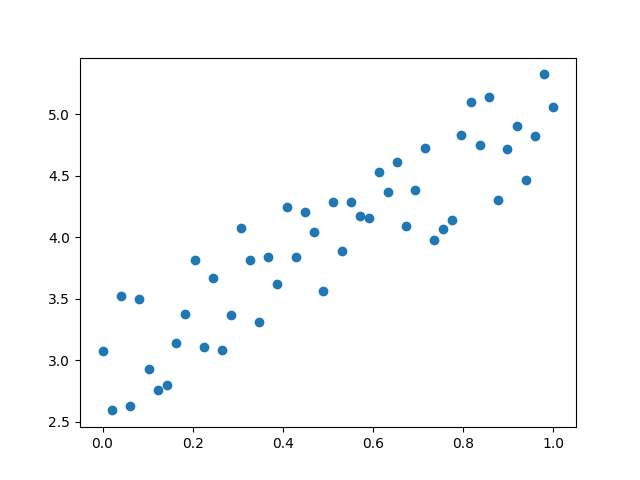
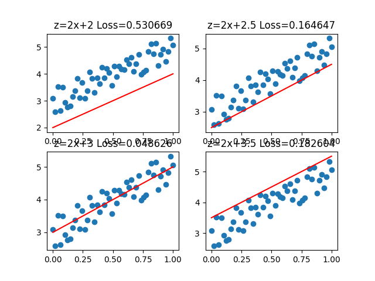
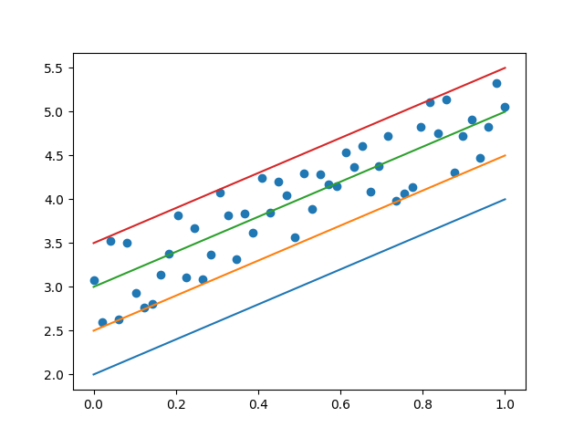
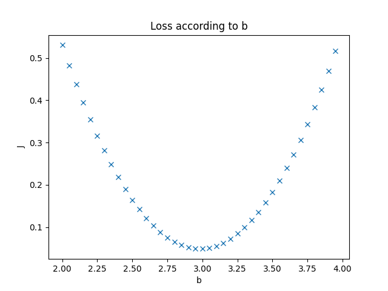
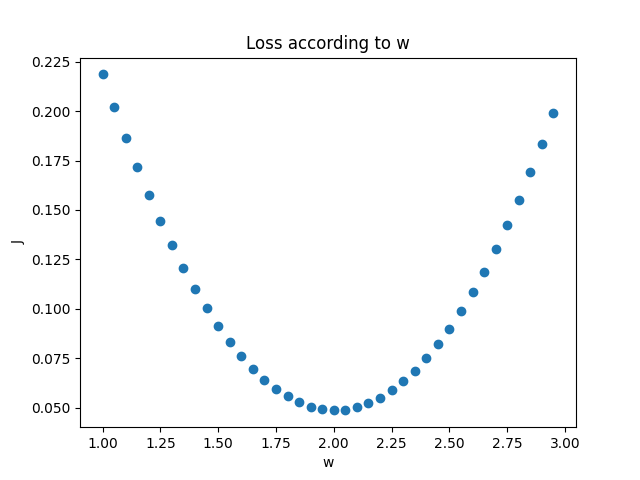
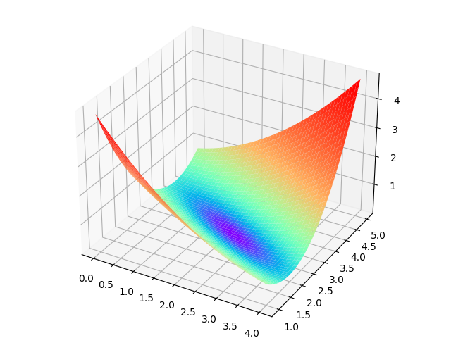
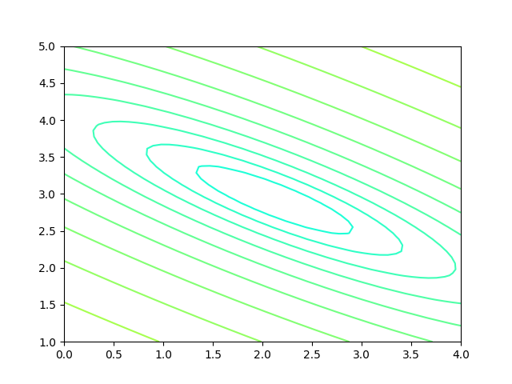
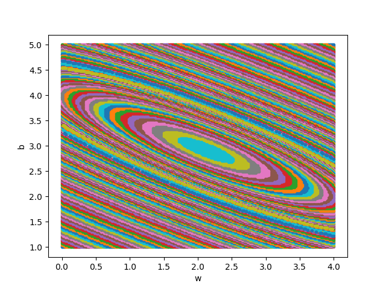
### 3.2 交叉熵损失函数 ###
交叉熵（Cross Entropy）主要用于度量两个概率分布间的差异性信息。

$$H(p,q)=\sum_i p_i \cdot \ln {1 \over q_i} = - \sum_i p_i \ln q_i $$
在神经网络中：
1. 交叉熵可作为损失函数。
2. $p$ ：真实标记的分布。
3. $q$ ：训练后的模型的预测标记分布
4. 交叉熵损失函数可以衡量 $p$ 与 $q$ 的相似性。
**交叉熵函数常用于逻辑回归(logistic regression)，也就是分类(classification)。**

#### 二分类问题交叉熵 ####
二分类对于批量样本的交叉熵计算公式为：

$$J= - \sum_{i=1}^m [y_i \ln a_i + (1-y_i) \ln (1-a_i)] $$

1. 当 $y=1$ 时，即标签值是 $1$，是个正例，加号后面的项为 $0$：

  $$loss = -\ln(a) $$

  横坐标是预测输出，纵坐标是损失函数值。
  $y=1$ 即当前样本标签值是1。当预测输出越接近1时，损失函数值越小，训练结果越准确。当预测输出越接近0时，损失函数值越大，训练结果越差。

2. 当 $y=0$ 时，即标签值是0，是个反例，加号前面的项为0：

  $$loss = -\ln (1-a) $$

  此时，损失函数值如图所示。


         图3.2.1 二分类交叉熵损失函数图

## MOOC案例：银行流失用户分析 ##
银行客户流失是指银行的客户终止在该行的所有业务，并销号。但在实际运营中，对于具体业务部门，银行客户流失可以定位为特定的业务终止行为。
客户流失的主要原因有：价格流失、产品流失、服务流失、市场流失、促销流失、技术流失、政治流失。维护客户关系的基本方法：追踪制度，产品跟进，扩大销售，维护访问，机制维护。
因此建立量化模型，合理预测客群的流失风险是很有必要的。
#### 数据读取 ####
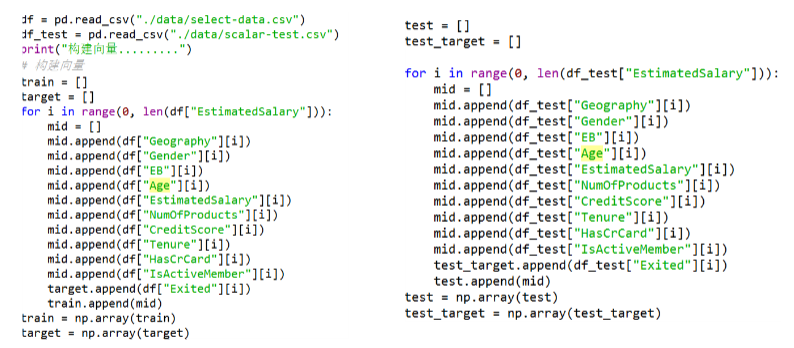
#### 数据编码 ####
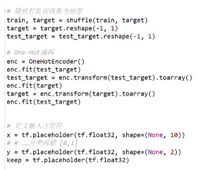
#### 网络结构设计 ####
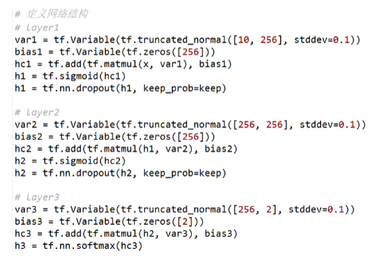

## 学习总结 ##
在这一周的学习中，我了解到了人工智能最基本的发展、定义，学习了人工智能实现所需的范式、反向传播、梯度下降、损失函数等数学知识。收获颇丰。
但在部分数学公式上的理解不慎清晰，还需要花时间继续学习！