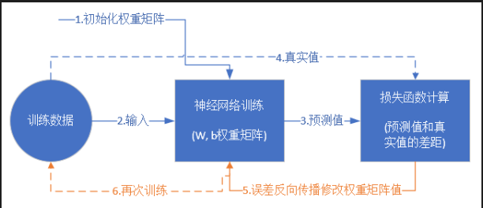
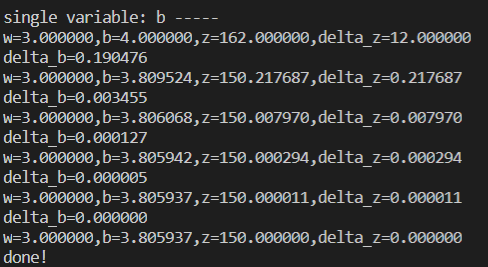
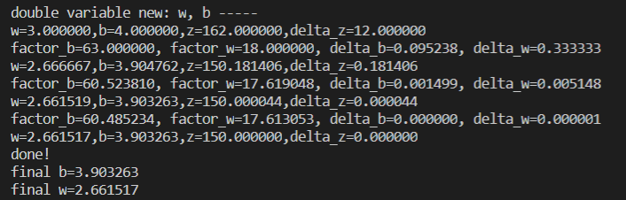

# 人工智能第一次作业
## 学号：201809035   姓名：胡厚淮
## 一、神经网络的基本工作原理
### 1、神经网络的基本结构(数学模型)
如图1

#### 1.1 输入 input 
x1、x2、x3是对应的输入(input)，它们是有不同属性的，就如一个苹果，我们用x1来记录他的重量，用x2来记录苹果的产地，用x3来记录苹果的品种。
#### 1.2 权重 weight
简单理解就是各个输入所占的比重，就如上面的例子，一个苹果最后的价格由(input)三个属性决定，但可能苹果的品种对价格的影响占到了51.1%，产地占34.9%，前面两个决定了苹果的单价最后重量就确定了苹果的价格。但权重的和并不一定为1，品种，产地，重量只是我们能想到的因素或者我们能得到的数据。
#### 1.3 偏移 bias
从生物学上解释，在脑神经细胞中，一定是输入信号的电平/电流大于某个临界值时，神经元细胞才会处于兴奋状态，这个 $b$ 实际就是那个临界值。
#### 1.4 求和计算 sum
$$Z = w1 \cdot x1 + w2 \cdot x2 + w3 \cdot x3 + b = \sum_{i=1}^m(w_i \cdot x_i) + b$$
#### 1.5 激活函数 activation
求和之后，神经细胞已经处于兴奋状态了，已经决定要向下一个神经元传递信号了，但是要传递多强烈的信号，要由激活函数来确定。
### 2、神经网络的训练过程
#### 2.1. 初始化；
对最初的数据赋值。
#### 2.2 正向计算；
通过最初数值计算计算出结果z。
#### 2.3 损失函数为我们提供了计算损失的方法；
通过正向计算结果与实际结果的差异调整损失函数
#### 2.4 梯度下降是在损失函数基础上向着损失最小的点靠近而指引了网络权重调整的方向；
#### 2.5 反向传播把损失值反向传给神经网络的每一层，让每一层都根据损失值反向调整权重；
#### 2.6梯度下降：在输入端，根据正负号和值，确定下一次的猜测值。

代码测试及分析
根据原来的设计思路，代码反复测试调节w(权重),b(偏移量)的数值(设计反向微分)，最后得出与实际值相差很少的参数(设置误差范围)。

### 3、神经网络的主要功能
#### 3.1 回归/拟合 Regression/fitting
#### 3.2 分类 Classification
### 4、反向传播与梯度下降
#### 4.1反向传播
搭建一个神经网络，给出初始权重值，我们先假设这个黑盒子的逻辑是：$z=x + x^2$；
3. 输入1，根据 $z=x + x^2$ 得到输出为2，而实际的输出值是2.21，则误差值为 $2-2.21=-0.21$，小了；
4. 调整权重值，比如 $z=1.5x+x^2$，再输入1.1，得到的输出为2.86，实际输出为2.431，则误差值为 $2.86-2.431=0.429$，大了；
5. 调整权重值，比如 $z=1.2x+x^2$，再输入1.2……
6. 调整权重值，再输入2……
7. 所有样本遍历一遍，计算平均的损失函数值；
8. 依此类推，重复3，4，5，6过程，直到损失函数值小于一个指标，比如 $0.001$，我们就可以认为网络训练完毕，黑盒子“破解”了，实际是被复制了，因为神经网络并不能得到黑盒子里的真实函数体，而只是近似模拟。

从上面的过程可以看出，如果误差值是正数，我们就把权重降低一些；如果误差值为负数，则升高权重。
这次我们要同时改变w和b，到达最终结果为z=150的目的。
已知$\Delta z=12$，我们不妨把这个误差的一半算在w账上，另外一半算在b的账上：
$$\Delta b=\frac{\Delta z / 2}{63} = \frac{12/2}{63}=0.095$$

$$\Delta w=\frac{\Delta z / 2}{18} = \frac{12/2}{18}=0.333$$

$w = w-\Delta w=3-0.333=2.667$
$b = b - \Delta b=4-0.095=3.905$
$x=2w+3b=2 \times 2.667+3 \times 3.905=17.049$
$y=2b+1=2 \times 3.905+1=8.81$
$z=x \times y=17.049 \times 8.81=150.2$

### 个人总结
神经网络是由五个部分组成的是输入，权重，偏移，求和，激活函数。
深度学习得到的模型是拟合，意味着与实际的真实模型存在一定的差异。
梯度下降是矢量，既有大小也有方向。
处理环节的数量应该适量，多或者少都会偏离实际。
python语言与一般的计算机语言不同，不以分号为语句的结束，c语言的大括号结构以:（引号）开始和空行结束。
### 心得体会
通过本星期的AI学习，我明白了BP神经网络的基本原理，我知道了反向传播和梯度下降，通过在慕课平台的学习和老师的讲解对深入学习有了更加深刻的认识，也让我知道了在人类在AI方向的学习还有很长的路要走，同样也告诉我数学是科学的根源，要提升自己的逻辑思维能力。

