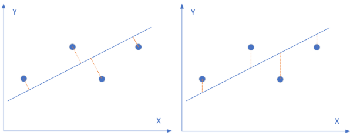
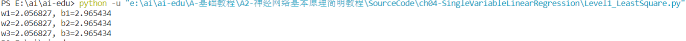
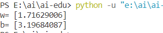
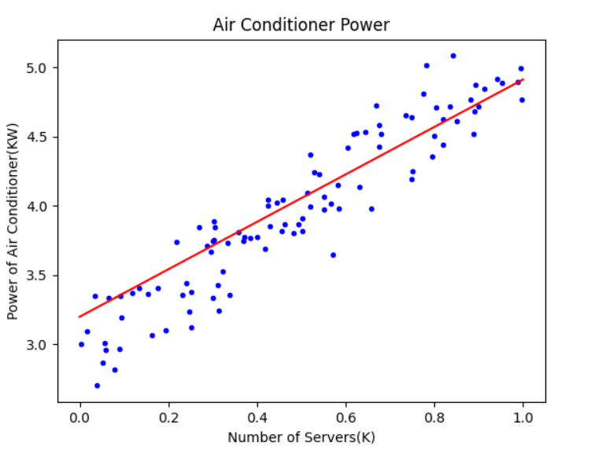

# 人工智能第二次作业
## 学号：201809035   姓名：胡厚淮
### 1、线性回归
#### 1.1 线性回归概念
线性回归是利用数理统计中回归分析，来确定两种或两种以上变量间相互依赖的定量关系的一种统计分析方法。根据确定变量关系的变量的数量可分为一元线性回归(只包括一个自变量和一个因变量)，多元线性回归(两个或两个以上的自变量，且因变量和自变量之间是线性关系)。
#### 1.2 线性回归的方法
##### 1.2.1最小二乘法
最小二乘法（又称最小平方法）是一种数学优化技术。它通过最小化误差的平方和寻找数据的最佳函数匹配。利用最小二乘法可以简便地求得未知的数据，并使得这些求得的数据与实际数据之间误差的平方和为最小。
（1）数学原理

线性回归试图学得：

$$z(x_i)=w \cdot x_i+b \tag{1}$$

使得：

$$z(x_i) \simeq y_i \tag{2}$$

其中，$x_i$是样本特征值，$y_i$是样本标签值，$z_i$是模型预测值。

如何学得w和b呢？均方差(MSE - mean squared error)是回归任务中常用的手段：
$$
J = \sum_{i=1}^m(z(x_i)-y_i)^2 = \sum_{i=1}^m(y_i-wx_i-b)^2 \tag{3}
$$

$J$称为损失函数。实际上就是试图找到一条直线，使所有样本到直线上的残差的平方和最小：

关键代码如下
- 计算w值
  
```Python
def method1(X,Y,m):
    x_mean = X.mean()
    p = sum(Y*(X-x_mean))
    q = sum(X*X) - sum(X)*sum(X)/m
    w = p/q
    return w

def method2(X,Y,m):
    x_mean = X.mean()
    y_mean = Y.mean()
    p = sum(X*(Y-y_mean))
    q = sum(X*X) - x_mean*sum(X)
    w = p/q
    return w

def method3(X,Y,m):
    p = m*sum(X*Y) - sum(X)*sum(Y)
    q = m*sum(X*X) - sum(X)*sum(X)
    w = p/q
    return w
```
- 计算b值

```Python
def calculate_b_1(X,Y,w,m):
    b = sum(Y-w*X)/m
    return b
def calculate_b_2(X,Y,w):
    b = Y.mean() - w * X.mean()
    return b
```

##### 1.2.2梯度下降法
数学原理
预设线性函数如下：
$$z_i = x_i \cdot w + b \tag{1}$$
均方误差：

$$loss_i(w,b) = \frac{1}{2} (z_i-y_i)^2 \tag{2}$$


与最小二乘法比较可以看到，梯度下降法和最小二乘法的模型及损失函数是相同的，都是一个线性模型加均方差损失函数，模型用于拟合，损失函数用于评估效果。

区别在于，最小二乘法从损失函数求导，直接求得数学解析解，而梯度下降以及后面的神经网络，都是利用导数传递误差，再通过迭代方式一步一步（用近似解）逼近真实解。
代码实现如下

```Python
if __name__ == '__main__':

    reader = SimpleDataReader()
    reader.ReadData()
    X,Y = reader.GetWholeTrainSamples()

    eta = 0.1
    w, b = 0.0, 0.0
    for i in range(reader.num_train):
        # get x and y value for one sample
        xi = X[i]
        yi = Y[i]
        # 公式1
        zi = xi * w + b
        # 公式3
        dz = zi - yi
        # 公式4
        dw = dz * xi
        # 公式5
        db = dz
        # update w,b
        w = w - eta * dw
        b = b - eta * db

    print("w=", w)    
    print("b=", b)
```
从代码的内容上不难看出梯度下降的实现是通过数学推导的公式实现的。
运行结果如下


##### 神经网络法
计算方法

 输入层

此神经元在输入层只接受一个输入特征，经过参数 $w,b$ 的计算后，直接输出结果。这样一个简单的“网络”，只能解决简单的一元线性回归问题，而且由于是线性的，我们不需要定义激活函数，这就大大简化了程序，而且便于大家循序渐进地理解各种知识点。

严格来说输入层在神经网络中并不能称为一个层。

 权重 $w,b$

因为是一元线性问题，所以 $w,b$ 都是标量。

 输出层

输出层 $1$ 个神经元，线性预测公式是：

$$z_i = x_i \cdot w + b$$

$z$ 是模型的预测输出，$y$ 是实际的样本标签值，下标 $i$ 为样本。

 损失函数

因为是线性回归问题，所以损失函数使用均方差函数。

$$loss(w,b) = \frac{1}{2} (z_i-y_i)^2$$

 4.3.2 反向传播

由于我们使用了和上一节中的梯度下降法同样的数学原理，所以反向传播的算法也是一样的，细节请查看4.2.2。

 计算 $w$ 的梯度

$$
{\partial{loss} \over \partial{w}} = \frac{\partial{loss}}{\partial{z_i}}\frac{\partial{z_i}}{\partial{w}}=(z_i-y_i)x_i
$$

 计算 $b$ 的梯度

$$
\frac{\partial{loss}}{\partial{b}} = \frac{\partial{loss}}{\partial{z_i}}\frac{\partial{z_i}}{\partial{b}}=z_i-y_i
$$

为了简化问题，在本小节中，反向传播使用单样本方式，在下一小节中，我们将介绍多样本方式。

 4.3.3 代码实现

其实神经网络法和梯度下降法在本质上是一样的，只不过神经网络法使用一个崭新的编程模型，即以神经元为中心的代码结构设计，这样便于以后的功能扩充

代码实现
定义类

```Python
class NeuralNet(object):
    def __init__(self, eta):
        self.eta = eta
        self.w = 0
        self.b = 0
```
前向计算

```Python
    def __forward(self, x):
        z = x * self.w + self.b
        return z
```
反向传播

下面的代码是通过梯度下降法中的公式推导而得的，也设计成私有方法：

```Python
    def __backward(self, x,y,z):
        dz = z - y
        db = dz
        dw = x * dz
        return dw, db
```
梯度更新

```Python
    def __update(self, dw, db):
        self.w = self.w - self.eta * dw
        self.b = self.b - self.eta * db
```
数据训练
```Python
    def train(self, dataReader):
        for i in range(dataReader.num_train):
            # get x and y value for one sample
            x,y = dataReader.GetSingleTrainSample(i)
            # get z from x,y
            z = self.__forward(x)
            # calculate gradient of w and b
            dw, db = self.__backward(x, y, z)
            # update w,b
            self.__update(dw, db)
        # end for
```
推理预测

```Python
    def inference(self, x):
        return self.__forward(x)
```
主程序

```Python
if __name__ == '__main__':
    # read data
    sdr = SimpleDataReader()
    sdr.ReadData()
    # create net
    eta = 0.1
    net = NeuralNet(eta)
    net.train(sdr)
    # result
    print("w=%f,b=%f" %(net.w, net.b))
    # predication
    result = net.inference(0.346)
    print("result=", result)
    ShowResult(net, sdr)
```
运行结果如下


代码实现过程
在[0,1]取等间距的十个值xi，和与之对应的yi为基础拟合出一条直线。
#### 学习小结
本次学习主要学习了回归分析的前三种方法，通过学习单变量线性回归的问题，我又了解到了几种将要研究问题转换为线性回归问题的方：① 最小二乘法② 梯度下降法③ 简单的神经网络法。
#### 个人体会
本次课程内容在一遍遍的提醒我要复习数学了。原来科学到最后真的全是数学。
