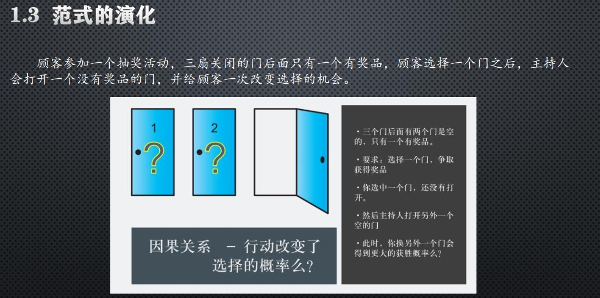
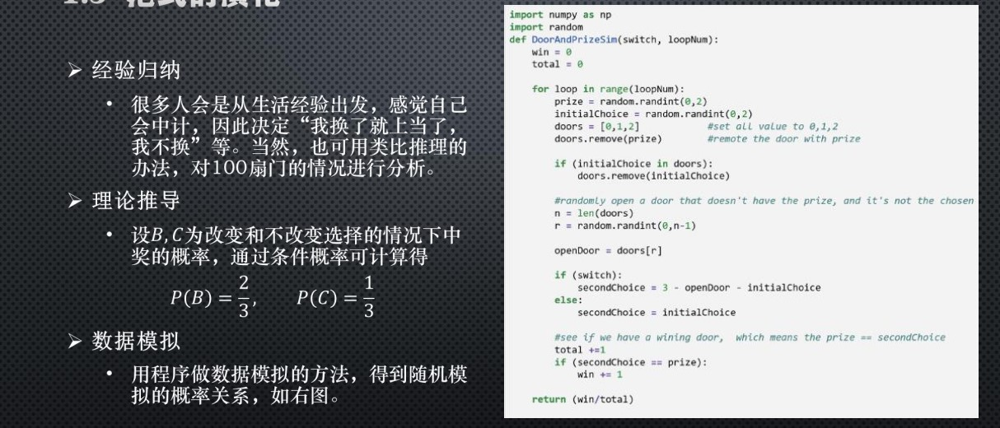

# 神经网络基本原理简明教程

## 软件以及环境的准备

git安装官网 https://git-scm.com/
**介绍**: Git 是一个开源的分布式版本控制系统，用于敏捷高效地处理任何或小或大的项目。

github账号创建以及熟悉其基本操作
网址： https://github.com/
**介绍**：代码托管平台，除了 Git 代码仓库托管及基本的 Web 管理界面以外，还提供了订阅、讨论组、文本渲染、在线文件编辑器、协作图谱（报表）、代码片段分享（Gist）等功能。

vscode下载安装
https://code.visualstudio.com/
**介绍**：跨平台源代码编辑器
针对需要，去下载相应的插件

python下载安装
本人下载的为3.7版本，因为由于新版本可能出现一定安装以及配环境的问题，网上对于往前一点的版本安装以及配环境有较大的参考价值。
下载官网：https://www.python.org/
在此附上csdn上一名用户的详细教程，让配环境变得简单，适合本门课程的实验环境，有较大的参考价值
https://www.cnblogs.com/xiaojwang/p/11331202.html

## 人工智能浅入（了解即可）

### 人工智能发展史

1950年，英国科学家艾伦图灵发表了论文讨论创造出具有真正智能的机器的可能性，并提出了著名的图灵测试。
从1956年的达特茅斯会议开始， 人工智能作为一个专门的研究领域出现， 经历了超过半个世
纪的起伏， 终于在2007年前后， 迎来了又一次大发展。

### 人工智能的定义

第一个层面， 人们对人工智能的期待可以分为：
智能地把某件特定的事情做好，在某个领域增强人类的智慧，这种方式又叫智能增强。例如搜索引擎、自动翻译、智能助手等，帮助人类完成某种特定任务。这也叫“弱人工智能”或“狭义人工智能” 。
像人类一样能认知、思考与判断，却模拟人类的智能， 这是人工智能学科一开始就希望达到的目标。这样的智能也叫“通用人工智能” 或“强人工智能” 。
第二个层面，从技术的特点来看：
如果能让运行程序的计算机来学习并自动掌握某些规律，某种程度上可以谈是实现了狭义的人工智能，这种方法即机器学习。

第三个层面，从应用的角度来看，狭义人工智能在各个领域都取得了很大的成果：一种是标杆式的任务。2015年，AI取得了超过人类的成果。在翻译领域（微软的中英翻译）、阅读理解（SQUAD 比赛）、下围棋（2016）、德州扑克（2019）和麻将
（2019）领域中，我们也看到了AI取得了达到或超过人类最高水平的成绩。
另一种，是AI技术和各种其他技术结合，解决政府，企业，个人用户的需求。 在政府方面，把所有计算，数据，云端和物联网终端的设备联系起来， 搭建一个能支持智能决定的系统，现代社会的城市管理，金融，医疗，物流和交通管理等等都运行在这样的系统上。

神经网络模型是一个重要的方法，它的原型在1943年就出现了，在生物神经网络中，每个神经元与其他神经元相连，当它兴奋时，就会像相邻的神经元发送化学物质，从而改变这些神经元内的电位； 如果某神经元的电位超过了一个阈值，那么它就会被激活（兴奋），向其他神经元发送化学物质。把许多这样的神经元按照一定的层次结构连接起来，我们就构建了一个神经网络。

### 范式的演化

#### 解释

**Question**：什么是范式的演化？
**Answer**: 从古至今，人类一直在试图了解客观规律，找到事物变化的相互关系。了解客观规律需要方法论，探索世界、寻找规律的方法论在历史上也发生了几次革命性的改变。

#### 阶段

第一阶段： 经验
第二阶段： 理论
第三阶段： 计算仿真
第四阶段： 数据探索

#### 例子


阶段模拟


## 神经网络的三个基本概念

神经网络中的三大概念是：反向传播、梯度下降、损失函数

解释
初始化。
正向计算。
损失函数：为我们提供了计算损失的方法。
梯度下降：在损失函数基础上向着损失最小的点靠近，从而指引了网络权重调整的方向。
反向传播：把损失值反向传给神经网络的各层，让各层都可以根据损失值反向调整权重。
重复正向计算过程， 直到精度满足要求（比如损失函数值小于 0.001）。

### 线性反向传播 （重点理解）

学习这个课题我们可以用例子中去理解它

#### 数学的方式理解


假设有一个函数：

$$z = x \cdot y \tag{1}$$

其中:

$$x = 2w + 3b \tag{2}$$

$$y = 2b + 1 \tag{3}$$

注意这里 $x,y,z$ 不是变量，只是中间计算结果；$w,b$ 才是变量。因为在后面要学习的神经网络中，要最终求解的目标是 $w$ 和 $b$ 的值
**正向计算**
当 $w = 3, b = 4$ 时
最终的 $z$ 值，受到了前面很多因素的影响：变量 $w$，变量 $b$，计算式 $x$，计算式 $y$。

### 2.1.2 反向传播求解 $w$

**求 $w$ 的偏导**

目前 $z=162$，如果想让 $z$ 变小一些，比如目标是 $z=150$，$w$ 应该如何变化呢？为了简化问题，先只考虑改变 $w$ 的值，而令 $b$ 值固定为 $4$。

如果想解决这个问题，最笨的办法是可以在输入端一点一点的试，把 $w$ 变成 $3.5$ 试试，再变成 $3$ 试试......直到满意为止。现在我们将要学习一个更好的解决办法：反向传播。

从 $z$ 开始一层一层向回看，图中各节点关于变量 $w$ 的偏导计算结果如下：

因为 $$z = x \cdot y$$，其中 $$x = 2w + 3b, y = 2b + 1$$

所以：

$$\frac{\partial{z}}{\partial{w}}=\frac{\partial{z}}{\partial{x}} \cdot \frac{\partial{x}}{\partial{w}}=y \cdot 2=18 \tag{4}$$

其中：

$$\frac{\partial{z}}{\partial{x}}=\frac{\partial{}}{\partial{x}}(x \cdot y)=y=9$$

$$\frac{\partial{x}}{\partial{w}}=\frac{\partial{}}{\partial{w}}(2w+3b)=2$$

对 $w$ 的偏导求解过程

$z$ 的误差通过中间的 $x$ 传递到 $w$。如果不是用链式法则，而是直接用 $z$ 的表达式计算对 $w$ 的偏导数，会怎么样呢？我们来试验一下。

根据公式1、2、3，我们有：

$$z=x \cdot y=(2w+3b)(2b+1)=4wb+2w+6b^2+3b \tag{5}$$

对上式求 $w$ 的偏导：

$$
\frac{\partial z}{\partial w}=4b+2=4 \cdot 4 + 2=18 \tag{6}
$$

公式4和公式6的结果完全一致！所以，请大家相信链式法则的科学性。

**求 $w$ 的具体变化值**

公式4和公式6的含义是：当 $w$ 变化一点点时，$z$ 会产生 $w$ 的变化值18倍的变化。记住我们的目标是让 $z=150$，目前在初始状态时是 $z=162$，所以，问题转化为：当需要 $z$ 从 $162$ 变到 $150$ 时，$w$ 需要变化多少？

既然：

$$
\Delta z = 18 \cdot \Delta w
$$

则：

$$
\Delta w = {\Delta z \over 18}=\frac{162-150}{18}= 0.6667
$$

所以：

$$w = w - 0.6667=2.3333$$
$$x=2w+3b=16.6667$$
$$z=x \cdot y=16.6667 \times 9=150.0003$$

我们一下子就成功地让 $z$ 值变成了 $150.0003$，与 $150$ 的目标非常地接近，这就是偏导数的威力所在。

**同时求解 $w$ 和 $b$ 的变化值**

这次我们要同时改变 $w$ 和 $b$，到达最终结果为 $z=150$ 的目的。

已知 $\Delta z=12$，我们不妨把这个误差的一半算在 $w$ 的账上，另外一半算在 $b$ 的账上：

$$\Delta b=\frac{\Delta z / 2}{63} = \frac{12/2}{63}=0.095$$

$$\Delta w=\frac{\Delta z / 2}{18} = \frac{12/2}{18}=0.333$$

$w = w-\Delta w=3-0.333=2.667$
$b = b - \Delta b=4-0.095=3.905$
$x=2w+3b=2 \times 2.667+3 \times 3.905=17.049$
$y=2b+1=2 \times 3.905+1=8.81$
$z=x \times y=17.049 \times 8.81=150.2$

没有在迭代中更新 $\Delta b$ 的贡献值：（由于同时改变同理，这里只介绍这种方式）
**用代码去实现**

```python
import numpy as np
import matplotlib.pyplot as plt

def target_function(w,b):
    x = 2*w+3*b
    y=2*b+1
    z=x*y
    return x,y,z

def single_variable(w,b,t):
    print("\nsingle variable: b ----- ")
    error = 1e-5
    while(True):
        x,y,z = target_function(w,b)
        delta_z = z - t
        print("w=%f,b=%f,z=%f,delta_z=%f"%(w,b,z,delta_z))
        if abs(delta_z) < error:
            break
        delta_b = delta_z /63
        print("delta_b=%f"%delta_b)
        b = b - delta_b

    print("done!")
    print("final b=%f"%b)

def single_variable_new(w,b,t):
    print("\nsingle variable new: b ----- ")
    error = 1e-5
    while(True):
        x,y,z = target_function(w,b)
        delta_z = z - t
        print("w=%f,b=%f,z=%f,delta_z=%f"%(w,b,z,delta_z))
        if abs(delta_z) < error:
            break
        factor_b = 2*x+3*y
        delta_b = delta_z/factor_b
        print("factor_b=%f, delta_b=%f"%(factor_b, delta_b))
        b = b - delta_b

    print("done!")
    print("final b=%f"%b)


// this version has a bug
def double_variable(w,b,t):
    print("\ndouble variable: w, b -----")
    error = 1e-5
    while(True):
        x,y,z = target_function(w,b)
        delta_z = z - t
        print("w=%f,b=%f,z=%f,delta_z=%f"%(w,b,z,delta_z))
        if abs(delta_z) < error:
            break
        delta_b = delta_z/63/2
        delta_w = delta_z/18/2
        print("delta_b=%f, delta_w=%f"%(delta_b,delta_w))
        b = b - delta_b
        w = w - delta_w
    print("done!")
    print("final b=%f"%b)
    print("final w=%f"%w)

// this is correct version
def double_variable_new(w,b,t):
    print("\ndouble variable new: w, b -----")
    error = 1e-5
    while(True):
        x,y,z = target_function(w,b)
        delta_z = z - t
        print("w=%f,b=%f,z=%f,delta_z=%f"%(w,b,z,delta_z))
        if abs(delta_z) < error:
            break

        factor_b, factor_w = calculate_wb_factor(x,y)
        delta_b = delta_z/factor_b/2
        delta_w = delta_z/factor_w/2
        print("factor_b=%f, factor_w=%f, delta_b=%f, delta_w=%f"%(factor_b, factor_w, delta_b,delta_w))
        b = b - delta_b
        w = w - delta_w
    print("done!")
    print("final b=%f"%b)
    print("final w=%f"%w)

def calculate_wb_factor(x,y):
    factor_b = 2*x+3*y
    factor_w = 2*y
    return factor_b, factor_w

if __name__ == '__main__':
    w = 3
    b = 4
    t = 150
    single_variable(w,b,t)
    single_variable_new(w,b,t)
    double_variable(w,b,t)
    double_variable_new(w,b,t)

```

### 梯度下降

#### 公式理解
梯度下降的数学公式：

$$\theta_{n+1} = \theta_{n} - \eta \cdot \nabla J(\theta) \tag{1}$$


其中：

 $\theta_{n+1}$：下一个值；
 $\theta_n$：当前值；
  $-$：减号，梯度的反向；
  $\eta$：学习率或步长，控制每一步走的距离，不要太快以免错过了最佳景点，不要太慢以免时间太长；
  $\nabla$：梯度，函数当前位置的最快上升点；
  $J(\theta)$：函数。
  
#### 定义理解
所谓梯度下降
1. **梯度**：函数当前位置的最快上升点；
2. **下降**：与导数相反的方向，用数学语言描述就是那个减号。

需要注意的
1. **当前点**；
2. **方向**；
3. **步长**。

**目的**
梯度下降的目的就是使得x值向极值点逼近。

### 试例

假设一个单变量函数：

$$J(x) = x ^2$$

我们的目的是找到该函数的最小值，于是计算其微分：

$$J'(x) = 2x ---梯度$$

假设初始位置为：

$$x_0=1.2$$

假设学习率：

$$\eta = 0.3$$

根据公式(1)，迭代公式：

$$x_{n+1} = x_{n} - \eta \cdot \nabla J(x)= x_{n} - \eta \cdot 2x$$

假设终止条件为 $J(x)<0.01$，迭代过程是：

```
x=0.480000, y=0.230400
x=0.192000, y=0.036864
x=0.076800, y=0.005898
x=0.030720, y=0.000944
```

**慢慢接近目标极值**

### 双变量的梯度下降

假设一个双变量函数：

$$J(x,y) = x^2 + \sin^2(y)$$

**由于涉及两个变量我们可以对每一个变量去分析，单独对每一个变量求偏导**

我们的目的是找到该函数的最小值，于是计算其微分：

$${\partial{J(x,y)} \over \partial{x}} = 2x$$
$${\partial{J(x,y)} \over \partial{y}} = 2 \sin y \cos y$$

假设初始位置为：**和之前一样假设初始位置《猜》**

$$(x_0,y_0)=(3,1)$$

假设学习率：

$$\eta = 0.1$$

根据公式(1)，迭代过程是的计算公式：
$$(x_{n+1},y_{n+1}) = (x_n,y_n) - \eta \cdot \nabla J(x,y)$$
$$ = (x_n,y_n) - \eta \cdot (2x,2 \cdot \sin y \cdot \cos y) \tag{1}$$

根据公式(1)，假设终止条件为 $J(x,y)<0.01$，迭代过程如表2-3所示。

表2-3 双变量梯度下降的迭代过程

|迭代次数|x|y|J(x,y)|
|---|---|---|---|
|1|3|1|9.708073|
|2|2.4|0.909070|6.382415|
|...|...|...|...|
|15|0.105553|0.063481|0.015166|
|16|0.084442|0.050819|0.009711|

迭代16次后，$J(x,y)$ 的值为 $0.009711$，满足小于 $0.01$ 的条件，停止迭代。

### 学习率η的分析与选择

|学习率|迭代路线图|说明|
|---|---|---|
|1.0||学习率太大，迭代的情况很糟糕，在一条水平线上跳来跳去，永远也不能下降。|
|0.8||学习率大，会有这种左右跳跃的情况发生，这不利于神经网络的训练。|
|0.4||学习率合适，损失值会从单侧下降，4步以后基本接近了理想值。|
|0.1||学习率较小，损失值会从单侧下降，但下降速度非常慢，10步了还没有到达理想状态。|

学习率并不是越大越好，也不是越小越好

**对梯度下降公式应用代码，对单个变量**
```python
import numpy as np
import matplotlib.pyplot as plt

def target_function(x):
    y = x*x
    return y

def derivative_function(x):
    return 2*x

def draw_function():
    x = np.linspace(-1.2,1.2)
    y = target_function(x)
    plt.plot(x,y)

def draw_gd(X):
    Y = []
    for i in range(len(X)):
        Y.append(target_function(X[i]))

    plt.plot(X,Y)

if __name__ == '__main__':
    x = 1.2
    eta = 0.3
    error = 1e-3
    X = []
    X.append(x)
    y = target_function(x)
    while y > error:
        x = x - eta * derivative_function(x)
        X.append(x)
        y = target_function(x)
        print("x=%f, y=%f" %(x,y))


    draw_function()
    draw_gd(X)
    plt.show()
```

### 损失函数

#### 定义

“损失”就是所有样本的“误差”的总和，亦即（$m$ 为样本数）：

$$损失 = \sum^m_{i=1}误差_i$$

$$J = \sum_{i=1}^m loss_i$$

#### 意义

计算神经网络每次迭代的前向计算结果与真实值的差距，从而指导下一步的训练向正确的方向进行。

#### 使用

1. 用随机值初始化前向计算公式的参数；
2. 代入样本，计算输出的预测值；
3. 用损失函数计算预测值和标签值（真实值）的误差；
4. 根据损失函数的导数，沿梯度最小方向将误差回传，修正前向计算公式中的各个权重值；
5. 进入第2步重复, 直到损失函数值达到一个满意的值就停止迭代。


#### 公式
符号规则：$a$ 是预测值，$y$ 是样本标签值，$loss$ 是损失函数值。

- Gold Standard Loss，又称0-1误差
$$
loss=\begin{cases}
0 & a=y \\\\
1 & a \ne y 
\end{cases}
$$

- 绝对值损失函数

$$
loss = |y-a|
$$

- Hinge Loss，铰链/折页损失函数或最大边界损失函数，主要用于SVM（支持向量机）中

$$
loss=\max(0,1-y \cdot a) \qquad y=\pm 1
$$

- Log Loss，对数损失函数，又叫交叉熵损失函数(cross entropy error)

$$
loss = -[y \cdot \ln (a) + (1-y) \cdot \ln (1-a)]  \qquad y \in \\{ 0,1 \\} 
$$

- Squared Loss，均方差损失函数
$$
loss=(a-y)^2
$$

- Exponential Loss，指数损失函数
$$
loss = e^{-(y \cdot a)}
$$

#### 图像理解
单变量对损失函数的影响


图3-1 单变量的损失函数图

图3-1中，纵坐标是损失函数值，横坐标是变量。不断地改变变量的值，会造成损失函数值的上升或下降。而梯度下降算法会让我们沿着损失函数值下降的方向前进。

1. 假设我们的初始位置在 $A$ 点，$x=x_0$，损失函数值（纵坐标）较大，回传给网络做训练；
2. 经过一次迭代后，我们移动到了 $B$ 点，$x=x_1$，损失函数值也相应减小，再次回传重新训练；
3. 以此节奏不断向损失函数的最低点靠近，经历了 $x_2,x_3,x_4,x_5$；
4. 直到损失值达到可接受的程度，比如 $x_5$ 的位置，就停止训练。

#### 用等高线图理解双变量对损失函数影响


图3-2 双变量的损失函数图

图3-2中，横坐标是一个变量 $w$，纵坐标是另一个变量 $b$。两个变量的组合形成的损失函数值，在图中对应处于等高线上的唯一的一个坐标点。$w,b$ 所有不同值的组合会形成一个损失函数值的矩阵，我们把矩阵中具有相同（相近）损失函数值的点连接起来，可以形成一个不规则椭圆，其圆心位置，是损失值为 $0$ 的位置，也是我们要逼近的目标。

这个椭圆如同平面地图的等高线，来表示的一个洼地，中心位置比边缘位置要低，通过对损失函数值的计算，对损失函数的求导，会带领我们沿着等高线形成的梯子一步步下降，无限逼近中心点。

#### 均方差函数

预测值和真实值越接近，两者的均方差就越小。
均方差函数常用于线性回归(linear regression)，即函数拟合(function fitting)。
$$
loss = {1 \over 2}(z-y)^2 \tag{单样本}
$$

$$
J=\frac{1}{2m} \sum_{i=1}^m (z_i-y_i)^2 \tag{多样本}
$$

对于单个样本来说 $Error=a_i-y_i$。
多个样本累计时，$a_i-y_i$ 可能有正有负，误差求和时就会导致相互抵消，从而失去价值。所以有了绝对值差的想法，即 $Error=|a_i-y_i|$ 。这看上去很简单，并且也很理想，那为什么还要引入均方差损失函数呢？两种损失函数的比较如表3-1所示。

表3-1 绝对值损失函数与均方差损失函数的比较

|样本标签值|样本预测值|绝对值损失函数|均方差损失函数|
|------|------|------|------|
|$[1,1,1]$|$[1,2,3]$|$(1-1)+(2-1)+(3-1)=3$|$(1-1)^2+(2-1)^2+(3-1)^2=5$|
|$[1,1,1]$|$[1,3,3]$|$(1-1)+(3-1)+(3-1)=4$|$(1-1)^2+(3-1)^2+(3-1)^2=8$|
|||$4/3=1.33$|$8/5=1.6$|

可以看到5比3已经大了很多，8比4大了一倍，而8比5也放大了某个样本的局部损失对全局带来的影响，用术语说，就是“对某些偏离大的样本比较敏感”，从而引起监督训练过程的足够重视，以便回传误差。

#### 交叉熵损失函数

在信息论中，交叉熵是表示两个概率分布 $p,q$ 的差异，其中 $p$ 表示真实分布，$q$ 表示预测分布，那么 $H(p,q)$ 就称为交叉熵：

$$H(p,q)=\sum_i p_i \cdot \ln {1 \over q_i} = - \sum_i p_i \ln q_i \tag{1}$$

交叉熵可在神经网络中作为损失函数，$p$ 表示真实标记的分布，$q$ 则为训练后的模型的预测标记分布，交叉熵损失函数可以衡量 $p$ 与 $q$ 的相似性。

相对熵又称KL散度，如果我们对于同一个随机变量 $x$ 有两个单独的概率分布 $P(x)$ 和 $Q(x)$，我们可以使用 KL 散度（Kullback-Leibler (KL) divergence）来衡量这两个分布的差异，这个相当于信息论范畴的均方差。

KL散度的计算公式：

$$D_{KL}(p||q)=\sum_{j=1}^n p(x_j) \ln{p(x_j) \over q(x_j)} \tag{4}$$

$n$ 为事件的所有可能性。$D$ 的值越小，表示 $q$ 分布和 $p$ 分布越接近。


## 学习心得与收获

1、学习了python的基本语法
2、markdown学会了美观地书写数学公式以及表格的编写
3、学习了git基本操作方式目前只会clone github中的代码以及一些基本方式，对github的适用有了一定的了解
4、学习了神经网络的三个基本概念，以及三者关系
5、学习了线性反向传播的数学计算形式，以及用代码的表示形式，数学计算形式比较容易理解，代码方法虽然相同但是代码将计算式的偏导转化为迭代，理解还是比较困难的
6、梯度下降对比线性反向传播更加直接，直接套公式，其也分为数学计算式形式与代码形式，但是区别不大。
7、对学习率的选择进行了相关的研究
8、学习了损失函数的概念、公式及其类别，包括哪种情况的适用。