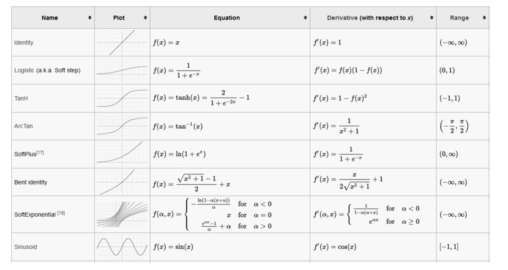
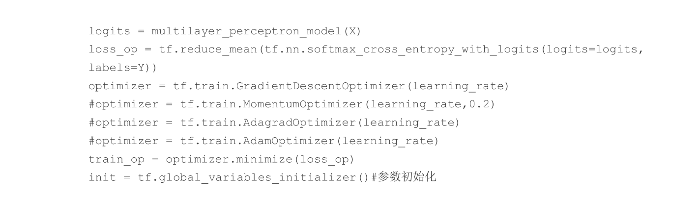
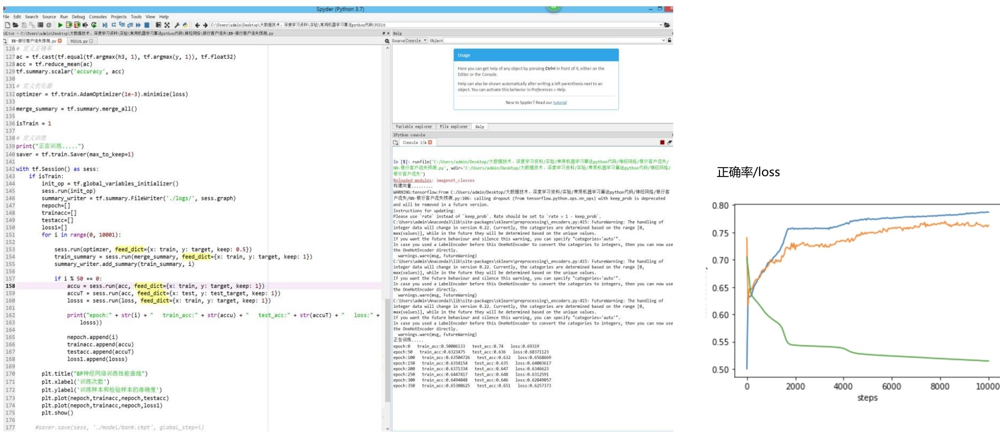

# 【商务数据分析】

>>>># U1.神经网络基础

>>### 1.1神经网络简介

1.神经网络介绍
+ 神经网络是一种运算模型，由大量的节点（或称神经元）之间相互联接构成。每个节点代表一种特定的输出函数，称为激励函数。每两个节点间的连接都代表一个对于通过该连接信号的加权值，称为权重，这相当于人工神经网络的记忆。

2.前馈神经网络
+ 是一种单向多层的网络结构，即信息是从输入层开始，逐层向一个方向传递，一直到输出层结束。
  

3.感知器
+ 是一种结构最简单的前馈神经网络，也称为感知机
  
4.BP(Back Propagation)
+ BP也是前馈神经网络，只是它的参数权重值是由反向传播学习算法进行调整的
  
5.训练方法神经网络
+ 批量梯度下降法
+ 随机梯度下降法
+ Mini-batch梯度下降法

>### 神经网络相关概念
  #### 激活函数
  1.性质
  + 非线性
  + 可微性
  + 单调性
  + f(x)≈x
  + 输出值范围
  + 计算简单
  + 归一化
2.激活函数经常使用的函数
+ Sigmoid函数
+ tanh函数
+ ReLu函数
3.常见的激活函数

>>### 1.2/1.3 BP神经网络
+ 人工神经网络（Artificial Neural Netork，ANN）：由简单神经元经过相互连接形成网状结构，通过调节各连接的权重值改变连接的强度，进而实现感知判断。
+ 反向传播（Back Propagation，BP）算法：进一步推动了神经网络的发展。
  
##### 所以我们这次写的是反向传播神经网络的应用：
1. BP神经网络：按照误差逆向传播算法训练的多层前馈神经网络。
2. 基本原理：
    + 工神经网络无需事先确定输入输出之间映射关系的数学方程，仅通过自身的训练，学习某种规则，在给定输入值时得到最接近期望输出值的结果。作为一种智能信息处理系统，人工神经网络实现其功能的核心是算法。
    + BP算法：一种按误差反向传播(简称误差反传)训练的多层前馈网络。基本思想是梯度下降法，利用梯度搜索技术，以期使网络的实际输出值和期望输出值的误差均方差为最小。
    + 基本BP算法包括信号的前向传播和误差的反向传播两个过程。即计算误差输出时按从输入到输出的方向进行，而调整权值和阈值则从输出到输入的方向进行。
3. 结构：BP网络是在输入层与输出层之间增加若干层(一层或多层)神经元，这些神经元称为隐单元，它们与外界没有直接的联系，但其状态的改变，则能影响输入与输出之间的关系，每一层可以有若干个节点。
4. 应用：
   + 基于神经网络（多层感知器）识别手写数字
    - 数据集为经典的MNIST。
    - 输入加载数据的代码 
   
    - 输入定义学习率、迭代次数、批大小、批数量（总样本数除以批大小）等参数，设置输入层大小为784，即将28*28的像素展开为一维行向量（一个输入图片784个值）。第一层和第二层神经元数量均为256，输出层的分类类别为0~9的数字，即10个类别的代码 
    
    - 使用tf.random_normal()生成模型权重值参数矩阵和偏置值参数，并将其分别存储于weights和biases变量中，并定义多层感知机的神经网络模型。
  
    - 使用输入变量X初始化模型，定义损失函数为交叉熵，采用梯度下降法作为优化器（除此之外还可选MomentumOptimizer、AdagradOptimizer、AdamOptimizer）,并对模型中tf.placeholder定义的各种参数初始化。
    

    - 将训练寄样本输入模型进行训练，并计算每个批次的平均损失，在每次迭代时输出模型的平均损失。
    
    - 模型训练完成，使用测试集样本对其评估，并计算其精确率。
    
    - 模型的Accuracy结果为87.8%。 
   +  基于Elman神经网络的能源消耗预测  
    - 预测实验结果图 
    - 100天预测结果走势比对图 
  
  >>### 1.4-1.8 银行客户流失预测

  + owNumber 行号
  + CustomerID 用户编号
  + Surname 用户姓名
  + CreditScore 信用分数
  + Geography 用户所在国家/地区
  + Gender 用户性别
  + Age 年龄
  + Tenure 当了本银行多少用户
  + Balance 存贷款情况
  + NumOfProducts 使用产品数量
  + HasCrCard 是否有本行信用卡

  

  

    