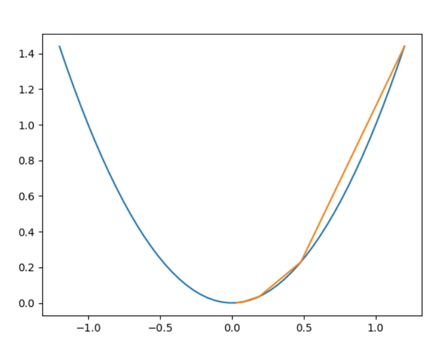
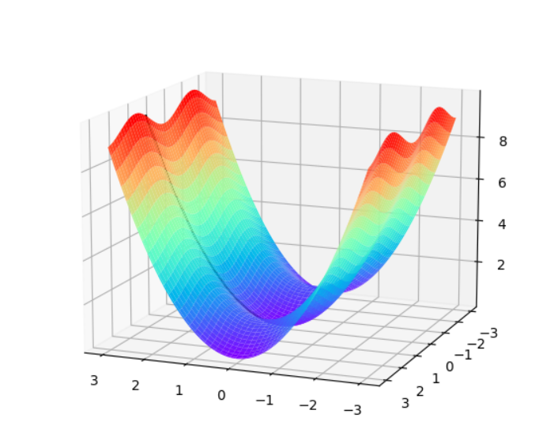
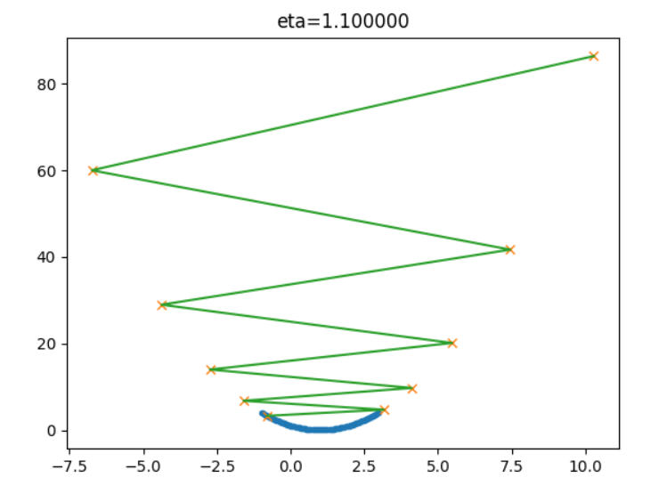
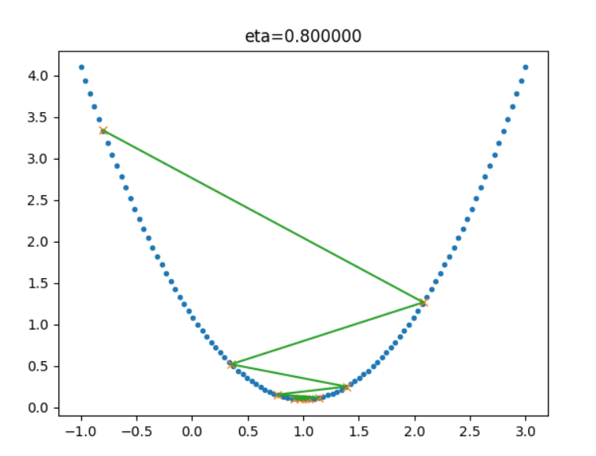
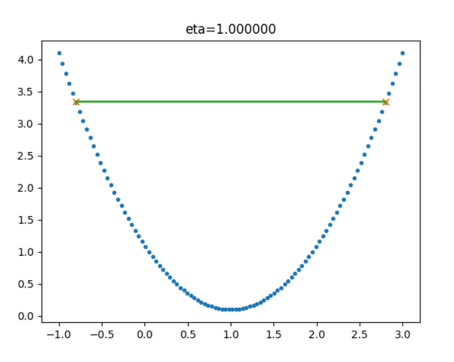
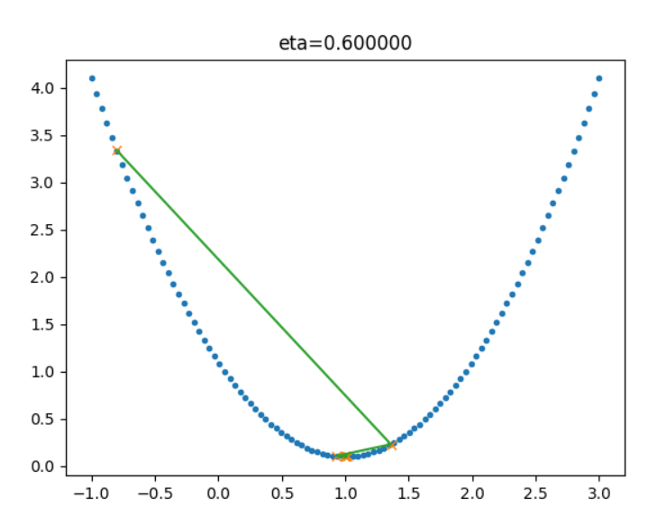
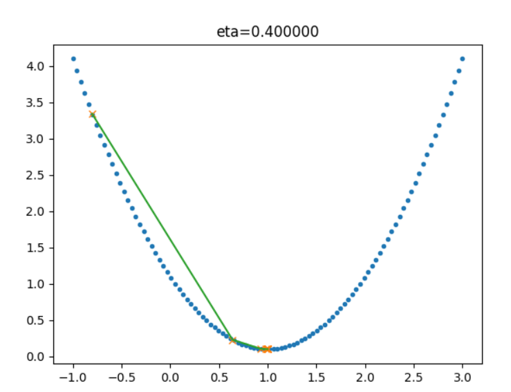
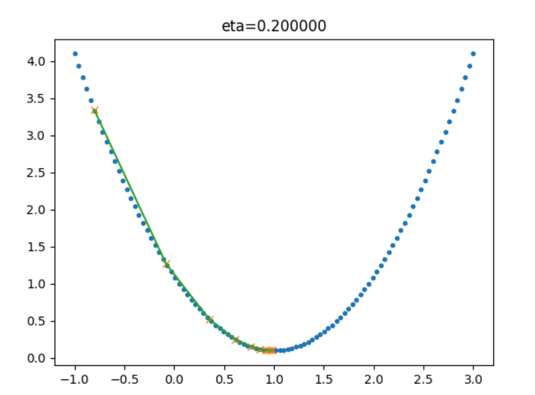
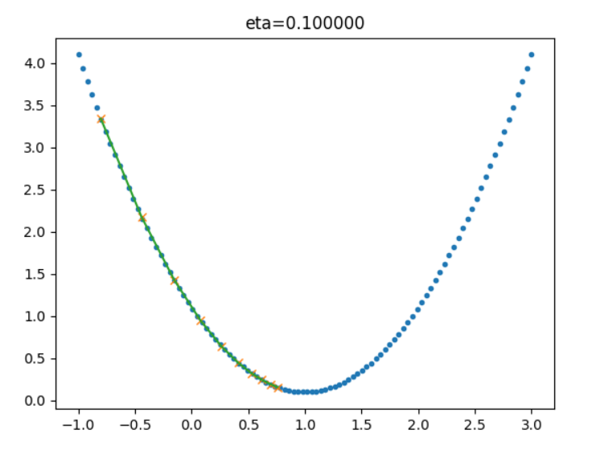

# 【Step1】

>>>># 01 概论与基本概念

>>### 01.0 人工智能发展简史

人工智能的发展，有这样起伏的模式：

1.研究（包括技术）取得进展。
2.研究的进展让人们看到人工智能的潜力，产生非常乐观的期望，例如在1958年到1970年间科学家对人工智能各种突破的预计，当然他们的绝大多数预计都太乐观了。
3.上述过高的期望让产业界开始热情地开发各种应用。
4.但应用未能全部满足期望，于是人工智能行业进入低谷，直到下一波研究和技术取得突破性进展。在2007年之后，是大规模的数据和廉价的计算能力，让神经网络技术再度兴起，成为AI领域的明星技术。

>>### 01.1 人工智能的定义

第一个层面，人们对人工智能的期待可以分为：
+ 智能地把某件特定的事情做好，在某个领域增强人类的智慧，这种方式又叫做智能增强——像搜索引擎，自动语言翻译，某个领域的智能助手那样的程序，帮助人类完成某种特定任务。这也叫做“弱人工智能”，或者“狭义人工智能”。
+ 像人类一样能认知，思考，判断：模拟人类的智能——像人类一样能认知，思考，判断的智能软件。这是人工智能学科一开始就有的梦想。这样的智能也叫做“通用人工智能”（Artificial General Intelligence， AGI）， 或“强人工智能”。对于这样的人工智能，科幻小说有很多描写，也有一些研究，但是在实际的应用还没有什么突破。有学者认为，AGI是不可能通过目前人们编程程序的方式实现的$^{[1]}$。尽管如此，社会上还是有人担忧有一天电脑的AGI会超过人类的智能，人类再也赶不上电脑，从而永远受制于电脑。

第二个层面，从技术的特点来看。
要实现某种狭义的人工智能，我们很自然地想到，如果我们能让运行程序的电脑来学习并自动掌握某些规律，那该多好啊，这就是“机器学习”。

第三个层面，从应用的角度来看，我们看到狭义人工智能在各个领域都取得了很大的成果。
一种是标杆式的任务，例如ImageNet，考察AI模型能否识别图像的类别，2015年，AI取得了超过人类的成果。

>>### 01.2 范式的演化

###第一阶段：经验
从几千年前到几百年前，人们描述自然现象，归纳总结一些规律。

人类最早的科学研究，主要以记录和描述自然现象为特征，不妨称之为称为“经验归纳”（第一范式）。人们看到自然现象，凭着自己的体验总结一些规律，并把规律推广到其他领域。这些规律通常是定性的，不是定量的。有时看似符合直觉，其实原理是错误的；有时在某个局部有效，但是推广到其他领域则不能适用；有些论断来自权威，导致错误总结也流传了很多年无人挑战。例如，我们看到日月星辰都围绕我们转，地心说很自然就产生了； 我们在生活中观察不同质量的物体运动的情况，也凭直觉推断“物体的下落速度和重量成正比”。

###第二阶段：理论
这一阶段，科学家们开始明确定义，速度是什么，质量是什么，化学元素是什么（不再是五行和燃素）……也开始构建各种模型，在模型中尽量撇除次要和无关因素，例如我们在中学的物理实验中，要假设“斜面足够光滑，无摩擦力”，“空气阻力可以忽略不计”，等等。在这个理论演算（Theoretical）阶段，以伽利略为代表的科学家，开启了现代科学之门。

###第三阶段：计算仿真
从二十世纪中期开始，利用电子计算机对科学实验进行模拟仿真的模式得到迅速普及，人们可以对复杂现象通过模拟仿真，推演更复杂的现象，典型案例如模拟核试验、天气预报等。这样计算机仿真越来越多地取代实验，逐渐成为科研的常规方法。科学家先定义问题，确认假设，再利用数据进行分析和验证。

###第四阶段：数据探索
最后我们到了“数据探索”（Data Exploration）阶段。在这个阶段，科学家收集数据，分析数据，探索新的规律。在深度学习的浪潮中出现的许多结果就是基于海量数据学习得来的。有些数据并不是从现实世界中收集而来，而是由计算机程序自己生成，例如，在AlphaGo算法训练的过程中，它和自己对弈了数百万局，这个数量大大超过了所有记录下来的职业选手棋谱的数量。

>>### 01.3 神经网络的基本工作原理

>>>># 02

>>### 02.0 反向传播与梯度下降
反向传播，梯度下降，损失函数。

神经网络训练的最基本的思想就是：先“猜”一个结果，称为预测结果 $a$，看看这个预测结果和事先标记好的训练集中的真实结果 $y$ 之间的差距，然后调整策略，再试一次，这一次就不是“猜”了，而是有依据地向正确的方向靠近。如此反复多次，一直到预测结果和真实结果之间相差无几，亦即 $|a-y|\rightarrow 0$，就结束训练。

####反向传播与梯度下降的基本工作原理：

1.初始化；
2.正向计算；
3.损失函数为我们提供了计算损失的方法；
4.梯度下降是在损失函数基础上向着损失最小的点靠近而指引了网络权重5.调整的方向；
6.反向传播把损失值反向传给神经网络的每一层，让每一层都根据损失值7.反向调整权重；
8.Go to 2，直到精度足够好（比如损失函数值小于 $0.001$）。

>>### 02.2 非线性反向传播

>>### 02.3 梯度下降

#### 从自然现象中理解梯度下降

在自然界中，梯度下降的最好例子，就是泉水下山的过程：

1. 水受重力影响，会在当前位置，沿着最陡峭的方向流动，有时会形成瀑布（梯度下降）；
2. 水流下山的路径不是唯一的，在同一个地点，有可能有多个位置具有同样的陡峭程度，而造成了分流（可以得到多个解）；
3. 遇到坑洼地区，有可能形成湖泊，而终止下山过程（不能得到全局最优解，而是局部最优解）。

#### 梯度下降的数学理解

梯度下降的数学公式：

$$\theta_{n+1} = \theta_{n} - \eta \cdot \nabla J(\theta) \tag{1}$$

其中：

- $\theta_{n+1}$：下一个值；
- $\theta_n$：当前值；
- $-$：减号，梯度的反向；
- $\eta$：学习率或步长，控制每一步走的距离，不要太快以免错过了最佳景点，不要太慢以免时间太长；
- $\nabla$：梯度，函数当前位置的最快上升点；
- $J(\theta)$：函数。

#### 梯度下降的三要素

1. 当前点；
2. 方向；
3. 步长。

#### 为什么说是“梯度下降”？

“梯度下降”包含了两层含义：

1. 梯度：函数当前位置的最快上升点；
2. 下降：与导数相反的方向，用数学语言描述就是那个减号。

亦即与上升相反的方向运动，就是下降。

图2-9 梯度下降的步骤

图2-9解释了在函数极值点的两侧做梯度下降的计算过程，梯度下降的目的就是使得x值向极值点逼近。

>>>># 03

>>### 03.0 损失函数

#### 概念

在各种材料中经常看到的中英文词汇有：误差，偏差，Error，Cost，Loss，损失，代价......意思都差不多，在本书中，使用“损失函数”和“Loss Function”这两个词汇，具体的损失函数符号用 $J$ 来表示，误差值用 $loss$ 表示。

“损失”就是所有样本的“误差”的总和，亦即（$m$ 为样本数）：

$$损失 = \sum^m_{i=1}误差_i$$

$$J = \sum_{i=1}^m loss_i$$

在黑盒子的例子中，我们如果说“某个样本的损失”是不对的，只能说“某个样本的误差”，因为样本是一个一个计算的。如果我们把神经网络的参数调整到完全满足独立样本的输出误差为 $0$，通常会令其它样本的误差变得更大，这样作为误差之和的损失函数值，就会变得更大。所以，我们通常会在根据某个样本的误差调整权重后，计算一下整体样本的损失函数值，来判定网络是不是已经训练到了可接受的状态。

#### 损失函数的作用

损失函数的作用，就是计算神经网络每次迭代的前向计算结果与真实值的差距，从而指导下一步的训练向正确的方向进行。

如何使用损失函数呢？具体步骤：

1. 用随机值初始化前向计算公式的参数；
2. 代入样本，计算输出的预测值；
3. 用损失函数计算预测值和标签值（真实值）的误差；
4. 根据损失函数的导数，沿梯度最小方向将误差回传，修正前向计算公式中的各个权重值；
5. 进入第2步重复, 直到损失函数值达到一个满意的值就停止迭代。

#### 用二维函数图像理解单变量对损失函数的影响

图3-1 单变量的损失函数图

图3-1中，纵坐标是损失函数值，横坐标是变量。不断地改变变量的值，会造成损失函数值的上升或下降。而梯度下降算法会让我们沿着损失函数值下降的方向前进。

1. 假设我们的初始位置在 $A$ 点，$x=x_0$，损失函数值（纵坐标）较大，回传给网络做训练；
2. 经过一次迭代后，我们移动到了 $B$ 点，$x=x_1$，损失函数值也相应减小，再次回传重新训练；
3. 以此节奏不断向损失函数的最低点靠近，经历了 $x_2,x_3,x_4,x_5$；
4. 直到损失值达到可接受的程度，比如 $x_5$ 的位置，就停止训练。

>>### 03.1 均方差损失函数

#### 工作原理

要想得到预测值 $a$ 与真实值 $y$ 的差距，最朴素的想法就是用 $Error=a_i-y_i$。

对于单个样本来说，这样做没问题，但是多个样本累计时，$a_i-y_i$ 可能有正有负，误差求和时就会导致相互抵消，从而失去价值。所以有了绝对值差的想法，即 $Error=|a_i-y_i|$ 。这看上去很简单，并且也很理想，那为什么还要引入均方差损失函数呢？两种损失函数的比较如表3-1所示。

表3-1 绝对值损失函数与均方差损失函数的比较

|样本标签值|样本预测值|绝对值损失函数|均方差损失函数|
|------|------|------|------|
|$[1,1,1]$|$[1,2,3]$|$(1-1)+(2-1)+(3-1)=3$|$(1-1)^2+(2-1)^2+(3-1)^2=5$|
|$[1,1,1]$|$[1,3,3]$|$(1-1)+(3-1)+(3-1)=4$|$(1-1)^2+(3-1)^2+(3-1)^2=8$|
|||$4/3=1.33$|$8/5=1.6$|

可以看到5比3已经大了很多，8比4大了一倍，而8比5也放大了某个样本的局部损失对全局带来的影响，用术语说，就是“对某些偏离大的样本比较敏感”，从而引起监督训练过程的足够重视，以便回传误差。

>>### 03.2 交叉熵损失函数

交叉熵（Cross Entropy）是Shannon信息论中一个重要概念，主要用于度量两个概率分布间的差异性信息。在信息论中，交叉熵是表示两个概率分布 $p,q$ 的差异，其中 $p$ 表示真实分布，$q$ 表示预测分布，那么 $H(p,q)$ 就称为交叉熵：

$$H(p,q)=\sum_i p_i \cdot \ln {1 \over q_i} = - \sum_i p_i \ln q_i \tag{1}$$

交叉熵可在神经网络中作为损失函数，$p$ 表示真实标记的分布，$q$ 则为训练后的模型的预测标记分布，交叉熵损失函数可以衡量 $p$ 与 $q$ 的相似性。

**交叉熵函数常用于逻辑回归(logistic regression)，也就是分类(classification)。**

>>>># 代码测试结果

#### p1

#### p2

#### p3

>>>># 学习总结
通过学习step1,对神经网络基本原理有了大致的了解，但对于各个知识的掌握度还不是很高，需要自己反复细致的消化，通过更多的实践来完善自身的知识系统。
