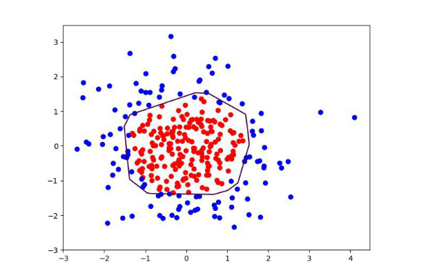
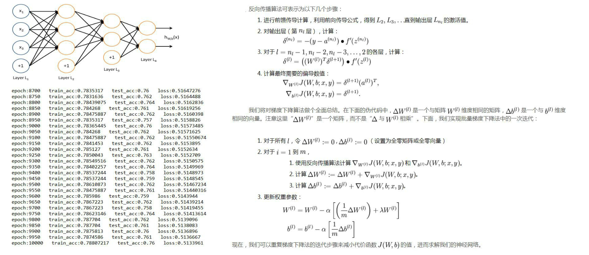
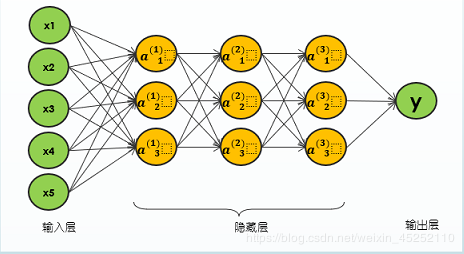
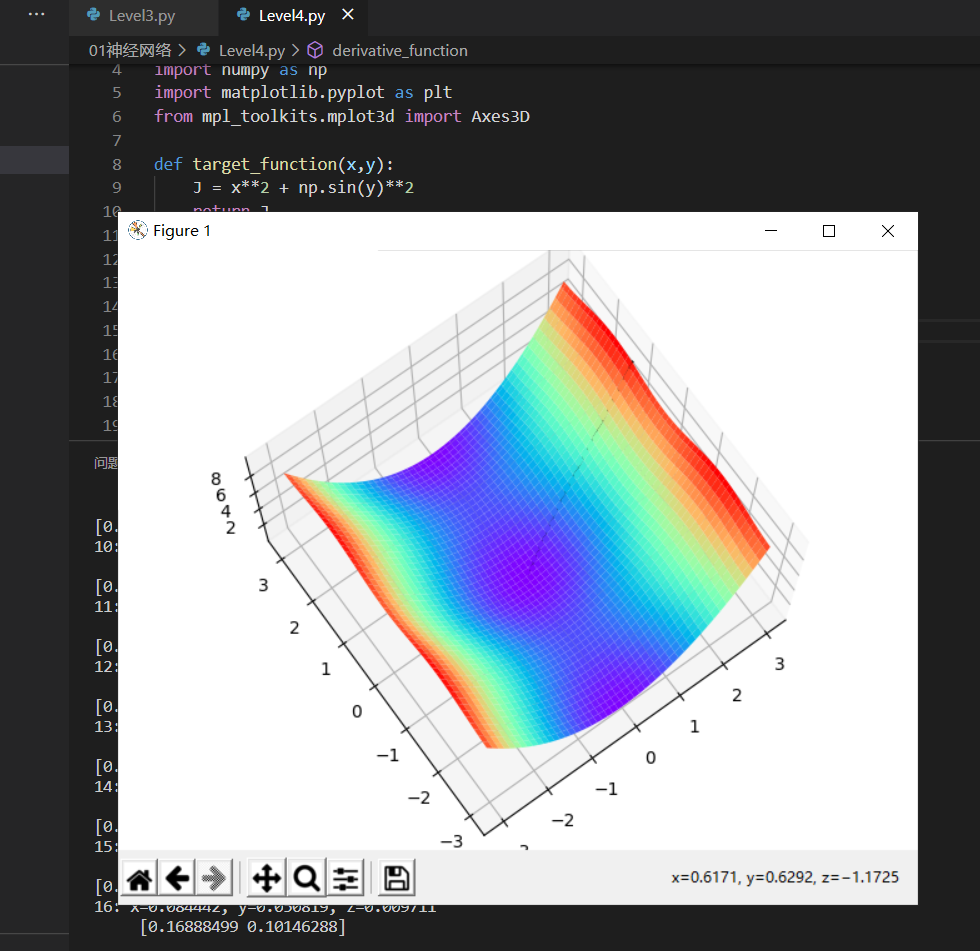
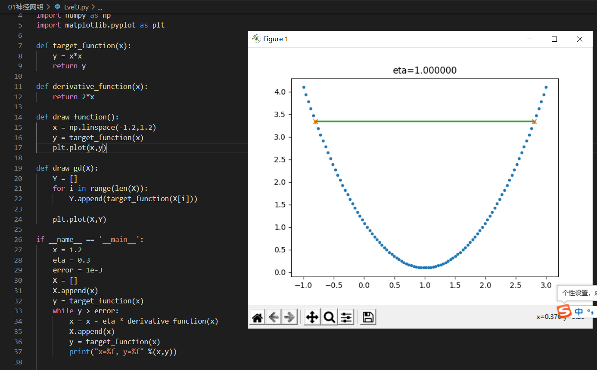
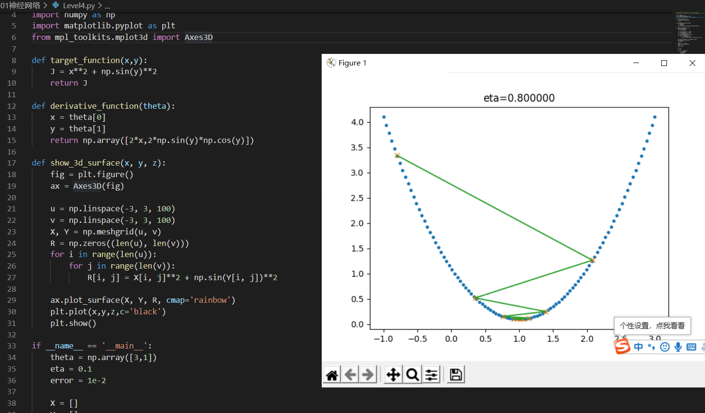
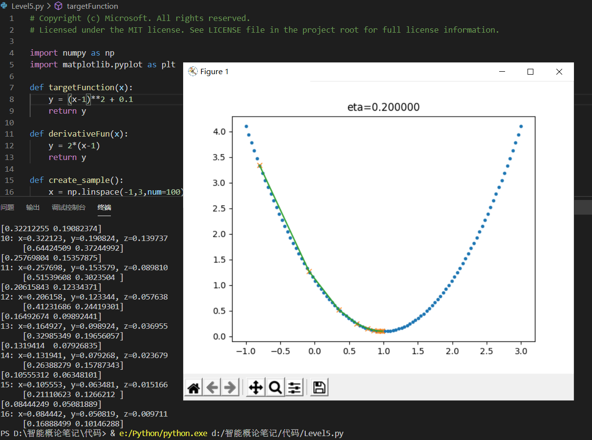
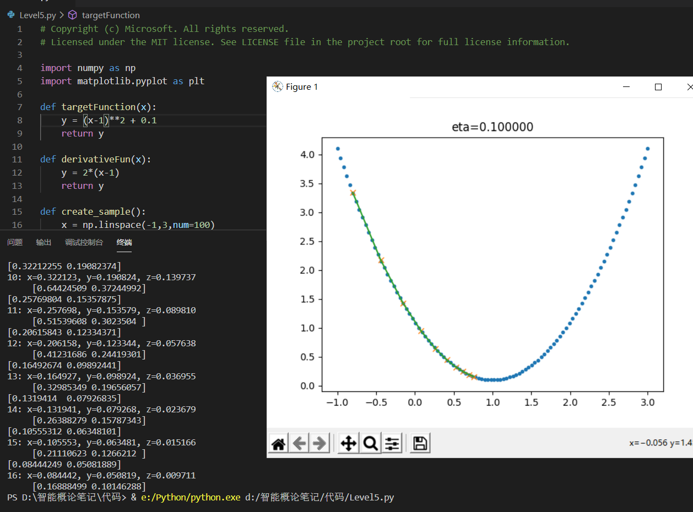
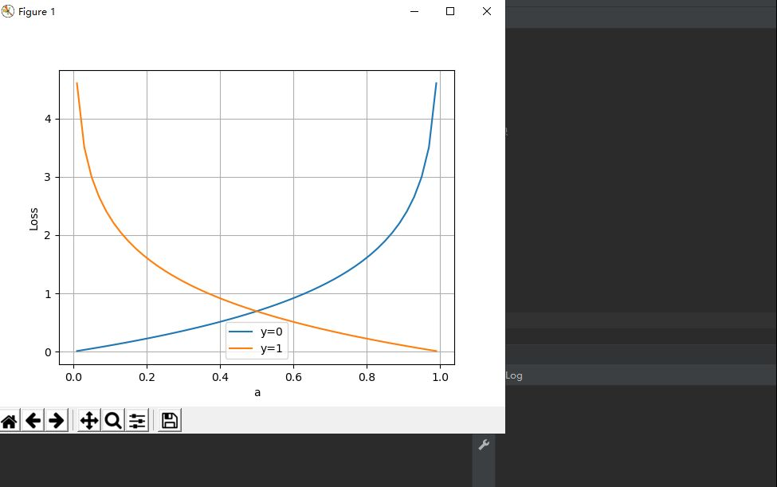
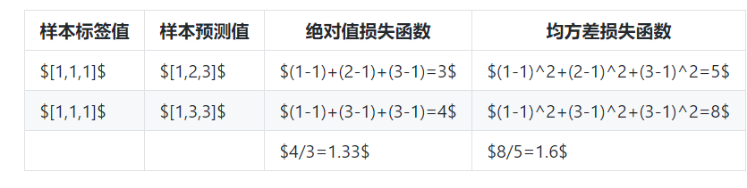

>>>>>>>>> # 神经网络基础
##慕课第一章
####神经网络介绍
传统神经网络结构比较简单，训练时随机初始化输入参数，并开启循环计算输出结果，与实际结果进行比较从而得到损失函数，并更新变量使损失函数结值极小,当达到目标阀值时即停止循环。
####前馈神经网络
前馈神经网络是一种最简单的神经网络，各神经元分层排列。每个神经元只与前一层的神经元相连。接收前一层的输出，并输出给下一层．各层间没有反馈。

####感知器
感知器是人工神经网络中的一种典型结构， 它的主要的特点是结构简单，对所能解决的问题 存在着收敛算法，并能从数学上严格证明，从而对神经网络研究起了重要的推动作用。
####BP神经网络
* BP神经网络也是前馈神经网络，只是他的参数权重值是由反向传播学习算法进行调整的.
* BP神经网络模型拓扑结构包括输入层，隐层和输出层。利用激活函数来实现从输入到输出的任意非线性映射，从而模拟各层神经元之间的交互。
* 激活函数必须满足处处可导的条件
#### 反向传播总结

#### 自组织神经网络
自组织神经网络是通过自动寻找样本中的内在规律和本质属性，自组织、自适应地改变网络参数与结构。多层感知器的学习和分类是已知一定的先验知识为条件的，即网络权值的调整是在监督情况下进行的。而在实际应用中，有时并不能提供所需的先验知识，这就需要网络具有能够自学习的能力。Kohonen提出的自组织特征映射图就是这种具有自学习功能的神经网络。这种网络是基于生理学和脑科学研究成果提出的。
* 算法
   完成自组织特征映射的算法较多。下面给出一种常用的自组织算法：
(1)权值初始化并选定邻域的大小；
(2)输入模式；
(3)计算空间距离dj(dj是所有输入节点与连接强度之差的平方和）。
(4)选择节点j，它满足min(dj)；
(5)改变j，和其邻域节点的连接强度；
(6)回(2)，直到满足dj(i)
_____
## step1学习
###  神经网络的基本工作原理
#### 神经元细胞的数学模型
 + 输入 input ：是外界输入信号，一般是一个训练数据样本的多个属性。
+ 权重 weights：每个输入信号的权重值。
+ 偏移 bias：b实际就是那个临界值。（用结果来解释是b是偏移值，使直线能够沿Y轴上下移动）
+ 求和计算 sum + 激活函数 activation：激活函数都是有一个渐变的过程，也就是说是个曲线。
+ 小结：    一个神经元：      
+ 可以有多个输入       
+ 只能有一个输出，这个输出可以同时输入给多个神经元      
+ w的数量和输入的数量一致     
+ 只有一个b   
+ w和b有人为的初始值，在训练过程中被不断修改 
+ 激活函数不是必须有的，亦即A可以等于Z   
+ 一层神经网络中的所有神经元的激活函数必须一致
 #### 神经网络的训练过程
1. 单层神经网络模型：这是一个单层的神经网络，有m个输入 (这里m=3)，有n个输出 (这里n=2)。在单个神经元里，b是个值。但是在神经网络中，我们把b的值永远设置为1，而用b到每个神经元的权值来表示实际的偏移值，亦即(b1,b2)，这样便于矩阵运算。   
+ $(x1,x2,x3)$是一个样本数据的三个特征值    
+ $(w11,w12,w13)$是$(x1,x2,x3)$到$n1$的权重   
+ $(w21,w22,w23)$是$(x1,x2,x3)$到$n2$的权重    
+ $b1$是$n1$的偏移      
+ $b2$是$n2$的偏移2. 前提条件：   
+ 有训练数据   
+ 根据数据的规模、领域，建立了神经网络的基本结构。    
+ 定义好损失函数来合理地计算误差3. 神经网络中的矩阵运算#### 神经网络的主要功能1. 回归/拟合
   分类
#### 激活函数
1. 生理学上的例子   
   
2. 激活函数的作用:一个没有激活函数的神经网络将只不过是一个线性回归模型.同样是因为没有激活函数，我们的神经网络将无法学习和模拟其他复杂类型的数据。    
+ Sigmoid激活函数：$$a = \frac{1}{1+e^{-z}}=\frac{1}{1+e^{-(wx+b)}}$$ 
3. 激活函数的另一个重要特征是：它应该是可导的。   
#### 深度神经网络与深度学习：三层以上的网络称为深度神经网络。
1. 卷积神经网络(CNN)对于图像类的机器学习问题，最有效的就是卷积神经网络2. 循环神经网络(RNN)对于语言类的机器学习问题，最有效的就是循环神经网络。
#### Deep Learning的训练过程
1. 使用自下上升非监督学习（就是从底层开始，一层一层的往顶层训练）2. 自顶向下的监督学习（就是通过带标签的数据去训练，误差自顶向下传输，对网络进行微调）   
### 总结
+ 这个章节介绍的是有监督学习的神经网络机器学习过程。神经网络模型：，神经网络模型是逻辑单元按照不同层级组织起来的网络，每一层的输出变量都是下一层的输入变量。
+ 反向传播算法是比较快速可以计算出结果的。在计算神经网络预测结果的时候采用一种正向传播方法（从第一层开始正向一层一层进行计算，直到最后一层的 hθ(x)。）。而反向传播算法（首先计算最后一层的误差，然后再一层一层反向求出各层的误差，直到倒数第二层。）
+ 反向传播算法推导：    
+  求deltaTheta   
+  求δ(误差) 链式求导
+ 即首先正向传播方法计算出每一层的激活单元，利用训练集的结果与神经网络预测的结果求出最后一层的误差，然后利用该误差运用反向传播法计算出直至第二层的所有误差。
### 神经网络中的三个基本概念
这三大概念是：反向传播，梯度下降，损失函数。

神经网络训练的最基本的思想就是：先“猜”一个结果，称为预测结果 $a$，看看这个预测结果和事先标记好的训练集中的真实结果 $y$ 之间的差距，然后调整策略，再试一次，这一次就不是“猜”了，而是有依据地向正确的方向靠近。如此反复多次，一直到预测结果和真实结果之间相差无几，亦即 $|a-y|\rightarrow 0$，就结束训练。

在神经网络训练中，我们把“猜”叫做初始化，可以随机，也可以根据以前的经验给定初始值。即使是“猜”，也是有技术含量的。
简单总结一下反向传播与梯度下降的基本工作原理：

1.初始化；
2.正向计算；
3.损失函数为我们提供了计算损失的方法；
4.梯度下降是在损失函数基础上向着损失最小的点靠近而指引了网络权重调整的方向；
5.反向传播把损失值反向传给神经网络的每一层，让每一层都根据损失值反向调整权重；
6.Go to 2，直到精度足够好（比如损失函数值小于 $0.001$）。
### 梯度下降
#### 梯度下降的数学理解
梯度下降的数学公式：

$$\theta_{n+1} = \theta_{n} - \eta \cdot \nabla J(\theta) \tag{1}$$

其中：

* $\theta_{n+1}$：下一个值；
* $\theta_n$：当前值；
* $-$：减号，梯度的反向；
* $\eta$：学习率或步长，控制每一步走的距离，不要太快以免错过了最佳景点，不要太慢以免时间太长；
* $\nabla$：梯度，函数当前位置的最快上升点；
* $J(\theta)$：函数。
#### 梯度下降的三要素
1.当前点；
2.方向；
3.步长。
+ 梯度下降是迭代法的一种,可以用于求解最小二乘问题(线性和非线性都可以)。
##### 单变量函数的梯度下降
 
##### 双变量的梯度下降

##### 学习率η的选择
在公式表达时，学习率被表示为$\eta$。在代码里，我们把学习率定义为learning_rate，或者eta。针对上面的例子，试验不同的学习率对迭代情况的影响
* 
学习率太大，迭代的情况很糟糕，在一条水平线上跳来跳去，永远也不能下降。
* 
学习率大，会有这种左右跳跃的情况发生，这不利于神经网络的训练。
* 
学习率合适，损失值会从单侧下降，4步以后基本接近了理想值。
* 
学习率较小，损失值会从单侧下降，但下降速度非常慢，10步了还没有到达理想状态。
### 损失函数
##### 概念
在各种材料中经常看到的中英文词汇有：误差，偏差，Error，Cost，Loss，损失，代价......意思都差不多，在本书中，使用“损失函数”和“Loss Function”这两个词汇，具体的损失函数符号用 $J$ 来表示，误差值用 $loss$ 表示。

“损失”就是所有样本的“误差”的总和，亦即（$m$ 为样本数）：

$$损失 = \sum^m_{i=1}误差_i$$

$$J = \sum_{i=1}^m loss_i$$
##### 损失函数的作用
损失函数的作用，就是计算神经网络每次迭代的前向计算结果与真实值的差距，从而指导下一步的训练向正确的方向进行。
使用损失函数具体步骤：
1.用随机值初始化前向计算公式的参数；
2.代入样本，计算输出的预测值；
3.用损失函数计算预测值和标签值（真实值）的误差；
4.根据损失函数的导数，沿梯度最小方向将误差回传，修正前向计算公式中的各个权重值；
5.进入第2步重复, 直到损失函数值达到一个满意的值就停止迭代。
##### 机器学习常用损失函数
符号规则：$a$ 是预测值，$y$ 是样本标签值，$loss$ 是损失函数值。

Gold Standard Loss，又称0-1误差 $$ loss=\begin{cases} 0 & a=y \\ 1 & a \ne y \end{cases} $$

绝对值损失函数

$$ loss = |y-a| $$

Hinge Loss，铰链/折页损失函数或最大边界损失函数，主要用于SVM（支持向量机）中
$$ loss=\max(0,1-y \cdot a) \qquad y=\pm 1 $$

Log Loss，对数损失函数，又叫交叉熵损失函数(cross entropy error)
$$ loss = -[y \cdot \ln (a) + (1-y) \cdot \ln (1-a)] \qquad y \in \{ 0,1 \} $$

Squared Loss，均方差损失函数 $$ loss=(a-y)^2 $$

Exponential Loss，指数损失函数 $$ loss = e^{-(y \cdot a)} $$
##### 损失函数图像理解
1. 用二维函数图像理解单变量对损失函数的影响
2. 用等高线图理解双变量对损失函数影响#### 神经网络中常用损失函数 均方差函数，主要用于回归：该函数就是最直观的一个损失函数了，计算预测值和真实值之间的欧式距离。预测值和真实值越接近，两者的均方差就越小。
   + 公式
  + $$ loss = {1 \over 2}(z-y)^2 \tag{单样本} $$   
   + $$ J=\frac{1}{2m} \sum_{i=1}^m (z_i-y_i)^2 \tag{多样本}$$
  + 工作原理：   
   + 要想得到预测值a与真实值y的差距，最朴素的想法就是用$Error=a_i-y_i$。    
  + 对于单个样本来说，这样做没问题，但是多个样本累计时，$a_i-y_i$有可能有正有负，误差求和时就会导致相互抵消，从而失去价值。所以有了绝对值差的想法，即$Error=|a_i-y_i|$。
    交叉熵函数，主要用于分类：是Shannon信息论中一个重要概念，主要用于度量两个概率分布间的差异性信息。
    + 在信息论中，交叉熵是表示两个概率分布p,q的差异，其中p表示真实分布，q表示非真实分布，那么H(p,q)就称为交叉熵
  + 公式:$$H(p,q)=\sum_i p_i \cdot log {1 \over q_i} = - \sum_i p_i \log q_i$$
  + 交叉熵的由来：    
  + 信息量：$$I(x_j) = -\log (p(x_j))$$（$x_j$：表示一个事件；$p(x_j)$：表示$x_i$发生的概率；$I(x_j)$：信息量，$x_j$越不可能发生时，它一旦发生后的信息量就越大）   
   + 熵：$$H(p) = - \sum_j^n p(x_j) \log (p(x_j))$$   
   + 相对熵（KL散度）：,如果我们对于同一个随机变量 x 有两个单独的概率分布 P(x) 和 Q(x)，我们可以使用KL散度来衡量这两个分布的差异，这个相当于信息论范畴的均方差。      
    + 公式：$$D_{KL}(p||q)=\sum_{j=1}^n p(x_j) \log{p(x_j) \over q(x_j)}$$（n为时间的所有可能性。D的值越小，表示q分布和p分布越接近）
  + 交叉熵：$$D_{KL}(p||q)=\sum_{j=1}^n p(x_j) \log{p(x_j)} - \sum_{j=1}^n p(x_j) \log q(x_j)$$ $$ =- H(p(x)) + H(p,q) $$
  + 二分类问题交叉熵
  + 多分类问题交叉熵
  + 不能使用均方差作为分类问题的损失函数原因   
 + 回归问题通常用均方差损失函数，可以保证损失函数是个凸函数，即可以得到最优解。而分类问题如果用均方差的话，损失函数的表现不是凸函数，就很难得到最优解。而交叉熵函数可以保证区间内单调。    
  + 分类问题的最后一层网络，需要分类函数，Sigmoid或者Softmax，如果再接均方差函数的话，其求导结果很复杂，运算量比较大。用交叉熵函数的话，可以得到比较简单的计算结果，一个简单的减法就可以得到反向误差。
+  运算代码的结果：
  

  二者都是非负函数，极值在底部
  #### 均方差函数
  ##### 工作原理
要想得到预测值 $a$ 与真实值 $y$ 的差距，最朴素的想法就是用 $Error=a_i-y_i$。

对于单个样本来说，这样做没问题，但是多个样本累计时，$a_i-y_i$ 可能有正有负，误差求和时就会导致相互抵消，从而失去价值。所以有了绝对值差的想法，即 $Error=|a_i-y_i|$ 。这看上去很简单，并且也很理想两种损失函数的比较如表所示。
绝对值损失函数与均方差损失函数的比较

  

