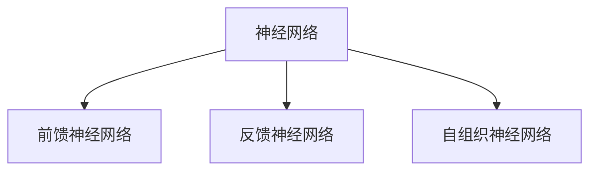
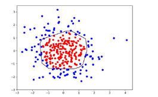
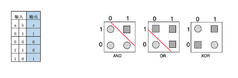
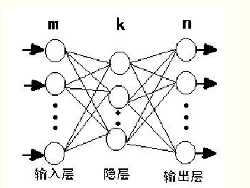
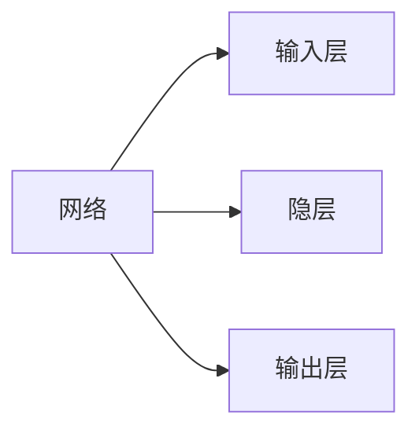
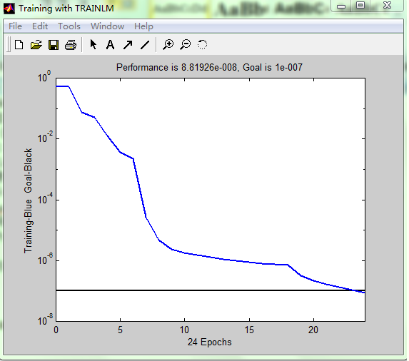
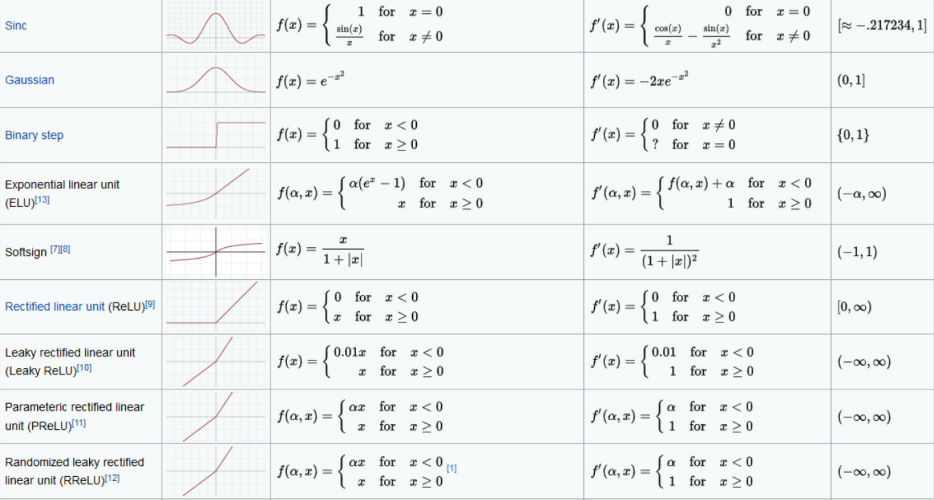
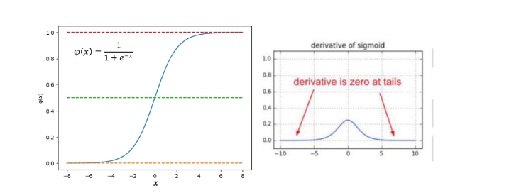

# 神经网络
## 一、神经网络介绍
### 1.1.介绍
人工神经网络(Artificial Neural Netork,即ANN)是由简单神经元经过相互连接形成网状结构，通过调节各连接的权重值改变连接的强度，进而实现感知判断反向传播(Back Propagation,BP）算法的提出进一步推动了神经网络的发展。
目前，神经网络作为一种重要的数据挖掘方法，已在医学诊断、信用卡欺诈识别、手写数字识别以及发动机的故障诊断等领域得到了广泛的应用。
### 1.2.分类
`在外界输入样本能刺激下，不断改变网络连接的权值（加深记忆）`
	

### 1.3.前馈神经网络
前馈神经网络(Feed Forward Neural Network)是一种单向多层的网络结构，即信息是从输入层开始，逐层向一个方向传递，一直到输出层结束。所谓的“前馈”是指输入信号的传播方向为前向，在此过程中并不调整各层的权值参数，而反传播时是将误差逐层向后传递，从而实现使用权值参数对特征的记忆，即通过反向传播(BP)算法来计算各层网络中神经元之间边的权重。BP算法具有非线性映射能力，理论上可逼近任意连续函，从而实现对模型的学习。

### 1.4.感知器
感知器是一种结构最简单的前馈神经网络，也称为感知机，它主要用于求解分类问题一个感知器可以接收n个输入
x=(x1,x2,..,xn)，对应n个权值w=(W1,w2,.., wn)，此外还有一个偏置项阈值，就是图中的b，神经元将所有输入参数与对应权值进行加权求和，得到的结果经过激活函数变换后输出，计算公式如下:
y=f ( x*w + b ) 

神经元的作用可以理解为对输入空间进行直线划分，单层感知机无法解决最简单的非线性可分问题----异或问题

感知器可以顺利求解与(AND)和或(OR)问题，但是对于异或(XOR)问题，单层感知机无法通过一条线进行分割。

### 1.5.BP神经网络
BP(Back Propagation)神经网络也是前馈神经网络，只是它的参数权重值是由反向传播学习算法进行调整的BP神经网络模型拓扑结构包括输入层、隐层和输出层，利用激活函数来实现从输入到输出的任意非线性映射，从而模拟各层神经元之间的交互
激活函数须满足处处可导的条件。例如，Sigmoid函数连续可微，求导合适，单调递增，输出值是0~1之间的连续量，这些特点使其适合作为神经网络的激活函数

#### 1.5.1.结构
 同一层不连接，相邻层全连接，层与层之间传递权重

 

*[隐层]: 非线性（多层次） 

BP网络由输入层、隐层和输出层组成，隐层可以有一层或多层，图2是m×k×n的三层BP网络模型，网络选用s型传递函

$F(x)=\frac{1}{1+e^(-x)}$ 通过反传误差函数$E=	\frac{\sum_{t=1}^{n}(t_i+O_i)^2}{2}$ ( Ti为期望输出、0i为网络的计算输出），不断调节网络权值和阈值使误差函数E达到极小。
BP网络具有高度非线性和较强的泛化能力，但也存在收敛速度慢、迭代步数多、易于陷入局部极小和全局搜索能力差等缺点。可以先用遗传算法对“BP网络”进行优化在解析空间找出较好的搜索空间，再用BP网络在较小的搜索空间内搜索最优解。
#### 1.5.2 模型实现
此次预测选用MATLAB中的神经网络工具箱进行网络的训练.预测模型的具体实现步骤如下:将训练样本数据归一化后输入网络。设定网络隐层和输出层激励函数分别为tansig和logsig函数.网络训练函数为traingdx,网络性能函数为mse,隐层神经元数初设为6。设定网络参数。网络迭代次数epochs为5000次.期望误差goal为0.00000001，学习速率1r为0.01。设定完参数后，开始训练网络。

该网络通过24次重复学习达到期望误差后则完成学习。详细代码见附录网络训练完成后，只需要将各项素质指标输入网络即可得到预测数据。
预测结果为:2.20

## 二、神经网络相关概念

### 2.1.激活函数
1.处处可导
	2.非线性
	3.可微性
	4.单调性
	5.输出值范围（可控）
	6.计算简单
	7.归一化
	8.函数值约等变量

     **范例：**

	Sigmoid函数
 
]
)
        1.连续可微
	    2.单调递增
	    3.输出值为0到1之内
 	    4.求导合适

常见激活函数

### 2.2.sigmoid函数
Sigmoid函数的优点在于输出范围有限，数据在传递的过程中不容易发散，并且其输出范围为(0,1)，可以在输出层表示概率值，如图6-8所示。Sigmoi函数的导数是非零的，很容易计算
Sigmoid函数的主要缺点是梯度下降非常明显，且两头过于平坦，容易出现梯度消失的情况，输出的值域不对称，并非像tanh函数那样值域是-1到1

### 2.3.损失函数

•	**交叉熵**
    $loss = ylog(\hat{y}_n)+(1-y)\log (1-\hat{y}_n)$
•	**均方差**
    $loss = \frac{1}{n}\sum_{n=1}^{n=\infty}(\hat{x}_i-x_i)^2$

### 2.4.过拟合，调整

**过拟合**
训练集上效果好，测试集上效果差，在预测中

**方法**
    
    •	参数范数惩罚，惩罚性成本函数正则化
    •	将惩罚项添加至损失函数已获得高权重
    •	公式
    •	数据增强
    •	提前终止
    •	选择一些规则来提前终止训练
    •	Bagging，等集成方法
  Dropout
    •	以正则化
    •	动量方法
	
*[Drpout]: 在每次训练中随机删除一个神经元子集•	防止神经网络过度依赖某一个路径随机屏蔽掉某些神经元，然后再调节其权重.

*[动量方法]:	每次训练仅略微改变方向,保持不进方向的连续平均数，消除个别点的变化
## 三、应用
因为利用BP网络可以建立对象的结构模型，所以分类和预测问题是神经网络最常见的一种应用。举几个例子:根据商店前几年某商品的销量建立模型，用来预测今年的销量，提前备货;根据电影的关键词给电影分类(动作、爱情、悬疑....);建立数字/字母模型来识别车牌等。

百度百科中总结的应用类型有以下四个方面:
1)函数逼近:用输入向量和相应的输出向量训练一个网络逼近一个函数。
2)模式识别:用一个待定的输出向量将它与输入向量联系起来。
3)分类:把输入向量所定义的合适方式进行分类。
4)数据压缩:减少输出向量维数以便于传输或存储。