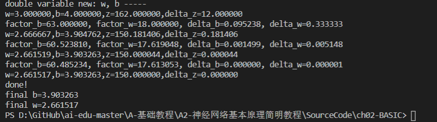
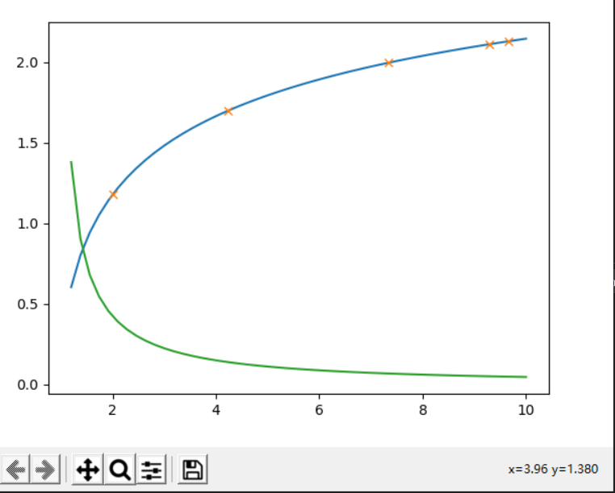
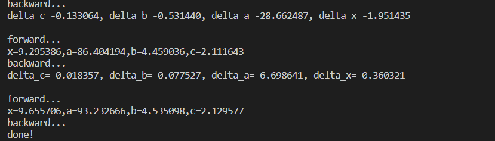

### 神经元模型由以下五个基本模型组成

### 1，输入 input

$(x_1,x_2,x_3)$ 是外界输入信号，一般是一个训练数据样本的多个属性，比如，我们要预测一套房子的价格，那么在房屋价格数据样本中，$x_1$ 可能代表了面积，$x_2$ 可能代表地理位置，$x_3$ 可能代表朝向。另外一个例子是，$(x_1,x_2,x_3)$ 分别代表了(红,绿,蓝)三种颜色，而此神经元用于识别输入的信号是暖色还是冷色。

### 2，权重 weights

$(w_1,w_2,w_3)$ 是每个输入信号的权重值，以上面的 $(x_1,x_2,x_3)$ 的例子来说，$x_1$ 的权重可能是 $0.92$，$x_2$ 的权重可能是 $0.2$，$x_3$ 的权重可能是 $0.03$。当然权重值相加之后可以不是 $1$。

#### 3，偏移 bias

还有个 $b$ 是怎么来的？一般的书或者博客上会告诉你那是因为 $y=wx+b$，$b$ 是偏移值，使得直线能够沿 $Y$ 轴上下移动。这是用结果来解释原因，并非 $b$ 存在的真实原因。从生物学上解释，在脑神经细胞中，一定是输入信号的电平/电流大于某个临界值时，神经元细胞才会处于兴奋状态，这个 $b$ 实际就是那个临界值。亦即当：

$$w_1 \cdot x_1 + w_2 \cdot x_2 + w_3 \cdot x_3 \geq t$$

时，该神经元细胞才会兴奋。我们把t挪到等式左侧来，变成$(-t)$，然后把它写成 $b$，变成了：

$$w_1 \cdot x_1 + w_2 \cdot x_2 + w_3 \cdot x_3 + b \geq 0$$

于是 $b$ 诞生了！

#### 4， 求和计算 sum

$$
\begin{aligned}
Z &= w_1 \cdot x_1 + w_2 \cdot x_2 + w_3 \cdot x_3 + b \\\\
&= \sum_{i=1}^m(w_i \cdot x_i) + b
\end{aligned}
$$

在上面的例子中 $m=3$。我们把$w_i \cdot x_i$变成矩阵运算的话，就变成了：

$$Z = W \cdot X + b$$

#### 5，激活函数 activation

求和之后，神经细胞已经处于兴奋状态了，已经决定要向下一个神经元传递信号了，但是要传递多强烈的信号，要由激活函数来确定：

$$A=\sigma{(Z)}$$

如果激活函数是一个阶跃信号的话，会像继电器开合一样咔咔的开启和闭合，在生物体中是不可能有这种装置的，而是一个渐渐变化的过程。所以一般激活函数都是有一个渐变的过程。

### 神经网络中的三个基本概念

### 1，反向传播

反向传播又分为线性传播和非线性传播

### 1，线性反向传播

假设有一个函数：z=xy，其中x=2w+3b,y=2b+1 通过正向计算：当w=3，b=4时，计算得到x=18，y=9，z=162.
反向传播:求w的偏导数
$$链式法则：因为z=xy，其中x=2w+3b,y=2b+1 因而𝜕z/𝜕w=𝜕z/𝜕x*𝜕x/𝜕w=y*2=18$$
直接求导：z=xy=(2w+3b)(2b+1)=4wb+2w+6b*b+3b 因而𝜕z/𝜕w=4b+2=16+2=18
求w的近似变化值
$$目标：z=150$$
$$由上面梯度计算结果有：$$
$$△z = 𝜕z/𝜕w*△w △w = △z/18=0.6667$$
$$w = 2.33333$$
$$z = 150.0003$$

### 2，非线性反向传播

$$y=f(x)，y=c，c=√b，b=ln(a)，a=x*x$$
$$其中1<x<=10，0<y<2.15。假设有5个人分别代表x、a、b、c、y：$$

正向过程
$$第1个人，输入层，随机输入第一个x值，x取值范围(1,10]，假设第一个数是2$$
$$第2个人，第一层网络计算，接收第1个人传入x的值，计算：a=x*x$$
$$第3个人，第二层网络计算，接收第2个人传入a的值，计算b：b=ln(a)$$
$$第4个人，第三层网络计算，接收第3个人传入b的值，计算c：c=√b$$
$$第5个人，输出层，接收第4个人传入c的值$$
反向过程
$$第5个人，计算y与c的差值：Δc=c−y，传回给第4个人$$
$$第4个人，接收第5个人传回Δc，计算Δb：Δb=Δc⋅2√b$$
$$第3个人，接收第4个人传回Δb，计算Δa：Δa=Δb⋅a$$
$$第2个人，接收第3个人传回Δa，计算Δx：Δx=Δa/2x$$
$$第1个人，接收第2个人传回Δx，更新x：x=x−Δx，回到第1步$$
$$提出问题：假设我们想最后得到c=2.13的值，x应该是多少？（误差小于0.001即可）$$

### 1，数学解析解

$$c=√b=√ln(a)=√ln(x2)=2.13$$
$$x=9.6653$$
2.2.3 梯度迭代解
$$da/dx=d(x2)/dx=2x=Δa/Δx (1)$$
$$db/da=d(lna)/da=1/a=Δb/Δa (2)$$
$$dc/db=d(√b/)db=1/2√b=Δc/Δb (3)$$

$$因此得到如下一组公式，可以把最后一层Δc的误差一直反向传播给最前面的Δx，从而更新x值$$
$$Δc=c−y(4)$$
$$Δb=Δc⋅2√b(根据式3)$$
$$Δa=Δb⋅a(根据式2)$$
$$Δx=Δa/2x(根据式1)$$
$$我们给定初始值x=2，Δx=0，依次计算结果如下所示$$
正向与反向的迭代计算
$$方向	公式	  迭代1	迭代2	迭代3	迭代4	迭代5$$
$$正向	x=x−Δx	2	4.243	7.344	9.295	9.665$$
$$正向	a=x2	4	18.005	53.934	86.404	93.233$$
$$正向	b=ln(a)	1.386	2.891	3.988	4.459	4.535$$
$$正向	c=√b	1.177	1.700	1.997	2.112	2.129$$
$$标签值y	2.13	2.13	2.13	2.13	2.13$$
$$反向	Δc=c−y	-0.953	-0.430	-0.133	-0.018$$	
$$反向	Δb=Δc⋅2√b	-2.243	-1.462	-0.531	-0.078$$	
$$反向	Δa=Δb⋅a	-8.973	-26.317	-28.662	-6.698$$
$$反向	Δx=Δa/2x	-2.243	-3.101	-1.951	-0.360$$	
通过相关代码运行的结果上面显示结果一致。

### 2，梯度下降

梯度下降的基本过程就和下山的场景很类似。

首先，我们有一个可微分的函数。这个函数就代表着一座山。我们的目标就是找到这个函数的最小值，也就是山底。根据之前的场景假设，最快的下山的方式就是找到当前位置最陡峭的方向，然后沿着此方向向下走，对应到函数中，就是找到给定点的梯度 ，然后朝着梯度相反的方向，就能让函数值下降的最快！因为梯度的方向就是函数之变化最快的方向
所以，我们重复利用这个方法，反复求取梯度，最后就能到达局部的最小值，这就类似于我们下山的过程。而求取梯度就确定了最陡峭的方向，也就是场景中测量方向的手段。

关于代码解释首先，我们需要定义数据集和学习率:
### 代码
from numpy import *

$$数据集大小 即20个数据点$$
m = 20

$$x的坐标以及对应的矩阵$$
$$X0 = ones((m, 1))  # 生成一个m行1列的向量，也就是x0，全是1
X1 = arange(1, m+1).reshape(m, 1)  # 生成一个m行1列的向量，也就是x1，从1到m
X = hstack((X0, X1))  # 按照列堆叠形成数组，其实就是样本数据$$

$$对应的y坐标$$
$$y = np.array([
    3, 4, 5, 5, 2, 4, 7, 8, 11, 8, 12,
    11, 13, 13, 16, 17, 18, 17, 19, 21
]).reshape(m, 1)$$

$$学习率
alpha = 0.01$$

$$定义代价函数$$

$$def cost_function(theta, X, Y):
    diff = dot(X, theta) - Y  # dot() 数组需要像矩阵那样相乘，就需要用到dot()
    return (1/(2*m)) * dot(diff.transpose(), diff)$$

$$定义代价函数对应的梯度函数$$

$$def gradient_function(theta, X, Y):
    diff = dot(X, theta) - Y
    return (1/m) * dot(X.transpose(), diff)$$

$$根据数据画出对应的图像$$
$$def plot(X, Y, theta):
    import matplotlib.pyplot as plt
    ax = plt.subplot(111)  
    ax.scatter(X, Y, s=30, c="red", marker="s")
    plt.xlabel("X")
    plt.ylabel("Y")
    x = arange(0, 21, 0.2)  # x的范围
    y = theta[0] + theta[1]*x
    ax.plot(x, y)
    plt.show()
    plot(x1,y,optimal)
    $$

### 3，损失函数
$$分类任务的损失函数$$
$$假设某分类任务共有N个训练样本，针对网络最后分层第 i 个样本的输入特征为 XiXi ，其对应的标记为YiYi是最终的分类结果（C个分类结果中的一个），h=（h1,h2,...,hch1,h2,...,hc）为网络的最终输出，即样本 i 的预测结果。其中 C 是最后所有分类的数量.$$

$$交叉熵损失函数$$
$$交叉熵损失函数又叫 softmax 损失函数。 是目前卷积神经网络中最常用的分类目标损失函数。 
举个例子，比如 C = 3 ，也就是最后分类结果有三种，分别是0，1，2.假设对于第 i 个样本正确分类是1，h=（2，5，1），那么交叉熵损失函数就等于： 
-（1 / 3）* (log((e^5) / (e^2 + e^5 + e^1))) 
LcrossEntropyLoss=LsoftmaxLoss=−1Nlog(ehyi∑Cj=1ehj)
LcrossEntropyLoss=LsoftmaxLoss=−1Nlog(ehyi∑j=1Cehj)
合页损失函数（hinge loss）
合页函数广泛在支持向量机中使用，有时也会在损失函数中使用。

LhingeLoss=1N∑i=1Nmax(0,1−hyi)
LhingeLoss=1N∑i=1Nmax(0,1−hyi)
在分类任务中，通常使用交叉熵函数要优于使用合页损失函数。 
缺点：合页损失函数是对错误越大的样本施以更严重的惩罚。可是这样会导致损失函数对噪音敏感。举例，如果一个样本的标记错误或者是离群点，则由于错分导致分类误差会很大，如此便会影响整个分类超平面的学习，从而降低模型泛化能力$$

$$坡道损失函数$$
优点：克服了合页损失函数鲁棒性差的特点，对噪声数据和离群数据有很好的抗噪能力。因此也被称作鲁棒损失函数。这类损失函数的特点是在分类（回归）问题误差较大区域进行了截断，使得较大的误差不再影响整个损失函数。

LrampLoss=LhingeLoss−1Nmax(0,s−hyi)
LrampLoss=LhingeLoss−1Nmax(0,s−hyi)

=1N∑i=1N(max(0,1−hyi)−max(0,s−hyi))
=1N∑i=1N(max(0,1−hyi)−max(0,s−hyi))

### 代码

$$显示只变化b时loss的变化情况$$
def CalculateCostB(x,y,n,w,b):
    B = np.arange(b-1,b+1,0.05)
    Loss=[]
    for i in range(len(B)):
        z = w*x+B[i]
        loss = CostFunction(x,y,z,n)
        Loss.append(loss)
    plt.title("Loss according to b")
    plt.xlabel("b")
    plt.ylabel("J")
    plt.plot(B,Loss,'x')
    plt.show()

$$显示只变化w时loss的变化情况$$
def CalculateCostW(x,y,n,w,b):
    W = np.arange(w-1,w+1,0.05)
    Loss=[]
    for i in range(len(W)):
        z = W[i]*x+b
        loss = CostFunction(x,y,z,n)
        Loss.append(loss)
    plt.title("Loss according to w")
    plt.xlabel("w")
    plt.ylabel("J")
    plt.title = "Loss according to w"
    plt.plot(W,Loss,'o')
    plt.show()

$$显示同时变化w,b时loss的变化情况$$
def CalculateCostWB(x,y,n,w,b):
    W = np.arange(w-10,w+10,0.1)
    B = np.arange(b-10,b+10,0.1)
    Loss=np.zeros((len(W),len(B)))
    for i in range(len(W)):
        for j in range(len(B)):
            w = W[i]
            b = B[j]
            a = w*x+b
            loss = CostFunction(x,y,a,n)
            Loss[i,j] = loss

    fig = plt.figure()
    ax = fig.gca(projection='3d')
    ax.plot_surface(W,B,Loss)
    plt.show()
    

### 总结

$$反向传播$$

就我个人来说：反向传播就是一个利用链式法则，由外而内逐层计算最终输出对每层的变量的梯度的简便算法。该算法在神经网络中得以普遍应用，因为在神经网络中这样由外而内计算梯度的顺序是从输出层到输入层反向进行的。

训练神经网络通过优化一个损失函数loss，使其数值越来越小，那么我们的网络的性能就会越来越好。

通过改变我们网络每一层的参数，就能改变网络的输出，进而就可以改变loss的值。

计算loss对每层参数的梯度，每层参数都向loss对其的负梯度方略微改变，只要当前的loss不处于局部最小值且改变的幅度得当，这种操作一般是能够使loss减小的，这便是梯度下降GD的核心思想。

就我个人而言我认为可以将反向传播的过程拆成两个部分：计算loss对每层输出的梯度 和 计算每层的输出对其参数的梯度，可以把计算loss对每层输出的梯度看做反向传播路径的主干，而把计算每层的输出对其参数的梯度看做主干在每一层上的分支。

$$损失函数$$

损失函数或代价函数是将随机事件或其有关随机变量的取值映射为非负实数以表示该随机事件的“风险”或“损失”的函数。在应用中，损失函数通常作为学习准则与优化问题相联系，即通过最小化损失函数求解和评估模型。例如在统计学和机器学习中被用于模型的参数估计在宏观经济学中被用于风险管理和决策，在控制理论中被应用于最优控制理论

$$梯度下降$$
在最小化损失函数时，可以通过梯度下降法来一步一步的迭代求解，得到最小化的损失函数。梯度下降不一定能找到全局的最优解，有可能是一个局部的最优解。当损失函数是一个凸函数时，梯度下降就一定能得到最优解。梯度下降的相关概念有：
步长。步长决定在梯度下降的过程中，每一步沿梯度负方向前进的长度。
特征。指的是样本特征。
假设函数：在监督学习中，为了拟合输入样本，而使用假设函数。
损失函数：为了评估模型的好坏。通常用损失函数来度量拟合的程度。损失函数最小化，意味着拟合程度较好，参数对于模型是最优的。损失函数通常采用假设函数和样本输出的差取平方。

最后我想说这个东西有点难需要花时间和精力去一点一点的去理解去琢磨才能有一点点感觉的。

