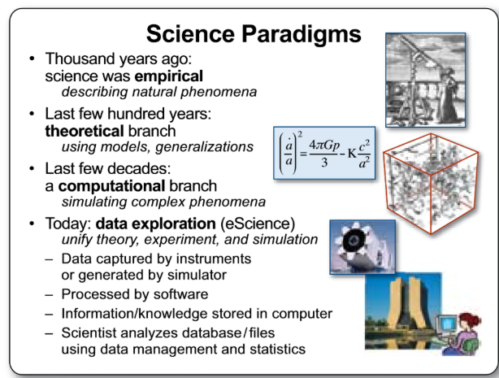
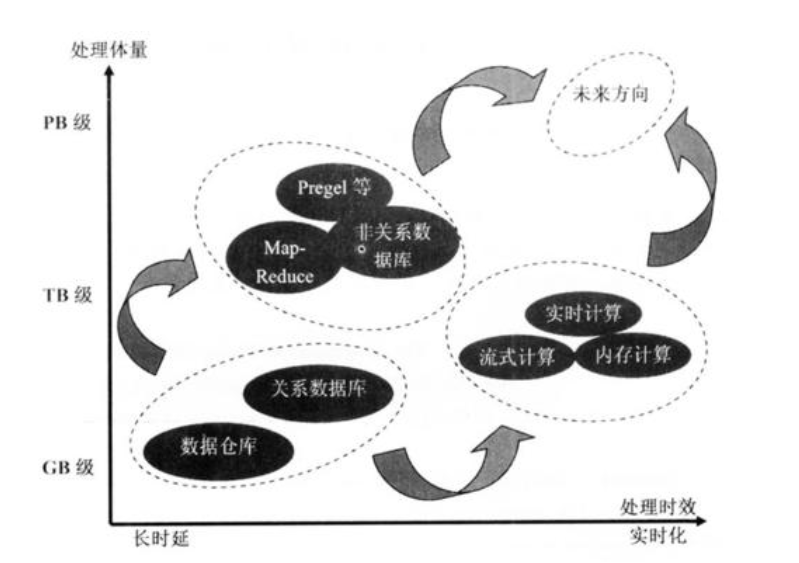

# 范式的演化

## 演化的四个阶段

### 第一阶段：经验
        归纳经验
### 第二阶段：理论
        这一阶段，科学家们开始明确定义，速度是什么，质量是什么，化学元素是什么（不再是五行和燃素）……也开始构建各种模型，在模型中尽量撇除次要和无关因素，例如我们在中学的物理实验中，要假设“斜面足够光滑，无摩擦力”，“空气阻力可以忽略不计”，等等
### 第三阶段：计算仿真
        从二十世纪中期开始，利用电子计算机对科学实验进行模拟仿真的模式得到迅速普及，人们可以对复杂现象通过模拟仿真，推演更复杂的现象，典型案例如模拟核试验、天气预报等。这样计算机仿真越来越多地取代实验，逐渐成为科研的常规方法。科学家先定义问题，确认假设，再利用数据进行分析和验证。
### 第四阶段：数据探索
        最后我们到了“数据探索”（Data Exploration）阶段。在这个阶段，科学家收集数据，分析数据，探索新的规律。在深度学习的浪潮中出现的许多结果就是基于海量数据学习得来的。有些数据并不是从现实世界中收集而来，而是由计算机程序自己生成，例如，在AlphaGo算法训练的过程中，它和自己对弈了数百万局，这个数量大大超过了所有记录下来的职业选手棋谱的数量。

