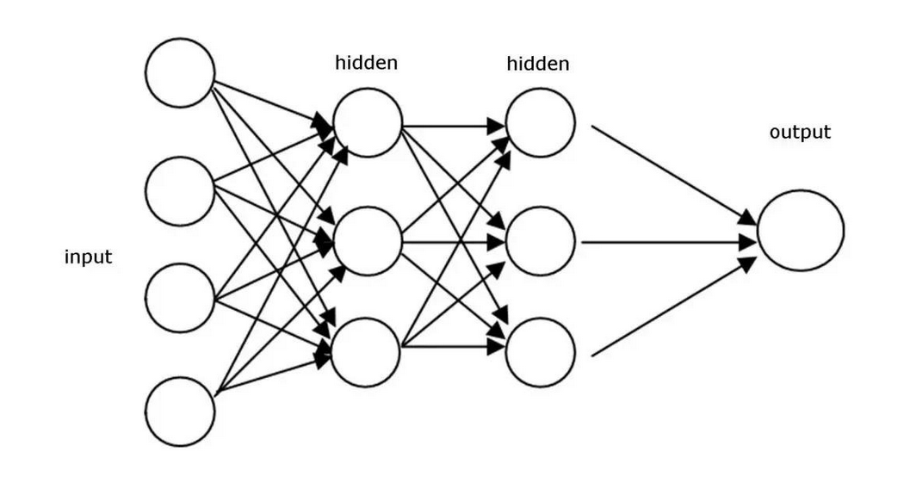
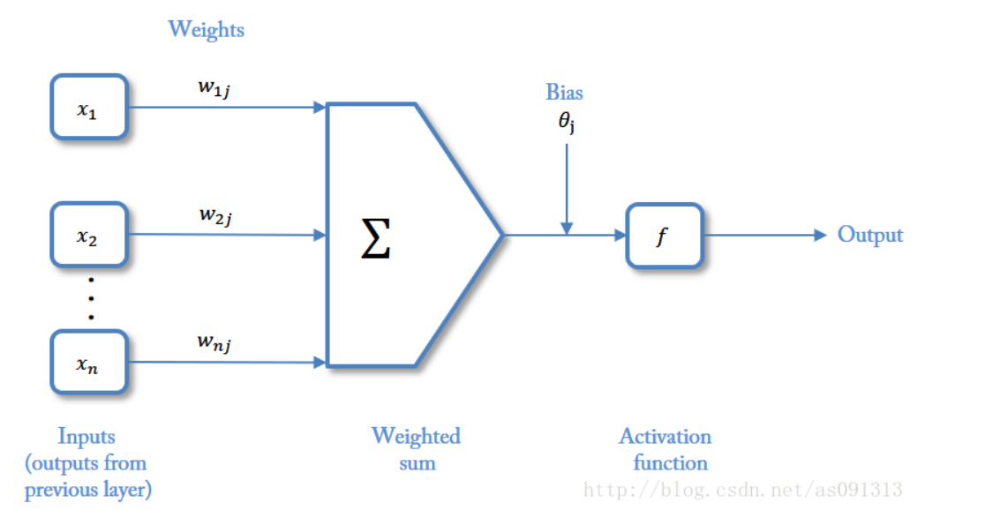
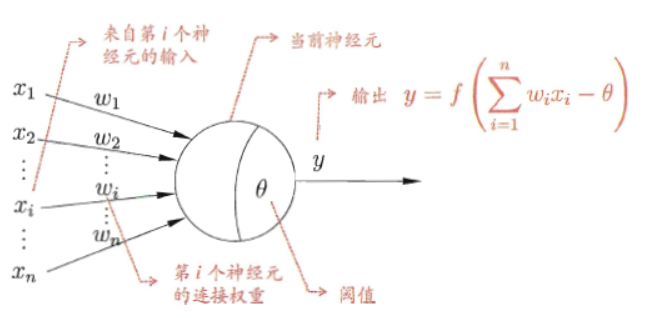

# 神经网络

人工神经网络（artificial neural network，ANN），简称神经网络（neural network，NN），是一种模仿生物神经网络的结构和功能的数学模型或计算模型。神经网络由大量的人工神经元联结进行计算。大多数情况下人工神经网络能在外界信息的基础上改变内部结构，是一种自适应系统。现代神经网络是一种非线性统计性数据建模工具，常用来对输入和输出间复杂的关系进行建模，或用来探索数据的模式。

神经网络是一种运算模型，由大量的节点（或称“神经元”）和之间相互的联接构成。每个节点代表一种特定的输出函数，称为激励函数、激活函数（activation function）。每两个节点间的联接都代表一个对于通过该连接信号的加权值，称之为权重，这相当于人工神经网络的记忆。网络的输出则依网络的连接方式，权重值和激励函数的不同而不同。而网络自身通常都是对自然界某种算法或者函数的逼近，也可能是对一种逻辑策略的表达。

它的构筑理念是受到生物（人或其他动物）神经网络功能的运作启发而产生的。人工神经网络通常是通过一个基于数学统计学类型的学习方法得以优化，所以人工神经网络也是数学统计学方法的一种实际应用，通过统计学的标准数学方法我们能够得到大量的可以用函数来表达的局部结构空间，另一方面在人工智能学的人工感知领域，我们通过数学统计学的应用可以来做人工感知方面的决定问题(也就是说通过统计学的方法，人工神经网络能够类似人一样具有简单的决定能力和简单的判断能力)，这种方法比起正式的逻辑学推理演算更具有优势。

神经网络最重要的用途是分类，为了让大家对分类有个直观的认识，有几个例子：

    垃圾邮件识别：现在有一封电子邮件，把出现在里面的所有词汇提取出来，送进一个机器里，机器需要判断这封邮件是否是垃圾邮件。
    
    疾病判断：病人到医院去做了一大堆肝功、尿检测验，把测验结果送进一个机器里，机器需要判断这个病人是否得病，得的什么病。
    
    猫狗分类：有一大堆猫、狗照片，把每一张照片送进一个机器里，机器需要判断这幅照片里的东西是猫还是狗。

# M-P神经元模型
## 作用
接受其他多个神经元传入的信号，然后将这些信号汇总成总信号，对比总信号与阈值，如果超过阈值，则产生兴奋信号并输出出去，如果低于阈值，则处于抑制状态。

一条直线把平面一分为二，一个平面把三维空间一分为二，一个 n − 1 n-1 n−1 维超平面把 n n n 维空间一分为二，两边分属不同的两类，这种分类器就叫做神经元。

大家都知道平面上的直线方程是 a x + b y + c = 0 ax+by+c=0 ax+by+c=0，等式左边大于零和小于零分别表示点 ( x , y ) (x,y) (x,y)在直线的一侧还是另一侧，把这个式子推广到n维空间里，直线的高维形式称为超平面，它的方程是：

h = a 1 x 1 + a 2 x 2 + . . . + a n x n + a 0 = 0 h = a_1x_1+a_2 x_2+...+a_nx_n+a_0=0 h=a1​x1​+a2​x2​+...+an​xn​+a0​=0

神经元就是当h大于0时输出1，h小于0时输出0这么一个模型，它的实质就是把特征空间一切两半，认为两瓣分别属两个类。

