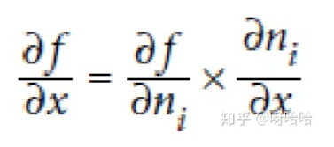
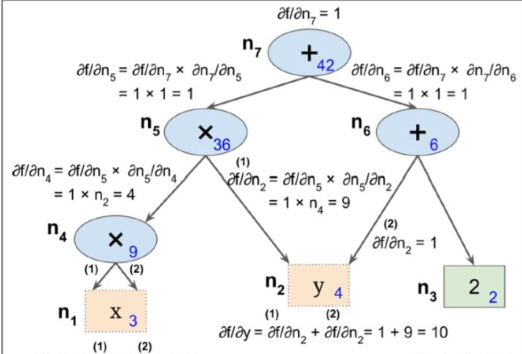
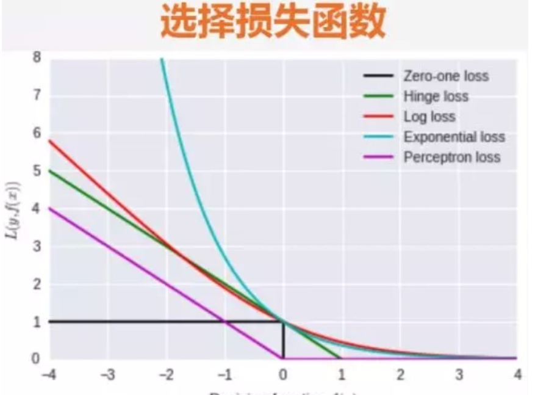
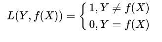
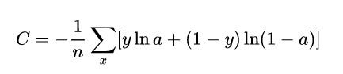
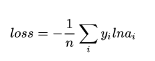

# 三个基本概念
## 反向传播 梯度下降 损失函数

###  反向传播
反向传播计算流程

    反向传播，就是梯度下降使用reverse-mode autodiff前向传播，就是make predictions，计算输出误差，然后计算每个神经元节点对误差的贡献求贡献就是反向传播是根据前向传播的误差来求梯度然后根据贡献调整原来的权重

Reverse-mode Autodiff计算方法

    反向自动求导是TensorFlow实现的方案，首先，它执行图的前向阶段，从输入到输出，去计算节点值，然后是反向阶段，从输出到输入去计算所有的偏导。下面的图示第二阶段，在第一阶段中，从x=3和y=4开始去计算所有的节点值。f(x,y)= 2 ∗ y + y + 2 求解的思想是逐渐的从图上往下，计算f(x,y)的偏导，使用每一个连续的节点，知道我们到达变量节点，严重依赖链式求导法则！

### 梯度下降

 1. 批量梯度下降(Batch Gradient Descent)

每一次迭代时使用整个训练集的数据计算Cost Function来进行梯度更新。
神经网络训练的三个基本概念Epoch, Batch, Iteration

由于每一次参数更新都用到所有的训练集数据，当样本数量很大的时候，计算开销大，速度慢。

2. 随机梯度下降(Stochastic Gradient Descent)

每一次迭代时，针对单个样本计算Loss Function，然后计算梯度更新参数。这种方法速度比较快，但是收敛性能不好，可能造成目标函数剧烈震荡，并且大数据集的相似样本会造成梯度的冗余计算。
神经网络训练的三个基本概念Epoch, Batch, Iteration

3. 小批量梯度下降(Mini-Batch Gradient Descent)

每次迭代时，采用一小批样本，一方面这样可以降低参数更新时的方差，收敛更加稳定，另一方面可以充分利用深度学习库中的高度优化的矩阵操作进行有效的梯度计算。

Mini-Batch Gradient Descent并不能保证很好的收敛性，Learning Rate 如果选择的太小，收敛速度会很慢；如果选择的太大，Loss Function可能在局部最优解附近不停地震荡甚至偏离。有一种措施是先设定大一点的学习率，当两次迭代之间的变化低于某个阈值后，就减小Learning Rate。
神经网络训练的三个基本概念Epoch, Batch, Iteration

在大规模的神经网络训练中，一般采用小批量梯度下降的方式。 Batch Epoch Iteration 就是其中的重要的概念。

1. Batch

每次迭代时使用的一批样本就叫做一个Batch，样本的数量称为Batch Size。Batch大小是一个超参数，用于定义在更新内部模型参数之前要处理的样本数。深度学习每一次参数的更新的Loss Function并不是由一个样本得到的，而是由一个Batch的数据加权得到。

2. Iteration

使用Batch Size个样本训练一次的过程叫做一个Iteration。

3. Epoch

一个epoch就是使用训练集中的全部样本训练一次。通俗的讲，Epoch的值就是整个训练数据集被反复使用几次。

Epoch数是一个超参数，它定义了学习算法在整个训练数据集中的工作次数。一个Epoch意味着训练数据集中的每个样本都有机会更新内部模型参数。Epoch由一个或多个Batch组成。 

### 损失函数

损失函数用来评价模型的预测值和真实值不一样的程度，损失函数越好，通常模型的性能越好。不同的模型用的损失函数一般也不一样。

损失函数分为经验风险损失函数和结构风险损失函数。经验风险损失函数指预测结果和实际结果的差别，结构风险损失函数是指经验风险损失函数加上正则项。

常见的损失函数以及其优缺点如下：

    0-1损失函数(zero-one loss)

1. 0-1损失是指预测值和目标值不相等为1， 否则为0:

特点：

(1)0-1损失函数直接对应分类判断错误的个数，但是它是一个非凸函数，不太适用.

(2)感知机就是用的这种损失函数。但是相等这个条件太过严格，因此可以放宽条件

2. 交叉熵损失函数 (Cross-entropy loss function)

交叉熵损失函数的标准形式如下:

注意公式中 x 表示样本， y 表示实际的标签， a 表示预测的输出， n 表示样本总数量。

特点：

(1)本质上也是一种对数似然函数，可用于二分类和多分类任务中。

二分类问题中的loss函数（输入数据是softmax或者sigmoid函数的输出）：

多分类问题中的loss函数（输入数据是softmax或者sigmoid函数的输出）：

(2)当使用sigmoid作为激活函数的时候，常用交叉熵损失函数而不用均方误差损失函数，因为它可以完美解决平方损失函数权重更新过慢的问题，具有“误差大的时候，权重更新快；误差小的时候，权重更新慢”的良好性质。