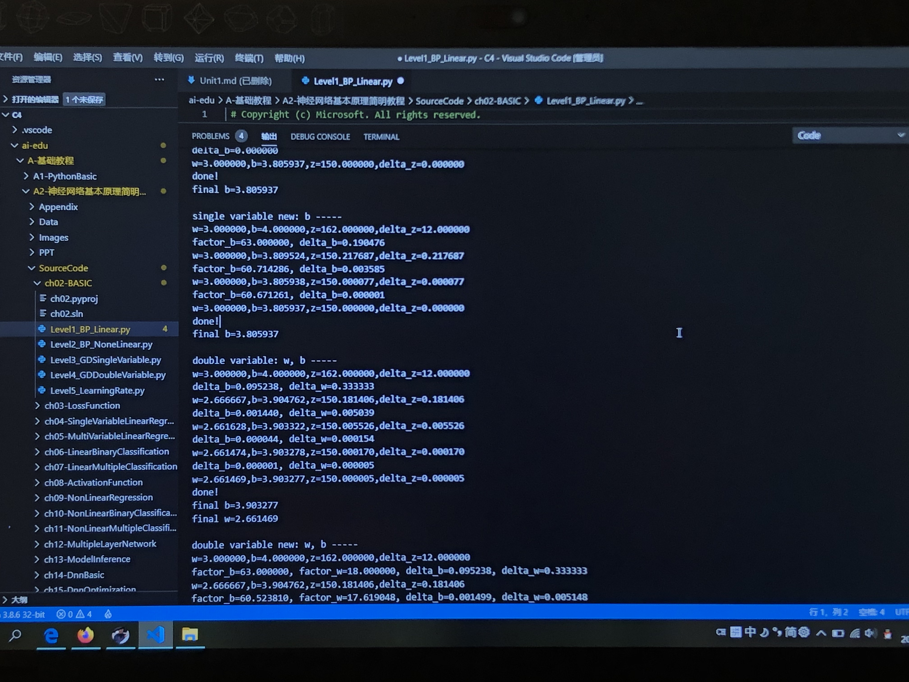
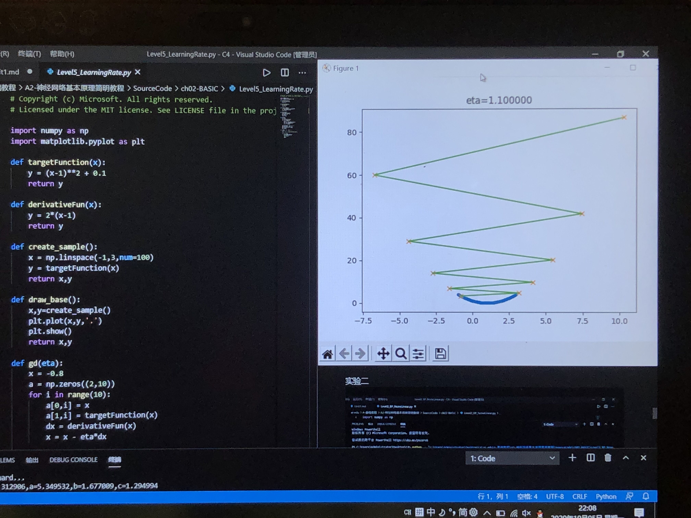
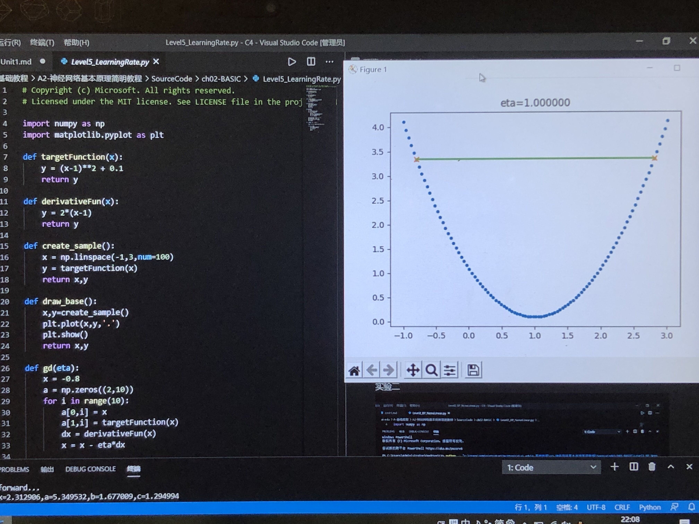
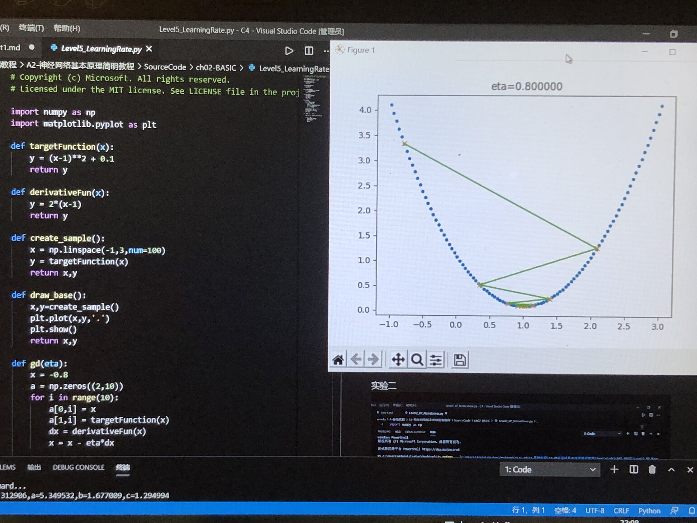
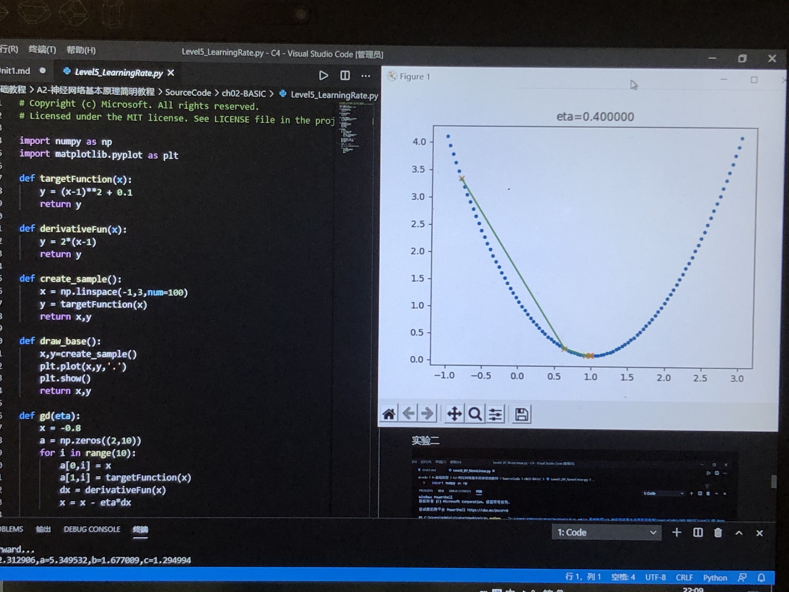
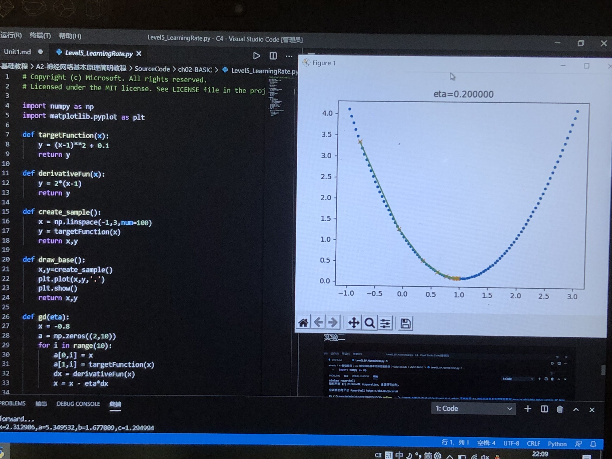
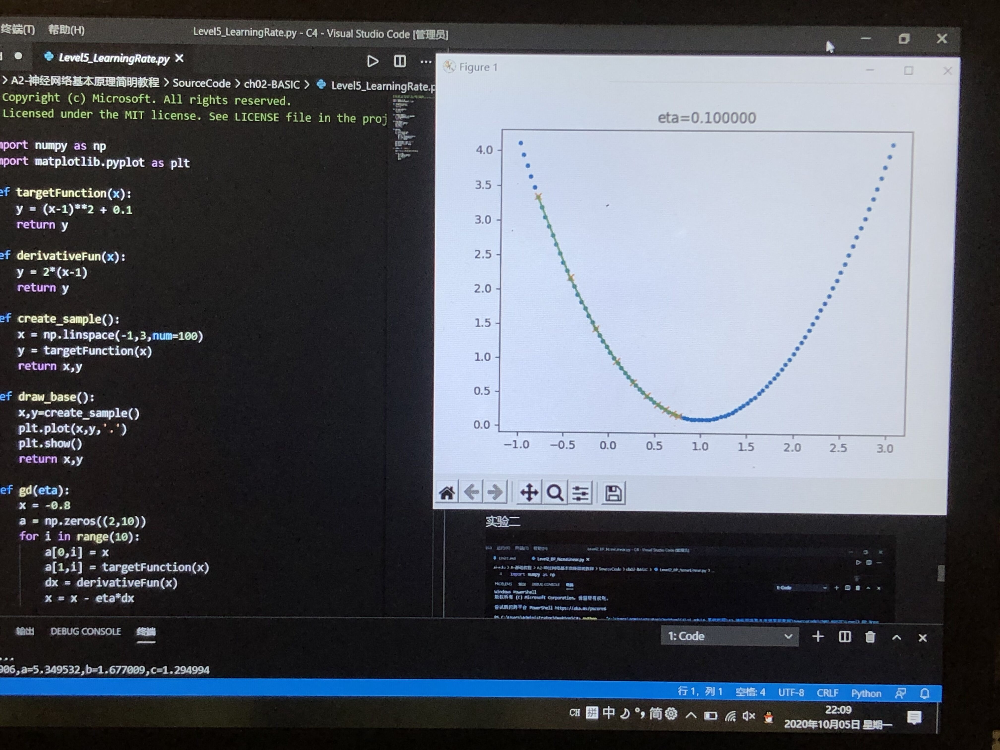

# 第一章 概论与基本概念
## 摘要

在概论与基本概念中，

1.介绍人工智能的发展简史、定义、以及科学范式的演化。
2.神经网络基本的训练和工作原理。
3.反向传播和梯度下降，①简单的线性方式（只有加法和乘法）。②分层的复杂（非线性）函数的反向传播，用数值代入方式手推反向过程。
梯度下降是神经网络的基本学习方法，用 单变量 和 双变量 两种方式说明。
4.损失函数，着重说明神经网络中的均方差损失函数（用于回归）和交叉熵损失函数（用于分类）。


## 1.0 人工智能发展简史

1950年，英国科学家艾伦图灵发表了论文讨论创造出具有真正智能的机器的可能性，并提出了著名的图灵测试：如果一台机器能够与人类展开对话而不能被辨别出其机器身份，那么称这台机器具有智能。现在活跃于电脑，手机，还有各种硬件上的“智能助手”在各自的功能领域，通常被大众认为挺有智能的。

## 1.1 人工智能的定义

#### 第一个层面，人们对人工智能的**期待**可以分为：

- **智能地把某件特定的事情做好，在某个领域增强人类的智慧，这种方式又叫做智能增强**
- **像人类一样能认知，思考，判断：模拟人类的智能**

#### 第二个层面，**从技术的特点来看**。

要实现某种狭义的人工智能，我们很自然地想到，如果我们能让运行程序的电脑来学习并自动掌握某些规律，那该多好啊，这就是“机器学习”。“机器学习”技术都有下面的共性：

> 如果一个程序解决任务（T）的效能（用P表示）随着经验（E）得到了提高，那么，这个程序就能从经验（E）中学到了关于任务（T）的知识，并让衡量值（P）得到提高。$^{[2]}$

1. 选择一个模型结构（例如逻辑回归，决策树等），这就是上面说的程序。
2. 用训练数据（输入和输出）输入模型。这就是上面的经验（E）。
3. 通过不断执行任务（T）并衡量结果（P），让P
不断提高，直到达到一个满意的值。

那么，机器学习的各种方法是如何从经验中学习呢？我们可以大致地分为下面三种类型：

1. 监督学习（Supervised Learning）

2. 无监督学习（Unsupervised Learning）

3. 强化学习（Reinforcement Learning）


如果某神经元的电位超过了一个阈值，那么它就会被激活（兴奋），向其他神经元发送化学物质。把许多这样的神经元按照一定的层次结构连接起来，我们就构建了一个神经网络$^{[3]}$。图1-4是M-P神经元模型的示意图。


图1-4 M-P神经元模型

随着人们不断的调整网络结构，DNN也演变成许多不同的网络拓扑结构，例如CNN（卷积神经网络），RNN（循环神经网络），LSTM（长期短期记忆），GAN（生成对抗网络），Transfer Learning（迁移学习）等。


## 1.2 范式的演化

图1-8是Jim Gray著作中的插图，概述了范式演化的几个阶段，接下来我们将一一进行介绍。


图1-8 Jim Gray著作中总结的范式演化的几个阶段

### 1.2.1 范式演化的四个阶段

#### 第一阶段：经验

#### 第二阶段：理论

#### 第三阶段：计算仿真

#### 第四阶段：数据探索


## 1.3神经网络的基本工作原理简介

### 1.3.1 神经元细胞的数学模型

神经网络由基本的神经元组成，图1-13就是一个神经元的数学/计算模型，便于我们用程序来实现。


图1-13 神经元计算模型

#### 输入 input

$(x_1,x_2,x_3)$ 是外界输入信号，一般是一个训练数据样本的多个属性。

#### 权重 weights

$(w_1,w_2,w_3)$ 是每个输入信号的权重值。

#### 偏移 bias

 $b$ 是偏移值，使得直线能够沿 $Y$ 轴上下移动。

#### 求和计算 sum

$$
\begin{aligned}
Z &= w_1 \cdot x_1 + w_2 \cdot x_2 + w_3 \cdot x_3 + b \\\\
&= \sum_{i=1}^m(w_i \cdot x_i) + b
\end{aligned}
$$

#### 激活函数 activation

$$A=\sigma{(Z)}$$

一般激活函数都是有一个渐变的过程，也就是说是个曲线，如图1-14所示。


图1-14 激活函数图像

至此，一个神经元的工作过程就在电光火石般的一瞬间结束了。

#### 小结

- 一个神经元可以有多个输入。
- 一个神经元只能有一个输出，这个输出可以同时输入给多个神经元。
- 一个神经元的 $w$ 的数量和输入的数量一致。
- 一个神经元只有一个 $b$。
- $w$ 和 $b$ 有人为的初始值，在训练过程中被不断修改。
- $A$ 可以等于 $Z$，即激活函数不是必须有的。
- 一层神经网络中的所有神经元的激活函数必须一致。

### 1.3.2 神经网络的训练过程

#### 单层神经网络模型

这是一个单层的神经网络，有 $m$ 个输入 (这里 $m=3$)，有 $n$ 个输出 (这里 $n=2$)。在神经网络中，$b$ 到每个神经元的权值来表示实际的偏移值，亦即 $(b_1,b_2)$，这样便于矩阵运算。也有些人把 $b$ 写成 $x_0$，其实是同一个效果，即把偏移值看做是神经元的一个输入。

- $(x_1,x_2,x_3)$ 是一个样本数据的三个特征值
- $(w_{11},w_{21},w_{31})$ 是 $(x_1,x_2,x_3)$ 到 $n1$ 的权重
- $(w_{12},w_{22},w_{32})$ 是 $(x_1,x_2,x_3)$ 到 $n2$ 的权重
- $b_1$ 是 $n1$ 的偏移
- $b_2$ 是 $n2$ 的偏移


图1-15 单层神经网络模型


#### 训练流程

从真正的“零”开始学习神经网络时，我没有看到过任何一个流程图来讲述训练过程，大神们写书或者博客时都忽略了这一点，图1-16是一个简单的流程图。


图1-16 神经网络训练流程图

#### 前提条件

 1. 已经有训练数据；
 2. 根据数据的规模、领域，建立了神经网络的基本结构；
 3. 定义好损失函数来合理地计算误差。

#### 步骤


1. 随机初始化权重矩阵，可以根据正态分布等来初始化。
2. 拿一个或一批数据作为输入，带入权重矩阵中计算，再通过激活函数传入下一层，最终得到预测值。
3. 拿到Id-1样本的真实值 $Y=3$；
4. 计算损失，假设用均方差函数 $Loss = (A-Y)^2=(5-3)^2=4$；
5. 根据数学公式（反向微分），把 $Loss=4$ 这个值影响 $A=5$ 这个值的每一个权重矩阵，然后对这些权重矩阵中的值做一个修改；
6. 用Id-2样本作为输入再次训练（Go to 2）；
7. 不断迭代下去，直到以下一个或几个条件满足就停止训练：损失函数值非常小；准确度满足了要求；迭代到了指定的次数。

训练完成后，我们会把这个神经网络中的结构和权重矩阵的值导出来，形成一个计算图（就是矩阵运算加上激活函数）模型，然后嵌入到任何可以识别/调用这个模型的应用程序中，根据输入的值进行运算，输出预测值。

### 1.3.3 神经网络中的矩阵运算

图1-17是一个两层的神经网络，包含隐藏层和输出层，输入层不算做一层。


图1-17 神经网络中的各种符号约定

$$
z1_1 = x_1 \cdot w1_{1,1}+ x_2 \cdot w1_{2,1}+b1_1
$$
$$
z1_2 = x_1 \cdot w1_{1,2}+ x_2 \cdot w1_{2,2}+b1_2
$$
$$
z1_3 = x_1 \cdot w1_{1,3}+ x_2 \cdot w1_{2,3}+b1_3
$$

变成矩阵运算：

$$
z1_1=
\begin{pmatrix}
x_1 & x_2
\end{pmatrix}
\begin{pmatrix}
w1_{1,1} \\\\
w1_{2,1}
\end{pmatrix}
+b1_1
$$

$$
z1_2=
\begin{pmatrix}
x_1 & x_2
\end{pmatrix}
\begin{pmatrix}
w1_{1,2} \\\\
w1_{2,2}
\end{pmatrix}
+b1_2
$$

$$
z1_3=
\begin{pmatrix}
x_1 & x_2
\end{pmatrix}
\begin{pmatrix}
w1_{1,3} \\\\
w1_{2,3}
\end{pmatrix}
+b1_3
$$

再变成大矩阵：

$$
Z1 =
\begin{pmatrix}
x_1 & x_2 
\end{pmatrix}
\begin{pmatrix}
w1_{1,1}&w1_{1,2}&w1_{1,3} \\\\
w1_{2,1}&w1_{2,2}&w1_{2,3} \\\\
\end{pmatrix}
+\begin{pmatrix}
b1_1 & b1_2 & b1_3
\end{pmatrix}
$$

最后变成矩阵符号：

$$Z1 = X \cdot W1 + B1$$

然后是激活函数运算：

$$A1=a(Z1)$$

同理可得：

$$Z2 = A1 \cdot W2 + B2$$

注意：损失函数不是前向计算的一部分。

### 1.3.4 神经网络的主要功能

#### 回归（Regression）或者叫做拟合（Fitting）

#### 分类（Classification）


# 第2章 神经网络中的三个基本概念

## 2.0 三大概念

三大概念：反向传播，梯度下降，损失函数。

### 反向传播与梯度下降的基本工作原理：

1. 初始化；
2. 正向计算；
3. 损失函数为我们提供了计算损失的方法；
4. 梯度下降是在损失函数基础上向着损失最小的点靠近而指引了网络权重调整的方向；
5. 反向传播把损失值反向传给神经网络的每一层，让每一层都根据损失值反向调整权重；
6. Go to 2，直到精度足够好（比如损失函数值小于 $0.001$）。

## 2.1 线性反向传播

### 2.1.1 正向计算的实例

假设有一个函数：

$$z = x \cdot y \tag{1}$$

其中:

$$x = 2w + 3b \tag{2}$$

$$y = 2b + 1 \tag{3}$$

计算图如图2-4。


图2-4 简单线性计算的计算图

注意 $x,y,z$ 是中间计算结果；$w,b$ 是变量。要最终求解的目标是 $w$ 和 $b$ 的值。

当 $w = 3, b = 4$ 时，会得到图2-5的结果。


图2-5 计算结果

最终的 $z$ 值，受到了前面因素的影响：变量 $w$，变量 $b$，计算式 $x$，计算式 $y$。

### 2.1.2 反向传播求解 $w$

#### 求 $w$ 的偏导

从 $z$ 开始一层一层向回看，图中各节点关于变量 $w$ 的偏导计算结果如下：

因为 $$z = x \cdot y$$，其中 $$x = 2w + 3b, y = 2b + 1$$

$$\frac{\partial{z}}{\partial{w}}=\frac{\partial{z}}{\partial{x}} \cdot \frac{\partial{x}}{\partial{w}}=y \cdot 2=18 \tag{4}$$

其中：

$$\frac{\partial{z}}{\partial{x}}=\frac{\partial{}}{\partial{x}}(x \cdot y)=y=9$$

$$\frac{\partial{x}}{\partial{w}}=\frac{\partial{}}{\partial{w}}(2w+3b)=2$$


图2-6 对 $w$ 的偏导求解过程

根据公式1、2、3：

$$z=x \cdot y=(2w+3b)(2b+1)=4wb+2w+6b^2+3b \tag{5}$$

对上式求 $w$ 的偏导：

$$
\frac{\partial z}{\partial w}=4b+2=4 \cdot 4 + 2=18 \tag{6}
$$

#### 求 $w$ 的具体变化值

公式4和公式6的含义：当 $w$ 变化一点点时，$z$ ，产生 $w$ 的变化值18倍的变化。目标是让 $z=150$，初始状态时是 $z=162$，所以：当需要 $z$ 从 $162$ 变到 $150$ 时，$w$ 需要变化多少？

$$
\Delta z = 18 \cdot \Delta w
$$

则：

$$
\Delta w = {\Delta z \over 18}=\frac{162-150}{18}= 0.6667
$$

所以：

$$w = w - 0.6667=2.3333$$
$$x=2w+3b=16.6667$$
$$z=x \cdot y=16.6667 \times 9=150.0003$$

### 2.1.3 反向传播求解 $b$

#### 求 $b$ 的偏导

这次我们令 $w$ 的值固定为 $3$，变化 $b$ 的值，目标还是让 $z=150$。同上一小节一样，先求 $b$ 的偏导数。

注意，在上一小节中，求 $w$ 的导数只经过了一条路：从 $z$ 到 $x$ 到 $w$。但是求 $b$ 的导数时要经过两条路，如图2-7所示：

1. 从 $z$ 到 $x$ 到 $b$；
2. 从 $z$ 到 $y$ 到 $b$。


图2-7 对b的偏导求解过程

从复合导数公式来看，这两者应该是相加的关系，所以有：

$$\frac{\partial{z}}{\partial{b}}=\frac{\partial{z}}{\partial{x}} \cdot \frac{\partial{x}}{\partial{b}}+\frac{\partial{z}}{\partial{y}}\cdot\frac{\partial{y}}{\partial{b}}=y \cdot 3+x \cdot 2=63 \tag{7}$$

其中：

$$\frac{\partial{z}}{\partial{x}}=\frac{\partial{}}{\partial{x}}(x \cdot y)=y=9$$
$$\frac{\partial{z}}{\partial{y}}=\frac{\partial{}}{\partial{y}}(x \cdot y)=x=18$$
$$\frac{\partial{x}}{\partial{b}}=\frac{\partial{}}{\partial{b}}(2w+3b)=3$$
$$\frac{\partial{y}}{\partial{b}}=\frac{\partial{}}{\partial{b}}(2b+1)=2$$

把公式5拿过来：

$$z=x \cdot y=(2w+3b)(2b+1)=4wb+2w+6b^2+3b \tag{5}$$

对上式求b的偏导：

$$
\frac{\partial z}{\partial b}=4w+12b+3=12+48+3=63 \tag{8}
$$

#### 求 $b$ 的具体变化值

公式7和公式8的含义是：当 $b$ 变化一点点时，$z$ 会发生 $b$ 的变化值 $63$ 倍的变化。记住我们的目标是让 $z=150$，目前在初始状态时是 $162$，所以，问题转化为：当我们需要 $z$ 从 $162$ 变到 $150$ 时，$b$ 需要变化多少？

既然：

$$\Delta z = 63 \cdot \Delta b$$

则：

$$
\Delta b = \frac{\Delta z}{63}=\frac{162-150}{63}=0.1905
$$

所以：
$$
b=b-0.1905=3.8095
$$
$$x=2w+3b=17.4285$$
$$y=2b+1=8.619$$
$$z=x \cdot y=17.4285 \times 8.619=150.2162$$

这个结果也是与 $150$ 很接近了，但是精度还不够。再迭代几次，直到误差不大于 `1e-4` 时，我们就可以结束迭代了，对于计算机来说，这些运算的执行速度很快。

#### 手动继续迭代两次，误差的精度可以达到多少？

这个问题用数学公式倒推求解一个二次方程，就能直接得到准确的b值。

### 2.1.4 同时求解 $w$ 和 $b$ 的变化值
同时改变 $w$ 和 $b$，到达最终结果为 $z=150$ 的目的。

已知 $\Delta z=12$，我们不妨把这个误差的一半算在 $w$ 的账上，另外一半算在 $b$ 的账上：

$$\Delta b=\frac{\Delta z / 2}{63} = \frac{12/2}{63}=0.095$$

$$\Delta w=\frac{\Delta z / 2}{18} = \frac{12/2}{18}=0.333$$

- $w = w-\Delta w=3-0.333=2.667$
- $b = b - \Delta b=4-0.095=3.905$
- $x=2w+3b=2 \times 2.667+3 \times 3.905=17.049$
- $y=2b+1=2 \times 3.905+1=8.81$
- $z=x \times y=17.049 \times 8.81=150.2$

#### 用Python代码实现以上双变量的反向传播计算过程

容易出现的问题：

1. 在检查 $\Delta z$ 时的值时，注意要用绝对值，因为有可能是个负数
2. 在计算 $\Delta b$ 和 $\Delta w$ 时，第一次时，它们对 $z$ 的贡献值分别是 $1/63$ 和 $1/18$，但是第二次时，由于 $b,w$ 值的变化，对 $z$ 的贡献值也会有微小变化，所以要重新计算。具体解释如下：


## 2.2 非线性反向传播

### 2.2.1 提出问题


图2-8 非线性的反向传播

其中$1<x<=10,0<y<2.15$。假设有5个人分别代表 $x,a,b,c,y$：

#### 正向过程

1. 第1个人，输入层，随机输入第一个 $x$ 值，$x$ 的取值范围 $(1,10]$，假设第一个数是 $2$；
2. 第2个人，第一层网络计算，接收第1个人传入 $x$ 的值，计算：$a=x^2$；
3. 第3个人，第二层网络计算，接收第2个人传入 $a$ 的值，计算：$b=\ln (a)$；
4. 第4个人，第三层网络计算，接收第3个人传入 $b$ 的值，计算：$c=\sqrt{b}$；
5. 第5个人，输出层，接收第4个人传入 $c$ 的值

#### 反向过程

6. 第5个人，计算 $y$ 与 $c$ 的差值：$\Delta c = c - y$，传回给第4个人
7. 第4个人，接收第5个人传回$\Delta c$，计算 $\Delta b = \Delta c \cdot 2\sqrt{b}$
8. 第3个人，接收第4个人传回$\Delta b$，计算 $\Delta a = \Delta b \cdot a$
9. 第2个人，接收第3个人传回$\Delta a$，计算 $\Delta x = \frac{\Delta}{2x}$
10. 第1个人，接收第2个人传回$\Delta x$，更新 $x \leftarrow x - \Delta x$，回到第1步

提出问题：假设我们想最后得到 $c=2.13$ 的值，$x$ 应该是多少？（误差小于 $0.001$ 即可）

### 2.2.2 数学解析解

$$c=\sqrt{b}=\sqrt{\ln(a)}=\sqrt{\ln(x^2)}=2.13$$
$$x = 9.6653$$

### 2.2.3 梯度迭代解

$$
\frac{da}{dx}=\frac{d(x^2)}{dx}=2x=\frac{\Delta a}{\Delta x} \tag{1}
$$
$$
\frac{db}{da} =\frac{d(\ln{a})}{da} =\frac{1}{a} = \frac{\Delta b}{\Delta a} \tag{2}
$$
$$
\frac{dc}{db}=\frac{d(\sqrt{b})}{db}=\frac{1}{2\sqrt{b}}=\frac{\Delta c}{\Delta b} \tag{3}
$$
因此得到如下一组公式，可以把最后一层 $\Delta c$ 的误差一直反向传播给最前面的 $\Delta x$，从而更新 $x$ 值：
$$
\Delta c = c - y \tag{4}
$$
$$
\Delta b = \Delta c \cdot 2\sqrt{b}  \tag{根据式3}
$$
$$
\Delta a = \Delta b \cdot a  \tag{根据式2}
$$
$$
\Delta x = \Delta a / 2x \tag{根据式1}
$$

我们给定初始值 $x=2$，$\Delta x=0$，依次计算结果如表2-2。

表2-2 正向与反向的迭代计算

|方向|公式|迭代1|迭代2|迭代3|迭代4|迭代5|
|---|---|---|---|---|---|---|
|正向|$x=x-\Delta x$|2|4.243|7.344|9.295|9.665|
|正向|$a=x^2$|4|18.005|53.934|86.404|93.233|
|正向|$b=\ln(a)$|1.386|2.891|3.988|4.459|4.535|
|正向|$c=\sqrt{b}$|1.177|1.700|1.997|2.112|2.129|
||标签值y|2.13|2.13|2.13|2.13|2.13|
|反向|$\Delta c = c - y$|-0.953|-0.430|-0.133|-0.018||
|反向|$\Delta b = \Delta c \cdot 2\sqrt{b}$|-2.243|-1.462|-0.531|-0.078||
|反向|$\Delta a = \Delta b \cdot a$|-8.973|-26.317|-28.662|-6.698||
|反向|$\Delta x = \Delta a / 2x$|-2.243|-3.101|-1.951|-0.360||

表2-2，先看“迭代-1”列，从上到下是一个完整的正向+反向的过程，最后一行是 $-2.243$，回到“迭代-2”列的第一行，$2-(-2.243)=4.243$，然后继续向下。到第5轮时，正向计算得到的 $c=2.129$，非常接近 $2.13$ 了，迭代结束。

## 2.3 梯度下降

### 2.3.1 梯度下降的数学理解

梯度下降的数学公式：

$$\theta_{n+1} = \theta_{n} - \eta \cdot \nabla J(\theta) \tag{1}$$

其中：

- $\theta_{n+1}$：下一个值；
- $\theta_n$：当前值；
- $-$：减号，梯度的反向；
- $\eta$：学习率或步长，控制每一步走的距离，不要太快以免错过了最佳景点，不要太慢以免时间太长；
- $\nabla$：梯度，函数当前位置的最快上升点；
- $J(\theta)$：函数。

#### 梯度下降的三要素

1. 当前点；
2. 方向；
3. 步长。

#### 梯度下降的含义？

1. 梯度：函数当前位置的最快上升点；
2. 下降：与导数相反的方向，用数学语言描述就是那个减号。

亦即与上升相反的方向运动，就是下降。


图2-9 梯度下降的步骤

图2-9解释了在函数极值点的两侧做梯度下降的计算过程，梯度下降的目的就是使得x值向极值点逼近。

### 2.3.3 单变量函数的梯度下降

假设一个单变量函数：

$$J(x) = x ^2$$

我们的目的是找到该函数的最小值，于是计算其微分：

$$J'(x) = 2x$$

假设初始位置为：

$$x_0=1.2$$

假设学习率：

$$\eta = 0.3$$

根据公式(1)，迭代公式：

$$x_{n+1} = x_{n} - \eta \cdot \nabla J(x)= x_{n} - \eta \cdot 2x$$

假设终止条件为 $J(x)<0.01$，迭代过程是：
```
x=0.480000, y=0.230400
x=0.192000, y=0.036864
x=0.076800, y=0.005898
x=0.030720, y=0.000944
```

上面的过程如图2-10所示。


图2-10 使用梯度下降法迭代的过程

### 2.3.4 双变量的梯度下降

假设一个双变量函数：

$$J(x,y) = x^2 + \sin^2(y)$$

我们的目的是找到该函数的最小值，于是计算其微分：

$${\partial{J(x,y)} \over \partial{x}} = 2x$$
$${\partial{J(x,y)} \over \partial{y}} = 2 \sin y \cos y$$

假设初始位置为：

$$(x_0,y_0)=(3,1)$$

假设学习率：

$$\eta = 0.1$$

根据公式(1)，迭代过程是的计算公式：
$$(x_{n+1},y_{n+1}) = (x_n,y_n) - \eta \cdot \nabla J(x,y)$$
$$ = (x_n,y_n) - \eta \cdot (2x,2 \cdot \sin y \cdot \cos y) \tag{1}$$

根据公式(1)，假设终止条件为 $J(x,y)<0.01$，迭代过程如表2-3所示。

表2-3 双变量梯度下降的迭代过程

|迭代次数|x|y|J(x,y)|
|---|---|---|---|
|1|3|1|9.708073|
|2|2.4|0.909070|6.382415|
|...|...|...|...|
|15|0.105553|0.063481|0.015166|
|16|0.084442|0.050819|0.009711|

迭代16次后，$J(x,y)$ 的值为 $0.009711$，满足小于 $0.01$ 的条件，停止迭代。

上面的过程如表2-4所示，由于是双变量，所以需要用三维图来解释。请注意看两张图中间那条隐隐的黑色线，表示梯度下降的过程，从红色的高地一直沿着坡度向下走，直到蓝色的洼地。

表2-4 在三维空间内的梯度下降过程

|观察角度1|观察角度2|
|--|--|
|||

### 2.3.5 学习率η的选择

在公式表达时，学习率被表示为$\eta$。在代码里，我们把学习率定义为`learning_rate`，或者`eta`。针对上面的例子，试验不同的学习率对迭代情况的影响，如表2-5所示。

表2-5 不同学习率对迭代情况的影响

|学习率|迭代路线图|说明|
|---|---|---|
|1.0||学习率太大，迭代的情况很糟糕，在一条水平线上跳来跳去，永远也不能下降。|
|0.8||学习率大，会有这种左右跳跃的情况发生，这不利于神经网络的训练。|
|0.4||学习率合适，损失值会从单侧下降，4步以后基本接近了理想值。|
|0.1||学习率较小，损失值会从单侧下降，但下降速度非常慢，10步了还没有到达理想状态。|


# 第3章 损失函数

## 3.0 损失函数概论

### 3.0.1 概念

“损失”就是所有样本的“误差”的总和，亦即（$m$ 为样本数）：

$$损失 = \sum^m_{i=1}误差_i$$

$$J = \sum_{i=1}^m loss_i$$

#### 损失函数的作用

损失函数的作用，就是计算神经网络每次迭代的前向计算结果与真实值的差距，从而指导下一步的训练向正确的方向进行。

使用损失函数的具体步骤：

1. 用随机值初始化前向计算公式的参数；
2. 代入样本，计算输出的预测值；
3. 用损失函数计算预测值和标签值（真实值）的误差；
4. 根据损失函数的导数，沿梯度最小方向将误差回传，修正前向计算公式中的各个权重值；
5. 进入第2步重复, 直到损失函数值达到一个满意的值就停止迭代。

### 3.0.2 机器学习常用损失函数

符号规则：$a$ 是预测值，$y$ 是样本标签值，$loss$ 是损失函数值。

- Gold Standard Loss，又称0-1误差
$$
loss=\begin{cases}
0 & a=y \\\\
1 & a \ne y 
\end{cases}
$$

- 绝对值损失函数

$$
loss = |y-a|
$$

- Hinge Loss，铰链/折页损失函数或最大边界损失函数，主要用于SVM（支持向量机）中

$$
loss=\max(0,1-y \cdot a) \qquad y=\pm 1
$$

- Log Loss，对数损失函数，又叫交叉熵损失函数(cross entropy error)

$$
loss = -[y \cdot \ln (a) + (1-y) \cdot \ln (1-a)]  \qquad y \in \\{ 0,1 \\} 
$$

- Squared Loss，均方差损失函数
$$
loss=(a-y)^2
$$

- Exponential Loss，指数损失函数
$$
loss = e^{-(y \cdot a)}
$$

### 3.0.3 神经网络中常用的损失函数

- 均方差函数，主要用于回归

- 交叉熵函数，主要用于分类

二者都是非负函数，极值在底部，用梯度下降法可以求解。


## 3.1 均方差函数

MSE - Mean Square Error。

均方差函数常用于线性回归(linear regression)，即函数拟合(function fitting)。公式如下：

$$
loss = {1 \over 2}(z-y)^2 \tag{单样本}
$$

$$
J=\frac{1}{2m} \sum_{i=1}^m (z_i-y_i)^2 \tag{多样本}
$$

## 3.2 交叉熵损失函数

交叉熵（Cross Entropy）是表示两个概率分布 $p,q$ 的差异，其中 $p$ 表示真实分布，$q$ 表示预测分布，那么 $H(p,q)$ 就称为交叉熵：

$$H(p,q)=\sum_i p_i \cdot \ln {1 \over q_i} = - \sum_i p_i \ln q_i \tag{1}$$

交叉熵可在神经网络中作为损失函数，$p$ 表示真实标记的分布，$q$ 则为训练后的模型的预测标记分布，交叉熵损失函数可以衡量 $p$ 与 $q$ 的相似性。

**交叉熵函数常用于逻辑回归(logistic regression)，也就是分类(classification)。**


#### 熵

$$H(p) = - \sum_j^n p(x_j) \ln (p(x_j)) \tag{3}$$

则上面的问题的熵是：

$$
\begin{aligned}  
H(p)&=-[p(x_1) \ln p(x_1) + p(x_2) \ln p(x_2) + p(x_3) \ln p(x_3)] \\\\
&=0.7 \times 0.36 + 0.2 \times 1.61 + 0.1 \times 2.30 \\\\
&=0.804
\end{aligned}
$$

#### 相对熵(KL散度)

KL散度的计算公式：

$$D_{KL}(p||q)=\sum_{j=1}^n p(x_j) \ln{p(x_j) \over q(x_j)} \tag{4}$$

#### 交叉熵

$$
\begin{aligned}  
D_{KL}(p||q)&=\sum_{j=1}^n p(x_j) \ln{p(x_j)} - \sum_{j=1}^n p(x_j) \ln q(x_j) \\\\
&=- H(p(x)) + H(p,q) 
\end{aligned}
\tag{5}
$$

等式的前一部分恰巧就是 $p$ 的熵，等式的后一部分，就是交叉熵：

$$H(p,q) =- \sum_{j=1}^n p(x_j) \ln q(x_j) \tag{6}$$

$$loss =- \sum_{j=1}^n y_j \ln a_j \tag{7}$$

公式7是单个样本的情况，$n$ 并不是样本个数，而是分类个数。所以，对于批量样本的交叉熵计算公式是：

$$J =- \sum_{i=1}^m \sum_{j=1}^n y_{ij} \ln a_{ij} \tag{8}$$

$m$ 是样本数，$n$ 是分类数。

交叉熵可以简化为：

$$loss =-[y \ln a + (1-y) \ln (1-a)] \tag{9}$$

二分类对于批量样本的交叉熵计算公式是：

$$J= - \sum_{i=1}^m [y_i \ln a_i + (1-y_i) \ln (1-a_i)] \tag{10}$$


### 3.2.2 为什么不能使用均方差做为分类问题的损失函数？

1. 回归问题通常用均方差损失函数，可以保证损失函数是个凸函数，即可以得到最优解。而分类问题如果用均方差的话，损失函数的表现不是凸函数，就很难得到最优解。而交叉熵函数可以保证区间内单调。

2. 分类问题的最后一层网络，需要分类函数，Sigmoid或者Softmax，如果再接均方差函数的话，其求导结果复杂，运算量比较大。用交叉熵函数的话，可以得到比较简单的计算结果，一个简单的减法就可以得到反向误差。


## 实验截图
实验一


实验二


实验三


实验四


实验五








## 学习心得
通过对人工智能前三章内容的学习，使我对人工智能的起源、兴起及发展；神经网络的定义与主要功能；反向传播与梯度下降的工作原理；线性与非线性反向传播以及损失函数的分类与性质有了更深入的了解。结合此前学习的高等数学以及高级程序语言设计等课程所学的知识，让我对人工智能这门全新的、新兴的课程有学习的兴趣。