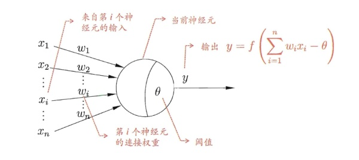
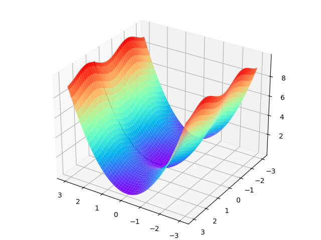

201809058  Wang Yulong

**1.人工智能** 

=======
**1.1 定义：** 如果程序解某种任务T的效果P随着经验E的增加而得到了提高，
那么这个程序就能从经验E中学到了关于任务T的知识，并让效果P得到提高。

1.2 **机器学习的具体过程:**
-------
·选择一个模型结构（例如逻辑回归、决策树等），构建上文中的程序

·将训练数据（包含输入和输出）输入模型中，不断学习，得到经验E

·通过不断执行任务T并衡量效果P，让P不断提高，直到达到一个满意的值

1.3 BP神经元模型
----------------
&emsp;&emsp;在生物神经网络中，每个神经元与其他神经元相连，当它兴奋时，就会像相邻的神经元发送化学物质，从而改变这些神经元内的电位；如果某神经元的电位超过了一个阈值，那么它就会被激活（兴奋），向其他神经元发送化学物质。把许多这样的神经元按照一定的层次结构连接起来，我们就构建了一个神经网络。

**BP神经元结构图**

---
#  
**2.神经元的基本训练**

**基本思想：**首先人为设定一个初始值a【初始化】=>观察初始值a和训练集中y值的偏差【找偏差】=>修改方案，力求机器的值和真实值y的偏差越来越小，直至在误差允许范围内【机器学习】

## 2.1概念梳理

### 反向传播
定义：将输出值反馈到输入.

### 梯度下降
定义：根据损失函数的值，调整机器学习的策略，从而接近真实值.

### 损失函数
定义：机器算出的值与真实值之间的误差.

假设有一个黑盒子如图2-1

我们只能看到输入和输出的数值，看不到里面的样子，当输入1时，输出2.334，然后黑盒子有个信息显示：我需要输出值是4。然后我们试了试输入2，结果输出5.332，一下子比4大了很多。那么我们第一次的损失值是 $2.334-4=-1.666$，而二次的损失值是 $5.332-4=1.332$。

这里，我们的损失函数就是一个简单的减法，用实际值减去目标值，但是它可以传递两个信息：

 ▲ 方向，是大了还是小了；

 ▲ 差值，是0.1还是1.1。这样就给了我们下一次猜的依据。

- 目的：猜到一个输入值，使得黑盒子的输出是4；
- 初始化：输入1；
- 前向计算：黑盒子内部的数学逻辑；
- 损失函数：在输出端，用输出值减4；
- 反向传播：告诉猜数的人差值，包括正负号和值；
- 梯度下降：在输入端，根据正负号和值，确定下一次的猜测值。

## 2.2 代码分析
~~~Python
线性反向传播---Python
import numpy as np

def target_function(w,b):
    x = 2*w+3*b
    y=2*b+1
    z=x*y
    return x,y,z

def single_variable(w,b,t):
    print("\nsingle variable: b ----- ")
    error = 1e-5
    while(True):
        x,y,z = target_function(w,b)
        delta_z = z - t
        print("w=%f,b=%f,z=%f,delta_z=%f"%(w,b,z,delta_z))
        if abs(delta_z) < error:
            break
        delta_b = delta_z /63
        print("delta_b=%f"%delta_b)
        b = b - delta_b

    print("done!")
    print("final b=%f"%b)

    if __name__ == '__main__':
    w = 3
    b = 4
    t = 150
    single_variable(w,b,t)
~~~
~~~Python
测试结果：

single variable: b ----- 
w=3.000000,b=4.000000,z=162.000000,delta_z=12.000000
delta_b=0.190476
w=3.000000,b=3.809524,z=150.217687,delta_z=0.217687 
delta_b=0.003455
w=3.000000,b=3.806068,z=150.007970,delta_z=0.007970 
delta_b=0.000127
w=3.000000,b=3.805942,z=150.000294,delta_z=0.000294
delta_b=0.000005
w=3.000000,b=3.805937,z=150.000011,delta_z=0.000011
delta_b=0.000000
w=3.000000,b=3.805937,z=150.000000,delta_z=0.000000
done!
final b=3.805937
~~~
$$此为线性反向传播的代码实例，w=3,b=4,t=150,目的是将z值变为目标值t，方法即为在不改变w的前提下，通过改变b值从$$
$$而达到改变w值的目标,在这个过程中就需要使用偏导数$$
$$   x = 2*w+3*b $$
$$   y=2*b+1   $$  
$$   z=x*y     $$
$$代入计算得：z=162$$
$$\frac{\partial{Z}}{\partial{b}} =\frac{\partial{Z}}{\partial{x}}·\frac{\partial{x}}{\partial{b}}+\frac{\partial{Z}}{\partial{y}}·\frac{\partial{y}}{\partial{b}}$$
$$ \frac{\partial{Z}}{\partial{b}} =y·3+x·2=9·3+18·2=63$$
$$\frac{\partial{Z}}{\partial{b}} =\frac{▲Z}{▲b}=63$$
$$▲Z=162-150=12$$
$$\frac{▲Z}{▲b}=63=\frac{12}{▲b}$$
$$▲b=\frac{12}{63}=0.190476  \tag{误差函数}$$
正向计算：
$$第一次迭代：b_1=b-▲b=3.809524  \tag{梯度下降}$$
$$x_1=2w+3b_1=2×3+3×3.809524=17.428572$$
$$y_1 = 2 b_1 + 1 = 2 × 3.809524 + 1 = 8.619048$$
$$z_1 = x_1 × y_1 = 17.43 × 8.62 = 150.217687$$
$$▲b_1=\frac{150.217687-150}{63}=0.003455$$
$$第二次迭代：b_2=b_1-▲b_1=3.806068$$
$$x_2=2w+3b_2=2×3+3×3.806068=17.418204$$
$$y_2 = 2 b_2 + 1 = 2 × 3.806068 + 1 = 8.612136$$
$$z_2=x_2 × y_2=150.0079$$
$$.................$$
$$共经过5次迭代计算即可达到误差允许范围$$

#### 梯度下降
$$数学公式：θ_{n+1}=θ_n+η▼J(θ_n)$$
$$ 学习率η,偏导数▼J(θ_n)$$
$$假设一个单变量的函数J(θ)=θ^2$$
$$函数的微分J'(θ)=2θ$$
$$设置起点θ_0=1.2，学习率η=0.3$$
$$θ_1=θ_0-2ηθ_0=0.48$$
$$θ_2=θ_1-2ηθ_1=0.192$$
$$θ_3=θ_2-2ηθ_2=0.0768$$

橙色折线则代表梯度方向的下降过程

如图为双变量函数的梯度下降过程

&emsp;&emsp;下降的过程中，如线条所示，沿坡度的方向，曲线从红色高地下降至蓝色洼地中,可以看出坡度方向是函数变化最快的方向.
表2-5 不同学习率对迭代情况的影响

|学习率|迭代路线图|说明|
|---|---|---|
|1.0||学习率太大，迭代的情况很糟糕，在一条水平线上跳来跳去，永远也不能下降。|
|0.8||学习率大，会有这种左右跳跃的情况发生，这不利于神经网络的训练。|
|0.4||学习率合适，损失值会从单侧下降，四步以后基本接近了理想值。|
|0.1||学习率较小，损失值会从单侧下降，但下降速度非常慢，十步了还没有到达理想状态。|

---
#  
**3.损失函数概论**

$$损失--所有样本的误差总和$$
$$J = \sum_{i=1}^mloss_i$$

## 3.1 损失函数使用步骤
- 用随机值初始化前向计算公式的参数
- 代入样本，计算输出的预测值
- 用损失函数计算预测值和标签值（真实值）的误差
- 根据损失函数的导数，沿梯度最小方向将误差回传，修正前向计算公式中的各个权重值
- 重复步骤2，直到损失函数值达到一个满意的值就停止迭代

## 3.2 机器学习常用的损失函数
符号规则：$a$ 是预测值，$y$ 是样本标签值，$loss$ 是损失函数值。

- Gold Standard Loss，又称0-1误差
$$
loss=\begin{cases}
0 & a=y \\\\
1 & a \ne y 
\end{cases}
$$

- 绝对值损失函数

$$
loss = |y-a|
$$

- Hinge Loss，铰链/折页损失函数或最大边界损失函数，主要用于SVM（支持向量机）中
$$
loss = -[y \cdot \ln (a) + (1-y) \cdot \ln (1-a)]  $$
$$ \qquad y \in{ (0,1)}$$ 

- Squared Loss，均方差损失函数
$$
loss=(a-y)^2
$$

- Exponential Loss，指数损失函数
$$
loss = e^{-(y \cdot a)}
$$

神经网络中常用的损失函数

- 均方差函数，主要用于回归

- 交叉熵函数，主要用于分类

## 3.3 均方差函数

- 为了得到预测值 $a$ 与真实值 $y$ 的差距，最朴素的想法就是用 $Error=a_i-y_i$，但如果遇到大量数据，误差有正负之分，累加之后可能相互抵消，误差的累加就失去了价值

图3-4中，前三张显示了一个逐渐找到最佳拟合直线的过程。

- 第一张，用均方差函数计算得到 $Loss=0.53$；
- 第二张，直线向上平移一些，误差计算 $Loss=0.16$，比图一的误差小很多；
- 第三张，又向上平移了一些，误差计算 $Loss=0.048$，此后还可以继续尝试平移（改变 $b$ 值）或者变换角度（改变 $w$ 值），得到更小的损失函数值；
- 第四张，偏离了最佳位置，误差值 $Loss=0.18$，这种情况，算法会让尝试方向反向向下。

图3-4 损失函数值与直线位置的关系

## 3.4 交叉熵函数

交叉熵（Cross Entropy）是Shannon信息论中一个重要概念，主要用于度量两个概率分布间的差异性信息。在信息论中，交叉熵是表示两个概率分布 $p,q$ 的差异，其中 $p$ 表示真实分布，$q$ 表示预测分布，那么 $H(p,q)$ 就称为交叉熵：

$$H(p,q)=\sum_i p_i \cdot \ln {1 \over q_i} = - \sum_i p_i \ln q_i \tag{1}$$

假设学习某门课程有三种可能的情况发生，如表3-2所示。

表3-2 三种事件的概论和信息量

|事件编号|事件|概率 $p$|信息量 $I$|
|---|---|---|---|
|$x_1$|优秀|$p=0.7$|$I=-\ln(0.7)=0.36$|
|$x_2$|及格|$p=0.2$|$I=-\ln(0.2)=1.61$|
|$x_3$|不及格|$p=0.1$|$I=-\ln(0.1)=2.30$|

$x_j$：表示一个事件

$p(x_j)$：表示 $x_j$ 发生的概率

$I(x_j)$：信息量，$x_j$ 越不可能发生时，它一旦发生后的信息量就越大
$$I(x_j) = -\ln (p(x_j)) \tag{2}$$

从上表可知，信息量$I(x_j)$和概率$p$是成反比的，即$I(x_j)$的值越大，$p$的值越小，事件发生的概率越小。

---
#  
**4.学习总结及心得**

## 总结

&emsp;&emsp;**通过对step1的内容学习，我理解的人工智能的本质就在于给机器赋予人的思维，但是由于人的思维很复杂需要考虑的因素很多，由人在思考转移到机器判断的这个过程中间需要机器大量尝试，反复试错，通过比较输出值与理想值的差距，反馈回去，从而调整各个部分的权重，使得输出值与理想值在误差允许范围内的过程称之为“机器学习”，学习的次数越多，对人类遇到同等事件时做出的判断就会越接近，即达到人工智能的效果。**

&emsp;&emsp;均方差函数和交叉熵函数都是为了便于统计神经网络学习中产生误差的两种方法，都能够运用公式计算出具体数值，均方差则是通过计算拟合出相应的图像，能够预测事件的发展趋势；交叉熵则是计算损失函数的数值（信息量），通过比较数值的大小判断事件发生的可能性。
