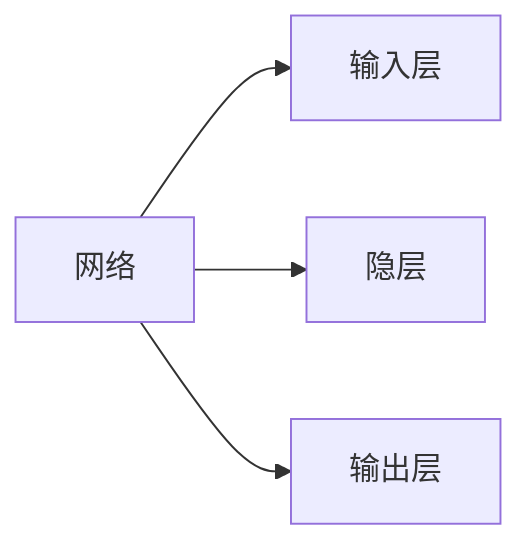
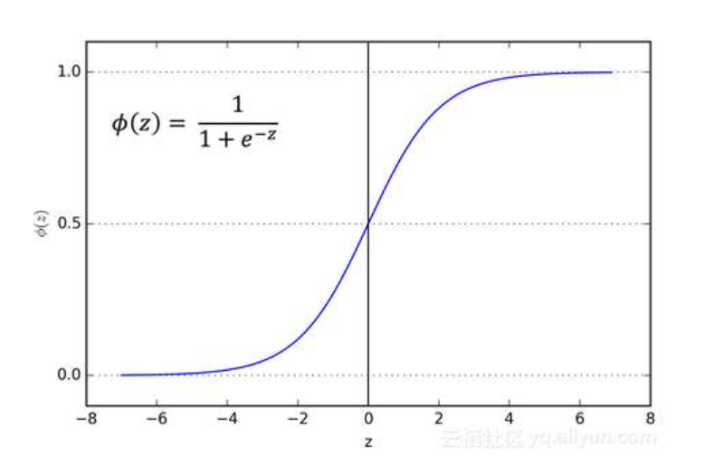
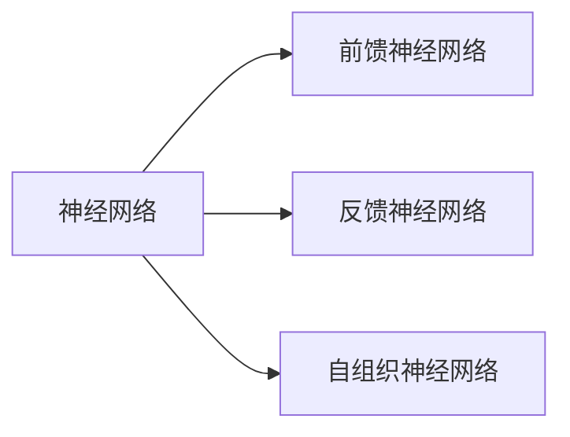
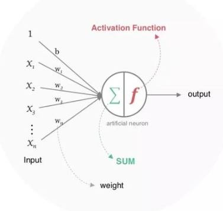
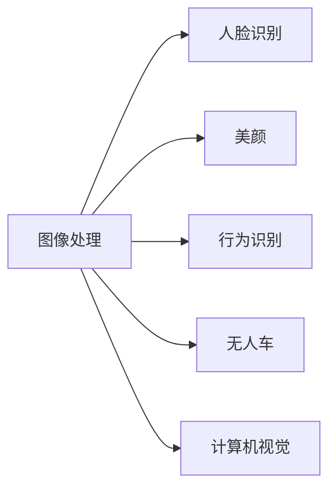
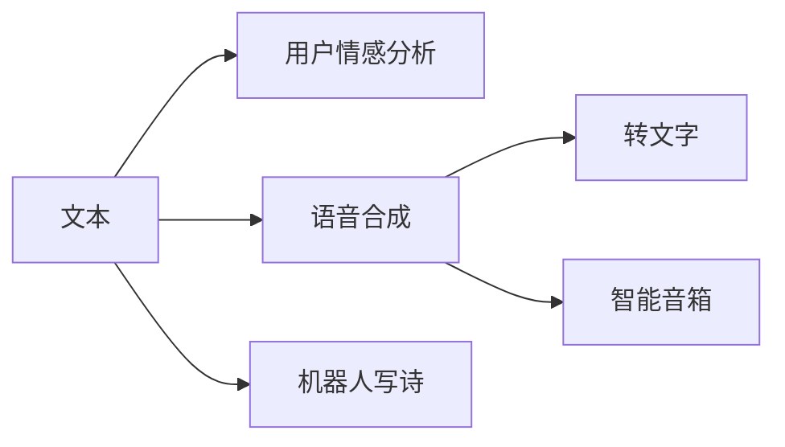

# 神经网络

## 1.	介绍

### 1.1.	ANN(``神经网络``)

### 1.2.	反向传播算法

    将误差逐层向后传递，从而实现使用权值参数对
    特征的记忆也是一种前馈神经网络可以拟合个总非线性关系

#### 1.2.1.	结构

    同一层不连接，相邻层全连接，层与层之间传递权重

 

*[隐层]: 非线性（多层次） 

### 1.2.2.	输入输出

    形式为数值型

### 1.2.3.	激活函数

	1.处处可导
	2.非线性
	3.可微性
	4.单调性
	5.输出值范围（可控）
	6.计算简单
	7.归一化
	8.函数值约等变量

**范例：**

	Sigmoid函数

        1.连续可微
	    2.单调递增
	    3.输出值为0到1之内
 	    4.求导合适

### 1.2.4.	损失函数

•	**交叉熵**
    $loss = ylog(\hat{y}_n)+(1-y)\log (1-\hat{y}_n)$
•	**均方差**
    $loss = \frac{1}{n}\sum_{n=1}^{n=\infty}(\hat{x}_i-x_i)^2$

### 1.2.5.	训练

•	一次过程

    	初始化网络权值和神经元的阈值
    	计算隐层神经元和输出神经元的输出
    	感觉目标函数公式修正权值
•	定义损失函数
•	反向调整偏置

### 1.2.6.	学习率调整策略

•	基于经验的手动调整
•	固定学习率
•	动量法动态调整
•	随机梯度下降
•	自动调整Adam

### 1.2.7.	过拟合，调整

**过拟合**
`训练集上效果好，测试集上效果差，在预测中`

**方法**
    
    •	参数范数惩罚，惩罚性成本函数正则化
    •	将惩罚项添加至损失函数已获得高权重
    •	公式
    •	数据增强
    •	提前终止
    •	选择一些规则来提前终止训练
    •	Bagging，等集成方法
    •       Dropout
    •	以正则化
    •	动量方法
	
*[Drpout]: 在每次训练中随机删除一个神经元子集•	防止神经网络过度依赖某一个路径随机屏蔽掉某些神经元，然后再调节其权重.

*[动量方法]:	每次训练仅略微改变方向,保持不进方向的连续平均数，消除个别点的变化

### 1.2.8.	还要考虑的问题

    •	选择恰当的激活函数
    •	权重初始化
    •	均匀分布
    •	学习率
    •	周期/训练的迭代次数
    •	训练过程可视化
    •	防止局部极值小
    •	防止过拟合

## 1.3.	分类

`在外界输入样本能刺激下，不断改变网络连接的权值（加深记忆）`
	

# 2.	感知器

	可以接收多个输入
	输入参数和对应权值进行加权求和
	激活函数
	可以生成结果
	有偏置

# 3.	应用
 
	

