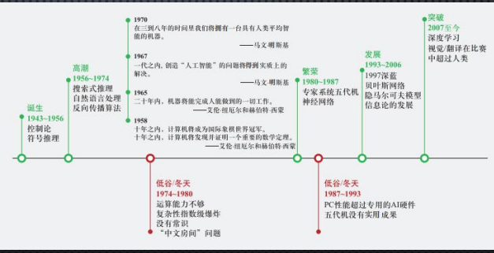
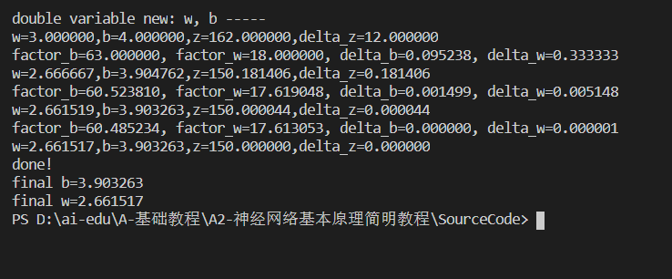
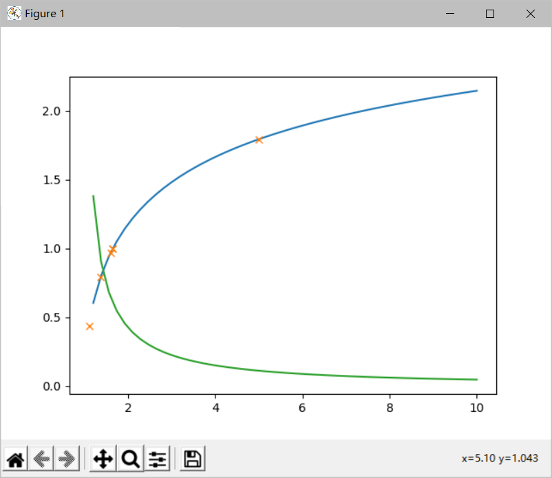

1概论

1.1人工智能发展史

   从计算机科学出现之时，科学家就开始探讨计算机是否能有“智能”。     1950年英国科学家提出了著名的图灵测试：如果一台机器能够与人类展开对话而不被辨别出其机器身份，那么称这台机器具有智能。

   从1956年的达特茅斯会议开始，人工智能作为一个专门的研究领域出现。在2007年前后，迎来了又一次大发展。

   1980年美国哲学家约翰·瑟尔（JOHN SEARLE）提出了有趣的中文房间问题：一个人手中拿着一本象形文字对照手册，身处图灵实验中所提及的房子中。而另一人则在房间外向此房间发送象形文字问题。房间内的人只需按照对照手册，返回手册上的象形文字答案，房间外的人就会以为房间内的人是个会思维的象形文字专家。

1.2人工智能的定义
  
   第一个层面，人们对人工智能的期待可以分为： 

   智能地把某件特定的事情做好，在某个领域增强人类的智慧，这种方式又叫智能增强。例 如搜索引擎、自动翻译、智能助手等，帮助人类完成某种特定任务。这也叫“弱人工智能” 或“狭义人工智能”。 
   
   像人类一样能认知、思考与判断，却模拟人类的智能，这是人工智能学科一开始就希望达 到的目标。这样的智能也叫“通用人工智能” 或“强人工智能”。 
 
   第二个层面，从技术的特点来看： 
  
   如果能让运行程序的计算机来学习并自动掌握某些规律，某种程度上可以谈是实现了狭义 的人工智能，这种方法即机器学习。

   第三个层面，从应用的角度来看，狭义人工智能在各个领域都取得了很大的成果： 
 
   一种是标杆式的任务。2015年，AI取得了超过人类的成果。在翻译领域（微软的中英翻 译）、阅读理解（SQUAD 比赛）、下围棋（2016）、德州扑克（2019）和麻将 （2019）领域中，我们也看到了AI取得了达到或超过人类最高水平的成绩。 
  
   另一种，是AI技术和各种其他技术结合，解决政府，企业，个人用户的需求。在政府方面， 把所有计算，数据，云端和物联网终端的设备联系起来，搭建一个能支持智能决定的系统， 现代社会的城市管理，金融，医疗，物流和交通管理等等都运行在这样的系统上。

1.3范式的演化

   第一阶段：经验

   第二阶段：理论

   第三阶段：计算仿真

   第四阶段：数据探索

2神经网络中的三个基本概念

线性反向传播：

非线性反向传播：

损失函数：

梯度下降：

反向传播算法的核心思路就是梯度下降，从几何上理解，一个函数的图像会在其空间内呈现出一个曲面（曲线）。以 f(x)=x*x+y*y为例，该函数会在三维空间（x, y, z）中形成一个曲面，其中，x, y可看作相互独立的两个变量，分别对x,y求偏导数，会有 ∂ f/ ∂ x = 2 x，∂ f/ ∂ y = 2 y 
​，因此，该函数的梯度可以表示为 ( 2 x , 2 y ) 如在坐标（1,3）处的梯度，代入公式可以得到（2,6）。该数值表示在x, y构成的平面上，首先所处的位置是（1,3）点，该处的函数值是10。如果我需要以最快的速度增大函数值，那么我需要根据 向量（2,6） 的方向前进。因此梯度在几何上的直观理解是一个表明方向的向量，只有朝着这个向量所指示的方向前进，函数值才会增加的最快。由于梯度指示的是函数值增大最快的方向，那么我们朝着相反的方向前进，函数值也必定会下降最快（所以我们在公式中是减去梯度，而不是加上梯度），这就是梯度下降算法的核心。由于梯度值只在一个很小的范围内近似保持不变，所以我们需要进行迭代，并且需要用一个步长变量来控制下降的幅度，这个步长变量就是我们经常谈到的学习率。

假设输入x是一个长度为3的向量,定该输入向量为行向量，即x=[x1 x2 x3],输出为一个回归值ym,目标回归值为y,全连接层权值记为w,w是3x1的矩阵，w=(w1,w2,w3)的转置，偏置项记为b,定义了以上的相关参数之后，就可以进行如下的运算：xw+b=ym,将x和w换成矩阵并展开得到：w1x1+w2x2+w3x3+b=ym,根据ym的公式，四个变量的偏导数计算公式如下：∂ym/∂w1=x1, ∂ym/∂w2=x2, ∂ym/∂w3=x3, ∂ym/∂b=1.取损失cost的计算方式为差值的平方，即c=cost(ym,y)=(ym-y)(ym-y).我们对ym计算偏导数（导数）可得到：∂c/∂ym=2(ym-y)。我们需要将C的数值降低到全局最小值(或者局部最小值),根据求导公式的链式法则有:

∂c/∂w1=(∂c/∂ym)(∂ym/∂w1)=2(ym-y)x1, 

∂c/∂w=(∂c/∂ym)(∂ym/∂w)=2(ym-y)x2, 

∂c/∂w3=(∂c/∂ym)(∂ym/∂w3)=2(ym-y)x3, 

∂c/∂b=(∂c/∂ym)(∂ym/∂b)=2(ym-y)。

上式就是我们计算得到的梯度信息，根据梯度信息，我们就可以更新相关的参数了，以下公式中的 a表示的是学习率，为人为设置的一个超参数:

w1:=w1-a(∂c/∂w1)=w1-a(2(ym-y)x1), 

w2:=w2-a(∂c/∂w2)=w2-a(2(ym-y)x2), 

w3:=w3-a(∂c/∂w3)=w3-a(2(ym-y)x3), 

b:=b-a(∂c/∂b)=b-a(2(ym-y)).
以上的公式就已经可以用来进行反向传播，或者说梯度下降了。

损失函数：

均方误差公式：(1/M)∑(ym-ym')(ym-ym'),表示真实值与预测值差平方的期望，值越大，表明预测效果越差。

交叉熵：假设现在有一个样本集中两个概率分布p,q，其中p为真实分布，q为非真实分布。假如，按照真实分布p来衡量识别一个样本所需要的编码长度的期望为：H(p)=∑p(i)log(1/p(i))。但是，如果采用错误的分布q来表示来自真实分布p的平均编码长度，则应该是：H(p,q)=∑p(i)log(1/q(i))。此时就将H(p,q)称之为交叉熵。

心得体会：这个章节主要讲了反向传播、梯度下降、损失函数。神经网络这个章节很复杂而且枯燥，学好这章不仅要课上听老师讲解，而且课下也要查资料。
