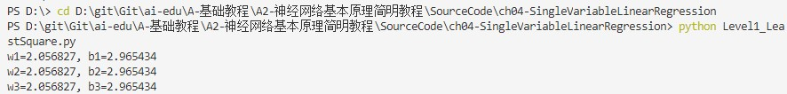
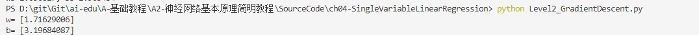
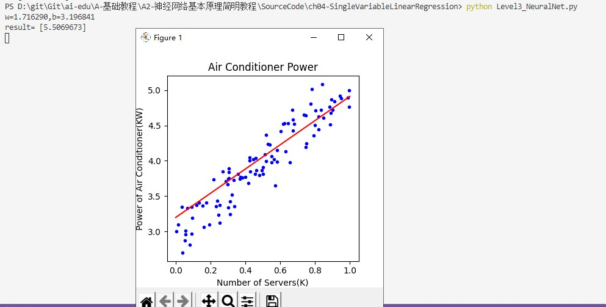

# 线性回归

## 概念

用线性回归作为学习神经网络的起点，是一个非常好的选择，因为线性回归问题本身比较容易理解，在它的基础上，逐步的增加一些新的知识点，会形成一条比较平缓的学习曲线，或者说是迈向神经网络的第一个小台阶。

单层的神经网络，其实就是一个神经元，可以完成一些线性的工作，比如拟合一条直线，这用一个神经元就可以实现。当这个神经元只接收一个输入时，就是单变量线性回归，可以在二维平面上用可视化方法理解。

## 单变量线性回归模型

回归分析是一种数学模型。当因变量和自变量为线性关系时，它是一种特殊的线性模型。

最简单的情形是一元线性回归，由大体上有线性关系的一个自变量和一个因变量组成，模型是：

$$Y=a+bX+\varepsilon \tag{1}$$

$X$ 是自变量，$Y$ 是因变量，$\varepsilon$ 是随机误差，$a$ 和 $b$ 是参数，在线性回归模型中，$a,b$ 是我们要通过算法学习出来的。

通常假定随机误差 $\varepsilon$ 的均值为 $0$，方差为$σ^2$（$σ^2>0$，$σ^2$ 与 $X$ 的值无关）

若进一步假定随机误差遵从正态分布，就叫做正态线性模型
一般地，若有 $k$ 个自变量和 $1$ 个因变量（即公式1中的 $Y$），则因变量的值分为两部分：一部分由自变量影响，即表示为它的函数，函数形式已知且含有未知参数；另一部分由其他的未考虑因素和随机性影响，即随机误差
当函数为参数未知的线性函数时，称为线性回归分析模型
当函数为参数未知的非线性函数时，称为非线性回归分析模型
当自变量个数大于 $1$ 时称为多元回归
当因变量个数大于 $1$ 时称为多重回归

围绕的方法
1. 最小二乘法；
2. 梯度下降法；
3. 简单的神经网络法；
4. 更通用的神经网络算法。

线性公式中 $W$ 和 $X$ 的顺序问题

$$Y = W^{\top}X+B \tag{1}$$

或者：

$$Y = W \cdot X + B \tag{2}$$

而我们在本书中使用：

$$Y = X \cdot W + B \tag{3}$$

这三者的主要区别是样本数据 $X$ 的形状定义，相应地会影响到 $W$ 的形状定义。举例来说，如果 $X$ 有三个特征值，那么 $W$ 必须有三个权重值与特征值对应，则：

### 公式1的矩阵形式

$X$ 是列向量：

$$
X=
\begin{pmatrix}
x_{1} \\\\
x_{2} \\\\
x_{3}
\end{pmatrix}
$$

$W$ 也是列向量：

$$
W=
\begin{pmatrix}
w_{1} \\\\ w_{2} \\\\ w_{3}
\end{pmatrix}
$$
$$
Y=W^{\top}X+B=
\begin{pmatrix}
w_1 & w_2 & w_3
\end{pmatrix}
\begin{pmatrix}
x_{1} \\\\
x_{2} \\\\
x_{3}
\end{pmatrix}
+b
$$
$$
=w_1 \cdot x_1 + w_2 \cdot x_2 + w_3 \cdot x_3 + b \tag{4}
$$

$W$ 和 $X$ 都是列向量，所以需要先把 $W$ 转置后，再与 $X$ 做矩阵乘法。

### 公式2的矩阵形式

公式2与公式1的区别是 $W$ 的形状，在公式2中，$W$ 是个行向量：

$$
W=
\begin{pmatrix}
w_{1} & w_{2} & w_{3}
\end{pmatrix}
$$

而 $X$ 的形状仍然是列向量：

$$
X=
\begin{pmatrix}
x_{1} \\\\
x_{2} \\\\
x_{3}
\end{pmatrix}
$$

这样相乘之前不需要做矩阵转置了：

$$
Y=W \cdot X+B=
\begin{pmatrix}
w_1 & w_2 & w_3
\end{pmatrix}
\begin{pmatrix}
x_{1} \\\\
x_{2} \\\\
x_{3}
\end{pmatrix}
+b
$$
$$
=w_1 \cdot x_1 + w_2 \cdot x_2 + w_3 \cdot x_3 + b \tag{5}
$$

### 公式3的矩阵形式

$X$ 是个行向量：

$$
X=
\begin{pmatrix}
x_{1} & x_{2} & x_{3}
\end{pmatrix}
$$

$W$ 是列向量：

$$
W=
\begin{pmatrix}
w_{1} \\\\ w_{2} \\\\ w_{3}
\end{pmatrix}
$$

所以 $X$ 在前，$W$ 在后：

$$
Y=X \cdot W+B=
\begin{pmatrix}
x_1 & x_2 & x_3
\end{pmatrix}
\begin{pmatrix}
w_{1} \\\\
w_{2} \\\\
w_{3}
\end{pmatrix}
+b
$$
$$
=x_1 \cdot w_1 + x_2 \cdot w_2 + x_3 \cdot w_3 + b \tag{6}
$$


**这三者的主要区别是样本数据 $X$ 的形状定义，相应地会影响到 $W$ 的形状定义。**
比较公式4，5，6，其实最后的运算结果是相同的。

我们再分析一下前两种形式的 $X$ 矩阵，由于 $X$ 是个列向量，意味着特征由行表示，当有2个样本同时参与计算时，$X$ 需要增加一列，变成了如下形式：

$$
X=
\begin{pmatrix}
x_{11} & x_{21} \\\\
x_{12} & x_{22} \\\\
x_{13} & x_{23} 
\end{pmatrix}
$$

$x_{ij}$ 的第一个下标 $i$ 表示样本序号，第二个下标 $j$ 表示样本特征，所以 $x_{21}$ 是第2个样本的第1个特征。看 $x_{21}$ 这个序号很别扭，一般我们都是认为行在前、列在后，但是 $x_{21}$ 却是处于第1行第2列，和习惯正好相反。

如果采用第三种形式，则两个样本的 $X$ 矩阵是：

$$
X=
\begin{pmatrix}
x_{11} & x_{12} & x_{13} \\\\
x_{21} & x_{22} & x_{23}
\end{pmatrix}
$$

第1行是第1个样本的3个特征，第2行是第2个样本的3个特征，这与常用的阅读习惯正好一致，第1个样本的第2个特征在矩阵的第1行第2列，因此我们在本书中一律使用第三种形式来描述线性方程。

### 小结与收获

## 最小二乘法

### 概念及其意义

小二乘法，也叫做最小平方法（Least Square），它通过最小化误差的平方和寻找数据的最佳函数匹配。利用最小二乘法可以简便地求得未知的数据，并使得这些求得的数据与实际数据之间误差的平方和为最小。最小二乘法还可用于曲线拟合。其他一些优化问题也可通过最小化能量或最小二乘法来表达。

### 原理

线性回归试图学得：

$$z_i=w \cdot x_i+b \tag{1}$$

使得：

$$z_i \simeq y_i \tag{2}$$

其中，$x_i$ 是样本特征值，$y_i$ 是样本标签值，$z_i$ 是模型预测值。

如何学得 $w$ 和 $b$ 呢？均方差(MSE - mean squared error)是回归任务中常用的手段：
$$
J = \frac{1}{2m}\sum_{i=1}^m(z_i-y_i)^2 = \frac{1}{2m}\sum_{i=1}^m(y_i-wx_i-b)^2 \tag{3}
$$

$J$ 称为损失函数。实际上就是试图找到一条直线，使所有样本到直线上的残差的平方和最小。


圆形点是样本点，直线是当前的拟合结果。如左图所示，我们是要计算样本点到直线的垂直距离，需要再根据直线的斜率来求垂足然后再计算距离，这样计算起来很慢；但实际上，在工程上我们通常使用的是右图的方式，即样本点到直线的竖直距离，因为这样计算很方便，用一个减法就可以了。
因为图中的几个点不在一条直线上，所以不存在一条直线能同时穿过它们。所以，我们只能想办法让总体误差最小，就意味着整体偏差最小，那么最终的那条直线就是要求的结果。

如果想让误差的值最小，通过对 $w$ 和 $b$ 求导，再令导数为 $0$（到达最小极值），就是 $w$ 和 $b$ 的最优解。

**思路**：通过对 $w$ 和 $b$ 求导，再令导数为 $0$（到达最小极值），就是 $w$ 和 $b$ 的最优解

$$
w = \frac{m\sum_{i=1}^m x_i y_i - \sum_{i=1}^m x_i \sum_{i=1}^m y_i}{m\sum_{i=1}^m x^2_i - (\sum_{i=1}^m x_i)^2} \tag{4}
$$

$$
b= \frac{1}{m} \sum_{i=1}^m(y_i-wx_i) \tag{5}
$$

而事实上，式4有很多个变种，大家会在不同的文章里看到不同版本，往往感到困惑，比如下面两个公式也是正确的解：

$$
w = \frac{\sum_{i=1}^m y_i(x_i-\bar x)}{\sum_{i=1}^m x^2_i - (\sum_{i=1}^m x_i)^2/m} \tag{6}
$$

$$
w = \frac{\sum_{i=1}^m x_i(y_i-\bar y)}{\sum_{i=1}^m x^2_i - \bar x \sum_{i=1}^m x_i} \tag{7}
$$

代码展示详细过程

```python
import numpy as np
import matplotlib.pyplot as plt
from pathlib import Path

from HelperClass.DataReader_1_0 import *

file_name = "../../data/ch04.npz"

def method1(X,Y,m):
    x_mean = X.mean()
    p = sum(Y*(X-x_mean))
    q = sum(X*X) - sum(X)*sum(X)/m
    w = p/q
    return w

def method2(X,Y,m):
    x_mean = X.mean()
    y_mean = Y.mean()
    p = sum(X*(Y-y_mean))
    q = sum(X*X) - x_mean*sum(X)
    w = p/q
    return w

def method3(X,Y,m):
    p = m*sum(X*Y) - sum(X)*sum(Y)
    q = m*sum(X*X) - sum(X)*sum(X)
    w = p/q
    return w

def calculate_b_1(X,Y,w,m):
    b = sum(Y-w*X)/m
    return b

def calculate_b_2(X,Y,w):
    b = Y.mean() - w * X.mean()
    return b

if __name__ == '__main__':

    reader = DataReader_1_0(file_name)
    reader.ReadData()
    X,Y = reader.GetWholeTrainSamples()
    m = X.shape[0]
    w1 = method1(X,Y,m)
    b1 = calculate_b_1(X,Y,w1,m)

    w2 = method2(X,Y,m)
    b2 = calculate_b_2(X,Y,w2)

    w3 = method3(X,Y,m)
    b3 = calculate_b_1(X,Y,w3,m)

    print("w1=%f, b1=%f" % (w1,b1))
    print("w2=%f, b2=%f" % (w2,b2))
    print("w3=%f, b3=%f" % (w3,b3))
```

运行结果



## 梯度下降法


### 概念及其意义

用梯度下降法求解 $w$ 和 $b$，从而可以比较二者的结果。我们规定 $x$ 是样本特征值（单特征），$y$ 是样本标签值，$z$ 是预测值，下标 $i$ 表示其中一个样本。

### 计算

线性函数：

$$z_i = x_i \cdot w + b \tag{1}$$

均方误差：

$$loss_i(w,b) = \frac{1}{2} (z_i-y_i)^2 \tag{2}$$

#### 计算z的梯度

根据公式2：
$$
\frac{\partial loss}{\partial z_i}=z_i - y_i \tag{3}
$$

#### 计算 $w$ 的梯度

我们用 $loss$ 的值作为误差衡量标准，通过求 $w$ 对它的影响，也就是 $loss$ 对 $w$ 的偏导数，来得到 $w$ 的梯度。由于 $loss$ 是通过公式2->公式1间接地联系到 $w$ 的，所以我们使用链式求导法则，通过单个样本来求导。

根据公式1和公式3：

$$
\frac{\partial{loss}}{\partial{w}} = \frac{\partial{loss}}{\partial{z_i}}\frac{\partial{z_i}}{\partial{w}}=(z_i-y_i)x_i \tag{4}
$$

#### 计算 $b$ 的梯度

$$
\frac{\partial{loss}}{\partial{b}} = \frac{\partial{loss}}{\partial{z_i}}\frac{\partial{z_i}}{\partial{b}}=z_i-y_i \tag{5}
$$

```python
import numpy as np
import matplotlib.pyplot as plt
from pathlib import Path

from HelperClass.DataReader_1_0 import *

file_name = "../../data/ch04.npz"

if __name__ == '__main__':

    reader = DataReader_1_0(file_name)
    reader.ReadData()
    X,Y = reader.GetWholeTrainSamples()

    eta = 0.1
    w, b = 0.0, 0.0
    for i in range(reader.num_train):
        # get x and y value for one sample
        xi = X[i]
        yi = Y[i]
        # 公式1
        zi = xi * w + b
        # 公式3
        dz = zi - yi
        # 公式4
        dw = dz * xi
        # 公式5
        db = dz
        # update w,b
        w = w - eta * dw
        b = b - eta * db

    print("w=", w)    
    print("b=", b)
```

**运行测试结果**



## 神经网络法

在梯度下降法中，我们简单讲述了一下神经网络做线性拟合的原理，即：

1. 初始化权重值
2. 根据权重值放出一个解
3. 根据均方差函数求误差
4. 误差反向传播给线性计算部分以调整权重值
5. 是否满足终止条件？不满足的话跳回2

## 4.3.1 定义神经网络结构

我们是首次尝试建立神经网络，先用一个最简单的单层单点神经元，如图4-4所示。


图4-4 单层单点神经元

下面，我们用这个最简单的线性回归的例子，来说明神经网络中最重要的反向传播和梯度下降的概念、过程以及代码实现。

### 输入层

此神经元在输入层只接受一个输入特征，经过参数 $w,b$ 的计算后，直接输出结果。这样一个简单的“网络”，只能解决简单的一元线性回归问题，而且由于是线性的，我们不需要定义激活函数，这就大大简化了程序，而且便于大家循序渐进地理解各种知识点。

严格来说输入层在神经网络中并不能称为一个层。

### 权重 $w,b$

因为是一元线性问题，所以 $w,b$ 都是标量。

### 输出层

输出层 $1$ 个神经元，线性预测公式是：

$$z_i = x_i \cdot w + b$$

$z$ 是模型的预测输出，$y$ 是实际的样本标签值，下标 $i$ 为样本。

### 损失函数

因为是线性回归问题，所以损失函数使用均方差函数。

$$loss(w,b) = \frac{1}{2} (z_i-y_i)^2$$

### 4.3.2 反向传播

#### 计算 $w$ 的梯度

$$
{\partial{loss} \over \partial{w}} = \frac{\partial{loss}}{\partial{z_i}}\frac{\partial{z_i}}{\partial{w}}=(z_i-y_i)x_i
$$

#### 计算 $b$ 的梯度

$$
\frac{\partial{loss}}{\partial{b}} = \frac{\partial{loss}}{\partial{z_i}}\frac{\partial{z_i}}{\partial{b}}=z_i-y_i
$$

### 代码实现

```python
import numpy as np
import matplotlib.pyplot as plt

from HelperClass.DataReader_1_0 import *

file_name = "../../data/ch04.npz"

class NeuralNet_0_1(object):
    def __init__(self, eta):
        self.eta = eta
        self.w = 0
        self.b = 0

    def __forward(self, x):
        z = x * self.w + self.b
        return z

    def __backward(self, x,y,z):
        dz = z - y
        db = dz
        dw = x * dz
        return dw, db

    def __update(self, dw, db):
        self.w = self.w - self.eta * dw
        self.b = self.b - self.eta * db

    def train(self, dataReader):
        for i in range(dataReader.num_train):
            # get x and y value for one sample
            x,y = dataReader.GetSingleTrainSample(i)
            # get z from x,y
            z = self.__forward(x)
            # calculate gradient of w and b
            dw, db = self.__backward(x, y, z)
            # update w,b
            self.__update(dw, db)
        # end for

    def inference(self, x):
        return self.__forward(x)

# end class

def ShowResult(net, dataReader):
    X,Y = dataReader.GetWholeTrainSamples()
    # draw sample data
    plt.plot(X, Y, "b.")
    # draw predication data
    PX = np.linspace(0,1,10)
    PZ = net.inference(PX)
    plt.plot(PX, PZ, "r")
    plt.title("Air Conditioner Power")
    plt.xlabel("Number of Servers(K)")
    plt.ylabel("Power of Air Conditioner(KW)")
    plt.show()


if __name__ == '__main__':
    # read data
    sdr = DataReader_1_0(file_name)
    sdr.ReadData()
    # create net
    eta = 0.1
    net = NeuralNet_0_1(eta)
    net.train(sdr)
    # result
    print("w=%f,b=%f" %(net.w, net.b))
    # predication
    result = net.inference(1.346)
    print("result=", result)
    ShowResult(net, sdr)

```

**运行结果**



## 梯度下降的三种形式

我们比较一下目前我们用三种方法得到的 $w$ 和 $b$ 的值，见表4-2。

表4-2 三种方法的结果比较

|方法|$w$|$b$|
|----|----|----|
|最小二乘法|2.056827|2.965434|
|梯度下降法|1.71629006|3.19684087|
|神经网络法|1.71629006|3.19684087|

计算 $w$ 的梯度：

$$
\frac{\partial{loss}}{\partial{w}} = \frac{\partial{loss}}{\partial{z_i}}\frac{\partial{z_i}}{\partial{w}}=(z_i-y_i)x_i
$$

计算 $b$ 的梯度：

$$
\frac{\partial{loss}}{\partial{b}} = \frac{\partial{loss}}{\partial{z_i}}\frac{\partial{z_i}}{\partial{b}}=z_i-y_i
$$

### 单样本随机梯度下降

#### 计算过程

假设一共100个样本，每次使用1个样本：

***


$\quad for \quad i=1,2,3,...,100\{ \\\\ $
$\quad \quad z_i = x_i \cdot w + b\\\\ $
$\quad \quad dw= x_i \cdot (z_i - y_i)\\\\ $
$\quad \quad db= z_i - y_i \\\\ $
$\quad \quad w=w-\eta \cdot dw \\\\ $
$\quad \quad db=b-\eta \cdot db \\\\ $


***

#### 特点
  
训练样本：每次使用一个样本数据进行一次训练，更新一次梯度，重复以上过程。
优点：训练开始时损失值下降很快，随机性大，找到最优解的可能性大。
缺点：受单个样本的影响最大，损失函数值波动大，到后期徘徊不前，在最优解附近震荡。不能并行计算。

## 学习过程

首先对ppt进行阅读梳理出一个大方向，选择一些重要的章节先进行学习，所谓先枝后叶，如果学习有些概念不懂，再对细节进行学习，ppt确定大方向后再对以及列好的在markdown中进行学习

## 学习心得体会

本章先介绍了线性回归的概念，然后再对最小二乘法、梯度下降法、简单的神经网络法进行概念的介绍以及数学表达式的应用，最后用代码去实现它

在代码执行过程中，我出现了运行错误的问题，之前直接使用vscode run，这其实是不行的，因为会出现路径错误，而且这种方式不支持多文件运行。