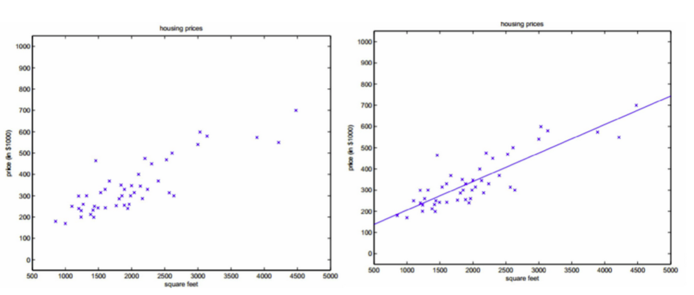
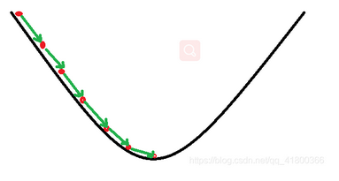

# 单变量线性回归

我们首先用弄清楚什么是线性，什么是非线性。

    线性：两个变量之间的关系是一次函数关系的——图象是直线，叫做线性。

    注意：题目的线性是指广义的线性，也就是数据与数据之间的关系。

    非线性：两个变量之间的关系不是一次函数关系的——图象不是直线，叫做非线性。

    回归：人们在测量事物的时候因为客观条件所限，求得的都是测量值，而不是事物真实的值，为了能够得到真实值，无限次的进行测量，最后通过这些测量数据计算回归到真实值，这就是回归的由来。

    回归是监督学习的一个重要问题，回归用于预测输入变量和输出变量之间的关系，特别是当输入变量的值发生变化时，输出变量的值也随之发生变化。回归模型正是表示从输入变量到输出变量之间映射的函数

## 线性回归要解决的问题

    对大量的观测数据进行处理，从而得到比较符合事物内部规律的数学表达式。也就是说寻找到数据与数据之间的规律所在，从而就可以模拟出结果，也就是对结果进行预测。解决的就是通过已知的数据得到未知的结果。例如：对房价的预测、判断信用评价、电影票房预估等
### 线性回归的一般模型

## 线性回归问题的解决方法

1. 最小二乘法；
1. 梯度下降法；
2. 简单的神经网络法；
3. 更通用的神经网络算法。

## 1.1 最小二乘法

### 历史

最小二乘法是勒让德( A. M. Legendre)于1805年在其著作《计算慧星轨道的新方法》中提出的。它的主要思想就是求解未知参数，使得理论值与观测值之差（即误差，或者说残差）的平方和达到最小：
线性回归试图学得：

### 数学原理
$$z_i=w \cdot x_i+b \tag{1}$$

使得：

$$z_i \simeq y_i \tag{2}$$

其中，$x_i$ 是样本特征值，$y_i$ 是样本标签值，$z_i$ 是模型预测值。

如何学得 $w$ 和 $b$ 呢？均方差(MSE - mean squared error)是回归任务中常用的手段：
$$
J = \frac{1}{2m}\sum_{i=1}^m(z_i-y_i)^2 = \frac{1}{2m}\sum_{i=1}^m(y_i-wx_i-b)^2 \tag{3}
$$

$J$ 称为损失函数。实际上就是试图找到一条直线，使所有样本到直线上的残差的平方和最小。

## 1.2 梯度下降法
### 原理
    梯度下降法的基本思想可以类比为一个下山的过程。
    假设这样一个场景：一个人被困在山上，需要从山上下来(找到山的最低点，也就是山谷)。但此时山上的浓雾很大，导致可视度很低；因此，下山的路径就无法确定，必须利用自己周围的信息一步一步地找到下山的路。这个时候，便可利用梯度下降算法来帮助自己下山。怎么做呢，首先以他当前的所处的位置为基准，寻找这个位置最陡峭的地方，然后朝着下降方向走一步，然后又继续以当前位置为基准，再找最陡峭的地方，再走直到最后到达最低处；同理上山也是如此，只是这时候就变成梯度上升算法了

梯度下降的基本过程就和下山的场景很类似。

首先，我们有一个可微分的函数。这个函数就代表着一座山。我们的目标就是找到这个函数的最小值，也就是山底。根据之前的场景假设，最快的下山的方式就是找到当前位置最陡峭的方向，然后沿着此方向向下走，对应到函数中，就是找到给定点的梯度 ，然后朝着梯度相反的方向，就能让函数值下降的最快！因为梯度的方向就是函数之变化最快的方向(在后面会详细解释)
所以，我们重复利用这个方法，反复求取梯度，最后就能到达局部的最小值，这就类似于我们下山的过程。而求取梯度就确定了最陡峭的方向，也就是场景中测量方向的手段

### 计算
在下面的公式中，我们规定 $x$ 是样本特征值（单特征），$y$ 是样本标签值，$z$ 是预测值，下标 $i$ 表示其中一个样本。

预设函数（Hypothesis Function）

线性函数：

$$z_i = x_i \cdot w + b \tag{1}$$
 损失函数（Loss Function）

均方误差：

$$loss_i(w,b) = \frac{1}{2} (z_i-y_i)^2 \tag{2}$$

与最小二乘法比较可以看到，梯度下降法和最小二乘法的模型及损失函数是相同的，都是一个线性模型加均方差损失函数，模型用于拟合，损失函数用于评估效果。

区别在于，最小二乘法从损失函数求导，直接求得数学解析解，而梯度下降以及后面的神经网络，都是利用导数传递误差，再通过迭代方式一步一步（用近似解）逼近真实解。

### 梯度计算

### 计算z的梯度

根据公式2：
$$
\frac{\partial loss}{\partial z_i}=z_i - y_i \tag{3}
$$

#### 计算 $w$ 的梯度

我们用 $loss$ 的值作为误差衡量标准，通过求 $w$ 对它的影响，也就是 $loss$ 对 $w$ 的偏导数，来得到 $w$ 的梯度。由于 $loss$ 是通过公式2->公式1间接地联系到 $w$ 的，所以我们使用链式求导法则，通过单个样本来求导。

根据公式1和公式3：

$$
\frac{\partial{loss}}{\partial{w}} = \frac{\partial{loss}}{\partial{z_i}}\frac{\partial{z_i}}{\partial{w}}=(z_i-y_i)x_i \tag{4}
$$

