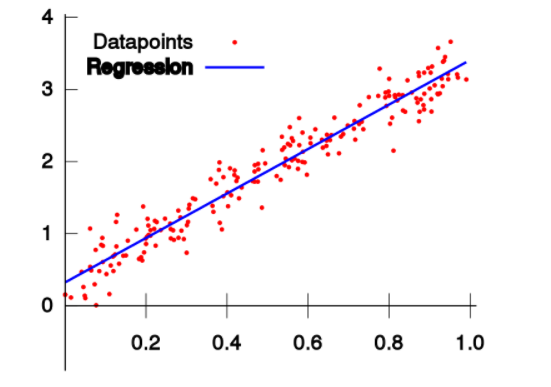
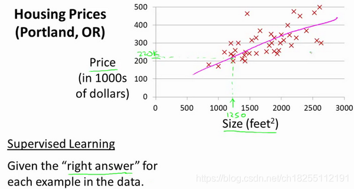

201809058 Wang Yulong

# <font face="楷体" color=brown><center>1.单变量线性回归</font></center>
<font face="楷体">

## 1.1一元线性回归模型

&emsp;&emsp;简而言之，一元线性回归模型是在已有数据集上通过构建一个线性的模型来拟合该数据集特征向量的各个分量之间的关系，对于需要预测结果的新数据，我们利用已经拟合好的线性模型来预测其结果。



$$Y=a+bX+\varepsilon \tag{1}$$

$X$ 是自变量，$Y$ 是因变量，$\varepsilon$ 是随机误差，$a$ 和 $b$ 是参数，在线性回归模型中，$a,b$ 是我们要通过算法学习出来的。

对于线性回归模型，有如下一些概念需要了解：

- 通常假定随机误差 $\varepsilon$ 的均值为 $0$，方差为$σ^2$（$σ^2>0$，$σ^2$ 与 $X$ 的值无关）
- 若进一步假定随机误差遵从正态分布，就叫做正态线性模型
- 一般地，若有 $k$ 个自变量和 $1$ 个因变量（即公式1中的 $Y$），则因变量的值分为两部分：一部分由自变量影响，即表示为它的函数，函数形式已知且含有未知参数；另一部分由其他的未考虑因素和随机性影响，即随机误差
- 当函数为参数未知的线性函数时，称为线性回归分析模型
- 当函数为参数未知的非线性函数时，称为非线性回归分析模型
- 当自变量个数大于 $1$ 时称为多元回归
- 当因变量个数大于 $1$ 时称为多重回归

例1.这个例子里需要预测住房价格，要使用一个数据集，数据集包含俄勒冈州波特兰市的住房价格。在这里，需要根据不同房屋尺寸所售出的价格，画出数据集。例如，如果某栋房子的面积是1250平方英尺，预测这栋房子的售价。那么，可以做的一件事就是构建一个模型，也许是条直线，


  
 
 $$拟合的线性回归模型：y=0.13x+53.3$$

&emsp;&emsp;由此可以算得，若一栋1250平方英尺的房子大概可以卖22万美元

## 1.2 最小二乘法

线性回归试图学得：

$$z_i=w \cdot x_i+b $$


$$
w = \frac{m\sum_{i=1}^m x_i y_i - \sum_{i=1}^m x_i \sum_{i=1}^m y_i}{m\sum_{i=1}^m x^2_i - (\sum_{i=1}^m x_i)^2} 
$$

$$
b= \frac{1}{m} \sum_{i=1}^m(y_i-wx_i) 
$$

```Python
# 根据公式15
def method1(X,Y,m):
    x_mean = X.mean()
    p = sum(Y*(X-x_mean))
    q = sum(X*X) - sum(X)*sum(X)/m
    w = p/q
    return w

# 根据公式16
def method2(X,Y,m):
    x_mean = X.mean()
    y_mean = Y.mean()
    p = sum(X*(Y-y_mean))
    q = sum(X*X) - x_mean*sum(X)
    w = p/q
    return w

# 根据公式13
def method3(X,Y,m):
    p = m*sum(X*Y) - sum(X)*sum(Y)
    q = m*sum(X*X) - sum(X)*sum(X)
    w = p/q
    return w
```

#### 计算 $b$ 值

```Python
# 根据公式14
def calculate_b_1(X,Y,w,m):
    b = sum(Y-w*X)/m
    return b

# 根据公式9
def calculate_b_2(X,Y,w):
    b = Y.mean() - w * X.mean()
    return b
```

运算结果

用以上几种方法，最后得出的结果都是一致的，可以起到交叉验证的作用：

```
w1=2.056827, b1=2.965434
w2=2.056827, b2=2.965434
w3=2.056827, b3=2.965434
```

## 1.3梯度下降法

$$z_i = x_i \cdot w + b $$

均方误差：

$$loss_i(w,b) = \frac{1}{2} (z_i-y_i)^2 $$

$z$的梯度：
$$
\frac{\partial loss}{\partial z_i}=z_i - y_i 
$$
计算 $w$ 的梯度

我们用 $loss$ 的值作为误差衡量标准，通过求 $w$ 对它的影响，也就是 $loss$ 对 $w$ 的偏导数，来得到 $w$ 的梯度。由于 $loss$ 是间接地联系到 $w$ 的，所以我们使用链式求导法则，通过单个样本来求导。

计算 $b$ 的梯度

$$
\frac{\partial{loss}}{\partial{b}} = \frac{\partial{loss}}{\partial{z_i}}\frac{\partial{z_i}}{\partial{b}}=z_i-y_i 
$$

## 1.4 神经网络法

输入层

此神经元在输入层只接受一个输入特征，经过参数 $w,b$ 的计算后，直接输出结果。

输出层

输出层 $1$ 个神经元，线性预测公式是：

$$z_i = x_i \cdot w + b$$

$z$ 是模型的预测输出，$y$ 是实际的样本标签值，下标 $i$ 为样本。

损失函数

因为是线性回归问题，所以损失函数使用均方差函数。

$$loss(w,b) = \frac{1}{2} (z_i-y_i)^2$$

计算 $w$ 的梯度

$$
{\partial{loss} \over \partial{w}} = \frac{\partial{loss}}{\partial{z_i}}\frac{\partial{z_i}}{\partial{w}}=(z_i-y_i)x_i
$$

计算 $b$ 的梯度

$$
\frac{\partial{loss}}{\partial{b}} = \frac{\partial{loss}}{\partial{z_i}}\frac{\partial{z_i}}{\partial{b}}=z_i-y_i
$$

### <font color=red>方法比较</font>

我们比较一下目前我们用三种方法得到的 $w$ 和 $b$ 的值，见表4-2。

表1 三种方法的结果比较

|方法|$w$|$b$|
|----|----|----|
|最小二乘法|2.056827|2.965434|
|梯度下降法|1.71629006|3.19684087|
|神经网络法|1.71629006|3.19684087|


这个问题的原始值是可能是 $w=2,b=3$，由于样本噪音的存在，使用最小二乘法得到了 $2.05,2.96$ 这样的非整数解，这是完全可以接受的。但是使用梯度下降和神经网络两种方式，都得到 $1.71,3.19$ 这样的值，准确程度很低。从图1的神经网络的训练结果来看，拟合直线是斜着穿过样本点区域的，并没有在正中央的骨架上。


<center>图1. 拟合效果</center>


---
# <font face="楷体" color=#13695><center>2.多变量线性回归</font></center>

## 2.1 多元线性回归模型

由于实际问题中的数据并不十分理想，因此我们需要根据1000个样本值来建立一个模型，来解决预测问题。

通过图示，我们基本可以确定这个问题是个线性回归问题，而且是典型的多元线性回归，即包括两个或两个以上自变量的回归。多元线性回归的函数模型如下：

$$y=a_0+a_1x_1+a_2x_2+\dots+a_kx_k$$

具体化到房价预测问题，上面的公式可以简化成：

$$ 
z = x_1 \cdot w_1 + x_2 \cdot w_2 + b
$$

对于一般的应用问题，建立多元线性回归模型时，为了保证回归模型具有优良的解释能力和预测效果，应首先注意自变量的选择，其准则是：

1. 自变量对因变量必须有显著的影响，并呈密切的线性相关；
2. 自变量与因变量之间的线性相关必须是真实的，而不是形式上的；
3. 自变量之间应具有一定的互斥性，即自变量之间的相关程度不应高于自变量与因变量之因的相关程度；
4. 自变量应具有完整的统计数据，其预测值容易确定。