# 非线性回归

## 双层神经网络
在两层神经网络之间，必须有激活函数连接，从而加入非线性因素，提高神经网络的能力。所以，我们先从激活函数学起，一类是挤压型的激活函数，常用于简单网络的学习；另一类是半线性的激活函数，常用于深度网络的学习。

## 第八章 激活函数

#### 1.激活函数的性质
+ 非线性：线性的激活函数和没有激活函数一样；
+ 可导性：做误差反向传播和梯度下降，必须要保证激活函数的可导性；
+ 单调性：单一的输入会得到单一的输出，较大值的输入得到较大值的输出

$$ 用‘1’来代表一个神经元被激活，‘0’代表一个神经元未被激活.$$
#### 2.激活函数应用

1. 神经网络最后一层不需要激活函数
2. 激活函数只用于连接前后两层神经网络
   
#### 3.挤压型激活函数

当输入值域的绝对值较大的时候，其输出在两端是饱和的，都具有S形的函数曲线以及压缩输入值域的作用，所以叫挤压型激活函数，又可以叫饱和型激活函数。

##### Logistic函数

 规定：用到“Logistic”词汇的，指的是二分类函数；而用到“Sigmoid”词汇的，指的是本激活函数。

- 公式

$$Sigmoid(z) = \frac{1}{1 + e^{-z}} \rightarrow a $$

- 导数

$$Sigmoid'(z) = a(1 - a) $$

- 值域
 
  输入值域：$(-\infty, +\infty)$
  输出值域：$(0,1)$
  导数值域：$(0,0.25]$

- 函数图像
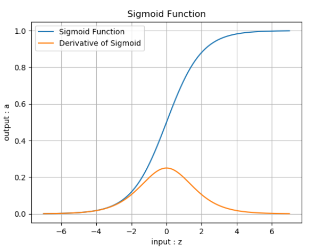

- 优点
  
  （1）函数图像上：Sigmoid函数的作用是将输入压缩到 $(0,1)$ 这个区间范围内，这种输出在0~1之间的函数可以用来模拟一些概率分布的情况。它还是一个连续函数，导数简单易求。
  （2）数学上，Sigmoid函数对中央区的信号增益较大，对两侧区的信号增益小，在信号的特征空间映射上，有很好的效果。
  （3）神经科学上。中央区酷似神经元的兴奋态，两侧区酷似神经元的抑制态，因而在神经网络学习方面，可以将重点特征推向中央区，
  将非重点特征推向两侧区

- 缺点
  
  反向传播时梯度消失：从梯度图像中可以看到，Sigmoid的梯度在两端都会接近于0，根据链式法则，如果传回的误差是$\delta$，那么梯度传递函数是$\delta \cdot a'$，而$a'$这时接近零，也就是说整体的梯度也接近零。这就出现梯度消失的问题，并且这个问题可能导致网络收敛速度比较慢。

##### Tanh函数
- 公式  
  $$Tanh(z) = \frac{e^{z} - e^{-z}}{e^{z} + e^{-z}} = (\frac{2} {1 + e^{-2z}}-1) \rightarrow a $$
  即
  $$ Tanh(z) = 2 \cdot Sigmoid(2z) - 1 $$
- 导数公式

  $$Tanh'(z) = (1 + a)(1 - a)$$
- 值域
  输入值域：$(-\infty,+\infty)$
  输出值域：$(-1,1)$
  导数值域：$(0,1)$

- 函数图像
  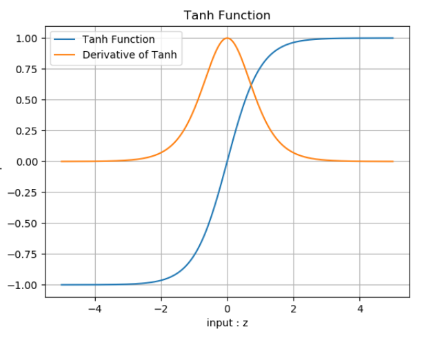

- 优点
  具有Sigmoid的所有优点。

  比起Sigmoid，Tanh减少了一个缺点，就是他本身是零均值的。
- 缺点
  exp指数计算代价大。梯度消失问题仍然存在。

##### 其他函数
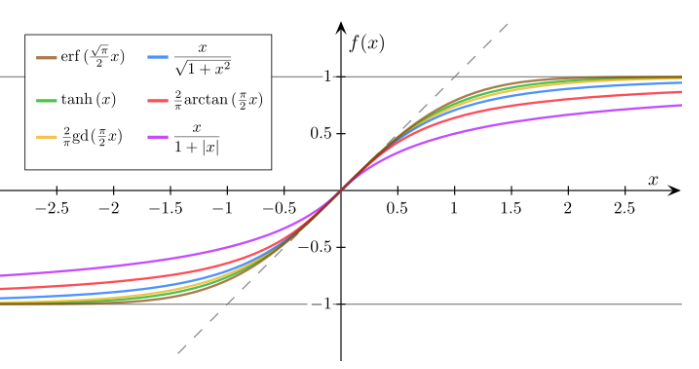

- 书本规定
1. Sigmoid，指的是对数几率函数用于激活函数时的称呼；
2. Logistic，指的是对数几率函数用于二分类函数时的称呼；
3. Tanh，指的是双曲正切函数用于激活函数时的称呼。
   
#### 4.半线性激活函数
##### ReLU函数
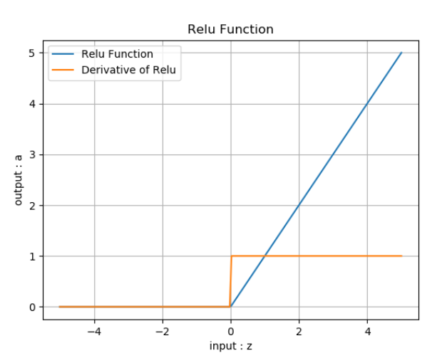
- 公式

$$ReLU(z) = max(0,z) = \begin{cases} 
  z, & z \geq 0 \\\\ 
  0, & z < 0 
\end{cases}$$

- 导数

$$ReLU'(z) = \begin{cases} 1 & z \geq 0 \\\\ 0 & z < 0 \end{cases}$$

- 值域

  输入值域：$(-\infty, \infty)$
  输出值域：$(0,\infty)$
  导数值域：$\\{0,1\\}$

- 优点

  反向导数恒等于1，更加有效率的反向传播梯度值，收敛速度快；
  避免梯度消失问题；
  计算简单，速度快；
  活跃度的分散性使得神经网络的整体计算成本下降。

- 缺点

  无界。
#####  Leaky ReLU函数
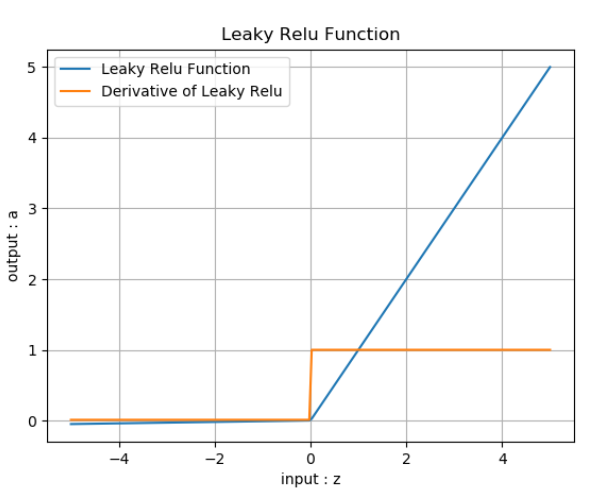
- 优点

  继承了ReLU函数的优点。

  Leaky ReLU同样有收敛快速和运算复杂度低的优点，而且由于给了$z<0$时一个比较小的梯度$\alpha$,使得$z<0$时依旧可以进行梯度传递和更新，可以在一定程度上避免神经元“死”掉的问题。

##### Softplus函数
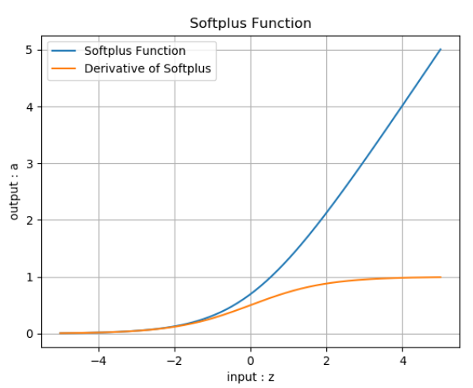

##### ELU函数
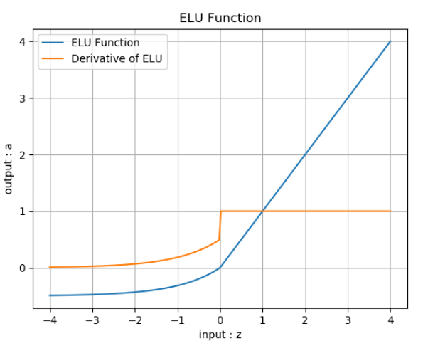
- 公式

$$ELU(z) = \begin{cases} z & z \geq 0 \\ \alpha (e^z-1) & z < 0 \end{cases}$$

- 导数

$$ELU'(z) = \begin{cases} 1 & z \geq 0 \\ \alpha e^z & z < 0 \end{cases}$$

- 值域

  输入值域：$(-\infty, \infty)$

  输出值域：$(-\alpha,\infty)$

  导数值域：$(0,1]$

## 第九章 单入单出的双层神经网络 - 非线性回归
### 1.回归模型的评估标准
- 平均绝对误差

MAE（Mean Abolute Error）。

$$MAE=\frac{1}{m} \sum_{i=1}^m \lvert a_i-y_i \rvert $$
- 绝对平均值率误差

MAPE（Mean Absolute Percentage Error）。

$$MAPE=\frac{100}{m} \sum^m_{i=1} \left\lvert {a_i - y_i \over y_i} \right\rvert $$
- 和方差

SSE（Sum Squared Error）。

$$SSE=\sum_{i=1}^m (a_i-y_i)^2 $$
- 均方差

MSE（Mean Squared Error）。

$$MSE = \frac{1}{m} \sum_{i=1}^m (a_i-y_i)^2 $$
- 均方根误差

RMSE（Root Mean Squard Error）。

$$RMSE = \sqrt{\frac{1}{m} \sum_{i=1}^m (a_i-y_i)^2} $$
### 2.用多项式回归法拟合正弦曲线
- 多元多次多项式

  多变量的非线性回归，其参数与特征组合繁复，但最终都可以归结为公式$$z = x_1 w_1 + x_2 w_2 + ...+ x_m w_m + b $$和公式$$z = x_1 w_1 + x_2 w_2 + ... + x_m w_m + b$$的形式
  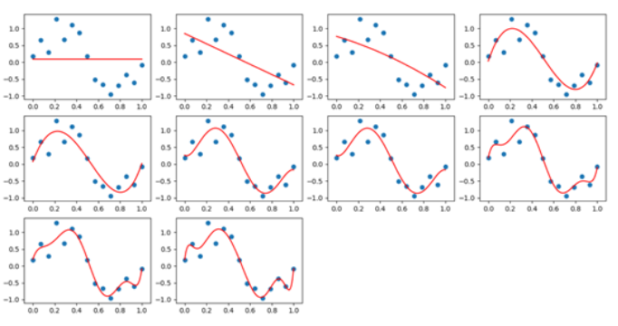

### 3.用多项式回归法拟合复合函数曲线
- 用四次多项式拟合
  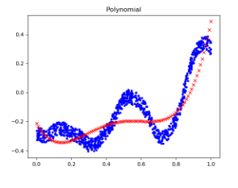
- 用六次多项式拟合
  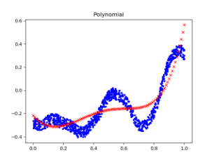
- 用八次多项式拟合
  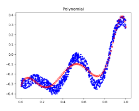

### 4.双层神经网络实现非线性回归
万能近似定理

万能近似定理(universal approximation theorem) $^{[1]}$，是深度学习最根本的理论依据。它证明了在给定网络具有足够多的隐藏单元的条件下，配备一个线性输出层和一个带有任何“挤压”性质的激活函数（如Sigmoid激活函数）的隐藏层的前馈神经网络，能够以任何想要的误差量近似任何从一个有限维度的空间映射到另一个有限维度空间的Borel可测的函数。
- 向前计算
  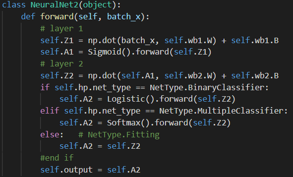
- 反向传播
  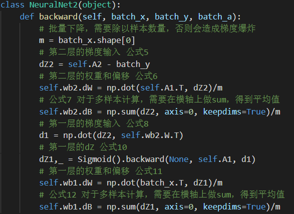

### 5.曲线拟合
- 正弦曲线的拟合
  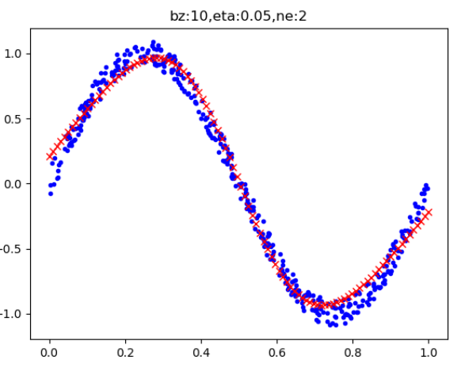
- 复合函数的拟合
  .png)

#### 避免权重矩阵初始化的影响
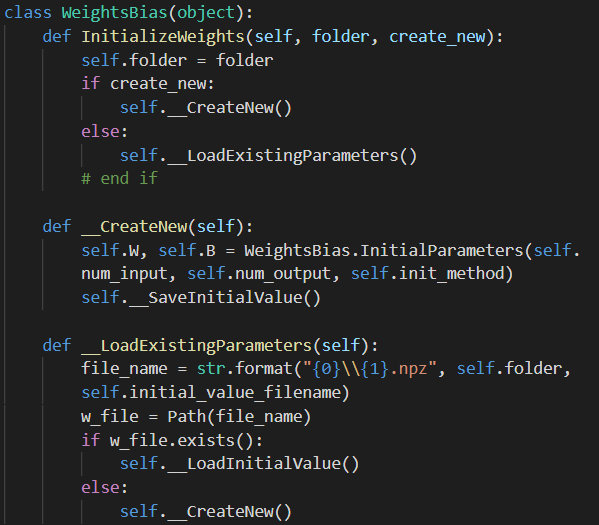

## 第10章 多入单出的双层神经网络 - 非线性二分类

### 1.定义神经网络结构
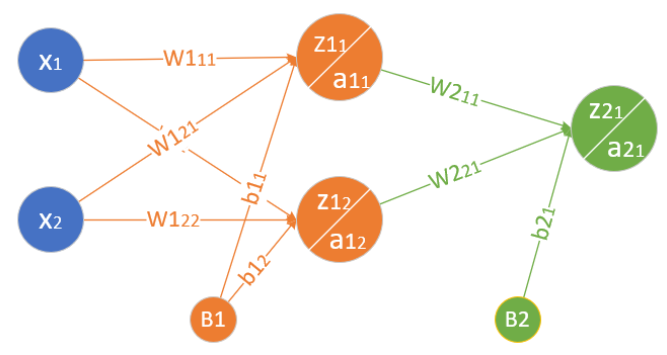
- 向前计算
  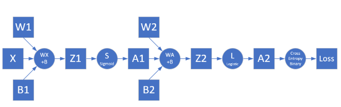
- 反向传播
  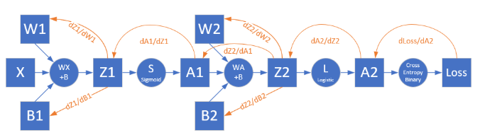

### 2.实现逻辑异或门
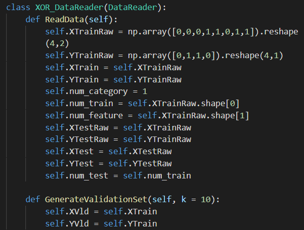
结果
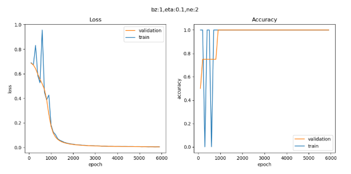
### 3.实现双弧形二分类
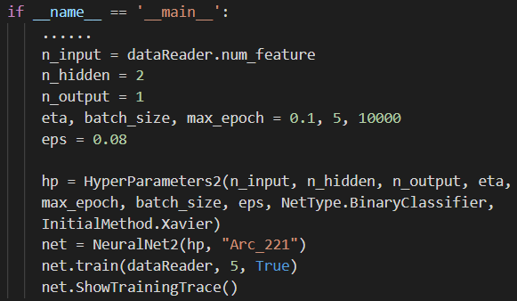
结果
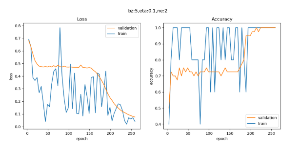
### 4.非线性多分类实现
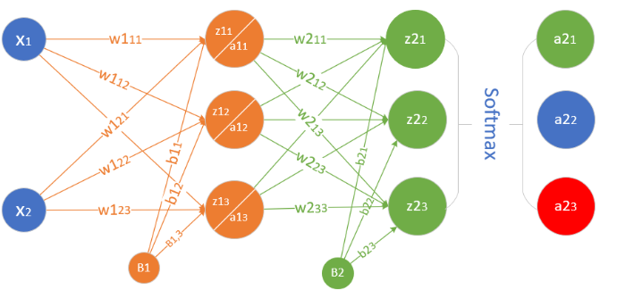
- 向前计算
  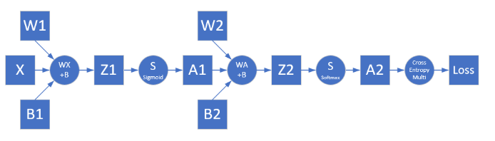
- 反向传播
  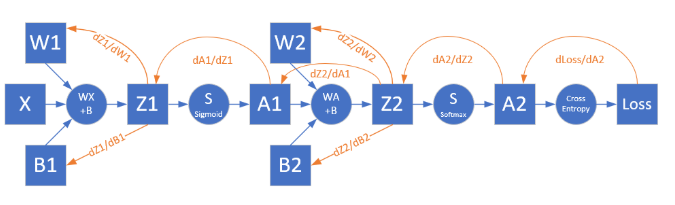

## 第十二章 多变量非线性多分类
### 1.三层神经网络的实现
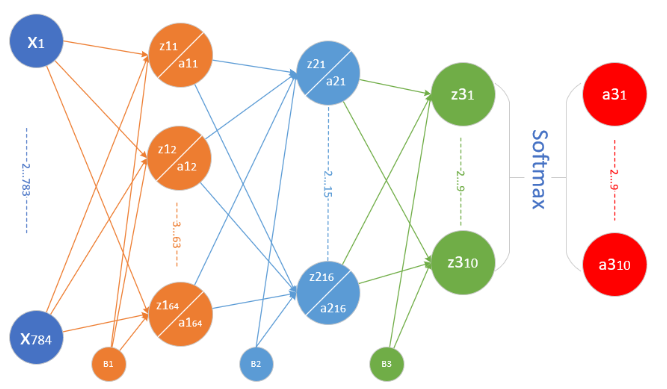
### 2.学习率与批大小
如果所有超参中，只需要调整一个参数，那么就是学习率。由此可见学习率是多么的重要，做了9.6的试验，将会发现，不论你改了批大小或是隐层神经元的数量，总会找到一个合适的学习率来适应上面的修改，最终得到理想的训练结果但是学习率是一个非常难调的参数

大的batch size可以减少迭代次数，从而减少训练时间；另一方面，大的batch size的梯度计算更稳定，曲线平滑。在一定范围内，增加batch size有助于收敛的稳定性，但是过大的batch size会使得模型的泛化能力下降，验证或测试的误差增加。

batch size的增加可以比较随意，比如从16到32、64、128等等，而学习率是有上限的，从公式2和3知道，学习率不能大于1.0，这一点就如同Sigmoid函数一样，输入值可以变化很大，但很大的输入值会得到接近于1的输出值。因此batch size和学习率的关系可以大致总结如下：

1. 增加batch size，需要增加学习率来适应，可以用线性缩放的规则，成比例放大
2. 到一定程度，学习率的增加会缩小，变成batch size的$\sqrt m$倍
3. 到了比较极端的程度，无论batch size再怎么增加，也不能增加学习率了