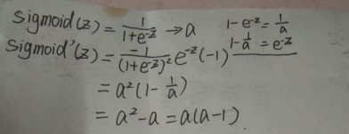
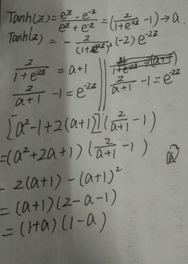
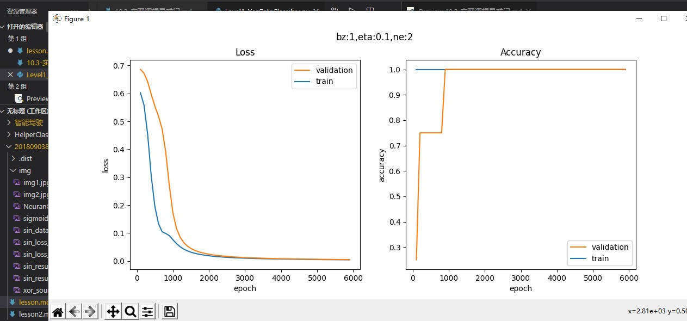
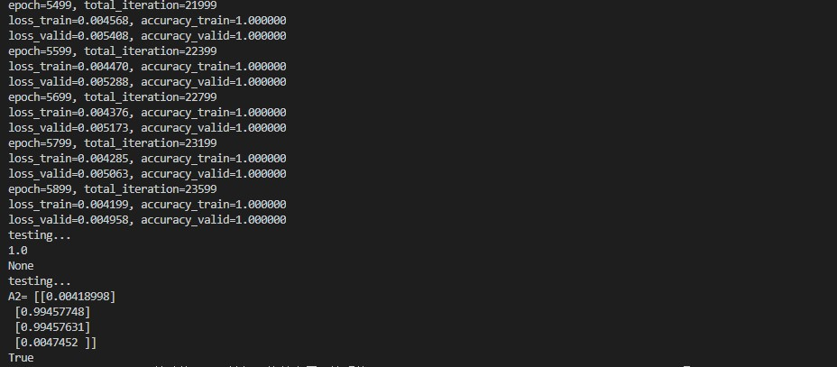

# 非线性回归

## 引入

在两层神经网络之间，必须有激活函数连接，从而加入非线性因素，提高神经网络的能力。一类是挤压型的激活函数，常用于简单网络的学习；另一类是半线性的激活函数，常用于深度网络的学习。
接下来我们将验证著名的万能近似定理，建立一个双层的神经网络，来拟合一个比较复杂的函数。
在上面的双层神经网络中，已经出现了很多的超参，都会影响到神经网络的训练结果。所以在完成了基本的拟合任务之后，我们将尝试着调试这些参数，得到又快又好的训练效果，从而得到超参调试的第一手经验。

## 激活函数

### 介绍

神经网络中的一个神经元，假设该神经元有三个输入，分别为$x_1,x_2,x_3$，那么：

$$z=x_1 w_1 + x_2 w_2 + x_3 w_3 +b \tag{1}$$
$$a = \sigma(z) \tag{2}$$


激活函数(2)
作用：

1. 给神经网络增加非线性因素
2. 把公式1的计算结果压缩到 $[0,1]$ 之间，便于后面的计算。

基本性质：非线性：线性的激活函数和没有激活函数一样；
         可导性：做误差反向传播和梯度下降，必须要保证激活函数的可导性；
         单调性：单一的输入会得到单一的输出，较大值的输入得到较大值的输出。

### 运用场景

激活函数用在神经网络的层与层之间的连接，神经网络的最后一层不用激活函数。
神经网络不管有多少层，最后的输出层决定了这个神经网络能干什么。

表8-1 单层的神经网络的参数与功能

|网络|输入|输出|激活函数|分类函数|功能|
|---|---|---|---|---|---|
|单层|单变量|单输出|无|无|线性回归|
|单层|多变量|单输出|无|无|线性回归|
|单层|多变量|单输出|无|二分类函数|二分类|
|单层|多变量|多输出|无|多分类函数|多分类|

1. 神经网络最后一层不需要激活函数
2. 激活函数只用于连接前后两层神经网络

### 挤压型激活函数

这一类函数的特点是，当输入值域的绝对值较大的时候，其输出在两端是饱和的，都具有S形的函数曲线以及压缩输入值域的作用，所以叫挤压型激活函数，又可以叫饱和型激活函数。
在英文中，通常用Sigmoid来表示，原意是S型的曲线，在数学中是指一类具有压缩作用的S型的函数，在神经网络中，有两个常用的Sigmoid函数，一个是Logistic函数，另一个是Tanh函数。下面我们分别来讲解它们。


### Logistic函数

对数几率函数（Logistic Function，简称对率函数）。

很多文字材料中通常把激活函数和分类函数混淆在一起说，有一个原因是：在二分类任务中最后一层使用的对率函数与在神经网络层与层之间连接的Sigmoid激活函数，是同样的形式。所以它既是激活函数，又是分类函数，是个特例。

对这个函数的叫法比较混乱，在本书中我们约定一下，凡是用到“Logistic”词汇的，指的是二分类函数；而用到“Sigmoid”词汇的，指的是本激活函数。

**公式**
$$Sigmoid(z) = \frac{1}{1 + e^{-z}} \rightarrow a \tag{1}$$

**导数**
$$Sigmoid'(z) = a(1 - a) \tag{2}$$

注意，如果是矩阵运算的话，需要在公式2中使用$\odot$符号表示按元素的矩阵相乘：$a\odot (1-a)$，后面不再强调。

**值域**

- 输入值域：$(-\infty, \infty)$
- 输出值域：$(0,1)$
- 导数值域：$(0,0.25]$


**优点**

从函数图像来看，Sigmoid函数的作用是将输入压缩到 $(0,1)$ 这个区间范围内，这种输出在0~1之间的函数可以用来模拟一些概率分布的情况。它还是一个连续函数，导数简单易求。  

从数学上来看，Sigmoid函数对中央区的信号增益较大，对两侧区的信号增益小，在信号的特征空间映射上，有很好的效果。 

从神经科学上来看，中央区酷似神经元的兴奋态，两侧区酷似神经元的抑制态，因而在神经网络学习方面，可以将重点特征推向中央区，
将非重点特征推向两侧区。

分类功能：我们经常听到这样的对白：

- 甲：“你觉得这件事情成功概率有多大？”
- 乙：“我有六成把握能成功。”

Sigmoid函数在这里就起到了如何把一个数值转化成一个通俗意义上的“把握”的表示。z坐标值越大，经过Sigmoid函数之后的结果就越接近1，把握就越大。

**缺点**

指数计算代价大。

反向传播时梯度消失：从梯度图像中可以看到，Sigmoid的梯度在两端都会接近于0，根据链式法则，如果传回的误差是$\delta$，那么梯度传递函数是$\delta \cdot a'$，而$a'$这时接近零，也就是说整体的梯度也接近零。这就出现梯度消失的问题，并且这个问题可能导致网络收敛速度比较慢。

给个纯粹数学的例子，假定我们的学习速率是0.2，Sigmoid函数值是0.9（处于饱和区了），如果我们想把这个函数的值降到0.5，需要经过多少步呢？

我们先来做数值计算：

1. 求出当前输入的值

$$a=\frac{1}{1 + e^{-z}} = 0.9$$
$$z = \ln{9}$$

2. 求出当前梯度

$$\delta = a \times (1 - a) = 0.9 \times 0.1= 0.09$$

3. 根据梯度更新当前输入值

$$z_{new} = z - \eta \times \delta = \ln{9} - 0.2 \times 0.09 = \ln(9) - 0.018$$

4. 判断当前函数值是否接近0.5

$$a=\frac{1}{1 + e^{-z_{new}}} = 0.898368$$

5. 重复步骤2-3，直到当前函数值接近0.5

如果用一个程序来计算的话，需要迭代67次，才可以从0.9趋近0.5。如果对67次这个数字没概念的话，读者可以参看8.2节中关于ReLU函数的相关介绍。

此外，如果输入数据是(-1, 1)范围内的均匀分布的数据会导致什么样的结果呢？经过Sigmoid函数处理之后这些数据的均值就从0变到了0.5，导致了均值的漂移，在很多应用中，这个性质是不好的。

### Tanh函数

公式  
$$Tanh(z) = \frac{e^{z} - e^{-z}}{e^{z} + e^{-z}} = (\frac{2}{1 + e^{-2z}}-1) \rightarrow a \tag{3}$$
即



$$Tanh'(z) = (1 + a)(1 - a)$$

**值域**

- 输入值域：$(-\infty,\infty)$
- 输出值域：$(-1,1)$
- 导数值域：$(0,1)$

函数图像

图8-4是双曲正切的函数图像。


图8-4 双曲正切函数图像

**优点**

具有Sigmoid的所有优点。

无论从理论公式还是函数图像，这个函数都是一个和Sigmoid非常相像的激活函数，他们的性质也确实如此。但是比起Sigmoid，Tanh减少了一个缺点，就是他本身是零均值的，也就是说，在传递过程中，输入数据的均值并不会发生改变，这就使他在很多应用中能表现出比Sigmoid优异一些的效果。

**缺点**

exp指数计算代价大。梯度消失问题仍然存在。

### 半线性激活函数

又可以叫非饱和型激活函数。

#### 8.2.1 ReLU函数 

Rectified Linear Unit，修正线性单元，线性整流函数，斜坡函数。

**公式**

$$ReLU(z) = max(0,z) = \begin{cases} 
  z, & z \geq 0 \\\\ 
  0, & z < 0 
\end{cases}$$

**导数**

$$ReLU'(z) = \begin{cases} 1 & z \geq 0 \\\\ 0 & z < 0 \end{cases}$$

**值域**

- 输入值域：$(-\infty, \infty)$
- 输出值域：$(0,\infty)$
- 导数值域：$\\{0,1\\}$


图8-6 线性整流函数ReLU

**优点**

- 反向导数恒等于1，更加有效率的反向传播梯度值，收敛速度快；
- 避免梯度消失问题；
- 计算简单，速度快；
- 活跃度的分散性使得神经网络的整体计算成本下降。

**缺点**

无界。

梯度很大的时候可能导致的神经元“死”掉。

这个死掉的原因是什么呢？是因为很大的梯度导致更新之后的网络传递过来的输入是小于零的，从而导致ReLU的输出是0，计算所得的梯度是零，然后对应的神经元不更新，从而使ReLU输出恒为零，对应的神经元恒定不更新，等于这个ReLU失去了作为一个激活函数的作用。问题的关键点就在于输入小于零时，ReLU回传的梯度是零，从而导致了后面的不更新。在学习率设置不恰当的情况下，很有可能网络中大部分神经元“死”掉，也就是说不起作用了。

### 8.2.2 Leaky ReLU函数

LReLU，带泄露的线性整流函数。

#### 公式

$$LReLU(z) = \begin{cases} z & z \geq 0 \\\\ \alpha \cdot z & z < 0 \end{cases}$$

#### 导数

$$LReLU'(z) = \begin{cases} 1 & z \geq 0 \\\\ \alpha & z < 0 \end{cases}$$

#### 值域

输入值域：$(-\infty, \infty)$

输出值域：$(-\infty,\infty)$

导数值域：$\\{\alpha,1\\}$

#### 函数图像

函数图像如图8-7所示。


图8-7 LeakyReLU的函数图像

#### 优点

继承了ReLU函数的优点。

Leaky ReLU同样有收敛快速和运算复杂度低的优点，而且由于给了$z<0$时一个比较小的梯度$\alpha$,使得$z<0$时依旧可以进行梯度传递和更新，可以在一定程度上避免神经元“死”掉的问题。

#### Softplus函数

**公式**

$$Softplus(z) = \ln (1 + e^z)$$

**导数**

$$Softplus'(z) = \frac{e^z}{1 + e^z}$$

输入值域：$(-\infty, \infty)$

输出值域：$(0,\infty)$

导数值域：$(0,1)$

**函数图像**

Softplus的函数图像如图8-8所示。


图8-8 Softplus的函数图像

#### ELU函数

**公式**

$$ELU(z) = \begin{cases} z & z \geq 0 \\ \alpha (e^z-1) & z < 0 \end{cases}$$

**导数**

$$ELU'(z) = \begin{cases} 1 & z \geq 0 \\ \alpha e^z & z < 0 \end{cases}$$

**值域**

输入值域：$(-\infty, \infty)$

输出值域：$(-\alpha,\infty)$

导数值域：$(0,1]$

**函数图像**

ELU的函数图像如图8-9所示。


图8-9 ELU的函数图像

# 9.0 非线性回归问题

## 提出问题一

我们在第5章学习了线性回归的解决方案，但是在工程实践中，我们最常遇到不是线性问题，而是非线性问题，例如图9-1所示的正弦曲线，表9-1给出了部分样本点示例。


图9-1 成正弦曲线分布的样本点

其样本数据如表9-1所示。

表9-1 成正弦曲线分布的样本值

|样本|x|y|
|---|---|---|
|1|0.1199|0.6108|
|2|0.0535|0.3832|
|3|0.6978|0.9496|
|...|...|...|

问题：如何使用神经网络拟合一条有很强规律的曲线，比如正弦曲线？

## 提出问题二

前面的正弦函数，看上去是非常有规律的，也许单层神经网络很容易就做到了。如果是更复杂的曲线，单层神经网络还能轻易做到吗？比如图9-2所示的样本点和表9-2的所示的样本值，如何使用神经网络方法来拟合这条曲线？


图9-2 复杂曲线样本可视化

表9-2 复杂曲线样本数据

|样本|x|y|
|---|---|---|
|1|0.606|-0.113|
|2|0.129|-0.269|
|3|0.582|0.027|
|...|...|...|
|1000|0.199|-0.281|

原则上说，如果你有足够的耐心，愿意花很高的时间成本和计算资源，总可以用多项式回归的方式来解决这个问题，但是，在本章，我们将会学习另外一个定理：前馈神经网络的通用近似定理。

上面这条“蛇形”曲线，实际上是由下面这个公式添加噪音后生成的：

$$y=0.4x^2 + 0.3x\sin(15x) + 0.01\cos(50x)-0.3$$

我们特意把数据限制在[0,1]之间，避免做归一化的麻烦。要是觉得这个公式还不够复杂，大家可以用更复杂的公式去自己做试验。

以上问题可以叫做非线性回归，即自变量X和因变量Y之间不是线性关系。常用的传统的处理方法有线性迭代法、分段回归法、迭代最小二乘法等。在神经网络中，解决这类问题的思路非常简单，就是使用带有一个隐层的两层神经网络。

## 平均绝对误差

MAE（Mean Abolute Error）。

$$MAE=\frac{1}{m} \sum_{i=1}^m \lvert a_i-y_i \rvert \tag{1}$$

对异常值不如均方差敏感，类似中位数。

## 绝对平均值率误差

MAPE（Mean Absolute Percentage Error）。

$$MAPE=\frac{100}{m} \sum^m_{i=1} \left\lvert {a_i - y_i \over y_i} \right\rvert \tag{2}$$

## 和方差

SSE（Sum Squared Error）。

$$SSE=\sum_{i=1}^m (a_i-y_i)^2 \tag{3}$$

得出的值与样本数量有关系，假设有1000个测试样本，得到的值是120；如果只有100个测试样本，得到的值可能是11，我们不能说11就比120要好。

## 均方差

MSE（Mean Squared Error）。

$$MSE = \frac{1}{m} \sum_{i=1}^m (a_i-y_i)^2 \tag{4}$$

就是实际值减去预测值的平方再求期望，没错，就是线性回归的代价函数。由于MSE计算的是误差的平方，所以它对异常值是非常敏感的，因为一旦出现异常值，MSE指标会变得非常大。MSE越小，证明误差越小。

## 均方根误差

RMSE（Root Mean Squard Error）。

$$RMSE = \sqrt{\frac{1}{m} \sum_{i=1}^m (a_i-y_i)^2} \tag{5}$$

是均方差开根号的结果，其实质是一样的，只不过对结果有更好的解释。

## R平方

R-Squared。

上面的几种衡量标准针对不同的模型会有不同的值。比如说预测房价，那么误差单位就是元，比如3000元、11000元等。如果预测身高就可能是0.1、0.2米之类的。也就是说，对于不同的场景，会有不同量纲，因而也会有不同的数值，无法用一句话说得很清楚，必须啰啰嗦嗦带一大堆条件才能表达完整。

我们通常用概率来表达一个准确率，比如89%的准确率。那么线性回归有没有这样的衡量标准呢？答案就是R-Squared。

$$R^2=1-\frac{\sum (a_i - y_i)^2}{\sum(\bar y_i-y_i)^2}=1-\frac{MSE(a,y)}{Var(y)} \tag{6}$$

R平方是多元回归中的回归平方和（分子）占总平方和（分母）的比例，它是度量多元回归方程中拟合程度的一个统计量。R平方值越接近1，表明回归平方和占总平方和的比例越大，回归线与各观测点越接近，回归的拟合程度就越好。

- 如果结果是0，说明模型跟瞎猜差不多；
- 如果结果是1，说明模型无错误；
- 如果结果是0-1之间的数，就是模型的好坏程度；
- 如果结果是负数，说明模型还不如瞎猜。

## 用多项式回归法拟合正弦曲线

### 多项式回归的概念

多项式回归有几种形式：

#### 一元一次线性模型

因为只有一项，所以不能称为多项式了。它可以解决单变量的线性回归，我们在第4章学习过相关内容。其模型为：

$$z = x w + b \tag{1}$$

#### 多元一次多项式

多变量的线性回归，我们在第5章学习过相关内容。其模型为：

$$z = x_1 w_1 + x_2 w_2 + ...+ x_m w_m + b \tag{2}$$

这里的多变量，是指样本数据的特征值为多个，上式中的 $x_1,x_2,...,x_m$ 代表了m个特征值。

#### 一元多次多项式

单变量的非线性回归，比如上面这个正弦曲线的拟合问题，很明显不是线性问题，但是只有一个 $x$ 特征值，所以不满足前两种形式。如何解决这种问题呢？

有一个定理：任意一个函数在一个较小的范围内，都可以用多项式任意逼近。因此在实际工程实践中，有时候可以不管 $y$ 值与 $x$ 值的数学关系究竟是什么，而是强行用回归分析方法进行近似的拟合。

那么如何得到更多的特征值呢？对于只有一个特征值的问题，人们发明了一种聪明的办法，就是把特征值的高次方作为另外的特征值，加入到回归分析中，用公式描述：

$$z = x w_1 + x^2 w_2 + ... + x^m w_m + b \tag{3}$$

上式中x是原有的唯一特征值，$x^m$ 是利用 $x$ 的 $m$ 次方作为额外的特征值，这样就把特征值的数量从 $1$ 个变为 $m$ 个。

换一种表达形式，令：$x_1 = x,x_2=x^2,\ldots,x_m=x^m$，则：

$$z = x_1 w_1 + x_2 w_2 + ... + x_m w_m + b \tag{4}$$

可以看到公式4和上面的公式2是一样的，所以解决方案也一样。

#### 多元多次多项式

多变量的非线性回归，其参数与特征组合繁复，但最终都可以归结为公式2和公式4的形式。

# 定义神经网络结构

本节的目的是要用神经网络完成图9-1和图9-2中的曲线拟合。

根据万能近似定理的要求，我们定义一个两层的神经网络，输入层不算，一个隐藏层，含3个神经元，一个输出层。图9-7显示了此次用到的神经网络结构。


图9-7 单入单出的双层神经网络

为什么用3个神经元呢？这也是笔者经过多次试验的最佳结果。因为输入层只有一个特征值，我们不需要在隐层放很多的神经元，先用3个神经元试验一下。如果不够的话再增加，神经元数量是由超参控制的。

## 输入层

输入层就是一个标量x值，如果是成批输入，则是一个矢量或者矩阵，但是特征值数量总为1，因为只有一个横坐标值做为输入。

$$X = (x)$$

## 权重矩阵W1/B1

$$
W1=
\begin{pmatrix}
w1_{11} & w1_{12} & w1_{13}
\end{pmatrix}
$$

$$
B1=
\begin{pmatrix}
b1_{1} & b1_{2} & b1_{3} 
\end{pmatrix}
$$

## 隐层

我们用3个神经元：

$$
Z1 = \begin{pmatrix}
    z1_1 & z1_2 & z1_3
\end{pmatrix}
$$

$$
A1 = \begin{pmatrix}
    a1_1 & a1_2 & a1_3
\end{pmatrix}
$$


## 权重矩阵W2/B2

W2的尺寸是3x1，B2的尺寸是1x1。

$$
W2=
\begin{pmatrix}
w2_{11} \\\\
w2_{21} \\\\
w2_{31}
\end{pmatrix}
$$

$$
B2=
\begin{pmatrix}
b2_{1}
\end{pmatrix}
$$

## 输出层

由于我们只想完成一个拟合任务，所以输出层只有一个神经元，尺寸为1x1：

$$
Z2 = 
\begin{pmatrix}
    z2_{1}
\end{pmatrix}
$$

## 前向计算

根据图9-7的网络结构，我们可以得到如图9-8的前向计算图。


图9-8 前向计算图

## 隐层

- 线性计算

$$
z1_{1} = x \cdot w1_{11} + b1_{1}
$$

$$
z1_{2} = x \cdot w1_{12} + b1_{2}
$$

$$
z1_{3} = x \cdot w1_{13} + b1_{3}
$$

矩阵形式：

$$
\begin{aligned}
Z1 &=x \cdot 
\begin{pmatrix}
    w1_{11} & w1_{12} & w1_{13}
\end{pmatrix}
+
\begin{pmatrix}
    b1_{1} & b1_{2} & b1_{3}
\end{pmatrix}
 \\\\
&= X \cdot W1 + B1  
\end{aligned} \tag{1}
$$

- 激活函数

$$
a1_{1} = Sigmoid(z1_{1})
$$

$$
a1_{2} = Sigmoid(z1_{2})
$$

$$
a1_{3} = Sigmoid(z1_{3})
$$

矩阵形式：

$$
A1 = Sigmoid(Z1) \tag{2}
$$

## 输出层

由于我们只想完成一个拟合任务，所以输出层只有一个神经元：

$$
\begin{aligned}
Z2&=a1_{1}w2_{11}+a1_{2}w2_{21}+a1_{3}w2_{31}+b2_{1} \\\\
&= 
\begin{pmatrix}
a1_{1} & a1_{2} & a1_{3}
\end{pmatrix}
\begin{pmatrix}
w2_{11} \\\\ w2_{21} \\\\ w2_{31}
\end{pmatrix}
+b2_1 \\\\
&=A1 \cdot W2+B2
\end{aligned} \tag{3}
$$

## 损失函数

均方差损失函数：

$$loss(w,b) = \frac{1}{2} (z2-y)^2 \tag{4}$$

其中，$z2$是预测值，$y$是样本的标签值。

## 反向传播

我们比较一下本章的神经网络和第5章的神经网络的区别，看表9-13。

表9-13 本章中的神经网络与第5章的神经网络的对比

|第5章的神经网络|本章的神经网络|
|---|---|
|||

本章使用了真正的“网络”，而第5章充其量只是一个神经元而已。再看本章的网络的右半部分，从隐层到输出层的结构，和第5章的神经元结构一摸一样，只是输入为3个特征，而第5章的输入为两个特征。比较正向计算公式的话，也可以得到相同的结论。这就意味着反向传播的公式应该也是一样的。

由于我们第一次接触双层神经网络，所以需要推导一下反向传播的各个过程。看一下计算图，然后用链式求导法则反推。

##求损失函数对输出层的反向误差

根据公式4：

$$
\frac{\partial loss}{\partial z2} = z2 - y \rightarrow dZ2 \tag{5}
$$

### 求W2的梯度

根据公式3和W2的矩阵形状，把标量对矩阵的求导分解到矩阵中的每一元素：

$$
\begin{aligned}
\frac{\partial loss}{\partial W2} &= 
\begin{pmatrix}
    \frac{\partial loss}{\partial z2}\frac{\partial z2}{\partial w2_{11}} \\\\
    \frac{\partial loss}{\partial z2}\frac{\partial z2}{\partial w2_{21}} \\\\
    \frac{\partial loss}{\partial z2}\frac{\partial z2}{\partial w2_{31}}
\end{pmatrix}
\begin{pmatrix}
    dZ2 \cdot a1_{1} \\\\
    dZ2 \cdot a1_{2} \\\\
    dZ2 \cdot a1_{3}
\end{pmatrix} \\\\
&=\begin{pmatrix}
    a1_{1} \\\\ a1_{2} \\\\ a1_{3}
\end{pmatrix} \cdot dZ2
=A1^{\top} \cdot dZ2 \rightarrow dW2
\end{aligned} \tag{6}
$$

### 求B2的梯度

$$
\frac{\partial loss}{\partial B2}=dZ2 \rightarrow dB2 \tag{7}
$$

与第5章相比，除了把X换成A以外，其它的都一样。对于输出层来说，A就是它的输入，也就相当于是X。

### 求损失函数对隐层的反向误差

下面的内容是双层神经网络独有的内容，也是深度神经网络的基础，请大家仔细阅读体会。我们先看看正向计算和反向计算图，即图9-9。


图9-9 正向计算和反向传播路径图

图9-9中：

- 蓝色矩形表示数值或矩阵；
- 蓝色圆形表示计算单元；
- 蓝色的箭头表示正向计算过程；
- 红色的箭头表示反向计算过程。

如果想计算W1和B1的反向误差，必须先得到Z1的反向误差，再向上追溯，可以看到Z1->A1->Z2->Loss这条线，Z1->A1是一个激活函数的运算，比较特殊，所以我们先看Loss->Z->A1如何解决。

根据公式3和A1矩阵的形状：

$$
\begin{aligned}
\frac{\partial loss}{\partial A1}&=
\begin{pmatrix}
    \frac{\partial loss}{\partial Z2}\frac{\partial Z2}{\partial a1_{11}}
    &
    \frac{\partial loss}{\partial Z2}\frac{\partial Z2}{\partial a1_{12}}
    &
    \frac{\partial loss}{\partial Z2}\frac{\partial Z2}{\partial a1_{13}}
\end{pmatrix} \\\\
&=
\begin{pmatrix}
dZ2 \cdot w2_{11} & dZ2 \cdot w2_{12} & dZ2 \cdot w2_{13}
\end{pmatrix} \\\\
&=dZ2 \cdot
\begin{pmatrix}
    w2_{11} & w2_{21} & w2_{31}
\end{pmatrix} \\\\
&=dZ2 \cdot
\begin{pmatrix}
    w2_{11} \\\\ w2_{21} \\\\ w2_{31}
\end{pmatrix}^{\top}=dZ2 \cdot W2^{\top}
\end{aligned} \tag{8}
$$

现在来看激活函数的误差传播问题，由于公式2在计算时，并没有改变矩阵的形状，相当于做了一个矩阵内逐元素的计算，所以它的导数也应该是逐元素的计算，不改变误差矩阵的形状。根据Sigmoid激活函数的导数公式，有：

$$
\frac{\partial A1}{\partial Z1}= Sigmoid'(A1) = A1 \odot (1-A1) \tag{9}
$$

所以最后到达Z1的误差矩阵是：

$$
\begin{aligned}
\frac{\partial loss}{\partial Z1}&=\frac{\partial loss}{\partial A1}\frac{\partial A1}{\partial Z1} \\\\
&=dZ2 \cdot W2^T \odot Sigmoid'(A1) \rightarrow dZ1
\end{aligned} \tag{10}
$$

有了dZ1后，再向前求W1和B1的误差，就和第5章中一样了，我们直接列在下面：

$$
dW1=X^T \cdot dZ1 \tag{11}
$$

$$
dB1=dZ1 \tag{12}
$$

## 用多项式回归法拟合正弦曲线

### 用二次多项式拟合

鉴于以上的认知，我们要考虑使用几次的多项式来拟合正弦曲线。在没有什么经验的情况下，可以先试一下二次多项式，即：

$$z = x w_1 + x^2 w_2 + b \tag{5}$$

#### 数据增强

在ch08.train.npz中，读出来的XTrain数组，只包含1列x的原始值，根据公式5，我们需要再增加一列x的平方值，所以代码如下：

```Python
import numpy as np
import matplotlib.pyplot as plt

from HelperClass.NeuralNet import *
from HelperClass.SimpleDataReader import *
from HelperClass.HyperParameters import *

file_name = "../../data/ch08.train.npz"

class DataReaderEx(SimpleDataReader):
    def Add(self):
        X = self.XTrain[:,]**2
        self.XTrain = np.hstack((self.XTrain, X))
```

从SimpleDataReader类中派生出子类DataReaderEx，然后添加Add()方法，先计算XTrain第一列的平方值放入矩阵X中，然后再把X合并到XTrain右侧，这样XTrain就变成了两列，第一列是x的原始值，第二列是x的平方值。

#### 主程序

在主程序中，先加载数据，做数据增强，然后建立一个net，参数num_input=2，对应着XTrain中的两列数据，相当于两个特征值，

```Python
if __name__ == '__main__':
    dataReader = DataReaderEx(file_name)
    dataReader.ReadData()
    dataReader.Add()
    print(dataReader.XTrain.shape)

    # net
    num_input = 2
    num_output = 1
    params = HyperParameters(num_input, num_output, eta=0.2, max_epoch=10000, batch_size=10, eps=0.005, net_type=NetType.Fitting)
    net = NeuralNet(params)
    net.train(dataReader, checkpoint=10)
    ShowResult(net, dataReader, params.toString())
```

#### 运行结果

|损失函数值|拟合结果|
|---|---|
|||

#### 用三次多项式拟合

三次多项式的公式：

$$z = x w_1 + x^2 w_2 + x^3 w_3 + b \tag{6}$$

在二次多项式的基础上，把训练数据的再增加一列x的三次方，作为一个新的特征。以下为数据增强代码：

```Python
class DataReaderEx(SimpleDataReader):
    def Add(self):
        X = self.XTrain[:,]**2
        self.XTrain = np.hstack((self.XTrain, X))
        X = self.XTrain[:,0:1]**3
        self.XTrain = np.hstack((self.XTrain, X))
```
同时修改主过程参数中的num_input值：

```Python
    num_input = 3
```

再次运行：

|损失函数值|拟合结果|
|---|---|
|||
#### 双层神经网络实现非线性回归
#### 定义神经网络结构

通过观察样本数据的范围，x是在[0,1]，y是[-0.5,0.5]，这样我们就不用做数据归一化了。这条线看起来像一条处于攻击状态的眼镜蛇！由于是拟合任务，所以标签值y是一系列的实际数值，并不是0/1这样的特殊标记。

根据万能近似定理的要求，我们定义一个两层的神经网络，输入层不算，一个隐藏层，含3个神经元，一个输出层。

为什么用3个神经元呢？因为输入层只有一个特征值，我们不需要在隐层放很多的神经元，先用3个神经元试验一下。如果不够的话再增加，神经元数量是由超参控制的。


#### 输入层

输入层就是一个标量x值。

$$X = (x)$$

#### 权重矩阵W1/B1

$$
W1=
\begin{pmatrix}
w^1_{11} & w^1_{12} & w^1_{13}
\end{pmatrix}
$$

$$
B1=
\begin{pmatrix}
b^1_{1} & b^1_{2} & b^1_{3} 
\end{pmatrix}
$$

#### 隐层

我们用3个神经元：

$$
Z1 = \begin{pmatrix}
    z^1_1 & z^1_2 & z^1_3
\end{pmatrix}
$$

$$
A1 = \begin{pmatrix}
    a^1_1 & a^1_2 & a^1_3
\end{pmatrix}
$$


#### 权重矩阵W2/B2

W2的尺寸是3x1，B2的尺寸是1x1。
$$
W2=
\begin{pmatrix}
w^2_{11} \\
w^2_{21} \\
w^2_{31}
\end{pmatrix}
$$

$$
B2=
\begin{pmatrix}
b^2_{1}
\end{pmatrix}
$$

#### 输出层

由于我们只想完成一个拟合任务，所以输出层只有一个神经元：

$$
Z2 = 
\begin{pmatrix}
    z^2_{1}
\end{pmatrix}
$$
#### 代码实现

主要是神经网络NeuralNet2类的代码，其它的类都是辅助类。

#### 前向计算

```Python
class NeuralNet2(object):
    def forward(self, batch_x):
        # layer 1
        self.Z1 = np.dot(batch_x, self.wb1.W) + self.wb1.B
        self.A1 = Sigmoid().forward(self.Z1)
        # layer 2
        self.Z2 = np.dot(self.A1, self.wb2.W) + self.wb2.B
        if self.hp.net_type == NetType.BinaryClassifier:
            self.A2 = Logistic().forward(self.Z2)
        elif self.hp.net_type == NetType.MultipleClassifier:
            self.A2 = Softmax().forward(self.Z2)
        else:   # NetType.Fitting
            self.A2 = self.Z2
        #end if
        self.output = self.A2
```

在Layer2中考虑了多种网络类型，在此我们暂时只关心NetType.Fitting类型。

#### 反向传播

```Python
class NeuralNet2(object):
    def backward(self, batch_x, batch_y, batch_a):
        # 批量下降，需要除以样本数量，否则会造成梯度爆炸
        m = batch_x.shape[0]
        # 第二层的梯度输入 
        dZ2 = self.A2 - batch_y
        # 第二层的权重和偏移 
        self.wb2.dW = np.dot(self.A1.T, dZ2)/m 
        # 对于多样本计算，需要在横轴上做sum，得到平均值
        self.wb2.dB = np.sum(dZ2, axis=0, keepdims=True)/m 
        # 第一层的梯度输入 
        d1 = np.dot(dZ2, self.wb2.W.T) 
        # 第一层的dZ 
        dZ1,_ = Sigmoid().backward(None, self.A1, d1)
        # 第一层的权重和偏移 
        self.wb1.dW = np.dot(batch_x.T, dZ1)/m
        # 对于多样本计算，需要在横轴上做sum，得到平均值
        self.wb1.dB = np.sum(dZ1, axis=0, keepdims=True)/m 
```

# 非线性分类

## 引入

在很多年前，两位著名的学者证明了感知机无法解决逻辑中的异或问题，从而使感知机这个研究领域陷入了长期的停滞。我们将会在使用双层网络解决异或问题。
异或问题是个简单的二分类问题，因为毕竟只有4个样本数据，我们会用更复杂的数据样本来学习非线性多分类问题，并理解其工作原理。
然后我们将会用一个稍微复杂些的二分类例子，来说明在二维平面上，神经网络是通过怎样的神奇的线性变换加激活函数压缩，把线性不可分的问题转化为线性可分问题的。
解决完二分类问题，我们将学习如何解决更复杂的三分类问题，由于样本的复杂性，必须在隐层使用多个神经元才能完成分类任务。
最后我们将搭建一个三层神经网络，来解决MNIST手写数字识别问题，并学习使用梯度检查来帮助我们测试反向传播代码的正确性。
数据集的使用，是深度学习的一个基本技能，开发集、验证集、测试集，合理地使用才能得到理想的泛化能力强的模型。

## 非线性二分类问题

### 概念

无法使用单层网络（当时称为感知器）来表示最基本的异或逻辑功能。

- 从复杂程度上分，有线性/非线性之分
- 从样本类别上分，有二分类/多分类之分

|XOR问题|弧形问题|
|---|---|
|||

简单证明异或问题的不可能性

用单个感知机或者单层神经网络，是否能完成异或任务呢？我们自己做个简单的证明。先看样本数据，如表10-4。

表10-4 异或的样本数据

|样本|$x_1$|$x_2$|$y$|
|---|---|---|---|
|1|0|0|0|
|2|0|1|1|
|3|1|0|1|
|4|1|1|0|

前向计算公式：

$$z = x_1  w_1 + x_2  w_2 + b \tag{1}$$
$$a = Logistic(z) \tag{2}$$

- 对于第一个样本数据

$x_1=0,x_2=0,y=0$。如果需要$a=y$的话，从Logistic函数曲线看，需要$z<0$，于是有：

$$x_1 w_1 + x_2  w_2 + b < 0$$

因为$x_1=0,x_2=0$，所以只剩下$b$项：

$$b < 0 \tag{3}$$

- 对于第二个样本数据

$x_1=0,x_2=1,y=1$。如果需要$a=y$，则要求$z>0$，不等式为：

$$x_1w_1 + x_2w_2+b=w_2+b > 0 \tag{4}$$

- 对于第三个样本数据

$x_1=1,x_2=0,y=1$。如果需要$a=y$，则要求$z>0$，不等式为：

$$x_1w_1 + x_2w_2+b=w_1+b > 0 \tag{5}$$

- 对于第四个样本

$x_1=1,x_2=1,y=0$。如果需要$a=y$，则要求$z<0$，不等式为：

$$x_1w_1 + x_2w_2+b=w_1+w_2+b < 0 \tag{6}$$

把公式6两边都加$b$，并把公式3接续：

$$(w_1 + b) + (w_2 + b) < b < 0 \tag{7}$$

再看公式4、5，不等式左侧括号内的两个因子都大于0，其和必然也大于0，不可能小于$b$。因此公式7不成立，无论如何也不能满足所有的4个样本的条件，所以单个神经元做异或运算是不可能的。


## 非线性二分类实现

### 定义神经网络结构

首先定义可以完成非线性二分类的神经网络结构图，如图10-6所示。


图10-6 非线性二分类神经网络结构图

- 输入层两个特征值$x_1,x_2$
  $$
  X=\begin{pmatrix}
    x_1 & x_2
  \end{pmatrix}
  $$
- 隐层$2\times 2$的权重矩阵$W1$
$$
  W1=\begin{pmatrix}
    w1_{11} & w1_{12} \\\\
    w1_{21} & w1_{22} 
  \end{pmatrix}
$$
- 隐层$1\times 2$的偏移矩阵$B1$

$$
  B1=\begin{pmatrix}
    b1_{1} & b1_{2}
  \end{pmatrix}
$$

- 隐层由两个神经元构成
$$
Z1=\begin{pmatrix}
  z1_{1} & z1_{2}
\end{pmatrix}
$$
$$
A1=\begin{pmatrix}
  a1_{1} & a1_{2}
\end{pmatrix}
$$
- 输出层$2\times 1$的权重矩阵$W2$
$$
  W2=\begin{pmatrix}
    w2_{11} \\\\
    w2_{21}  
  \end{pmatrix}
$$

- 输出层$1\times 1$的偏移矩阵$B2$

$$
  B2=\begin{pmatrix}
    b2_{1}
  \end{pmatrix}
$$

- 输出层有一个神经元使用Logistic函数进行分类
$$
  Z2=\begin{pmatrix}
    z2_{1}
  \end{pmatrix}
$$
$$
  A2=\begin{pmatrix}
    a2_{1}
  \end{pmatrix}
$$

对于一般的用于二分类的双层神经网络可以是图10-7的样子。


图10-7 通用的二分类神经网络结构图

输入特征值可以有很多，隐层单元也可以有很多，输出单元只有一个，且后面要接Logistic分类函数和二分类交叉熵损失函数。

### 10.2.2 前向计算

根据网络结构，我们有了前向计算过程图10-8。


图10-8 前向计算过程

#### 第一层

- 线性计算

$$
z1_{1} = x_{1} w1_{11} + x_{2} w1_{21} + b1_{1}
$$
$$
z1_{2} = x_{1} w1_{12} + x_{2} w1_{22} + b1_{2}
$$
$$
Z1 = X \cdot W1 + B1
$$

- 激活函数

$$
a1_{1} = Sigmoid(z1_{1})
$$
$$
a1_{2} = Sigmoid(z1_{2})
$$
$$
A1=\begin{pmatrix}
  a1_{1} & a1_{2}
\end{pmatrix}=Sigmoid(Z1)
$$

#### 第二层

- 线性计算

$$
z2_1 = a1_{1} w2_{11} + a1_{2} w2_{21} + b2_{1}
$$
$$
Z2 = A1 \cdot W2 + B2
$$

- 分类函数

$$a2_1 = Logistic(z2_1)$$
$$A2 = Logistic(Z2)$$

#### 损失函数

我们把异或问题归类成二分类问题，所以使用二分类交叉熵损失函数：

$$
loss = -Y \ln A2 + (1-Y) \ln (1-A2) \tag{12}
$$

在二分类问题中，$Y,A2$都是一个单一的数值，而非矩阵，但是为了前后统一，我们可以把它们看作是一个$1\times 1$的矩阵。

### 10.2.3 反向传播

图10-9展示了反向传播的过程。


图10-9 反向传播过程

#### 求损失函数对输出层的反向误差

对损失函数求导，可以得到损失函数对输出层的梯度值，即图10-9中的$Z2$部分。

根据公式12，求$A2$和$Z2$的导数（此处$A2,Z2,Y$可以看作是标量，以方便求导）：

$$
\begin{aligned}
\frac{\partial loss}{\partial Z2}&=\frac{\partial loss}{\partial A2}\frac{\partial A2}{\partial Z2} \\\\
&=\frac{A2-Y}{A2(1-A2)} \cdot A2(1-A2) \\\\
&=A2-Y \rightarrow dZ2
\end{aligned}
\tag{13}
$$

#### 求$W2$和$B2$的梯度

$$
\begin{aligned}
\frac{\partial loss}{\partial W2}&=\begin{pmatrix}
  \frac{\partial loss}{\partial w2_{11}} \\\\
  \frac{\partial loss}{\partial w2_{21}}
\end{pmatrix}
=\begin{pmatrix}
  \frac{\partial loss}{\partial Z2}\frac{\partial z2}{\partial w2_{11}} \\\\
  \frac{\partial loss}{\partial Z2}\frac{\partial z2}{\partial w2_{21}}
\end{pmatrix}
\\\\
&=\begin{pmatrix}
  dZ2 \cdot a1_{1} \\\\
  dZ2 \cdot a1_{2} 
\end{pmatrix}
=\begin{pmatrix}
  a1_{1} \\\\ a1_{2}
\end{pmatrix}dZ2
\\\\
&=A1^{\top} \cdot dZ2 \rightarrow dW2  
\end{aligned}
\tag{14}
$$
$$\frac{\partial{loss}}{\partial{B2}}=dZ2 \rightarrow dB2 \tag{15}$$

#### 求损失函数对隐层的反向误差

$$
\begin{aligned}  
\frac{\partial{loss}}{\partial{A1}} &= \begin{pmatrix}
  \frac{\partial loss}{\partial a1_{1}} & \frac{\partial loss}{\partial a1_{2}} 
\end{pmatrix}
\\\\
&=\begin{pmatrix}
\frac{\partial{loss}}{\partial{Z2}} \frac{\partial{Z2}}{\partial{a1_{1}}} & \frac{\partial{loss}}{\partial{Z2}}  \frac{\partial{Z2}}{\partial{a1_{2}}}  
\end{pmatrix}
\\\\
&=\begin{pmatrix}
dZ2 \cdot w2_{11} & dZ2 \cdot w2_{21}
\end{pmatrix}
\\\\
&=dZ2 \cdot \begin{pmatrix}
  w2_{11} & w2_{21}
\end{pmatrix}
\\\\
&=dZ2 \cdot W2^{\top}
\end{aligned}
\tag{16}
$$

$$
\frac{\partial A1}{\partial Z1}=A1 \odot (1-A1) \rightarrow dA1\tag{17}
$$

所以最后到达$Z1$的误差矩阵是：

$$
\begin{aligned}
\frac{\partial loss}{\partial Z1}&=\frac{\partial loss}{\partial A1}\frac{\partial A1}{\partial Z1}
\\\\
&=dZ2 \cdot W2^{\top} \odot dA1 \rightarrow dZ1 
\end{aligned}
\tag{18}
$$

有了$dZ1$后，再向前求$W1$和$B1$的误差，就和第5章中一样了，我们直接列在下面：

$$
dW1=X^{\top} \cdot dZ1 \tag{19}
$$
$$
dB1=dZ1 \tag{20}
$$
反向传播部分的代码完全按照公式推导的结果实现。

代码实现

#### 准备数据

异或数据比较简单，只有4个记录，所以就hardcode在此，不用再建立数据集了。这也给读者一个机会了解如何从`DataReader`类派生出一个全新的子类`XOR_DataReader`。

比如在下面的代码中，我们覆盖了父类中的三个方法：

- `init()` 初始化方法：因为父类的初始化方法要求有两个参数，代表train/test数据文件
- `ReadData()`方法：父类方法是直接读取数据文件，此处直接在内存中生成样本数据，并且直接令训练集等于原始数据集（不需要归一化），令测试集等于训练集
- `GenerateValidationSet()`方法，由于只有4个样本，所以直接令验证集等于训练集

```Python
class XOR_DataReader(DataReader):
    def ReadData(self):
        self.XTrainRaw = np.array([0,0,0,1,1,0,1,1]).reshape(4,2)
        self.YTrainRaw = np.array([0,1,1,0]).reshape(4,1)
        self.XTrain = self.XTrainRaw
        self.YTrain = self.YTrainRaw
        self.num_category = 1
        self.num_train = self.XTrainRaw.shape[0]
        self.num_feature = self.XTrainRaw.shape[1]
        self.XTestRaw = self.XTrainRaw
        self.YTestRaw = self.YTrainRaw
        self.XTest = self.XTestRaw
        self.YTest = self.YTestRaw
        self.num_test = self.num_train

    def GenerateValidationSet(self, k = 10):
        self.XVld = self.XTrain
        self.YVld = self.YTrain
```

#### 测试函数

与第6章中的逻辑与门和或门一样，我们需要神经网络的运算结果达到一定的精度，也就是非常的接近0，1两端，而不是说勉强大于0.5就近似为1了，所以精度要求是误差绝对值小于`1e-2`。

```Python
def Test(dataReader, net):
    print("testing...")
    X,Y = dataReader.GetTestSet()
    A = net.inference(X)
    diff = np.abs(A-Y)
    result = np.where(diff < 1e-2, True, False)
    if result.sum() == dataReader.num_test:
        return True
    else:
        return False
```

#### 主过程代码

```Python
if __name__ == '__main__':
    ......
    n_input = dataReader.num_feature
    n_hidden = 2
    n_output = 1
    eta, batch_size, max_epoch = 0.1, 1, 10000
    eps = 0.005
    hp = HyperParameters2(n_input, n_hidden, n_output, eta, max_epoch, batch_size, eps, NetType.BinaryClassifier, InitialMethod.Xavier)
    net = NeuralNet2(hp, "Xor_221")
    net.train(dataReader, 100, True)
    ......
```

此处的代码有几个需要强调的细节：

- `n_input = dataReader.num_feature`，值为2，而且必须为2，因为只有两个特征值
- `n_hidden=2`，这是人为设置的隐层神经元数量，可以是大于2的任何整数
- `eps`精度=0.005是后验知识，笔者通过测试得到的停止条件，用于方便案例讲解
- 网络类型是`NetType.BinaryClassifier`，指明是二分类网络
- 最后要调用`Test`函数验证精度

运行结果





## 学习过程

根据老师课上所讲内容，先理清这课的脉络，主要讲什么内容，我能理解哪写内容？我必须掌握哪些内容？最后从概念入手，然后再根据markdown学习文件进行学习，可以从例子以及公式入手，可以推导一些它的一些公式，我用高数知识推的，虽然没有原有文件方法巧妙但是更容易理解,最后结合数学公式对代码进行分析测试，对各个概念段进行分析

## 总结心得体会

清楚线性回归问题的概念
清楚了回归模型评估标准
了解了多想你式回归几种形式
清楚了验证测试阶段的工作细节及其概念
神经网络结构实现非线性回归
了解了超参数优化的两方面困难，以及调节方式
对非线性二类问题有了初步了解
分析了要采用双层网络原因
非线性二分类实现
逐渐理解掌握了基于Python代码的神经网络代码
