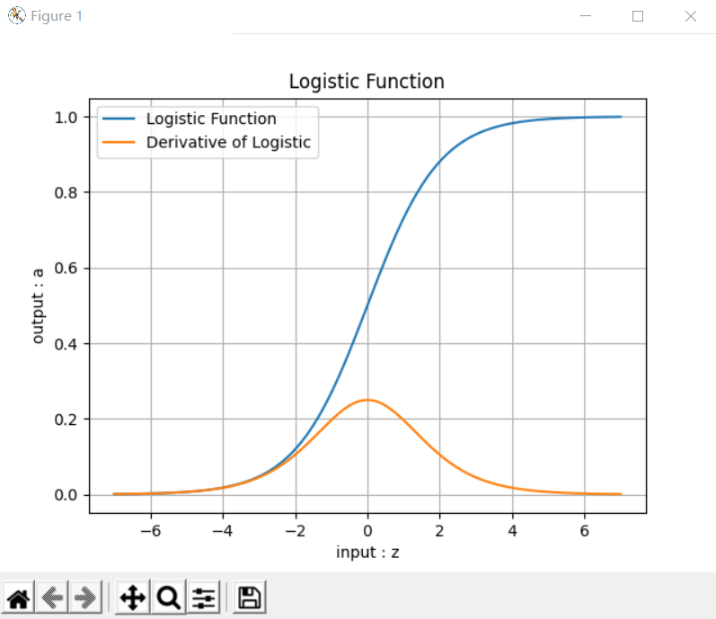
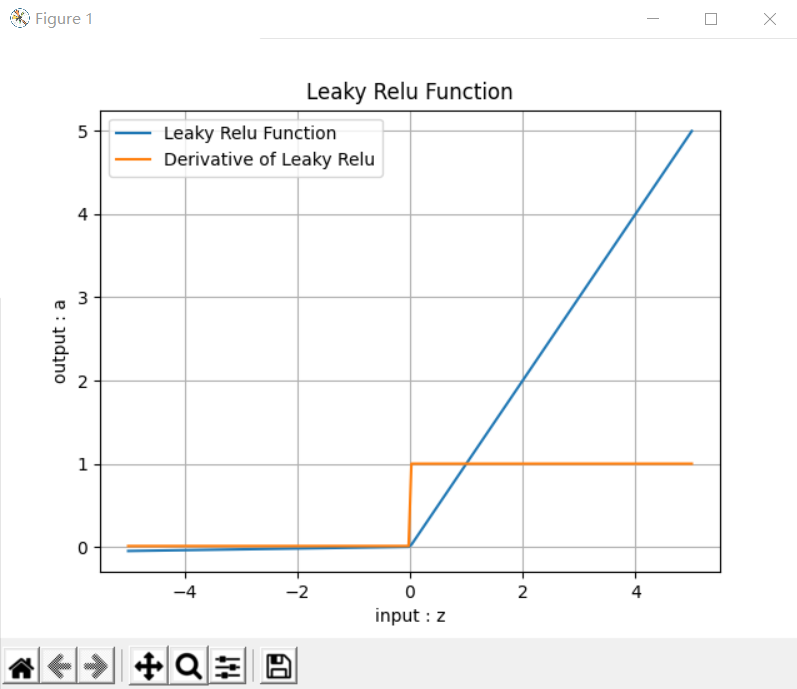
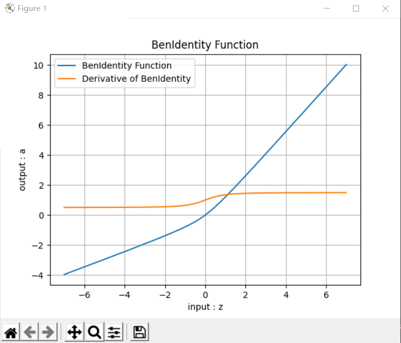

# 【Step4】

>>>># 08  激活函数 

>>### 08.0 激活函数概论

####  激活函数的基本作用

图8-1是神经网络中的一个神经元，假设该神经元有三个输入，分别为$x_1,x_2,x_3$，那么：

$$z=x_1 w_1 + x_2 w_2 + x_3 w_3 +b \tag{1}$$
$$a = \sigma(z) \tag{2}$$


图8-1 激活函数在神经元中的位置

激活函数也就是 $a=\sigma(z)$ 这一步了，他有什么作用呢？

1. 给神经网络增加非线性因素，这个问题在第1章神经网络基本工作原理中已经讲过；
2. 把公式1的计算结果压缩到 $[0,1]$ 之间，便于后面的计算。

激活函数的基本性质：

+ 非线性：线性的激活函数和没有激活函数一样；
+ 可导性：做误差反向传播和梯度下降，必须要保证激活函数的可导性；
+ 单调性：单一的输入会得到单一的输出，较大值的输入得到较大值的输出。

在物理试验中使用的继电器，是最初的激活函数的原型：当输入电流大于一个阈值时，会产生足够的磁场，从而打开下一级电源通道，如图8-2所示。


图8-2 继电器的阶跃形态

用到神经网络中的概念，用‘1’来代表一个神经元被激活，‘0’代表一个神经元未被激活。

这个Step函数有什么不好的地方呢？主要的一点就是，他的梯度（导数）恒为零（个别点除外)。反向传播公式中，梯度传递用到了链式法则，如果在这样一个连乘的式子其中有一项是零，这样的梯度就会恒为零，是没有办法进行反向传播的。

>>### 08.1 挤压型激活函数

#### Logistic函数

对数几率函数（Logistic Function，简称对率函数）。

很多文字材料中通常把激活函数和分类函数混淆在一起说，有一个原因是：在二分类任务中最后一层使用的对率函数与在神经网络层与层之间连接的Sigmoid激活函数，是同样的形式。所以它既是激活函数，又是分类函数，是个特例。

对这个函数的叫法比较混乱，在本书中我们约定一下，凡是用到“Logistic”词汇的，指的是二分类函数；而用到“Sigmoid”词汇的，指的是本激活函数。

#### 公式

$$Sigmoid(z) = \frac{1}{1 + e^{-z}} \rightarrow a \tag{1}$$

#### 导数

$$Sigmoid'(z) = a(1 - a) \tag{2}$$

注意，如果是矩阵运算的话，需要在公式2中使用$\odot$符号表示按元素的矩阵相乘：$a\odot (1-a)$，后面不再强调。

推导过程如下：

令：$u=1,v=1+e^{-z}$ 则：

$$
\begin{aligned}
Sigmoid'(z)&= (\frac{u}{v})'=\frac{u'v-v'u}{v^2} \\\\
&=\frac{0-(1+e^{-z})'}{(1+e^{-z})^2}=\frac{e^{-z}}{(1+e^{-z})^2} \\\\
&=\frac{1+e^{-z}-1}{(1+e^{-z})^2}=\frac{1}{1+e^{-z}}-(\frac{1}{1+e^{-z}})^2 \\\\
&=a-a^2=a(1-a)
\end{aligned}
$$

#### 值域

- 输入值域：$(-\infty, \infty)$
- 输出值域：$(0,1)$
- 导数值域：$(0,0.25]$

#### 函数图像


图8-3 Sigmoid函数图像


>>### 08.2 半线性激活函数

#### ReLU函数 

Rectified Linear Unit，修正线性单元，线性整流函数，斜坡函数。

#### 公式

$$ReLU(z) = max(0,z) = \begin{cases} 
  z, & z \geq 0 \\\\ 
  0, & z < 0 
\end{cases}$$

#### 导数

$$ReLU'(z) = \begin{cases} 1 & z \geq 0 \\\\ 0 & z < 0 \end{cases}$$

#### 值域

- 输入值域：$(-\infty, \infty)$
- 输出值域：$(0,\infty)$
- 导数值域：$\\{0,1\\}$

>>># 09  单入单出的双层神经网络 - 非线性回归

>>### 09.0 非线性回归问题

#### 回归模型的评估标准

回归问题主要是求值，评价标准主要是看求得值与实际结果的偏差有多大，所以，回归问题主要以下方法来评价模型。

#### 平均绝对误差

MAE（Mean Abolute Error）。

$$MAE=\frac{1}{m} \sum_{i=1}^m \lvert a_i-y_i \rvert \tag{1}$$

对异常值不如均方差敏感，类似中位数。

#### 绝对平均值率误差

MAPE（Mean Absolute Percentage Error）。

$$MAPE=\frac{100}{m} \sum^m_{i=1} \left\lvert {a_i - y_i \over y_i} \right\rvert \tag{2}$$

#### 和方差

SSE（Sum Squared Error）。

$$SSE=\sum_{i=1}^m (a_i-y_i)^2 \tag{3}$$

得出的值与样本数量有关系，假设有1000个测试样本，得到的值是120；如果只有100个测试样本，得到的值可能是11，我们不能说11就比120要好。

#### 均方差

MSE（Mean Squared Error）。

$$MSE = \frac{1}{m} \sum_{i=1}^m (a_i-y_i)^2 \tag{4}$$

就是实际值减去预测值的平方再求期望，没错，就是线性回归的代价函数。由于MSE计算的是误差的平方，所以它对异常值是非常敏感的，因为一旦出现异常值，MSE指标会变得非常大。MSE越小，证明误差越小。

#### 均方根误差

RMSE（Root Mean Squard Error）。

$$RMSE = \sqrt{\frac{1}{m} \sum_{i=1}^m (a_i-y_i)^2} \tag{5}$$

是均方差开根号的结果，其实质是一样的，只不过对结果有更好的解释。

例如：要做房价预测，每平方是万元，我们预测结果也是万元，那么MSE差值的平方单位应该是千万级别的。假设我们的模型预测结果与真实值相差1000元，则用MSE的计算结果是1000,000，这个值没有单位，如何描述这个差距？于是就求个平方根就好了，这样误差可以是标签值是同一个数量级的，在描述模型的时候就说，我们模型的误差是多少元。

>>### 09.1 用多项式回归法拟合正弦曲线

#### 一元一次线性模型

因为只有一项，所以不能称为多项式了。它可以解决单变量的线性回归，我们在第4章学习过相关内容。其模型为：

$$z = x w + b \tag{1}$$

#### 多元一次多项式

多变量的线性回归，我们在第5章学习过相关内容。其模型为：

$$z = x_1 w_1 + x_2 w_2 + ...+ x_m w_m + b \tag{2}$$

这里的多变量，是指样本数据的特征值为多个，上式中的 $x_1,x_2,...,x_m$ 代表了m个特征值。

#### 一元多次多项式

单变量的非线性回归，比如上面这个正弦曲线的拟合问题，很明显不是线性问题，但是只有一个 $x$ 特征值，所以不满足前两种形式。如何解决这种问题呢？

有一个定理：任意一个函数在一个较小的范围内，都可以用多项式任意逼近。因此在实际工程实践中，有时候可以不管 $y$ 值与 $x$ 值的数学关系究竟是什么，而是强行用回归分析方法进行近似的拟合。

那么如何得到更多的特征值呢？对于只有一个特征值的问题，人们发明了一种聪明的办法，就是把特征值的高次方作为另外的特征值，加入到回归分析中，用公式描述：

$$z = x w_1 + x^2 w_2 + ... + x^m w_m + b \tag{3}$$

上式中x是原有的唯一特征值，$x^m$ 是利用 $x$ 的 $m$ 次方作为额外的特征值，这样就把特征值的数量从 $1$ 个变为 $m$ 个。

换一种表达形式，令：$x_1 = x,x_2=x^2,\ldots,x_m=x^m$，则：

$$z = x_1 w_1 + x_2 w_2 + ... + x_m w_m + b \tag{4}$$

可以看到公式4和上面的公式2是一样的，所以解决方案也一样。

#### 多元多次多项式

多变量的非线性回归，其参数与特征组合繁复，但最终都可以归结为公式2和公式4的形式。

所以，不管是几元几次多项式，我们都可以使用第5章学到的方法来解决。在用代码具体实现之前，我们先学习一些前人总结的经验。先看一个被经常拿出来讲解的例子，如图9-3所示。


>>### 09.2 用多项式回归法拟合复合函数曲线

#### 用四次多项式拟合

代码与正弦函数拟合方法区别不大，不再赘述，我们本次主要说明解决问题的思路。

超参的设置情况：

```Python
    num_input = 4
    num_output = 1    
    params = HyperParameters(num_input, num_output, eta=0.2, max_epoch=10000, batch_size=10, eps=1e-3, net_type=NetType.Fitting)
```
最开始设置`max_epoch=10000`，运行结果如表9-8所示。

表9-8 四次多项式1万次迭代的训练结果

|损失函数历史|曲线拟合结果|
|---|---|
||||

从表9-9中的左图看，损失函数值到了一定程度后就不再下降了，说明网络能力有限。再看下面打印输出的具体数值，在0.005左右是一个极限。

```
......
99899 99 0.004685711600240152
99999 99 0.005299305272730845
W= [[ -2.18904889]
 [ 11.42075916]
 [-19.41933987]
 [ 10.88980241]]
B= [[-0.21280055]]
```

#### 用六次多项式拟合

接下来跳过5次多项式，直接用6次多项式来拟合。这次不需要把`max_epoch`设置得很大，可以先试试50000个`epoch`。

表9-10 六次多项式5万次迭代的训练结果

|损失函数历史|曲线拟合结果|
|---|---|
|||

打印输出：

```
999 99 0.005154576065966749
1999 99 0.004889156300531125
......
48999 99 0.0047460241904710935
49999 99 0.004669517756696059
W= [[-1.46506264]
 [ 6.60491296]
 [-6.53643709]
 [-4.29857685]
 [ 7.32734744]
 [-0.85129652]]
B= [[-0.21745171]]
```

从表9-10的损失函数历史图看，损失值下降得比较理想，但是实际看打印输出时，损失值最开始几轮就已经是0.0047了，到了最后一轮，是0.0046，并不理想，说明网络能力还是不够。因此在这个级别上，不用再花时间继续试验了，应该还需要提高多项式次数。

### 9.2.3 用八次多项式拟合

再跳过7次多项式，直接使用8次多项式。先把`max_epoch`设置为50000试验一下。

表9-11 八项式5万次迭代的训练结果

|损失函数历史|曲线拟合结果|
|---|---|
|||

表9-11中损失函数值下降的趋势非常可喜，似乎还没有遇到什么瓶颈，仍有下降的空间，并且拟合的效果也已经初步显现出来了。

再看下面的打印输出，损失函数值已经可以突破0.004的下限了。

```
......
49499 99 0.004086918553033752
49999 99 0.0037740488283595657
W= [[ -2.44771419]
 [  9.47854206]
 [ -3.75300184]
 [-14.39723202]
 [ -1.10074631]
 [ 15.09613263]
 [ 13.37017924]
 [-15.64867322]]
B= [[-0.16513259]]
```

根据以上情况，可以认为8次多项式很有可能得到比较理想的解，所以我们需要增加`max_epoch`数值，让网络得到充分的训练。好，设置`max_epoch=1000000`试一下！没错，是一百万次！开始运行后，大家就可以去做些别的事情，一两个小时之后再回来看结果。

表9-12 八项式100万次迭代的训练结果

|损失函数历史|曲线拟合结果|
|---|---|
|||

从表9-12的结果来看，损失函数值还有下降的空间和可能性，已经到了0.0016的水平（从后面的章节中可以知道，0.001的水平可以得到比较好的拟合效果），拟合效果也已经初步呈现出来了，所有转折的地方都可以复现，只是精度不够，相信更多的训练次数可以达到更好的效果。

```
......
998999 99 0.0015935143877633367
999999 99 0.0016124984420510522
W= [[  2.75832935]
 [-30.05663986]
 [ 99.68833781]
 [-85.95142109]
 [-71.42918867]
 [ 63.88516377]
 [104.44561608]
 [-82.7452897 ]]
B= [[-0.31611388]]
```

分析打印出的`W`权重值，x的原始特征值的权重值比后面的权重值小了一到两个数量级，这与归一化后x的高次幂的数值很小有关系。


>>### 09.3 验证与测试

#### 训练集

Training Set，用于模型训练的数据样本。

#### 验证集

Validation Set，或者叫做Dev Set，是模型训练过程中单独留出的样本集，它可以用于调整模型的超参数和用于对模型的能力进行初步评估。
  
在神经网络中，验证数据集用于：

- 寻找最优的网络深度
- 或者决定反向传播算法的停止点
- 或者在神经网络中选择隐藏层神经元的数量
- 在普通的机器学习中常用的交叉验证（Cross Validation）就是把训练数据集本身再细分成不同的验证数据集去训练模型。

#### 测试集

Test Set，用来评估最终模型的泛化能力。但不能作为调参、选择特征等算法相关的选择的依据。

三者之间的关系如图9-5所示。


>>### 09.4 双层神经网络实现非线性回归

#### 万能近似定理

万能近似定理(universal approximation theorem) $^{[1]}$，是深度学习最根本的理论依据。它证明了在给定网络具有足够多的隐藏单元的条件下，配备一个线性输出层和一个带有任何“挤压”性质的激活函数（如Sigmoid激活函数）的隐藏层的前馈神经网络，能够以任何想要的误差量近似任何从一个有限维度的空间映射到另一个有限维度空间的Borel可测的函数。

前馈网络的导数也可以以任意好地程度近似函数的导数。

万能近似定理其实说明了理论上神经网络可以近似任何函数。但实践上我们不能保证学习算法一定能学习到目标函数。即使网络可以表示这个函数，学习也可能因为两个不同的原因而失败：

1. 用于训练的优化算法可能找不到用于期望函数的参数值；
2. 训练算法可能由于过拟合而选择了错误的函数。

根据“没有免费的午餐”定理，说明了没有普遍优越的机器学习算法。前馈网络提供了表示函数的万能系统，在这种意义上，给定一个函数，存在一个前馈网络能够近似该函数。但不存在万能的过程既能够验证训练集上的特殊样本，又能够选择一个函数来扩展到训练集上没有的点。

总之，具有单层的前馈网络足以表示任何函数，但是网络层可能大得不可实现，并且可能无法正确地学习和泛化。在很多情况下，使用更深的模型能够减少表示期望函数所需的单元的数量，并且可以减少泛化误差。

#### 定义神经网络结构

本节的目的是要用神经网络完成图9-1和图9-2中的曲线拟合。

根据万能近似定理的要求，我们定义一个两层的神经网络，输入层不算，一个隐藏层，含3个神经元，一个输出层。图9-7显示了此次用到的神经网络结构。


图9-7 单入单出的双层神经网络

为什么用3个神经元呢？这也是笔者经过多次试验的最佳结果。因为输入层只有一个特征值，我们不需要在隐层放很多的神经元，先用3个神经元试验一下。如果不够的话再增加，神经元数量是由超参控制的。

>>### 09.5 曲线拟合

#### 隐层只有一个神经元的情况

令`n_hidden=1`，并指定模型名称为`sin_111`，训练过程见图9-10。图9-11为拟合效果图。


图9-10 训练过程中损失函数值和准确率的变化


图9-11 一个神经元的拟合效果

>### 09.6 非线性回归的工作原理

#### 多项式为何能拟合曲线

先回忆一下本章最开始讲的多项式回归法，它成功地用于正弦曲线和复合函数曲线的拟合，其基本工作原理是把单一特征值的高次方做为额外的特征值加入，使得神经网络可以得到附加的信息用于训练。实践证明其方法有效，但是当问题比较复杂时，需要高达8次方的附加信息，且训练时间也很长。

当我们使用双层神经网络时，在隐层只放置了三个神经元，就轻松解决了复合函数拟合的问题，效率高出十几倍，复杂度却降低了几倍。那么含有隐层的神经网络究竟是如何完成这个任务的呢？

我们以正弦曲线拟合为例来说明这个问题，首先看一下多项式回归方法的示意图，如图9-17。


图9-17 多项式回归方法的特征值输入

单层神经网络的多项式回归法，需要$x,x^2,x^3$三个特征值，组成如下公式来得到拟合结果：

$$
z = x \cdot w_1 + x^2 \cdot w_2 + x^3 \cdot w_3 + b \tag{1}
$$

我们可以回忆一下第5章学习的多变量线性回归问题，公式1实际上是把一维的x的特征信息，增加到了三维，然后再使用多变量线性回归来解决问题的。本来一维的特征只能得到线性的结果，但是三维的特征就可以得到非线性的结果，这就是多项式拟合的原理。

我们用具体的数值计算方式来理解一下其工作过程。

```Python
import numpy as np
import matplotlib.pyplot as plt

if __name__ == '__main__':
    x = np.linspace(0,1,10)
    w = 1.1
    b = 0.2
    y = x * w + b
    p1, = plt.plot(x,y, marker='.')

    x2 = x*x
    w2 = -0.5
    y2 = x * w + x2 * w2 + b
    p2, = plt.plot(x, y2, marker='s')

    x3 = x*x*x
    w3 = 2.3
    y3 = x * w + x2 * w2 + x3 * w3 + b
    p3, = plt.plot(x, y3, marker='x')

    plt.grid()
    plt.xlabel("x")
    plt.ylabel("y")
    plt.title("linear and non-linear")
    plt.legend([p1,p2,p3], ["x","x*x","x*x*x"])
    plt.show()
```

上述代码完成了如下任务：

1. 定义 $[0,1]$ 之间的等距的10个点
2. 使用 $w=1.1,b=0.2$ 计算一个线性回归数值`y`
3. 使用 $w=1.1,w2=-0.5,b=0.2$ 计算一个二项式回归数值`y2`
4. 使用 $w=1.1,w2=-0.5,w3=2.3,b=0.2$ 计算一个三项式回归数值`y3`
5. 绘制出三条曲线，如图9-18所示。


图9-18 线性到非线性的变换

>### 09.7 超参数优化的初步认识

超参数优化（Hyperparameter Optimization）主要存在两方面的困难：

1. 超参数优化是一个组合优化问题，无法像一般参数那样通过梯度下降方法来优化，也没有一种通用有效的优化方法。
2. 评估一组超参数配置（Configuration）的时间代价非常高，从而导致一些优化方法（比如演化算法）在超参数优化中难以应用。

对于超参数的设置，比较简单的方法有人工搜索、网格搜索和随机搜索。 

#### 可调的参数

我们使用表9-21所示的参数做第一次的训练。

表9-21 参数配置

|参数|缺省值|是否可调|注释|
|---|---|---|---|
|输入层神经元数|1|No|
|隐层神经元数|4|Yes|影响迭代次数|
|输出层神经元数|1|No|
|学习率|0.1|Yes|影响迭代次数|
|批样本量|10|Yes|影响迭代次数|
|最大epoch|10000|Yes|影响终止条件,建议不改动|
|损失门限值|0.001|Yes|影响终止条件,建议不改动|
|损失函数|MSE|No|
|权重矩阵初始化方法|Xavier|Yes|参看15.1|

表9-21中的参数，最终可以调节的其实只有三个：

- 隐层神经元数
- 学习率
- 批样本量


>>>># 代码测试结果

#### 08.1




#### 08.2






#### 09.5


>>>># 学习总结
通过学习step4,对非线性回归有了大致的了解，但对于各个知识的掌握度还不是很高，需要自己反复细致的消化，通过更多的实践来完善自身的知识系统。
