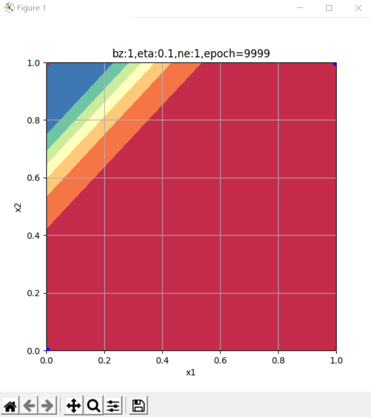
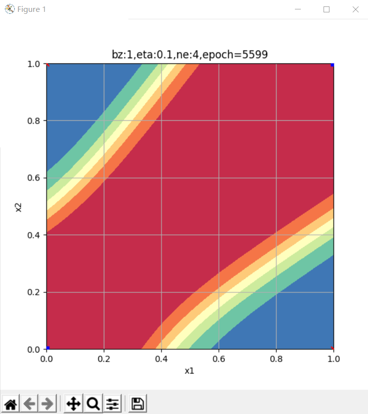
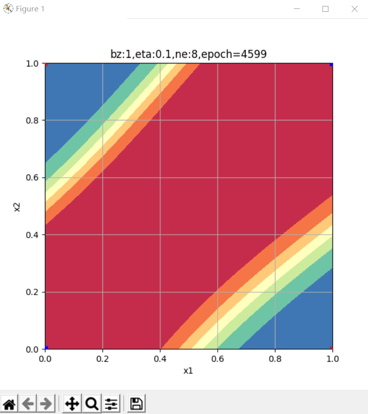
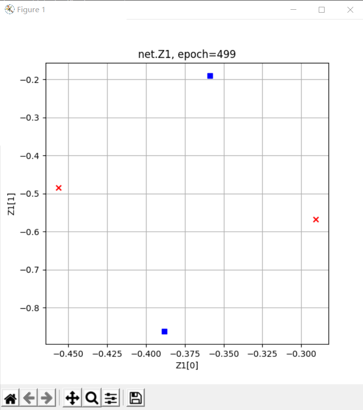
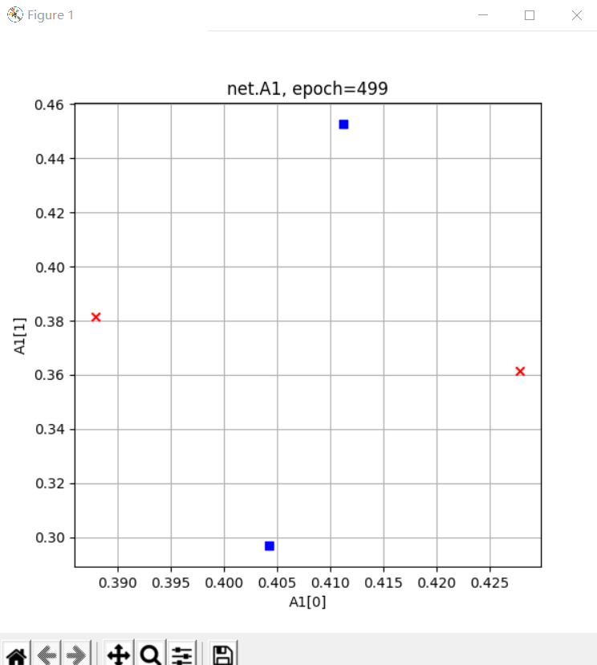
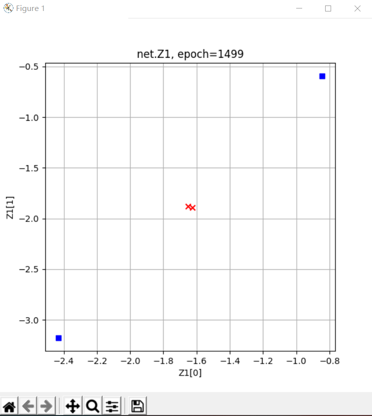
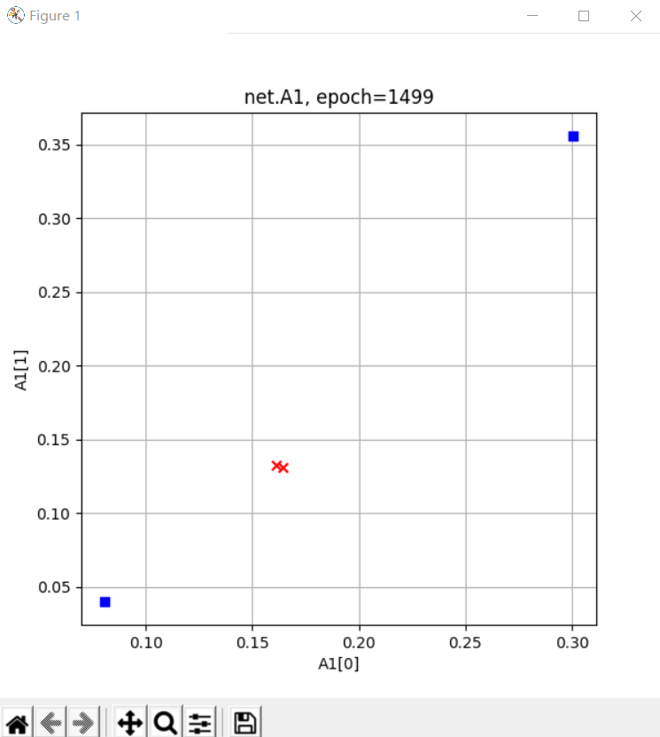
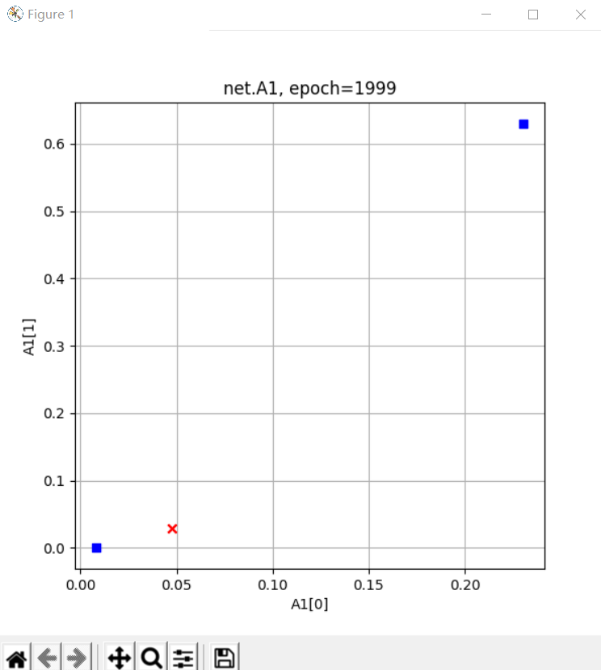
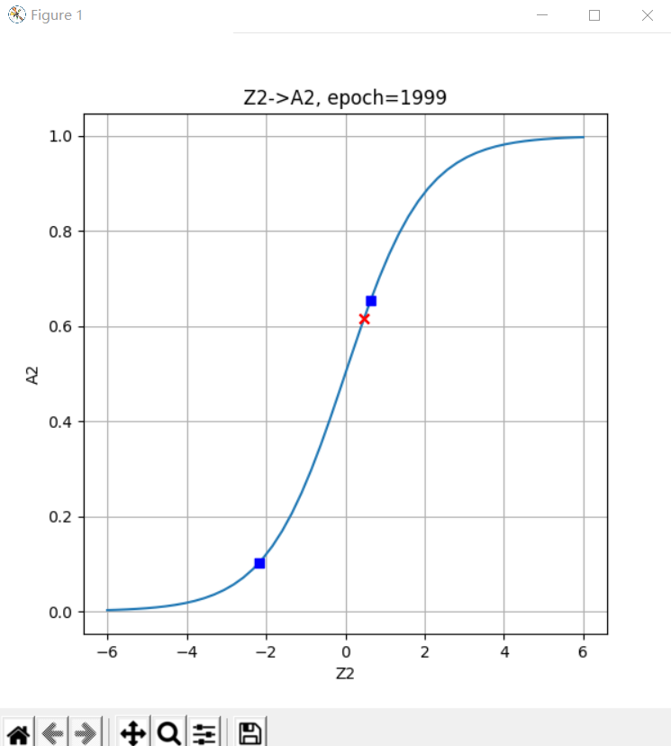

# 【Step5】

>>>># 10  非线性分类

>>### 10.0 非线性二分类问题

#### 二分类模型的评估标准

#### 准确率 Accuracy

也可以称之为精度，我们在本书中混用这两个词。

对于二分类问题，假设测试集上一共1000个样本，其中550个正例，450个负例。测试一个模型时，得到的结果是：521个正例样本被判断为正类，435个负例样本被判断为负类，则正确率计算如下：

$$Accuracy=(521+435)/1000=0.956$$

即正确率为95.6%。这种方式对多分类也是有效的，即三类中判别正确的样本数除以总样本数，即为准确率。

但是这种计算方法丢失了很多细节，比如：是正类判断的精度高还是负类判断的精度高呢？因此，我们还有如下一种评估标准。

#### 混淆矩阵

还是用上面的例子，如果具体深入到每个类别上，会分成4部分来评估：

- 正例中被判断为正类的样本数（TP-True Positive）：521
- 正例中被判断为负类的样本数（FN-False Negative）：550-521=29
- 负例中被判断为负类的样本数（TN-True Negative）：435
- 负例中被判断为正类的样本数（FP-False Positive）：450-435=15

可以用图10-3来帮助理解。


图10-3 二分类中四种类别的示意图

- 左侧实心圆点是正类，右侧空心圆是负类；
- 在圆圈中的样本是被模型判断为正类的，圆圈之外的样本是被判断为负类的；
- 左侧圆圈外的点是正类但是误判为负类，右侧圆圈内的点是负类但是误判为正类；
- 左侧圆圈内的点是正类且被正确判别为正类，右侧圆圈外的点是负类且被正确判别为负类。

用表格的方式描述矩阵的话是表10-1的样子。

表10-1 四类样本的矩阵关系

|预测值|被判断为正类|被判断为负类|Total|
|---|---|---|---|
|样本实际为正例|TP-True Positive|FN-False Negative|Actual Positive=TP+FN|
|样本实际为负例|FP-False Positive|TN-True Negative|Actual Negative=FP+TN|
|Total|Predicated Postivie=TP+FP|Predicated Negative=FN+TN|

从混淆矩阵中可以得出以下统计指标：

- 准确率 Accuracy

>>### 10.1 为什么必须用双层神经网络

表10-2 各种分类的组合关系

||二分类|多分类|
|---|---|---|
|线性|||
|非线性|||

在第三步中我们学习过线性分类，如果用于此处的话，我们可能会得到表10-3所示的绿色分割线。

表10-3 线性分类结果

|XOR问题|弧形问题|
|---|---|
|||
|图中两根直线中的任何一根，都不可能把蓝色点分到一侧，同时红色点在另一侧|对于线性技术来说，它已经尽力了，使得两类样本尽可能地分布在直线的两侧|

#### 简单证明异或问题的不可能性

用单个感知机或者单层神经网络，是否能完成异或任务呢？我们自己做个简单的证明。先看样本数据，如表10-4。

表10-4 异或的样本数据

|样本|$x_1$|$x_2$|$y$|
|---|---|---|---|
|1|0|0|0|
|2|0|1|1|
|3|1|0|1|
|4|1|1|0|

用单个神经元（感知机）的话，就是表10-5中两种技术的组合。

表10-5 神经元结构与二分类函数

|神经元|分类函数Logistic|
|--|--|
|||


>>### 10.2 非线性二分类实现

#### 定义神经网络结构

首先定义可以完成非线性二分类的神经网络结构图，如图10-6所示。


图10-6 非线性二分类神经网络结构图

- 输入层两个特征值$x_1,x_2$
  $$
  X=\begin{pmatrix}
    x_1 & x_2
  \end{pmatrix}
  $$
- 隐层$2\times 2$的权重矩阵$W1$
$$
  W1=\begin{pmatrix}
    w1_{11} & w1_{12} \\\\
    w1_{21} & w1_{22} 
  \end{pmatrix}
$$
- 隐层$1\times 2$的偏移矩阵$B1$

$$
  B1=\begin{pmatrix}
    b1_{1} & b1_{2}
  \end{pmatrix}
$$

- 隐层由两个神经元构成
$$
Z1=\begin{pmatrix}
  z1_{1} & z1_{2}
\end{pmatrix}
$$
$$
A1=\begin{pmatrix}
  a1_{1} & a1_{2}
\end{pmatrix}
$$
- 输出层$2\times 1$的权重矩阵$W2$
$$
  W2=\begin{pmatrix}
    w2_{11} \\\\
    w2_{21}  
  \end{pmatrix}
$$

- 输出层$1\times 1$的偏移矩阵$B2$

$$
  B2=\begin{pmatrix}
    b2_{1}
  \end{pmatrix}
$$

- 输出层有一个神经元使用Logistic函数进行分类
$$
  Z2=\begin{pmatrix}
    z2_{1}
  \end{pmatrix}
$$
$$
  A2=\begin{pmatrix}
    a2_{1}
  \end{pmatrix}
$$

对于一般的用于二分类的双层神经网络可以是图10-7的样子。


图10-7 通用的二分类神经网络结构图

输入特征值可以有很多，隐层单元也可以有很多，输出单元只有一个，且后面要接Logistic分类函数和二分类交叉熵损失函数。


>>### 10.3 实现逻辑异或门

#### 准备数据

异或数据比较简单，只有4个记录，所以就hardcode在此，不用再建立数据集了。这也给读者一个机会了解如何从`DataReader`类派生出一个全新的子类`XOR_DataReader`。

比如在下面的代码中，我们覆盖了父类中的三个方法：

- `init()` 初始化方法：因为父类的初始化方法要求有两个参数，代表train/test数据文件
- `ReadData()`方法：父类方法是直接读取数据文件，此处直接在内存中生成样本数据，并且直接令训练集等于原始数据集（不需要归一化），令测试集等于训练集
- `GenerateValidationSet()`方法，由于只有4个样本，所以直接令验证集等于训练集

因为`NeuralNet2`中的代码要求数据集比较全，有训练集、验证集、测试集，为了已有代码能顺利跑通，我们把验证集、测试集都设置成与训练集一致，对于解决这个异或问题没有什么影响。

```Python
class XOR_DataReader(DataReader):
    def ReadData(self):
        self.XTrainRaw = np.array([0,0,0,1,1,0,1,1]).reshape(4,2)
        self.YTrainRaw = np.array([0,1,1,0]).reshape(4,1)
        self.XTrain = self.XTrainRaw
        self.YTrain = self.YTrainRaw
        self.num_category = 1
        self.num_train = self.XTrainRaw.shape[0]
        self.num_feature = self.XTrainRaw.shape[1]
        self.XTestRaw = self.XTrainRaw
        self.YTestRaw = self.YTrainRaw
        self.XTest = self.XTestRaw
        self.YTest = self.YTestRaw
        self.num_test = self.num_train

    def GenerateValidationSet(self, k = 10):
        self.XVld = self.XTrain
        self.YVld = self.YTrain
```

#### 测试函数

与第6章中的逻辑与门和或门一样，我们需要神经网络的运算结果达到一定的精度，也就是非常的接近0，1两端，而不是说勉强大于0.5就近似为1了，所以精度要求是误差绝对值小于`1e-2`。

```Python
def Test(dataReader, net):
    print("testing...")
    X,Y = dataReader.GetTestSet()
    A = net.inference(X)
    diff = np.abs(A-Y)
    result = np.where(diff < 1e-2, True, False)
    if result.sum() == dataReader.num_test:
        return True
    else:
        return False
```


>>### 10.4 逻辑异或门的工作原理

#### 显示原始数据

```Python
import numpy as np
from pathlib import Path
import matplotlib.pyplot as plt

from Level1_XorGateClassifier import *

def ShowSourceData(dataReader):
    DrawSamplePoints(dataReader.XTrain[:,0],dataReader.XTrain[:,1],dataReader.YTrain, "XOR Source Data", "x1", "x2")

def DrawSamplePoints(x1, x2, y, title, xlabel, ylabel, show=True):
    assert(x1.shape[0] == x2.shape[0])
    fig = plt.figure(figsize=(6,6))
    count = x1.shape[0]
    for i in range(count):
        if y[i,0] == 0:
            plt.scatter(x1[i], x2[i], marker='^', color='r', s=200, zorder=10)
        else:
            plt.scatter(x1[i], x2[i], marker='o', color='b', s=200, zorder=10)
        #end if
    #end for
    plt.grid()
    plt.title(title)
    plt.xlabel(xlabel)
    plt.ylabel(ylabel)
    if show:
        plt.show()
```

1. 首先是从Level_XorGateClassifier中导入所有内容，省去了我们重新写数据准备部分的代码的麻烦
2. 获得所有分类为1的训练样本，用红色叉子显示在画板上
3. 获得所有分类为0的训练样本，用蓝色圆点显示在画板上

由此我们会得到样本如图10-11所示。


图10-11 异或样本数据

异或问题的四个点分布在[0,1]空间的四个角上，红色点是正类，蓝色点是负类。

#### 显示推理的中间结果

由于是双层神经网络，回忆一下其公式：$Z1 = X \cdot W1 +B1,A1=Sigmoid(Z1),Z2=A1 \cdot W2+B2,A2=Logistic(A2)$，所以会有$Z1,A1,Z2,A2$等中间运算结果。我们把它们用图形方式显示出来帮助读者理解推理过程。

```Python
def ShowProcess2D(net, dataReader):
    net.inference(dataReader.XTest)
    # show z1    
    DrawSamplePoints(net.Z1[:,0], net.Z1[:,1], dataReader.YTest, "net.Z1", "Z1[0]", "Z1[1]")
    # show a1
    DrawSamplePoints(net.A1[:,0], net.A1[:,1], dataReader.YTest, "net.A1", "A1[0]", "A1[1]")
    # show sigmoid
    DrawSamplePoints(net.Z2, net.A2, dataReader.YTrain, "Z2->A2", "Z2", "A2", show=False)
    x = np.linspace(-6,6)
    a = Sigmoid().forward(x)
    plt.plot(x,a)
    plt.show()
```

>>### 10.5 实现双弧形二分类

#### 主过程代码

```Python
if __name__ == '__main__':
    ......
    n_input = dataReader.num_feature
    n_hidden = 2
    n_output = 1
    eta, batch_size, max_epoch = 0.1, 5, 10000
    eps = 0.08

    hp = HyperParameters2(n_input, n_hidden, n_output, eta, max_epoch, batch_size, eps, NetType.BinaryClassifier, InitialMethod.Xavier)
    net = NeuralNet2(hp, "Arc_221")
    net.train(dataReader, 5, True)
    net.ShowTrainingTrace()
```

此处的代码有几个需要强调的细节：

- `n_input = dataReader.num_feature`，值为2，而且必须为2，因为只有两个特征值
- `n_hidden=2`，这是人为设置的隐层神经元数量，可以是大于2的任何整数
- `eps`精度=0.08是后验知识，笔者通过测试得到的停止条件，用于方便案例讲解
- 网络类型是`NetType.BinaryClassifier`，指明是二分类网络

### 10.5.2 运行结果

经过快速的迭代，训练完毕后，会显示损失函数曲线和准确率曲线如图10-15。


图10-15 训练过程中的损失函数值和准确率值的变化

蓝色的线条是小批量训练样本的曲线，波动相对较大，不必理会，因为批量小势必会造成波动。红色曲线是验证集的走势，可以看到二者的走势很理想，经过一小段时间的磨合后，从第200个`epoch`开始，两条曲线都突然找到了突破的方向，然后只用了50个`epoch`，就迅速达到指定精度。

同时在控制台会打印一些信息，最后几行如下：

```
......
epoch=259, total_iteration=18719
loss_train=0.092687, accuracy_train=1.000000
loss_valid=0.074073, accuracy_valid=1.000000
W= [[ 8.88189429  6.09089509]
 [-7.45706681  5.07004428]]
B= [[ 1.99109895 -7.46281087]]
W= [[-9.98653838]
 [11.04185384]]
B= [[3.92199463]]
testing...
1.0
```
一共用了260个`epoch`，达到了指定的loss精度（0.08）时停止迭代。看测试集的情况，准确度1.0，即100%分类正确。

>>### 10.6 双弧形二分类的工作原理

#### 几个辅助的函数
- `DrawSamplePoints(x1, x2, y, title, xlabel, ylabel, show=True)`
  
  画样本点，把正例绘制成红色的`x`，把负例绘制成蓝色的点。输入的`x1`和`x2`组成横纵坐标，`y`是正负例的标签值。

- `Prepare3DData(net, count)

  准备3D数据，把平面划分成`count` * `count`的网格，并形成矩阵。如果传入的`net`不是None的话，会使用`net.inference()`做一次推理，以便得到和平面上的网格相对应的输出值。

- `DrawGrid(Z, count)`

  绘制网格。这个网格不一定是正方形的，有可能会由于矩阵的平移缩放而扭曲，目的是观察神经网络对空间的变换。

- `ShowSourceData(dataReader)`

  显示原始训练样本数据。

- `ShowTransformation(net, dr, epoch)`

  绘制经过神经网络第一层的线性计算即激活函数计算后，空间变换的结果。神经网络的第二层就是在第一层的空间变换的结果之上来完成分类任务的。

- `ShowResult2D(net, dr, epoch)`

  在二维平面上显示分类结果，实际是用等高线方式显示2.5D的分类结果。

#### 训练函数

```Python
def train(dataReader, max_epoch):
    n_input = dataReader.num_feature
    n_hidden = 2
    n_output = 1
    eta, batch_size = 0.1, 5
    eps = 0.01

    hp = HyperParameters2(n_input, n_hidden, n_output, eta, max_epoch, batch_size, eps, NetType.BinaryClassifier, InitialMethod.Xavier)
    net = NeuralNet2(hp, "Arc_221_epoch")
    
    net.train(dataReader, 5, True)
    
    ShowTransformation(net, dataReader, max_epoch)
    ShowResult2D(net, dataReader, max_epoch)
```
接收`max_epoch`做为参数，控制神经网络训练迭代的次数，以此来观察中间结果。我们使用了如下超参：

- `n_input=2`，输入的特征值数量
- `n_hidden=2`，隐层的神经元数
- `n_output=1`，输出为二分类
- `eta=0.1`，学习率
- `batch_size=5`，批量样本数为5
- `eps=0.01`，停止条件
- `NetType.BinaryClassifier`，二分类网络
- `InitialMethod.Xavier`，初始化方法为Xavier

每迭代5次做一次损失值计算，打印一次结果。最后显示中间状态图和分类结果图。


>>>># 11  多入多出的双层神经网络 - 非线性多分类

>>### 11.0 非线性多分类问题

#### 多分类模型的评估标准

我们以三分类问题举例，假设每类有100个样本，一共300个样本，最后的分类结果如表11-2所示。

表11-2 多分类结果的混淆矩阵

|样本所属类别|分到类1|分到类2|分到类3|各类样本总数|精(准)确率|
|---|---|---|---|---|---|
|类1|90|4|6|100|90%|
|类2|9|84|5|100|84%|
|类3|1|4|95|100|95%|
|总数|101|93|106|300|89.67%|

- 第1类样本，被错分到2类4个，错分到3类6个，正确90个；
- 第2类样本，被错分到1类9个，错分到3类5个，正确84个；
- 第3类样本，被错分到1类1个，错分到2类4个，正确95个。
 
总体的准确率是89.67%。三类的精确率是90%、84%、95%。实际上表11-2也是混淆矩阵在二分类基础上的扩展形式，其特点是在对角线上的值越大越好。

当然也可以计算每个类别的Precision和Recall，但是只在需要时才去做具体计算。比如，当第2类和第3类混淆比较严重时，为了记录模型训练的历史情况，才会把第2类和第3类单独拿出来分析。

我们在本书中，只使用总体的准确率来衡量多分类器的好坏。


>>### 11.1 非线性多分类

#### 前向计算

根据网络结构，可以绘制前向计算图，如图11-3所示。


图11-3 前向计算图

#### 第一层

- 线性计算

$$
z1_1 = x_1 w1_{11} + x_2 w1_{21} + b1_1
$$
$$
z1_2 = x_1 w1_{12} + x_2 w1_{22} + b1_2
$$
$$
z1_3 = x_1 w1_{13} + x_2 w1_{23} + b1_3
$$
$$
Z1 = X \cdot W1 + B1
$$

- 激活函数

$$
a1_1 = Sigmoid(z1_1) 
$$
$$
a1_2 = Sigmoid(z1_2) 
$$
$$
a1_3 = Sigmoid(z1_3) 
$$
$$
A1 = Sigmoid(Z1)
$$

#### 第二层

- 线性计算

$$
z2_1 = a1_1 w2_{11} + a1_2 w2_{21} + a1_3 w2_{31} + b2_1
$$
$$
z2_2 = a1_1 w2_{12} + a1_2 w2_{22} + a1_3 w2_{32} + b2_2
$$
$$
z2_3 = a1_1 w2_{13} + a1_2 w2_{23} + a1_3 w2_{33} + b2_3
$$
$$
Z2 = A1 \cdot W2 + B2
$$

- 分类函数

$$
a2_1 = \frac{e^{z2_1}}{e^{z2_1} + e^{z2_2} + e^{z2_3}}
$$
$$
a2_2 = \frac{e^{z2_2}}{e^{z2_1} + e^{z2_2} + e^{z2_3}}
$$
$$
a2_3 = \frac{e^{z2_3}}{e^{z2_1} + e^{z2_2} + e^{z2_3}}
$$
$$
A2 = Softmax(Z2)
$$

#### 损失函数

使用多分类交叉熵损失函数：
$$
loss = -(y_1 \ln a2_1 + y_2 \ln a2_2 + y_3 \ln a2_3)
$$
$$
J(w,b) = -\frac{1}{m} \sum^m_{i=1} \sum^n_{j=1} y_{ij} \ln (a2_{ij})
$$

$m$为样本数，$n$为类别数。

### 11.1.3 反向传播

根据前向计算图，可以绘制出反向传播的路径如图11-4。


图11-4 反向传播图

在第7.1中学习过了Softmax与多分类交叉熵配合时的反向传播推导过程，最后是一个很简单的减法：

$$
\frac{\partial loss}{\partial Z2}=A2-y \rightarrow dZ2
$$

从Z2开始再向前推的话，和10.2节是一模一样的，所以直接把结论拿过来：

$$
\frac{\partial loss}{\partial W2}=A1^{\top} \cdot dZ2 \rightarrow dW2
$$
$$\frac{\partial{loss}}{\partial{B2}}=dZ2 \rightarrow dB2$$
$$
\frac{\partial A1}{\partial Z1}=A1 \odot (1-A1) \rightarrow dA1
$$
$$
\frac{\partial loss}{\partial Z1}=dZ2 \cdot W2^{\top} \odot dA1 \rightarrow dZ1 
$$
$$
dW1=X^{\top} \cdot dZ1
$$
$$
dB1=dZ1
$$


>>### 11.2 非线性多分类的工作原理


表11-4 工作原理可视化

||正视角|侧视角|
|---|---|---|
|z1|||
||通过线性变换得到在三维空间中的线性平面|从侧面看的线性平面|
|a1|||
||通过激活函数的非线性变化，被空间挤压成三角形|从侧面看三种颜色分成了三层|

`net.Z1`的点图的含义是，输入数据经过线性变换后的结果，可以看到由于只是线性变换，所以从侧视角看还只是一个二维平面的样子。

`net.A1`的点图含义是，经过激活函数做非线性变换后的图。由于绿色点比较靠近边缘，所以三维坐标中的每个值在经过Sigmoid激活函数计算后，都有至少一维坐标会是向1靠近的值，所以分散的比较开，形成外围的三角区域；蓝色点正好相反，三维坐标值都趋近于0，所以最后都集中在三维坐标原点的三角区域内；红色点处于前两者之间，因为有很多中间值。

再观察net.A1的侧视图，似乎是已经分层了，蓝点沉积下去，绿点浮上来，红点在中间，像鸡尾酒一样分成了三层，这就给第二层神经网络创造了做一个线性三分类的条件，只需要两个平面，就可以把三者轻松分开了。

#### 3D分类结果图

更高维的空间无法展示，所以当隐层神经元数量为4或8或更多时，基本无法理解空间变换的样子了。但是有一个方法可以近似地解释高维情况：在三维空间时，蓝色点会被推挤到一个角落形成一个三角形，那么在N（N>3）维空间中，蓝色点也会被推挤到一个角落。由于N很大，所以一个多边形会近似成一个圆形，也就是我们下面要生成的这些立体图的样子。

我们延续9.2节的3D效果体验，但是，多分类的实际实现方式是1对多的，所以我们只能一次显示一个类别的分类效果图，列在表11-5中。

表11-5 分类效果图

|||
|---|---|
|||
|红色：类别1样本区域|红色：类别2样本区域|
|||
|红色：类别3样本区域|红色：类别1，青色：类别2，紫色：类别3|

上表中最后一行的图片显示类别1和2的累加效果。由于最后的结果都被Softmax归一为$[0,1]$之间，所以我们可以简单地把类别1的数据乘以2，再加上类别2的数据即可。

>>### 11.3 分类样本不平衡问题

#### 什么是样本不平衡

英文名叫做Imbalanced Data。

在一般的分类学习方法中都有一个假设，就是不同类别的训练样本的数量相对平衡。

以二分类为例，比如正负例都各有1000个左右。如果是1200:800的比例，也是可以接受的，但是如果是1900:100，就需要有些措施来解决不平衡问题了，否则最后的训练结果很大可能是忽略了负例，将所有样本都分类为正类了。

如果是三分类，假设三个类别的样本比例为：1000:800:600，这是可以接受的；但如果是1000:300:100，就属于不平衡了。它带来的结果是分类器对第一类样本过拟合，而对其它两个类别的样本欠拟合，测试效果一定很糟糕。

类别不均衡问题是现实中很常见的问题，大部分分类任务中，各类别下的数据个数基本上不可能完全相等，但是一点点差异是不会产生任何影响与问题的。在现实中有很多类别不均衡问题，它是常见的，并且也是合理的，符合人们期望的。

在前面，我们使用准确度这个指标来评价分类质量，可以看出，在类别不均衡时，准确度这个评价指标并不能work。比如一个极端的例子是，在疾病预测时，有98个正例，2个反例，那么分类器只要将所有样本预测为正类，就可以得到98%的准确度，则此分类器就失去了价值。

#### 如何解决样本不平衡问题

#### 平衡数据集

有一句话叫做“更多的数据往往战胜更好的算法”。所以一定要先想办法扩充样本数量少的类别的数据，比如目前的正负类样本数量是1000:100，则可以再搜集2000个数据，最后得到了2800:300的比例，此时可以从正类样本中丢弃一些，变成500:300，就可以训练了。

一些经验法则：

- 考虑对大类下的样本（超过1万、十万甚至更多）进行欠采样，即删除部分样本；
- 考虑对小类下的样本（不足1万甚至更少）进行过采样，即添加部分样本的副本；
- 考虑尝试随机采样与非随机采样两种采样方法；
- 考虑对各类别尝试不同的采样比例，比一定是1:1，有时候1:1反而不好，因为与现实情况相差甚远；
- 考虑同时使用过采样（over-sampling）与欠采样（under-sampling）。

#### 尝试其它评价指标 

从前面的分析可以看出，准确度这个评价指标在类别不均衡的分类任务中并不能work，甚至进行误导（分类器不work，但是从这个指标来看，该分类器有着很好的评价指标得分）。因此在类别不均衡分类任务中，需要使用更有说服力的评价指标来对分类器进行评价。如何对不同的问题选择有效的评价指标参见这里。 

常规的分类评价指标可能会失效，比如将所有的样本都分类成大类，那么准确率、精确率等都会很高。这种情况下，AUC是最好的评价指标。

#### 尝试产生人工数据样本 

一种简单的人工样本数据产生的方法便是，对该类下的所有样本每个属性特征的取值空间中随机选取一个组成新的样本，即属性值随机采样。你可以使用基于经验对属性值进行随机采样而构造新的人工样本，或者使用类似朴素贝叶斯方法假设各属性之间互相独立进行采样，这样便可得到更多的数据，但是无法保证属性之前的线性关系（如果本身是存在的）。 

有一个系统的构造人工数据样本的方法SMOTE(Synthetic Minority Over-sampling Technique)。SMOTE是一种过采样算法，它构造新的小类样本而不是产生小类中已有的样本的副本，即该算法构造的数据是新样本，原数据集中不存在的。该基于距离度量选择小类别下两个或者更多的相似样本，然后选择其中一个样本，并随机选择一定数量的邻居样本对选择的那个样本的一个属性增加噪声，每次处理一个属性。这样就构造了更多的新生数据。具体可以参见原始论文。 

使用命令：

```
pip install imblearn
```
可以安装SMOTE算法包，用于实现样本平衡。


>>>># 12 多入多出的三层神经网络 - 深度非线性多分类


>>### 12.0 多变量非线性多分类

#### 提出问题

手写识别是人工智能的重要课题之一。MNIST数字手写体识别图片集，大家一定不陌生，下面就是一些样本。


图12-1 MNIST数据集样本示例

由于这是从欧美国家和地区收集的数据，从图中可以看出有几点和中国人的手写习惯不一样：

- 数字2，下面多一个圈
- 数字4，很多横线不出头
- 数字6，上面是直的
- 数字7，中间有个横杠

不过这些细节不影响咱们学习课程，正好还可以验证一下中国人的手写习惯是否能够被正确识别。

由于不是让我们识别26个英文字母或者3500多个常用汉字，所以问题还算是比较简单，不需要图像处理知识，也暂时不需要卷积神经网络的参与。咱们可以试试用一个三层的神经网络解决此问题，把每个图片的像素都当作一个向量来看，而不是作为点阵。

#### 图片数据归一化

在第5章中，我们学习了数据归一化，是针对数据的特征值做的处理，也就是针对样本数据的列做的处理。

本章中，要处理的对象是图片，需要把整张图片看作一个样本，因此使用下面这段代码做数据归一化方法：

```Python
    def __NormalizeData(self, XRawData):
        X_NEW = np.zeros(XRawData.shape)
        x_max = np.max(XRawData)
        x_min = np.min(XRawData)
        X_NEW = (XRawData - x_min)/(x_max-x_min)
        return X_NEW
```

>>### 12.1 三层神经网络的实现

#### 定义神经网络

为了完成MNIST分类，我们需要设计一个三层神经网络结构，如图12-2所示。


图12-2 三层神经网络结构

#### 输入层

共计$28\times 28=784$个特征值：

$$
X=\begin{pmatrix}
    x_1 & x_2 & \cdots & x_{784}
  \end{pmatrix}
$$

#### 隐层1

- 权重矩阵$W1$形状为$784\times 64$

$$
W1=\begin{pmatrix}
    w1_{1,1} & w1_{1,2} & \cdots & w1_{1,64} \\\\
    \vdots & \vdots & \cdots & \vdots \\\\
    w1_{784,1} & w1_{784,2} & \cdots & w1_{784,64} 
  \end{pmatrix}
$$

- 偏移矩阵$B1$的形状为$1\times 64$

$$
B1=\begin{pmatrix}
    b1_{1} & b1_{2} & \cdots & b1_{64}
  \end{pmatrix}
$$

- 隐层1由64个神经元构成，其结果为$1\times 64$的矩阵

$$
Z1=\begin{pmatrix}
    z1_{1} & z1_{2} & \cdots & z1_{64}
  \end{pmatrix}
$$
$$
A1=\begin{pmatrix}
    a1_{1} & a1_{2} & \cdots & a1_{64}
  \end{pmatrix}
$$

#### 隐层2

- 权重矩阵$w2$形状为$64\times 16$

$$
W2=\begin{pmatrix}
    w2_{1,1} & w2_{1,2} & \cdots & w2_{1,16} \\\\
    \vdots & \vdots & \cdots & \vdots \\\\
    w2_{64,1} & w2_{64,2} & \cdots & w2_{64,16} 
  \end{pmatrix}
$$

- 偏移矩阵#B2#的形状是$1\times 16$

$$
B2=\begin{pmatrix}
    b2_{1} & b2_{2} & \cdots & b2_{16}
  \end{pmatrix}
$$

- 隐层2由16个神经元构成

$$
Z2=\begin{pmatrix}
    z2_{1} & z2_{2} & \cdots & z2_{16}
  \end{pmatrix}
$$
$$
A2=\begin{pmatrix}
    a2_{1} & a2_{2} & \cdots & a2_{16}
  \end{pmatrix}
$$

#### 输出层

- 权重矩阵$W3$的形状为$16\times 10$

$$
W3=\begin{pmatrix}
    w3_{1,1} & w3_{1,2} & \cdots & w3_{1,10} \\\\
    \vdots & \vdots & \cdots & \vdots \\\\
    w3_{16,1} & w3_{16,2} & \cdots & w3_{16,10} 
  \end{pmatrix}
$$

- 输出层的偏移矩阵$B3$的形状是$1\times 10$

$$
B3=\begin{pmatrix}
    b3_{1}& b3_{2} & \cdots & b3_{10}
  \end{pmatrix}
$$

- 输出层有10个神经元使用Softmax函数进行分类

$$
Z3=\begin{pmatrix}
    z3_{1} & z3_{2} & \cdots & z3_{10}
  \end{pmatrix}
$$
$$
A3=\begin{pmatrix}
    a3_{1} & a3_{2} & \cdots & a3_{10}
  \end{pmatrix}
$$

>### 12.2 梯度检查

#### 导数概念回忆

$$
f'(x)=\lim_{h \to 0} \frac{f(x+h)-f(x)}{h} \tag{1}
$$

其含义就是$x$的微小变化$h$（$h$为无限小的值），会导致函数$f(x)$的值有多大变化。在`Python`中可以这样实现：

```Python
def numerical_diff(f, x):
    h = 1e-5
    d = (f(x+h) - f(x))/h
    return d
```

因为计算机的舍入误差的原因，`h`不能太小，比如`1e-10`，会造成计算结果上的误差，所以我们一般用`[1e-4,1e-7]`之间的数值。

但是如果使用上述方法会有一个问题，如图12-4所示。


图12-4 数值微分方法

红色实线为真实的导数切线，蓝色虚线是上述方法的体现，即从$x$到$x+h$画一条直线，来模拟真实导数。但是可以明显看出红色实线和蓝色虚线的斜率是不等的。因此我们通常用绿色的虚线来模拟真实导数，公式变为：

$$
f'(x) = \lim_{h \to 0} \frac{f(x+h)-f(x-h)}{2h} \tag{2}
$$

公式2被称为双边逼近方法。

用双边逼近形式会比单边逼近形式的误差小100~10000倍左右，可以用泰勒展开来证明。

#### 泰勒公式

泰勒公式是将一个在$x=x_0$处具有n阶导数的函数$f(x)$利用关于$(x-x_0)$的n次多项式来逼近函数的方法。若函数$f(x)$在包含$x_0$的某个闭区间$[a,b]$上具有n阶导数，且在开区间$(a,b)$上具有$n+1$阶导数，则对闭区间$[a,b]$上任意一点$x$，下式成立：

$$f(x)=\frac{f(x_0)}{0!} + \frac{f'(x_0)}{1!}(x-x_0)+\frac{f''(x_0)}{2!}(x-x_0)^2 + ...+\frac{f^{(n)}(x_0)}{n!}(x-x_0)^n+R_n(x) \tag{3}$$

其中,$f^{(n)}(x)$表示$f(x)$的$n$阶导数，等号后的多项式称为函数$f(x)$在$x_0$处的泰勒展开式，剩余的$R_n(x)$是泰勒公式的余项，是$(x-x_0)^n$的高阶无穷小。 

利用泰勒展开公式，令$x=\theta + h, x_0=\theta$，我们可以得到：

$$f(\theta + h)=f(\theta) + f'(\theta)h + O(h^2) \tag{4}$$

#### 单边逼近误差

如果用单边逼近，把公式4两边除以$h$后变形：

$$f'(\theta) + O(h)=\frac{f(\theta+h)-f(\theta)}{h} \tag{5}$$

公式5已经和公式1的定义非常接近了，只是左侧多出来的第二项，就是逼近的误差，是个$O(h)$级别的误差项。

#### 双边逼近误差

如果用双边逼近，我们用三阶泰勒展开：

令$x=\theta + h, x_0=\theta$，我们可以得到：

$$f(\theta + h)=f(\theta) + f'(\theta)h + f''(\theta)h^2 + O(h^3) \tag{6}$$

再令$x=\theta - h, x_0=\theta$我们可以得到：

$$f(\theta - h)=f(\theta) - f'(\theta)h + f''(\theta)h^2 - O(h^3) \tag{7}$$

公式6减去公式7，有：

$$f(\theta + h) - f(\theta - h)=2f'(\theta)h + 2O(h^3) \tag{8}$$

两边除以$2h$：

$$f'(\theta) + O(h^2)={f(\theta + h) - f(\theta - h) \over 2h} \tag{9}$$

公式9中，左侧多出来的第二项，就是双边逼近的误差，是个$O(h^2)$级别的误差项，比公式5中的误差项小很多数量级。


>### 12.3 学习率与批大小

#### 关于学习率的挑战

有一句业内人士的流传的话：如果所有超参中，只需要调整一个参数，那么就是学习率。由此可见学习率是多么的重要，如果读者仔细做了9.6的试验，将会发现，不论你改了批大小或是隐层神经元的数量，总会找到一个合适的学习率来适应上面的修改，最终得到理想的训练结果。

但是学习率是一个非常难调的参数，下面给出具体说明。

前面章节学习过，普通梯度下降法，包含三种形式：

1. 单样本
2. 全批量样本
3. 小批量样本

我们通常把1和3统称为SGD(Stochastic Gradient Descent)。当批量不是很大时，全批量也可以纳入此范围。大的含义是：万级以上的数据量。

使用梯度下降的这些形式时，我们通常面临以下挑战：

1. 很难选择出合适的学习率
   
   太小的学习率会导致网络收敛过于缓慢，而学习率太大可能会影响收敛，并导致损失函数在最小值上波动，甚至出现梯度发散。
   
2. 相同的学习率并不适用于所有的参数更新
   
   如果训练集数据很稀疏，且特征频率非常不同，则不应该将其全部更新到相同的程度，但是对于很少出现的特征，应使用更大的更新率。
   
3. 避免陷于多个局部最小值中。
   
   实际上，问题并非源于局部最小值，而是来自鞍点，即一个维度向上倾斜且另一维度向下倾斜的点。这些鞍点通常被相同误差值的平面所包围，这使得SGD算法很难脱离出来，因为梯度在所有维度上接近于零。

表12-1 鞍点和驻点

|鞍点|驻点|
|---|---|
|||

表12-1中左图就是鞍点的定义，在鞍点附近，梯度下降算法经常会陷入泥潭，从而产生右图一样的历史记录曲线：有一段时间，Loss值随迭代次数缓慢下降，似乎在寻找突破口，然后忽然找到了，就一路下降，最终收敛。

为什么在3000至6000个epoch之间，有很大一段平坦地段，Loss值并没有显著下降？这其实也体现了这个问题的实际损失函数的形状，在这一区域上梯度比较平缓，以至于梯度下降算法并不能找到合适的突破方向寻找最优解，而是在原地徘徊。这一平缓地区就是损失函数的鞍点。

>>>># 代码测试结果

#### 10.1


#### 10.2






#### 10.3












>>>># 学习总结
通过学习step5,对非线性分类有了大致的了解，但对于各个知识的掌握度还不是很高，需要自己反复细致的消化，通过更多的实践来完善自身的知识系统。
