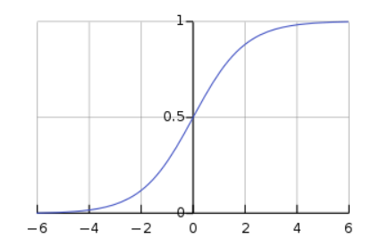
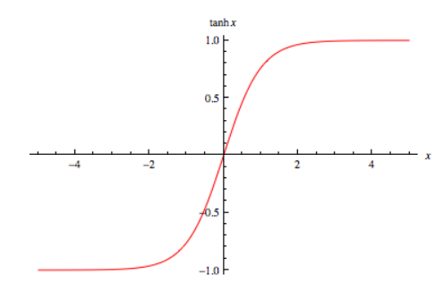
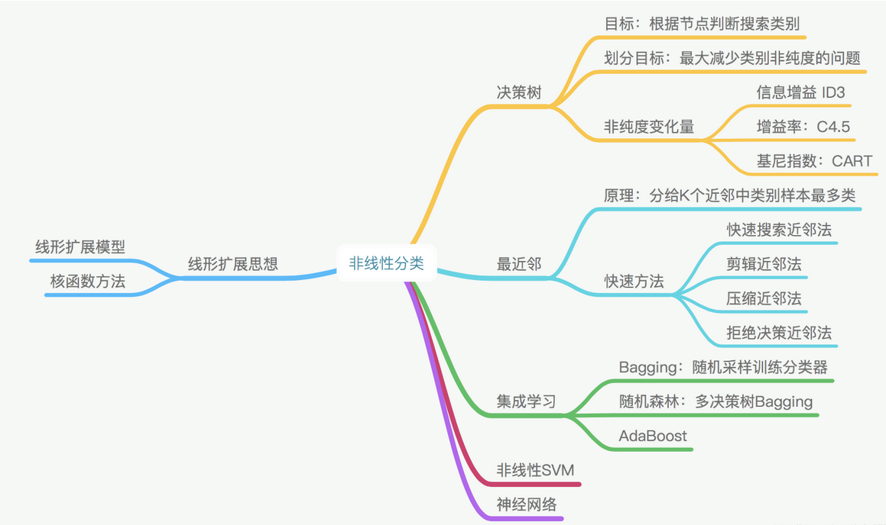
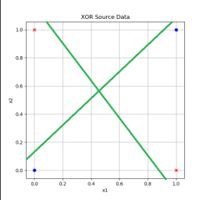
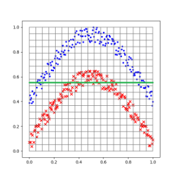
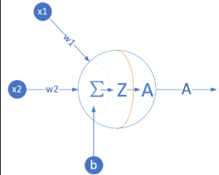
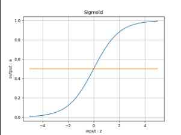

# 非线性回归

## 激活函数

    "在人工神经网络中，激活函数是根据输入定义节点（或神经元）的输出。一般，该输出也会是下一个节点的输入。" - Activation function

为解决非线性问题（实际中大多数问题都是非线性问题），神经网络中引入了激活函数，给网络结构添加了非线性因素，使其能够处理较为复杂的非线性分类问题。

激活函数一般具有以下性质:

        非线性: 当激活函数是线性的时候，一个两层的神经网络就可以逼近基本上所有的函数了。但是，如果激活函数是恒等激活函数的时候，就不满足这个性质了，而且如果多层网络使用的是恒等激活函数，那么其实整个网络跟单层神经网络是等价的。
        连续可微: 当优化方法是基于梯度的时候，这个性质是必须的。
        范围: 当激活函数输出值是有限的时候，基于梯度的优化方法会更加稳定，因为特征的表示受有限权值的影响更显著；当激活函数的输出是无限的时候，模型的训练会更加高效，不过在这种情况下，一般需要更小的learning rate。
        单调性: 当激活函数是单调的时候，单层网络能够保证是凸函数。
        导数单调的光滑函数: 在某些情况下，这些已被证明具有更好的泛化性。
        初始时 f(x)≈x: 当激活函数满足这个性质的时候，如果参数的初始化是random的很小的值，那么神经网络的训练将会很高效；如果不满足这个性质，那么就需要很用心的去设置初始值。
        - Activation function

想要了解更多，可以阅读：

    深度学习-从线性到非线性

常用的激活函数

常用的激活函数有:

    Sigmoid
    Tanh
    ReLU
    Leaky ReLU，PReLU、R-ReLU
    ELU
    Maxout
    Softmax
    其他

Sigmoid

1844年（1845年发表） 就提出来了，经典的激活函数，但是目前使用的不太多。Sigmoid函数单调平滑可导，能够压缩输出数值，但Sigmoid函数左右两端饱和，梯度很小，容易导致梯度损失。除此之外，Sigmoid函数不是关于原点中心对称，函数中的幂运算也相对耗时。

$$Sigmoid(z) = \frac{1}{1 + e^{-z}} \rightarrow a \tag{1}$$

Tanh

与Sigmoid函数很类似，也是经典的激活函数。与Sigmoid函数相比，Tanh改进的地方是函数输出值关于原点中心对称。梯度损失和计算耗时的问题还是存在。
#### 公式  
$$Tanh(z) = \frac{e^{z} - e^{-z}}{e^{z} + e^{-z}} = (\frac{2}{1 + e^{-2z}}-1) \rightarrow a \tag{3}$$
即
$$Tanh(z) = 2 \cdot Sigmoid(2z) - 1 \tag{4}$$

#### 导数公式

$$Tanh'(z) = (1 + a)(1 - a)$$

利用基本导数公式23，令：$u={e^{z}-e^{-z}}，v=e^{z}+e^{-z}$ 则有：

$$
\begin{aligned}
Tanh'(z)&=\frac{u'v-v'u}{v^2} \\\\
&=\frac{(e^{z}-e^{-z})'(e^{z}+e^{-z})-(e^{z}+e^{-z})'(e^{z}-e^{-z})}{(e^{z}+e^{-z})^2} \\\\
&=\frac{(e^{z}+e^{-z})(e^{z}+e^{-z})-(e^{z}-e^{-z})(e^{z}-e^ {-z})}{(e^{z}+e^{-z})^2} \\\\
&=\frac{(e^{z}+e^{-z})^2-(e^{z}-e^{-z})^2}{(e^{z}+e^{-z})^2} \\\\
&=1-(\frac{(e^{z}-e^{-z}}{e^{z}+e^{-z}})^2=1-a^2
\end{aligned}
$$

## 用多项式回归法拟合正弦曲线

多项式回归有几种形式：

#### 一元一次线性模型

因为只有一项，所以不能称为多项式了。它可以解决单变量的线性回归。其模型为：

$$z = x w + b \tag{1}$$

#### 多元一次多项式

多变量的线性回归。其模型为：

$$z = x_1 w_1 + x_2 w_2 + ...+ x_m w_m + b \tag{2}$$

这里的多变量，是指样本数据的特征值为多个，上式中的 $x_1,x_2,...,x_m$ 代表了m个特征值。

#### 一元多次多项式

单变量的非线性回归，比如上面这个正弦曲线的拟合问题，很明显不是线性问题，但是只有一个 $x$ 特征值，所以不满足前两种形式。如何解决这种问题呢？

有一个定理：任意一个函数在一个较小的范围内，都可以用多项式任意逼近。因此在实际工程实践中，有时候可以不管 $y$ 值与 $x$ 值的数学关系究竟是什么，而是强行用回归分析方法进行近似的拟合。

那么如何得到更多的特征值呢？对于只有一个特征值的问题，人们发明了一种聪明的办法，就是把特征值的高次方作为另外的特征值，加入到回归分析中，用公式描述：

$$z = x w_1 + x^2 w_2 + ... + x^m w_m + b \tag{3}$$

上式中x是原有的唯一特征值，$x^m$ 是利用 $x$ 的 $m$ 次方作为额外的特征值，这样就把特征值的数量从 $1$ 个变为 $m$ 个。

换一种表达形式，令：$x_1 = x,x_2=x^2,\ldots,x_m=x^m$，则：

$$z = x_1 w_1 + x_2 w_2 + ... + x_m w_m + b \tag{4}$$

可以看到公式4和上面的公式2是一样的，所以解决方案也一样。

#### 多元多次多项式

多变量的非线性回归，其参数与特征组合繁复，但最终都可以归结为公式2和公式4的形式。

## 双层神经网络实现非线性回归

### 万能近似定理

万能近似定理(universal approximation theorem) $^{[1]}$，是深度学习最根本的理论依据。它证明了在给定网络具有足够多的隐藏单元的条件下，配备一个线性输出层和一个带有任何“挤压”性质的激活函数（如Sigmoid激活函数）的隐藏层的前馈神经网络，能够以任何想要的误差量近似任何从一个有限维度的空间映射到另一个有限维度空间的Borel可测的函数。

前馈网络的导数也可以以任意好地程度近似函数的导数。

万能近似定理其实说明了理论上神经网络可以近似任何函数。但实践上我们不能保证学习算法一定能学习到目标函数。即使网络可以表示这个函数，学习也可能因为两个不同的原因而失败：

1. 用于训练的优化算法可能找不到用于期望函数的参数值；
2. 训练算法可能由于过拟合而选择了错误的函数。

根据“没有免费的午餐”定理，说明了没有普遍优越的机器学习算法。前馈网络提供了表示函数的万能系统，在这种意义上，给定一个函数，存在一个前馈网络能够近似该函数。但不存在万能的过程既能够验证训练集上的特殊样本，又能够选择一个函数来扩展到训练集上没有的点。

总之，具有单层的前馈网络足以表示任何函数，但是网络层可能大得不可实现，并且可能无法正确地学习和泛化。在很多情况下，使用更深的模型能够减少表示期望函数所需的单元的数量，并且可以减少泛化误差。

###  定义神经网络结构

根据万能近似定理的要求，我们定义一个两层的神经网络，输入层不算，一个隐藏层，含3个神经元，一个输出层。

单入单出的双层神经网络

为什么用3个神经元呢？这也是笔者经过多次试验的最佳结果。因为输入层只有一个特征值，我们不需要在隐层放很多的神经元，先用3个神经元试验一下。如果不够的话再增加，神经元数量是由超参控制的。

#### 输入层

输入层就是一个标量x值，如果是成批输入，则是一个矢量或者矩阵，但是特征值数量总为1，因为只有一个横坐标值做为输入。

$$X = (x)$$

#### 权重矩阵W1/B1

$$
W1=
\begin{pmatrix}
w1_{11} & w1_{12} & w1_{13}
\end{pmatrix}
$$

$$
B1=
\begin{pmatrix}
b1_{1} & b1_{2} & b1_{3} 
\end{pmatrix}
$$

#### 隐层

我们用3个神经元：

$$
Z1 = \begin{pmatrix}
    z1_1 & z1_2 & z1_3
\end{pmatrix}
$$

$$
A1 = \begin{pmatrix}
    a1_1 & a1_2 & a1_3
\end{pmatrix}
$$

#### 权重矩阵W2/B2

W2的尺寸是3x1，B2的尺寸是1x1。

$$
W2=
\begin{pmatrix}
w2_{11} \\\\
w2_{21} \\\\
w2_{31}
\end{pmatrix}
$$

$$
B2=
\begin{pmatrix}
b2_{1}
\end{pmatrix}
$$

#### 输出层

由于我们只想完成一个拟合任务，所以输出层只有一个神经元，尺寸为1x1：

$$
Z2 = 
\begin{pmatrix}
    z2_{1}
\end{pmatrix}
$$

### 前向计算

#### 隐层

- 线性计算

$$
z1_{1} = x \cdot w1_{11} + b1_{1}
$$

$$
z1_{2} = x \cdot w1_{12} + b1_{2}
$$

$$
z1_{3} = x \cdot w1_{13} + b1_{3}
$$

矩阵形式：

$$
\begin{aligned}
Z1 &=x \cdot 
\begin{pmatrix}
    w1_{11} & w1_{12} & w1_{13}
\end{pmatrix}
+
\begin{pmatrix}
    b1_{1} & b1_{2} & b1_{3}
\end{pmatrix}
 \\\\
&= X \cdot W1 + B1  
\end{aligned} \tag{1}
$$

- 激活函数

$$
a1_{1} = Sigmoid(z1_{1})
$$

$$
a1_{2} = Sigmoid(z1_{2})
$$

$$
a1_{3} = Sigmoid(z1_{3})
$$

矩阵形式：

$$
A1 = Sigmoid(Z1) \tag{2}
$$

#### 输出层

由于我们只想完成一个拟合任务，所以输出层只有一个神经元：

$$
\begin{aligned}
Z2&=a1_{1}w2_{11}+a1_{2}w2_{21}+a1_{3}w2_{31}+b2_{1} \\\\
&= 
\begin{pmatrix}
a1_{1} & a1_{2} & a1_{3}
\end{pmatrix}
\begin{pmatrix}
w2_{11} \\\\ w2_{21} \\\\ w2_{31}
\end{pmatrix}
+b2_1 \\\\
&=A1 \cdot W2+B2
\end{aligned} \tag{3}
$$

#### 损失函数

均方差损失函数：

$$loss(w,b) = \frac{1}{2} (z2-y)^2 \tag{4}$$

其中，$z2$是预测值，$y$是样本的标签值。

# 非线性分类

为什么必须用双层神经网络

### 分类

我们先回忆一下各种分类的含义：

- 从复杂程度上分，有线性/非线性之分；
- 从样本类别上分，有二分类/多分类之分。

从直观上理解，这几个概念应该符合表10-2中的示例。

 各种分类的组合关系

||二分类|多分类|
|---|---|---|
|线性|||
|非线性|||

 线性分类结果

|XOR问题|弧形问题|
|---|---|
|||
|图中两根直线中的任何一根，都不可能把蓝色点分到一侧，同时红色点在另一侧|对于线性技术来说，它已经尽力了，使得两类样本尽可能地分布在直线的两侧|

###  简单证明异或问题的不可能性

用单个感知机或者单层神经网络，是否能完成异或任务呢？我们自己做个简单的证明。先看样本数据.

 异或的样本数据

|样本|$x_1$|$x_2$|$y$|
|---|---|---|---|
|1|0|0|0|
|2|0|1|1|
|3|1|0|1|
|4|1|1|0|

神经元结构与二分类函数

|神经元|分类函数Logistic|
|--|--|
|||

前向计算公式：

$$z = x_1  w_1 + x_2  w_2 + b \tag{1}$$
$$a = Logistic(z) \tag{2}$$

- 对于第一个样本数据

$x_1=0,x_2=0,y=0$。如果需要$a=y$的话，从Logistic函数曲线看，需要$z<0$，于是有：

$$x_1 w_1 + x_2  w_2 + b < 0$$

因为$x_1=0,x_2=0$，所以只剩下$b$项：

$$b < 0 \tag{3}$$

- 对于第二个样本数据

$x_1=0,x_2=1,y=1$。如果需要$a=y$，则要求$z>0$，不等式为：

$$x_1w_1 + x_2w_2+b=w_2+b > 0 \tag{4}$$

- 对于第三个样本数据

$x_1=1,x_2=0,y=1$。如果需要$a=y$，则要求$z>0$，不等式为：

$$x_1w_1 + x_2w_2+b=w_1+b > 0 \tag{5}$$

- 对于第四个样本

$x_1=1,x_2=1,y=0$。如果需要$a=y$，则要求$z<0$，不等式为：

$$x_1w_1 + x_2w_2+b=w_1+w_2+b < 0 \tag{6}$$

把公式6两边都加$b$，并把公式3接续：

$$(w_1 + b) + (w_2 + b) < b < 0 \tag{7}$$

再看公式4、5，不等式左侧括号内的两个因子都大于0，其和必然也大于0，不可能小于$b$。因此公式7不成立，无论如何也不能满足所有的4个样本的条件，所以单个神经元做异或运算是不可能的。

### 非线性的可能性

我们前边学习过如何实现与、与非、或、或非，我们看看如何用已有的逻辑搭建异或门，如图所示。

 用基本逻辑单元搭建异或运算单元

组合运算的过程

|样本与计算|1|2|3|4|
|----|----|----|----|----|
|$x_1$|0|0|1|1|
|$x_2$|0|1|0|1|
|$s_1=x_1$ NAND $x_2$|1|1|1|0|
|$s_2=x_1$ OR $x_2$|0|1|1|1|
|$y=s_1$ AND $s_2$|0|1|1|0|

经过组合运算后，可以看到$y$的输出与$x_1,x_2$的输入相比，就是异或逻辑了。所以，实践证明两层逻辑电路可以解决问题。另外，我们在地四步中学习了非线性回归，使用双层神经网络可以完成一些神奇的事情，比如复杂曲线的拟合，只需要6、7个参数就搞定了。我们可以模拟这个思路，用两层神经网络搭建模型，来解决非线性分类问题。

## 非线性二分类神经网络

- 输入层两个特征值$x_1,x_2$
  $$
  X=\begin{pmatrix}
    x_1 & x_2
  \end{pmatrix}
  $$
- 隐层$2\times 2$的权重矩阵$W1$
$$
  W1=\begin{pmatrix}
    w1_{11} & w1_{12} \\\\
    w1_{21} & w1_{22} 
  \end{pmatrix}
$$
- 隐层$1\times 2$的偏移矩阵$B1$

$$
  B1=\begin{pmatrix}
    b1_{1} & b1_{2}
  \end{pmatrix}
$$

- 隐层由两个神经元构成
$$
Z1=\begin{pmatrix}
  z1_{1} & z1_{2}
\end{pmatrix}
$$
$$
A1=\begin{pmatrix}
  a1_{1} & a1_{2}
\end{pmatrix}
$$
- 输出层$2\times 1$的权重矩阵$W2$
$$
  W2=\begin{pmatrix}
    w2_{11} \\\\
    w2_{21}  
  \end{pmatrix}
$$

- 输出层$1\times 1$的偏移矩阵$B2$

$$
  B2=\begin{pmatrix}
    b2_{1}
  \end{pmatrix}
$$

- 输出层有一个神经元使用Logistic函数进行分类
$$
  Z2=\begin{pmatrix}
    z2_{1}
  \end{pmatrix}
$$
$$
  A2=\begin{pmatrix}
    a2_{1}
  \end{pmatrix}
$$

## 非线性多分类

定义神经网络结构

先设计出能完成非线性多分类的网络结构，如图所示。

图11-2 非线性多分类的神经网络结构图

- 输入层两个特征值$x_1, x_2$
$$
x=
\begin{pmatrix}
    x_1 & x_2
\end{pmatrix}
$$
- 隐层$2\times 3$的权重矩阵$W1$
$$
W1=
\begin{pmatrix}
    w1_{11} & w1_{12} & w1_{13} \\\\
    w1_{21} & w1_{22} & w1_{23}
\end{pmatrix}
$$

- 隐层$1\times 3$的偏移矩阵$B1$

$$
B1=\begin{pmatrix}
    b1_1 & b1_2 & b1_3 
\end{pmatrix}
$$

- 隐层由3个神经元构成
- 输出层$3\times 3$的权重矩阵$W2$
$$
W2=\begin{pmatrix}
    w2_{11} & w2_{12} & w2_{13} \\\\
    w2_{21} & w2_{22} & w2_{23} \\\\
    w2_{31} & w2_{32} & w2_{33} 
\end{pmatrix}
$$

- 输出层$1\times 1$的偏移矩阵$B2$

$$
B2=\begin{pmatrix}
    b2_1 & b2_2 & b2_3 
  \end{pmatrix}
$$

- 输出层有3个神经元使用Softmax函数进行分类

## 三层神经网络

三层神经网络结构

#### 输入层

共计$28\times 28=784$个特征值：

$$
X=\begin{pmatrix}
    x_1 & x_2 & \cdots & x_{784}
  \end{pmatrix}
$$

#### 隐层1

- 权重矩阵$W1$形状为$784\times 64$

$$
W1=\begin{pmatrix}
    w1_{1,1} & w1_{1,2} & \cdots & w1_{1,64} \\\\
    \vdots & \vdots & \cdots & \vdots \\\\
    w1_{784,1} & w1_{784,2} & \cdots & w1_{784,64} 
  \end{pmatrix}
$$

- 偏移矩阵$B1$的形状为$1\times 64$

$$
B1=\begin{pmatrix}
    b1_{1} & b1_{2} & \cdots & b1_{64}
  \end{pmatrix}
$$

- 隐层1由64个神经元构成，其结果为$1\times 64$的矩阵

$$
Z1=\begin{pmatrix}
    z1_{1} & z1_{2} & \cdots & z1_{64}
  \end{pmatrix}
$$
$$
A1=\begin{pmatrix}
    a1_{1} & a1_{2} & \cdots & a1_{64}
  \end{pmatrix}
$$

#### 隐层2

- 权重矩阵$w2$形状为$64\times 16$

$$
W2=\begin{pmatrix}
    w2_{1,1} & w2_{1,2} & \cdots & w2_{1,16} \\\\
    \vdots & \vdots & \cdots & \vdots \\\\
    w2_{64,1} & w2_{64,2} & \cdots & w2_{64,16} 
  \end{pmatrix}
$$

- 偏移矩阵#B2#的形状是$1\times 16$

$$
B2=\begin{pmatrix}
    b2_{1} & b2_{2} & \cdots & b2_{16}
  \end{pmatrix}
$$

- 隐层2由16个神经元构成

$$
Z2=\begin{pmatrix}
    z2_{1} & z2_{2} & \cdots & z2_{16}
  \end{pmatrix}
$$
$$
A2=\begin{pmatrix}
    a2_{1} & a2_{2} & \cdots & a2_{16}
  \end{pmatrix}
$$

#### 输出层

- 权重矩阵$W3$的形状为$16\times 10$

$$
W3=\begin{pmatrix}
    w3_{1,1} & w3_{1,2} & \cdots & w3_{1,10} \\\\
    \vdots & \vdots & \cdots & \vdots \\\\
    w3_{16,1} & w3_{16,2} & \cdots & w3_{16,10} 
  \end{pmatrix}
$$

- 输出层的偏移矩阵$B3$的形状是$1\times 10$

$$
B3=\begin{pmatrix}
    b3_{1}& b3_{2} & \cdots & b3_{10}
  \end{pmatrix}
$$

- 输出层有10个神经元使用Softmax函数进行分类

$$
Z3=\begin{pmatrix}
    z3_{1} & z3_{2} & \cdots & z3_{10}
  \end{pmatrix}
$$
$$
A3=\begin{pmatrix}
    a3_{1} & a3_{2} & \cdots & a3_{10}
  \end{pmatrix}
$$