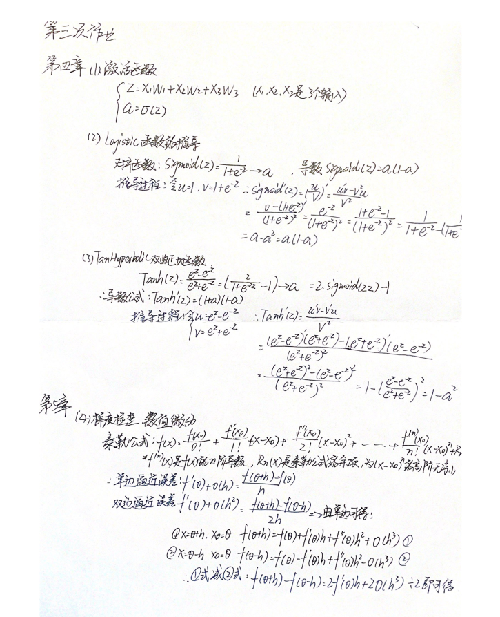

# 第三次作业 Step4&5 学习笔记

# 第四章  非线性回归

## 8.0 激活函数

### 8.0.1 激活函数的基本作用

图8-1是神经网络中的一个神经元，假设该神经元有三个输入，分别为$x_1,x_2,x_3$，那么：

$$z=x_1 w_1 + x_2 w_2 + x_3 w_3 +b \tag{1}$$
$$a = \sigma(z) \tag{2}$$


图8-1 激活函数在神经元中的位置

激活函数也就是 $a=\sigma(z)$ 的作用如下

1. 给神经网络增加非线性因素；
2. 把公式1的计算结果压缩到 $[0,1]$ 之间，便于后面计算。

激活函数的基本性质：

+ 非线性：线性的激活函数和没有激活函数一样；
+ 可导性：做误差反向传播和梯度下降，必须要保证激活函数的可导性；
+ 单调性：单一的输入会得到单一的输出，较大值的输入得到较大值的输出。


### 8.0.2 激活函数的工作特性

激活函数用在神经网络的层与层之间的连接，神经网络的最后一层不用激活函数。

1. 神经网络最后一层不需要激活函数
2. 激活函数只用于连接前后两层神经网络

## 8.1 挤压型激活函数（饱和型激活函数）

挤压型激活函数的特点：当输入值域的绝对值较大，其输出在两端饱和，都有S形的函数曲线与压缩输入值域的作用。

挤压型激活函数 通常用英文Sigmoid来表示；在神经网络中，有两个常用的Sigmoid函数，一个是Logistic函数，另一个是Tanh函数。

### 8.1.1 Logistic函数

对数几率函数（Logistic Function，简称对率函数）。

#### 公式

$$Sigmoid(z) = \frac{1}{1 + e^{-z}} \rightarrow a \tag{1}$$

#### 导数

$$Sigmoid'(z) = a(1 - a) \tag{2}$$

注意，如果是矩阵运算的话，需要在公式2中使用$\odot$符号表示按元素的矩阵相乘：$a\odot (1-a)$，后面不再强调。

推导过程如下：

令：$u=1,v=1+e^{-z}$ 则：

$$
\begin{aligned}
Sigmoid'(z)&= (\frac{u}{v})'=\frac{u'v-v'u}{v^2} \\\\
&=\frac{0-(1+e^{-z})'}{(1+e^{-z})^2}=\frac{e^{-z}}{(1+e^{-z})^2} \\\\
&=\frac{1+e^{-z}-1}{(1+e^{-z})^2}=\frac{1}{1+e^{-z}}-(\frac{1}{1+e^{-z}})^2 \\\\
&=a-a^2=a(1-a)
\end{aligned}
$$

#### 值域

- 输入值域：$(-\infty, \infty)$
- 输出值域：$(0,1)$
- 导数值域：$(0,0.25]$

#### 函数图像


图8-3 Sigmoid函数图像

#### 优点

从函数图像来看，导数简单易求。  

从数学上来看，Sigmoid函数对中央区的信号增益较大，对两侧区的信号增益小，在信号的特征空间映射上，有很好的效果。 

从神经科学上来看，因而在神经网络学习方面，可以将重点特征推向中央区，
将非重点特征推向两侧区。

#### 缺点

指数计算代价大。

### 8.1.2 Tanh函数

TanHyperbolic，即双曲正切函数。

#### 公式  
$$Tanh(z) = \frac{e^{z} - e^{-z}}{e^{z} + e^{-z}} = (\frac{2}{1 + e^{-2z}}-1) \rightarrow a \tag{3}$$
即
$$Tanh(z) = 2 \cdot Sigmoid(2z) - 1 \tag{4}$$

#### 导数公式

$$Tanh'(z) = (1 + a)(1 - a)$$

利用基本导数公式23，令：$u={e^{z}-e^{-z}}，v=e^{z}+e^{-z}$ 则有：

$$
\begin{aligned}
Tanh'(z)&=\frac{u'v-v'u}{v^2} \\\\
&=\frac{(e^{z}-e^{-z})'(e^{z}+e^{-z})-(e^{z}+e^{-z})'(e^{z}-e^{-z})}{(e^{z}+e^{-z})^2} \\\\
&=\frac{(e^{z}+e^{-z})(e^{z}+e^{-z})-(e^{z}-e^{-z})(e^{z}-e^ {-z})}{(e^{z}+e^{-z})^2} \\\\
&=\frac{(e^{z}+e^{-z})^2-(e^{z}-e^{-z})^2}{(e^{z}+e^{-z})^2} \\\\
&=1-(\frac{(e^{z}-e^{-z}}{e^{z}+e^{-z}})^2=1-a^2
\end{aligned}
$$

#### 值域

- 输入值域：$(-\infty,\infty)$
- 输出值域：$(-1,1)$
- 导数值域：$(0,1)$


#### 函数图像

图8-4是双曲正切的函数图像。


图8-4 双曲正切函数图像

#### 优点

从函数图像来看，导数简单易求。  

从数学上来看，Tanh函数对中央区的信号增益较大，对两侧区的信号增益小，在信号的特征空间映射上，有很好的效果。 

从神经科学上来看，因而在神经网络学习方面，可以将重点特征推向中央区，
将非重点特征推向两侧区。

#### 缺点

exp指数计算代价大。
梯度消失问题仍然存在。

## 8.2 半线性激活函数（非饱和型激活函数）

### 8.2.1 ReLU函数 

Rectified Linear Unit，修正线性单元，线性整流函数，又称斜坡函数。

#### 公式

$$ReLU(z) = max(0,z) = \begin{cases} 
  z, & z \geq 0 \\\\ 
  0, & z < 0 
\end{cases}$$

#### 导数

$$ReLU'(z) = \begin{cases} 1 & z \geq 0 \\\\ 0 & z < 0 \end{cases}$$

#### 值域

- 输入值域：$(-\infty, \infty)$
- 输出值域：$(0,\infty)$
- 导数值域：$\\{0,1\\}$


图8-6 线性整流函数ReLU

#### 优点

- 反向导数恒等于1，更加有效率的反向传播梯度值，收敛速度快；
- 避免梯度消失问题；
- 计算简单，速度快；
- 活跃度的分散性使得神经网络的整体计算成本下降。

#### 缺点

无界。

### 8.2.2 Leaky ReLU函数

LReLU，带泄露的线性整流函数。

#### 公式

$$LReLU(z) = \begin{cases} z & z \geq 0 \\\\ \alpha \cdot z & z < 0 \end{cases}$$

#### 导数

$$LReLU'(z) = \begin{cases} 1 & z \geq 0 \\\\ \alpha & z < 0 \end{cases}$$

#### 值域

输入值域：$(-\infty, \infty)$

输出值域：$(-\infty,\infty)$

导数值域：$\\{\alpha,1\\}$

#### 函数图像

函数图像如图8-7所示。


图8-7 LeakyReLU的函数图像

#### 优点

- 反向导数恒等于1，更加有效率的反向传播梯度值，收敛速度快；
- 避免梯度消失问题；
- 计算简单，速度快；
- 活跃度的分散性使得神经网络的整体计算成本下降。

Leaky ReLU同样有收敛快速和运算复杂度低的优点，而且由于给了$z<0$时一个比较小的梯度$\alpha$,使得$z<0$时依旧可以进行梯度传递和更新，可以在一定程度上避免神经元“死”掉的问题。

### 8.2.3 Softplus函数

#### 公式

$$Softplus(z) = \ln (1 + e^z)$$

#### 导数

$$Softplus'(z) = \frac{e^z}{1 + e^z}$$

#### 

输入值域：$(-\infty, \infty)$

输出值域：$(0,\infty)$

导数值域：$(0,1)$

#### 函数图像

Softplus的函数图像如图8-8所示。


图8-8 Softplus的函数图像

### 8.2.4 ELU函数

#### 公式

$$ELU(z) = \begin{cases} z & z \geq 0 \\ \alpha (e^z-1) & z < 0 \end{cases}$$

#### 导数

$$ELU'(z) = \begin{cases} 1 & z \geq 0 \\ \alpha e^z & z < 0 \end{cases}$$

#### 值域

输入值域：$(-\infty, \infty)$

输出值域：$(-\alpha,\infty)$

导数值域：$(0,1]$

#### 函数图像

ELU的函数图像如图8-9所示。


图8-9 ELU的函数图像

## 9.0 非线性回归

### 9.0.1 提出问题一

如图9-1所示的正弦曲线，表9-1给出了部分样本点示例。


图9-1 成正弦曲线分布的样本点

其样本数据如表9-1所示。

表9-1 成正弦曲线分布的样本值

|样本|x|y|
|---|---|---|
|1|0.1199|0.6108|
|2|0.0535|0.3832|
|3|0.6978|0.9496|
|...|...|...|

问题：如何使用神经网络拟合一条有很强规律的曲线，比如正弦曲线？

#### 9.0.2 回归模型的评估标准

回归问题主要以下方法来评价模型，评价标准主要是看求得值与实际结果的偏差有多大

#### 平均绝对误差

MAE（Mean Abolute Error）。

$$MAE=\frac{1}{m} \sum_{i=1}^m \lvert a_i-y_i \rvert \tag{1}$$

对异常值不如均方差敏感，类似中位数。

#### 绝对平均值率误差

MAPE（Mean Absolute Percentage Error）。

$$MAPE=\frac{100}{m} \sum^m_{i=1} \left\lvert {a_i - y_i \over y_i} \right\rvert \tag{2}$$

#### 和方差

SSE（Sum Squared Error）。

$$SSE=\sum_{i=1}^m (a_i-y_i)^2 \tag{3}$$

得出的值与样本数量有关系。

#### 均方差

MSE（Mean Squared Error）。

$$MSE = \frac{1}{m} \sum_{i=1}^m (a_i-y_i)^2 \tag{4}$$

就是实际值减去预测值的平方再求期望，MSE越小，证明误差越小。

#### 均方根误差

RMSE（Root Mean Squard Error）。

$$RMSE = \sqrt{\frac{1}{m} \sum_{i=1}^m (a_i-y_i)^2} \tag{5}$$

是均方差开根号的结果，其实质是一样的，只不过对结果有更好的解释。

#### R平方

R-Squared。

$$R^2=1-\frac{\sum (a_i - y_i)^2}{\sum(\bar y_i-y_i)^2}=1-\frac{MSE(a,y)}{Var(y)} \tag{6}$$

R平方是多元回归中的回归平方和（分子）占总平方和（分母）的比例，它是度量多元回归方程中拟合程度的一个统计量。R平方值越接近1，表明回归平方和占总平方和的比例越大，回归线与各观测点越接近，回归的拟合程度就越好。

## 9.1 多项式回归法拟合正弦曲线

### 1. 多项式回归有几种形式：

#### 一元一次线性模型

$$z = x w + b \tag{1}$$

#### 多元一次多项式

$$z = x_1 w_1 + x_2 w_2 + ...+ x_m w_m + b \tag{2}$$

上式中的 $x_1,x_2,...,x_m$ 代表了m个特征值。

#### 一元多次多项式

$$z = x w_1 + x^2 w_2 + ... + x^m w_m + b \tag{3}$$

上式中x是原有的唯一特征值，$x^m$ 是利用 $x$ 的 $m$ 次方作为额外的特征值，这样就把特征值的数量从 $1$ 个变为 $m$ 个。

换一种表达形式，令：$x_1 = x,x_2=x^2,\ldots,x_m=x^m$，则：

$$z = x_1 w_1 + x_2 w_2 + ... + x_m w_m + b \tag{4}$$

#### 用二次多项式拟合

#### 数据增强

在`ch08.train.npz`中，读出来的`XTrain`数组，只包含1列x的原始值，根据公式5，我们需要再增加一列x的平方值，所以代码如下：

```Python
file_name = "../../data/ch08.train.npz"
class DataReaderEx(SimpleDataReader):
    def Add(self):
        X = self.XTrain[:,]**2
        self.XTrain = np.hstack((self.XTrain, X))
```

从`SimpleDataReader`类中派生出子类`DataReaderEx`，然后添加`Add()`方法，先计算`XTrain`第一列的平方值，放入矩阵X中，然后再把X合并到`XTrain`右侧，这样`XTrain`就变成了两列，第一列是x的原始值，第二列是x的平方值。

#### 主程序

在主程序中，先加载数据，做数据增强，然后建立一个net，参数`num_input=2`，对应着`XTrain`中的两列数据，相当于两个特征值，

```Python
if __name__ == '__main__':
    dataReader = DataReaderEx(file_name)
    dataReader.ReadData()
    dataReader.Add()
    # net
    num_input = 2
    num_output = 1
    params = HyperParameters(num_input, num_output, eta=0.2, max_epoch=10000, batch_size=10, eps=0.005, net_type=NetType.Fitting)
    net = NeuralNet(params)
    net.train(dataReader, checkpoint=10)
    ShowResult(net, dataReader, params.toString())
```

#### 运行结果

表9-4 二次多项式训练过程与结果

|损失函数值|拟合结果|
|---|---|
|||

从表9-4的损失函数曲线上看，没有任何损失值下降的趋势；再看拟合情况，只拟合成了一条直线。说明二次多项式不能满足要求。以下是最后几行的打印输出：

```
......
9989 49 0.09410913779071385
9999 49 0.09628814270449357
W= [[-1.72915813]
 [-0.16961507]]
B= [[0.98611283]]
```

### 9.1.3 用三次多项式拟合

三次多项式的公式：

$$z = x w_1 + x^2 w_2 + x^3 w_3 + b \tag{6}$$

在二次多项式的基础上，把训练数据的再增加一列x的三次方，作为一个新的特征。以下为数据增强代码：

```Python
class DataReaderEx(SimpleDataReader):
    def Add(self):
        X = self.XTrain[:,]**2
        self.XTrain = np.hstack((self.XTrain, X))
        X = self.XTrain[:,0:1]**3
        self.XTrain = np.hstack((self.XTrain, X))
```

修改主过程参数中的`num_input`值：

```Python
    num_input = 3
```

再次运行，得到表9-5所示的结果。

表9-5 三次多项式训练过程与结果

|损失函数值|拟合结果|
|---|---|
|||

以下为打印输出：

```
......
2369 49 0.0050611643902918856
2379 49 0.004949680631526745
W= [[ 10.49907256]
 [-31.06694195]
 [ 20.73039288]]
B= [[-0.07999603]]
```

可以观察到达到0.005的损失值，这个神经网络迭代了2379个`epoch`。

### 9.1.4 用四次多项式拟合

在三次多项式得到比较满意的结果后，我们自然会想知道用四次多项式还会给我们带来惊喜吗？让我们一起试一试。

第一步依然是增加x的4次方作为特征值：

```Python
        X = self.XTrain[:,0:1]**4
        self.XTrain = np.hstack((self.XTrain, X))
```

第二步设置超参num_input=4，然后训练，得到表9-6的结果。

表9-6 四次多项式训练过程与结果

|损失函数值|拟合结果|
|---|---|
|||


```
......
8279 49 0.00500000873141068
8289 49 0.0049964143635271635
W= [[  8.78717   ]
 [-20.55757649]
 [  1.28964911]
 [ 10.88610303]]
B= [[-0.04688634]]
```

### 9.1.5 结果比较

表9-7 不同项数的多项式拟合结果比较

|多项式次数|迭代数|损失函数值|
|:---:|---:|---:|
|2|10000|0.095|
|3|2380|0.005|
|4|8290|0.005|

从表9-7的结果比较中可以得到以下结论：

多项式次数并不是越高越好，对不同的问题，有特定的限制，需要在实践中摸索，并无理论指导。

## 9.2 验证与测试

### 9.2.1 基本概念

#### 训练集

Training Set，用于模型训练的数据样本。

#### 验证集

Validation Set，或者叫做Dev Set，是模型训练中单独留出的样本集，用于调整模型的超参数和对模型的能力进行初步评估。
  
在神经网络中，验证数据集用于：

- 寻找最优的网络深度
- 决定反向传播算法的停止点
- 在神经网络中选择隐藏层神经元的数量

#### 测试集

Test Set，用来评估最终模型的泛化能力。但不能作为调参、选择特征等算法相关的选择的依据。

三者之间的关系如图9-5所示。


图9-5 训练集、验证集、测试集的关系

### 9.2.2 留出法 Hold out

留出法，即从训练数据中保留出验证样本集。

### 9.3.4 代码实现

定义DataReader类如下：

```Python
class DataReader(object):
    def __init__(self, train_file, test_file):
        self.train_file_name = train_file
        self.test_file_name = test_file
        self.num_train = 0        # num of training examples
        self.num_test = 0         # num of test examples
        self.num_validation = 0   # num of validation examples
        self.num_feature = 0      # num of features
        self.num_category = 0     # num of categories
        self.XTrain = None        # training feature set
        self.YTrain = None        # training label set
        self.XTest = None         # test feature set
        self.YTest = None         # test label set
        self.XTrainRaw = None     # training feature set before normalization
        self.YTrainRaw = None     # training label set before normalization
        self.XTestRaw = None      # test feature set before normalization
        self.YTestRaw = None      # test label set before normalization
        self.XVld = None          # validation feature set
        self.YVld = None          # validation lable set
```

命名规则：

1. 以`num_`开头的表示一个整数，后面跟着数据集的各种属性的名称，如训练集（`num_train`）、测试集（`num_test`）、验证集（`num_validation`）、特征值数量（`num_feature`）、分类数量（`num_category`）；
2. `X`表示样本特征值数据，`Y`表示样本标签值数据；
3. `Raw`表示没有经过归一化的原始数据。


## 9.3 双层神经网络实现非线性回归

### 9.3.1 万能近似定理

万能近似定理(universal approximation theorem) $^{[1]}$，是深度学习最根本的理论依据。它证明了在给定网络具有足够多的隐藏单元的条件下，配备一个线性输出层和一个带有任何“挤压”性质的激活函数（如Sigmoid激活函数）的隐藏层的前馈神经网络，能够以任何想要的误差量近似任何从一个有限维度的空间映射到另一个有限维度空间的Borel可测的函数。

### 9.3.2 代码实现

主要讲解神经网络`NeuralNet2`类的代码，其它的类都是辅助类。

#### 前向计算

```Python
class NeuralNet2(object):
    def forward(self, batch_x):
        # layer 1
        self.Z1 = np.dot(batch_x, self.wb1.W) + self.wb1.B
        self.A1 = Sigmoid().forward(self.Z1)
        # layer 2
        self.Z2 = np.dot(self.A1, self.wb2.W) + self.wb2.B
        if self.hp.net_type == NetType.BinaryClassifier:
            self.A2 = Logistic().forward(self.Z2)
        elif self.hp.net_type == NetType.MultipleClassifier:
            self.A2 = Softmax().forward(self.Z2)
        else:   # NetType.Fitting
            self.A2 = self.Z2
        #end if
        self.output = self.A2
```        
在`Layer2`中考虑了多种网络类型，在此我们暂时只关心`NetType.Fitting`类型。

#### 反向传播
```Python
class NeuralNet2(object):
    def backward(self, batch_x, batch_y, batch_a):
        # 批量下降，需要除以样本数量，否则会造成梯度爆炸
        m = batch_x.shape[0]
        # 第二层的梯度输入 公式5
        dZ2 = self.A2 - batch_y
        # 第二层的权重和偏移 公式6
        self.wb2.dW = np.dot(self.A1.T, dZ2)/m 
        # 公式7 对于多样本计算，需要在横轴上做sum，得到平均值
        self.wb2.dB = np.sum(dZ2, axis=0, keepdims=True)/m 
        # 第一层的梯度输入 公式8
        d1 = np.dot(dZ2, self.wb2.W.T) 
        # 第一层的dZ 公式10
        dZ1,_ = Sigmoid().backward(None, self.A1, d1)
        # 第一层的权重和偏移 公式11
        self.wb1.dW = np.dot(batch_x.T, dZ1)/m
        # 公式12 对于多样本计算，需要在横轴上做sum，得到平均值
        self.wb1.dB = np.sum(dZ1, axis=0, keepdims=True)/m 
```
反向传播部分的代码完全按照公式推导的结果实现。

#### 保存和加载权重矩阵数据

在训练结束后，或者每个epoch结束后，都可以选择保存训练好的权重矩阵值，避免每次使用时重复训练浪费时间。

而在初始化完毕神经网络后，可以立刻加载历史权重矩阵数据（前提是本次的神经网络设置与保存时的一致），这样可以在历史数据的基础上继续训练，不会丢失以前的进度。

```Python
    def SaveResult(self):
        self.wb1.SaveResultValue(self.subfolder, "wb1")
        self.wb2.SaveResultValue(self.subfolder, "wb2")

    def LoadResult(self):
        self.wb1.LoadResultValue(self.subfolder, "wb1")
        self.wb2.LoadResultValue(self.subfolder, "wb2")
```


## 9.5 曲线拟合


### 9.5.1 正弦曲线的拟合

#### 隐层只有一个神经元的情况

令`n_hidden=1`，并指定模型名称为`sin_111`，训练过程见图9-10。图9-11为拟合效果图。


图9-10 训练过程中损失函数值和准确率的变化


图9-11 一个神经元的拟合效果

从图9-10可以看到，损失值到0.04附近就很难下降了。图9-11中，可以看到只有中间线性部分拟合了，两端的曲线部分没有拟合。

```
......
epoch=4999, total_iteration=224999
loss_train=0.015787, accuracy_train=0.943360
loss_valid=0.038609, accuracy_valid=0.821760
testing...
0.8575700023301912
```

打印输出最后的测试集精度值为85.7%，不是很理想。所以隐层1个神经元是基本不能工作的，这只比单层神经网络的线性拟合强一些，距离目标还差很远。

#### 隐层有两个神经元的情况

```Python
if __name__ == '__main__':
    ......
    n_input, n_hidden, n_output = 1, 2, 1
    eta, batch_size, max_epoch = 0.05, 10, 5000
    eps = 0.001
    hp = HyperParameters2(n_input, n_hidden, n_output, eta, max_epoch, batch_size, eps, NetType.Fitting, InitialMethod.Xavier)
    net = NeuralNet2(hp, "sin_121")
    #net.LoadResult()
    net.train(dataReader, 50, True)
    ......
```

初始化神经网络类的参数有两个，第一个是超参组合`hp`，第二个是指定模型专有名称，以便把结果保存在名称对应的子目录中。保存训练结果的代码在训练结束后自动调用，但是如果想加载历史训练结果，需要在主过程中手动调用，比如上面代码中注释的那一行：`net.LoadResult()`。这样的话，如果下次再训练，就可以在以前的基础上继续训练，不必从头开始。

注意在主过程代码中，我们指定了n_hidden=2，意为隐层神经元数量为2。

#### 运行结果

图9-12为损失函数曲线和验证集精度曲线，都比较正常。而2个神经元的网络损失值可以达到0.004，少一个数量级。验证集精度到82%左右，而2个神经元的网络可以达到97%。图9-13为拟合效果图。


图9-12 两个神经元的训练过程中损失函数值和准确率的变化


图9-13 两个神经元的拟合效果

再看下面的打印输出结果，最后测试集的精度为98.8%。如果需要精度更高的话，可以增加迭代次数。

```
......
epoch=4999, total_iteration=224999
loss_train=0.007681, accuracy_train=0.971567
loss_valid=0.004366, accuracy_valid=0.979845
testing...
0.9881468747638157
```
## 9.6 非线性回归的工作原理

### 9.6.1 神经网络的非线性拟合工作原理

下面是具体的工作步骤。

#### 第一步 把X拆成两个线性序列z1和z2

#### 第二步 计算z1的激活函数值a1

#### 第三步 计算z2的激活函数值a2

#### 第四步 计算Z值

表9-19和图9-22分别展示了输出层对两个特征值的计算结果数值和示意图。

表9-19 输出层的计算结果数值

||0|1|2|...|19|20|21|
|--|--|--|--|--|--|--|--|
|a1|0.786|0.763|0.738|...|0.249|0.225|0.203|
|a2|0.989|0.983|0.973|...|0.026|0.017|0.011|
|z|0.202|0.383|0.561|...|-0.580|-0.409|-0.235|

$$z = a1 \cdot w_{11} + a2 \cdot w_{21} + b \tag{6}$$

其中：

- $w_{11}=-9.374$
- $w_{21}=6.039$
- $b=1.599$
  


图9-22 输出层的计算结果可视化

### 9.6.3 比较多项式回归和双层神经网络解法
多项式回归和神经网络的比较

||多项式回归|双层神经网络|
|---|---|---|
|特征提取方式|特征值的高次方|线性变换拆分|
|特征值数量级|高几倍的数量级|数量级与原特征值相同|
|训练效率|低，需要迭代次数多|高，比前者少好几个数量级|


# 第五步  非线性分类

# 第10章 多入单出的双层神经网络 - 非线性二分类

## 10.0 非线性二分类问题

### 10.0.1 二分类模型的评估标准

#### 准确率 Accuracy

也称为精度。

对于二分类问题，假设测试集上一共1000个样本，其中550个正例，450个负例。测试一个模型时，得到的结果是：521个正例样本被判断为正类，435个负例样本被判断为负类，则正确率计算如下：

$$Accuracy=(521+435)/1000=0.956$$


#### 混淆矩阵

还是用上面的例子，如果具体深入到每个类别上，会分成4部分来评估：

- 正例中被判断为正类的样本数（TP-True Positive）：521
- 正例中被判断为负类的样本数（FN-False Negative）：550-521=29
- 负例中被判断为负类的样本数（TN-True Negative）：435
- 负例中被判断为正类的样本数（FP-False Positive）：450-435=15

从混淆矩阵中可以得出以下统计指标：

- 准确率 Accuracy

$$
\begin{aligned}
Accuracy &= \frac{TP+TN}{TP+TN+FP+FN} \\\\
&=\frac{521+435}{521+29+435+15}=0.956
\end{aligned}
$$

这个指标就是上面提到的准确率，越大越好。

- 精确率/查准率 Precision

分子为被判断为正类并且真的是正类的样本数，分母是被判断为正类的样本数。越大越好。

$$
Precision=\frac{TP}{TP+FP}=\frac{521}{521+15}=0.972
$$

- 召回率/查全率 Recall

$$
Recall = \frac{TP}{TP+FN}=\frac{521}{521+29}=0.947
$$

分子为被判断为正类并且真的是正类的样本数，分母是真的正类的样本数。越大越好。

- TPR - True Positive Rate 真正例率

$$
TPR = \frac{TP}{TP + FN}=Recall=0.947
$$

- FPR - False Positive Rate 假正例率

$$
FPR = \frac{FP}{FP+TN}=\frac{15}{15+435}=0.033
$$

分子为被判断为正类的负例样本数，分母为所有负类样本数。越小越好。

- 调和平均值 F1

$$
\begin{aligned}
F1&=\frac{2 \times Precision \times Recall}{recision+Recall}\\\\
&=\frac{2 \times 0.972 \times 0.947}{0.972+0.947}=0.959
\end{aligned}
$$

该值越大越好。

- ROC曲线与AUC

ROC，Receiver Operating Characteristic，接收者操作特征，又称为感受曲线（Sensitivity Curve），是反映敏感性和特异性连续变量的综合指标，曲线上各点反映着相同的感受性，它们都是对同一信号刺激的感受性。
ROC曲线的横坐标是FPR，纵坐标是TPR。

AUC，Area Under Roc，即ROC曲线下面的面积。

#### Kappa statics 

Kappa值，即内部一致性系数(inter-rater,coefficient of internal consistency)，是作为评价判断的一致性程度的重要指标。取值在0～1之间。

$$
Kappa = \frac{p_o-p_e}{1-p_e}
$$

其中，$p_0$是每一类正确分类的样本数量之和除以总样本数，也就是总体分类精度。$p_e$的定义见以下公式。

- Kappa≥0.75两者一致性较好；
- 0.75>Kappa≥0.4两者一致性一般；
- Kappa<0.4两者一致性较差。 

该系数通常用于多分类情况，如：

||实际类别A|实际类别B|实际类别C|预测总数|
|--|--|--|--|--|
|预测类别A|239|21|16|276|
|预测类别B|16|73|4|93|
|预测类别C|6|9|280|295|
|实际总数|261|103|300|664|


$$
p_o=\frac{239+73+280}{664}=0.8916
$$
$$
p_e=\frac{261 \times 276 + 103 \times 93 + 300 \times 295}{664 \times 664}=0.3883
$$
$$
Kappa = \frac{0.8916-0.3883}{1-0.3883}=0.8228
$$

数据一致性较好，说明分类器性能好。

#### Mean absolute error 和 Root mean squared error 

平均绝对误差和均方根误差，用来衡量分类器预测值和实际结果的差异，越小越好。

#### Relative absolute error 和 Root relative squared error 

相对绝对误差和相对均方根误差，有时绝对误差不能体现误差的真实大小，而相对误差通过体现误差占真值的比重来反映误差大小。

## 10.2 非线性二分类实现

### 10.2.1 定义神经网络结构

首先定义可以完成非线性二分类的神经网络结构图，如图10-6所示。


图10-6 非线性二分类神经网络结构图

- 输入层两个特征值$x_1,x_2$
  $$
  X=\begin{pmatrix}
    x_1 & x_2
  \end{pmatrix}
  $$
- 隐层$2\times 2$的权重矩阵$W1$
$$
  W1=\begin{pmatrix}
    w1_{11} & w1_{12} \\\\
    w1_{21} & w1_{22} 
  \end{pmatrix}
$$
- 隐层$1\times 2$的偏移矩阵$B1$

$$
  B1=\begin{pmatrix}
    b1_{1} & b1_{2}
  \end{pmatrix}
$$

- 隐层由两个神经元构成
$$
Z1=\begin{pmatrix}
  z1_{1} & z1_{2}
\end{pmatrix}
$$
$$
A1=\begin{pmatrix}
  a1_{1} & a1_{2}
\end{pmatrix}
$$
- 输出层$2\times 1$的权重矩阵$W2$
$$
  W2=\begin{pmatrix}
    w2_{11} \\\\
    w2_{21}  
  \end{pmatrix}
$$

- 输出层$1\times 1$的偏移矩阵$B2$

$$
  B2=\begin{pmatrix}
    b2_{1}
  \end{pmatrix}
$$

- 输出层有一个神经元使用Logistic函数进行分类
$$
  Z2=\begin{pmatrix}
    z2_{1}
  \end{pmatrix}
$$
$$
  A2=\begin{pmatrix}
    a2_{1}
  \end{pmatrix}
$$


### 10.2.2 前向计算

根据网络结构，我们有了前向计算过程图10-8。


图10-8 前向计算过程

#### 第一层

- 线性计算

$$
z1_{1} = x_{1} w1_{11} + x_{2} w1_{21} + b1_{1}
$$
$$
z1_{2} = x_{1} w1_{12} + x_{2} w1_{22} + b1_{2}
$$
$$
Z1 = X \cdot W1 + B1
$$

- 激活函数

$$
a1_{1} = Sigmoid(z1_{1})
$$
$$
a1_{2} = Sigmoid(z1_{2})
$$
$$
A1=\begin{pmatrix}
  a1_{1} & a1_{2}
\end{pmatrix}=Sigmoid(Z1)
$$

#### 第二层

- 线性计算

$$
z2_1 = a1_{1} w2_{11} + a1_{2} w2_{21} + b2_{1}
$$
$$
Z2 = A1 \cdot W2 + B2
$$

- 分类函数

$$a2_1 = Logistic(z2_1)$$
$$A2 = Logistic(Z2)$$

#### 损失函数

我们把异或问题归类成二分类问题，所以使用二分类交叉熵损失函数：

$$
loss = -Y \ln A2 + (1-Y) \ln (1-A2) \tag{12}
$$

在二分类问题中，$Y,A2$都是一个单一的数值，而非矩阵，但是为了前后统一，我们可以把它们看作是一个$1\times 1$的矩阵。

### 10.2.3 反向传播

图10-9展示了反向传播的过程。


图10-9 反向传播过程


## 10.5 实现双弧形二分类

### 10.5.1 代码实现

#### 主过程代码

```Python
if __name__ == '__main__':
    ......
    n_input = dataReader.num_feature
    n_hidden = 2
    n_output = 1
    eta, batch_size, max_epoch = 0.1, 5, 10000
    eps = 0.08

    hp = HyperParameters2(n_input, n_hidden, n_output, eta, max_epoch, batch_size, eps, NetType.BinaryClassifier, InitialMethod.Xavier)
    net = NeuralNet2(hp, "Arc_221")
    net.train(dataReader, 5, True)
    net.ShowTrainingTrace()
```

### 10.5.2 运行结果

经过快速的迭代，训练完毕后，会显示损失函数曲线和准确率曲线如图10-15。


图10-15 训练过程中的损失函数值和准确率值的变化

蓝色的线条是小批量训练样本的曲线，波动相对较大，不必理会，因为批量小势必会造成波动。红色曲线是验证集的走势，可以看到二者的走势很理想，经过一小段时间的磨合后，从第200个`epoch`开始，两条曲线都突然找到了突破的方向，然后只用了50个`epoch`，就迅速达到指定精度。


## 11.1 非线性多分类


### 11.1.2 前向计算

根据网络结构，可以绘制前向计算图，如图11-3所示。


图11-3 前向计算图

#### 第一层

- 线性计算

$$
z1_1 = x_1 w1_{11} + x_2 w1_{21} + b1_1
$$
$$
z1_2 = x_1 w1_{12} + x_2 w1_{22} + b1_2
$$
$$
z1_3 = x_1 w1_{13} + x_2 w1_{23} + b1_3
$$
$$
Z1 = X \cdot W1 + B1
$$

- 激活函数

$$
a1_1 = Sigmoid(z1_1) 
$$
$$
a1_2 = Sigmoid(z1_2) 
$$
$$
a1_3 = Sigmoid(z1_3) 
$$
$$
A1 = Sigmoid(Z1)
$$

#### 第二层

- 线性计算

$$
z2_1 = a1_1 w2_{11} + a1_2 w2_{21} + a1_3 w2_{31} + b2_1
$$
$$
z2_2 = a1_1 w2_{12} + a1_2 w2_{22} + a1_3 w2_{32} + b2_2
$$
$$
z2_3 = a1_1 w2_{13} + a1_2 w2_{23} + a1_3 w2_{33} + b2_3
$$
$$
Z2 = A1 \cdot W2 + B2
$$

- 分类函数

$$
a2_1 = \frac{e^{z2_1}}{e^{z2_1} + e^{z2_2} + e^{z2_3}}
$$
$$
a2_2 = \frac{e^{z2_2}}{e^{z2_1} + e^{z2_2} + e^{z2_3}}
$$
$$
a2_3 = \frac{e^{z2_3}}{e^{z2_1} + e^{z2_2} + e^{z2_3}}
$$
$$
A2 = Softmax(Z2)
$$

#### 损失函数

使用多分类交叉熵损失函数：
$$
loss = -(y_1 \ln a2_1 + y_2 \ln a2_2 + y_3 \ln a2_3)
$$
$$
J(w,b) = -\frac{1}{m} \sum^m_{i=1} \sum^n_{j=1} y_{ij} \ln (a2_{ij})
$$

$m$为样本数，$n$为类别数。

### 11.1.3 反向传播

根据前向计算图，可以绘制出反向传播的路径如图11-4。


图11-4 反向传播图

在第7.1中学习过了Softmax与多分类交叉熵配合时的反向传播推导过程，最后是一个很简单的减法：

$$
\frac{\partial loss}{\partial Z2}=A2-y \rightarrow dZ2
$$

从Z2开始再向前推的话，和10.2节是一模一样的，所以直接把结论拿过来：

$$
\frac{\partial loss}{\partial W2}=A1^{\top} \cdot dZ2 \rightarrow dW2
$$
$$\frac{\partial{loss}}{\partial{B2}}=dZ2 \rightarrow dB2$$
$$
\frac{\partial A1}{\partial Z1}=A1 \odot (1-A1) \rightarrow dA1
$$
$$
\frac{\partial loss}{\partial Z1}=dZ2 \cdot W2^{\top} \odot dA1 \rightarrow dZ1 
$$
$$
dW1=X^{\top} \cdot dZ1
$$
$$
dB1=dZ1
$$

### 11.1.4 代码实现

绝大部分代码都在`HelperClass2`目录中的基本类实现，这里只有主过程：

```Python
if __name__ == '__main__':
    ......
    n_input = dataReader.num_feature
    n_hidden = 3
    n_output = dataReader.num_category
    eta, batch_size, max_epoch = 0.1, 10, 5000
    eps = 0.1
    hp = HyperParameters2(n_input, n_hidden, n_output, eta, max_epoch, batch_size, eps, NetType.MultipleClassifier, InitialMethod.Xavier)
    # create net and train
    net = NeuralNet2(hp, "Bank_233")
    net.train(dataReader, 100, True)
    net.ShowTrainingTrace()
    # show result
    ......
```

过程描述：

1. 读取数据文件
2. 显示原始数据样本分布图
3. 其它数据操作：归一化、打乱顺序、建立验证集
4. 设置超参
5. 建立神经网络开始训练
6. 显示训练结果


## 12.1 三层神经网络的实现

### 12.1.1 定义神经网络

设计一个三层神经网络结构，如图12-2所示。


图12-2 三层神经网络结构

### 12.1.4 代码实现

在`HelperClass3` / `NeuralNet3.py`中，下面主要列出与两层网络不同的代码。

#### 初始化

```Python
class NeuralNet3(object):
    def __init__(self, hp, model_name):
        ...
        self.wb1 = WeightsBias(self.hp.num_input, self.hp.num_hidden1, self.hp.init_method, self.hp.eta)
        self.wb1.InitializeWeights(self.subfolder, False)
        self.wb2 = WeightsBias(self.hp.num_hidden1, self.hp.num_hidden2, self.hp.init_method, self.hp.eta)
        self.wb2.InitializeWeights(self.subfolder, False)
        self.wb3 = WeightsBias(self.hp.num_hidden2, self.hp.num_output, self.hp.init_method, self.hp.eta)
        self.wb3.InitializeWeights(self.subfolder, False)
```
初始化部分需要构造三组`WeightsBias`对象，请注意各组的输入输出数量，决定了矩阵的形状。

#### 前向计算

```Python
    def forward(self, batch_x):
        # 公式1
        self.Z1 = np.dot(batch_x, self.wb1.W) + self.wb1.B
        # 公式2
        self.A1 = Sigmoid().forward(self.Z1)
        # 公式3
        self.Z2 = np.dot(self.A1, self.wb2.W) + self.wb2.B
        # 公式4
        self.A2 = Tanh().forward(self.Z2)
        # 公式5
        self.Z3 = np.dot(self.A2, self.wb3.W) + self.wb3.B
        # 公式6
        if self.hp.net_type == NetType.BinaryClassifier:
            self.A3 = Logistic().forward(self.Z3)
        elif self.hp.net_type == NetType.MultipleClassifier:
            self.A3 = Softmax().forward(self.Z3)
        else:   # NetType.Fitting
            self.A3 = self.Z3
        #end if
        self.output = self.A3
```
前向计算部分增加了一层，并且使用`Tanh()`作为激活函数。

- 反向传播
```Python
    def backward(self, batch_x, batch_y, batch_a):
        # 批量下降，需要除以样本数量，否则会造成梯度爆炸
        m = batch_x.shape[0]

        # 第三层的梯度输入 公式7
        dZ3 = self.A3 - batch_y
        # 公式8
        self.wb3.dW = np.dot(self.A2.T, dZ3)/m
        # 公式9
        self.wb3.dB = np.sum(dZ3, axis=0, keepdims=True)/m 

        # 第二层的梯度输入 公式10
        dA2 = np.dot(dZ3, self.wb3.W.T)
        # 公式11
        dZ2,_ = Tanh().backward(None, self.A2, dA2)
        # 公式12
        self.wb2.dW = np.dot(self.A1.T, dZ2)/m 
        # 公式13
        self.wb2.dB = np.sum(dZ2, axis=0, keepdims=True)/m 

        # 第一层的梯度输入 公式8
        dA1 = np.dot(dZ2, self.wb2.W.T) 
        # 第一层的dZ 公式10
        dZ1,_ = Sigmoid().backward(None, self.A1, dA1)
        # 第一层的权重和偏移 公式11
        self.wb1.dW = np.dot(batch_x.T, dZ1)/m
        self.wb1.dB = np.sum(dZ1, axis=0, keepdims=True)/m 

    def update(self):
        self.wb1.Update()
        self.wb2.Update()
        self.wb3.Update()
```
反向传播也相应地增加了一层，注意要用对应的`Tanh()`的反向公式。梯度更新时也是三组权重值同时更新。

- 主过程

```Python
if __name__ == '__main__':
    ......
    n_input = dataReader.num_feature
    n_hidden1 = 64
    n_hidden2 = 16
    n_output = dataReader.num_category
    eta = 0.2
    eps = 0.01
    batch_size = 128
    max_epoch = 40

    hp = HyperParameters3(n_input, n_hidden1, n_hidden2, n_output, eta, max_epoch, batch_size, eps, NetType.MultipleClassifier, InitialMethod.Xavier)
    net = NeuralNet3(hp, "MNIST_64_16")
    net.train(dataReader, 0.5, True)
    net.ShowTrainingTrace(xline="iteration")
```
超参配置：第一隐层64个神经元，第二隐层16个神经元，学习率0.2，批大小128，Xavier初始化，最大训练40个epoch。


## 12.2 梯度检查

### 12.2.2 数值微分

#### 泰勒公式

泰勒公式是将一个在$x=x_0$处具有n阶导数的函数$f(x)$利用关于$(x-x_0)$的n次多项式来逼近函数的方法。若函数$f(x)$在包含$x_0$的某个闭区间$[a,b]$上具有n阶导数，且在开区间$(a,b)$上具有$n+1$阶导数，则对闭区间$[a,b]$上任意一点$x$，下式成立：

$$f(x)=\frac{f(x_0)}{0!} + \frac{f'(x_0)}{1!}(x-x_0)+\frac{f''(x_0)}{2!}(x-x_0)^2 + ...+\frac{f^{(n)}(x_0)}{n!}(x-x_0)^n+R_n(x) \tag{3}$$

其中,$f^{(n)}(x)$表示$f(x)$的$n$阶导数，等号后的多项式称为函数$f(x)$在$x_0$处的泰勒展开式，剩余的$R_n(x)$是泰勒公式的余项，是$(x-x_0)^n$的高阶无穷小。 

利用泰勒展开公式，令$x=\theta + h, x_0=\theta$，我们可以得到：

$$f(\theta + h)=f(\theta) + f'(\theta)h + O(h^2) \tag{4}$$

#### 单边逼近误差

如果用单边逼近，把公式4两边除以$h$后变形：

$$f'(\theta) + O(h)=\frac{f(\theta+h)-f(\theta)}{h} \tag{5}$$

公式5已经和公式1的定义非常接近了，只是左侧多出来的第二项，就是逼近的误差，是个$O(h)$级别的误差项。

#### 双边逼近误差

如果用双边逼近，我们用三阶泰勒展开：

令$x=\theta + h, x_0=\theta$，我们可以得到：

$$f(\theta + h)=f(\theta) + f'(\theta)h + f''(\theta)h^2 + O(h^3) \tag{6}$$

再令$x=\theta - h, x_0=\theta$我们可以得到：

$$f(\theta - h)=f(\theta) - f'(\theta)h + f''(\theta)h^2 - O(h^3) \tag{7}$$

公式6减去公式7，有：

$$f(\theta + h) - f(\theta - h)=2f'(\theta)h + 2O(h^3) \tag{8}$$

两边除以$2h$：

$$f'(\theta) + O(h^2)={f(\theta + h) - f(\theta - h) \over 2h} \tag{9}$$

公式9中，左侧多出来的第二项，就是双边逼近的误差，是个$O(h^2)$级别的误差项，比公式5中的误差项小很多数量级。
  
### 12.2.5 注意事项

1. 首先，不要使用梯度检验去训练，即不要使用梯度检验方法去计算梯度，因为这样做太慢了。

2. 其次，如果我们在使用梯度检验过程中发现backprop过程出现了问题，就需要对所有的参数进行计算，以判断造成计算偏差的来源在哪里，梯度检验可以帮助我们确定发生问题的范围，以帮助我们调试。

3. 如果添加了二范数正则化，在使用backprop计算参数梯度时，不要忘记梯度的形式已经发生了变化，要记得加上正则化部分，同理，在进行梯度检验时，也要记得目标函数$J$的形式已经发生了变化。

4. 注意，如果我们使用了drop-out正则化，梯度检验就不可用了。

## 12.3 学习率与批大小


### 12.3.1 关于学习率的挑战

普通梯度下降法，包含三种形式：

1. 单样本
2. 全批量样本
3. 小批量样本

我们通常把1和3统称为SGD(Stochastic Gradient Descent)。当批量不是很大时，全批量也可以纳入此范围。大的含义是：万级以上的数据量。

使用梯度下降的这些形式时，我们通常面临以下挑战：

1. 很难选择出合适的学习率
   
   太小的学习率会导致网络收敛过于缓慢，而学习率太大可能会影响收敛，并导致损失函数在最小值上波动，甚至出现梯度发散。
   
2. 相同的学习率并不适用于所有的参数更新
   
   如果训练集数据很稀疏，且特征频率非常不同，则不应该将其全部更新到相同的程度，但是对于很少出现的特征，应使用更大的更新率。
   
3. 避免陷于多个局部最小值中。
   
   实际上，问题并非源于局部最小值，而是来自鞍点，即一个维度向上倾斜且另一维度向下倾斜的点。这些鞍点通常被相同误差值的平面所包围，这使得SGD算法很难脱离出来，因为梯度在所有维度上接近于零。

表12-1 鞍点和驻点

|鞍点|驻点|
|---|---|
|||

表12-1中左图就是鞍点的定义，在鞍点附近，梯度下降算法经常会陷入泥潭，从而产生右图一样的历史记录曲线：有一段时间，Loss值随迭代次数缓慢下降，似乎在寻找突破口，然后忽然找到了，就一路下降，最终收敛。

为什么在3000至6000个epoch之间，有很大一段平坦地段，Loss值并没有显著下降？这其实也体现了这个问题的实际损失函数的形状，在这一区域上梯度比较平缓，以至于梯度下降算法并不能找到合适的突破方向寻找最优解，而是在原地徘徊。这一平缓地区就是损失函数的鞍点。

### 12.3.2 初始学习率的选择

我们前面一直使用固定的学习率，比如0.1或者0.05，而没有采用0.5、0.8这样高的学习率。这是因为在接近极小点时，损失函数的梯度也会变小，使用小的学习率时，不会担心步子太大越过极小点。

保证SGD收敛的充分条件是：

$$\sum_{k=1}^\infty \eta_k = \infty \tag{2}$$

且： 

$$\sum_{k=1}^\infty \eta^2_k < \infty \tag{3}$$ 

图12-5是不同的学习率的选择对训练结果的影响。


图12-5 学习率对训练的影响

- 黄色：学习率太大，loss值增高，网络发散
- 红色：学习率可以使网络收敛，但值较大，开始时loss值下降很快，但到达极值点附近时，在最优解附近来回跳跃
- 绿色：正确的学习率设置
- 蓝色：学习率值太小，loss值下降速度慢，训练次数长，收敛慢

有一种方式可以帮助我们快速找到合适的初始学习率。

Leslie N. Smith 在2015年的一篇论文[Cyclical Learning Rates for Training Neural Networks](https://arxiv.org/abs/1506.01186)中的描述了一个非常棒的方法来找初始学习率。

这个方法在论文中是用来估计网络允许的最小学习率和最大学习率，我们也可以用来找我们的最优初始学习率，方法非常简单：

1. 首先我们设置一个非常小的初始学习率，比如`1e-5`；
2. 然后在每个`batch`之后都更新网络，计算损失函数值，同时增加学习率；
3. 最后我们可以描绘出学习率的变化曲线和loss的变化曲线，从中就能够发现最好的学习率。

表12-2就是随着迭代次数的增加，学习率不断增加的曲线，以及不同的学习率对应的loss的曲线（理想中的曲线）。

表12-2 试验最佳学习率

|随着迭代次数增加学习率|观察Loss值与学习率的关系|
|---|---|
|||

从表12-2的右图可以看到，学习率在0.3左右表现最好，再大就有可能发散了。我们把这个方法用于到我们的代码中试一下是否有效。

首先，设计一个数据结构，做出表12-3。

表12-3 学习率与迭代次数试验设计

|学习率段|0.0001~0.0009|0.001~0.009|0.01~0.09|0.1~0.9|1.0~1.1|
|----|----|----|----|---|---|
|步长|0.0001|0.001|0.01|0.1|0.01|
|迭代|10|10|10|10|10|

对于每个学习率段，在每个点上迭代10次，然后：

$$当前学习率+步长 \rightarrow 下一个学习率$$

以第一段为例，会在0.1迭代100次，在0.2上迭代100次，......，在0.9上迭代100次。步长和迭代次数可以分段设置，得到图12-6。


图12-6 第一轮的学习率测试

横坐标用了`np.log10()`函数来显示对数值，所以横坐标与学习率的对应关系如表12-4所示。

表12-4 横坐标与学习率的对应关系

|横坐标|-1.0|-0.8|-0.6|-0.4|-0.2|0.0|
|--|--|--|--|--|--|--|
|学习率|0.1|0.16|0.25|0.4|0.62|1.0|

前面一大段都是在下降，说明学习率为0.1、0.16、0.25、0.4时都太小了，那我们就继续探查-0.4后的段，得到第二轮测试结果如图12-7。


图12-7 第二轮的学习率测试

到-0.13时（对应学习率0.74）开始，损失值上升，所以合理的初始学习率应该是0.7左右，于是我们再次把范围缩小的0.6，0.7，0.8去做试验，得到第三轮测试结果，如图12-8。


图12-8 第三轮的学习率测试

最后得到的最佳初始学习率是0.8左右。由于loss值是渐渐从下降变为上升的，前面有一个积累的过程，如果想避免由于前几轮迭代带来的影响，可以使用比0.8小一些的数值，比如0.75作为初始学习率。

### 12.3.3 学习率的后期修正

用12.1的MNIST的例子，固定批大小为128时，我们分别使用学习率为0.2，0.3，0.5，0.8来比较一下学习曲线。


图12-9 不同学习率对应的迭代次数与准确度值的

学习率为0.5时效果最好，虽然0.8的学习率开始时上升得很快，但是到了10个`epoch`时，0.5的曲线就超上来了，最后稳定在0.8的曲线之上。

这就给了我们一个提示：可以在开始时，把学习率设置大一些，让准确率快速上升，损失值快速下降；到了一定阶段后，可以换用小一些的学习率继续训练。用公式表示：

$$
LR_{new}=LR_{current} * DecayRate^{GlobalStep/DecaySteps} \tag{4}
$$

举例来说：

- 当前的LR = 0.1
- DecayRate = 0.9
- DecaySteps = 50

公式变为：

$$lr = 0.1 * 0.9^{GlobalSteps/50}$$

意思是初始学习率为0.1，每训练50轮计算一次新的$lr$，是当前的$0.9^n$倍，其中$n$是正整数，因为一般用$GlobalSteps/50$的结果取整，所以$n=1,2,3,\ldots$


图12-10 阶梯状学习率下降法

如果计算一下每50轮的衰减的具体数值，见表12-5。

表12-5 学习率衰减值计算

|迭代|0|50|100|150|200|250|300|...|
|---|---|---|---|---|---|---|---|---|
|学习率|0.1|0.09|0.081|0.073|0.065|0.059|0.053|...|

这样的话，在开始时可以快速收敛，到后来变得很谨慎，小心翼翼地向极值点逼近，避免由于步子过大而跳过去。

上面描述的算法叫做step算法，还有一些其他的算法如下。


图12-11 其他各种学习率下降算法

#### fixed

使用固定的学习率，比如全程都用0.1。要注意的是，这个值不能大，否则在后期接近极值点时不易收敛。

#### step

每迭代一个预订的次数后（比如500步），就调低一次学习率。离散型，简单实用。

#### multistep

预设几个迭代次数，到达后调低学习率。与step不同的是，这里的次数可以是不均匀的，比如3000、5500、8000。离散型，简单实用。

#### exp

连续的指数变化的学习率，公式为：

$$lr_{new}=lr_{base} * \gamma^{iteration} \tag{5}$$

由于一般的iteration都很大（训练需要很多次迭代），所以学习率衰减得很快。$\gamma$可以取值0.9、0.99等接近于1的数值，数值越大，学习率的衰减越慢。

#### inv

倒数型变化，公式为：

$$lr_{new}=lr_{base} * \frac{1}{( 1 + \gamma * iteration)^{p}} \tag{6}$$

$\gamma$控制下降速率，取值越大下降速率越快；$p$控制最小极限值，取值越大时最小值越小，可以用0.5来做缺省值。

#### poly

多项式衰减，公式为：

$$lr_{new}=lr_{base} * (1 - {iteration \over iteration_{max}})^p \tag{7}$$

$p=1$时，为线性下降；$p>1$时，下降趋势向上突起；$p<1$时，下降趋势向下凹陷。$p$可以设置为0.9。


batch size和学习率的关系可以大致总结如下：

1. 增加batch size，需要增加学习率来适应，可以用线性缩放的规则，成比例放大
2. 到一定程度，学习率的增加会缩小，变成batch size的$\sqrt m$倍
3. 到了比较极端的程度，无论batch size再怎么增加，也不能增加学习率了


## 推导公式



