# $Step7$ 学习笔记 #
智能181 郭小凡 201809027
## 14.0 搭建深度神经网络框架 ##
迷你框架的模块化设计如下图所示：


                图14-1 迷你框架设计

- `NeuralNet`类：包装基本的神经网络结构和功能

- `Layers` - 神经网络各层的容器，按添加顺序维护一个列表
- `Parameters` - 基本参数，包括普通参数和超参
- `Loss Function` - 提供计算损失函数值，存储历史记录并最后绘图的功能
- `LayerManagement()` - 添加神经网络层
- `ForwardCalculation()` - 调用各层的前向计算方法
- `BackPropagation()` - 调用各层的反向传播方法
- `PreUpdateWeights()` - 预更新各层的权重参数
- `UpdateWeights()` - 更新各层的权重参数
- `Train()` - 训练
- `SaveWeights()` - 保存各层的权重参数
- `LoadWeights()` - 加载各层的权重参数

## 14.1 回归任务功能测试 ##
### 搭建模型 ###
搭建一个双层的神经网络，第一层后面接一个Sigmoid激活函数，第二层直接输出拟合数据，如图所示：


                图14-2 完成拟合任务的抽象模型

### 代码实现 ###


                图ch04-level1-1

如图ch04-level1-1 所示，损失函数值在一段平缓期过后，开始陡降。

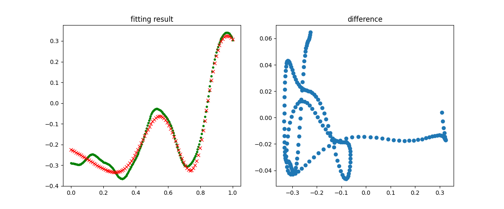

                图ch04-level1-2

图ch04-level1-2 绿色点为测试集数据，红色点为神经网路推理结果。显然除了最左侧开始的部分，其它部分都拟合得很好。

## 14.2 回归任务 - 房价预测
### 搭建模型 ###
建立一模型包含四组全连接层-Relu层的组合，最后一个单输出做拟合。


                图14-3 完成房价预测任务的抽象模型

### 代码实现 ###
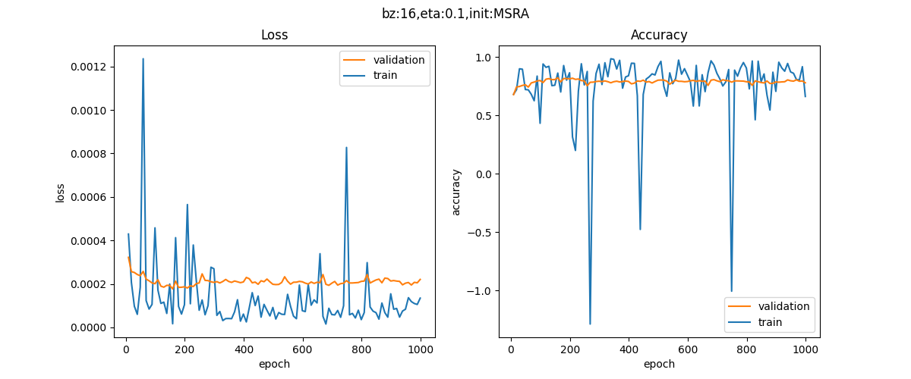

                图ch04-level2-1

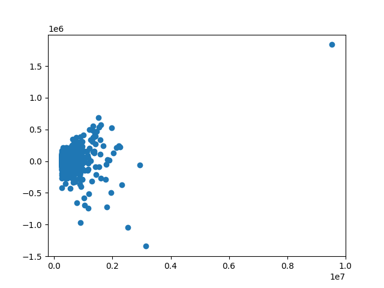

                图ch04-level2-2

由图可得，损失函数值下降，而精度值在不断的上升。

## 14.3 二分类任务功能测试 ##
### 搭建模型 ###
搭建一个双层的神经网络，第一层后面接一个Sigmoid激活函数，第二层直接输出拟合数据，最后接一个Logistic二分类函数用于完成二分类任务，如图14-4所示。


                图14-4 完成非线性二分类教学案例的抽象模型
### 代码实现 ###
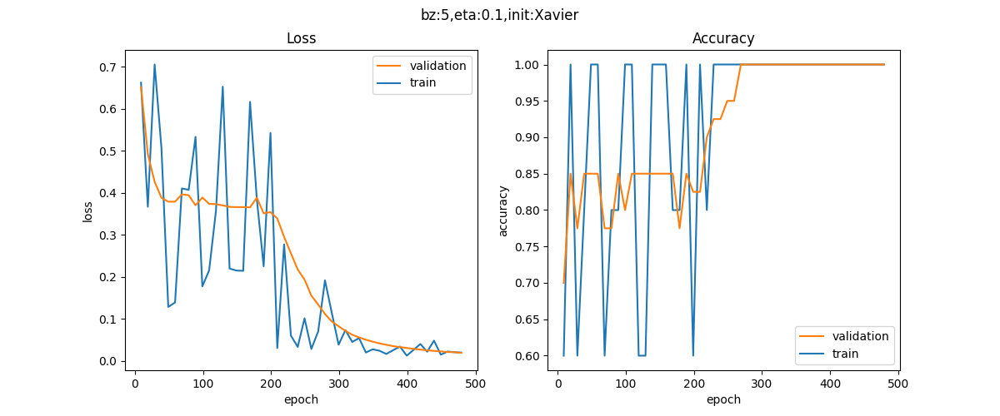

                图ch04-level3-1

图ch04-level3-1 记录了训练过程中损失函数值和准确率的变化。

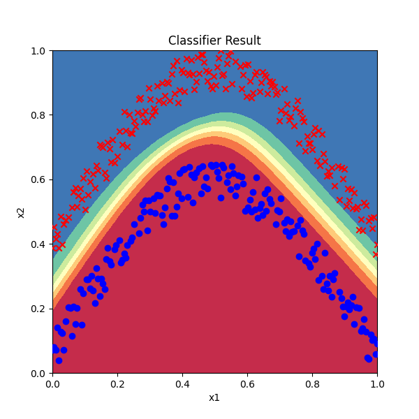

                图ch04-level3-2

图ch04-level3-2 展现出分类效果。

## 14.4 二分类任务真实案例 ##
### 搭建模型 ###
建立一模型包含四组全连接层-Relu层的组合，单输出做拟合，在最后接一个Logistic函数用于完成二分类任务。


                图14-5 完成二分类真实案例的抽象模型

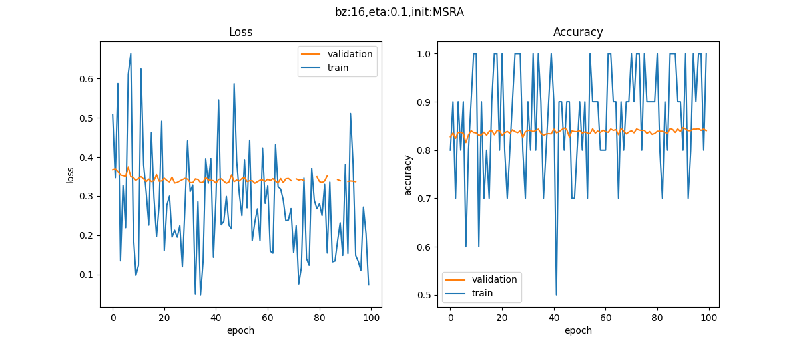

                图ch04-level4-1

图ch04-level4-1 所示。左边为是损失函数图，右边为准确率图。忽略测试数据的波动，只看红色的验证集的趋势，损失函数值不断下降，准确率不断上升。

## 14.5 多分类功能测试 ##
### 搭建模型一 ###
使用Sigmoid做为激活函数的两层网络，如图所示：


                图14-6 完成非线性多分类教学案例的抽象模型
### 代码实现一 ###
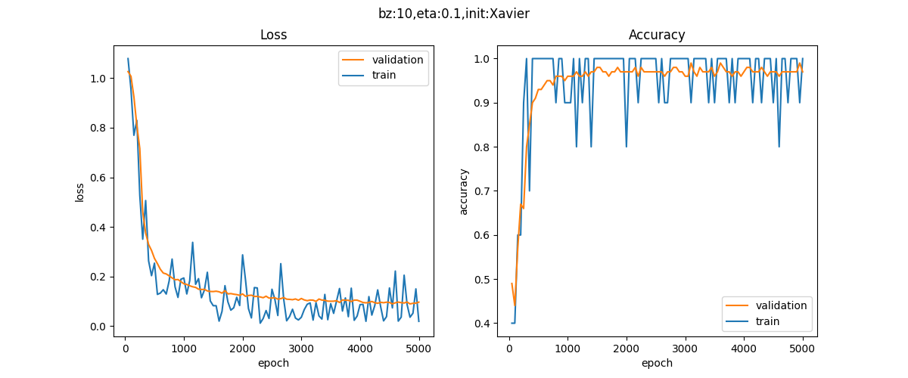

                图ch04-level5-1

图ch04-level5-1 展现出模型一训练过程中损失函数值和准确率的变化。

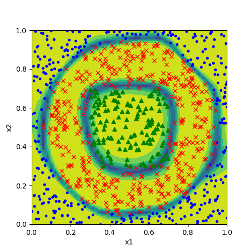

                图ch04-level5-2

图ch04-level5-2 展现出模型一训练结果分类效果。

### 搭建模型二 ###
使用ReLU做为激活函数的三层网络，如图所示：


图14-7 使用ReLU函数抽象模型

### 运行结果二 ###
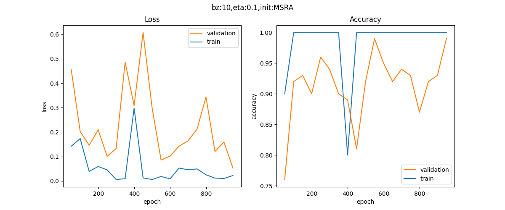

                图ch04-level5-3

图ch04-level5-3 展现出模型二训练过程中损失函数值和准确率的变化。

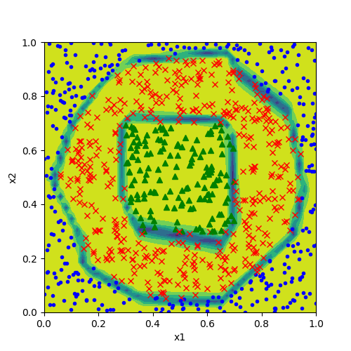

                图ch04-level5-4

图ch04-level5-4 展现出模型一训练结果分类效果。

## 14.6 多分类任务 - MNIST手写体识别 ##
### 搭建模型 ###

搭建一个共含4个隐层的模型，隐层间都用ReLU激活函数连接，最后的输出层接Softmax分类函数。搭建模型如图所示：


                图14-8 完成MNIST分类任务的抽象模型

## 15.1 权重矩阵初始化 ##
权重矩阵初始化是训练神经网络的第一步，选择正确的初始化方法尤为重要。每次重新初始化时会给训练结果带来影响。

### 零初始化 ###
即把所有层的`W`值的初始值都设置为0。

$$
W = 0
$$

**注**：对于多层网络不能用零初始化，否则权重值不能学习到合理的结果。

### 标准初始化 ###
标准正态初始化方法保证激活函数的输入均值为0，方差为1。

$$
W \sim N \begin{bmatrix} 0, 1 \end{bmatrix}
$$

其中：
1. W：权重矩阵
2. N：高斯分布

### Xavier初始化方法 ###
正向传播时，激活值的方差保持不变；反向传播时，关于状态值的梯度的方差保持不变。


$$
W \sim N
\begin{pmatrix}
0, \sqrt{\frac{2}{n_{in} + n_{out}}} 
\end{pmatrix}
$$

$$
W \sim U 
\begin{pmatrix}
 -\sqrt{\frac{6}{n_{in} + n_{out}}}, \sqrt{\frac{6}{n_{in} + n_{out}}} 
\end{pmatrix}
$$

其中：
W：权重矩阵
N：正态分布（Normal Distribution）
U：均匀分布（Uniform Distribution)

### MSRA初始化方法（He方法） ###
正向传播时，状态值的方差保持不变；反向传播时，关于激活值的梯度的方差保持不变。

只考虑输入个数时，MSRA初始化是一个均值为0，方差为2/n的高斯分布，适合于ReLU激活函数：

$$
W \sim N 
\begin{pmatrix} 
0, \sqrt{\frac{2}{n}} 
\end{pmatrix}
$$

$$
W \sim U 
\begin{pmatrix} 
-\sqrt{\frac{6}{n_{in}}}, \sqrt{\frac{6}{n_{out}}} 
\end{pmatrix}
$$

### 小结 ###

                表15-1 几种初始化方法的应用场景

|ID|网络深度|初始化方法|激活函数|说明|
|---|---|---|---|---|
|1|单层|零初始化|无|可以|
|2|双层|零初始化|Sigmoid|错误，不能进行正确的反向传播|
|3|双层|随机初始化|Sigmoid|可以|
|4|多层|随机初始化|Sigmoid|激活值分布成凹形，不利于反向传播|
|5|多层|Xavier初始化|Tanh|正确|
|6|多层|Xavier初始化|ReLU|激活值分布偏向0，不利于反向传播|
|7|多层|MSRA初始化|ReLU|正确|

由表可得，由于网络深度和激活函数的变化，使得人们不断地研究新的初始化方法来适应，最终得到1、3、5、7几种组合。

### 代码实现 ###
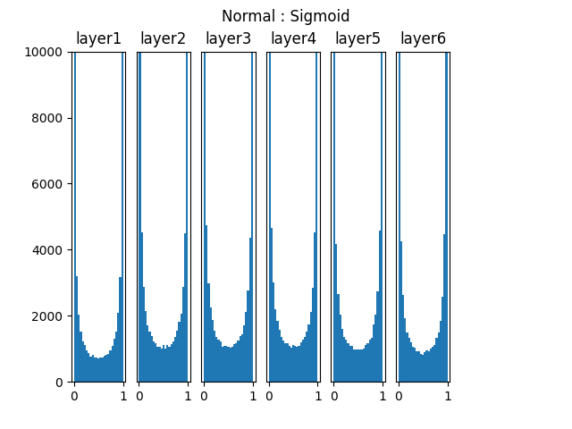

                图ch15-level1-1

图ch15-level1-1 为标准初始化在Sigmoid激活函数上的表现。
图中是一个6层的深度网络，使用全连接层+Sigmoid激活函数，图中表示的是各层激活函数的直方图。可以看到各层的激活值严重向两侧[0,1]靠近，从Sigmoid的函数曲线可以知道这些值的导数趋近于0，反向传播时的梯度逐步消失。处于中间地段的值比较少，对参数学习是十分不利的。

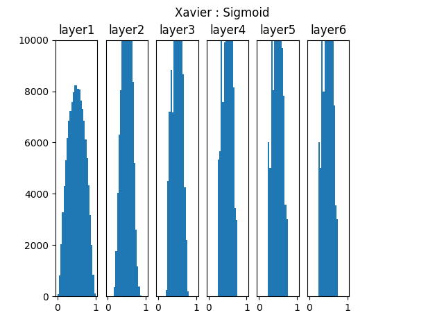

                图ch15-level1-2

图ch15-level1-2 为Xavier初始化在Sigmoid激活函数上的表现。
图中是深度为6层的网络中的表现情况。后面几层的激活函数输出值的分布仍然基本符合正态分布，有利于神经网络的学习。

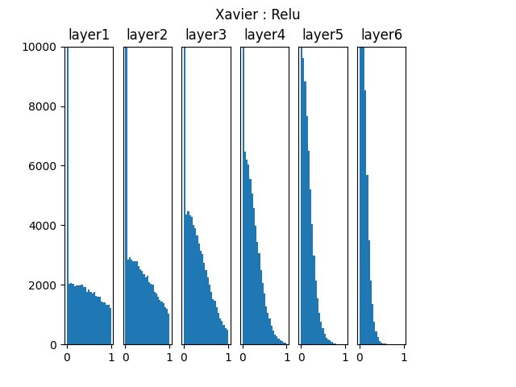

                图ch15-level1-3

图ch15-level1-3是Xavier初始化在ReLU激活函数上的表现。由图易得，随着层的加深，使用ReLU时激活值逐步向0偏向，同样会导致梯度消失问题。

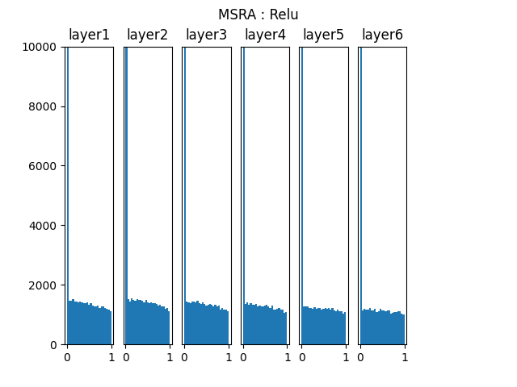

                图ch15-level1-4

图ch15-level1-4 为MSRA初始化在ReLU激活函数上的表现。

## 15.2 梯度下降优化算法 ##
### 代码实现 ###

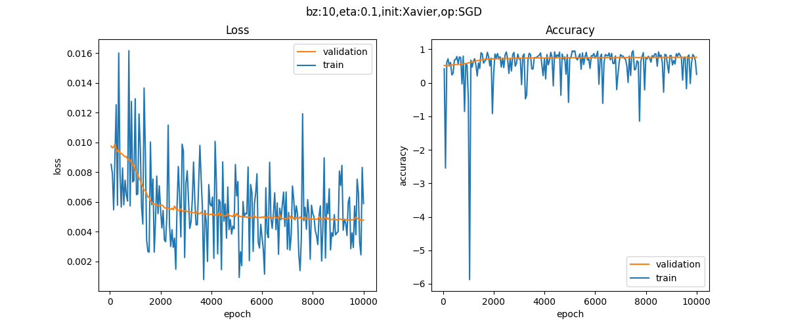

                图ch15-level2-1

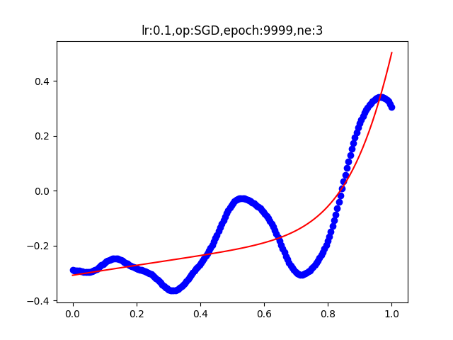

                图ch15-level2-2

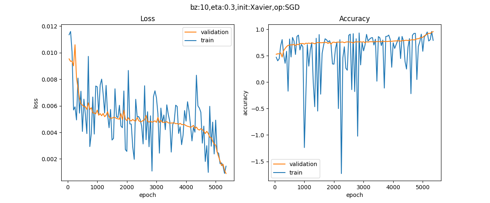

                图ch15-level2-3

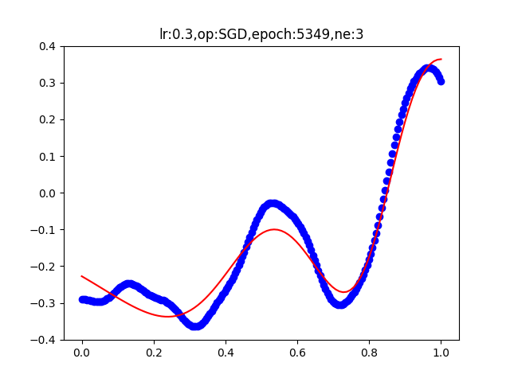

                图ch15-level2-4

图ch15-level2-1 至 图ch15-level2-4 四个图像分别为 $eta$ 取值 $0.1$ 和 $0.3$ 时通过 $SDG算法$ 得到的损失函数和准确率。
可得 $eta$ 取值越大准确率越高。


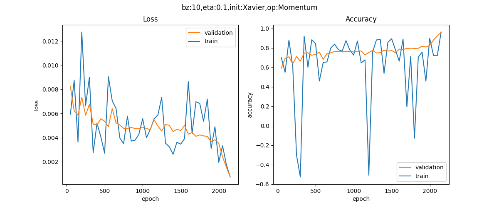

                图ch15-level2-5

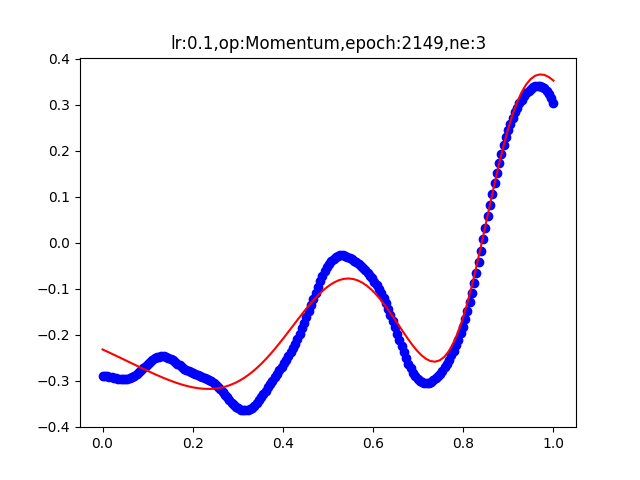

                图ch15-level2-6

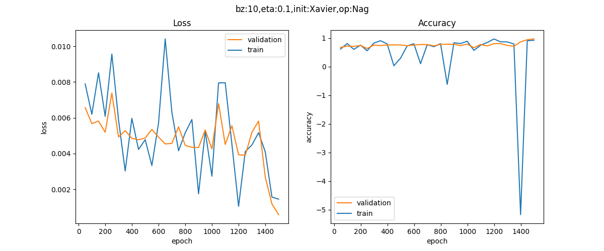

                图ch15-level2-7

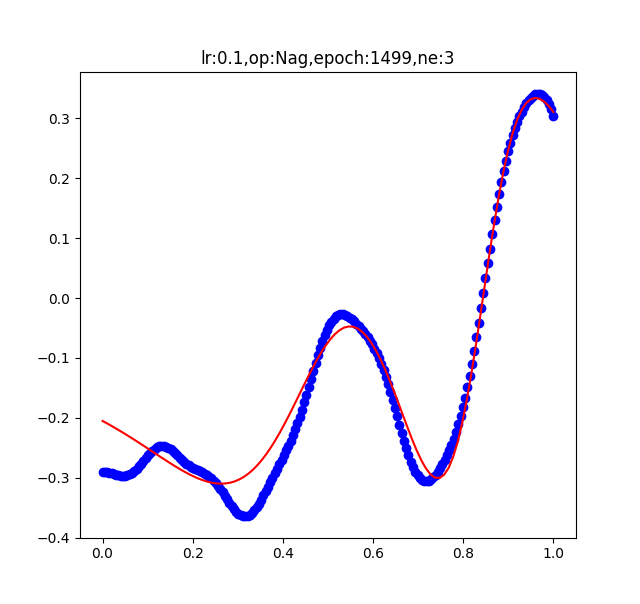

                图ch15-level2-8

图ch15-level2-1 至 图ch15-level2-4 四个图像分别为通过 $Momentum$ 和 $Nag$ 算法得到的损失函数和准确率。

## 15.3 自适应学习率算法
### 代码实现 ###
                表2 AdaGrad算法损失函数值变化
|初始学习率|损失函数值变化|
|---|---|
|eta=0.3||
|eta=0.5||
|eta=0.7||

                表3 AdaGrad算法准确率变化

|初始学习率|与目标结果关系变化|
|---|---|
|eta=0.3||
|eta=0.5||
|eta=0.7||

                表4 AdaDelta算法损失函数值变化
|初始学习率|损失函数值变化|
|---|---|
|eta=0.1||
|eta=0.01||


                表5 AdaDelta算法准确率变化

|初始学习率|与目标结果关系变化|
|---|---|
|eta=0.1||
|eta=0.01||

                表6 RMSProp算法损失函数值变化
|初始学习率|损失函数值变化|
|---|---|
|eta=0.1||
|eta=0.01||
|eta=0.005||

                表7 RMSProp算法准确率变化

|初始学习率|与目标结果关系变化|
|---|---|
|eta=0.1||
|eta=0.01||
|eta=0.005||

## 15.4 算法在等高线图上的效果比较 ##

                表8 各种算法的效果比较

|||
|---|---|
||
|SGD当学习率为0.1时，需要很多次迭代才能逐渐向中心靠近|SGD当学习率为0.5时，会比较快速地向中心靠近，但是在中心的附近有较大震荡|
|||
|Momentum由于惯性存在，一下子越过了中心点，但是很快就会得到纠正|Nag是Momentum的改进，有预判方向功能|
|||
|AdaGrad的学习率在开始时可以设置大一些，因为会很快衰减|AdaDelta即使把学习率设置为0，也不会影响，因为有内置的学习率策略|
|||
|RMSProp解决AdaGrad的学习率下降问题，即使学习率设置为0.1，收敛也会快|Adam到达中点的路径比较直接|

## 15.5 批量归一化的原理 ##
### 正态分布(高斯分布) ###
若随机变量$X$，服从一个位置参数为$\mu$、尺度参数为$\sigma$的概率分布，且其概率密度函数为：

$$
f(x)=\frac{1}{\sigma\sqrt{2 \pi} } e^{- \frac{{(x-\mu)^2}}{2\sigma^2}} 
$$

则这个随机变量就称为正态随机变量，正态随机变量服从的分布就称为正态分布，记作：

$$
X \sim N(\mu,\sigma^2)  
$$

当μ=0,σ=1时，称为标准正态分布：

$$X \sim N(0,1) $$

此时公式简化为：

$$
f(x)=\frac{1}{\sqrt{2 \pi}} e^{- \frac{x^2}{2}} 
$$

#### 代码实现 ###


                图ch15-level5-1

图ch15-level5-1为三种（$\mu,\sigma$）组合的函数图像。

### 深度神经网络的挑战 ###
#### 代码实现 ####


                图ch15-level5-2

图ch15-level5-2为偏移后的数据分布区域和Sigmoid激活函数图像。


                图ch15-level5-3

图ch15-level5-3为ReLU函数曲线.
图中蓝色为数据分布，已经从0点向右偏移了，黄色为ReLU的激活值，可以看到95%以上的数据都在大于0的区域，从而被Relu激活函数原封不动第传到了下一层网络中，而没有被小于0的部分剪裁。该网络和线性网络基本失去深层网络的能力。

## 16.0 过拟合 ##
正则化用于防止过拟合。

**出现过拟合的原因：**
1. 训练集的数量和模型的复杂度不匹配，样本数量级小于模型的参数
2. 训练集和测试集的特征分布不一致
3. 样本噪音大，使得神经网络学习到了噪音，正常样本的行为被抑制
4. 迭代次数过多，过分拟合了训练数据，包括噪音部分和一些非重要特征

### 代码实现 ###


                图ch16-level0-1


                图ch16-level0-2


                图ch16-level1-1
                


                图ch16-level1-2

## 16.1 偏差与方差 ##

                表9 符号含义

|符号|含义|
|---|---|
|$x$|测试样本|
|$D$|数据集|
|$y$|x的真实标记|
|$y_D$|x在数据集中标记(可能有误差)|
|$f$|从数据集D学习的模型|
|$f_{x;D}$|从数据集D学习的模型对x的预测输出|
|$f_x$|模型f对x的期望预测输出|

- 学习算法期望的预测：
$$f_x=E[f_{x;D}]  $$
- 不同的训练集/验证集产生的预测方差：
$$var(x)=E[(f_{x;D}-f_x)^2]  $$
- 噪声：
$$\epsilon^2=E[(y_D-y)^2]  $$
- 期望输出与真实标记的偏差：
$$bias^2(x)=(f_x-y)^2  $$
- 算法的期望泛化误差：
$$
\begin{aligned}
E(f;D)&=var(x) + bias^2(x) + \epsilon^2
\end{aligned}
$$

- 各个项的含义为：

1. 偏差：度量了学习算法的期望与真实结果的偏离程度，即学习算法的拟合能力。
2. 方差：训练集与验证集的差异造成的模型表现的差异。
3. 噪声：当前数据集上任何算法所能到达的泛化误差的下线，即学习问题本身的难度。

**算法的期望泛化误差公式证明**
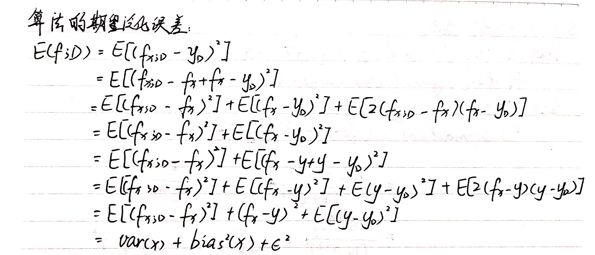

            图 算法期望泛化误差公式证明
## 16.2 L2正则 ##
### 损失函数的变化 ###

假设是均方差损失函数：

$$J(w,b)=\frac{1}{2m}\sum_{i=1}^m (z_i-y_i)^2 + \frac{\lambda}{2m}\sum_{j=1}^n{w_j^2} $$

如果是交叉熵损失函数：

$$J(w,b)= -\frac{1}{m} \sum_{i=1}^m [y_i \ln a_i + (1-y_i) \ln (1-a_i)]+ \frac{\lambda}{2m}\sum_{j=1}^n{w_j^2} $$

### 代码实现 ###


                图ch16-level2-1

图ch16-level2-1为训练过程中损失函数值和准确率的变化曲线。


                图ch16-level2-2

图ch16-level2-2为拟合后的曲线与训练数据的分布图。


## 16.3 L1正则 ##
**拉普拉斯分布**
$$
\begin{aligned}
f(x)&=\frac{1}{2b}\exp(-\frac{|x-\mu|}{b})\\\\
&= \frac{1}{2b} \begin{cases} \exp(\frac{x-\mu}{b}), & x \lt \mu \\\\ \exp(\frac{\mu-x}{b}), & x \gt \mu \end{cases}
\end{aligned}
$$

### 代码实现 ###


                图ch16-level3-1

图ch16-level3-1为训练过程中损失函数值和准确率的变化曲线。


                图ch16-level3-2

图ch16-level3-2为拟合后的曲线与训练数据的分布图。

## 16.4 早停法 Early Stopping ##
**早停法**实际上也是一种正则化的策略，可以理解为在网络训练不断逼近最优解的过程种，在梯度等高线的外围就停止了训练。
算法描述如下：

***

```
初始化
    初始权重均值参数：theta = theta_0
    迭代次数：i = 0
    忍耐次数：patience = N (e.g. N=10)
    忍耐次数计数器：counter = 0
    验证集损失函数值：lastLoss = 10000 (给一个特别大的数值)

while (epoch < maxEpoch) 循环迭代训练过程
    正向计算，反向传播更新theta
    迭代次数加1：i++
    计算验证集损失函数值：newLoss = loss
    if (newLoss < lastLoss) // 新的损失值更小
        忍耐次数计数器归零：counter = 0
        记录当前最佳权重矩阵训练参数：theta_best = theta
        记录当前迭代次数：i_best = i
        更新最新验证集损失函数值：lastLoss = newLoss
    else // 新的损失值大于上一步的损失值
        忍耐次数计数器加1：counter++
        if (counter >= patience) 停止训练！！！
    end if
end while
```

***

### 代码实现 ###


                图ch16-level4-1

图ch16-level4-1为训练过程中损失函数值和准确率的变化曲线。


                图ch16-level4-2

图ch16-level4-2为拟合后的曲线与训练数据的分布图。

## 16.5 丢弃法 Dropout ##
**代码**

```Python
class DropoutLayer(CLayer):
    def __init__(self, input_size, ratio=0.5):
        self.dropout_ratio = ratio
        self.mask = None
        self.input_size = input_size
        self.output_size = input_size

    def forward(self, input, train=True):
        assert(input.ndim == 2)
        if train:
            self.mask = np.random.rand(*input.shape) > self.dropout_ratio
            self.z = input * self.mask
        else:
            self.z = input * (1.0 - self.dropout_ratio)

        return self.z
       
    def backward(self, delta_in, idx):
        delta_out = self.mask * delta_in
        return delta_out
```

### 代码实现 ###


                图ch16-level5-1

图ch16-level4-1为训练过程中损失函数值和准确率的变化曲线。


                图ch16-level5-2

图ch16-level4-2为拟合后的曲线与训练数据的分布图。

## 16.6 数据增强 Data Augmentation ##
### SamplePairing

SamplePairing方法的处理流程如下图所示，从训练集中随机抽取两张图片分别经过基础数据增强操作（如随机翻转等）处理后经像素取平均值的形式叠加合成一个新的样本，标签为原样本标签中的一种。


图  SamplePairing方法的处理流程

### 代码实现 ###


                图ch16-level6-1

## 16.7 集成学习 Ensemble Learning ##
当数据集有问题，或者网络学习能力不足，或准确度不够时，就可以采取集成学习的方法来提升性能。
下是一个简单的集成学习的示意图。


                图16-7.1 集成学习的示意图

### Bagging法集成学习的基本流程 ###
下是Bagging集成学习的示意图。


图16-7.2 Bagging集成学习示意图

### 集成方法选择 ###
**平均法**

在回归任务中，输出为一个数值，可以使用平均法来处理多个神经网络的输出值。下面公式中的$h_i(x)$表示第i个神经网络的输出，$H(x)$表示集成后的输出。

- 简单平均法：所有值加起来除以N。
  $$H(x)=\frac{1}{N} \sum_{i=1}^N h_i(x)$$

- 加权平均法：给每个输出值一个人为定义的权重。
$$H(x)=\sum_{i=1}^N w_i \cdot h_i(x)$$

**投票法**

对于分类任务，将会从类别标签集合$\\{c_1, c_2, ...,c_n\\}$中预测出一个值，多个神经网络可能会预测出不一样的值，此时可以采样投票法。

- 绝对多数投票法（majority voting）

    当有半数以上的神经网路预测出同一个类别标签时，我们可以认为此预测有效。如果少于半数，则可以认为预测无效。

- 加权投票法(weighted voting)

    与加权平均法类似。

- 相对多数投票法（plurality voting）

    即得票最多的标签获胜。如果有多个标签获得相同的票数，随机选一个。

**学习法**
学习法即用另外一个神经网络，通过训练的方式，将神经网路的输出结果作为输入，把图片的真实数字作为标签，得到一个强学习器。

##学习总结##
1. 在对回归任务、二分类任务、多分类任务的学习过程中我学习到了如何分析训练过程中损失函数值和准确率的变化。
2. 在对网络优化的学习过程中，我了解到了有关梯度下降优化算法的知识，包括——NAG 可以使 RNN 在很多任务上有更好的表现等。
3. 通过对正则化的部分的学习，我了解到Mixup、SMOTE、SamplePairing三者思路上有相同之处，都是试图将离散样本点连续化来拟合真实样本分布，但所增加的样本点在特征空间中仍位于已知小样本点所围成的区域内。但在特征空间中，小样本数据的真实分布可能并不限于该区域中，在给定范围之外适当插值，也许能实现更好的数据增强效果。