<font face="宋体"> <center>

# 第七步  深度神经网络

汇报人：夏烜哲

## 深度神经网络框架设计

</center> </font>

### 功能模式分析 

<font face="宋体" color=green>

前向计算中：

```Python
def forward3(X, dict_Param):
    ...
    # layer 1
    Z1 = np.dot(W1,X) + B1
    A1 = Sigmoid(Z1)
    # layer 2
    Z2 = np.dot(W2,A1) + B2
    A2 = Tanh(Z2)
    # layer 3
    Z3 = np.dot(W3,A2) + B3
    A3 = Softmax(Z3)
    ...    
```

1，2，3三层的模式完全一样：矩阵运算+激活/分类函数。

再看看反向传播：

```Python
def backward3(dict_Param,cache,X,Y):
    ...
    # layer 3
    dZ3= A3 - Y
    dW3 = np.dot(dZ3, A2.T)
    dB3 = np.sum(dZ3, axis=1, keepdims=True)
    # layer 2
    dZ2 = np.dot(W3.T, dZ3) * (1-A2*A2) # tanh
    dW2 = np.dot(dZ2, A1.T)
    dB2 = np.sum(dZ2, axis=1, keepdims=True)
    # layer 1
    dZ1 = np.dot(W2.T, dZ2) * A1 * (1-A1)   #sigmoid
    dW1 = np.dot(dZ1, X.T)
    dB1 = np.sum(dZ1, axis=1, keepdims=True)
    ...
```
每一层的模式也非常相近：计算本层的`dZ`，再根据`dZ`计算`dW`和`dB`。

因为三层网络比两层网络多了一层，所以会在初始化、前向、反向、更新参数等四个环节有所不同，但却是有规律的。再加上前面章节中，为了实现一些辅助功能，我们已经写了很多类。所以，现在可以动手搭建一个深度学习的迷你框架了。

### 抽象与设计

图14-1是迷你框架的模块化设计，下面对各个模块做功能点上的解释。


图14-1 迷你框架设计

#### NeuralNet

首先需要一个`NeuralNet`类，来包装基本的神经网络结构和功能：

- `Layers` - 神经网络各层的容器，按添加顺序维护一个列表
- `Parameters` - 基本参数，包括普通参数和超参
- `Loss Function` - 提供计算损失函数值，存储历史记录并最后绘图的功能
- `LayerManagement()` - 添加神经网络层
- `ForwardCalculation()` - 调用各层的前向计算方法
- `BackPropagation()` - 调用各层的反向传播方法
- `PreUpdateWeights()` - 预更新各层的权重参数
- `UpdateWeights()` - 更新各层的权重参数
- `Train()` - 训练
- `SaveWeights()` - 保存各层的权重参数
- `LoadWeights()` - 加载各层的权重参数

#### Layer

是一个抽象类，以及更加需要增加的实际类，包括：

- Fully Connected Layer
- Classification Layer
- Activator Layer
- Dropout Layer
- Batch Norm Layer

将来还会包括：

- Convolution Layer
- Max Pool Layer

每个Layer都包括以下基本方法：
 - `ForwardCalculation()` - 调用本层的前向计算方法
 - `BackPropagation()` - 调用本层的反向传播方法
 - `PreUpdateWeights()` - 预更新本层的权重参数
 - `UpdateWeights()` - 更新本层的权重参数
 - `SaveWeights()` - 保存本层的权重参数
 - `LoadWeights()` - 加载本层的权重参数

#### Activator Layer

激活函数和分类函数：

- `Identity` - 直传函数，即没有激活处理
- `Sigmoid`
- `Tanh`
- `Relu`

#### Classification Layer

分类函数，包括：

- `Sigmoid`二分类
- `Softmax`多分类


 #### Parameters

 基本神经网络运行参数：

 - 学习率
 - 最大`epoch`
 - `batch size`
 - 损失函数定义
 - 初始化方法
 - 优化器类型
 - 停止条件
 - 正则类型和条件

#### LossFunction

损失函数及帮助方法：

- 均方差函数
- 交叉熵函数二分类
- 交叉熵函数多分类
- 记录损失函数
- 显示损失函数历史记录
- 获得最小函数值时的权重参数

#### Optimizer

优化器：

- `SGD`
- `Momentum`
- `Nag`
- `AdaGrad`
- `AdaDelta`
- `RMSProp`
- `Adam`

#### WeightsBias

权重矩阵，仅供全连接层使用：

- 初始化 
  - `Zero`, `Normal`, `MSRA` (`HE`), `Xavier`
  - 保存初始化值
  - 加载初始化值
- `Pre_Update` - 预更新
- `Update` - 更新
- `Save` - 保存训练结果值
- `Load` - 加载训练结果值

#### DataReader

样本数据读取器：

- `ReadData` - 从文件中读取数据
- `NormalizeX` - 归一化样本值
- `NormalizeY` - 归一化标签值
- `GetBatchSamples` - 获得批数据
- `ToOneHot` - 标签值变成OneHot编码用于多分类
- `ToZeroOne` - 标签值变成0/1编码用于二分类
- `Shuffle` - 打乱样本顺序

从中派生出两个数据读取器：

- `MnistImageDataReader` - 读取MNIST数据
- `CifarImageReader` - 读取Cifar10数据

<font face="宋体"> <center>

## 回归任务功能测试

</center> </font>

在第九章中，我们用一个两层的神经网络，验证了万能近似定理。当时是用hard code方式写的，现在我们用迷你框架来搭建一下。

### 搭建模型

这个模型很简单，一个双层的神经网络，第一层后面接一个Sigmoid激活函数，第二层直接输出拟合数据，如图14-2所示。


图14-2 完成拟合任务的抽象模型

```Python
def model():
    dataReader = LoadData()
    num_input = 1
    num_hidden1 = 4
    num_output = 1

    max_epoch = 10000
    batch_size = 10
    learning_rate = 0.5

    params = HyperParameters_4_0(
        learning_rate, max_epoch, batch_size,
        net_type=NetType.Fitting,
        init_method=InitialMethod.Xavier,
        stopper=Stopper(StopCondition.StopLoss, 0.001))

    net = NeuralNet_4_0(params, "Level1_CurveFittingNet")
    fc1 = FcLayer_1_0(num_input, num_hidden1, params)
    net.add_layer(fc1, "fc1")
    sigmoid1 = ActivationLayer(Sigmoid())
    net.add_layer(sigmoid1, "sigmoid1")
    fc2 = FcLayer_1_0(num_hidden1, num_output, params)
    net.add_layer(fc2, "fc2")

    net.train(dataReader, checkpoint=100, need_test=True)

    net.ShowLossHistory()
    ShowResult(net, dataReader)
```

超参数说明：

1. 输入层1个神经元，因为只有一个`x`值
2. 隐层4个神经元，对于此问题来说应该是足够了，因为特征很少
3. 输出层1个神经元，因为是拟合任务
4. 学习率=0.5
5. 最大`epoch=10000`轮
6. 批量样本数=10
7. 拟合网络类型
8. Xavier初始化
9. 绝对损失停止条件=0.001

### 训练结果


图14-3 训练过程中损失函数值和准确率的变化

如图14-3所示，损失函数值在一段平缓期过后，开始陡降，这种现象在神经网络的训练中是常见的，最有可能的是当时处于一个梯度变化的平缓地带，算法在艰难地寻找下坡路，然后忽然就找到了。这种情况同时也带来一个弊端：我们会经常遇到缓坡，到底要不要还继续训练？是不是再坚持一会儿就能找到出路呢？抑或是模型能力不够，永远找不到出路呢？这个问题没有准确答案，只能靠试验和经验了。


图14-4 拟合结果

图14-4左侧子图是拟合的情况，绿色点是测试集数据，红色点是神经网路的推理结果，可以看到除了最左侧开始的部分，其它部分都拟合的不错。注意，这里我们不是在讨论过拟合、欠拟合的问题，我们在这个章节的目的就是更好地拟合一条曲线。

图14-4右侧的子图是用下面的代码生成的：

```Python
    y_test_real = net.inference(dr.XTest)
    axes.scatter(y_test_real, y_test_real-dr.YTestRaw, marker='o')
```

以测试集的真实值为横坐标，以真实值和预测值的差为纵坐标。最理想的情况是所有点都在y=0处排成一条横线。从图上看，真实值和预测值二者的差异明显，但是请注意横坐标和纵坐标的间距相差一个数量级，所以差距其实不大。

再看打印输出的最后部分：

```
epoch=4999, total_iteration=449999
loss_train=0.000920, accuracy_train=0.968329
loss_valid=0.000839, accuracy_valid=0.962375
time used: 28.002626419067383
save parameters
total weights abs sum= 45.27530164993504
total weights = 8
little weights = 0
zero weights = 0
testing...
0.9817814550687021
0.9817814550687021
```

由于我们设置了`eps=0.001`，所以在5000多个`epoch`时便达到了要求，训练停止。最后用测试集得到的准确率为98.17%，已经非常不错了。如果训练更多的轮，可以得到更好的结果。

<font face="宋体"> <center>

## 回归任务 - 房价预测

</center> </font>

### 数据

数据集来自：https://www.kaggle.com/harlfoxem/housesalesprediction


此数据集是King County地区2014年五月至2015年五月的房屋销售信息，适合于训练回归模型。

#### 数据字段解读

- id：唯一id
- date：售出日期
- price：售出价格（标签值）
- bedrooms：卧室数量
- bathrooms：浴室数量
- sqft_living：居住面积
- sqft_lot：停车场面积
- floors：楼层数
- waterfront：泳池
- view：有多少次看房记录
- condition：房屋状况
- grade：评级
- sqft_above：地面上的面积
- sqft_basement：地下室的面积
- yr_built：建筑年份
- yr_renovated：翻修年份
- zipcode：邮政编码
- lat：维度
- long：经度
- sqft_living15：2015年翻修后的居住面积
- sqft_lot15：2015年翻修后的停车场面积

一些考虑：

- 唯一id在数据库中有用，在训练时并不是一个特征，所以要去掉
- 售出日期，由于是在一年内的数据，所以也没有用
- sqft_liging15的值，如果非0的话，应该替换掉sqft_living
- sqft_lot15的值，如果非0的话，应该替换掉sqft_lot
- 邮政编码对应的地理位置过于宽泛，只能引起噪音，应该去掉
- 返修年份，笔者认为它如果是非0值的话，可以替换掉建筑年份
- 看房记录次数多并不能代表该房子价格就高，而是因为地理位置、价格、配置等满足特定人群的要求，所以笔者认为它不是必须的特征值

所以最后只留下13个字段。

#### 数据处理

原始数据只有一个数据集，所以需要我们自己把它分成训练集和测试集，比例大概为4:1。此数据集为`csv`文件格式，为了方便，我们把它转换成了两个扩展名为`npz`的`numpy`压缩形式：

- `house_Train.npz`，训练数据集
- `house_Test.npz`，测试数据集

#### 加载数据

与上面第一个例子的代码相似，但是房屋数据属性繁杂，所以需要做归一化，房屋价格也是至少6位数，所以也需要做归一化。

这里有个需要注意的地方，即训练集和测试集的数据，需要合并在一起做归一化，然后再分开使用。为什么要先合并呢？假设训练集样本中的房屋面积的范围为150到220，而测试集中的房屋面积有可能是160到230，两者不一致。分别归一化的话，150变成0，160也变成0，这样预测就会产生误差。

最后还需要在训练集中用`GenerateValidaionSet(k=10)`分出一个1:9的验证集。

### 搭建模型

在不知道一个问题的实际复杂度之前，我们不妨把模型设计得复杂一些。如下图所示，这个模型包含了四组全连接层-Relu层的组合，最后是一个单输出做拟合。


图14-5 完成房价预测任务的抽象模型

```Python
def model():
    dr = LoadData()

    num_input = dr.num_feature
    num_hidden1 = 32
    num_hidden2 = 16
    num_hidden3 = 8
    num_hidden4 = 4
    num_output = 1

    max_epoch = 1000
    batch_size = 16
    learning_rate = 0.1

    params = HyperParameters_4_0(
        learning_rate, max_epoch, batch_size,
        net_type=NetType.Fitting,
        init_method=InitialMethod.Xavier,
        stopper=Stopper(StopCondition.StopDiff, 1e-7))

    net = NeuralNet_4_0(params, "HouseSingle")

    fc1 = FcLayer_1_0(num_input, num_hidden1, params)
    net.add_layer(fc1, "fc1")
    r1 = ActivationLayer(Relu())
    net.add_layer(r1, "r1")
    ......
    fc5 = FcLayer_1_0(num_hidden4, num_output, params)
    net.add_layer(fc5, "fc5")

    net.train(dr, checkpoint=10, need_test=True)
    
    output = net.inference(dr.XTest)
    real_output = dr.DeNormalizeY(output)
    mse = np.sum((dr.YTestRaw - real_output)**2)/dr.YTest.shape[0]/10000
    print("mse=", mse)
    
    net.ShowLossHistory()

    ShowResult(net, dr)
```

超参数说明：

1. 学习率=0.1
2. 最大`epoch=1000`
3. 批大小=16
4. 拟合网络
5. 初始化方法Xavier
6. 停止条件为相对误差`1e-7`

net.train()函数是一个阻塞函数，只有当训练完毕后才返回。

在train后面的部分，是用测试集来测试该模型的准确度，使用了数据城堡(Data Castle)的官方评测方法，用均方差除以10000，得到的数字越小越好。一般的模型大概是一个7位数的结果，稍微好一些的是6位数。

### 训练结果

[](img/house_loss.pnghouse_loss.png)

图14-6 训练过程中损失函数值和准确率的变化

由于标签数据也做了归一化，变换为都是0至1间的小数，所以均方差的数值很小，需要观察小数点以后的第4位。从图14-6中可以看到，损失函数值很快就降到了0.0002以下，然后就很缓慢地下降。而精度值在不断的上升，相信更多的迭代次数会带来更高的精度。

再看下面的打印输出部分，用R2_Score法得到的值为0.841，而用数据城堡官方的评测标准，得到的MSE值为2384411，还比较大，说明模型精度还应该有上升的空间。

```
......
epoch=999, total_iteration=972999
loss_train=0.000079, accuracy_train=0.740406
loss_valid=0.000193, accuracy_valid=0.857289
time used: 193.5549156665802
testing...
0.8412989144927305
mse= 2384411.5840510926
```

<font face="宋体"> <center>

##  二分类任务功能测试

</center> </font>
###  搭建模型

同样是一个双层神经网络，但是最后一层要接一个Logistic二分类函数来完成二分类任务，如图14-7所示。


图14-7 完成非线性二分类教学案例的抽象模型

```Python

def model(dataReader):
    num_input = 2
    num_hidden = 3
    num_output = 1

    max_epoch = 1000
    batch_size = 5
    learning_rate = 0.1

    params = HyperParameters_4_0(
        learning_rate, max_epoch, batch_size,
        net_type=NetType.BinaryClassifier,
        init_method=InitialMethod.Xavier,
        stopper=Stopper(StopCondition.StopLoss, 0.02))

    net = NeuralNet_4_0(params, "Arc")

    fc1 = FcLayer_1_0(num_input, num_hidden, params)
    net.add_layer(fc1, "fc1")
    sigmoid1 = ActivationLayer(Sigmoid())
    net.add_layer(sigmoid1, "sigmoid1")
    
    fc2 = FcLayer_1_0(num_hidden, num_output, params)
    net.add_layer(fc2, "fc2")
    logistic = ClassificationLayer(Logistic())
    net.add_layer(logistic, "logistic")

    net.train(dataReader, checkpoint=10, need_test=True)
    return net
```

超参数说明：

1. 输入层神经元数为2
2. 隐层的神经元数为3，使用Sigmoid激活函数
3. 由于是二分类任务，所以输出层只有一个神经元，用Logistic做二分类函数
4. 最多训练1000轮
5. 批大小=5
6. 学习率=0.1
7. 绝对误差停止条件=0.02

### 运行结果


图14-8 训练过程中损失函数值和准确率的变化

图14-8是训练记录，再看下面的打印输出结果：

```
......
epoch=419, total_iteration=30239
loss_train=0.010094, accuracy_train=1.000000
loss_valid=0.019141, accuracy_valid=1.000000
time used: 2.149379253387451
testing...
1.0
```

最后的testing...的结果是1.0，表示100%正确，这初步说明mini框架在这个基本case上工作得很好。图14-9所示的分类效果也不错。


图14-9 分类效果


<font face="宋体"> <center>

## 权重矩阵初始化
</center> </font>
### 零初始化

首先我们就要谈到神经网络的权重初始化方法对模型的收敛速度和性能有着至关重要的影响。神经网络其实就是对权重参数w的不停迭代更新，以期达到较好的性能。在深度神经网络中，随着层数的增多，我们在梯度下降的过程中，极易出现梯度消失或者梯度爆炸。因此，对权重的初始化则显得至关重要，一个好的权重初始化虽然不能完全解决梯度消失和梯度爆炸的问题，但是对于处理这两个问题是有很大的帮助的，并且十分有利于模型性能和收敛速度。

零初始化即把神经网络所有层的权重`W`值的初始值都设置为0。

$$
W = 0
$$

但是对于多层网络来说，绝对不能用零初始化，否则权重值不能学习到合理的结果。看下面的零值初始化的权重矩阵值打印输出：
```
W1= [[-0.82452497 -0.82452497 -0.82452497]]
B1= [[-0.01143752 -0.01143752 -0.01143752]]
W2= [[-0.68583865]
 [-0.68583865]
 [-0.68583865]]
B2= [[0.68359678]]
```

可以看到`W1`、`B1`、`W2`内部3个单元的值都一样，这是因为初始值都是0，所以梯度均匀回传，导致所有`W`的值都同步更新，没有差别。这样的话，无论多少轮，最终的结果也不会正确。
下面还有几种初始化方法在此就不过多的叙述就看一下运行图片和代码吧！

### 标准初始化
基于激活函数sigmoid


### Xavier初始化

基于激活函数sigmoid


基于激活函数relu


### MSRA初始化

基于激活函数relu
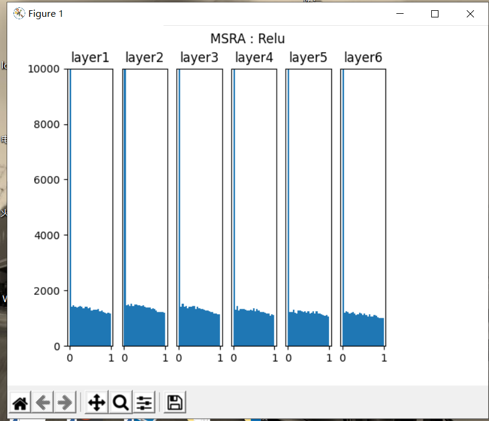

代码如下：

```Python
def net(init_method, activator):
    max_epoch = 1
    batch_size = 5
    learning_rate = 0.02
    params = HyperParameters_4_1(
        learning_rate, max_epoch, batch_size,
        net_type=NetType.Fitting,
        init_method=init_method)
    net = NeuralNet_4_1(params, "level1")
    num_hidden = [128,128,128,128,128,128,128](样本矩阵)
    fc_count = len(num_hidden)-1(样本矩阵的长度)
    layers = []
    for i in range(fc_count):
        fc = FcLayer_1_1(num_hidden[i], num_hidden[i+1], params)
        net.add_layer(fc, "fc")(调用fc参数)
        layers.append(fc)
        ac = ActivationLayer(activator)
        net.add_layer(ac, "activator")
        layers.append(ac)
    # end for
    # 从正态分布中取1000个样本，每个样本有num_hidden[0]个特征值
    # 转置是为了可以和w1做矩阵乘法
    x = np.random.randn(1000, num_hidden[0])
    # 激活函数输出值矩阵列表
    a_value = []
    # 依次做所有层的前向计算
    input = x
    for i in range(len(layers)):
        output = layers[i].forward(input)
        # 但是只记录激活层的输出
        if isinstance(layers[i], ActivationLayer):
            a_value.append(output)
        # end if
        input = output
    # end for
    for i in range(len(a_value)):
        ax = plt.subplot(1, fc_count+1, i+1)
        ax.set_title("layer" + str(i+1))
        plt.ylim(0,10000)
        if i > 0:
            plt.yticks([])
        ax.hist(a_value[i].flatten(), bins=25, range=[0,1])
    #end for
    # super title
    plt.suptitle(init_method.name + " : " + activator.get_name())
    plt.show()
if __name__ == '__main__':
    net(InitialMethod.Normal, Sigmoid())
    net(InitialMethod.Xavier, Sigmoid())
    net(InitialMethod.Xavier, Relu())
    net(InitialMethod.MSRA, Relu())
```
<font face="宋体"> <center>

## 梯度下降优化算法

</center> </font>

通过不停的迭代从而得到下面的图像
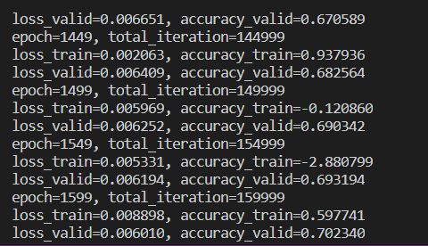
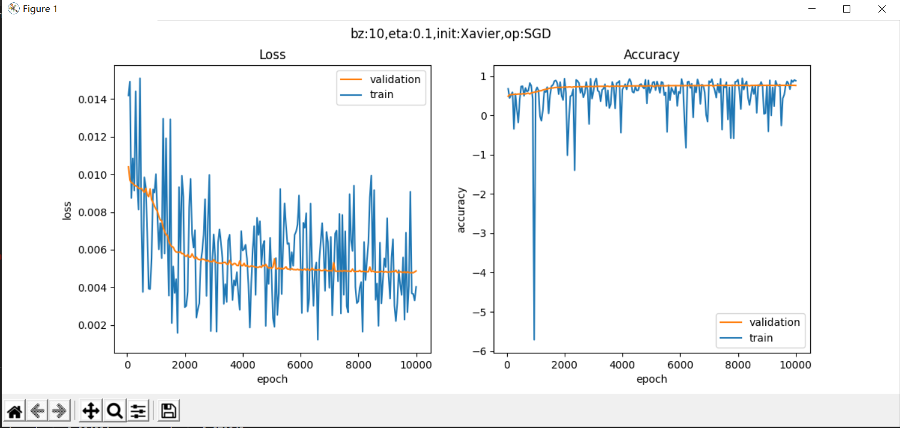


<font face="宋体"> <center>
## 自适应学习率算法
</center> </font>
通过不停的迭代从而得到下面的图像


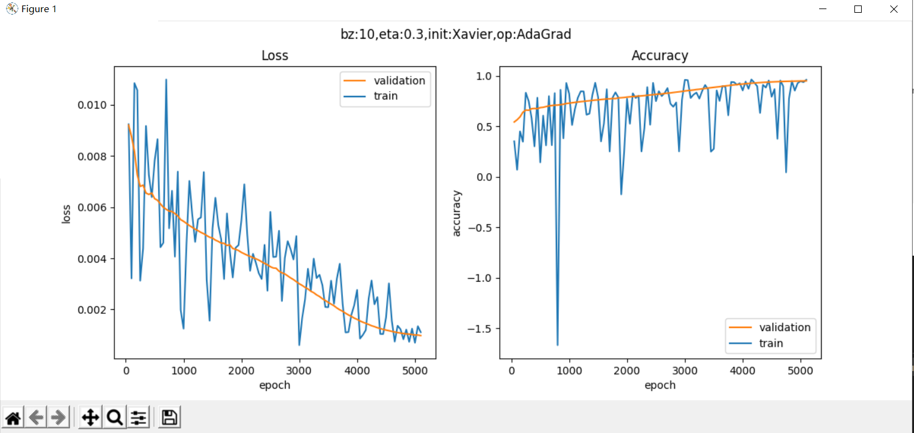


<font face="宋体"> <center>
## 9 正则化
</center> </font>
### 9.1 拟合程度比较

正则化是用于防止过拟合。在深度神经网络中，我们经常遇到问题就是网络的泛化。所谓泛化，就是模型在测试集上的表现要和训练集上一样好。经常有这样的例子：一个模型在训练集上千锤百炼，能到达99%的准确率，拿到测试集上一试，准确率还不到90%。这说明模型过度拟合了训练数据，而不能反映真实世界的情况。解决过度拟合的手段和过程，就叫做泛化。
神经网络的两大功能：回归和分类。这两类任务，都会出现欠拟合和过拟合现象。


上图是回归任务中的三种情况，依次为：欠拟合、正确的拟合、过拟合。


上图是分类任务中的三种情况，依次为：分类欠妥、正确的分类、分类过度。由于分类可以看作是对分类边界的拟合，所以我们经常也统称其为拟合。

上图中对于位置很特别的那颗绿色点样本，正确的做法是把它当作噪音看待，而不要让它对网络产生影响。而对于上例中的欠拟合情况，如果简单的（线性）模型不能很好地完成任务，我们可以考虑使用复杂的（非线性或深度）模型，即加深网络的宽度和深度，提高神经网络的能力。

但是如果网络过于宽和深，就会出现第三张图展示的过拟合的情况。

出现过拟合的原因：

1. 训练集的数量和模型的复杂度不匹配，样本数量级小于模型的参数
2. 训练集和测试集的特征分布不一致
3. 样本噪音大，使得神经网络学习到了噪音，正常样本的行为被抑制
4. 迭代次数过多，过分拟合了训练数据，包括噪音部分和一些非重要特征

用复杂度不匹配的模型的两个原因：

1. 因为有的模型以及非常成熟了，比如VGG16，可以不调参而直接用于你自己的数据训练，此时如果你的数据数量不够多，但是又想使用现有模型，就需要给模型加正则项了。
2. 使用相对复杂的模型，可以比较快速地使得网络训练收敛，以节省时间。

正则化后的数据图像如下图所示：
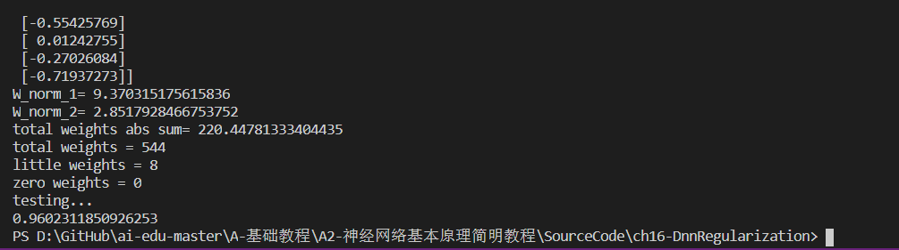
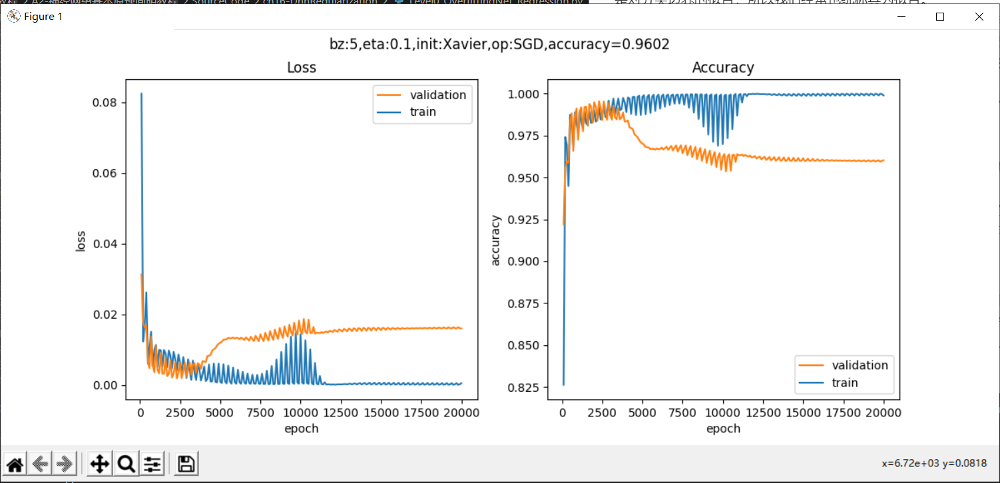
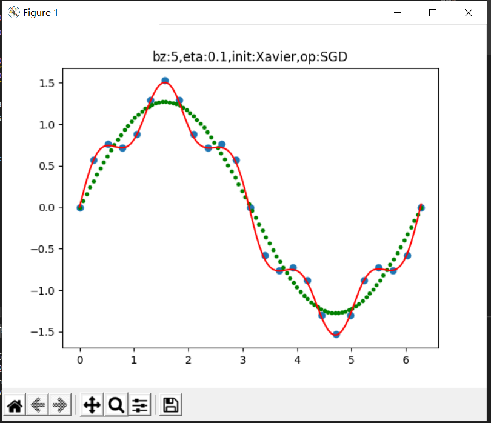
代码如下：

```Python
def Model(dataReader, num_input, num_hidden, num_output, params):
    net = NeuralNet_4_2(params, "overfitting")
    fc1 = FcLayer_2_0(num_input, num_hidden, params)
    net.add_layer(fc1, "fc1")(调用fc1参数)
    s1 = ActivatorLayer(Sigmoid())
    net.add_layer(s1, "s1")
    fc2 = FcLayer_2_0(num_hidden, num_hidden, params)
    net.add_layer(fc2, "fc2")(调用fc2参数)
    t2 = ActivatorLayer(Tanh())
    net.add_layer(t2, "t2")(调用t2参数)
    fc3 = FcLayer_2_0(num_hidden, num_hidden, params)
    net.add_layer(fc3, "fc3")(调用fc3参数)
    t3 = ActivatorLayer(Tanh())
    net.add_layer(t3, "t3")(调用t3参数)
    fc4 = FcLayer_2_0(num_hidden, num_output, params)
    net.add_layer(fc4, "fc4")(调用fc4参数)
    net.train(dataReader, checkpoint=100, need_test=True)
    net.ShowLossHistory(XCoordinate.Epoch)
    return net
```
<font face="宋体"> <center>
## L1正则合L2正则
</center> </font>
### L2正则化

L2 正则化公式非常简单，直接在原来的损失函数基础上加上权重参数的平方和：
$$L = E+\lambda\sum_j\lvert w_j^2 \$$
其中，E 是未包含正则化项的训练样本误差，λ 是正则化参数。

假设：

- W参数服从高斯分布，即：$w_j \sim N(0,\tau^2)$
- Y服从高斯分布，即：$y_i \sim N(w^Tx_i,\sigma^2)$

贝叶斯最大后验估计：

$$
\arg\max_wL(w) = \ln \prod_i^n \frac{1}{\sigma\sqrt{2 \pi}}\exp(-(\frac{y_i-w^Tx_i}{\sigma})^2/2) \cdot \prod_j^m{\frac{1}{\tau\sqrt{2\pi}}\exp(-(\frac{w_j}{\tau})^2/2)}
$$

$$
=-\frac{1}{2\sigma^2}\sum_i^n(y_i-w^Tx_i)^2-\frac{1}{2\tau^2}\sum_j^m{w_j^2}-n\ln\sigma\sqrt{2\pi}-m\ln \tau\sqrt{2\pi} \tag{3}
$$

因为$\sigma,b,n,\pi,m$等都是常数，所以损失函数$J(w)$的最小值可以简化为：

$$
\arg\min_wJ(w) = \sum_i^n(y_i-w^Tx_i)^2+\lambda\sum_j^m{w_j^2} \tag{4}
$$

看公式4，相当于是线性回归的均方差损失函数，再加上一个正则项，共同构成损失函数。如果想求这个函数的最小值，则需要两者协调，并不是说分别求其最小值就能实现整体最小，因为它们具有共同的W项，当W比较大时，第一项比较小，第二项比较大，或者正好相反。所以它们是矛盾组合体。

L2范数是指向量各元素的平方和然后求平方根。我们让L2范数的规则项最小，可以使得W的每个元素都很小，都接近于0，因为一般认为参数值小的模型比较简单，能适应不同的数据集，也在一定程度上避免了过拟合现象。可以设想一下对于一个线性回归方程，若参数很大，那么只要数据偏移一点点，就会对结果造成很大的影响；但如果参数足够小，数据偏移得多一点也不会对结果造成什么影响，专业一点的说法是“抗扰动能力强”。

代码如下：

```Python
if __name__ == '__main__':
    dr = LoadData()
    hp, num_hidden = SetParameters()
    hp.regular_name = RegularMethod.L2
    hp.regular_value = 0.01
    net = Model(dr, 1, num_hidden, 1, hp)
    ShowResult(net, dr, hp.toString())
```

运行结果如下图所示：
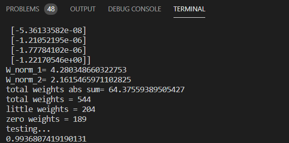
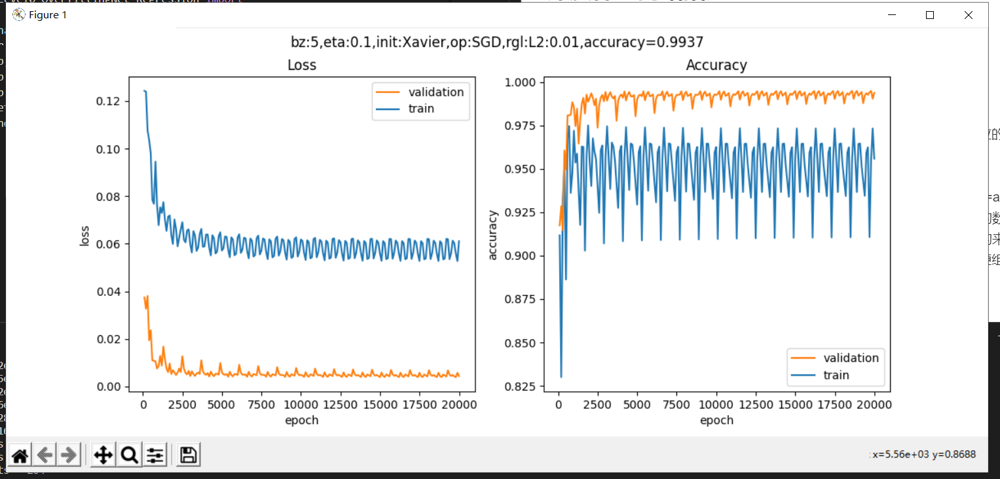


### L1正则化

L1正则化是在机器学习的Loss函数中，通常会添加一些正则化（正则化与一些贝叶斯先验本质上是一致的，L2正则化与高斯先验是一致的、L1正则化与拉普拉斯先验是一致）来降低模型的结构风险，这样可以使降低模型复杂度、防止参数过大
假设：

- W参数服从拉普拉斯分布，即$w_j \sim Laplace(0,b)$
- Y服从高斯分布，即$y_i \sim N(w^Tx_i,\sigma^2)$

贝叶斯最大后验估计：
$$
\begin{aligned}
\arg\max_wL(w) = &\ln \prod_i^n \frac{1}{\sigma\sqrt{2 \pi}}\exp(-\frac{1}{2}(\frac{y_i-w^Tx_i}{\sigma})^2) 
\cdot \prod_j^m{\frac{1}{2b}\exp(-\frac{\lvert w_j \rvert}{b})}
\\\\
=&-\frac{1}{2\sigma^2}\sum_i^n(y_i-w^Tx_i)^2-\frac{1}{2b}\sum_j^m{\lvert w_j \rvert}
-n\ln\sigma\sqrt{2\pi}-m\ln b\sqrt{2\pi} 
\end{aligned}
\tag{1}
$$

因为$\sigma,b,n,\pi,m$等都是常数，所以损失函数$J(w)$的最小值可以简化为：

$$
\arg\min_wJ(w) = \sum_i^n(y_i-w^Tx_i)^2+\lambda\sum_j^m{\lvert w_j \rvert} \tag{2}
$$

我们仍以两个参数为例，公式2的后半部分的正则形式为：

$$L_1 = \lvert w_1 \rvert + \lvert w_2 \rvert \tag{3}$$

因为$w_1,w_2$有可能是正数或者负数，我们令$x=|w_1|,y=|w_2|,c=L_1$，则公式3可以拆成以下4个公式的组合：

$$
y=-x+c \quad (当w_1 \gt 0, w_2 \gt 0时)
$$
$$
y=\quad x+c \quad (当w_1 \lt 0, w_2 \gt 0时)
$$
$$
y=\quad x-c \quad (当w_1 \gt 0, w_2 \lt 0时)
$$
$$
y=-x-c \quad (当w_1 \lt 0, w_2 \lt 0时)
$$

代码如下：

```Python
if __name__ == '__main__':
    dr = LoadData()
    hp, num_hidden = SetParameters()
    hp.regular_name = RegularMethod.L1
    hp.regular_value = 0.005
    net = Model(dr, 1, num_hidden, 1, hp)
    ShowResult(net, dr, hp.toString())
```

运行结果如下图所示:
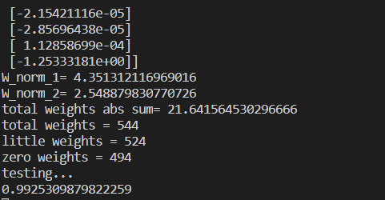
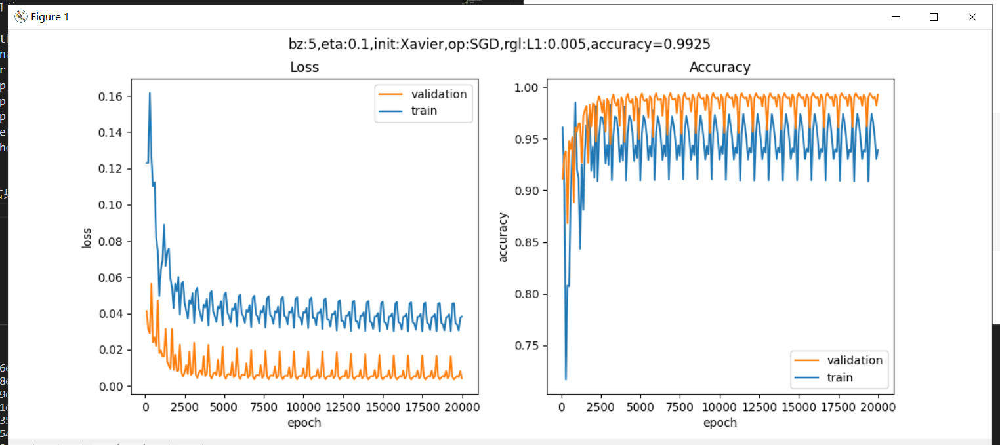

1. BGD
优点：
对于凸目标函数，可以保证全局最优； 对于非凸目标函数，可以保证一个局部最优。
缺点：
速度慢; 数据量大时不可行; 无法处理动态产生的新样本。
2. SGD
优点：
更新频次快，优化速度更快; 可以无法处理动态产生的新样本；一定的随机性导致有几率跳出局部最优(随机性来自于用一个样本的梯度去代替整体样本的梯度)
缺点：
随机性可能导致收敛复杂化，即使到达最优点仍然会进行过度优化，因此SGD得优化过程相比BGD充满动荡
L1正则化在实际中往往替代L0正则化，来防止过拟合。
L1正则化之所以可以防止过拟合，是因为L1范数就是各个参数的绝对值相加得到的，我们前面讨论了，参数值大小和模型复杂度是成正比的。因此复杂的模型，其L1范数就大，最终导致损失函数就大，说明这个模型就不够好。
L2正则化可以防止过拟合的原因和L1正则化一样，只是形式不太一样。
L2范数是各参数的平方和再求平方根，我们让L2范数的正则项最小，可以使W的每个元素都很小，都接近于0。但与L1范数不一样的是，它不会是每个元素为0，而只是接近于0。越小的参数说明模型越简单，越简单的模型越不容易产生过拟合现象。

<font face="宋体"> <center>
## 学习收获以及学习过程
</center> </font>

</center> </font>

<font face="宋体" color = "red"> 

1. 对markdown书写美化有了了解
2. 深度神经网络框架设计步骤有了初步了解（分为功能模式分析与抽象设计有两个大模块，起初并不了解其中的细节）
3. 完成了设计的功能验证部分
4. 根据下面给出的实例对前面的过程进行了实践（快速对分析过程以及原因有了初步了解）
5. 后面的功能测试步骤基本一致但是由于方法选择不太在个别位置做了一些改动
6. 矩阵初始化，运行了各个初始化代码
7. 了解了迭代多次的梯度下降算法
8. 知晓了正则化的目的（防止过拟合）以及正则化的本质（约束要优化的参数）
 </font>
