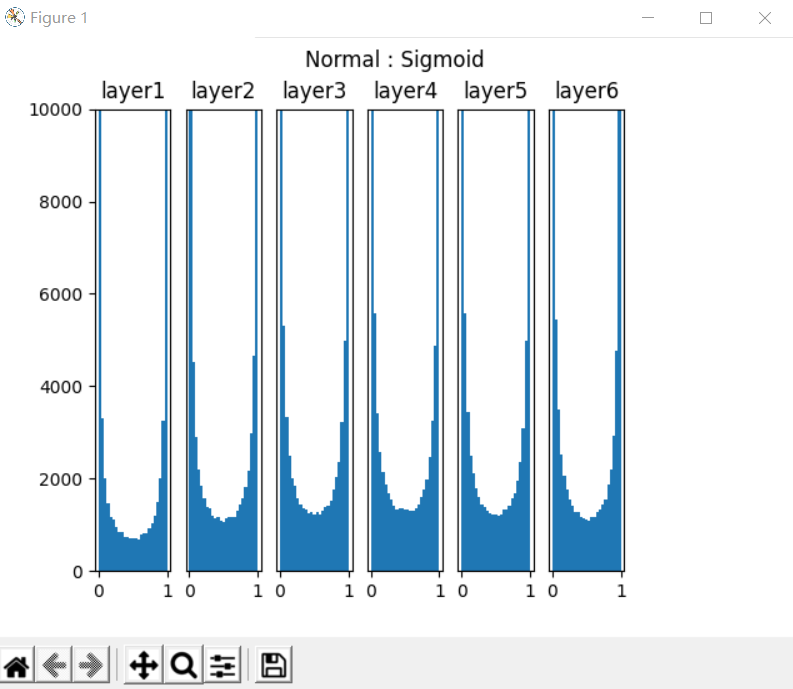
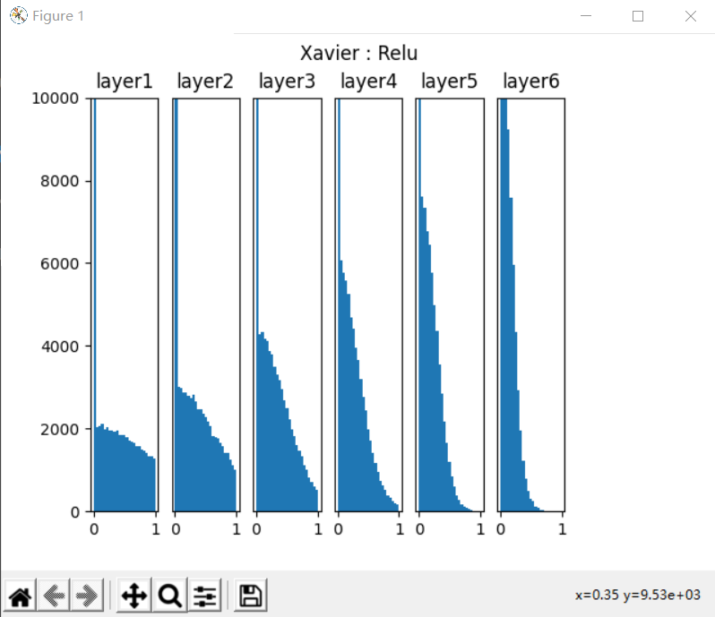

# 【Step7】

>>>># 14  搭建深度神经网络框架

>>### 14.0 深度神经网络框架设计

#### 功能/模式分析

比较第12章中的三层神经网络的代码，我们可以看到大量的重复之处，比如前向计算中：

```Python
def forward3(X, dict_Param):
    ...
    # layer 1
    Z1 = np.dot(W1,X) + B1
    A1 = Sigmoid(Z1)
    # layer 2
    Z2 = np.dot(W2,A1) + B2
    A2 = Tanh(Z2)
    # layer 3
    Z3 = np.dot(W3,A2) + B3
    A3 = Softmax(Z3)
    ...    
```

1，2，3三层的模式完全一样：矩阵运算+激活/分类函数。

再看看反向传播：

```Python
def backward3(dict_Param,cache,X,Y):
    ...
    # layer 3
    dZ3= A3 - Y
    dW3 = np.dot(dZ3, A2.T)
    dB3 = np.sum(dZ3, axis=1, keepdims=True)
    # layer 2
    dZ2 = np.dot(W3.T, dZ3) * (1-A2*A2) # tanh
    dW2 = np.dot(dZ2, A1.T)
    dB2 = np.sum(dZ2, axis=1, keepdims=True)
    # layer 1
    dZ1 = np.dot(W2.T, dZ2) * A1 * (1-A1)   #sigmoid
    dW1 = np.dot(dZ1, X.T)
    dB1 = np.sum(dZ1, axis=1, keepdims=True)
    ...
```
每一层的模式也非常相近：计算本层的`dZ`，再根据`dZ`计算`dW`和`dB`。

因为三层网络比两层网络多了一层，所以会在初始化、前向、反向、更新参数等四个环节有所不同，但却是有规律的。再加上前面章节中，为了实现一些辅助功能，我们已经写了很多类。所以，现在可以动手搭建一个深度学习的迷你框架了。

#### 抽象与设计

图14-1是迷你框架的模块化设计，下面对各个模块做功能点上的解释。


图14-1 迷你框架设计

>>### 14.1 回归任务功能测试

#### 搭建模型

这个模型很简单，一个双层的神经网络，第一层后面接一个Sigmoid激活函数，第二层直接输出拟合数据，如图14-2所示。


图14-2 完成拟合任务的抽象模型

```Python
def model():
    dataReader = LoadData()
    num_input = 1
    num_hidden1 = 4
    num_output = 1

    max_epoch = 10000
    batch_size = 10
    learning_rate = 0.5

    params = HyperParameters_4_0(
        learning_rate, max_epoch, batch_size,
        net_type=NetType.Fitting,
        init_method=InitialMethod.Xavier,
        stopper=Stopper(StopCondition.StopLoss, 0.001))

    net = NeuralNet_4_0(params, "Level1_CurveFittingNet")
    fc1 = FcLayer_1_0(num_input, num_hidden1, params)
    net.add_layer(fc1, "fc1")
    sigmoid1 = ActivationLayer(Sigmoid())
    net.add_layer(sigmoid1, "sigmoid1")
    fc2 = FcLayer_1_0(num_hidden1, num_output, params)
    net.add_layer(fc2, "fc2")

    net.train(dataReader, checkpoint=100, need_test=True)

    net.ShowLossHistory()
    ShowResult(net, dataReader)
```

超参数说明：

1. 输入层1个神经元，因为只有一个`x`值
2. 隐层4个神经元，对于此问题来说应该是足够了，因为特征很少
3. 输出层1个神经元，因为是拟合任务
4. 学习率=0.5
5. 最大`epoch=10000`轮
6. 批量样本数=10
7. 拟合网络类型
8. Xavier初始化
9. 绝对损失停止条件=0.001

>>### 14.2 回归任务 - 房价预测

#### 数据字段解读

- id：唯一id
- date：售出日期
- price：售出价格（标签值）
- bedrooms：卧室数量
- bathrooms：浴室数量
- sqft_living：居住面积
- sqft_lot：停车场面积
- floors：楼层数
- waterfront：泳池
- view：有多少次看房记录
- condition：房屋状况
- grade：评级
- sqft_above：地面上的面积
- sqft_basement：地下室的面积
- yr_built：建筑年份
- yr_renovated：翻修年份
- zipcode：邮政编码
- lat：维度
- long：经度
- sqft_living15：2015年翻修后的居住面积
- sqft_lot15：2015年翻修后的停车场面积

一些考虑：

- 唯一id在数据库中有用，在训练时并不是一个特征，所以要去掉
- 售出日期，由于是在一年内的数据，所以也没有用
- sqft_liging15的值，如果非0的话，应该替换掉sqft_living
- sqft_lot15的值，如果非0的话，应该替换掉sqft_lot
- 邮政编码对应的地理位置过于宽泛，只能引起噪音，应该去掉
- 返修年份，笔者认为它如果是非0值的话，可以替换掉建筑年份
- 看房记录次数多并不能代表该房子价格就高，而是因为地理位置、价格、配置等满足特定人群的要求，所以笔者认为它不是必须的特征值

所以最后只留下13个字段。

#### 数据处理

原始数据只有一个数据集，所以需要我们自己把它分成训练集和测试集，比例大概为4:1。此数据集为`csv`文件格式，为了方便，我们把它转换成了两个扩展名为`npz`的`numpy`压缩形式：

- `house_Train.npz`，训练数据集
- `house_Test.npz`，测试数据集

#### 加载数据

与上面第一个例子的代码相似，但是房屋数据属性繁杂，所以需要做归一化，房屋价格也是至少6位数，所以也需要做归一化。

这里有个需要注意的地方，即训练集和测试集的数据，需要合并在一起做归一化，然后再分开使用。为什么要先合并呢？假设训练集样本中的房屋面积的范围为150到220，而测试集中的房屋面积有可能是160到230，两者不一致。分别归一化的话，150变成0，160也变成0，这样预测就会产生误差。

最后还需要在训练集中用`GenerateValidaionSet(k=10)`分出一个1:9的验证集。

#### 搭建模型

在不知道一个问题的实际复杂度之前，我们不妨把模型设计得复杂一些。如下图所示，这个模型包含了四组全连接层-Relu层的组合，最后是一个单输出做拟合。


图14-5 完成房价预测任务的抽象模型


>>### 14.3 二分类任务功能测试

#### 搭建模型

同样是一个双层神经网络，但是最后一层要接一个Logistic二分类函数来完成二分类任务，如图14-7所示。


图14-7 完成非线性二分类教学案例的抽象模型

```Python

def model(dataReader):
    num_input = 2
    num_hidden = 3
    num_output = 1

    max_epoch = 1000
    batch_size = 5
    learning_rate = 0.1

    params = HyperParameters_4_0(
        learning_rate, max_epoch, batch_size,
        net_type=NetType.BinaryClassifier,
        init_method=InitialMethod.Xavier,
        stopper=Stopper(StopCondition.StopLoss, 0.02))

    net = NeuralNet_4_0(params, "Arc")

    fc1 = FcLayer_1_0(num_input, num_hidden, params)
    net.add_layer(fc1, "fc1")
    sigmoid1 = ActivationLayer(Sigmoid())
    net.add_layer(sigmoid1, "sigmoid1")
    
    fc2 = FcLayer_1_0(num_hidden, num_output, params)
    net.add_layer(fc2, "fc2")
    logistic = ClassificationLayer(Logistic())
    net.add_layer(logistic, "logistic")

    net.train(dataReader, checkpoint=10, need_test=True)
    return net
```

超参数说明：

1. 输入层神经元数为2
2. 隐层的神经元数为3，使用Sigmoid激活函数
3. 由于是二分类任务，所以输出层只有一个神经元，用Logistic做二分类函数
4. 最多训练1000轮
5. 批大小=5
6. 学习率=0.1
7. 绝对误差停止条件=0.02


>>### 14.4  二分类任务真实案例

####准备数据

此数据集是从1994 Census数据库中提取的$^{[1]}$。

#### 数据字段解读

标签值：>50K，<=50K。

属性字段：

- `age`，年龄：连续值
- `workclass`，工作性质：枚举型，类似私企、政府之类的
- `fnlwgt`，权重：连续值
- `education`，教育程度：枚举型，如学士、硕士等
- `education-num`，受教育的时长：连续值
- `marital-status`，婚姻状况：枚举型，已婚、未婚、离异等
- `occupation`，职业：枚举型，包含的种类很多，如技术支持、维修工、销售、农民渔民、军人等
- `relationship`，家庭角色：枚举型，丈夫、妻子等
- `sex`，性别：枚举型
- `capital-gain`，资本收益：连续值
- `capitial-loss`，资本损失：连续值
- `hours-per-week`，每周工作时长：连续值
- `native-country`，祖籍：枚举型

#### 数据处理

数据分析和数据处理实际上是一门独立的课，超出类本书的范围，所以我们只做一些简单的数据处理，以便神经网络可以用之训练。

对于连续值，我们可以直接使用原始数据。对于枚举型，我们需要把它们转成连续值。以性别举例，`Female=0`，`Male=1`即可。对于其它枚举型，都可以用从0开始的整数编码。

一个小技巧是利用`python`的`list`功能，取元素下标，即可以作为整数编码：

```Python
sex_list = ["Female", "Male"]
array_x[0,9] = sex_list.index(row[9].strip())
```

`strip()`是trim掉前面的空格，因为是`csv`格式，读出来会是这个样子："_Female"，前面总有个空格。`index`是取列表下标，这样对于字符串"Female"取出的下标为0，对于字符串"Male"取出的下标为1。

把所有数据按行保存到`numpy`数组中，最后用`npz`格式存储：
```Python
np.savez(data_npz, data=self.XData, label=self.YData)
```
原始数据已经把train data和test data分开了，所以我们针对两个数据集分别调用数据处理过程一次，保存为`Income_Train.npz`和`Income_Test.npz`。


>>### 14.5  多分类功能测试

#### 搭建模型一

#### 模型

使用Sigmoid做为激活函数的两层网络，如图14-12。


图14-12 完成非线性多分类教学案例的抽象模型

#### 代码

```Python
def model_sigmoid(num_input, num_hidden, num_output, hp):
    net = NeuralNet_4_0(hp, "chinabank_sigmoid")

    fc1 = FcLayer_1_0(num_input, num_hidden, hp)
    net.add_layer(fc1, "fc1")
    s1 = ActivationLayer(Sigmoid())
    net.add_layer(s1, "Sigmoid1")

    fc2 = FcLayer_1_0(num_hidden, num_output, hp)
    net.add_layer(fc2, "fc2")
    softmax1 = ClassificationLayer(Softmax())
    net.add_layer(softmax1, "softmax1")

    net.train(dataReader, checkpoint=50, need_test=True)
    net.ShowLossHistory()
    
    ShowResult(net, hp.toString())
    ShowData(dataReader)
```

#### 超参数说明

1. 隐层8个神经元
2. 最大`epoch=5000`
3. 批大小=10
4. 学习率0.1
5. 绝对误差停止条件=0.08
6. 多分类网络类型
7. 初始化方法为Xavier

`net.train()`函数是一个阻塞函数，只有当训练完毕后才返回。


>>### 14.6  多分类任务 - MNIST手写体识别

#### 数据读取

MNIST数据本身是图像格式的，我们用`mode="vector"`去读取，转变成矢量格式。

```Python
def LoadData():
    print("reading data...")
    dr = MnistImageDataReader(mode="vector")
    ......
```

#### 搭建模型

一共4个隐层，都用ReLU激活函数连接，最后的输出层接Softmax分类函数。


图14-18 完成MNIST分类任务的抽象模型

以下是主要的参数设置：

```Python
if __name__ == '__main__':
    dataReader = LoadData()
    num_feature = dataReader.num_feature
    num_example = dataReader.num_example
    num_input = num_feature
    num_hidden1 = 128
    num_hidden2 = 64
    num_hidden3 = 32
    num_hidden4 = 16
    num_output = 10
    max_epoch = 10
    batch_size = 64
    learning_rate = 0.1

    params = HyperParameters_4_0(
        learning_rate, max_epoch, batch_size,
        net_type=NetType.MultipleClassifier,
        init_method=InitialMethod.MSRA,
        stopper=Stopper(StopCondition.StopLoss, 0.12))

    net = NeuralNet_4_0(params, "MNIST")

    fc1 = FcLayer_1_0(num_input, num_hidden1, params)
    net.add_layer(fc1, "fc1")
    r1 = ActivationLayer(Relu())
    net.add_layer(r1, "r1")
    ......
    fc5 = FcLayer_1_0(num_hidden4, num_output, params)
    net.add_layer(fc5, "fc5")
    softmax = ClassificationLayer(Softmax())
    net.add_layer(softmax, "softmax")

    net.train(dataReader, checkpoint=0.05, need_test=True)
    net.ShowLossHistory(xcoord=XCoordinate.Iteration)
```

>>>># 15  网络优化


>>### 15.1 权重矩阵初始化

权重矩阵初始化是一个非常重要的环节，是训练神经网络的第一步，选择正确的初始化方法会带了事半功倍的效果。这就好比攀登喜马拉雅山，如果选择从南坡登山，会比从北坡容易很多。而初始化权重矩阵，相当于下山时选择不同的道路，在选择之前并不知道这条路的难易程度，只是知道它可以抵达山下。这种选择是随机的，即使你使用了正确的初始化算法，每次重新初始化时也会给训练结果带来很多影响。

比如第一次初始化时得到权重值为(0.12847，0.36453)，而第二次初始化得到(0.23334，0.24352)，经过试验，第一次初始化用了3000次迭代达到精度为96%的模型，第二次初始化只用了2000次迭代就达到了相同精度。这种情况在实践中是常见的。

#### 零初始化

即把所有层的`W`值的初始值都设置为0。

$$
W = 0
$$

但是对于多层网络来说，绝对不能用零初始化，否则权重值不能学习到合理的结果。看下面的零值初始化的权重矩阵值打印输出：
```
W1= [[-0.82452497 -0.82452497 -0.82452497]]
B1= [[-0.01143752 -0.01143752 -0.01143752]]
W2= [[-0.68583865]
 [-0.68583865]
 [-0.68583865]]
B2= [[0.68359678]]
```

可以看到`W1`、`B1`、`W2`内部3个单元的值都一样，这是因为初始值都是0，所以梯度均匀回传，导致所有`W`的值都同步更新，没有差别。这样的话，无论多少轮，最终的结果也不会正确。

#### 标准初始化

标准正态初始化方法保证激活函数的输入均值为0，方差为1。将W按如下公式进行初始化：

$$
W \sim N \begin{bmatrix} 0, 1 \end{bmatrix}
$$

其中的W为权重矩阵，N表示高斯分布，Gaussian Distribution，也叫做正态分布，Normal Distribution，所以有的地方也称这种初始化为Normal初始化。

一般会根据全连接层的输入和输出数量来决定初始化的细节：

$$
W \sim N
\begin{pmatrix} 
0, \frac{1}{\sqrt{n_{in}}}
\end{pmatrix}
$$

$$
W \sim U
\begin{pmatrix} 
-\frac{1}{\sqrt{n_{in}}}, \frac{1}{\sqrt{n_{in}}}
\end{pmatrix}
$$


>>### 15.2 梯度下降优化算法

权重矩阵初始化是一个非常重要的环节，是训练神经网络的第一步，选择正确的初始化方法会带了事半功倍的效果。这就好比攀登喜马拉雅山，如果选择从南坡登山，会比从北坡容易很多。而初始化权重矩阵，相当于下山时选择不同的道路，在选择之前并不知道这条路的难易程度，只是知道它可以抵达山下。这种选择是随机的，即使你使用了正确的初始化算法，每次重新初始化时也会给训练结果带来很多影响。

比如第一次初始化时得到权重值为(0.12847，0.36453)，而第二次初始化得到(0.23334，0.24352)，经过试验，第一次初始化用了3000次迭代达到精度为96%的模型，第二次初始化只用了2000次迭代就达到了相同精度。这种情况在实践中是常见的。

#### 零初始化

即把所有层的`W`值的初始值都设置为0。

$$
W = 0
$$

但是对于多层网络来说，绝对不能用零初始化，否则权重值不能学习到合理的结果。看下面的零值初始化的权重矩阵值打印输出：
```
W1= [[-0.82452497 -0.82452497 -0.82452497]]
B1= [[-0.01143752 -0.01143752 -0.01143752]]
W2= [[-0.68583865]
 [-0.68583865]
 [-0.68583865]]
B2= [[0.68359678]]
```

可以看到`W1`、`B1`、`W2`内部3个单元的值都一样，这是因为初始值都是0，所以梯度均匀回传，导致所有`W`的值都同步更新，没有差别。这样的话，无论多少轮，最终的结果也不会正确。

#### 标准初始化

标准正态初始化方法保证激活函数的输入均值为0，方差为1。将W按如下公式进行初始化：

$$
W \sim N \begin{bmatrix} 0, 1 \end{bmatrix}
$$

其中的W为权重矩阵，N表示高斯分布，Gaussian Distribution，也叫做正态分布，Normal Distribution，所以有的地方也称这种初始化为Normal初始化。

一般会根据全连接层的输入和输出数量来决定初始化的细节：

$$
W \sim N
\begin{pmatrix} 
0, \frac{1}{\sqrt{n_{in}}}
\end{pmatrix}
$$

$$
W \sim U
\begin{pmatrix} 
-\frac{1}{\sqrt{n_{in}}}, \frac{1}{\sqrt{n_{in}}}
\end{pmatrix}
$$


>>### 15.3 自适应学习率算法

### AdaGrad

Adaptive subgradient method.$^{[1]}$

AdaGrad是一个基于梯度的优化算法，它的主要功能是：它对不同的参数调整学习率，具体而言，对低频出现的参数进行大的更新，对高频出现的参数进行小的更新。因此，他很适合于处理稀疏数据。

在这之前，我们对于所有的参数使用相同的学习率进行更新。但 Adagrad 则不然，对不同的训练迭代次数t，AdaGrad 对每个参数都有一个不同的学习率。这里开方、除法和乘法的运算都是按元素运算的。这些按元素运算使得目标函数自变量中每个元素都分别拥有自己的学习率。

#### 输入和参数

- $\eta$ - 全局学习率
- $\epsilon$ - 用于数值稳定的小常数，建议缺省值为`1e-6`
- $r=0$ 初始值
  
#### 算法

---

计算梯度：$g_t = \nabla_\theta J(\theta_{t-1})$

累计平方梯度：$r_t = r_{t-1} + g_t \odot g_t$

计算梯度更新：$\Delta \theta = {\eta \over \epsilon + \sqrt{r_t}} \odot g_t$

更新参数：$\theta_t=\theta_{t-1} - \Delta \theta$

---

从AdaGrad算法中可以看出，随着算法不断迭代，$r$会越来越大，整体的学习率会越来越小。所以，一般来说AdaGrad算法一开始是激励收敛，到了后面就慢慢变成惩罚收敛，速度越来越慢。$r$值的变化如下：

0. $r_0 = 0$
1. $r_1=g_1^2$
2. $r_2=g_1^2+g_2^2$
3. $r_3=g_1^2+g_2^2+g_3^2$

在SGD中，随着梯度的增大，我们的学习步长应该是增大的。但是在AdaGrad中，随着梯度$g$的增大，$r$也在逐渐的增大，且在梯度更新时$r$在分母上，也就是整个学习率是减少的，这是为什么呢？

这是因为随着更新次数的增大，我们希望学习率越来越慢。因为我们认为在学习率的最初阶段，我们距离损失函数最优解还很远，随着更新次数的增加，越来越接近最优解，所以学习率也随之变慢。

但是当某个参数梯度较小时，累积和也会小，那么更新速度就大。

经验上已经发现，对于训练深度神经网络模型而言，从训练开始时积累梯度平方会导致有效学习率过早和过量的减小。AdaGrad在某些深度学习模型上效果不错，但不是全部。


>>### 15.4 算法在等高线图上的效果比较

### 模拟效果比较

为了简化起见，我们先用一个简单的二元二次函数来模拟损失函数的等高线图，测试一下我们在前面实现的各种优化器。但是以下测试结果只是一个示意性质的，可以理解为在绝对理想的条件下（样本无噪音，损失函数平滑等等）的各算法的表现。

$$z = \frac{x^2}{10} + y^2 \tag{1}$$

公式1是模拟均方差函数的形式，它的正向计算和反向计算的`Python`代码如下：

```Python
def f(x, y):
    return x**2 / 10.0 + y**2

def derivative_f(x, y):
    return x / 5.0, 2.0*y
```

我们依次测试4种方法：

- 普通SGD, 学习率0.95
- 动量Momentum, 学习率0.1
- RMPSProp，学习率0.5
- Adam，学习率0.5

每种方法都迭代20次，记录下每次反向过程的(x,y)坐标点，绘制图15-8如下。


图15-8 不同梯度下降优化算法的模拟比较

- SGD算法，每次迭代完全受当前梯度的控制，所以会以折线方式前进。
- Momentum算法，学习率只有0.1，每次继承上一次的动量方向，所以会以比较平滑的曲线方式前进，不会出现突然的转向。
- RMSProp算法，有历史梯度值参与做指数加权平均，所以可以看到比较平缓，不会波动太大，都后期步长越来越短也是符合学习规律的。
- Adam算法，因为可以被理解为Momentum和RMSProp的组合，所以比Momentum要平缓一些，比RMSProp要平滑一些。


>>### 15.5  批量归一化的原理

#### 正态分布

正态分布，又叫做高斯分布。

若随机变量$X$，服从一个位置参数为$\mu$、尺度参数为$\sigma$的概率分布，且其概率密度函数为：

$$
f(x)=\frac{1}{\sigma\sqrt{2 \pi} } e^{- \frac{{(x-\mu)^2}}{2\sigma^2}} \tag{1}
$$

则这个随机变量就称为正态随机变量，正态随机变量服从的分布就称为正态分布，记作：

$$
X \sim N(\mu,\sigma^2) \tag{2}
$$

当μ=0,σ=1时，称为标准正态分布：

$$X \sim N(0,1) \tag{3}$$

此时公式简化为：

$$
f(x)=\frac{1}{\sqrt{2 \pi}} e^{- \frac{x^2}{2}} \tag{4}
$$

图15-10就是三种（$\mu,\sigma$）组合的函数图像。


图15-10 不同参数的正态分布函数曲线

#### 深度神经网络的挑战

机器学习领域有个很重要的假设：I.I.D.（独立同分布）假设，就是假设训练数据和测试数据是满足相同分布的，这样就能做到通过训练数据获得的模型能够在测试集获得好的效果。

在深度神经网络中，我们可以将每一层视为对输入的信号做了一次变换：

$$
Z = W \cdot X + B \tag{5}
$$

我们在第5章学过，输入层的数据已经归一化，如果不做归一化，很多时候甚至网络不会收敛，可见归一化的重要性。

随后的网络的每一层的输入数据在经过公式5的运算后，其分布一直在发生变化，前面层训练参数的更新将导致后面层输入数据分布的变化，必然会引起后面每一层输入数据分布的改变，不再是输入的原始数据所适应的分布了。

而且，网络前面几层微小的改变，后面几层就会逐步把这种改变累积放大。训练过程中网络中间层数据分布的改变称之为内部协变量偏移（Internal Covariate Shift）。BN的提出，就是要解决在训练过程中，中间层数据分布发生改变的情况。

比如，在上图中，假设X是服从蓝色或红色曲线的分布，经过公式5后，有可能变成了绿色曲线的分布。

标准正态分布的数值密度占比如图15-11所示。


图15-11 标准正态分布的数值密度占比

有68%的值落在[-1,1]之间，有95%的值落在[-2,2]之间。

比较一下偏移后的数据分布区域和Sigmoid激活函数的图像，如图15-12所示。


图15-12 偏移后的数据分布区域和Sigmoid激活函数

可以看到带来的问题是：

1. 在大于2的区域，激活后的值基本接近1了，饱和输出。如果蓝色曲线表示的数据更偏向右侧的话，激活函数就会失去了作用，因为所有的输出值都是0.94、0.95、0.98这样子的数值，区别不大；
2. 导数数值小，只有不到0.1甚至更小，反向传播的力度很小，网络很难收敛。

有的人会问，我们在深度学习中不是都用ReLU激活函数吗？那么BN对于ReLU有用吗？下面我们看看ReLU函数的图像，如图15-13所示。


图15-13 ReLU函数曲线

上图中蓝色为数据分布，已经从0点向右偏移了，黄色为ReLU的激活值，可以看到95%以上的数据都在大于0的区域，从而被Relu激活函数原封不动第传到了下一层网络中，而没有被小于0的部分剪裁，那么这个网络和线性网络也差不多了，失去了深层网络的能力。

#### 批量归一化

既然可以把原始训练样本做归一化，那么如果在深度神经网络的每一层，都可以有类似的手段，也就是说把层之间传递的数据移到0点附近，那么训练效果就应该会很理想。这就是批归一化BN的想法的来源。

深度神经网络随着网络深度加深，训练起来越困难，收敛越来越慢，这是个在DL领域很接近本质的问题。很多论文都是解决这个问题的，比如ReLU激活函数，再比如Residual Network。BN本质上也是解释并从某个不同的角度来解决这个问题的。

BN就是在深度神经网络训练过程中使得每一层神经网络的输入保持相同的分布，致力于将每一层的输入数据正则化成$N(0,1)$的分布。因次，每次训练的数据必须是mini-batch形式，一般取32，64等数值。


>>### 15.6 批量归一化的实现

#### 反向传播

在上一节中，我们知道了批量归一化的正向计算过程，这一节中，为了实现完整的批量归一化层，我们首先需要推导它的反向传播公式，然后用代码实现。本节中的公式序号接上一节，以便于说明。

首先假设已知从上一层回传给批量归一化层的误差矩阵是：

$$\delta = \frac{dJ}{dZ}，\delta_i = \frac{dJ}{dz_i} \tag{10}$$

#### 求批量归一化层参数梯度

则根据公式9，求$\gamma,\beta$的梯度：

$$\frac{dJ}{d\gamma} = \sum_{i=1}^m \frac{dJ}{dz_i}\frac{dz_i}{d\gamma}=\sum_{i=1}^m \delta_i \cdot n_i \tag{11}$$

$$\frac{dJ}{d\beta} = \sum_{i=1}^m \frac{dJ}{dz_i}\frac{dz_i}{d\beta}=\sum_{i=1}^m \delta_i \tag{12}$$

注意$\gamma$和$\beta$的形状与批大小无关，只与特征值数量有关，我们假设特征值数量为1，所以它们都是一个标量。在从计算图看，它们都与N,Z的全集相关，而不是某一个样本，因此会用求和方式计算。

#### 求批量归一化层的前传误差矩阵

下述所有乘法都是element-wise的矩阵点乘，不再特殊说明。

从正向公式中看，对z有贡献的数据链是：

- $z_i \leftarrow n_i \leftarrow x_i$
- $z_i \leftarrow n_i \leftarrow \mu_B \leftarrow x_i$
- $z_i \leftarrow n_i \leftarrow \sigma^2_B \leftarrow x_i$
- $z_i \leftarrow n_i \leftarrow \sigma^2_B \leftarrow \mu_B \leftarrow x_i$

从公式8，9：

$$
\frac{dJ}{dx_i} = \frac{dJ}{d n_i}\frac{d n_i}{dx_i} + \frac{dJ}{d \sigma^2_B}\frac{d \sigma^2_B}{dx_i} + \frac{dJ}{d \mu_B}\frac{d \mu_B}{dx_i} \tag{13}
$$

公式13的右侧第一部分（与全连接层形式一样）：

$$
\frac{dJ}{d n_i}=  \frac{dJ}{dz_i}\frac{dz_i}{dn_i} = \delta_i \cdot \gamma\tag{14}
$$

上式等价于：

$$
\frac{dJ}{d N}= \delta \cdot \gamma\tag{14}
$$

公式14中，我们假设样本数为64，特征值数为10，则得到一个$64\times 10$的结果矩阵（因为$1\times 10$的矩阵会被广播为$64\times 10$的矩阵）：

$$\delta^{(64 \times 10)} \odot \gamma^{(1 \times 10)}=R^{(64 \times 10)}$$

公式13的右侧第二部分，从公式8：
$$
\frac{d n_i}{dx_i}=\frac{1}{\sqrt{\sigma^2_B + \epsilon}} \tag{15}
$$

公式13的右侧第三部分，从公式8（注意$\sigma^2_B$是个标量，而且与X,N的全集相关，要用求和方式）：

$$
\begin{aligned}
\frac{dJ}{d \sigma^2_B} &= \sum_{i=1}^m \frac{dJ}{d n_i}\frac{d n_i}{d \sigma^2_B} 
\\
&= -\frac{1}{2}(\sigma^2_B + \epsilon)^{-3/2}\sum_{i=1}^m \frac{dJ}{d n_i} \cdot (x_i-\mu_B) 
\end{aligned}
\tag{16}
$$

公式13的右侧第四部分，从公式7：
$$
\frac{d \sigma^2_B}{dx_i} = \frac{2(x_i - \mu_B)}{m} \tag{17}
$$

公式13的右侧第五部分，从公式7，8：

$$
\frac{dJ}{d \mu_B}=\frac{dJ}{d n_i}\frac{d n_i}{d \mu_B} + \frac{dJ}{d\sigma^2_B}\frac{d \sigma^2_B}{d \mu_B} \tag{18}
$$

公式18的右侧第二部分，根据公式8：

$$
\frac{d n_i}{d \mu_B}=\frac{-1}{\sqrt{\sigma^2_B + \epsilon}} \tag{19}
$$

公式18的右侧第四部分，根据公式7（$\sigma^2_B和\mu_B$与全体$x_i$相关，所以要用求和）：

$$
\frac{d \sigma^2_B}{d \mu_B}=-\frac{2}{m}\sum_{i=1}^m (x_i- \mu_B) \tag{20}
$$

所以公式18是：

$$
\frac{dJ}{d \mu_B}=-\frac{\delta \cdot \gamma}{\sqrt{\sigma^2_B + \epsilon}} - \frac{2}{m}\frac{dJ}{d \sigma^2_B}\sum_{i=1}^m (x_i- \mu_B) \tag{18}
$$

公式13的右侧第六部分，从公式6：

$$
\frac{d \mu_B}{dx_i} = \frac{1}{m} \tag{21}
$$

所以，公式13最后是这样的：

$$
\frac{dJ}{dx_i} = \frac{\delta \cdot \gamma}{\sqrt{\sigma^2_B + \epsilon}} + \frac{dJ}{d\sigma^2_B} \cdot \frac{2(x_i - \mu_B)}{m} + \frac{dJ}{d\mu_B} \cdot \frac{1}{m} \tag{13}
$$


>>>># 16  正则化

>>### 16.0 过拟合

#### 拟合程度比较

在深度神经网络中，我们遇到的另外一个挑战，就是网络的泛化问题。所谓泛化，就是模型在测试集上的表现要和训练集上一样好。经常有这样的例子：一个模型在训练集上千锤百炼，能到达99%的准确率，拿到测试集上一试，准确率还不到90%。这说明模型过度拟合了训练数据，而不能反映真实世界的情况。解决过度拟合的手段和过程，就叫做泛化。

神经网络的两大功能：回归和分类。这两类任务，都会出现欠拟合和过拟合现象，如图16-1和16-2所示。


图16-1 回归任务中的欠拟合、正确的拟合、过拟合

图16-1是回归任务中的三种情况，依次为：欠拟合、正确的拟合、过拟合。


图16-2 分类任务中的欠拟合、正确的拟合、过拟合

图16-2是分类任务中的三种情况，依次为：分类欠妥、正确的分类、分类过度。由于分类可以看作是对分类边界的拟合，所以我们经常也统称其为拟合。

上图中对于“深入敌后”的那颗绿色点样本，正确的做法是把它当作噪音看待，而不要让它对网络产生影响。而对于上例中的欠拟合情况，如果简单的（线性）模型不能很好地完成任务，我们可以考虑使用复杂的（非线性或深度）模型，即加深网络的宽度和深度，提高神经网络的能力。

但是如果网络过于宽和深，就会出现第三张图展示的过拟合的情况。

出现过拟合的原因：

1. 训练集的数量和模型的复杂度不匹配，样本数量级小于模型的参数
2. 训练集和测试集的特征分布不一致
3. 样本噪音大，使得神经网络学习到了噪音，正常样本的行为被抑制
4. 迭代次数过多，过分拟合了训练数据，包括噪音部分和一些非重要特征

既然模型过于复杂，那么我们简化模型不就行了吗？为什么要用复杂度不匹配的模型呢？有两个原因：

1. 因为有的模型以及非常成熟了，比如VGG16，可以不调参而直接用于你自己的数据训练，此时如果你的数据数量不够多，但是又想使用现有模型，就需要给模型加正则项了。
2. 使用相对复杂的模型，可以比较快速地使得网络训练收敛，以节省时间。


>>### 16.1 偏差与方差

#### 神经网络训练的例子

我们在前面讲过数据集的使用，包括训练集、验证集、测试集。在训练过程中，我们要不断监测训练集和验证集在当前模型上的误差，和上面的打靶的例子一样，有可能产生四种情况，如表16-2所示。

表16-2 不同偏差和方差反映的四种情况

|情况|训练集误差A|验证集误差B|偏差|方差|说明|
|---|---|---|---|---|---|
|情况1|1.5%|1.7%|低偏差|低方差|A和B都很好，适度拟合|
|情况2|12.3%|11.4%|高偏差|低方差|A和B都很不好，欠拟合|
|情况3|1.2%|13.1%|低偏差|高方差|A很好，但B不好，过拟合|
|情况4|12.3%|21.5%|高偏差|高方差|A不好，B更不好，欠拟合|

在本例中，偏差衡量训练集误差，方差衡量训练集误差和验证集误差的比值。

上述四种情况的应对措施：

- 情况1
  
  效果很好，可以考虑进一步降低误差值，提高准确度。

- 情况2

  训练集和验证集同时出现较大的误差，有可能是：迭代次数不够、数据不好、网络设计不好，需要继续训练，观察误差变化情况。

- 情况3

  训练集的误差已经很低了，但验证集误差很高，说明过拟合了，即训练集中的某些特殊样本影响了网络参数，但类似的样本在验证集中并没有出现

- 情况4

  两者误差都很大，目前还看不出来是什么问题，需要继续训练

#### 偏差-方差分解

除了用上面的试验来估计泛化误差外，我们还希望在理论上分析其必然性，这就是偏差-方差分解的作用，bias-variance decomposition。表16-3是本章中使用的符号的含义，后续在推导公式的时候会用到。

表16-3 符号含义

|符号|含义|
|---|---|
|$x$|测试样本|
|$D$|数据集|
|$y$|x的真实标记|
|$y_D$|x在数据集中标记(可能有误差)|
|$f$|从数据集D学习的模型|
|$f_{x;D}$|从数据集D学习的模型对x的预测输出|
|$f_x$|模型f对x的期望预测输出|

学习算法期望的预测：
$$f_x=E[f_{x;D}] \tag{1}$$
不同的训练集/验证集产生的预测方差：
$$var(x)=E[(f_{x;D}-f_x)^2] \tag{2}$$
噪声：
$$\epsilon^2=E[(y_D-y)^2] \tag{3}$$
期望输出与真实标记的偏差：
$$bias^2(x)=(f_x-y)^2 \tag{4}$$
算法的期望泛化误差：

$$
\begin{aligned}
E(f;D)&=E[(f_{x;D}-y_D)^2]=E[(f_{x;D}-f_x+f_x-y_D)^2] \\\\
&=E[(f_{x;D}-f_x)^2]+E[(f_x-y_D)^2]+E[2(f_{x;D}-f_x)(f_x-y_D)]=E[(f_{x;D}-f_x)^2]+E[(f_x-y_D)^2] \\\\
&=E[(f_{x;D}-f_x)^2]+E[(f_x-y+y-y_D)^2]=E[(f_{x;D}-f_x)^2]+E[(f_x-y)^2]+E(y-y_D)^2]+E[2(f_x-y)(y-y_D)] \\\\
&=E[(f_{x;D}-f_x)^2]+(f_x-y)^2+E[(y-y_D)^2]=var(x) + bias^2(x) + \epsilon^2
\end{aligned}
$$

所以，各个项的含义是：

- 偏差：度量了学习算法的期望与真实结果的偏离程度，即学习算法的拟合能力。
- 方差：训练集与验证集的差异造成的模型表现的差异。
- 噪声：当前数据集上任何算法所能到达的泛化误差的下线，即学习问题本身的难度。

想当然地，我们希望偏差与方差越小越好，但实际并非如此。一般来说，偏差与方差是有冲突的，称为偏差-方差窘境 (bias-variance dilemma)。

- 给定一个学习任务，在训练初期，由于训练不足，网络的拟合能力不够强，偏差比较大，也是由于拟合能力不强，数据集的特征也无法使网络产生显著变化，也就是欠拟合的情况。
- 随着训练程度的加深，网络的拟合能力逐渐增强，训练数据的特征也能够渐渐被网络学到。
- 充分训练后，网络的拟合能力已非常强，训练数据的微小特征都会导致网络发生显著变化，当训练数据自身的、非全局的特征被网络学到了，则将发生过拟合。


图16-10 训练过程中的偏差和方差变化

在图16-10中，随着训练程度的增加，偏差（点线）一路下降，但是方差（虚线）一路上升，整体误差（实线，偏差+方差+噪音误差）呈U形，最佳平衡点就是U形的最低点。


#### 正则

#### 范数

回忆一下范数的基本概念：

$$L_p = \lVert x \rVert_p = ({\sum^n_{i=1}\lvert x_i \rvert^p})^{1/p} \tag{1}$$

范数包含向量范数和矩阵范数，我们只关心向量范数。我们用具体的数值来理解范数。假设有一个向量a：

$$a=[1,-2,0,-4]$$

$$L_0=3 \tag{非0元素数}$$
$$L_1 = \sum^3_{i=0}\lvert x_i \rvert = 1+2+0+4=7 \tag{绝对值求和}$$
$$L_2 = \sqrt[2]{\sum^3_{i=0}\lvert x_i \rvert^2} =\sqrt[2]{21}=4.5826 \tag{平方和求方根}$$
$$L_{\infty}=4 \tag{最大值的绝对值}$$

注意p可以是小数，比如0.5：

$$L_{0.5}=19.7052$$

一个经典的关于P范数的变化如图16-12所示。


图16-12 P范数变化图

我们只关心L1和L2范数：

- L1范数是个菱形体，在平面上是一个菱形
- L2范数是个球体，在平面上是一个圆

#### 高斯分布

$$
f(x)=\frac{1}{\sigma\sqrt{2 \pi}} \exp{- \frac{(x-\mu)^2}{2\sigma^2}} \tag{2}
$$

请参考15.2一节。

#### L2正则化

假设：

- W参数服从高斯分布，即：$w_j \sim N(0,\tau^2)$
- Y服从高斯分布，即：$y_i \sim N(w^Tx_i,\sigma^2)$

贝叶斯最大后验估计：

$$
\arg\max_wL(w) = \ln \prod_i^n \frac{1}{\sigma\sqrt{2 \pi}}\exp(-(\frac{y_i-w^Tx_i}{\sigma})^2/2) \cdot \prod_j^m{\frac{1}{\tau\sqrt{2\pi}}\exp(-(\frac{w_j}{\tau})^2/2)}
$$

$$
=-\frac{1}{2\sigma^2}\sum_i^n(y_i-w^Tx_i)^2-\frac{1}{2\tau^2}\sum_j^m{w_j^2}-n\ln\sigma\sqrt{2\pi}-m\ln \tau\sqrt{2\pi} \tag{3}
$$

因为$\sigma,b,n,\pi,m$等都是常数，所以损失函数$J(w)$的最小值可以简化为：

$$
\arg\min_wJ(w) = \sum_i^n(y_i-w^Tx_i)^2+\lambda\sum_j^m{w_j^2} \tag{4}
$$

看公式4，相当于是线性回归的均方差损失函数，再加上一个正则项（也称为惩罚项），共同构成损失函数。如果想求这个函数的最小值，则需要两者协调，并不是说分别求其最小值就能实现整体最小，因为它们具有共同的W项，当W比较大时，第一项比较小，第二项比较大，或者正好相反。所以它们是矛盾组合体。

为了简化问题便于理解，我们用两个参数$w_1,w_2$举例。对于公式4的第一项，我们用前面学习过损失函数的等高线图来解释。对于第二项，形式应该是一个圆形，因为圆的方程是$r^2=x^2+y^2$。所以，结合两者，我们可以得到图16-13。


图16-13 L2正则区与损失函数等高线示意图

黄色的圆形，就是正则项所处的区域。这个区域的大小，是由参数$\lambda$所控制的，该值越大，黄色圆形区域越小，对w的惩罚力度越大（距离椭圆中心越远）。比如图16-13中分别标出了该值为0.7、0.8、0.9的情况。

还以图16-13为例，当$\lambda$为0.7时，L2正则区为图中所示最大的黄色区域，此区域与损失函数等高线图的交点有多个，比如图中的红、绿、蓝三个点，但由于红点距离椭圆中心最近，所以最后求得的权重值应该在红点的位置坐标上$(w_1,w_2)$。

在回归里面，把具有L2项的回归叫“岭回归”（Ridge Regression），也叫它“权值衰减”(weight decay)。 weight decay还有一个好处，它使得目标函数变为凸函数，梯度下降法和L-BFGS都能收敛到全局最优解。

L2范数是指向量各元素的平方和然后求平方根。我们让L2范数的规则项最小，可以使得W的每个元素都很小，都接近于0，因为一般认为参数值小的模型比较简单，能适应不同的数据集，也在一定程度上避免了过拟合现象。可以设想一下对于一个线性回归方程，若参数很大，那么只要数据偏移一点点，就会对结果造成很大的影响；但如果参数足够小，数据偏移得多一点也不会对结果造成什么影响，专业一点的说法是“抗扰动能力强”。

>>### 16.3 L1正则

#### 拉普拉斯分布

$$
\begin{aligned}
f(x)&=\frac{1}{2b}\exp(-\frac{|x-\mu|}{b})\\\\
&= \frac{1}{2b} \begin{cases} \exp(\frac{x-\mu}{b}), & x \lt \mu \\\\ \exp(\frac{\mu-x}{b}), & x \gt \mu \end{cases}
\end{aligned}
$$


#### L0范数与L1范数

L0范数是指向量中非0的元素的个数。如果我们用L0范数来规则化一个参数矩阵W的话，就是希望W的大部分元素都是0，即让参数W是稀疏的。

L1范数是指向量中各个元素绝对值之和，也叫“稀疏规则算子”（Lasso regularization）。为什么L1范数会使权值稀疏？有人可能会这样给你回答“它是L0范数的最优凸近似”。实际上，还存在一个更美的回答：任何的规则化算子，如果他在$w_i=0$的地方不可微，并且可以分解为一个“求和”的形式，那么这个规则化算子就可以实现稀疏。w的L1范数是绝对值，所以$|w|$在$w=0$处是不可微。

为什么L0和L1都可以实现稀疏，但常用的为L1？一是因为L0范数很难优化求解，二是L1范数是L0范数的最优凸近似，而且它比L0范数要容易优化求解。所以大家才把目光转于L1范数。

综上，L1范数和L0范数可以实现稀疏，L1因具有比L0更好的优化求解特性而被广泛应用。

#### L1正则化

假设：

- W参数服从拉普拉斯分布，即$w_j \sim Laplace(0,b)$
- Y服从高斯分布，即$y_i \sim N(w^Tx_i,\sigma^2)$

贝叶斯最大后验估计：
$$
\begin{aligned}
\arg\max_wL(w) = &\ln \prod_i^n \frac{1}{\sigma\sqrt{2 \pi}}\exp(-\frac{1}{2}(\frac{y_i-w^Tx_i}{\sigma})^2) 
\cdot \prod_j^m{\frac{1}{2b}\exp(-\frac{\lvert w_j \rvert}{b})}
\\\\
=&-\frac{1}{2\sigma^2}\sum_i^n(y_i-w^Tx_i)^2-\frac{1}{2b}\sum_j^m{\lvert w_j \rvert}
-n\ln\sigma\sqrt{2\pi}-m\ln b\sqrt{2\pi} 
\end{aligned}
\tag{1}
$$

因为$\sigma,b,n,\pi,m$等都是常数，所以损失函数$J(w)$的最小值可以简化为：

$$
\arg\min_wJ(w) = \sum_i^n(y_i-w^Tx_i)^2+\lambda\sum_j^m{\lvert w_j \rvert} \tag{2}
$$

我们仍以两个参数为例，公式2的后半部分的正则形式为：

$$L_1 = \lvert w_1 \rvert + \lvert w_2 \rvert \tag{3}$$

因为$w_1,w_2$有可能是正数或者负数，我们令$x=|w_1|,y=|w_2|,c=L_1$，则公式3可以拆成以下4个公式的组合：

$$
y=-x+c \quad (当w_1 \gt 0, w_2 \gt 0时)
$$
$$
y=\quad x+c \quad (当w_1 \lt 0, w_2 \gt 0时)
$$
$$
y=\quad x-c \quad (当w_1 \gt 0, w_2 \lt 0时)
$$
$$
y=-x-c \quad (当w_1 \lt 0, w_2 \lt 0时)
$$

所以上述4个公式（4条直线）会组成一个二维平面上的一个菱形。

图16-17中三个菱形，是因为惩罚因子的数值不同而形成的，越大的话，菱形面积越小，惩罚越厉害。


图16-17 L1正则区与损失函数等高线示意图

以最大的那个菱形区域为例，它与损失函数等高线有多个交点，都可以作为此问题的解，但是其中红色顶点是损失函数值最小的，因此它是最优解。

图16-17中菱形的红色顶点的含义具有特殊性，即$W=[w2, 0]$，也就是w1的值为0。扩充到三维空间，菱形的6个顶点，上下的两个顶点是z值不为0，xy值为0；左右的两个顶点是x值不为0，yz值为0；前后的两个顶点是y值不为0，xz值为0。也就是说，如果xyz是三个权重值的话，那么顶点上只有一个权重值不为0，其它两个都是0。

高维空间，其顶点就是只有少数的参数有非零值，其它参数都为0。这就是所谓的稀疏解。可以这样理解，这个菱形像个刺猬，用它去触碰一个气球，一定是刺尖儿先扎到气球。上图中的三个菱形，都是顶点先接触到等高线。

在回归里面，把具有L1项的回归叫“Lasso Regression”（Tibshirani, 1995, Least Absolute Shrinkage and Selection Operator）。

#### 损失函数的变化

假设我们以前使用的损失函数为$J_0$，则新的损失函数变成：

$$J = J_0 + \frac{\lambda}{m} \sum_i^m \lvert w_i \rvert$$

代码片段如下：

```Python
  regular_cost = 0
  for i in range(self.layer_count-1,-1,-1):
      layer = self.layer_list[i]
      if isinstance(layer, FcLayer):
          if regularName == RegularMethod.L1:
              regular_cost += np.sum(np.abs(layer.weights.W))
          elif regularName == RegularMethod.L2:
              regular_cost += np.sum(np.square(layer.weights.W))
      # end if
  # end for
  return regular_cost * self.params.lambd
```

可以看到L1部分的代码，先求绝对值，再求和。那个分母上的m是在下一段代码中处理的，因为在上一段代码中，没有任何样本数量的信息。

```Python
loss_train = self.lossFunc.CheckLoss(train_y, self.output)
loss_train += regular_cost / train_y.shape[0]
```
`train_y.shape[0]`就是样本数量。

#### 反向传播的变化

假设一个两层的神经网络，其前向过程是：

$$Z1=W1 \cdot X + B1$$
$$A1 = Sigmoid(Z1)$$
$$Z2=W2 \cdot A1 + B2$$
$$J(w,b) = J_0 + \lambda (\lvert W1 \rvert+\lvert W2 \rvert)$$

则反向过程为：

$$
\begin{aligned}
dW2&=\frac{dJ}{dW2}=\frac{dJ}{dZ2}\frac{dZ2}{dW2}+\frac{dJ}{dW2} \\\\
&=dZ2 \cdot A1^T+\lambda \odot sign(W2)
\end{aligned}
$$
$$dW1= dZ1 \cdot X^T + \lambda \odot sign(W1) $$

从上面的公式中可以看到，正则项在方向传播过程中，唯一影响的就是求W的梯度时，要增加一个$\lambda \odot sign(W)$，sign是符号函数，返回该值的符号，即1或-1。所以，我们可以修改`FullConnectionLayer.py`中的反向传播函数如下：

```Python
def backward(self, delta_in, idx):
    dZ = delta_in
    m = self.x.shape[1]
    if self.regular == RegularMethod.L2:
        self.weights.dW = (np.dot(dZ, self.x.T) + self.lambd * self.weights.W) / m
    elif self.regular == RegularMethod.L1:
        self.weights.dW = (np.dot(dZ, self.x.T) + self.lambd * np.sign(self.weights.W)) / m
    else:
        self.weights.dW = np.dot(dZ, self.x.T) / m
    # end if
    self.weights.dB = np.sum(dZ, axis=1, keepdims=True) / m
    ......
```
符号函数的效果如下：
```Python
>>> a=np.array([1,-1,2,0])
>>> np.sign(a)
>>> array([ 1, -1,  1,  0])
```
当w为正数时，符号为正，值为1，相当于直接乘以w的值；当w为负数时，符号为负，值为-1，相当于乘以(-w)的值。最后的效果就是乘以w的绝对值。


>>### 16.4 早停法 Early Stopping

#### 理论基础

早停法，实际上也是一种正则化的策略，可以理解为在网络训练不断逼近最优解的过程种（实际上这个最优解是过拟合的），在梯度等高线的外围就停止了训练，所以其原理上和L2正则是一样的，区别在于得到解的过程。

我们把图16-21再拿出来讨论一下。


图16-21 损失函数值的等高线图

图中所示的等高线图，是当前带噪音的样本点所组成梯度图，并不代表测试集数据，所以其中心位置也不代表这个问题的最优解。我们假设红线是最优解，则早停法的目的就是在到达红线附近时停止训练。

#### 算法

一般的做法是，在训练的过程中，记录到目前为止最好的validation 准确率，当连续N次Epoch（比如N=10或者更多次）没达到最佳准确率时，则可以认为准确率不再提高了。此时便可以停止迭代了（Early Stopping）。这种策略也称为“No-improvement-in-N”，N即Epoch的次数，可以根据实际情况取，如10、20、30……

算法描述如下：

***

```
初始化
    初始权重均值参数：theta = theta_0
    迭代次数：i = 0
    忍耐次数：patience = N (e.g. N=10)
    忍耐次数计数器：counter = 0
    验证集损失函数值：lastLoss = 10000 (给一个特别大的数值)

while (epoch < maxEpoch) 循环迭代训练过程
    正向计算，反向传播更新theta
    迭代次数加1：i++
    计算验证集损失函数值：newLoss = loss
    if (newLoss < lastLoss) // 新的损失值更小
        忍耐次数计数器归零：counter = 0
        记录当前最佳权重矩阵训练参数：theta_best = theta
        记录当前迭代次数：i_best = i
        更新最新验证集损失函数值：lastLoss = newLoss
    else // 新的损失值大于上一步的损失值
        忍耐次数计数器加1：counter++
        if (counter >= patience) 停止训练！！！
    end if
end while
```

***

此时，`theta_best`和`i_best`就是最佳权重值和迭代次数。

#### 要注意的问题

1. 门限值`patience`不能太小，比如小于5，因为很可能在5个`epoch`之外，损失函数值又会再次下降
2. `patience`不能太大，比如大于30，因为在这30个`epoch`之内，由于样本数量少和数据`shuffle`的关系，很可能某个`epoch`的损失函数值会比上一次低，这样忍耐次数计数器`counter`就清零了，从而不能及时停止。
3. 当样本数量少时，为了获得平滑的变化曲线，可以考虑使用加权平均的方式处理当前和历史损失函数值，以避免某一次的高低带来的影响。


>>### 16.5 丢弃法 Dropout

#### 基本原理

2012年，Alex、Hinton在其论文《ImageNet Classification with Deep Convolutional Neural Networks》中用到了Dropout算法，用于防止过拟合。

我们假设原来的神经网络是这个结构，最后输出三分类结果，如图16-24所示。


图16-24 输出三分类的神经网络结构图

Dropout可以作为训练深度神经网络的一种正则方法供选择。在每个训练批次中，通过忽略一部分的神经元（让其隐层节点值为0），可以明显地减少过拟合现象。这种方式可以减少隐层节点间的相互作用，高层的神经元需要低层的神经元的输出才能发挥作用，如果高层神经元过分依赖某个低层神经元，就会有过拟合发生。在一次正向/反向的过程中，通过随机丢弃一些神经元，迫使高层神经元和其它的一些低层神经元协同工作，可以有效地防止神经元因为接收到过多的同类型参数而陷入过拟合的状态，来提高泛化程度。

丢弃后的结果如图16-25所示。


图16-25 使用丢弃法的神经网络结构图

其中有叉子的神经元在本次迭代训练中被暂时的封闭了，在下一次迭代训练中，再随机地封闭一些神经元，同一个神经元也许被连续封闭两次，也许一次都没有被封闭，完全随机。封闭多少个神经元是由一个超参来控制的，叫做丢弃率。

#### 算法与实现

#### 前向计算

正常的隐层计算公式是：

$$
Z = W \cdot X + B \tag{1}
$$

加入随机丢弃步骤后，变成了：

$$
r \sim Bernoulli(p) \tag{2}
$$
$$Y = r \cdot X \tag{3}$$
$$Z = Y \cdot W + B \tag{4}
$$

公式2是得到一个分布概率为p的伯努利分布，伯努利分布在这里可以简单地理解为0-1分布，$p=0.5$时，会以相同概率产生0、1，假设一共10个数，则：
$$
r=[0,0,1,1,0,1,0,1,1,0]
$$
或者
$$
r=[0,1,1,0,0,1,0,1,0,1]
$$
或者其它一些分布。

从公式3，Y将会是X经过r的mask的结果，1的位置保留原x值，0的位置相乘后为0。

#### 反向传播

在反向传播时，和Relu函数的反向差不多，需要记住正向计算时得到的mask值，反向的误差矩阵直接乘以这个mask值就可以了。

#### 训练和测试/阶段的不同

在训练阶段，我们使用正向计算的逻辑。在测试时，不能随机丢弃一些神经元，否则会造成测试结果不稳定，比如某个样本的第一次测试，得到了结果A；第二次测试，得到结果B。由于丢弃的神经元的不同，A和B肯定不相同，就会造成无法解释的情况。

但是如何模拟那些在训练时丢弃的神经元呢？我们仍然可以利用训练时的丢弃概率，如图16-26所示。


图16-26 利用训练时的丢弃概率模拟丢弃的神经元

图16-26的左侧部分为训练时，输入的信号会以概率p存在，如果$p=0.6$，则会有40%的概率被丢弃，此神经元被封闭；有60%的概率存在，此神经元可以接收到输入并向后传播。

图16-26的右侧部分为测试/推理时，输入信号总会存在，但是在每个输出上，都应该用原始的权重值，乘以概率p。比如`input=1`，权重值`w=0.12`，`p=0.4`，则output$=1 \times 0.4 \times 0.12=0.048$。


>>### 16.6 数据增强 Data Augmentation

过拟合的原因之一是训练数据不够，而在现代的机器学习中，数据量却是不成问题，因为通过互联网上用户的交互行为，或者和手机App的交互行为，可以收集大量的数据用于网络训练。

但是对于一些图片类数据，不是很容易从原始渠道搞到，所以可以采用增加一些假数据的方式来满足需要，尤其是当这个任务是分类任务时，更加适合。

对于拟合任务，在当前样本数据附近增加一些假的样本数据并无意义，相当于把整个样本数据变“粗”。对于概率密度计算任务，增加假样本很可能破坏原始样本的概率密度。

通过丰富的图像处理手段，我们往往可以把样本数量翻好几倍。下面我们通过手写数字识别的例子，来说明如何做简单的图片增强。

#### 图像数据增强

#### 旋转

定义图片中心和旋转角度，进行微小的旋转。


图16-30 原始图片与旋转后的图片

图16-30中，中间的是原始图片，左右是旋转后的图片。

选择操作的代码：

```Python
def rotate(image, angle):
    height, width = image.shape
    center = (height // 2, width // 2)
    rotation = cv2.getRotationMatrix2D(center, angle, 1)
    rotated_image = cv2.warpAffine(image, rotation, (width, height))
    return rotated_image
```
在调用上面的代码时，angle=10或者-10，相当于向左或向右旋转10度。

#### 缩放


图16-31 原始图片与缩放后的图片

图16-31中各部分的图片分别是：

- 上：水平方向放大到1.2倍
- 左：垂直方向放大到1.2倍
- 中：原始图片
- 右：垂直方向缩小到0.8倍
- 下：水平方向缩小到0.8倍

#### 平移和添加噪音


图16-32 原始图片与平移后的图片、带噪声的图片

图16-32中各部分的图片分别是：

- 上左：原始图片
- 上右：向下平移2像素
- 下左：向右平移2像素
- 下右：添加噪音

平移操作的代码：
```Python
def translate(image, distance, direction=0):
    height, width = image.shape

    if direction == 0:
        M = np.float32([[1, 0, 0], [0, 1, distance]])
    else:
        M = np.float32([[1, 0, distance], [0, 1, 0]])
    # end if

    return cv2.warpAffine(image, M, (width, height))
```    

添加噪音的代码：
```Python
def noise(image, var=0.1):
    gaussian_noise = np.random.normal(0, var ** 0.5, image.shape)
    noise_image = image + gaussian_noise
    return np.clip(noise_image, 0, 1)
```

做完上述变换后，我们得到了额外的9000个数据，连同原始的1000个数据一起保存在.npz文件中，供后面使用。

#### 其它图像处理方法

- 翻转图像：即左右镜像，或者上下镜像，但是对于数字识别来说不合适
- 剪裁图像：从图像中随机选择一部分，再调整为原始图像大小，对于本例也不适合
- 颜色变化：对图像进行颜色抖动，即对RGB值进行随机扰动，如椒盐噪声和高斯噪声
- 对比度变化：通过修改HSV空间中的色调和饱和度来改变图像的对比度，也可以用直方图均衡化
- 亮度变化：改变整个图像的亮度
- 颜色增强：对于颜色暗淡的图片进行全图的颜色增强

以上这些方法，其实就相当于用照相机在不同的角度、光线、背景、远近的条件下，对目标数据进行再次采样，所以从原理上来说是完全合理的。


>>### 16.7 集成学习 Ensemble Learning

#### 集成学习的概念

当数据集有问题，或者网络学习能力不足，或准确度不够时，我们可以采取集成学习的方法，来提升性能。说得通俗一些，就是发挥团队的智慧，根据团队中不同背景、不同能力的成员的独立意见，通过某种决策方法来解决一个问题。所以集成学习也称为多分类器系统(multi-classifier system)、基于委员会的学习(committee-based learning)等。

图16-36是一个简单的集成学习的示意图。


图16-36 集成学习的示意图

图中有两个组件：

#### Individual Learner 个体学习器

如果所有的个体学习器都是同一类型的学习器，即同质模式，比如都用神经网路，称为“基学习器”（base learner），相应的学习算法称为“基学习算法”（base learning algorithm）。

在传统的机器学习中，个体学习器可以是不同的，比如用决策树、支持向量机等，此时称为异质模式。

#### Aggregator 结合模块

个体学习器的输出，通过一定的结合策略，在结合模块中有机结合在一起，可以形成一个能力较强的学习器，所以有时称为强学习器，而相应地称个体学习器为弱学习器。

个体学习器之间是否存在依赖关系呢？这取决于产生个体学习器的方法：

- Boosting系列算法，一系列的个体学习器需要一个个地串行生成，有前后依赖关系。
- Bagging算法和随机森林算法（Random Forest），个体学习器可以独立或并行生成，没有依赖关系。

我们只讨论使用神经网络的同质个体学习方法，和Bagging集成算法。由于神经网络的复杂性，即使使用相同的网络参数，由于初始化的不同或者训练数据的不同，也可以得到差别很大的模型。

#### Bagging法集成学习的基本流程

图16-37是Bagging集成学习的示意图。


图16-37 Bagging集成学习示意图

1. 首先是数据集的使用，采用自助采样法（Bootstrap Sampling）。假设原始数据集Training Set中有1000个样本，我们从中随机取一个样本的拷贝放到Training Set-1中，此样本不会从原始数据集中被删除，原始数据集中还有1000个样本，而不是999个，这样下次再随机取样本时，此样本还有可能被再次选到。如此重复m次（此例m=1000），我们可以生成Training Set-1。一共重复N次（此例N=9），可以得到N个数据集。
2. 然后搭建一个神经网络模型，可以参数相同。在N个数据集上，训练出N个模型来。
3. 最后再进入Aggregator。N值不能太小，否则无法提供差异化的模型，也不能太大而带来训练模型的时间花销，一般来说取5到10就能满足要求。


>>>># 代码测试结果

#### 15.1





#### 15.4


#### 15.5


>>>># 学习总结
通过学习step7,对深度神经网络有了大致的了解，但对于各个知识的掌握度还不是很高，需要自己反复细致的消化，通过更多的实践来完善自身的知识系统。
