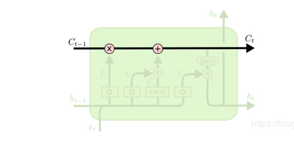

# 作业五
阅读相关资料，总结循环神经网络处理语音识别应用的过程。
## 一.循环神经网络
循环神经网络是一种具有记忆功能的神经网络，适合序列数据的建模。它在语音识别、自然语言处理等领域取得了成功。是除卷积神经网络之外深度学习中最常用的一种网络结构。
### 循环层的工作原理
循环神经网络（简称RNN）会记住网络在上一个时刻的输出值，并将该值用于当前时刻输出值的生成，这由循环层实现。RNN的输入为前面介绍的向量序列，每个时刻接收一个输入，网络会产生一个输出，而这个输出是由之前的序列共同作用决定的。假设t时刻循环层的状态值为 ht，它由上一时刻的状态值以及当前时刻的输入值共同决定。

## 二.语音识别
语音识别深度学习最早应用于语音识别问题时的作用是替代GMM-HMM框架中的高斯混合模型，负责声学模型的建模，即DNN-HMM结构。在这种结构里，深层神经网络负责计算音频帧属于某一声学状态的概率或者是提取出声音的特征，其余的部分和GMM-HMM结构相同。语音识别的困难之处在于输入语音信号序列中每个发音单元的起始位置和终止位置是未知的，即不知道输出序列和输入序列之间的对齐关系，这属于前面介绍的时序分类问题。深度学习技术在语音识别里一个有影响力的成果是循环神经网络和CTC的结合，和卷积神经网络、自动编码器等相比，循环神经网络具有可以接受不固定长度的序列数据作为输入的优势，而且具有记忆功能。将CTC技术用于语音识别问题。语音识别中，识别出的字符序列或者音素序列长度一定不大于输入的特征帧序列。CTC在标注符号集中加上空白符号blank，然后利用循环神经网络进行标注，再把blank符号和预测出的重复符号消除。

下图是CTC的原理：

### 采用技术
解码时采用的是前缀搜索技术。CTC在这里起到了对齐的作用，最显著的优势是实现了端到端的学习，无需人工对语音序列进行分割，这样做还带来了精度上的提升。在实现时循环神经网络采用了双向LSTM网络，简称BLSTM。训练样本集的音频数据被切分成10毫秒的帧，其中相邻帧之间有5毫秒的重叠，使用MFCC特征作为循环神经网络的输入向量。原始音频信号被转换成一个MFCC向量序列。特征向量为26维，包括了对数能量和一阶导数值。向量的每一个分量都进行了归一化。在解码时，使用最优路径和前缀搜索解码，解码的结果就是语音识别要得到的标记序列。
### 实现语音识别

第一部分为RNN的损失函数，第二部分为语言模型的损失函数，第三部分对英文为单词数，对汉语为字数，  和  为人工设定的权重参数。网络的最前端是卷积层，对输入的频谱向量执行1D或者2D卷积。实验结果证明2D卷积有更好的效果。整个网络包含多个循环层，循环层还使用了批量归一化技术，它可以作用于前一层和本层上一时刻状态值的线性加权和，也可以只作用于前一层的输入值。
### LSTM核心思想
对于LSTM，大家肯定能想到门，LSTM是通过遗忘门，输入门，输出门来实现信息的控制。下面对着三重门进行介绍：LSTM的关键在于细胞的状态整个(绿色的图表示的是一个cell)，和穿过细胞的那条水平线。细胞状态类似于传送带。直接在整个链上运行，只有一些少量的线性交互。信息在上面流传保持不变会很容易。

