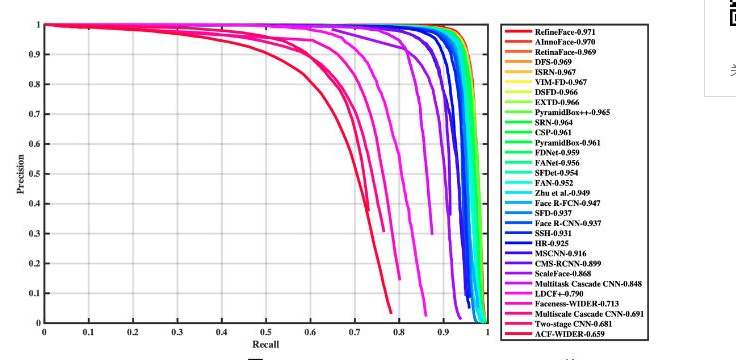

# 作业七
阅读https://mp.weixin.qq.com/s/Bn-6Sm9Hxuo0I8JQvvyoVw，以是否带口罩检测情境应用为例，讨论目标检测应用的过程以及关键问题。
## 目标检测
### 一.简介
标检测是计算机视觉领域中的一项研究热点,其主要目标是从图像中找到目标物体并定位。近年来随着深度学习的快速发展,基于卷积神经网络的目标检测已经达到较高的检测精度和检测速度,然而该技术还有很大的提升空间,小目标检测、定位不精准、检测速度较慢、图片背景复杂、虚检、漏检等问题对目标检测算法具有很大的挑战性。
#### 经典经典目标跟踪方法
目前跟踪算法可以被分为产生式(generative model)和判别式(discriminative model)两大类别。
 
产生式方法运用生成模型描述目标的表观特征，之后通过搜索候选目标来最小化重构误差。比较有代表性的算法有稀疏编码(sparse coding)，在线密度估计(online density estimation)和主成分分析(PCA)等。产生式方法着眼于对目标本身的刻画，忽略背景信息，在目标自身变化剧烈或者被遮挡时容易产生漂移。
 
与之相对的，判别式方法通过训练分类器来区分目标和背景。这种方法也常被称为tracking-by-detection。近年来，各种机器学习算法被应用在判别式方法上，其中比较有代表性的有多示例学习方法(multiple instance learning), boosting和结构SVM(structured SVM)等。判别式方法因为显著区分背景和前景的信息，表现更为鲁棒，逐渐在目标跟踪领域占据主流地位。值得一提的是，目前大部分深度学习目标跟踪方法也归属于判别式框架。
 
近年来，基于相关滤波(correlation filter)的跟踪方法因为速度快,效果好吸引了众多研究者的目光。相关滤波器通过将输入特征回归为目标高斯分布来训练 filters。并在后续跟踪中寻找预测分布中的响应峰值来定位目标的位置。相关滤波器在运算中巧妙应用快速傅立叶变换获得了大幅度速度提升。目前基于相关滤波的拓展方法也有很多，包括核化相关滤波器(kernelized correlation filter, KCF), 加尺度估计的相关滤波器(DSST)等。
#### 基于深度学习的目标跟踪方法
不同于检测、识别等视觉领域深度学习一统天下的趋势，深度学习在目标跟踪领域的应用并非一帆风顺。其主要问题在于训练数据的缺失：深度模型的魔力之一来自于对大量标注训练数据的有效学习，而目标跟踪仅仅提供第一帧的bounding-box作为训练数据。这种情况下，在跟踪开始针对当前目标从头训练一个深度模型困难重重。目前基于深度学习的目标跟踪算法采用了几种思路来解决这个问题，下面将依据思路的不同展开介绍，并在最后介绍目前跟踪领域出现的运用递归神经网络(recurrent neural network)解决目标跟踪问题的新思路。
### 二.人脸口罩检测数据
#### 模型介绍
在人脸检测最常用的数据集——WIDER Face数据集的评估结果上来看，使用深度学习的模型在准确率和召回率上极大的超过了传统算法。下图的青线是Viola-Jones的Precision-Recall图。

下图是众多基于深度学习的人脸检测算法的性能评估PR曲线。可以看到基于深度学习的人脸检测算法的性能，大幅超过了VJ算法（曲线越靠右越好）。近两年来，人脸检测算法在WIDER Face的简单测试集（easy 部分）上可以达到95%召回率下，准确率也高达90%，作为对比，VJ算法在40%召回率下，准确率只有75%左右。

#### 数据
人脸检测数据集非常多，其中最常用的莫过于WIDER Face数据集，我们从中选择了3894张图片，并进行了校验，主要是将部分戴口罩的人脸标注为戴口罩。对于戴口罩的人脸，我们使用了中科院信工所葛仕明老师开源的MAFA数据集，该数据集本是一个遮挡人脸的数据集，其中有各种被遮挡的人脸图片，大多数都是被口罩遮挡的人脸图片，我们从中选择了4064张人脸戴口罩的图片。MAFA数据集的人脸位置定义与WIDER Face有较大区别，MAFA的人脸框在靠近眉毛上方，是正方形的，而且标注框不严格（框离脸部边缘有缝隙），而WIDER Face的人脸框在额头上方，如果不进行修改，会导致模型对于不戴口罩的人脸，检测框是到额头上方，而戴口罩的人脸，检测框只到眉毛上方。
#### TensoFlow.js部署

因为WIDER Face本身是一个稍微复杂的数据集，再加上我们模型的输入和参数量比较小，所以，可以看到对于人脸的AP只有0.896。