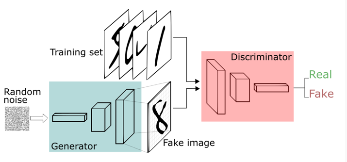

# 作业八
举例说明生成对抗网络的应用
## GANs（生成对抗网络）
### 一.简介
生成式对抗网络（GAN, Generative Adversarial Networks ）是一种深度学习模型，是近年来复杂分布上无监督学习最具前景的方法之一。模型通过框架中（至少）两个模块：生成模型（Generative Model）和判别模型（Discriminative Model）的互相博弈学习产生相当好的输出。原始 GAN 理论中，并不要求 G 和 D 都是神经网络，只需要是能拟合相应生成和判别的函数即可。但实用中一般均使用深度神经网络作为 G 和 D 。一个优秀的GAN应用需要有良好的训练方法，否则可能由于神经网络模型的自由性而导致输出不理想。
#### 结构

#### 工作原理
一个GAN中包含两个相互竞争的神经网络模型。一个网络称为生成器（generator），能将噪声作为输入并生成样本；另一个网络称为鉴别器（discriminator），能接收生成器数据和真实训练数据，训练得到能正确区分数据类型的分类器。这两个网络互相对抗。其中，生成器通过学习来产生更逼近真实数据的新样本，用于愚弄鉴别器，反之鉴别器也需要更好地区分生成数据与真实数据。将这两个网络联合训练，经过大量回合“交锋”后，鉴别器将无法区分生成样本和实际数据。
### 二.案例分析（图像转换）
针对不同谱段图像获取代价不同的问题，提出一种基于生成对抗网络的图像转换方法。转换过程以肉眼可分辨范围内图像轮廓不变为出发点。首先，通过成对的训练数据对生成器和判别器进行交替训练，不断对损失函数进行优化，直到模型达到纳什平衡。然后用测试数据对上述训练好的模型进行检测，查看转换效果,并从主观观察和客观上计算平均绝对误差和均方误差角度评价转换效果。通过上述过程最终实现不同谱段图像之间的转换。其中，生成器借鉴U-Net架构；判别器采用传统卷积神经网络架构；损失函数方面增加L1损失来保证图像转换前后高、低频特征的完整性。
#### 网络结构
该网络使用编解码的形式，以CGAN为基础思想，以U-Net（一种图像分割网络）为网络结构。

#### 损失函数
类似上下文自编码器，由两个部分组成。

