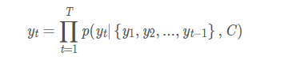

# 作业八
简要说明采用Seq2Seq模型实现机器翻译的原理
## Seq2seq
当输入和输出都是不定长序列时，可以使⽤编码器—解码器（encoder-decoder） 或者seq2seq模型。这两个模型本质上都⽤到了两个循环神经⽹络，分别叫做编码器和解码器。编码器⽤来分析输⼊序列，解码器⽤来⽣成输出序列

图中描述了使⽤编码器—解码器将英语句⼦翻译成法语句⼦的⼀种⽅法。在训练数据集中，可以在每个句⼦后附上特殊符号“< eos>”（end of sequence）以表⽰序列的终⽌。编码器每个时间步的输⼊依次为英语句⼦中的单词、标点和特殊符号“< eos >”。图中使⽤了编码器在最终时间步的隐藏状态作为输⼊句⼦的表征或编码信息。解码器在各个时间步中使⽤输⼊句⼦的编码信息和上个时间步的输出以及隐藏状态作为输⼊。希望解码器在各个时间步能正确依次输出翻译后的法语单词、标点和特殊符号“< eos >”。解码器在最初时间步的输⼊⽤到了⼀个表⽰序列开始的特殊符号“< bos >”。
编码器的作⽤是把⼀个不定⻓的输⼊序列变换成⼀个定⻓的背景变量c，并在该背景变量中编码输⼊序列信息。常⽤的编码器是循环神经⽹络。
### 编码The encoder
这边选取编码和解码都是RNN的组合来说明。在RNN中，当前时间的隐藏状态ht是由上一时间的状态和当前时间输入决定的，也就是:

获得了各个时间段的隐藏层以后，再将隐藏层的信息汇总，生成最后的语义向量:

### 解码The decoder
解码阶段可以看做编码的逆过程。这个阶段，我们要根据给定的语义向量C和之前已经生成的输出序列(y1,y2,...,yt−1)(y1,y2,...,yt−1)来预测下一个输出的单词yt。

### Attention
允许解码器网络“聚焦”编码器输出的不同部分，用于解码器自身输出的每个步骤。首先，我们计算一组注意力权重(attn_weights)。将其乘以编码器输出向量以创建加权组合。结果（在代码中称为attn_applied）应该包含关于输入序列的特定部分的信息，从而帮助解码器选择正确的输出字。
使用另一个前馈层attn，使用解码器的输入和隐藏状态作为输入，计算注意力权重（attn_weights）。因为在训练数据中有各种大小的句子，为了实际创建和训练这个层，我们必须选择它能够应用的最大句子长度（输入长度，用于编码器输出）。最大长度的句子将使用所有的注意权重，而较短的句子只使用前几个。
## 训练训练模型
### 训练数据
为了训练，对于每一个pair，我们需要一个input_tensor（输入句中单词的索引）一个target_tensor（目标句中单词的索引）。在创建这些向量时，我们将向两个序列前加EOS token。
### 模型
在训练过程中，我们通过编码器运行输入语句，并跟踪每一个输出和最新的隐藏状态。然后解码器将SOS token作为第一个输入，并将编码器的最后隐藏状态作为 它的第一隐藏状态。
“Teacher forcing”的概念是使用目标输出的真实值作为下一输入，而不是使用解码器的预测值作为下一个输入。使用“Teacher forcing”使算法收敛更快，但当训练网络被开发时，它可能表现出不稳定性。

