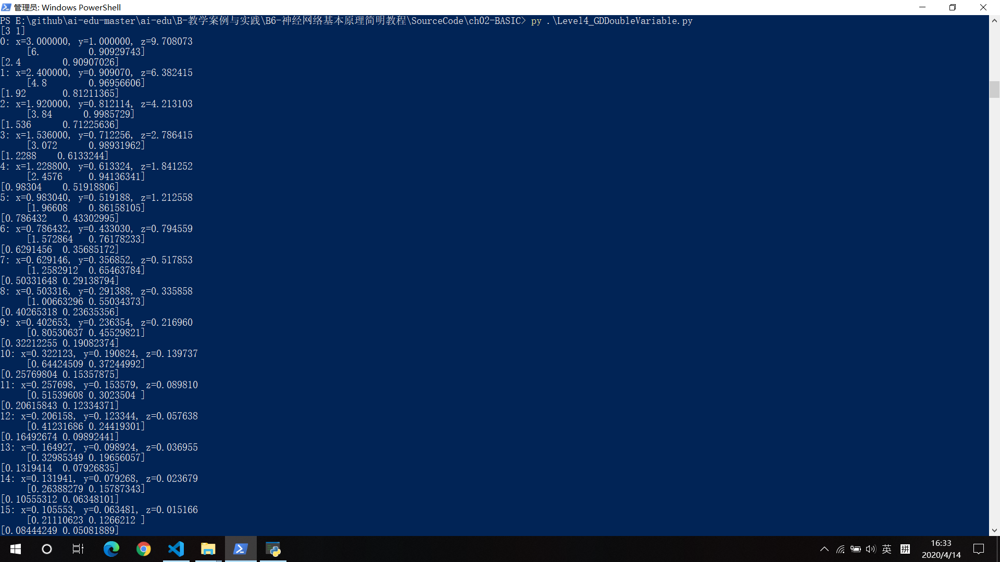
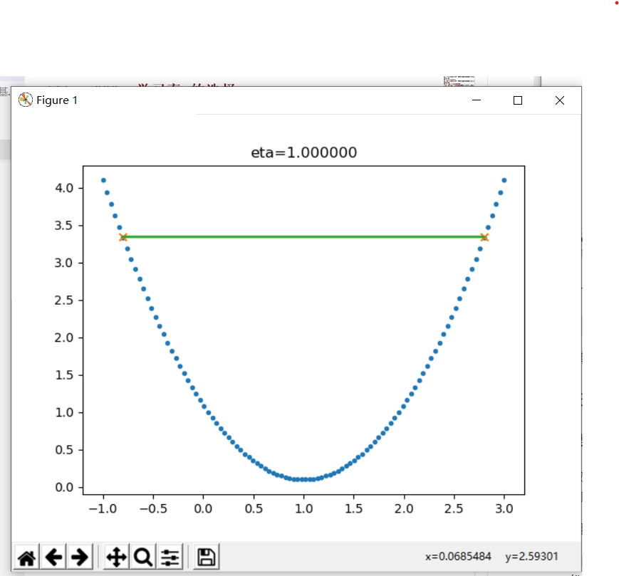
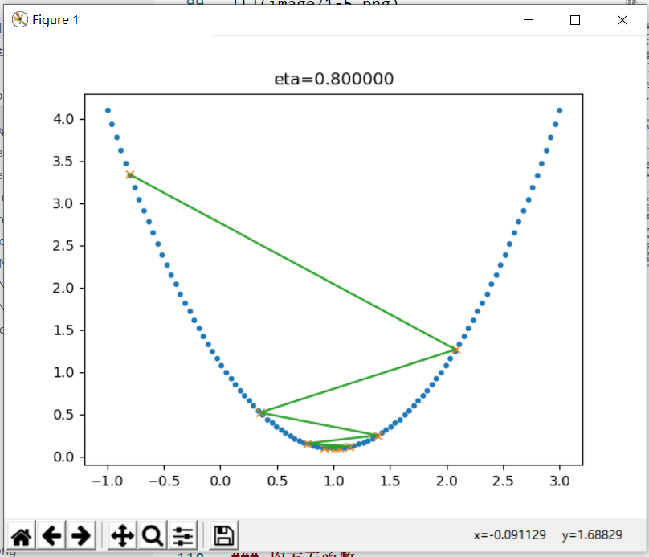
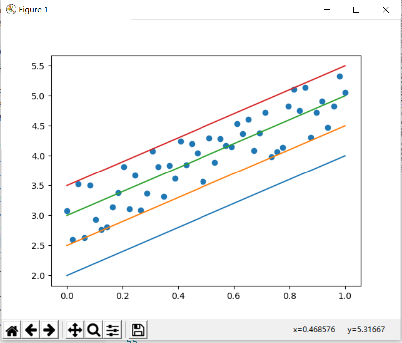
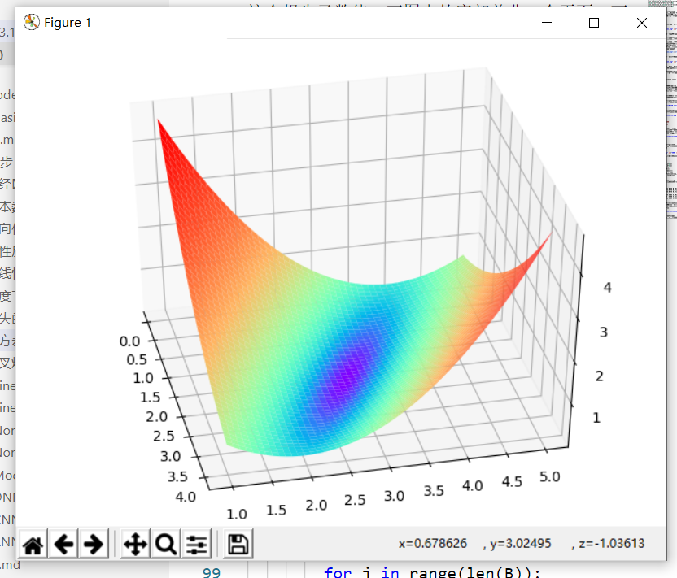
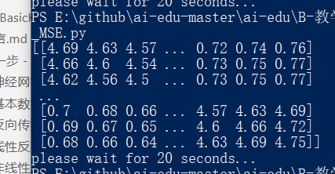

# 陈子良 Step1总结

## 1 重要概念
1. 输入 input
2. 权重 weights
3. 偏移 bias
4. 激活函数 activation
5. 前向传播
6. 反向传播
7. 损失函数
8. 梯度下降

## 2 训练过程

> 反向传播和损失函数很重要

## 3 激活函数的作用
激活函数的另一个重要特征是：它应该是可导的。我们需要这样的特性，以便在网络中向后推进以计算相对于权重的误差（损失）梯度时执行反向优化策略，然后相应地使用梯度下降或任何其他优化技术改变权重以减少误差。

## 4 卷积神经网络 CNN
对于图像类的机器学习问题，最有效的就是卷积神经网络。
## 5 循环神经网络
对于语言类的机器学习问题，最有效的就是循环神经网络。
## 6 反向传播与梯度下降
总结一下反向传播与梯度下降的基本工作原理：

1. 初始化
2. 正向计算
3. 损失函数为我们提供了计算损失的方法
4. 梯度下降是在损失函数基础上向着损失最小的点靠近而指引了网络权重调整的方向
5. 反向传播把损失值反向传给神经网络的每一层，让每一层都根据损失值反向调整权重
6. goto 2，直到精度足够好（比如损失函数值小于0.001）
### 梯度下降的数学理解
先抛开神经网络，损失函数，反向传播等内容，用数学概念理解一下梯度下降。

梯度下降的数学公式：

$$\theta_{n+1} = \theta_{n} - \eta \cdot \nabla J(\theta) $$

其中：
- $\theta_{n+1}$：下一个值
- $\theta_n$：当前值
- $-$：梯度的反向
- $\eta$：学习率或步长，控制每一步走的距离，不要太快以免错过了最佳景点，不要太慢以免时间太长
- $\nabla$：梯度，函数当前位置的最快上升点
- $J(\theta)$：函数

### 梯度迭代解
>>>>运行结果

该组合函数图像（蓝色）和导数图像（绿色）：

#### 梯度下降的三要素

1. 当前点
2. 方向
3. 步长

#### 为什么说是“梯度下降”？

“梯度下降”包含了两层含义：

1. 梯度：函数当前位置的最快上升点
2. 下降：与导数相反的方向，用数学语言描述就是那个减号

亦即与上升相反的方向运动，就是下降。

### 单变量函数的梯度下降
>>>>运行代码

迭代过程是：

上面的过程如下图所示：

### 双变量的梯度下降

根据公式(1)，假设终止条件为$J(x,y)<1e-2$，迭代过程：

||x|y|J(x,y)|
|---|---|---|---|
|1|3|1|9.708073|
|2|2.4|0.909070|6.382415|
|3|1.92|0.812114|4.213103|
|...|...|...|...|
|15|0.105553|0.063481|0.015166|
|16|0.084442|0.050819|0.009711|

迭代16次后，J(x,y)的值为0.009711，满足小于1e-2的条件，停止迭代。

上面的过程如下图所示，由于是双变量，所以需要用三维图来解释。请注意看那条隐隐的黑色线，表示梯度下降的过程，从红色的高地一直沿着坡度向下走，直到蓝色的洼地。
>>>>代码运行

###  学习率η的选择
>>>>代码运行

>学习率为1.1

>学习率为1

>学习率为0.8

>学习率为0.6

>学习率为0.2

## 7 损失函数
### 损失函数的作用

损失函数的作用，就是计算神经网络每次迭代的前向计算结果与真实值的差距，从而指导下一步的训练向正确的方向进行。

如何使用损失函数呢？具体步骤：

1. 用随机值初始化前向计算公式的参数
2. 代入样本，计算输出的预测值
3. 用损失函数计算预测值和标签值（真实值）的误差
4. 根据损失函数的导数，沿梯度最小方向将误差回传，修正前向计算公式中的各个权重值
5. goto 2, 直到损失函数值达到一个满意的值就停止迭代
   

   
##8 均方差损失函数

MSE - Mean Square Error。

该函数就是最直观的一个损失函数了，计算预测值和真实值之间的欧式距离。预测值和真实值越接近，两者的均方差就越小。

均方差函数常用于线性回归(linear regression)，即函数拟合(function fitting)。

>>>>代码运行结果

>下面四张图，前三张显示了一个逐渐找到最佳拟合直线的过程。

我们把四张图叠加在一起看一下，绿色的线是第三张图Loss值最小的情况。

>我们假设该拟合直线的方程是y=2x+3，当我们固定w=2，把b值从2到4变化时，看看Loss值的变化：

我们假设该拟合直线的方程是y=2x+3，当我们固定b=3，把w值从1到3变化时，看看Loss值的变化：

>横坐标为w，纵坐标为b，针对每一个w和一个b的组合计算出一个损失函数值，用三维图的高度来表示这个损失函数值。下图中的底部并非一个平面，而是一个有些下凹的曲面，只不过曲率较小，

>在平面地图中，我们经常会看到用等高线的方式来表示海拔高度值，下图就是上图在平面上的投影，即损失函数值的等高线图。

上述代码针对每个w和b的组合计算出了一个损失值，保留小数点后2位，放在LOSS矩阵中，如下所示：

然后遍历矩阵中的损失函数值，在具有相同值的位置上绘制相同颜色的点，比如，把所有值为0.72的点绘制成红色，把所有值为0.75的点绘制成蓝色......，这样就可以得到下图：

### 交叉熵损失函数

交叉熵（Cross Entropy）是Shannon信息论中一个重要概念，主要用于度量两个概率分布间的差异性信息。在信息论中，交叉熵是表示两个概率分布p,q的差异，其中p表示真实分布，q表示非真实分布，那么H(p,q)就称为交叉熵：

$$H(p,q)=\sum_i p_i \cdot log {1 \over q_i} = - \sum_i p_i \log q_i$$

交叉熵可在神经网络中作为损失函数，p表示真实标记的分布，q则为训练后的模型的预测标记分布，交叉熵损失函数可以衡量p与q的相似性。

**交叉熵函数常用于逻辑回归(logistic regression)，也就是分类(classification)。**