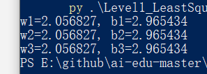
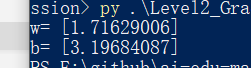
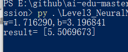
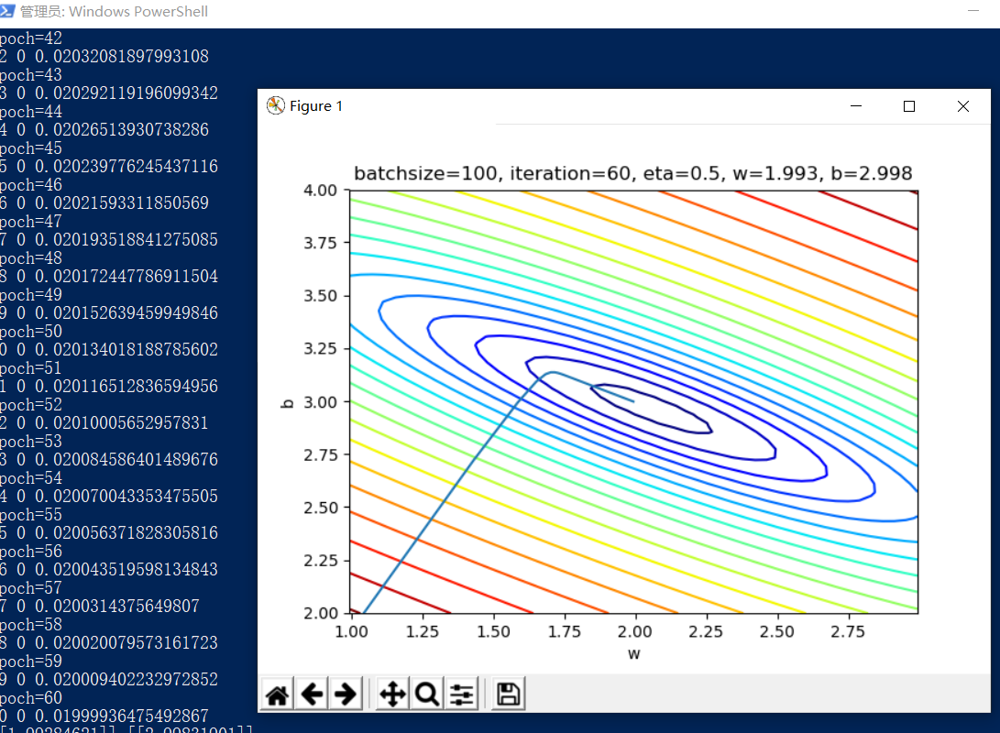
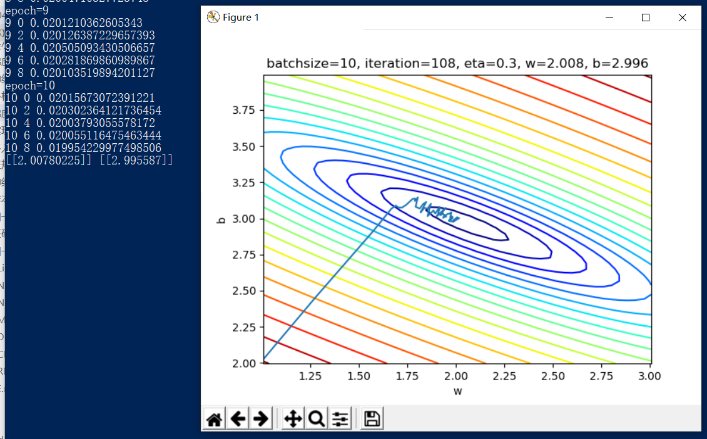
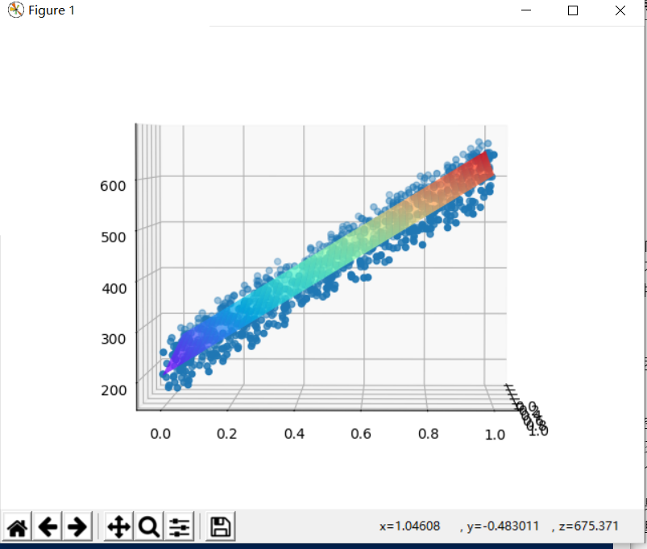
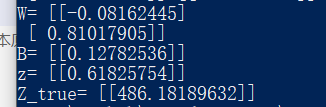

# 陈子良 Step2总结
#### 预设函数（Hypothesis Function）

为一个线性函数：

$$z_i = x_i \cdot w + b$$

#### 损失函数（Loss Function）

为均方差函数：

$$loss(w,b) = \frac{1}{2} (z_i-y_i)^2 $$
## 1 最小二乘法
如果想让Error的值最小，通过对w和b求导，再令导数为0（到达最小极值），就是w和b的最优解。
**最优解**
 $$
w={m\sum x_i y_i - \sum x_i \sum y_i \over m\sum x^2_i - (\sum x_i)^2} 
$$
$$
b=\frac{1}{m}\sum_{i=1}^m(y_i-wx_i)
$$

>>>>运行结果

## 2 梯度下降法
#### 计算w的梯度

我们用loss的值作为误差衡量标准，通过求w对它的影响，也就是loss对w的偏导数，来得到w的梯度。所以我们使用链式求导法则，通过单个样本来求导。

根据公式1和公式3：

$$
{\partial{loss} \over \partial{w}} = \frac{\partial{loss}}{\partial{z_i}}\frac{\partial{z_i}}{\partial{w}}=(z_i-y_i)x_i 
$$

#### 计算b的梯度

$$
\frac{\partial{loss}}{\partial{b}} = \frac{\partial{loss}}{\partial{z_i}}\frac{\partial{z_i}}{\partial{b}}=z_i-y_i
$$
### 代码实现

```Python
if __name__ == '__main__':

    reader = SimpleDataReader()
    reader.ReadData()
    X,Y = reader.GetWholeTrainSamples()

    eta = 0.1
    w, b = 0.0, 0.0
    for i in range(reader.num_train):
        # get x and y value for one sample
        xi = X[i]
        yi = Y[i]
        # 公式1
        zi = xi * w + b
        # 公式3
        dz = zi - yi
        # 公式4
        dw = dz * xi
        # 公式5
        db = dz
        # update w,b
        w = w - eta * dw
        b = b - eta * db

    print("w=", w)    
    print("b=", b)
```

>>>>运行结果


大家可以看到，在代码中，我们完全按照公式推导实现了代码，所以，大名鼎鼎的梯度下降，其实就是把推导的结果转化为数学公式和代码，直接放在迭代过程里！另外，我们并没有直接计算损失函数值，而只是把它融入在公式推导中。
## 3 神经网络法
**神经网络法和梯度下降的w,b一样**

神经网络法和梯度下降法在本质上是一样的，只不过神经网络法使用一个崭新的编程模型，即以神经元为中心的代码结构设计，这样便于以后的功能扩充。

在Python中可以使用面向对象的技术，通过创建一个类来描述神经网络的属性和行为，下面我们将会创建一个叫做NeuralNet的class，然后通过逐步向此类中添加方法，来实现神经网络的训练和推理过程。
#### 训练过程

只训练一轮的算法是：

***
for 循环，直到所有样本数据使用完毕：
1. 读取一个样本数据
2. 前向计算
3. 反向传播
4. 更新梯度
***
#### 定义类

```Python
class NeuralNet(object):
    def __init__(self, eta):
        self.eta = eta
        self.w = 0
        self.b = 0
```
NeuralNet类从object类派生，并具有初始化函数，其参数是eta，也就是学习率，需要调用者指定。另外两个成员变量是w和b，初始化为0。

#### 前向计算

```Python
    def __forward(self, x):
        z = x * self.w + self.b
        return z
```
这是一个私有方法，所以前面有两个下划线，只在NeuralNet类中被调用，不对外公开。

#### 反向传播

下面的代码是通过梯度下降法中的公式推导而得的，也设计成私有方法：

```Python
    def __backward(self, x,y,z):
        dz = z - y
        db = dz
        dw = x * dz
        return dw, db
```
dz是中间变量，避免重复计算。dz又可以写成delta_Z，是当前层神经网络的反向误差输入。

#### 梯度更新

```Python
    def __update(self, dw, db):
        self.w = self.w - self.eta * dw
        self.b = self.b - self.eta * db
```

每次更新好新的w和b的值以后，直接存储在成员变量中，方便下次迭代时直接使用，不需要在全局范围当作参数内传来传去的。

#### 主程序

```Python
if __name__ == '__main__':
    # read data
    sdr = SimpleDataReader()
    sdr.ReadData()
    # create net
    eta = 0.1
    net = NeuralNet(eta)
    net.train(sdr)
    # result
    print("w=%f,b=%f" %(net.w, net.b))
    # predication
    result = net.inference(0.346)
    print("result=", result)
    ShowResult(net, sdr)
```
>>>>运行结果


最后把这些点连起来，就可以画出下图中的拟合直线：


可以看到红色直线虽然穿过了蓝色点阵，但是好像不是处于正中央的位置，应该再逆时针旋转几度才会达到最佳的位置。我们后面小节中会讲到如何提高训练结果的精度问题。

## 4 多样本计算

### 前向计算
前向计算python代码可以写成：

```Python
    def __forwardBatch(self, batch_x):
        Z = np.dot(batch_x, self.w) + self.b
        return Z
```
Python中的矩阵乘法命名有些问题，np.dot()并不是矩阵点乘，而是矩阵叉乘，请读者习惯。
### 损失函数

用代码实现：

```Python
    def __checkLoss(self, dataReader):
        X,Y = dataReader.GetWholeTrainSamples()
        m = X.shape[0]
        Z = self.__forwardBatch(X)
        LOSS = (Z - Y)**2
        loss = LOSS.sum()/m/2
        return loss
```
Python中的矩阵减法运算，不需要对矩阵中的每个对应的元素单独做减法，而是整个矩阵相减即可。做求和运算时，也不需要自己写代码做遍历每个元素，而是简单地调用求和函数即可。

### 求w的梯度
我们用 J 的值作为基准，去求 w 对它的影响，也就是 J 对 w 的偏导数，就可以得到w的梯度了。

### 求b的梯度
python中，可以直接用公式7求矩阵的和，免去了一个个计算$z_i-y_i$最后再求和的麻烦，速度还快。

```Python
    def __backwardBatch(self, batch_x, batch_y, batch_z):
        m = batch_x.shape[0]
        dZ = batch_z - batch_y
        dW = np.dot(batch_x.T, dZ)/m
        dB = dZ.sum(axis=0, keepdims=True)/m
        return dW, dB
```
## 梯度下降的三种形式
>>>>代码运行





**从结果看，都接近于w=2 b=3的原始解。最后的可视化结果图如下，可以看到直线已经处于样本点比较中间的位置：**


## 实现逻辑非门

### 原理

单层神经网络，又叫做感知机，它可以轻松实现逻辑与、或、非门。由于逻辑与、或门，需要有两个变量输入，目前我们只学习了单变量输入，所以，我们可以先实现非门。

很多阅读材料上会这样介绍：有公式
$z=wx+b$，令$w=-1,b=1$，则：

- 当x=0时，$z = -1 \times 0 + 1 = 1$
- 当x=1时，$z = -1 \times 1 + 1 = 0$
  
>如图


## 正规方程解法

英文名是 Normal Equations。

对于线性回归问题，除了前面提到的最小二乘法可以解决一元线性回归的问题外，也可以解决多元线性回归问题。

对于多元线性回归，可以用正规方程来解决，也就是得到一个数学上的解析解。它可以解决下面这个公式描述的问题：

$$y=a_0+a_1x_1+a_2x_2+\dots+a_kx_k \tag{1}$$

>>>>运行结果


## 神经网络解法

与单特征值的线性回归问题类似，多变量（多特征值）的线性回归可以被看做是一种高维空间的线性拟合。以具有两个特征的情况为例，这种线性拟合不再是用直线去拟合点，而是用平面去拟合点。

## 样本特征数据归一化

### 发现问题的根源

仔细分析一下屏幕打印信息，前两次迭代的损失值已经是天文数字了，后面的W和B的值也在不断变大，说明网络发散了。难度我们遇到了传说中的梯度爆炸！数值太大，导致计算溢出了。第一次遇到这个情况，但相信不会是最后一次，因为这种情况在神经网络中太常见了。

### 样本特征数据归一化
>>>>运行结果



从正向图可以看到，真的形成了一个平面；从侧向图可以看到，这个平面也确实穿过了那些点，并且把它们分成了上下两个部分。只不过由于训练精度的问题，没有做到平分，而是斜着穿过了点的区域。

## 归一化的后遗症
>>>>代码运行结果


## 正确的推理预测方法

### 预测数据的归一化

我们在针对训练数据做归一化时，得到的最重要的数据是训练数据的最小值和最大值，我们只需要把这两个值记录下来，在预测时使用它们对预测数据做归一化，这就相当于把预测数据“混入”训练数据。前提是预测数据的特征值不能超出训练数据的特征值范围，否则有可能影响准确程度。
>>>>运行结果


## 对标签值归一化
>>>>运行结果

