# 陈子良 Step3总结
## 二分类函数

对率函数Logistic Function，即可以做为激活函数使用，又可以当作二分类函数使用。根据不同的任务区分激活函数和分类函数这两个概念，**在二分类任务中，叫做Logistic函数，而在作为激活函数时，叫做Sigmoid函数。**

推理时，我们预先设定一个阈值比如0.5，则当推理结果大于0.5时，认为是正类；小于0.5时认为是负类；等于0.5时，根据情况自己定义。阈值也不一定就是0.5，也可以是0.65等等，阈值越大，准确率越高，召回率越低；阈值越小则相反，准确度越低，召回率越高。

比如：
- input=2时，output=0.88，而0.88>0.5，算作正例
- input=-1时，output=0.27，而0.27<0.5，算作负例
  
### 正向传播
二分类交叉熵损失函数：
$$
loss(w,b) = -[y \ln a+(1-y)\ln(1-a)] \tag{3}
$$

### 反向传播
使用链式法则链接公式：
$$
\frac{\partial loss}{\partial z}=\frac{\partial loss}{\partial a}\frac{\partial a}{\partial z}
$$
$$
=\frac{a-y}{a(1-a)} \cdot a(1-a)=a-y \tag{6}
$$

我们惊奇地发现，使用交叉熵函数求导得到的分母，与Logistic分类函数求导后的结果，正好可以抵消，最后只剩下了$a-y$这一项。满足以下条件：
1. 损失函数满足二分类的要求，无论是正例还是反例，都是单调的；
2. 损失函数可导，以便于使用反向传播算法；
3. 让计算过程非常简单，一个减法就可以搞定。

## 线性二分类的神经网络实现
>>>>代码运行结果

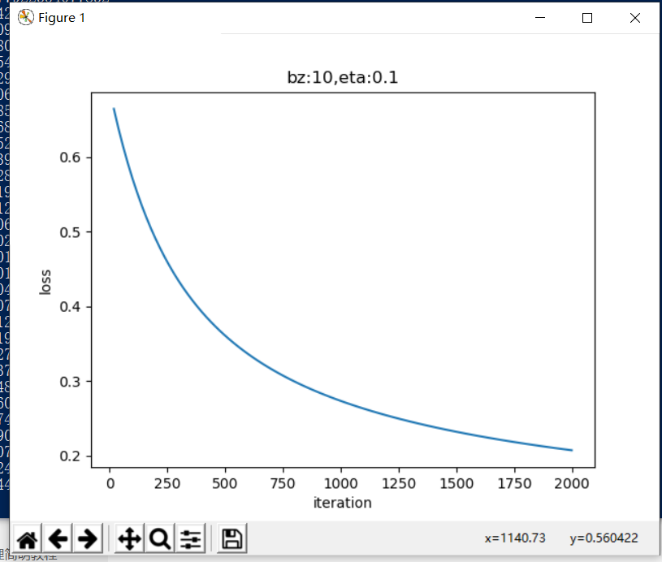
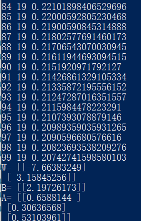

## 线性二分类原理
||线性回归|线性分类|
|---|---|---|
|相同点|需要在样本群中找到一条直线|需要在样本群中找到一条直线|
|不同点|用直线来拟合所有样本，使得各个样本到这条直线的距离尽可能最短|用直线来分割所有样本，使得正例样本和负例样本尽可能分布在直线两侧|

可以看到线性回归中的目标--“距离最短”，还是很容易理解的，但是线性分类的目标--“分布在两侧”，用数学方式如何描述呢？我们可以有代数和几何两种方式来描述：

- 代数方式：通过一个分类函数计算所有样本点在经过线性变换后的概率值，使得正例样本的概率大于0.5，而负例样本的概率小于0.5
- 几何方式：下图中，让所有正例样本处于直线的上方，所有负例样本处于直线的下方

## 二分类结果可视化
>>>>运行结果

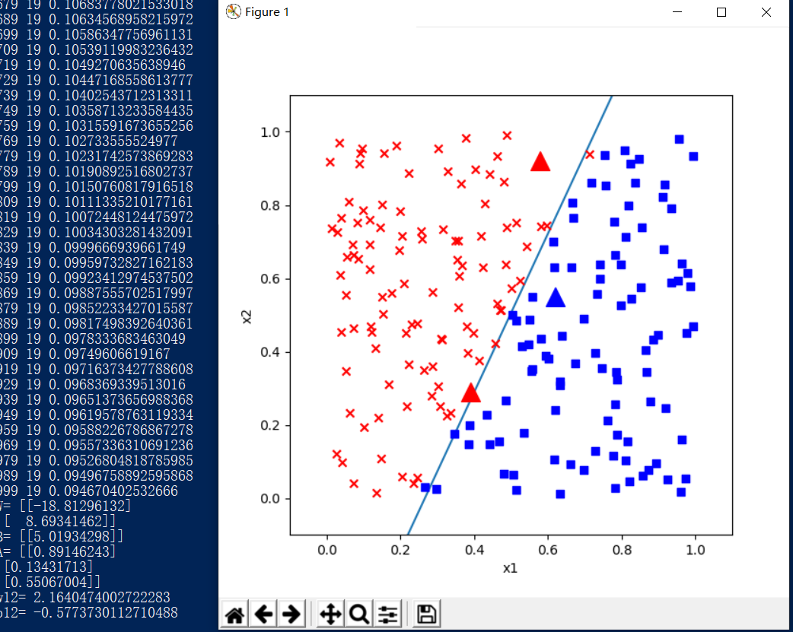
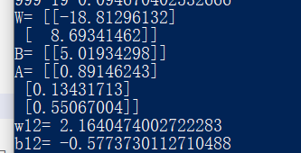

## 实现逻辑与门和或门
**蓝色圆点表示负例，红色三角表示正例：**
>>>> 运行结果

>非门

>与门
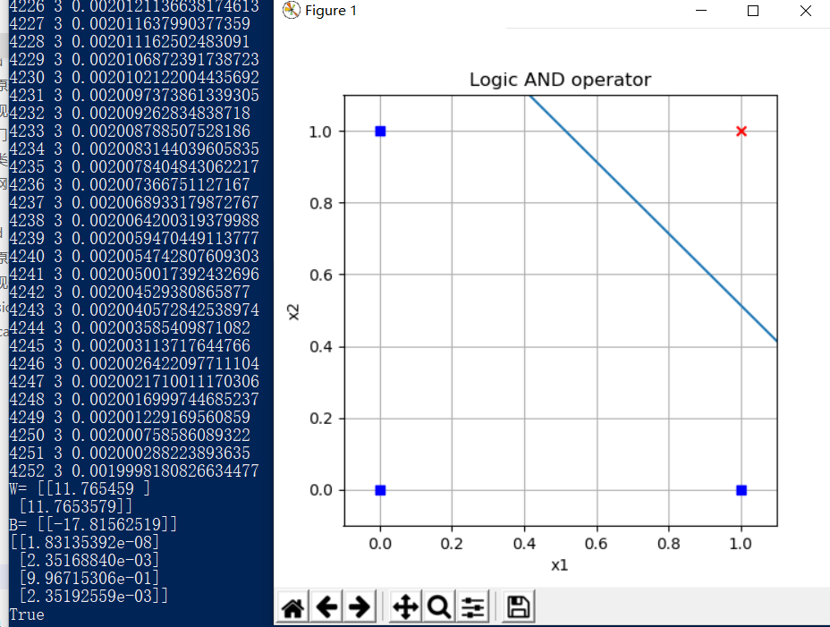

>与非门
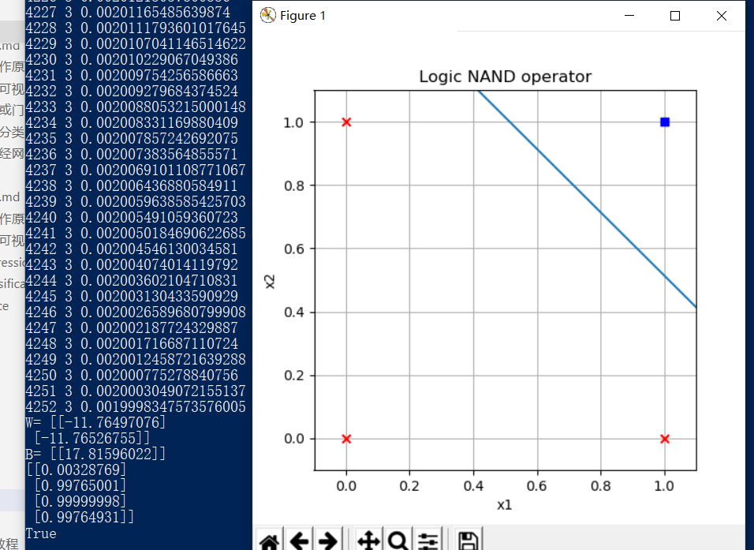

>或门
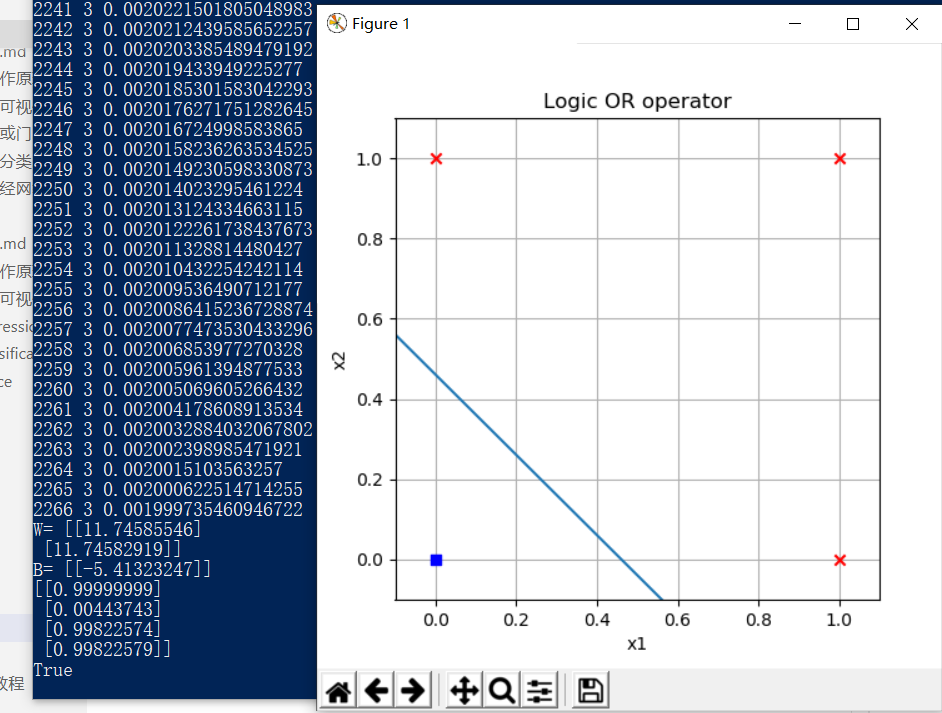

>或非门
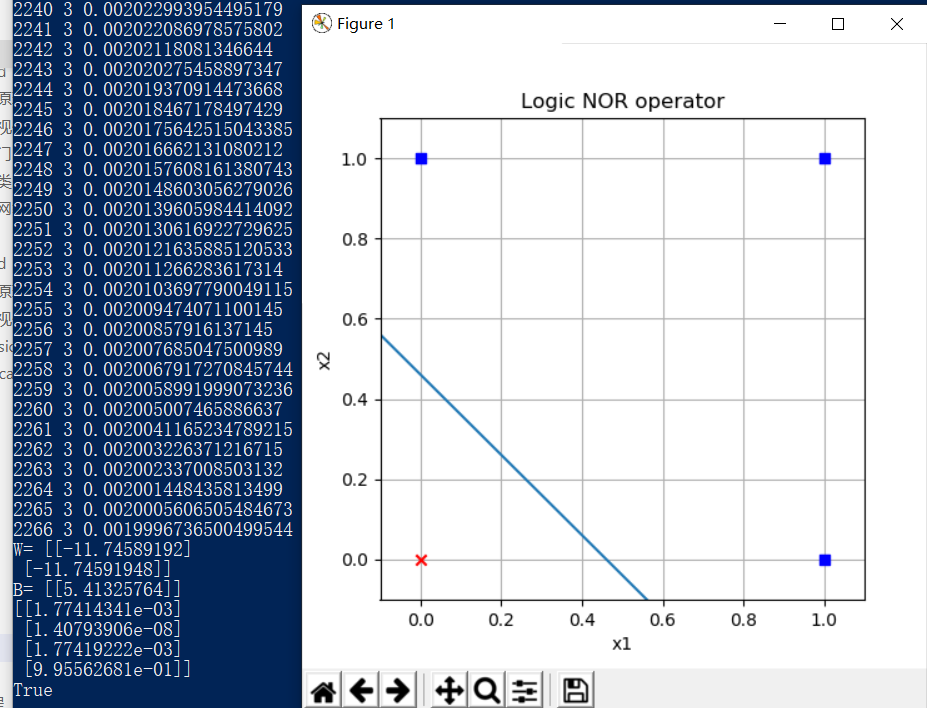

## 用双曲线正切函数分类
>>>>运行结果

## 线性多分类的神经网络实现

>>>>运行结果

如果有三个以上的分类同时存在，我们需要对每一类别分配一个神经元，这个神经元的作用是根据前端输入的各种数据，先做线性处理（Y=WX+B)，然后做一次非线性处理，计算每个样本在每个类别中的预测概率，再和标签中的类别比较，看看预测是否准确，如果准确，则奖励这个预测，给与正反馈；如果不准确，则惩罚这个预测，给与负反馈。两类反馈都反向传播到神经网络系统中去调整参数。
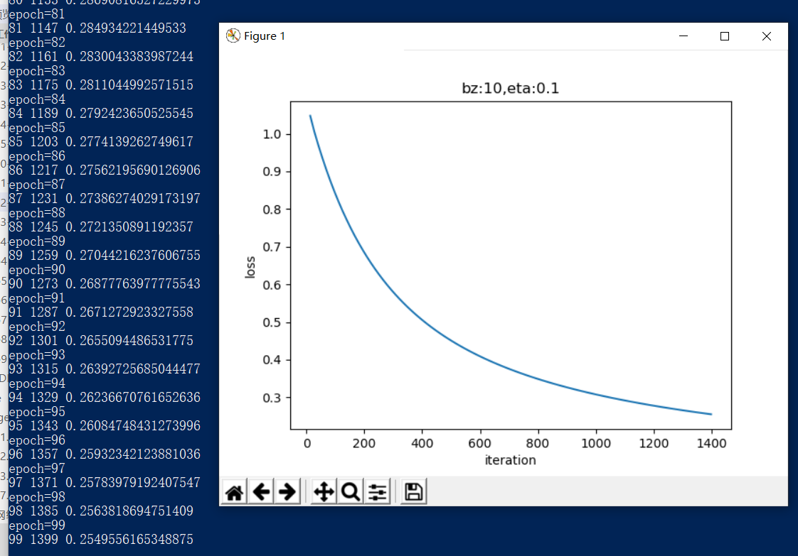
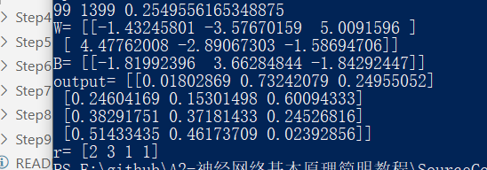
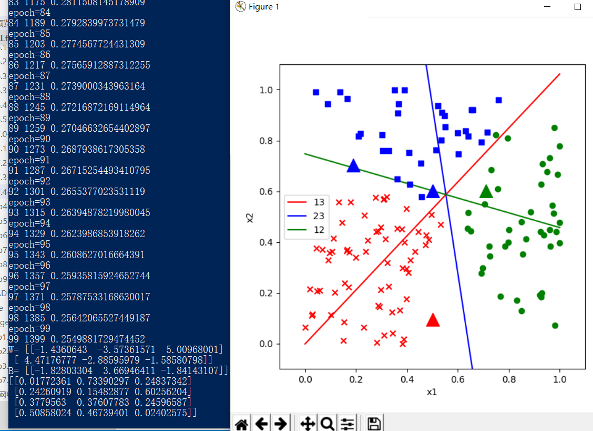