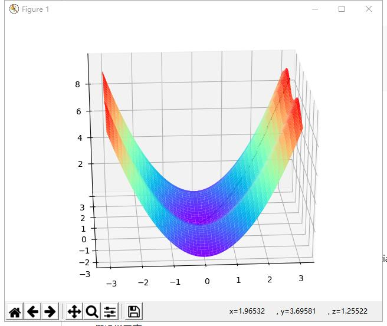
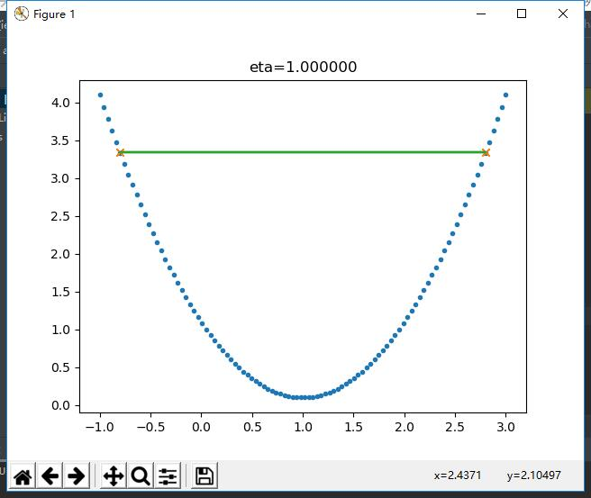
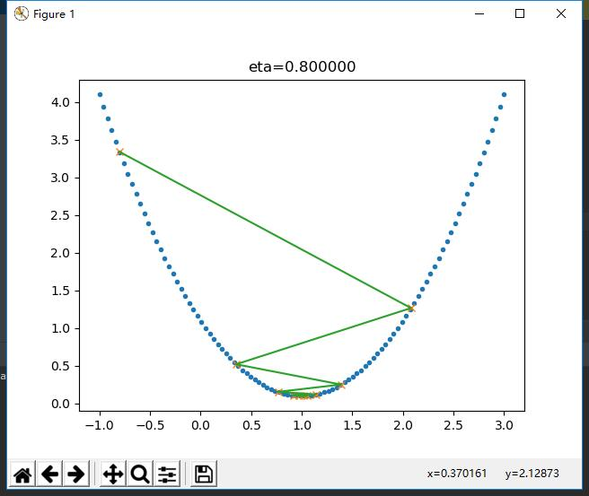
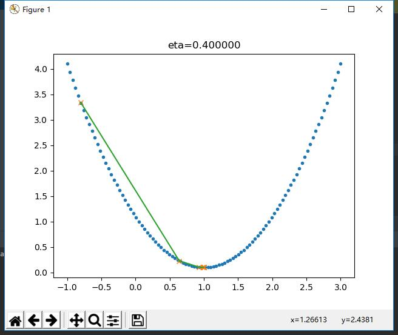
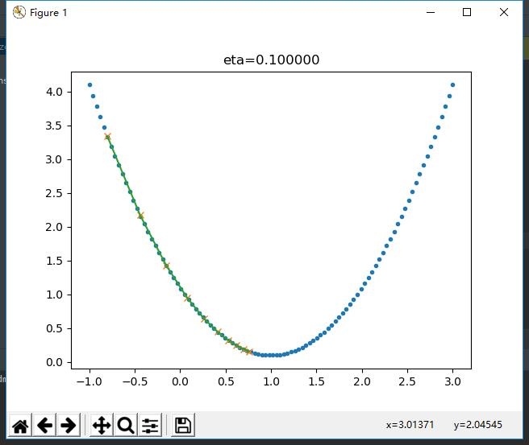
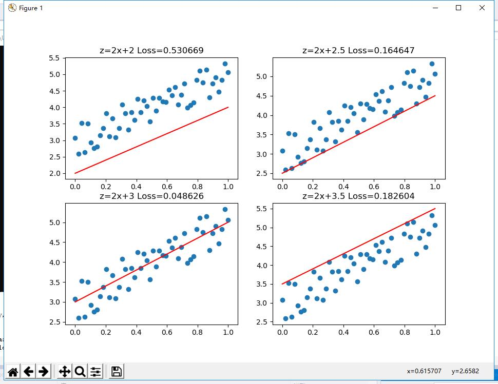
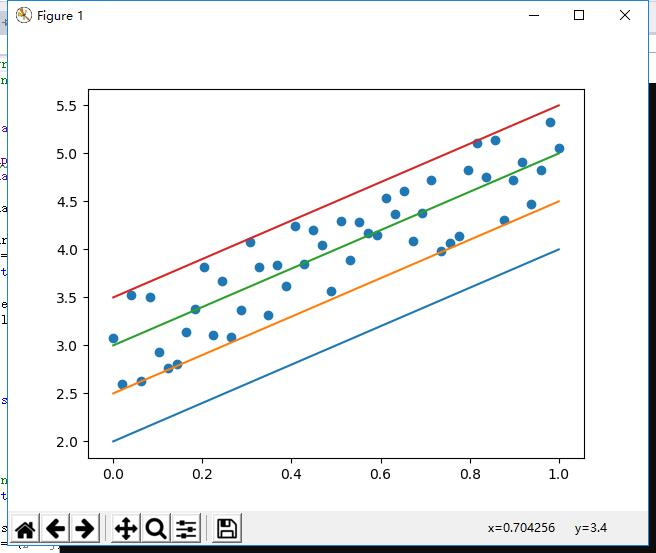
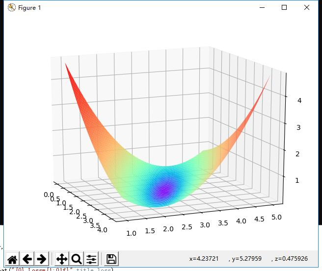
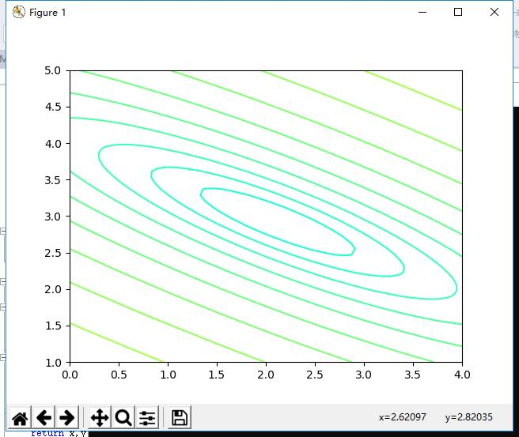

## 第二天学习


### 梯度下降

梯度下降的三要素

    1. 当前点
    2. 方向
    3. 步长
梯度下降的数学公式：

$$\theta_{n+1} = \theta_{n} - \eta \cdot \nabla J(\theta) \tag{1}$$

其中：
- $\theta_{n+1}$：下一个值
- $\theta_n$：当前值
- $-$：梯度的反向
- $\eta$：学习率或步长，控制每一步走的距离，不要太快以免错过了最佳景点，不要太慢以免时间太长
- $\nabla$：梯度，函数当前位置的最快上升点
- $J(\theta)$：函数

 ### 单变量函数的梯度下降
 $\eta$=0.2


 ### 双变量的梯度下降

  $\eta$=0.2

### 不同的$\eta$
eta = [1.1,1.,0.8,0.6,0.4,0.2,0.1]
 
 
 
 
 
 
 
##  损失函数
###  概念

在各种材料中经常看到的中英文词汇有：误差，偏差，Error，Cost，Loss，损失，代价......意思都差不多，在本系列文章中，使用损失函数和Loss Function这两个词汇，具体的损失函数符号用J()来表示，误差值用loss表示。

**损失**就是所有样本的**误差**的总和，亦即：
$$损失 = \sum^m_{i=1}误差_i$$
$$J = \sum_{i=1}^m loss$$
### 损失函数的作用

损失函数的作用，就是计算神经网络每次迭代的前向计算结果与真实值的差距，从而指导下一步的训练向正确的方向进行。

如何使用损失函数呢？具体步骤：

1. 用随机值初始化前向计算公式的参数
2. 代入样本，计算输出的预测值
3. 用损失函数计算预测值和标签值（真实值）的误差
4. 根据损失函数的导数，沿梯度最小方向将误差回传，修正前向计算公式中的各个权重值
5. goto 2, 直到损失函数值达到一个满意的值就停止迭代

 #### 神经网络中常用的损失函数

    均方差函数，主要用于回归

    交叉熵函数，主要用于分类

二者都是非负函数，极值在底部，用梯度下降法可以求解。


### 均方差函数

###  实际案例

假设有一组数据如下，我们想找到一条拟合的直线：

 

下面四张图，前三张显示了一个逐渐找到最佳拟合直线的过程。
- 第一张，用均方差函数计算得到Loss=0.53
- 第二张，直线向上平移一些，误差计算Loss=0.16，比图一的误差小很多
- 第三张，又向上平移了一些，误差计算Loss=0.048，此后还可以继续尝试平移（改变b值）或者变换角度（改变w值），得到更小的Loss值
- 第四张，偏离了最佳位置，误差值Loss=0.18，这种情况，算法会让尝试方向反向向下
 

我们把四张图叠加在一起看一下，绿色的线是第三张图Loss值最小的情况。

 

在实际的训练过程中，是没有必要计算Loss值的，因为Loss值会体现在反向传播的过程中。我们来看看均方差函数的导数：

$$
\frac{\partial{J}}{\partial{a_i}} = a_i-y_i
$$

虽然$(a_i-y_i)^2$永远是正数，但是$a_i-y_i$却可以是正数（直线在点下方时）或者负数（直线在点上方时），这个正数或者负数被反向传播回到前面的计算过程中，就会引导训练过程朝正确的方向尝试。

在上面的例子中，我们有两个变量，一个w，一个b，这两个值的变化都会影响最终的Loss值的。

我们假设该拟合直线的方程是y=2x+3，当我们固定w=2，把b值从2到4变化时，看看Loss值的变化：

 

我们假设该拟合直线的方程是y=2x+3，当我们固定b=3，把w值从1到3变化时，看看Loss值的变化：

 


###  损失函数的可视化

#### 损失函数值的3D示意图

横坐标为w，纵坐标为b，针对每一个w和一个b的组合计算出一个损失函数值，用三维图的高度来表示这个损失函数值。下图中的底部并非一个平面，而是一个有些下凹的曲面，只不过曲率较小，

 

#### 损失函数值的2D示意图

在平面地图中，我们经常会看到用等高线的方式来表示海拔高度值，下图就是上图在平面上的投影，即损失函数值的等高线图。

 

如果还不能理解的话，我们用最笨的方法来画一张图，代码如下：

```Python
    s = 200
    W = np.linspace(w-2,w+2,s)
    B = np.linspace(b-2,b+2,s)
    LOSS = np.zeros((s,s))
    for i in range(len(W)):
        for j in range(len(B)):
            z = W[i] * x + B[j]
            loss = CostFunction(x,y,z,m)
            LOSS[i,j] = round(loss, 2)
```

上述代码针对每个w和b的组合计算出了一个损失值，保留小数点后2位，放在LOSS矩阵中，如下所示：
 
```
[[4.69 4.63 4.57 ... 0.72 0.74 0.76]
 [4.66 4.6  4.54 ... 0.73 0.75 0.77]
 [4.62 4.56 4.5  ... 0.73 0.75 0.77]
 ...
 [0.7  0.68 0.66 ... 4.57 4.63 4.69]
 [0.69 0.67 0.65 ... 4.6  4.66 4.72]
 [0.68 0.66 0.64 ... 4.63 4.69 4.75]]
```

然后遍历矩阵中的损失函数值，在具有相同值的位置上绘制相同颜色的点，比如，把所有值为0.72的点绘制成红色，把所有值为0.75的点绘制成蓝色......，这样就可以得到下图：

 

此图和等高线图的表达方式等价，但由于等高线图比较简明清晰，所以以后我们都使用等高线图来说明问题。

## 总结
通过github上给的代码，通过一下午的学习和pycharm的环境的配置让我对这门课程和pyhon语法的学习有了更多的了解，对神经网络的基本原理有了更多的认识，就是有点复杂，需要耗费很多的时间。