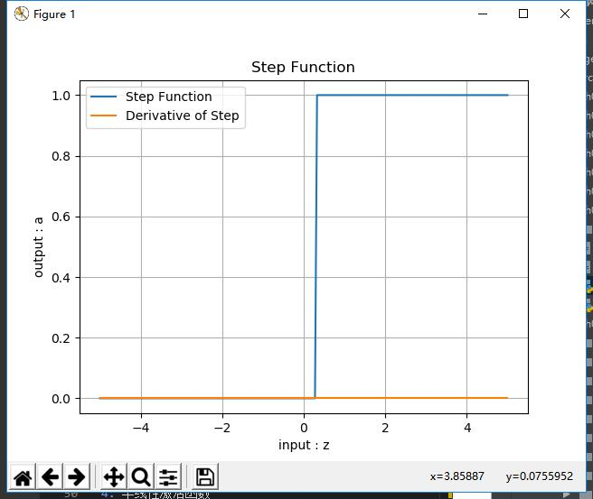
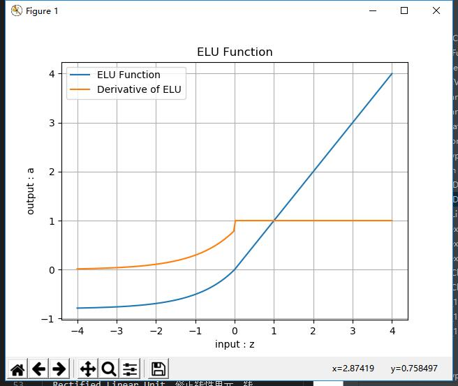
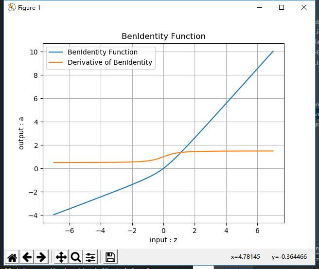

## 第五天学习

虽然标题是第五天学习，但是今天主要是把前面没有弄完的，又重新弄了一遍，对中国大学mooc的视频也看了，课后的作业也都完成了，虽然开始很不理解，但是随着学习的深入对这门课有了更深刻的认识。由于今天没有新的内容，前面的也没完成好，就没有对后面选学的内容进行更多的理解，在周末有时间再来好好学习。

## 激活函数 
 激活函数的基本性质：
  非线性：线性的激活函数和 没有激活函数一样
  可导性：做误差反向传播和梯度下降，必须要保证激活函数的可导性
  单调性：单一的输入会得到单一的输出，较大值的输入得到较大值的输出
何时会用到激活函数：
 神经网络最后一层不需要激活函数
激活函数只用于连接前后两层神经网络
运行代码结果如下：

半线性激活函数
又可以叫非饱和型激活函数
ReLU函数
  Rectified Linear Unit，修正线性单元，线性整流函数，斜坡函数。
公式
$$a(z) = max(0,z) = \begin{Bmatrix} z & (z \geq 0) \ 0 & (z < 0) \end{Bmatrix}$$
导数
$$a'(z) = \begin{cases} 1 & z \geq 0 \ 0 & z < 0 \end{cases}$$
值域
输入值域：$[-\infty, \infty]$
输出值域：$[0,\infty]$
导数值域：$[0,1]$
优点
反向导数恒等于1，更加有效率的反向传播梯度值，收敛速度快
避免梯度消失问题
计算简单，速度快
活跃度的分散性使得神经网络的整体计算成本下降
缺点
无界。
梯度很大的时候可能导致的神经元“死”掉。而这个死掉的原因是什么呢？是因为很大的梯度导致更新之后的网络传递过来的输入是小于零的，从而导致relu的输出是0，计算所得的梯度是零，然后对应的神经元不更新，从而使relu输出恒为零，对应的神经元恒定不更新，等于这个relu失去了作为一个激活函数的梦想。问题的关键点就在于输入小于零时，relu回传的梯度是零，从而导致了后面的不更新。在学习率设置不恰当的情况下，很有可能网络中大部分神经元“死”掉，也就是说不起作用了.
Leaky ReLU函数
PReLU，带泄露的线性整流函数。
 公式
$$a(z) = \begin{cases} z & z \geq 0 \ \alpha * z & z < 0 \end{cases}$$
导数
$$a'(z) = \begin{cases} z & 1 \geq 0 \ \alpha & z < 0 \end{cases}$$
值域
输入值域：$[-\infty, \infty]$
输出值域：$[-\infty,\infty]$
导数值域：$[0,1]$
优点
继承了ReLU函数的优点。
相比较于relu函数，leaky relu同样有收敛快速和运算复杂度低的优点，而且由于给了$x<0$时一个比较小的梯度$\alpha$,使得$x<0$时依旧可以进行梯度传递和更新，可以在一定程度上避免神经元“死”掉的问题。

代码运行结果

学习进度：

# 请举例分析BP神经网络的应用，思路尽量具体
### 一句话总结BP神经网络
BP神经网络就是反向传播神经网络
### BP神经网络是什么？
BP网络（Back-ProPagation Network）又称反向传播神经网络， 通过样本数据的训练，不断修正网络权值和阈值使误差函数沿负梯度方向下降，逼近期望输出。它是一种应用较为广泛的神经网络模型，多用于函数逼近、模型识别分类、数据压缩和时间序列预测等。

#### 比如下面的这个例子：

甲乙两个人玩儿猜数的游戏，数字的范围是[1,50]：

甲：我猜5

乙：太小了

甲：50

乙：有点儿大

甲：30

乙：小了

......

甲：我不玩儿了！

在这个游戏里：

目的：猜到乙心中的数字

初始化：甲猜5

前向计算：甲每次猜的新数字

损失函数：乙在根据甲猜的数来和自己心中想的数做比较

反向传播：乙告诉甲“太小了”、“有点儿大”

梯度下降：甲根据乙的反馈中的含义自行调整下一轮的猜测值

在这个游戏里的损失函数就是“太小了”，“有点儿大”......感觉很不靠谱！因为这个所谓的损失函数给了两个信息：

1.方向：大了或小了

2.程度：“太”，“有点儿”，但是很模糊

# 举例说明深度学习的应用

## 语音识别

比如Siri——苹果的智能语音助手。和其他大厂一样，苹果也开始进军深度学习。

在语音识别和智能语音助手领域，我们可以利用深度神经网络开发出更准确的声学模型。简而言之，可以建立这样一个系统，学习新特征，或者根据你自己的需求进行调整，从而通过事先预测所有可能性来提供更好的帮助。

## 自动机器翻译

好比谷歌支持100种语言的即时翻译，速度之快宛如魔法。谷歌翻译的背后，就是机器学习。在过去的两年时间里，谷歌已经完全将深度学习嵌入进了谷歌翻译中。事实上，这些对语言翻译知之甚少的深度学习研究人员正提出相对简单的机器学习解决方案，来打败世界上最好的专家语言翻译系统。文本翻译可以在没有序列预处理的情况下进行，它允许算法学习文字与指向语言之间的关系。谷歌翻译利用的是大型递归神经网络的堆叠网络。

## 拍照翻译

深度学习可以用来识别照片中的文字。一旦识别了，文字就会被转成文本，并且被翻译，然后图片就会根据翻译的文本重新创建。

## 自动驾驶汽车

谷歌利用深度学习算法使自动驾驶汽车领域达到了一个全新的水平。因此，谷歌现在不再使用老的手动编码算法，而是编写程序系统，使其可以通过不同传感器提供的数据来自行学习。对于大多数感知型任务和多数低端控制型任务，深度学习现在是最好的方法。因此，即使是不会开车的人，或是残疾人，都可以在不依赖于其他人的情况下自己出门。