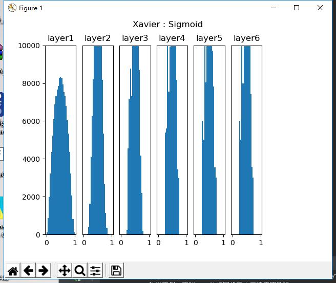
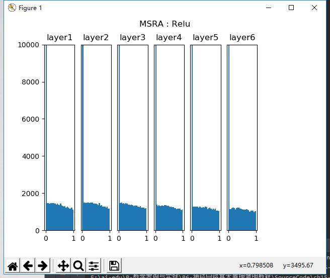
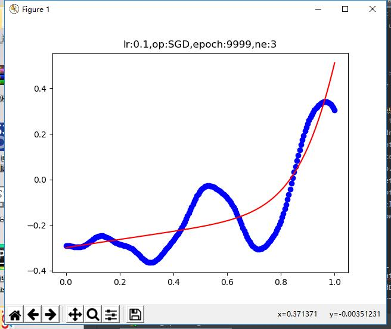
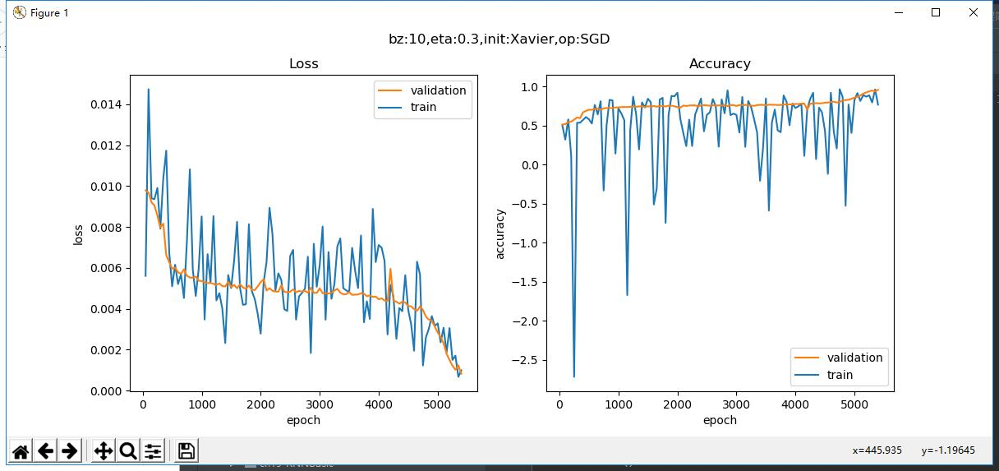
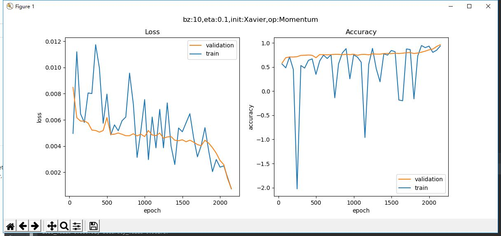
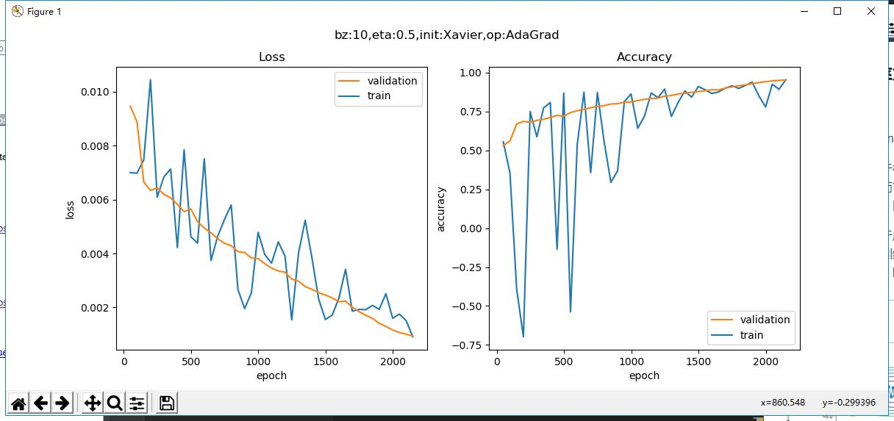
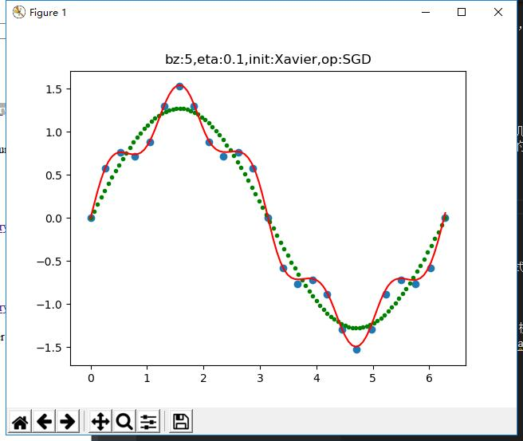

##  第七天学习

###   网络优化

随着网络的加深，训练变得越来越困难，时间越来越长，原因可能是：
- 参数多
- 数据量大
- 梯度消失
- 损失函数坡度平缓

为了解决上面这些问题，科学家们在深入研究网络表现的前提下，发现在下面这些方向上经过一些努力，可以给深度网络的训练带来或多或少的改善：
- 权重矩阵初始化
- 批量归一化
- 梯度下降优化算法
- 自适应学习率算法

### 权重矩阵初始化
|ID|网络深度|初始化方法|激活函数|说明|
|---|---|---|---|---|
|1|单层|Zero|无|可以|
|2|双层层|Zero|Sigmoid|错误，不能进行正确的反向传播|
|3|双层|Normal|Sigmoid|可以|
|4|多层|Normal|Sigmoid|激活值分布成凹形，不利于反向传播|
|5|多层|Xavier|Sigmoid|正确|
|6|多层|Xavier|Relu|激活值分布偏向0，不利于反向传播|
|7|多层|MSRA|Relu|正确|

从上表可以看到，由于网络深度和激活函数的变化，使得人们不断地研究新的初始化方法来适应，最终得到1、3、5、7这几种组合。

运行结果：

### 梯度下降优化算法
  
  随机梯度下降 SGD
  运行结果：
学习率为0.1

学习率为0.3

动量算法 Momentum

动量算法 Momentum
运行结果：

梯度加速算法 NAG
运行结果：

### 自适应学习率算法

####  AdaGrad

Adaptive subgradient method.

AdaGrad是一个基于梯度的优化算法，它的主要功能是：它对不同的参数调整学习率，具体而言，对低频出现的参数进行大的更新，对高频出现的参数进行小的更新。因此，他很适合于处理稀疏数据。

在这之前，我们对于所有的参数使用相同的学习率进行更新。但 Adagrad 则不然，对不同的训练迭代次数t，AdaGrad 对每个参数都有一个不同的学习率。这里开方、除法和乘法的运算都是按元素运算的。
运行结果：

### 算法效果比较

运行结果：

### 正则化
用于防止过拟合
运行结果：

## 总结
今天主要学习了很多理论的知识，内容也很多，很多知识不是很好理解，主要把给的代码都运行了一遍，有些算法还没有细品，很多东西没有搞懂，还需要长期的学习。