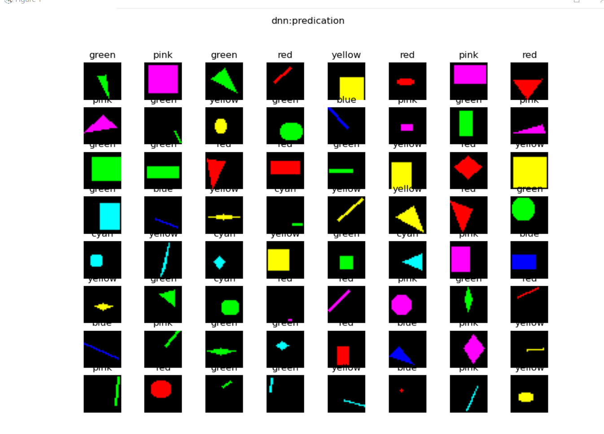
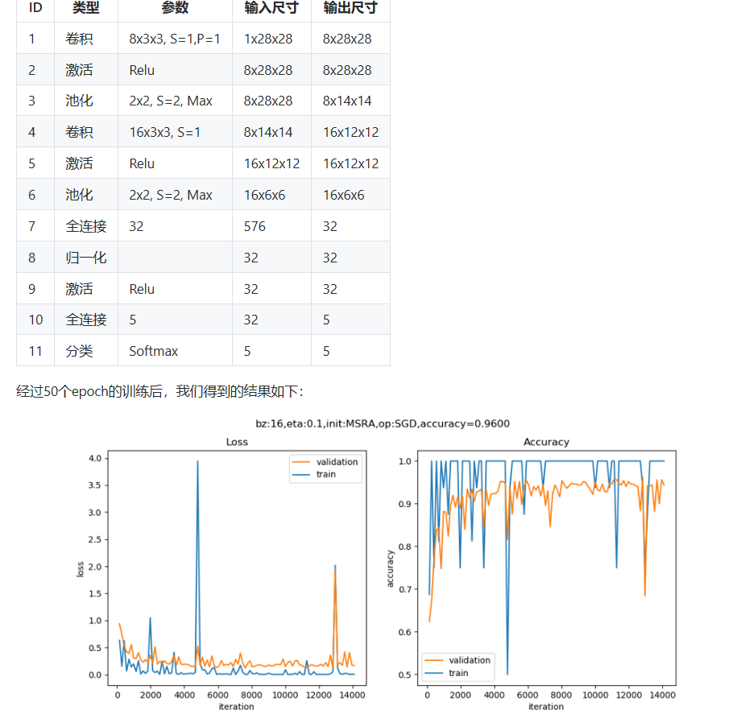

# 第九天学习
## 经典cnn模型
卷积神经网络是现在深度学习领域中最有用的网络类型，尤其在计算机视觉领域更是一枝独秀。CNN从90年代的LeNet开始，沉寂了10年，也孵化了10年，直到2012年AlexNet开始再次崛起，后续的ZF Net、VGG、GoogLeNet、ResNet、DenseNet，网络越来越深，架构越来越复杂，解决反向传播时梯度消失的方法也越来越巧妙。下面让我们一起学习一下这些经典的网络模型。

### LeNet (1998)

LeNet是卷积神经网络的开创者LeCun在1998年提出，用于解决手写数字识别的视觉任务。自那时起，CNN的最基本的架构就定下来了：卷积层、池化层、全连接层。

1. 输入为单通道32x32灰度图
2. 使用6组5x5的过滤器，每个过滤器里有一个卷积核，stride=1，得到6张28x28的特征图
3. 使用2x2的池化，stride=2，得到6张14x14的特征图
4. 使用16组5x5的过滤器，每个过滤器里有6个卷积核，对应上一层的6个特征图，得到16张10x10的特征图
5. 池化，得到16张5x5的特征图
6. 接全连接层，120个神经元
7. 接全连接层，84个神经元
8. 接全连接层，10个神经元，softmax输出

如今各大深度学习框架中所使用的LeNet都是简化改进过的LeNet-5（5表示具有5个层），和原始的LeNet有些许不同，比如把激活函数改为了现在很常用的ReLu。LeNet-5跟现有的conv->pool->ReLU的套路不同，它使用的方式是conv1->pool->conv2->pool2再接全连接层，但是不变的是，卷积层后紧接池化层的模式依旧不变。

###  AlexNet (2012)
AlexNet网络结构在整体上类似于LeNet，都是先卷积然后在全连接。但在细节上有很大不同。AlexNet更为复杂。AlexNet有60 million个参数和65000个 神经元，五层卷积，三层全连接网络，最终的输出层是1000通道的softmax。

AlexNet用两块GPU并行计算，大大提高了训练效率，并且在ILSVRC-2012竞赛中获得了top-5测试的15.3%的error rate，获得第二名的方法error rate是26.2%，差距非常大，足以说明这个网络在当时的影响力。

1. 原始图片是3x224x224三通道彩色图片，分开到上下两块GPU上进行训练
2. 卷积，96核，11x11，stride=4，pad=0，输出96x55x55
3. LRN+池化，3x3，stride=2，pad=0，输出96x27x27
4. 卷积，256核，5x5，stride=1，pad=2，输出256x27x27
5. LRN+池化，3x3，stride=2，输出256x13x13
6. 卷积，384核，3x3，stride=1，pad=1，输出384x13x13
7. 卷积，384核，3x3，stride=1，pad=1，输出384x13x13
8. 卷积，256核，3x3，stride=1，pad=1，输出256x13x13
9. 池化，3x3，stride=2，输出256x6x6
10. 全连接层，4096个神经元，接Dropout和Relu
11. 全连接层，4096个神经元，接Dropout和Relu
12. 全连接层，1000个神经元做分类

AlexNet的特点：

- 比LeNet深和宽的网络
  
  使用了5层卷积和3层全连接，一共8层。特征数在最宽初达到384。

- 数据增强
  
  针对原始图片256x256的数据，做了随机剪裁，得到224x224的图片若干张。

- 使用ReLU做激活函数
- 在全连接层使用DropOut
- 使用LRN
  
   LRN的全称为Local Response Normalizatio，局部响应归一化，是想对线性输出做一个归一化，避免上下越界。发展至今，这个技术已经很少使用了。

  ### 其他

  ZFNet是2013年ImageNet分类任务的冠军，其网络结构没什么改进，只是调了调参，性能较Alex提升了不少。ZF-Net只是将AlexNet第一层卷积核由11变成7，步长由4变为2，第3，4，5卷积层转变为384，384，256。这一年的ImageNet还是比较平静的一届，其冠军ZF-Net的名堂也没其他届的经典网络架构响亮。
VGGNet
GoogLeNet (2014)
ResNets (2015)
DenseNet (2017)

### cnn的运用

1. 实现颜色分类

CNN可以在图像分类上发挥作用，而一般的图像都是彩色的，也就是说除了形状以外，CNN也应该可以判别颜色的。这一节中我们来测试一下颜色分类问题，也就是说，不管几何图形是什么样子的，只针对颜色进行分类。
用DNN解决问题
 

用CNN解决问题
 
 
2.  实现几何图形分类
人工智能现在还是初期阶段,样本数据: 一共有5种形状：圆形、菱形、直线、矩形、三角形。上图中列出了一些样本，由于图片尺寸是28x28的灰度图，所以在放大显示后可以看到很多锯齿，读者可以忽略。需要强调的是，每种形状的尺寸和位置在每个样本上都是有差异的，它们的大小和位置都是随机的，比如圆形的圆心位置和半径都是不一样的，还有可能是个椭圆
  用DNN解决问题
 

用CNN解决问题
 

3. 实现几何图形及颜色分类
用DNN解决问题

用CNN解决问题

4. MNIST分类

## 总结
今天的内容是接着前一天的继续学习cnn，问题跟昨天一样，minst上个学期已经学了，剩下的在opencv里面实现过，但是，没在python环境下运行，会在接下来的学习中解决问题，主要还是跟着mooc学习，那样有更多的时间思考，毕竟内容很多也很麻烦，学起来也不容易。

