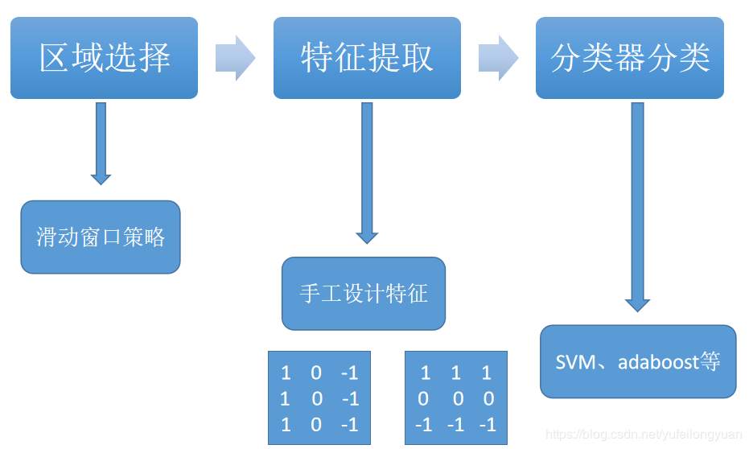

# **第二单元 深度学习在人工智能中的应用**
## 深度学习应用
自动驾驶技术中，正确识别周围环境的技术尤为重要。这是因为要正确识别时刻变化的环境、自由来往的车辆和行人是非常困难的。在识别周围环境的技术中心，深度学习的力量备受期待。比如，基于CNN的神经网络SegNet,可以像下图那样高精度地识别行驶环境在某种程度上正确地识别了道路、建筑物、人行道、树木、车辆等。可见，今后若能基于深度学习使这种技术进一步实现高精度化、高速化的话，自动驾驶的实用化可能也就没那么遥远。

# 第六单元 目标检测
## 讨论目标检测应用的过程以及关键问题
(1) 与分类任务不同，目标检测需要框出指定的区域，有相关paper直接使用回归的方法得到区域的位置，但实际应用起来效果并不好；另外，有方法直接使用滑窗加深度学习的方法，不过这一类方法通常网络层次并不深，主要考虑到的是一旦网络层次加深，最后输出的特征图对应的原始图像的感受野太大，造成检测精度不高；
(2) 一个更好地解决方案是是使用所谓“区域建议(region proposal)”的方法给出一堆候选区域，这些候选区域能够先过滤掉那些大概率不包含物体的区域，然后选择一个深度神经网络抽取特征；
(3) 一旦抽取特征之后可以设计一个SVM分类器，即对每一个类别的物体都看成是一个单独的二元分类问题；
(4) 最后使用回归的方法对包含物体的bounding box进行回归，回归的目的是修正bounding box的偏差。
# 第七单元 注意力机制
## 举例生成对抗网络的应用
生成对抗网络（GAN）是生成模型的一种神经网络架构。
生成模型指在现存样本的基础上，使用模型来生成新案例，比如，基于现存的照片集生成一组与其相似却有细微差异的新照片。
GAN是使用两个神经网络模型训练而成的一种生成模型。其中一个称为“生成器”或“生成网络”模型，可学习生成新的可用案例。另一个称为“判别器”或“判别网络”，可学习判别生成的案例与实际案例。
两种模型（从博弈论的意义上来说）处于一种竞争状态，生成器企图愚弄判别器，而判别器则要同时处理生成案例和实际案例
- 生成图像数据集案例
- 生成人脸照片
- 生成动画角色
- 文字-图片转化
- 图片修复
- 3D打印
- 
# 第八单元 注意力机制
## 简要说明采用Seq2Seq模型实现机器翻译的原理
解码器是另一个RNN，它接收编码器输出向量并输出一个字序列来创建翻译。
在最简单的seq2seq解码器中，我们只使用编码器的最后一个输出。 这个最后的输出有时被称为上下文向量，因为它从整个序列编码上下文。 该上下文向量被用作解码器的初始隐藏状态。如果仅在编码器和解码器之间传递上下文向量，则该单个向量承担编码整个句子的负担。注意力(Attention Decoder)允许解码器网络针对解码器自身输出的每一步“聚焦”编码器输出的不同部分。首先我们计算一组注意力权重。 这些将被乘以编码器输出矢量以创建加权组合。
# 第九单元 深度学习应用
## 总结深度学习（目标检测或图像分类）项目的过程
 **传统目标检测**

**目标检测**
