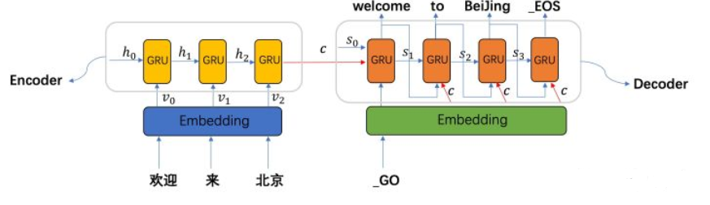

## 作业1 请举例分析BP神经网络的应用
BP(back propagation)神经网络是1986年由Rumelhart和McClelland为首的科学家提出的概念，是一种按照误差逆向传播算法训练的多层前馈神经网络，是应用最广泛的神经网络。BP网络是在输入层与输出层之间增加若干层(一层或多层)神经元，这些神经元称为隐单元，它们与外界没有直接的联系，但其状态的改变，则能影响输入与输出之间的关系，每一层可以有若干个节点。

在人工神经网络的实际应用中，绝大部分的神经网络模型都采用BP网络及其变化形式。它也是前向网络的核心部分，体现了人工神经网络的精华。
  * BP网络主要用于以下四个方面：
    1)函数逼近：用输入向量和相应的输出向量训练一个网络逼近一个函数。
    2)模式识别：用一个待定的输出向量将它与输入向量联系起来。
    3)分类：把输入向量所定义的合适方式进行分类。
    4)数据压缩：减少输出向量维数以便于传输或存储。
* 电气工程中的应用：
    以BP神经网络在变压器的故障诊断中的应用为例，直接利用传统的BP神经网络当网络模型达到一定的深度时，会遇到性能瓶颈。因此，对传统的BP模型进行了改进。例如，基于残差 BP神经网络的变压器故障诊断方法被提出，方法中采用堆叠多个残差网络模块的方式加深 BP神经网络的深度，将传统 BP神经网络的恒等映射学习转化为残差BP神经网络中的残差学习。同时，在每个残差网络模块中， 模块的输入信息可以在模块内跨层传输， 使得每个模块的输入信息可以更好地向深层网络传递，从而在小样本数据下仍可以训练得到较好的诊断模型。可见，这样的改进一方面提升了诊断性能，同时也能够适用于小样本情况。

## 作业2 举例说明深度学习的应用
深度学习是机器学习的一个方向，是学习样本数据的内在规律和表示层次，最终目标是让机器能够像人一样具有分析学习能力，能够识别文字、图像和声音等数据。

* 深度学习在乳腺癌诊断中的应用
  针对从原发部位扩散转移到附近淋巴结的癌症的检测，是病理检查过程中至关重要，但也举步维艰的一环。大多数癌症都涉及到淋巴结转移的检测，这项检测则成为了被广泛采用的 TNM 癌症分期的基础诊断依据之一。特别是在乳腺癌中，淋巴结转移会影响关于放射治疗、化疗以及可能需要手术切除额外淋巴结等情况的治疗决策。因此，对淋巴结转移进行准确、及时地识别对临床护理具有重要影响。
* 深度学习在皮肤病诊断中的应用
  在“用于鉴别诊断皮肤病的深度学习系统”中，我们开发了一种深度学习系统（DLS），以解决初级保健中最常见的皮肤状况。我们的研究结果表明，当提供有关患者病例（图像和元数据）的相同信息时，DLS可以在26种皮肤状况下获得较为准确的判断，与美国董事会认证的皮肤科医生相同。本研究强调了DLS有可能增强没有额外专业训练的全科医生准确诊断皮肤状况的能力。
* 深度学习的一些工业应用
  随着机器视觉，工业自动化的快速发展，工业4.0的概念已经被提上日程。传统很多需要人工来手动操作的工作，渐渐的被机器所替代。这当然也是人类科技进步和发展的必然趋势，工业的进步到头来还是服务于人类，给人类带来高质量的生活体验，而不是整天做着乏味无趣的工作。

  随着机器学习， 深度学习的发展，很多人眼很难去直接量化的特征， 深度学习可以搞定， 这就是深度学习带给我们的优点和前所未有的吸引力。很多特征我们通过传统算法无法量化，或者说很难去做到的， 深度学习可以搞定。特别是在图像分类， 目标检测这些问题上取得了显著的提升。
* 深度学习在医学上的成功应用
  用于图像处理的典型CNN架构由一系列卷积网络组成，其中包含有一系列数据缩减即池化层。与人脑中的低级视觉处理一样，卷积网络检测提取图像特征，例如可能表示直边的线或圆（例如器官检测）或圆圈（结肠息肉检测），然后是更高阶的特征，例如局部和全局形状和纹理特征提取[3]。CNN的输出通常是一个或多个概率或种类标签。
  - 病变检测
    计算机辅助检测（CAD）是医学图像分析的有待完善的领域，并且非常适合引入深度学习。在CAD 的标准方法中，一般通过监督方法或经典图像处理技术（如过滤和数学形态学）检测候选病变位置。
  - 图像分割
    医学图像分割就是一个根据区域间的相似或不同把图像分割成若干区域的过程。目前，主要以各种细胞、组织与器官的图像作为处理的对象。
  - 图像配准
    图象配准是图象融合的前提，是公认难度较大的图象处理技术，也是决定医学图象融合技术发展的关键技术。在临床诊断中，单一模态的图像往往不能提供医生所需要的足够信息，常需将多种模式或同一模式的多次成像通过配准融合来实现感兴趣区的信息互补。
  - 图像融合
    图像融合的主要目的是通过对多幅图像间的冗余数据的处理来提高图像的可读性，对多幅图像间的互补信息的处理来提高图像的清晰度。多模态医学图像的融合把有价值的生理功能信息与精确的解剖结构结合在一起，可以为临床提供更加全面和准确的资料。

随着医疗技术和计算机科学的蓬勃发展，对医学图象处理提出的要求也越来越高。有效地提高医学图象处理技术的水平，与多学科理论的交叉融合，医务人员和理论技术人员之间的交流就显得越来越重要。医学图象处理技术作为提升现代医疗诊断水平的有力依据, 使实施风险低、创伤性小的手术方案成为可能，必将在医学信息研究领域发挥更大的作用。

## 作业3 举例说明卷积神经网络的应用
卷积神经网络（ CNN）是一种 前馈神经网络，它的人工神经元可以响应一部分覆盖范围内的周围单元，对于大型图像处理有出色表现。它包括卷积层和池层。

CNN的基本结构包括两层，其一为特征提取层，每个神经元的输入与前一层的局部接受域相连，并提取该局部的特征。一旦该局部特征被提取后，它与其它特征间的位置关系也随之确定下来；其二是特征映射层，网络的每个计算层由多个特征映射组成，每个特征映射是一个平面，平面上所有神经元的权值相等。

CNN主要用来识别位移、缩放及其他形式扭曲不变性的二维图形。由于CNN的特征检测层通过训练数据进行学习，所以在使用CNN时，避免了显示的特征抽取，而隐式地从训练数据中进行学习；再者由于同一特征映射面上的神经元权值相同，所以网络可以并行学习，这也是卷积网络相对于神经元彼此相连网络的一大优势。卷积神经网络以其局部权值共享的特殊结构在语音识别和图像处理方面有着独特的优越性，其布局更接近于实际的生物神经网络，权值共享降低了网络的复杂性，特别是多维输入向量的图像可以直接输入网络这一特点避免了特征提取和分类过程中数据重建的复杂度。

* 卷积神经网络之计算机视觉应用（卷积神经网络在图像上的应用）
  
## 作业4 讨论卷积神经网络在实际应用过程中可能碰到的问题以及解决方法
* 可能碰到的问题：
  在实际应用过程中，遮挡人脸的情况下，按照传统思路训练出的人脸识别模型，精度都会出现大幅下降。
* 解决办法：
  从算法模型上突围，采用眼部特征与整体人脸特征的融合，并结合注意力机制增强眼部特征，通过自研的轻量级网络，单独训练眼部关键点的模型，来提升模型在口罩遮挡下的人脸识别率。计算机视觉中的注意力机制与人类视觉的选择性类似，核心目标也是从众多信息中获取最相关的信息。佩戴口罩的人脸中眼睛成为了人脸识别的关键信息，基于口罩的人脸识别采用眼部关键点和注意力机制相结合的方法来增强眼部特征，眼部特征图与整体人脸特征图的多级融合，充分挖掘人脸的有效信息，提升模型在口罩遮挡情况下的表现。

## 作业5 阅读相关资料，总结循环神经网络处理语音识别应用的过程。
全连接网络和卷积网络在运行时每次接收的都是独立的输入数据，没有记忆能力。在有些应用中需要神经网络具有记忆功能，典型的是时间序列预测问题，时间序列可以抽象的表示为一个向量序列。这里的下标表示时刻，神经网络每个时刻接收一个向量输入。不同时刻的向量之间存在关系，每个时刻的向量与更早时刻的向量相关。例如，在说话时当前要说的词和之前所说的词之间相关，依赖于上下文语境。我们需要根据输入序列来产生输出向量。这类问题称为序列预测问题，输入序列的长度可能不固定。语音识别与自然语言处理的问题是这类序列预测问题的典型代表。前者的输入是一个时间序列的语音信号；后者是文字序列。

* 循环层的工作原理

  循环神经网络（简称RNN）会记住网络在上一个时刻的输出值，并将该值用于当前时刻输出值的生成，这由循环层实现。RNN的输入为前面介绍的向量序列，每个时刻接收一个输入，网络会产生一个输出，而这个输出是由之前的序列共同作用决定的。假设 t 时刻 循环层的状态值为ht，它由上一时刻的状态值以及当前时刻的输入值共同决定。现在的问题是确定这个表达式的具体形式，即将上一时刻的状态值与当前时刻的输入值整合到一起。在全连接神经网络中，神经元的输出值是对输入值进行加权，然后用激活函数进行作用，得到输出。在这里，我们可以对上一时刻的状态值，当前时刻的输入值进行类似的处理，即将它们分别都乘以权重矩阵，然后整合起来。整合可以采用加法，也可以采用乘法或者更复杂的运算，最简单的是加法，乘法在数值上不稳定，多次乘积之后数为变得非常大或者非常小。显然，这里需要两个权重矩阵，分别作用于上一时刻状态值，当前时刻的输入值，由此得到递推关系式。
* 网络结构
  最简单的循环神经网络由一个输入层，一个循环层，一个输出层组成。输出层接收循环层的输出值作为输入并产生输出，它不具有记忆功能。输出层实现的变换，函数g的类型根据任务而定，对于分类任务一般选用softmax函数，输出各个类的概率。结合循环层和输出层，循环神经网络完成的变换，在这里只使用了一个循环层和一个输出层，实际使用时可以有多个循环层，即深度循环神经网络。
* 深层网络
  上面介绍的循环神经网络只有一个输入层，一个循环层和一个输出层，这是一个浅层网络。和全连接网络以及卷积网络一样，我们可以把它推广到任意多个隐含层的情况，得到深度循环神经网络。
  这里有3种方案，第一种方案为Deep Input-to-Hidden Function，在循环层之前加入多个普通的前馈层，将输入向量进行多层映射之后再送入循环层进行处理。第二种方案是Deep Hidden -to-Hidden Transition，它使用多个循环层，这和前馈型神经网络类似，唯一不同的是计算隐含层输出的时候需要利用本隐含层在上一个时刻的输出值。第三种方案是Deep Hidden-to-Output Function，它在循环层到输出层之间加入多前馈层，这和第一种情况类似。由于循环层一般用tanh作为激活函数，层次过多之后会导致梯度消失问题，和残差网络类似，可以采用跨层连接的方案。在语音识别、自然语言处理问题上，我们会看到深层循环神经网络的应用，实验结果证明深层网络比浅层网络有更好的精度。
* 训练算法
  前面我们介绍了循环神经网络的结构，接下来要解决的问题是网络的参数如何通过训练确定。由于循环神经网络的输入是时间序列，因此每个训练样本是一个时间序列，包含多个相同维度的向量。解决循环神经网络训练问题的算法是Back Propagation Through Time算法，简称BPTT，原理和标准的反向传播算法类似，都是建立误差项的递推公式，根据误差项计算出损失函数对权重矩阵、偏置向量的梯度值。不同的是，全连接神经网络中递推是在层之间建立的，而这里是沿着时间轴建立的。

## 作业6 阅读资料，以是否带口罩检测情境应用为例，讨论目标检测应用的过程以及关键问题
* 目标检测应用的过程
    1.	训练目标检测模型，最重要的合理的设置anchor的大小和宽高比，在我们标注的口罩人脸数据集上，我们读取了所有人脸的标注信息，并计算每个人脸高度与宽度的比值。因为人脸的一般是长方形的，而很多图片是比较宽的，例如16:9的图片，人脸的宽度和高度归一化后，有很多图片的高度是宽度的2倍甚至更大。从上图也可以看出，归一化后的人脸高宽比集中在1~2.5之间。所以，根据数据的分布，我们将五个定位层的anchor的宽高比统一设置为1，0.62, 0.42。
    2.	整理数据集，标注数据。
    3.	使用Keras训练好模型后，我们将其转换为TensorFlow.js格式，并使用JavaScript对口罩人脸检测模型进行了部署。
* 关键问题
    1.	确定算法
    在深度学习时代之前，人脸检测一般采用传统的、基于手动设计特征的方法，其中最知名的莫过于Viola-Jones算法，至今部分手机和数码相机内置的人脸检测算法，仍旧采用Viola-Jones算法。然而，随着深度学习技术的蓬勃发展，基于深度学习的人脸检测算法逐步取代了传统的计算机视觉算法。
    其实，基于深度学习的人脸检测算法，多数都是基于深度学习目标检测算法进行的改进，或者说是把通用的目标检测模型，为适应人脸检测任务而进行的特定配置。而众多的目标检测模型（Faster RCNN、SSD、YOLO）中，人脸检测算法最常用的是SSD算法，例如知名的SSH模型、S3FD模型、RetinaFace算法，都是受SSD算法的启发，或者基于SSD进行的任务定制化改进。
    2.	避免使用手挡住嘴巴就会欺骗部分口罩检测系统的情况
    我们在数据集中加入了部分嘴巴被手捂住的数据，另外，我们还在训练的过程中，随机的往嘴巴部分粘贴一些其他物体的图片，从而避免模型认为只要露出嘴巴的就是没戴口罩，没露出嘴巴的就是带口罩这个问题。

##  作业7 举例说明生成对抗网络的应用
应用案例可划分为以下18种类型：生成图像数据集案例生成人脸照片生成现实照片生成动画角色图像转换文字-图片转化语义图像-图片转化生成正面人像图片生成新体态图片转表情图片编辑面部老化图片混合超分辨率图片修复服装转化视频预测3D打印
* 图像转换
  - 成对样本
        Context Encoder：上下文编码器来根据缺失图像周围的像素来修补缺失部分。训练上下文编码器时，需要构造标准的逐像素重构误差和对抗损失误差。利用对抗损失误差，该上下文自编码器能够很好的修复缺失部分的语义信息。
        Pix2Pix：可以看成将X领域的图像转换成Y领域的图像，是一种有监督的方法
        PAN：同样是图像转换，PAN（Perceptual Adversarial Networks）不像Pix2Pix使用CGAN的框架，而是利用生成对抗损失和感知对抗损失来作为网络的损失函数。通过最小化判别器的感知信息差异来训练转移网络（生成网络）。该论文与上下文自编码器和Pix2Pix进行对比，并证明该网络的优秀性能。
  - 非成对样本：非成对样本之间的图像转换即给定两个领域的非成对数据，通过无监督的形式学习领域间的映射关系。
        CycleGAN, DiscoGAN, DualGAN：采用两个生成器和两个判别器，几乎采用同样的思路来解决非成对样本之间的映射关系。
        DistanceGAN：该网络相比CycleGAN，舍弃了cyclic consistency loss，而是使用了distance preserving loss，其思想在于X域中的样本距离在Y域中应当保留，即如果A的两幅图通过GAB映射到B中，那么映射后的两幅图在之间的距离应该保持，不容易发生模式崩塌。
* 半监督学习
半监督学习通常使用无标签和有标签的数据来分类。
  - CatGAN：CatGAN相比于原始GAN，其思想就是判别网络D最后加一层softmax，将生成的数据不再判别真假，而是将其判别为属于某个确定类的概率，或者从生成网络G的角度讲，生成的数据不是尽可能真的数据，而是生成K个类别中的确切样本。
  - SSL_GAN：SSL_GAN（semi-supervised learning GAN）利用CC_GAN（context-conditional GAN）进行半监督学习，CC_GAN的生成器输入缺失图像块的图像，判别器将完整图像判别为真，将缺失图像块的图像判别为假。
  - Triple-GAN：半监督学习的GAN网络存在以下两个问题：1）判别器D有两个不兼容的收敛点，一是判别生成图像真假的收敛点，二是分辨类标的收敛点；2）生成器会生成没有确定类标的图像。而Triple-GAN可以解决上述问题。Triple-GAN由三个部分组成：生成器G、判别器D以及分类器C。G在类标Yg的前提下生成相应的图像Xg，C计算生成数据（Xg，Yg）和有标签数据（Xl,Yl）的交叉熵并预测无标签数据Xc的类别Yc。D将有标签的真实数据（Xl,Yl）判别为真，将生成的数据（Xg,Yg）以及无标签的数据（Xc，Yc）判别为假。

## 作业8 简要说明采用Seq2Seq模型实现机器翻译的原理
Seq2Seq模型是输出的长度不确定时采用的模型，这种情况一般是在机器翻译的任务中出现，将一句中文翻译成英文，那么这句英文的长度有可能会比中文短，也有可能会比中文长，所以输出的长度就不确定了。

seq2seq属于encoder-decoder结构的一种，这里看看常见的encoder-decoder结构，基本思想就是利用两个RNN，一个RNN作为encoder，另一个RNN作为decoder。encoder负责将输入序列压缩成指定长度的向量，这个向量就可以看成是这个序列的语义，这个过程称为编码，获取语义向量最简单的方式就是直接将最后一个输入的隐状态作为语义向量C。也可以对最后一个隐含状态做一个变换得到语义向量，还可以将输入序列的所有隐含状态做一个变换得到语义变量。而decoder则负责根据语义向量生成指定的序列，这个过程也称为解码，最简单的方式是将encoder得到的语义变量作为初始状态输入到decoder的RNN中，得到输出序列。可以看到上一时刻的输出会作为当前时刻的输入，而且其中语义向量C只作为初始状态参与运算，后面的运算都与语义向量C无关。

目前Seq2Seq模型在机器翻译，语音识别，文本摘要，问答系统等领域取得了巨大的成功。如图1所示，Seq2Seq其实就是Encoder-Decoder结构的网络，它的输入是一个序列，输出也是一个序列。在Encoder中，将序列转换成一个固定长度的向量，然后通过Decoder将该向量转换成我们想要的序列输出出来。Encoder和Decoder一般都是RNN，通常为LSTM或者GRU，图中每一个方格都为一个RNN单元。

## 作业9 总结深度学习（目标检测或图像分类）项目的过程
前提：胸部计算机断层扫描（CT）图像在对新冠肺炎（COVID-19）提供准确、快速、廉价的筛查和检测方面很有前景。目前核酸检测存在的最大问题：速度慢且稀缺，追不上新冠肺炎的传播速度。

* 构建COVID-CT数据集，训练深度学习模型诊断新冠肺炎
  研究团队构建了一个COVID-CT数据集，其中包含275个新冠肺炎检测呈阳性的CT图像，并向公众开放，以助于基于CT图像的新冠肺炎检测的研发。

  研究团队从760个关于新冠肺炎的medRxiv和bioRxiv预印本中提取了 CT图像，并通过阅读这些图像的标题人工筛选出具有新冠肺炎临床病症的图像。基于183个新冠肺炎 CT图像和146个非新冠肺炎 CT图像，研究团队训练了一个深度学习模型，以预测一个CT图像是否呈新冠肺炎阳性。

  在35个新冠肺炎 CT图像和34个非新冠肺炎 CT图像上进行了测试，研究团队的模型F1值为0.85。结果表明，CT扫描有望用于筛选和检测新冠肺炎，然而还需要更先进的方法来进一步提高准确性。
* 
