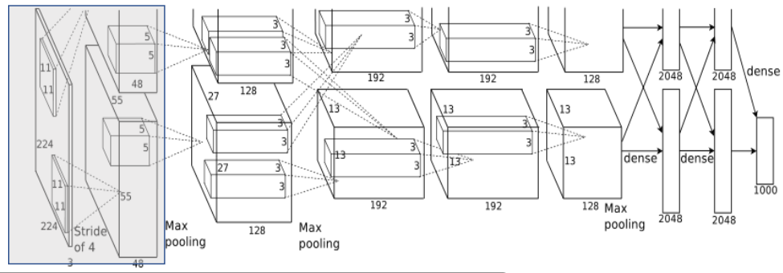
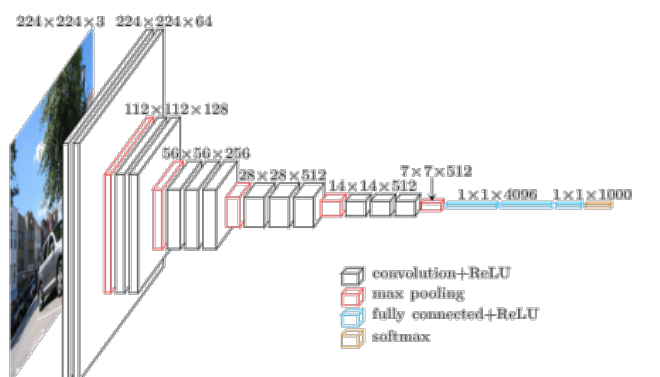

# **神经网络的基本工作原理**
>## 神经网络和深度学习

+ 神经网络：一种可以通过观测数据使计算机学习的仿生语言范例
+ 深度学习：一组强大的神经网络学习技术
  
```
神经网络和深度学习目前提供了针对图像识别，语音识别和自然语言处理领域诸多问题的最佳解决方案。传统的编程方法中，我们告诉计算机如何去做，将大问题划分为许多小问题，精确地定义了计算机很容易执行的任务。而神经网络不需要我们告诉计算机如何处理问题，而是通过从观测数据中学习，计算出他自己的解决方案。
```
## 神经网络的基本工作原理简介
神经网络由基本的神经元组成，下图就是一个神经元的数学/计算模型，便于我们用程序来实现。

1. **输入input** $\rightarrow$ 
(x1,x2,x3) 是外界输入信号，一般是一个训练数据样本的多个属性
2. **权重 weights** $\rightarrow$
(w1,w2,w3) 是每个输入信号的权重值。当然权重值相加之后可以不是1。
3. **偏移 bias** $\rightarrow$
从生物学上解释，在脑神经细胞中，一定是输入信号的电平/电流大于某个临界值时，神经元细胞才会处于兴奋状态，这个b实际就是那个临界值。当
$$w1 \cdot x1 + w2 \cdot x2 + w3 \cdot x3 >= t$$    
时，该神经元细胞才会兴奋。我们把t挪到等式左侧来，变成$(-t)$，然后把它写成b，变成了：
$$w1 \cdot x1 + w2 \cdot x2 + w3 \cdot x3 + b >= 0$$
4. **激活函数 activation** $\rightarrow$
求和之后，神经细胞已经处于兴奋状态了，已经决定要向下一个神经元传递信号了，但是要传递多强烈的信号，要由激活函数来确定：
$$A=a{(Z)}$$
5. **线性模型 linear model**   
在现实世界中，绝大部分问题是无法线性分割的。如果我们不运用**激活函数**的话，则输出信号将仅仅是一个简单的**线性函数**。我们需要激活函数帮助我们理解和学习其他复杂类型的数据。

6. **反向传播算法 Back propagation algorithm**
反向传播算法实现了一个迭代的过程，每次迭代开始的时候，先取一部分训练数据，通过前向传播算法。 
得到神经网络的预测结果。因为训练数据都有正确的答案，所以可以计算出预测结果和正确答案之间的差距。   
基于这个差距，反向传播算法会相应的更新神经网络参数的取值，使得和真实答案更加接近。

##  神经网络的训练过程
神经网络训练的过程可以分为三个步骤:
1. 定义神经网络的结构和前向传播的输出结果
2. 定义损失函数以及选择反向传播优化的算法
3. 生成会话并在训练数据上反复运行反向传播优化算法
### 单层神经网络模型
```
这是一个单层的神经网络，有m个输入 (这里m=3)，有n个输出 (这里n=2)。
在单个神经元里，b是个值。但是在神经网络中，我们把b的值永远设置为1，而用b到每个神经元的权值来表示实际的偏移值，亦即(b1,b2)，这样便于矩阵运算。
也有些作者把b写成x0，其实是同一个意思，只不过x0用于等于1。
```
- $(x1,x2,x3)$是一个样本数据的三个特征值
- $(w11,w12,w13)$是$(x1,x2,x3)$到$n1$的权重
- $(w21,w22,w23)$是$(x1,x2,x3)$到$n2$的权重
- $b1$是$n1$的偏移
- $b2$是$n2$的偏移

```
对于n1来说，x1，x2，x3输入的权重也是不相同的，因为它要对不同特征有选择地接纳。
如同上面的例子，n1对于代表红色的x1，肯定是特别重视，权重值较高；而对于代表蓝色的x3，尽量把权重值降低，才能有正确的输出。
```
>### 训练流程


**前提条件**
  1. 备好训练数据
  2. 我们已经根据数据的规模、领域，建立了神经网络的基本结构
  3. 定义好损失函数来合理地计算误差
**步骤**

|Id|x1|x2|x3|Y|
|---|---|---|---|---|
|1|0.5|1.4|2.7|3|
|2|0.4|1.3|2.5|5|
|3|0.1|1.5|2.3|9|
|4|0.5|1.7|2.9|1|
其中，x1，x2，x3是每一个样本数据的三个特征值，Y是样本的真实结果值：
1. 随机初始化权重矩阵，可以根据高斯分布或者正态分布等来初始化。
2. 拿一个或一批数据作为输入，带入权重矩阵中计算，再通过激活函数传入下一层，最终得到预测值。在本例中，我们先用Id-1的数据输入到矩阵中，得到一个A值，假设A=5
3. 拿到Id-1样本的真实值Y=3
4. 计算损失，假设用均方差函数   
     $Loss = (A-Y)^2=(5-3)^2=4$
5. 根据一些神奇的数学公式（反向微分），把Loss=4这个值用大喇叭喊话，告诉在前面计算的步骤中，影响A=5这个值的每一个权重矩阵，然后对这些权重矩阵中的值做一个微小的修改（当然是向着好的方向修改，这一点可以用数学家的名誉来保证）
6. 用Id-2样本作为输入再次训练（goto 2）
7. 这样不断地迭代下去，直到以下一个或几个条件满足就停止训练：损失函数值非常小；迭代了指定的次数；计算机累吐血了......

训练完成后，我们会把这个神经网络中的结构和权重矩阵的值导出来，形成一个计算图（就是矩阵运算加上激活函数）模型，然后嵌入到任何可以识别/调用这个模型的应用程序中，根据输入的值进行运算，输出预测值。

>## 神经网络中的矩阵运算

下面这个图是一个两层的神经网络，包含隐藏层和输出层，输入层不算做一层
>
>
>## 神经网络的主要功能
- **回归/拟合 Regression/fitting**
- **分类 Classification**   

单层的神经网络能够模拟一条二维平面上的直线，从而可以完成线性分割任务。而理论证明，两层神经网络可以无限逼近任意连续函数。

|拟合|分类|
|---|---|
|||
>## 激活函数

激活函数就相当于关节。看以下的例子：
$$Z1 = W1 \cdot X + B1$$
$$Z2 = W2 \cdot Z1 + B2$$
$$Z3 = W3 \cdot Z2 + B3$$
展开：
$$Z3=W3 \cdot(W2 \cdot (W1 \cdot X+B1)+B2)+B3$$
$$=(W3W2W1) \cdot X+ (W3W2B1+W3B2+B3)$$
$$=W \cdot X+B$$
$Z1,Z2,Z3$分别代表三层神经网络。最后可以看到，不管有多少层，总可以归结到WX+B的形式，这和单层神经网络没有区别。   
我们希望我们的神经网络不仅仅可以学习和计算线性函数，而且还要比这复杂得多。同样是因为没有激活函数，我们的神经网络将无法学习和模拟其他复杂类型的数据，例如图像、视频、音频、语音等。这就是为什么我们要使用人工神经网络技术，诸如深度学习（Deep learning），来理解一些复杂的事情，一些相互之间具有很多隐藏层的非线性问题，而这也可以帮助我们了解复杂的数据。

>#### Sigmoid激活函数

**sigmoid**是平滑（smoothened）的阶梯函数（step function），可导（differentiable）。sigmoid可以将任何值转换为0~1概率，用于二分类。

当使用sigmoid作为激活函数时，随着神经网络隐含层（hidden layer）层数的增加，训练误差反而加大。表现为：
+ 靠近输出层的隐含层梯度较大，参数更新速度快，很快就会收敛；
+ 靠近输入层的隐含层梯度较小，参数更新速度慢，几乎和初始状态一样，随机分布；
+ 在含有四个隐藏层的网络结构中，第一层比第四层慢了接近100倍！

sigmoid缺点：
- 激活函数的计算量较大，在反向传播中，当求误差梯度时，求导涉及除法；
- 在反向传播中，容易就会出现梯度消失，无法完成深层网络的训练；
- 函数的敏感区间较短，(-1,1)之间较为敏感，超过区间，则处于饱和状态，
>#### relu激活函数

**relu**，即Rectified Linear Unit，整流线性单元，激活部分神经元，增加稀疏性，当x小于0时，输出值为0，当x大于0时，输出值为x.   

relu对比于sigmoid：

* sigmoid的导数，只有在0附近，具有较好的激活性，而在正负饱和区的梯度都接近于0，会造成梯度弥散；而relu的导数，在大于0时，梯度为常数，不会导致梯度弥散。
* relu函数在负半区的导数为0 ，当神经元激活值进入负半区，梯度就会为0，也就是说，这个神经元不会被训练，即稀疏性；
* relu函数的导数计算更快，程序实现就是一个if-else语句；而sigmoid函数要进行浮点四则运算，涉及到除法
>#### softmax激活函数

Softmax回归模型是logistic回归模型在多分类问题上的推广，适用于多分类问题中，且类别之间互斥的场合。

Softmax将多个神经元的输出，映射到（0,1）区间内，可以看成是当前输出是属于各个分类的概率，从而来进行多分类。

使用Numpy库对softmax的计算过程表示：

>## 为什么需要深度神经网络与深度学习
1. 卷积神经网络 CNN (Convolutional Neural Networks)

2. 循环神经网络 RNN (Recurrent Neural Networks)

3. AlexNet

4. VGG

5. ResNet

>## Deep Learning的训练过程简介
1. 使用自下上升非监督学习（就是从底层开始，一层一层的往顶层训练）

   采用无标签数据（有标签数据也可）分层训练各层参数，这一步可以看作是一个无监督训练过程，是和传统神经网络区别最大的部分（这个过程可以看作是feature learning过程）。
   具体的，先用无标签数据训练第一层，训练时先学习第一层的参数（这一层可以看作是得到一个使得输出和输入差别最小的三层神经网络的隐层），由于模型capacity的限制以及稀疏性约束，使得得到的模型能够学习到数据本身的结构，从而得到比输入更具有表示能力的特征；在学习得到第n-1层后，将n-1层的输出作为第n层的输入，训练第n层，由此分别得到各层的参数；

2. 自顶向下的监督学习（就是通过带标签的数据去训练，误差自顶向下传输，对网络进行微调）

   基于第一步得到的各层参数进一步fine-tune整个多层模型的参数，这一步是一个有监督训练过程；第一步类似神经网络的随机初始化初值过程，由于deep learning的第一步不是随机初始化，而是通过学习输入数据的结构得到的，因而这个初值更接近全局最优，从而能够取得更好的效果；所以deep learning效果好很大程度上归功于第一步的feature learning过程。