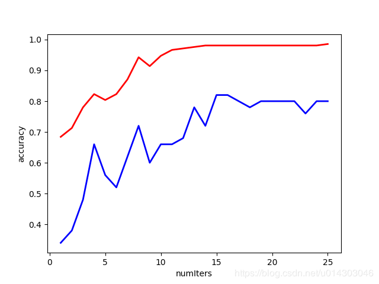

>## BP神经网络在图像压缩中的应用

BP神经网络现在来说是一种比较成熟的网络模型了,因为神经网络对于数字图像处理的先天优势,特别是在图像压缩方面更具有先天的优势。

1:BP神经网络的模型的架构和训练的原理

BP神经网络是现在目前的发展的比较成熟的神经网络之一了,也是一种比较给力的非线性的可微分函数进行权值修正和调整的多层前馈人工神经网络,经得住严密的数学逻辑推导,在很多的模式识别的书中和很多的数据压缩的论文中得以大量的广泛和认同.BP神经网络算法主要的特点是输入信号的正向传递,误差的反向传播.BP网络的学习算法的本质其实就是把样本集合的输入输出问题变换为一个非线性优化的问题.其中分为三层的网络结构,包括输入层,隐藏层,输出层这样的三层.典型的一个网络模型的结构可以由下边的部分构成:

>### BP神经网络的图像压缩原理

数字图像压缩实际上是以较少的比特数有损或者无损的来表示原来像素矩阵的一种图像处理技术,实际上就是减少图像数据中的时间冗余,空间冗余,频谱冗余等等作为目的,从而同过减少上述的一种或者多种冗余的信息而达到更加高效的存储与传输数据.图像的压缩系统其实无论采用什么样的具体的架构或者技术方法,基本的过程都是一致的,主要还是可以概述为编码,量化,解码这三个部分,流程图如下:

从理论上讲,编解码问题其实就可以归结为映射与优化的问题,从神经网络的方面来看无非就是实现了从输入到输出的一个非线性的映射关系,并且衡量性能的标准可以从并行处理能力是否高效,容错率是否合适,以及是否具有鲁棒性.分析图像压缩的基本原理其实和上述的BP神经网络的原理一样:   

   

原始数据节点和重构数据节点构成了节点数较大的外层，而中间的具有较小节点数
的隐含层则构成压缩效果。基本思想是强迫原始数据通过隐含层，并期望在隐含层
处获得较为紧凑的数据表示，以达到压缩的目的。
神经网络用于图像编码的压缩比与输入层和隐含层的节点数有关，一般为: 

          压缩比=输入层节点数(n)/隐含层节点数(m)
实验设计:
- 输入层和输出层节点数设为16，因为实验用于压缩的图像选为128*128的图像，为
避免网络过大造成训练过于复杂，将原始图像分为4*4的小块，每一块作为输入样
本接入网络，所以输入节点应设为16个。输出图像要与原始图像一致， 所以输出节
点也是16个。
- 隐含层节点数由期望达到的压缩比来设定，本实验设为8个。( 压缩比为2)
- 转移函数f(x)选为sogmoid。
- 目标误差为0.001
- 迭代次数为500
       

